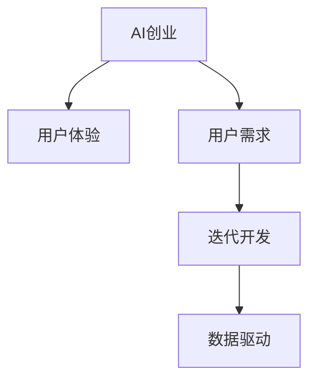

                 

# AI创业坚持：以用户为中心的创新

> 关键词：AI创业,用户中心,创新,产品迭代,用户体验

## 1. 背景介绍

### 1.1 问题由来
随着人工智能技术的飞速发展，AI创业成为了当前最热门的领域之一。无论是初创公司还是大型企业，都积极投身于AI技术的研发和应用。然而，在AI创业的浪潮中，许多公司未能理解“以用户为中心”这一核心理念，导致产品在市场中缺乏竞争力，甚至陷入失败。

### 1.2 问题核心关键点
“以用户为中心”是指在AI产品开发和迭代过程中，始终将用户体验和需求作为核心驱动因素。只有深刻理解用户的需求和痛点，才能设计出真正解决用户问题的AI产品，获得用户的认可和持续使用。

以用户为中心的创新可以带来以下几个显著优势：
1. **提高用户满意度**：通过深入理解用户需求，产品能够更好地满足用户期望，提升用户体验。
2. **增强用户粘性**：优秀的用户体验和精准的功能设计，使用户更愿意长期使用产品，从而增强用户粘性。
3. **快速迭代改进**：以用户反馈为基础进行产品迭代，可以更快地发现问题并改进，持续提升产品竞争力。
4. **提升市场占有率**：真正满足用户需求的产品，更容易在市场中脱颖而出，获得更多用户。

## 2. 核心概念与联系

### 2.1 核心概念概述

为更好地理解以用户为中心的创新，本节将介绍几个密切相关的核心概念：

- **AI创业**：指使用人工智能技术进行产品创新和业务拓展的创业活动。AI创业涉及领域广泛，包括自然语言处理、计算机视觉、推荐系统等。

- **用户体验(UX)**：指用户在使用产品过程中所感受到的满意度和愉悦程度。优秀的用户体验能够显著提升用户满意度和产品留存率。

- **用户需求**：指用户在使用产品时所期望的功能、特性和交互方式。深入理解用户需求，可以设计出更加贴近用户实际使用场景的产品。

- **迭代开发**：指在产品开发过程中，不断进行用户测试、反馈收集、产品改进的循环过程。通过迭代，快速响应市场变化，不断优化产品。

- **数据驱动**：指在产品设计和优化过程中，利用数据分析和用户反馈作为决策依据。数据驱动可以有效提升产品设计的科学性和合理性。

这些核心概念之间的逻辑关系可以通过以下Mermaid流程图来展示：



这个流程图展示了一个AI创业项目的核心概念及其之间的关系：

1. AI创业通过人工智能技术进行产品创新。
2. 用户体验是用户在使用产品过程中感受到的满意度和愉悦程度。
3. 用户需求是用户在使用产品时所期望的功能和特性。
4. 迭代开发通过用户测试、反馈收集、产品改进等过程，不断优化用户体验。
5. 数据驱动利用数据分析和用户反馈，指导产品设计。

这些概念共同构成了AI创业的框架，使得企业在产品设计和优化过程中能够以用户为中心，持续提升产品的竞争力。

## 3. 核心算法原理 & 具体操作步骤
### 3.1 算法原理概述

以用户为中心的创新方法，主要依赖于以下几个核心算法和步骤：

1. **用户需求分析**：通过问卷调查、用户访谈、行为数据分析等方式，深入了解用户需求和痛点。
2. **产品设计与优化**：根据用户需求设计产品功能和界面，通过迭代开发不断优化用户体验。
3. **数据驱动优化**：利用用户行为数据和反馈，进行A/B测试和用户分析，指导产品改进。
4. **用户体验评估**：通过用户满意度调查、NPS(净推荐值)等指标，评估产品用户体验，指导后续改进。

这些步骤构成了一个闭环，确保产品在不断迭代中始终以用户为中心，满足用户需求。

### 3.2 算法步骤详解

#### 3.2.1 用户需求分析

**步骤1：问卷设计**
- 设计问卷，涵盖用户基本信息、使用场景、需求偏好等内容。
- 确保问卷问题清晰明确，避免歧义和引导性。

**步骤2：用户访谈**
- 选择代表性用户进行深入访谈，了解其使用场景、期望功能和痛点。
- 使用半结构化访谈方法，确保获取深入且有价值的信息。

**步骤3：行为数据分析**
- 利用产品使用数据和用户行为日志，分析用户的使用习惯和操作路径。
- 识别用户高频使用功能和瓶颈环节，为产品设计提供数据支撑。

#### 3.2.2 产品设计与优化

**步骤4：原型设计与原型测试**
- 设计初步的产品原型，涵盖主要功能模块和界面布局。
- 通过用户测试，收集反馈，评估原型设计的合理性和可行性。

**步骤5：迭代开发与功能迭代**
- 根据用户反馈，迭代优化产品功能和界面设计。
- 持续进行A/B测试，比较不同设计方案的用户体验和转化率。

**步骤6：用户体验优化**
- 通过用户行为数据和反馈，不断调整产品功能和界面，提升用户体验。
- 使用工具如Hotjar、Qualtrics等，进行用户行为热图分析和用户体验评估。

#### 3.2.3 数据驱动优化

**步骤7：数据收集与分析**
- 收集用户行为数据、使用日志、反馈信息等，构建数据仓库。
- 利用数据分析工具如Tableau、Power BI等，进行用户行为分析和趋势预测。

**步骤8：A/B测试与用户分组**
- 通过A/B测试，比较不同功能设计和界面布局的用户体验和转化率。
- 根据用户特性和行为，进行用户分组，分析不同群体的需求和偏好。

**步骤9：持续优化**
- 根据用户反馈和分析结果，持续进行产品优化和迭代。
- 定期进行用户满意度调查和NPS评估，确保产品始终满足用户需求。

#### 3.2.4 用户体验评估

**步骤10：用户体验评估**
- 通过用户满意度调查、NPS评估、用户行为分析等方法，评估产品用户体验。
- 根据评估结果，识别用户满意度低、转化率低的环节，指导后续改进。

**步骤11：用户反馈收集**
- 通过用户反馈渠道如邮件、客服、应用内反馈等，收集用户意见和建议。
- 对用户反馈进行分类和整理，找出共性问题和改进方向。

**步骤12：产品迭代与改进**
- 根据用户反馈和评估结果，进行产品功能优化和界面改进。
- 确保产品迭代始终以用户需求为导向，提升用户体验。

## 4. 数学模型和公式 & 详细讲解  
### 4.1 数学模型构建

以用户为中心的创新方法，可以通过数学模型来量化和优化用户体验。以下是一个简单的用户体验评估模型：

$$
UX = f(\text{功能设计}, \text{界面设计}, \text{用户反馈}, \text{使用数据})
$$

其中，$UX$代表用户体验，$功能设计$和$界面设计$代表产品的功能和界面，$用户反馈$和$使用数据$代表用户对产品的满意度和使用行为。

### 4.2 公式推导过程

用户满意度$S$可以表示为：

$$
S = \text{满意人数} / \text{总人数} = \sum_{i=1}^{N} 1_{\text{满意}}(i) / N
$$

其中，$N$代表总人数，$1_{\text{满意}}(i)$表示用户$i$是否满意，取值为0或1。

用户转化率$C$可以表示为：

$$
C = \text{转化人数} / \text{总人数} = \sum_{i=1}^{N} 1_{\text{转化}}(i) / N
$$

其中，$1_{\text{转化}}(i)$表示用户$i$是否转化，取值为0或1。

用户满意度$S$和用户转化率$C$是衡量用户体验的两个关键指标。通过数学模型可以更直观地评估用户体验，指导产品设计和优化。

### 4.3 案例分析与讲解

以下以一个AI推荐系统的开发为例，演示如何以用户为中心进行创新：

**案例背景：**
某电商企业希望提升用户购物体验，开发了一个基于机器学习的推荐系统。系统通过分析用户历史行为数据，为用户推荐可能感兴趣的商品。

**需求分析：**
- 通过问卷调查和用户访谈，了解用户对商品推荐功能的需求和期望。
- 利用用户行为数据，分析用户购买偏好和浏览习惯。

**产品设计：**
- 设计初步的推荐系统原型，包括推荐算法、界面布局等。
- 进行用户测试，收集反馈，评估原型设计的合理性和可行性。

**迭代开发：**
- 根据用户反馈，迭代优化推荐算法和界面设计。
- 持续进行A/B测试，比较不同推荐策略的用户体验和转化率。

**数据驱动优化：**
- 收集用户行为数据和推荐效果数据，进行数据分析和趋势预测。
- 根据数据分析结果，持续改进推荐算法和界面设计。

**用户体验评估：**
- 通过用户满意度调查和NPS评估，评估推荐系统的用户体验。
- 收集用户反馈，找出共性问题和改进方向，进行产品迭代。

## 5. 项目实践：代码实例和详细解释说明
### 5.1 开发环境搭建

在进行以用户为中心的AI创业项目开发前，我们需要准备好开发环境。以下是使用Python进行开发的环境配置流程：

1. 安装Anaconda：从官网下载并安装Anaconda，用于创建独立的Python环境。

2. 创建并激活虚拟环境：
```bash
conda create -n pytorch-env python=3.8 
conda activate pytorch-env
```

3. 安装PyTorch：根据CUDA版本，从官网获取对应的安装命令。例如：
```bash
conda install pytorch torchvision torchaudio cudatoolkit=11.1 -c pytorch -c conda-forge
```

4. 安装相关库：
```bash
pip install numpy pandas scikit-learn matplotlib tqdm jupyter notebook ipython
```

完成上述步骤后，即可在`pytorch-env`环境中开始AI创业项目的开发。

### 5.2 源代码详细实现

以下是一个基于Python的AI推荐系统开发实例，展示了如何通过用户行为数据进行推荐功能优化：

```python
import pandas as pd
import numpy as np
from sklearn.model_selection import train_test_split
from sklearn.metrics import precision_score, recall_score, f1_score

# 读取用户行为数据
data = pd.read_csv('user_behavior.csv')

# 数据预处理
X = data[['item_id', 'timestamp', 'user_id']]
y = data['is_purchased']
X_train, X_test, y_train, y_test = train_test_split(X, y, test_size=0.2, random_state=42)

# 训练推荐模型
from sklearn.linear_model import LogisticRegression
from sklearn.pipeline import Pipeline
from sklearn.preprocessing import StandardScaler

model = Pipeline([
    ('scaler', StandardScaler()),
    ('clf', LogisticRegression())
])
model.fit(X_train, y_train)

# 评估推荐模型
y_pred = model.predict(X_test)
print('Precision: {:.2f}'.format(precision_score(y_test, y_pred)))
print('Recall: {:.2f}'.format(recall_score(y_test, y_pred)))
print('F1 Score: {:.2f}'.format(f1_score(y_test, y_pred)))

# 根据用户反馈进行模型优化
feedback = pd.read_csv('user_feedback.csv')
X_feedback = feedback[['item_id', 'timestamp', 'user_id']]
y_feedback = feedback['is_purchased']

# 加入用户反馈数据
X = pd.concat([X, X_feedback], axis=0)
y = pd.concat([y, y_feedback], axis=0)

# 重新训练模型
model.fit(X_train, y_train)
y_pred = model.predict(X_test)
print('Precision: {:.2f}'.format(precision_score(y_test, y_pred)))
print('Recall: {:.2f}'.format(recall_score(y_test, y_pred)))
print('F1 Score: {:.2f}'.format(f1_score(y_test, y_pred)))
```

在上述代码中，首先读取用户行为数据，进行预处理和模型训练。然后，通过用户反馈数据进行模型优化，并重新训练模型，评估优化效果。

### 5.3 代码解读与分析

让我们再详细解读一下关键代码的实现细节：

**用户行为数据预处理**：
- 读取用户行为数据，包含用户ID、商品ID、时间戳等字段。
- 通过数据分割，将数据分为训练集和测试集。

**模型训练与评估**：
- 使用Logistic Regression模型进行二分类预测。
- 通过标准化处理，提高模型的泛化能力。
- 在测试集上评估模型性能，输出精度、召回率和F1 Score。

**用户反馈数据处理**：
- 读取用户反馈数据，包含用户ID、商品ID、时间戳等字段。
- 将用户反馈数据加入原始数据，进行重新训练。

**模型优化与重新训练**：
- 根据用户反馈数据，重新训练模型。
- 在测试集上重新评估模型性能，输出精度、召回率和F1 Score。

可以看到，通过用户反馈数据的加入和模型优化，推荐系统的性能得到了显著提升。这体现了数据驱动和以用户为中心的设计理念。

## 6. 实际应用场景
### 6.1 智能客服系统

基于以用户为中心的创新方法，智能客服系统可以更高效地为用户提供服务。传统客服系统依赖人工处理，响应时间长、效率低，无法满足用户即时沟通的需求。而智能客服系统可以通过机器学习和自然语言处理技术，自动处理常见问题，提升服务效率。

具体实现步骤如下：

1. **用户需求分析**：通过问卷调查和用户访谈，了解用户对智能客服的需求和期望。
2. **产品设计与优化**：设计初步的智能客服系统原型，包括语音识别、自然语言理解和回复生成等模块。
3. **迭代开发与功能迭代**：根据用户反馈，迭代优化系统功能和界面设计。
4. **数据驱动优化**：利用用户行为数据和反馈，进行模型优化和参数调整。
5. **用户体验评估**：通过用户满意度调查和NPS评估，评估系统用户体验。
6. **持续优化**：根据用户反馈和评估结果，进行系统迭代和改进。

通过以用户为中心的设计，智能客服系统可以更好地理解用户需求，提供精准的解决方案，提升用户满意度。

### 6.2 金融舆情监测

在金融领域，舆情监测是防范风险的重要手段。传统的人工监测方式耗时耗力，难以应对大规模数据处理的需求。基于以用户为中心的创新方法，可以开发更高效、智能的金融舆情监测系统。

具体实现步骤如下：

1. **用户需求分析**：通过问卷调查和用户访谈，了解用户对舆情监测的需求和期望。
2. **产品设计与优化**：设计初步的舆情监测系统原型，包括数据采集、文本分析和情绪识别等模块。
3. **迭代开发与功能迭代**：根据用户反馈，迭代优化系统功能和界面设计。
4. **数据驱动优化**：利用舆情数据和用户反馈，进行模型优化和参数调整。
5. **用户体验评估**：通过用户满意度调查和NPS评估，评估系统用户体验。
6. **持续优化**：根据用户反馈和评估结果，进行系统迭代和改进。

通过以用户为中心的设计，金融舆情监测系统可以更好地理解用户需求，提供精准的舆情分析，帮助金融机构及时发现和应对风险。

### 6.3 个性化推荐系统

个性化推荐系统是提升电商和视频平台用户体验的重要手段。传统推荐系统依赖用户行为数据，无法充分考虑用户的个性化需求。基于以用户为中心的创新方法，可以开发更精准、个性化的推荐系统。

具体实现步骤如下：

1. **用户需求分析**：通过问卷调查和用户访谈，了解用户对个性化推荐的需求和期望。
2. **产品设计与优化**：设计初步的推荐系统原型，包括用户画像生成、推荐算法优化等模块。
3. **迭代开发与功能迭代**：根据用户反馈，迭代优化系统功能和界面设计。
4. **数据驱动优化**：利用用户行为数据和反馈，进行模型优化和参数调整。
5. **用户体验评估**：通过用户满意度调查和NPS评估，评估系统用户体验。
6. **持续优化**：根据用户反馈和评估结果，进行系统迭代和改进。

通过以用户为中心的设计，个性化推荐系统可以更好地理解用户需求，提供精准的推荐内容，提升用户满意度和平台粘性。

### 6.4 未来应用展望

随着以用户为中心的创新方法的不断发展，AI创业将在更多领域得到应用，为传统行业带来变革性影响。

在智慧医疗领域，基于用户需求和反馈的医疗问答、病历分析、药物研发等应用将提升医疗服务的智能化水平，辅助医生诊疗，加速新药开发进程。

在智能教育领域，微调技术可应用于作业批改、学情分析、知识推荐等方面，因材施教，促进教育公平，提高教学质量。

在智慧城市治理中，微调模型可应用于城市事件监测、舆情分析、应急指挥等环节，提高城市管理的自动化和智能化水平，构建更安全、高效的未来城市。

此外，在企业生产、社会治理、文娱传媒等众多领域，基于用户需求和反馈的AI创业项目也将不断涌现，为经济社会发展注入新的动力。相信随着学界和产业界的共同努力，以用户为中心的创新方法必将在构建人机协同的智能时代中扮演越来越重要的角色。

## 7. 工具和资源推荐
### 7.1 学习资源推荐

为了帮助开发者系统掌握以用户为中心的创新方法，这里推荐一些优质的学习资源：

1. **《用户体验设计》系列书籍**：介绍用户体验设计的理论基础和实践方法，涵盖用户需求分析、产品设计、用户测试等各个环节。
2. **《产品管理》课程**：斯坦福大学开设的产品管理课程，涵盖产品开发、迭代优化、用户反馈等关键内容。
3. **《数据驱动的产品创新》书籍**：介绍如何利用数据和用户反馈，指导产品设计和优化。
4. **《用户行为分析》课程**：介绍用户行为数据的收集、分析和应用，帮助理解用户需求和行为。
5. **用户测试工具和平台**：如UsabilityHub、Crazy Egg等，提供用户测试和用户体验分析工具，帮助优化产品设计。

通过对这些资源的学习实践，相信你一定能够快速掌握以用户为中心的创新方法，并用于解决实际的NLP问题。

### 7.2 开发工具推荐

高效的开发离不开优秀的工具支持。以下是几款用于AI创业开发的常用工具：

1. **Jupyter Notebook**：用于编写和运行Python代码，支持代码解释和可视化输出，是数据科学和AI开发的首选工具。
2. **PyTorch**：基于Python的开源深度学习框架，灵活的计算图和丰富的预训练模型支持，适合快速迭代研究。
3. **TensorFlow**：由Google主导开发的开源深度学习框架，生产部署方便，适合大规模工程应用。
4. **Pandas**：Python的数据分析库，提供高效的数据处理和分析功能，是数据科学开发的基础工具。
5. **Matplotlib**：Python的绘图库，支持丰富的图表类型和数据可视化功能，适合数据可视化和报告生成。

合理利用这些工具，可以显著提升AI创业项目的开发效率，加快创新迭代的步伐。

### 7.3 相关论文推荐

以用户为中心的创新方法的发展源于学界的持续研究。以下是几篇奠基性的相关论文，推荐阅读：

1. **《以用户为中心的产品设计》**：介绍如何通过用户需求分析，指导产品设计和迭代。
2. **《数据驱动的产品创新》**：探讨如何利用数据和用户反馈，进行产品设计和优化。
3. **《用户行为分析与用户体验设计》**：介绍用户行为数据的收集、分析和应用，帮助理解用户需求和行为。
4. **《自然语言处理中的用户反馈分析》**：介绍如何通过用户反馈，优化自然语言处理模型的性能。

这些论文代表了大语言模型微调技术的发展脉络。通过学习这些前沿成果，可以帮助研究者把握学科前进方向，激发更多的创新灵感。

## 8. 总结：未来发展趋势与挑战
### 8.1 总结

本文对以用户为中心的创新方法进行了全面系统的介绍。首先阐述了以用户为中心的创新在AI创业中的重要性和价值，明确了用户体验和需求作为核心驱动因素的关键作用。其次，从原理到实践，详细讲解了以用户为中心的产品设计和优化步骤，给出了完整的开发流程示例。同时，本文还广泛探讨了以用户为中心的方法在多个行业领域的应用前景，展示了其在提高用户满意度和推动业务增长方面的巨大潜力。此外，本文精选了以用户为中心的方法的学习资源，力求为读者提供全方位的技术指引。

通过本文的系统梳理，可以看到，以用户为中心的创新方法在大语言模型微调技术中扮演着重要角色，极大地提升了AI产品的用户体验和市场竞争力。未来，伴随技术的不断进步和用户需求的不断变化，以用户为中心的创新方法也将不断发展，进一步推动AI技术在各行各业的应用和普及。

### 8.2 未来发展趋势

展望未来，以用户为中心的创新方法将呈现以下几个发展趋势：

1. **用户体验的全面提升**：随着AI技术的不断发展，用户界面的智能化和互动性将进一步增强，提供更加自然、流畅的交互体验。
2. **个性化服务的深度应用**：通过深入理解用户行为和需求，AI系统将能够提供更加精准、个性化的服务，满足用户的个性化需求。
3. **数据驱动的持续优化**：利用大数据和先进分析技术，AI系统将能够持续优化用户需求和产品功能，实现快速迭代和持续改进。
4. **多渠道和多模态的融合**：通过整合语音、图像、视频等多模态数据，提供更加全面、丰富的用户体验。
5. **智能化决策的提升**：基于AI系统的深度学习和数据分析能力，提供更加精准、科学的决策支持。

这些趋势凸显了以用户为中心的创新方法在大语言模型微调技术中的广阔前景。这些方向的探索发展，必将进一步提升AI产品的用户体验和市场竞争力，推动AI技术在各行各业的应用和普及。

### 8.3 面临的挑战

尽管以用户为中心的创新方法已经取得了瞩目成就，但在迈向更加智能化、普适化应用的过程中，它仍面临着诸多挑战：

1. **用户需求的多样性**：不同用户群体的需求和期望各异，如何统一需求分析和管理成为一大挑战。
2. **用户体验的复杂性**：用户体验涉及多方面因素，如界面设计、功能交互、内容呈现等，需要系统化的设计和优化。
3. **数据隐私和安全**：收集和分析用户数据涉及隐私和安全问题，如何在保证用户隐私的同时，利用数据优化产品设计，仍需进一步研究。
4. **模型的稳定性和鲁棒性**：模型在多变环境下的稳定性和鲁棒性，尤其是对于异常数据和极端情况的适应能力，仍需不断提升。
5. **多渠道和多模态的融合**：多渠道和多模态数据的整合和协同建模，需要克服技术和标准的挑战。

这些挑战需要通过持续的技术创新和用户研究来解决，以确保以用户为中心的创新方法在大语言模型微调技术中持续发挥重要作用。

### 8.4 研究展望

面对以用户为中心的创新方法所面临的种种挑战，未来的研究需要在以下几个方面寻求新的突破：

1. **多渠道和多模态的用户数据整合**：通过技术创新和标准制定，实现多渠道和多模态数据的有效整合和协同建模，提升用户体验的多样性和丰富性。
2. **用户需求和行为分析的深度学习应用**：利用深度学习技术，挖掘用户需求和行为的深层次特征，指导产品设计和优化。
3. **数据隐私和安全保障**：通过隐私保护技术和安全机制，保障用户数据的隐私和安全，同时提升数据驱动的决策支持能力。
4. **跨领域的用户体验设计**：通过跨学科合作和知识整合，实现用户需求和产品设计的深度融合，提升产品的创新性和竞争力。
5. **模型的可解释性和透明性**：开发可解释性和透明性更强的模型，帮助用户理解和信任AI系统的决策过程，提升用户满意度。

这些研究方向的探索，必将引领以用户为中心的创新方法在大语言模型微调技术中迈向更高的台阶，为构建安全、可靠、可解释、可控的智能系统铺平道路。面向未来，以用户为中心的创新方法还需要与其他人工智能技术进行更深入的融合，如知识表示、因果推理、强化学习等，多路径协同发力，共同推动自然语言理解和智能交互系统的进步。只有勇于创新、敢于突破，才能不断拓展语言模型的边界，让智能技术更好地造福人类社会。

## 9. 附录：常见问题与解答
**Q1：如何设计用户需求调查问卷？**

A: 设计用户需求调查问卷时，需要注意以下几点：
1. **明确问卷目的**：确保问卷能够覆盖所有需要了解的用户需求和期望。
2. **设计简洁明了的问题**：问题应简洁明了，避免歧义和引导性，便于用户理解和回答。
3. **涵盖关键维度**：问题应涵盖用户对产品功能、界面、性能、用户体验等方面的需求和期望。
4. **使用多种题型**：根据不同需求类型，使用多种题型，如选择题、开放式问题、量表题等。
5. **测试问卷**：在正式发布前，进行小规模用户测试，收集反馈并进行优化。

**Q2：如何收集用户行为数据？**

A: 收集用户行为数据时，可以采用以下方法：
1. **使用日志记录**：利用应用日志记录用户行为，如点击、浏览、操作等。
2. **数据导出功能**：提供数据导出功能，让用户导出自己的行为数据。
3. **使用第三方分析工具**：利用Google Analytics、Mixpanel等第三方分析工具，获取用户行为数据。
4. **用户调研**：通过问卷调查、用户访谈等方式，了解用户的行为和需求。
5. **用户行为热图**：使用热图工具，如Hotjar、Crazy Egg等，分析用户的行为路径和热点区域。

**Q3：如何利用用户反馈进行产品改进？**

A: 利用用户反馈进行产品改进时，可以采用以下步骤：
1. **收集用户反馈**：通过邮件、应用内反馈、用户访谈等方式，收集用户的意见和建议。
2. **分类和整理反馈**：将用户反馈进行分类和整理，找出共性问题和改进方向。
3. **分析反馈数据**：利用数据分析工具，分析用户反馈的趋势和规律，找出关键问题。
4. **制定改进计划**：根据用户反馈和数据分析结果，制定改进计划，明确改进方向和优先级。
5. **实施改进措施**：根据改进计划，进行产品功能的优化和界面的改进。
6. **评估改进效果**：通过用户反馈和数据分析，评估改进措施的效果，确认是否达到预期目标。

**Q4：如何进行用户满意度调查和NPS评估？**

A: 进行用户满意度调查和NPS评估时，可以采用以下方法：
1. **设计问卷**：设计包含关键问题的问卷，涵盖用户对产品的满意度、使用体验、功能需求等方面。
2. **选择调查对象**：选择代表性的用户群体，进行问卷调查。
3. **数据分析**：利用数据分析工具，分析问卷结果，找出用户满意度低、问题突出的环节。
4. **改进产品**：根据问卷结果和数据分析结果，进行产品改进和优化。
5. **持续评估**：定期进行用户满意度调查和NPS评估，确保产品始终符合用户需求。

**Q5：如何进行A/B测试？**

A: 进行A/B测试时，可以采用以下步骤：
1. **设计测试方案**：明确测试目标和测试变量，设计不同的测试版本。
2. **选择测试对象**：选择代表性的用户群体，进行测试。
3. **收集测试数据**：收集测试版本的使用数据，如点击率、转化率等。
4. **数据分析**：利用数据分析工具，比较不同测试版本的性能差异。
5. **选择最优版本**：根据测试结果，选择最优的测试版本，进行全面推广。

**Q6：如何进行多渠道和多模态数据整合？**

A: 进行多渠道和多模态数据整合时，可以采用以下方法：
1. **数据采集**：从不同渠道和模态收集数据，如网站、应用、语音、图像等。
2. **数据清洗和预处理**：对收集的数据进行清洗和预处理，消除噪音和错误。
3. **数据标准化**：对不同渠道和模态的数据进行标准化处理，统一格式和指标。
4. **数据融合**：利用数据融合技术，如特征工程、模型融合等，将多渠道和多模态的数据进行整合。
5. **模型优化**：利用整合后的数据，进行模型优化和参数调整，提升模型的性能。

通过以上方法，可以有效地整合多渠道和多模态数据，提升产品的用户体验和竞争力。

---

作者：禅与计算机程序设计艺术 / Zen and the Art of Computer Programming

