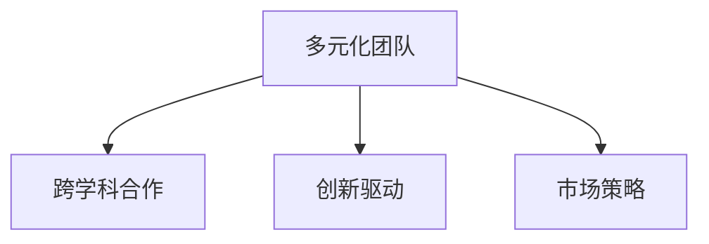

                 

# AI创业：多元化团队的建设

> 关键词：人工智能,团队管理,技术栈,产品化,创新驱动,市场策略

## 1. 背景介绍

### 1.1 问题由来
在当今的商业环境中，AI技术的竞争日趋激烈。创业公司如何在竞争中脱颖而出？一个核心要素便是构建多元化且高效的团队。多元化团队不仅涵盖技术栈的多样性，还包括产品、运营、市场等多个维度的协作。这一背景促成了本文的研究，旨在探讨如何从团队建设的角度，有效提升AI创业公司的竞争力和创新能力。

### 1.2 问题核心关键点
构建高效多元化团队的关键点包括以下几点：
1. **跨学科团队**：涵盖不同领域的专家，如数据科学家、机器学习工程师、软件工程师、产品经理、市场专员等。
2. **团队协同**：确保不同背景的团队成员能够在同一项目上高效协作。
3. **创新驱动**：鼓励团队成员提出新想法，并迅速验证其可行性。
4. **市场策略**：根据市场需求和竞争对手情况，调整产品定位和推广策略。

本文将详细探讨如何构建和管理一个高效、多元化的AI创业团队，并给出具体的实践策略。

## 2. 核心概念与联系

### 2.1 核心概念概述

为更好地理解AI创业团队建设的关键要素，本节将介绍几个核心概念：

- **多元化团队(Multi-disciplinary Team)**：由不同背景、技能和专业知识的人员组成，涵盖技术、产品、市场等多个领域。
- **跨学科合作(Cross-disciplinary Collaboration)**：指不同领域的专家通过沟通和协作，共同完成复杂项目的过程。
- **创新驱动(Innovation-Driven)**：鼓励团队成员提出创新想法，并快速验证其商业价值和可行性。
- **市场策略(Market Strategy)**：根据市场需求和竞争态势，制定和调整产品推广策略。

这些概念之间的逻辑关系可以通过以下Mermaid流程图来展示：



这个流程图展示了一个AI创业团队的多元化构成和关键活动。

## 3. 核心算法原理 & 具体操作步骤
### 3.1 算法原理概述

AI创业团队建设的原理基于系统化的项目管理方法论，包括敏捷开发、精益创业、双模创新等原则。具体来说，包含以下几个步骤：

1. **人员招募**：从多个学科领域招募有经验的专家。
2. **团队组建**：确保每个团队成员都具备必要的技能和知识，能够胜任分配的角色。
3. **协作流程**：建立高效的沟通和协作流程，如每日站会、迭代回顾等。
4. **创新激励**：通过设立奖励机制和创新基金，鼓励成员提出新想法。
5. **市场分析**：定期进行市场调研和竞争分析，调整产品定位和推广策略。

### 3.2 算法步骤详解

以下是详细的团队建设步骤：

**Step 1: 招募合适人才**
- 确定招聘需求，包括技术栈、经验背景、软技能等。
- 在招聘渠道上发布招聘信息，如招聘网站、社交媒体、技术论坛等。
- 筛选简历，进行多轮面试，评估候选人的技术能力和软技能。

**Step 2: 团队组建与角色分配**
- 明确团队目标和项目需求，定义各角色的职责和任务。
- 组建跨学科团队，每个角色至少包括一名专家。
- 设置定期会议，如每日站会、迭代回顾会等，确保团队成员的沟通和协作。

**Step 3: 构建协作流程**
- 使用敏捷开发方法，如Scrum或Kanban，进行迭代开发。
- 建立文档管理系统，确保代码、文档和需求等信息的共享。
- 引入项目管理工具，如Jira、Trello等，进行任务跟踪和进度管理。

**Step 4: 创新激励与市场策略**
- 设立创新奖励机制，如创新基金、奖励计划等，鼓励团队成员提出新想法。
- 定期进行市场调研，分析竞争对手和市场需求，调整产品定位和推广策略。
- 设立市场策略小组，负责制定和执行市场策略，包括产品定价、渠道选择等。

### 3.3 算法优缺点

多元化团队建设的优势：
1. **知识互补**：不同背景的专家能提供多样化的视角，激发创新。
2. **协同效应**：跨学科合作能更高效地解决问题，提升项目质量。
3. **市场敏感**：多元化团队更易捕捉市场机会，调整产品策略。

但该方法也存在以下缺点：
1. **沟通复杂**：不同领域的专家可能有不同的术语和思维方式，沟通成本高。
2. **角色冲突**：不同角色之间可能存在利益冲突，影响团队协作。
3. **文化差异**：跨学科团队成员来自不同的文化和背景，需要一定的磨合期。

### 3.4 算法应用领域

多元化团队建设在AI创业公司中的应用非常广泛，涵盖以下几个主要领域：

1. **技术研发**：涵盖数据科学、机器学习、软件工程等多个技术栈。
2. **产品管理**：包括产品经理、用户体验设计师等，负责产品规划和迭代。
3. **市场与销售**：市场策略师、销售团队等，负责产品和服务的市场推广。
4. **客户支持**：客户服务团队、技术支持团队等，确保客户问题的及时解决。

此外，多元化团队建设还适用于教育、医疗、金融等多个垂直行业，为这些行业带来创新的解决方案。

## 4. 数学模型和公式 & 详细讲解  
### 4.1 数学模型构建

基于项目管理方法论的AI创业团队建设，可以抽象为数学模型：

$$
S = A \times C \times M
$$

其中：
- $S$ 为团队建设得分
- $A$ 为人员招募与匹配得分
- $C$ 为团队协作流程得分
- $M$ 为市场策略与创新激励得分

**Step 1: 人员招募与匹配**
- $A = \sum_{i=1}^{n}a_i$
- $a_i$ 为第 $i$ 个候选人的综合评分

**Step 2: 团队协作流程**
- $C = \sum_{j=1}^{m}c_j$
- $c_j$ 为第 $j$ 个协作流程的执行效果

**Step 3: 市场策略与创新激励**
- $M = \sum_{k=1}^{p}m_k$
- $m_k$ 为第 $k$ 个市场策略或创新激励措施的贡献度

### 4.2 公式推导过程

考虑三个核心模块的构建，通过实际案例来推导数学模型：

**人员招募与匹配**
- 对候选人进行技能、经验和软技能的多维度评估。
- 使用权重 $w_1, w_2, w_3$ 分别对技能、经验和软技能进行加权，得到候选人的综合评分 $a_i = w_1s_i + w_2e_i + w_3c_i$。
- 权重 $w_1, w_2, w_3$ 可依据公司实际需求进行调整。

**团队协作流程**
- 使用敏捷开发、Scrum等方法，通过每日站会、迭代回顾等协作流程，提升团队效率。
- 引入项目管理工具，如Jira、Trello等，对任务进行跟踪和管理。
- 协作流程得分 $c_j = \frac{j_1j_2...j_n}{\sum_{i=1}^{n}j_i}$，其中 $j_i$ 为协作流程的质量和效果。

**市场策略与创新激励**
- 定期进行市场调研，分析竞争对手和市场需求，调整产品定位和推广策略。
- 设立创新奖励机制，如创新基金、奖励计划等，鼓励团队成员提出新想法。
- 市场策略得分 $m_k = \frac{k_1k_2...k_n}{\sum_{i=1}^{n}k_i}$，其中 $k_i$ 为市场策略的效果和创新激励措施的贡献度。

### 4.3 案例分析与讲解

**案例1: Google AI团队**
- Google AI团队是一个典型的高效多元化团队。团队成员涵盖数据科学家、机器学习工程师、软件工程师、产品经理等，每个角色都有一名以上专家。
- Google AI采用敏捷开发方法，通过每日站会、迭代回顾等协作流程，确保团队高效协作。
- 定期进行市场调研和竞争分析，调整产品定位和推广策略。

**案例2: Tesla Autopilot团队**
- Tesla Autopilot团队是一个跨学科合作的典范。团队包括工程师、数据科学家、软件工程师、用户体验设计师等。
- 采用敏捷开发方法，通过每日站会、迭代回顾等协作流程，提升团队效率。
- 设立创新奖励机制，鼓励团队成员提出新想法，推动Autopilot技术的不断创新。

## 5. 项目实践：代码实例和详细解释说明
### 5.1 开发环境搭建

在进行团队建设实践前，我们需要准备好开发环境。以下是使用Python进行团队管理工具的配置流程：

1. 安装Anaconda：从官网下载并安装Anaconda，用于创建独立的Python环境。

2. 创建并激活虚拟环境：
```bash
conda create -n team-env python=3.8 
conda activate team-env
```

3. 安装必要的开发工具：
```bash
pip install pandas numpy matplotlib jupyter notebook ipython
```

4. 引入团队协作管理工具：
```bash
pip install slackapi
pip install jiraapi
```

完成上述步骤后，即可在`team-env`环境中开始团队建设实践。

### 5.2 源代码详细实现

以下是基于Jira和Slack的工具，实现团队协作和沟通的Python代码示例。

```python
# 导入必要的库
import jira
import slack

# 配置Jira和Slack的API信息
JIRA_API_URL = 'https://your-jira-api-url.com'
SLACK_API_TOKEN = 'your-slack-api-token'

# 创建Jira客户端
jira_client = jira.JIRA(JIRA_API_URL, basic_auth=('username', 'password'))

# 获取Jira项目信息
project = jira_client.project('your-project-key')

# 获取项目所有任务列表
issues = jira_client.project(project.key).issues()
for issue in issues:
    print(issue.key)

# 创建Slack客户端
slack_client = slack.WebClient(token=SLACK_API_TOKEN)

# 发送消息到指定频道
response = slack_client.chat_postMessage(channel='your-channel-id', text='Project update: 30 new issues added.')

# 获取消息发送结果
print(response)
```

### 5.3 代码解读与分析

代码实现了基本的团队协作和沟通功能，具体解读如下：

**Jira客户端**：
- 通过`jira.JIRA`类创建Jira客户端，并指定API URL和基本的认证信息。
- 使用`jira_client.project`方法获取项目信息，包括项目名称、ID等。
- 使用`jira_client.project.issues()`方法获取项目所有任务列表，并进行处理。

**Slack客户端**：
- 通过`slack.WebClient`类创建Slack客户端，并指定API Token。
- 使用`slack_client.chat_postMessage`方法发送消息到指定频道。
- 获取消息发送结果，并进行处理。

### 5.4 运行结果展示

使用上述代码，可以实时获取Jira中的任务列表，并将项目更新消息发送到Slack指定频道。这种方式不仅提升了团队协作效率，还保证了信息的实时性和透明度。

## 6. 实际应用场景
### 6.1 智能推荐系统

智能推荐系统需要结合技术、产品、市场等多方面的知识，构建高效的多元化团队至关重要。推荐系统的团队建设可以包含数据科学家、机器学习工程师、软件工程师、产品经理等，通过敏捷开发和持续反馈机制，不断优化推荐算法和产品体验。

**案例1: Netflix推荐系统**
- Netflix的推荐系统是一个跨学科合作的典范。团队包括数据科学家、机器学习工程师、软件工程师、产品经理等。
- 采用敏捷开发方法，通过每日站会、迭代回顾等协作流程，提升团队效率。
- 定期进行市场调研和竞争分析，调整产品定位和推广策略。

**案例2: Amazon推荐引擎**
- Amazon的推荐引擎是一个高效的推荐系统。团队包括数据科学家、机器学习工程师、软件工程师、用户体验设计师等。
- 采用敏捷开发方法，通过每日站会、迭代回顾等协作流程，提升团队效率。
- 设立创新奖励机制，鼓励团队成员提出新想法，推动推荐算法的不断创新。

### 6.2 金融科技(Fintech)

金融科技公司需要构建高效的团队，以应对市场的快速变化和技术的不断演进。金融科技团队建设可以包含数据科学家、机器学习工程师、软件工程师、产品经理、市场专员等，通过敏捷开发和持续反馈机制，不断优化金融产品和服务。

**案例1: Stripe支付系统**
- Stripe的支付系统是一个高效的金融科技平台。团队包括数据科学家、机器学习工程师、软件工程师、产品经理、市场专员等。
- 采用敏捷开发方法，通过每日站会、迭代回顾等协作流程，提升团队效率。
- 定期进行市场调研和竞争分析，调整产品定位和推广策略。

**案例2: Square支付服务**
- Square的支付服务是一个高效的金融科技平台。团队包括数据科学家、机器学习工程师、软件工程师、产品经理、市场专员等。
- 采用敏捷开发方法，通过每日站会、迭代回顾等协作流程，提升团队效率。
- 设立创新奖励机制，鼓励团队成员提出新想法，推动支付服务的不断创新。

## 7. 工具和资源推荐
### 7.1 学习资源推荐

为了帮助团队成员系统掌握团队建设的知识和技能，这里推荐一些优质的学习资源：

1. **《敏捷开发：原理、模式与实践》**：一本系统介绍敏捷开发的经典书籍，涵盖Scrum、Kanban等方法，适合团队成员阅读。
2. **《精益创业》**：一本详细介绍精益创业理念和方法的书籍，适合团队成员学习。
3. **《团队协作的艺术》**：一本详细介绍团队协作技巧和方法的书籍，适合团队成员阅读。
4. **Coursera和edX等在线平台**：提供丰富的项目管理、团队协作等相关课程，适合团队成员系统学习。
5. **Kaggle竞赛**：通过参与Kaggle竞赛，团队成员可以提升数据科学和机器学习技能，同时加强团队协作。

通过对这些资源的学习实践，团队成员一定能够掌握团队建设的知识和技能，提升团队的整体效能。

### 7.2 开发工具推荐

高效的工具支持是团队建设的重要保障，以下是几款用于团队协作的工具：

1. **Jira**：一个流行的项目管理工具，适用于敏捷开发方法，支持任务跟踪、迭代回顾等功能。
2. **Slack**：一个流行的即时通讯工具，支持频道、消息、文件共享等功能，方便团队协作。
3. **Confluence**：一个知识管理和协作平台，支持文档编辑、任务分配等功能。
4. **Trello**：一个轻量级项目管理工具，支持看板、任务拖放等功能。
5. **Google Workspace**：一个集成了电子邮件、日历、文档、表格等多种功能的协作平台，方便团队沟通和协作。

合理利用这些工具，可以显著提升团队建设的效率，增强团队的协作能力和创新能力。

### 7.3 相关论文推荐

团队建设是一个不断演进的研究领域，以下是几篇奠基性的相关论文，推荐阅读：

1. **《敏捷开发：原则、模式与实践》**：这本书详细介绍了敏捷开发的原则和方法，是敏捷开发领域的经典之作。
2. **《精益创业》**：这本书详细介绍了精益创业的理念和方法，是创业公司的必读之作。
3. **《跨学科团队的构建与管理》**：这篇文章详细探讨了跨学科团队的构建与管理方法，适合团队建设实践参考。

这些论文代表了大规模团队建设的发展脉络，通过学习这些前沿成果，可以提升团队建设的理论基础和实践技能。

## 8. 总结：未来发展趋势与挑战
### 8.1 总结

本文对AI创业中多元化团队建设的原理、步骤、工具进行了全面系统的介绍。通过分析Google AI、Tesla Autopilot等典型案例，详细说明了多元化团队建设的实践方法。同时，给出了一些实际应用场景，如智能推荐系统、金融科技等，展示了多元化团队建设在不同领域的广泛适用性。最后，推荐了学习资源和工具，助力团队成员系统掌握团队建设的知识和技能。

通过本文的系统梳理，可以看到，构建高效多元化团队是AI创业公司成功的关键要素。多元化的团队不仅能提升创新能力和协作效率，还能更好地应对市场变化和竞争挑战。未来，随着人工智能技术的不断演进，多元化和创新驱动将成为团队建设的主流方向。

### 8.2 未来发展趋势

展望未来，AI创业团队建设将呈现以下几个发展趋势：

1. **AI驱动的团队协作**：未来的团队建设将更多地依赖AI技术，如自然语言处理、知识图谱等，提高团队协作效率和信息共享效果。
2. **跨地域团队**：随着远程协作技术的成熟，跨地域团队将成为常态，多元化的文化背景和地域优势将带来新的创新火花。
3. **敏捷开发与AI结合**：未来的敏捷开发将与AI技术深度融合，通过机器学习模型预测任务优先级，提升开发效率和质量。
4. **实时反馈与迭代优化**：未来的团队建设将更加注重实时反馈和迭代优化，通过数据驱动的决策，不断提升团队效能。

### 8.3 面临的挑战

尽管多元化团队建设在AI创业中已取得显著成效，但仍然面临诸多挑战：

1. **文化融合**：不同背景的团队成员需要有较强的文化融合能力，避免沟通和协作中的障碍。
2. **利益冲突**：不同角色的团队成员可能有不同的利益诉求，需要在团队建设中平衡各方利益。
3. **技能互补**：团队成员的技能互补需要精心设计，避免出现知识空缺和重叠。
4. **知识共享**：团队成员的知识共享和信息透明度需要有效机制保障，避免信息孤岛。
5. **创新激励**：如何设立有效的创新激励机制，鼓励团队成员提出新想法，是团队建设的重要课题。

### 8.4 研究展望

面对多元化团队建设所面临的挑战，未来的研究需要在以下几个方面寻求新的突破：

1. **跨学科协作模型**：构建跨学科协作模型，通过数学建模和仿真模拟，优化团队协作流程和沟通机制。
2. **实时反馈机制**：引入实时反馈机制，如AI驱动的绩效评估系统，提高团队成员的实时反馈效果。
3. **创新激励机制**：设计灵活的创新激励机制，如创新基金、奖励计划等，激励团队成员提出新想法，推动技术创新。
4. **跨地域团队管理**：研究跨地域团队管理的最佳实践，利用AI技术提升跨地域协作效率和效果。

这些研究方向的探索，必将引领AI创业团队建设向更高层次迈进，为构建高效、多元化的团队提供更多创新思路。

## 9. 附录：常见问题与解答
**Q1：构建高效多元化团队有哪些具体步骤？**

A: 构建高效多元化团队的具体步骤包括：
1. 确定招聘需求，筛选简历，进行多轮面试。
2. 定义团队目标和项目需求，明确角色和职责。
3. 建立高效的沟通和协作流程，如每日站会、迭代回顾等。
4. 设立创新激励机制，如创新基金、奖励计划等。
5. 定期进行市场调研，调整产品定位和推广策略。

**Q2：如何选择最适合的团队协作工具？**

A: 选择最适合的团队协作工具需要考虑以下几个因素：
1. 团队规模：不同规模的团队需要不同的协作工具。
2. 项目需求：不同的项目类型需要不同的协作工具。
3. 地理位置：跨地域团队需要支持远程协作的工具。
4. 技术栈：选择与技术栈相匹配的协作工具。
5. 成本效益：选择性价比高的协作工具，降低团队运营成本。

**Q3：如何提升团队成员的协作效率？**

A: 提升团队成员的协作效率可以通过以下几个方法：
1. 建立清晰的项目目标和任务分配。
2. 使用敏捷开发方法，如Scrum、Kanban等，进行迭代开发。
3. 引入项目管理工具，如Jira、Trello等，进行任务跟踪和进度管理。
4. 定期进行团队回顾和反馈，改进协作流程。
5. 设立高效的沟通渠道，如每日站会、即时通讯工具等。

**Q4：如何设立有效的创新激励机制？**

A: 设立有效的创新激励机制可以通过以下几个方法：
1. 设立创新基金，支持团队成员的创新项目。
2. 设立奖励计划，对提出新想法的成员进行奖励。
3. 设立创新评审委员会，定期评估和审核创新项目。
4. 设立创新展示平台，展示团队成员的创新成果。
5. 引入绩效评估机制，将创新能力纳入考核指标。

通过这些方法，可以激发团队成员的创新热情，推动团队不断创新和发展。

---

作者：禅与计算机程序设计艺术 / Zen and the Art of Computer Programming

