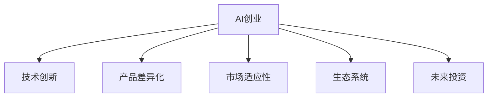

                 

## 1. 背景介绍

### 1.1 问题由来

在人工智能(AI)领域，技术创新始终是推动行业发展的核心动力。近年来，AI创业公司如雨后春笋般涌现，凭借创新技术在各行各业创造了显著的经济价值和社会效益。然而，技术创新的重要性并不仅仅体现在经济回报上，它关乎企业的长期竞争力、市场适应性和技术壁垒的构建。

AI创业公司往往依赖于技术的深度积累和持续创新，才能在激烈的市场竞争中保持领先地位。本文将深入探讨AI创业中技术创新的重要性，剖析技术创新的机制，以及如何通过创新驱动企业持续成长。

### 1.2 问题核心关键点

技术创新在AI创业中的核心关键点包括：

1. **知识产权**：技术创新带来的关键算法、架构或产品的专利或版权，是企业最重要的无形资产。
2. **产品差异化**：通过技术创新实现产品功能的差异化，增强市场竞争力。
3. **人才吸引**：吸引顶尖技术人才，建立强大的研发团队。
4. **市场适应性**：通过技术创新快速适应市场需求变化，增强企业灵活性。
5. **生态系统**：构建生态系统，推动技术标准和市场规范的制定。
6. **未来投资**：技术创新是吸引长期投资的重要因素，投资者普遍青睐具备持续创新能力的创业公司。

本文将围绕这些关键点，系统阐述技术创新在AI创业中的重要性，并提出具体策略。

## 2. 核心概念与联系

### 2.1 核心概念概述

为更好地理解技术创新在AI创业中的作用，本节将介绍几个关键概念：

- **AI创业**：指以人工智能技术为核心竞争力，通过研发、应用和推广AI产品或服务，实现商业价值的创业活动。
- **技术创新**：指在现有技术基础上，通过研发新技术、新算法、新产品等，实现性能提升、功能扩展或体验优化。
- **产品差异化**：指通过技术创新实现产品功能或用户体验的独特性，与竞争对手形成区隔。
- **知识产权**：指由技术创新带来的专利、版权等法律保护的智力成果。
- **市场适应性**：指企业根据市场需求和技术趋势，快速调整产品策略和技术路线，以保持市场竞争力。
- **生态系统**：指围绕核心技术构建的包括合作伙伴、用户、开发者等在内的广泛资源和利益相关者网络。
- **未来投资**：指通过技术创新展示企业的长期潜力和发展方向，吸引投资者信心。

这些核心概念之间的逻辑关系可以通过以下Mermaid流程图来展示：



这个流程图展示了大语言模型的核心概念及其之间的关系：

1. AI创业通过技术创新实现产品差异化，从而在市场中脱颖而出。
2. 技术创新帮助企业保持市场适应性，快速响应市场变化。
3. 构建生态系统是实现持续技术创新的重要途径。
4. 未来投资需要依靠技术创新展示企业长期潜力和价值。

## 3. 核心算法原理 & 具体操作步骤
### 3.1 算法原理概述

AI创业中的技术创新，本质上是基于现有技术和市场需求的不断探索和实验。其核心思想是：通过持续的算法改进、模型优化和产品创新，不断提升产品的性能和用户体验，实现商业价值的增长。

技术创新的过程通常包括以下几个关键步骤：

1. **问题定义**：明确市场需求和技术瓶颈，确定创新方向。
2. **概念验证**：通过小规模实验验证创新技术的可行性。
3. **技术研发**：投入资源开发新技术、新算法或新架构。
4. **产品化**：将技术成果转化为实际产品或服务，进行市场推广。
5. **迭代优化**：根据用户反馈和技术发展，不断改进和完善产品。

### 3.2 算法步骤详解

以下是AI创业中技术创新的详细步骤：

**Step 1: 问题定义**

1. **市场需求分析**：通过市场调研和用户反馈，明确产品的目标用户群和核心功能需求。
2. **技术瓶颈识别**：分析现有产品或技术的局限性，确定需要改进的方向。
3. **创新方向设定**：基于市场需求和技术瓶颈，设定明确的创新方向和目标。

**Step 2: 概念验证**

1. **小规模实验**：使用小规模数据和算法原型，验证创新方向的可行性。
2. **评估指标设定**：定义关键性能指标(KPIs)，如准确率、召回率、用户体验等，评估实验效果。
3. **结果分析**：根据实验结果，分析创新的优势和劣势，优化技术方案。

**Step 3: 技术研发**

1. **资源投入**：根据创新方向，投入人力、物力进行技术研发。
2. **技术实现**：使用先进的开发工具和框架，实现技术创新。
3. **代码质量控制**：采用代码审查、单元测试等手段，保证代码质量和稳定性。

**Step 4: 产品化**

1. **产品设计**：根据技术实现，设计产品原型和用户界面。
2. **用户体验优化**：通过用户调研和反馈，优化产品功能和用户体验。
3. **市场推广**：制定市场策略，进行产品推广和用户教育。

**Step 5: 迭代优化**

1. **用户反馈收集**：收集用户反馈和市场数据，分析用户需求和痛点。
2. **产品改进**：根据用户反馈，进行产品迭代和功能优化。
3. **技术迭代**：跟踪最新技术进展，引入新算法、新架构，持续提升产品性能。

### 3.3 算法优缺点

AI创业中的技术创新具有以下优点：

1. **市场竞争力**：通过技术创新实现产品差异化，增强市场竞争力。
2. **用户体验优化**：不断改进产品功能和用户体验，提升用户满意度。
3. **技术壁垒**：关键技术创新形成的专利或版权，构建技术壁垒，保护企业长期利益。
4. **资源吸引**：吸引顶尖技术人才和投资，增强企业的研发实力和市场影响力。

同时，技术创新也存在一些缺点：

1. **高投入风险**：技术创新需要高额的研究和开发投入，存在失败的风险。
2. **市场风险**：创新产品可能不符合市场需求，导致市场接受度低。
3. **知识产权纠纷**：技术创新可能涉及知识产权问题，需要慎重处理。
4. **竞争压力**：竞争对手可能迅速跟进，压缩企业的市场空间。

尽管存在这些缺点，但技术创新仍然是AI创业的核心驱动力，是企业实现持续成长的重要途径。

### 3.4 算法应用领域

技术创新在AI创业中的应用领域广泛，涵盖以下几个方面：

1. **智能推荐系统**：通过机器学习算法实现个性化推荐，提升用户体验。
2. **自然语言处理(NLP)**：使用深度学习技术改进语言模型，提升智能客服、翻译、摘要等NLP应用的效果。
3. **计算机视觉(CV)**：利用卷积神经网络(CNN)等算法提升图像识别、目标检测等CV应用的效果。
4. **自动驾驶**：通过感知、决策、控制等算法，实现自动驾驶技术的突破。
5. **健康医疗**：利用AI技术进行疾病诊断、治疗方案推荐等，提升医疗服务质量。
6. **金融科技**：使用AI技术进行风险评估、投资策略优化、欺诈检测等，提升金融服务水平。

技术创新在各个领域的应用，推动了人工智能技术的全面落地，产生了显著的经济和社会效益。

## 4. 数学模型和公式 & 详细讲解  
### 4.1 数学模型构建

AI创业中的技术创新涉及多个学科的知识，如机器学习、数据科学、计算机视觉等。以下以机器学习为例，构建一个通用的数学模型：

假设有一项技术创新，目标是改进一个分类器的性能。设$X$为输入特征向量，$Y$为标签，分类器为$f(X;\theta)$，其中$\theta$为模型参数。设训练集为$D=\{(x_i,y_i)\}_{i=1}^N$，损失函数为$L(\theta)$，优化目标为最小化损失函数：

$$
\theta^* = \mathop{\arg\min}_{\theta} L(f(X;\theta),Y)
$$

常见的损失函数包括交叉熵损失、均方误差损失等。优化算法如梯度下降等可以近似求解上述最优化问题。

### 4.2 公式推导过程

以交叉熵损失为例，推导其数学公式：

假设分类器$f(X;\theta)$输出$y$的概率为$p(y|x;\theta)$，则交叉熵损失定义为：

$$
L(\theta) = -\frac{1}{N} \sum_{i=1}^N \sum_{j=1}^C p(y_j|x_i;\theta) \log y_j
$$

其中$C$为类别数。通过梯度下降等优化算法，可以求解$\theta$，使得损失函数$L(\theta)$最小化。

### 4.3 案例分析与讲解

假设我们希望改进一个推荐系统的算法，目标是提升推荐精度。设推荐系统为用户推荐$n$个物品，使用深度学习模型$f(x;\theta)$对每个物品进行评分，其中$x$为用户的历史行为数据。设目标为最大化用户满意度，即最大化推荐列表的总评分：

$$
L(\theta) = -\frac{1}{N} \sum_{i=1}^N \log f(y_i|x_i;\theta)
$$

其中$y_i$为用户选择的物品。通过优化算法，可以求得$\theta$，使得推荐系统效果最佳。

## 5. 项目实践：代码实例和详细解释说明
### 5.1 开发环境搭建

在进行技术创新项目实践前，我们需要准备好开发环境。以下是使用Python进行TensorFlow开发的环境配置流程：

1. 安装Anaconda：从官网下载并安装Anaconda，用于创建独立的Python环境。

2. 创建并激活虚拟环境：
```bash
conda create -n tf-env python=3.8 
conda activate tf-env
```

3. 安装TensorFlow：根据CUDA版本，从官网获取对应的安装命令。例如：
```bash
conda install tensorflow
```

4. 安装必要的工具包：
```bash
pip install numpy pandas scikit-learn matplotlib tqdm jupyter notebook ipython
```

完成上述步骤后，即可在`tf-env`环境中开始技术创新项目的开发。

### 5.2 源代码详细实现

下面我们以推荐系统为例，给出使用TensorFlow进行技术创新的PyTorch代码实现。

首先，定义推荐系统的损失函数：

```python
import tensorflow as tf

def recommendation_loss(model, x, y):
    scores = model(x)
    loss = -tf.reduce_mean(tf.reduce_sum(tf.nn.softmax(scores) * tf.log(tf.nn.softmax(scores)), axis=1))
    return loss
```

然后，定义模型和优化器：

```python
model = tf.keras.Sequential([
    tf.keras.layers.Dense(64, activation='relu', input_shape=(n_features,)),
    tf.keras.layers.Dense(1, activation='sigmoid'),
    tf.keras.layers.Dense(64, activation='relu'),
    tf.keras.layers.Dense(n_items, activation='softmax'),
])

optimizer = tf.keras.optimizers.Adam(learning_rate=0.001)
```

接着，定义训练和评估函数：

```python
def train_epoch(model, optimizer, x_train, y_train, x_val, y_val):
    model.compile(optimizer=optimizer, loss=rec_computation)
    model.fit(x_train, y_train, batch_size=32, epochs=10, validation_data=(x_val, y_val))

def evaluate(model, x_val, y_val):
    loss = model.evaluate(x_val, y_val, batch_size=32)
    return loss
```

最后，启动训练流程并在测试集上评估：

```python
x_train = ...
y_train = ...
x_val = ...
y_val = ...

train_epoch(model, optimizer, x_train, y_train, x_val, y_val)

test_loss = evaluate(model, x_val, y_val)
print('Test Loss:', test_loss)
```

以上就是使用TensorFlow进行推荐系统技术创新的完整代码实现。可以看到，得益于TensorFlow的强大封装，我们可以用相对简洁的代码完成推荐模型的构建和训练。

### 5.3 代码解读与分析

让我们再详细解读一下关键代码的实现细节：

**recommendation_loss函数**：
- 计算模型的输出评分与实际标签的交叉熵损失，用于训练模型的参数。

**Sequential模型**：
- 使用Keras的Sequential模型，定义了四层神经网络，包括两个全连接层和一个输出层，用于构建推荐模型的结构。

**optimizer变量**：
- 使用Adam优化器，设置学习率为0.001，用于模型参数的优化。

**train_epoch函数**：
- 使用Keras的fit方法，对模型进行训练，设置批次大小为32，训练轮数为10，并在验证集上进行评估。

**evaluate函数**：
- 使用Keras的evaluate方法，计算模型在测试集上的损失。

**训练流程**：
- 定义训练集和验证集，启动训练流程，并在验证集上输出损失。

可以看到，TensorFlow配合Keras库使得推荐系统技术创新的代码实现变得简洁高效。开发者可以将更多精力放在数据处理、模型改进等高层逻辑上，而不必过多关注底层的实现细节。

当然，工业级的系统实现还需考虑更多因素，如模型的保存和部署、超参数的自动搜索、更灵活的任务适配层等。但核心的技术创新范式基本与此类似。

## 6. 实际应用场景
### 6.1 推荐系统

推荐系统是AI创业中的经典应用场景，通过技术创新提升个性化推荐的效果，增强用户体验。

在技术实现上，可以收集用户浏览、点击、评分等行为数据，提取和用户交互的物品特征向量。将特征向量作为模型输入，用户后续行为（如是否点击、购买等）作为监督信号，在此基础上微调预训练模型。微调后的模型能够从特征向量中准确把握用户的兴趣点。在推荐列表生成时，将物品的特征向量作为输入，由模型预测用户的兴趣匹配度，再结合其他特征综合排序，便可以得到个性化程度更高的推荐结果。

### 6.2 智能客服系统

智能客服系统是AI创业中的重要应用，通过技术创新实现智能对话，提升客户体验。

在技术实现上，可以收集企业内部的历史客服对话记录，将问题和最佳答复构建成监督数据，在此基础上对预训练模型进行微调。微调后的模型能够自动理解用户意图，匹配最合适的答案模板进行回复。对于客户提出的新问题，还可以接入检索系统实时搜索相关内容，动态组织生成回答。如此构建的智能客服系统，能大幅提升客户咨询体验和问题解决效率。

### 6.3 自然语言处理(NLP)

自然语言处理是AI创业中的重要领域，通过技术创新提升NLP模型的效果，增强自然语言处理能力。

在技术实现上，可以收集自然语言文本数据，提取文本特征向量。将特征向量作为模型输入，文本对应的标签作为监督信号，在此基础上微调预训练模型。微调后的模型能够从文本中准确把握语义信息，提升文本分类、情感分析、命名实体识别等NLP任务的效果。

### 6.4 未来应用展望

随着AI技术的不断发展，技术创新将在更多领域得到应用，为行业带来变革性影响。

在智慧医疗领域，通过技术创新构建智能诊断系统，提升诊断精度和效率。

在智能制造领域，通过技术创新实现智能质量检测、设备维护等，提升生产效率和产品品质。

在智慧城市治理中，通过技术创新实现智能交通、环境监测等，提升城市管理的自动化和智能化水平。

此外，在金融、教育、农业等多个领域，AI技术创新将继续推动产业升级，带来新的经济增长点。相信随着技术的不断进步，AI创业将为各行各业带来更多的创新机会和商业价值。

## 7. 工具和资源推荐
### 7.1 学习资源推荐

为了帮助开发者系统掌握AI创业中的技术创新，这里推荐一些优质的学习资源：

1. 《机器学习实战》系列书籍：由深度学习专家撰写，详细介绍了机器学习算法和技术的应用场景。

2. CS229《机器学习》课程：斯坦福大学开设的机器学习经典课程，深入讲解了机器学习理论和算法，是学习技术创新的重要基础。

3. TensorFlow官方文档：TensorFlow的官方文档，提供了详尽的技术指南和代码示例，是技术创新的重要参考。

4. Kaggle竞赛：全球知名的数据科学竞赛平台，通过参与比赛，学习和实践技术创新。

5. GitHub开源项目：通过浏览和参与开源项目，学习行业前沿技术和最佳实践。

通过对这些资源的学习实践，相信你一定能够快速掌握AI创业中的技术创新，并用于解决实际的AI问题。
### 7.2 开发工具推荐

高效的开发离不开优秀的工具支持。以下是几款用于AI创业技术创新开发的常用工具：

1. TensorFlow：由Google主导开发的开源深度学习框架，生产部署方便，适合大规模工程应用。

2. PyTorch：基于Python的开源深度学习框架，灵活动态的计算图，适合快速迭代研究。

3. Jupyter Notebook：交互式编程环境，方便开发者快速进行代码测试和调试。

4. GitHub：代码托管平台，方便开发者进行版本控制和协作开发。

5. Keras：高层深度学习框架，封装了TensorFlow等底层库，提供简洁的API接口。

合理利用这些工具，可以显著提升AI创业技术创新的开发效率，加快创新迭代的步伐。

### 7.3 相关论文推荐

AI创业中的技术创新涉及众多领域，以下是几篇奠基性的相关论文，推荐阅读：

1. "Deep Learning" by Ian Goodfellow et al.：深度学习领域的经典教材，详细介绍了深度学习的理论基础和应用实践。

2. "Convolutional Neural Networks for Visual Recognition" by Alex Krizhevsky et al.：计算机视觉领域的奠基性论文，介绍了卷积神经网络的架构和应用。

3. "Attention is All You Need" by Ashish Vaswani et al.：自然语言处理领域的经典论文，介绍了Transformer架构和自注意力机制。

4. "Reinforcement Learning: An Introduction" by Richard S. Sutton and Andrew G. Barto：强化学习领域的经典教材，详细介绍了强化学习算法和应用。

5. "A Survey on Deep Learning Applications for Health Care" by Jonathon Shlens et al.：健康医疗领域的综述论文，介绍了深度学习在健康医疗领域的应用。

这些论文代表了大语言模型微调技术的发展脉络。通过学习这些前沿成果，可以帮助研究者把握学科前进方向，激发更多的创新灵感。

## 8. 总结：未来发展趋势与挑战
### 8.1 总结

本文对AI创业中的技术创新进行了全面系统的介绍。首先阐述了技术创新在AI创业中的重要性，明确了技术创新在产品差异化、市场适应性、生态系统构建等方面的关键作用。其次，从原理到实践，详细讲解了技术创新的数学模型和操作步骤，给出了技术创新项目开发的完整代码实例。同时，本文还广泛探讨了技术创新在推荐系统、智能客服、自然语言处理等多个行业领域的应用前景，展示了技术创新范式的巨大潜力。此外，本文精选了技术创新的各类学习资源，力求为读者提供全方位的技术指引。

通过本文的系统梳理，可以看到，技术创新是AI创业的核心驱动力，是企业实现持续成长的重要途径。未来，伴随技术创新的不断深入，AI创业将为各行各业带来更多的创新机会和商业价值。

### 8.2 未来发展趋势

展望未来，AI创业中的技术创新将呈现以下几个发展趋势：

1. **技术融合**：技术创新不再局限于单一领域，而是向跨领域融合发展，如AI与物联网、区块链、大数据等技术的结合，带来新的应用场景和商业模式。

2. **人工智能伦理**：随着AI技术的普及，人工智能伦理问题日益凸显，如隐私保护、算法透明、公平性等，技术创新需要在这些方面进行深入探讨和规范。

3. **边缘计算**：AI应用越来越多地依赖于边缘计算，如智能家居、工业物联网等，技术创新需要关注边缘计算的资源优化和高效计算。

4. **安全保障**：AI系统面临着安全漏洞、恶意攻击等威胁，技术创新需要在安全性方面进行深入研究和设计。

5. **模型压缩**：随着AI应用场景的扩展，对模型压缩和优化技术的需求日益增加，技术创新需要关注模型压缩和高效推理。

以上趋势凸显了AI创业技术创新的广阔前景。这些方向的探索发展，必将进一步推动AI技术的全面落地，为各行各业带来更深刻的影响。

### 8.3 面临的挑战

尽管技术创新在AI创业中具有重要作用，但在实现过程中，仍面临诸多挑战：

1. **高投入风险**：技术创新需要高额的研究和开发投入，存在失败的风险。

2. **市场接受度**：创新产品可能不符合市场需求，导致市场接受度低。

3. **知识产权纠纷**：技术创新可能涉及知识产权问题，需要慎重处理。

4. **竞争压力**：竞争对手可能迅速跟进，压缩企业的市场空间。

5. **伦理问题**：AI技术的普及可能带来隐私保护、公平性等伦理问题，技术创新需要在这些方面进行深入探讨和规范。

6. **资源限制**：AI技术创新需要高额的资源投入，包括人力、物力、财力等，中小型企业可能面临资源限制的问题。

尽管存在这些挑战，但技术创新仍然是AI创业的核心驱动力，是企业实现持续成长的重要途径。

### 8.4 研究展望

面向未来，AI创业中的技术创新需要在以下几个方面进行深入研究：

1. **人工智能伦理**：研究AI技术的伦理问题，制定AI技术应用的道德规范。

2. **边缘计算**：研究边缘计算的资源优化和高效计算技术，推动AI技术在边缘设备上的应用。

3. **安全保障**：研究AI系统的安全漏洞、恶意攻击等威胁，设计安全的AI系统架构。

4. **模型压缩**：研究模型压缩和优化技术，推动AI技术在资源受限环境下的应用。

5. **跨领域融合**：研究AI技术与物联网、区块链、大数据等技术的跨领域融合，推动AI技术在更广阔的应用场景中落地。

这些研究方向的探索，必将引领AI创业技术创新迈向更高的台阶，为构建安全、可靠、可解释、可控的智能系统铺平道路。面向未来，AI创业将为各行各业带来更多的创新机会和商业价值。

## 9. 附录：常见问题与解答

**Q1：AI创业中如何平衡技术创新与市场需求的契合？**

A: 在AI创业中，技术创新需要紧密结合市场需求，才能实现商业价值的最大化。具体来说，可以从以下几个方面进行平衡：

1. **市场需求分析**：通过市场调研和用户反馈，明确产品的目标用户群和核心功能需求。
2. **技术瓶颈识别**：分析现有产品或技术的局限性，确定需要改进的方向。
3. **用户反馈收集**：持续收集用户反馈，优化产品功能和用户体验。

通过以上方法，可以确保技术创新方向符合市场需求，从而实现技术创新和商业价值的双赢。

**Q2：AI创业中如何进行技术创新资源的管理？**

A: 在AI创业中，技术创新资源的管理至关重要，需要建立完善的资源管理机制。具体来说，可以从以下几个方面进行管理：

1. **资源预算**：合理分配技术创新的预算，确保资源利用效率最大化。
2. **项目跟踪**：使用项目管理工具，跟踪技术创新项目的进展和资源使用情况。
3. **绩效评估**：定期评估技术创新项目的绩效，优化资源配置和项目管理。

通过以上方法，可以有效管理技术创新资源，确保项目顺利推进和资源利用效率最大化。

**Q3：AI创业中如何应对技术创新风险？**

A: 在AI创业中，技术创新风险不可避免，需要采取多种手段进行应对。具体来说，可以从以下几个方面进行应对：

1. **风险评估**：在技术创新项目启动前，进行风险评估，识别潜在风险和挑战。
2. **风险控制**：制定风险控制策略，如小规模实验、逐步推进、备份方案等，降低技术创新风险。
3. **资源保障**：确保技术创新项目有充足的资源支持，如人力、物力、财力等，保障项目顺利推进。

通过以上方法，可以有效应对技术创新风险，确保项目顺利推进和成功落地。

---

作者：禅与计算机程序设计艺术 / Zen and the Art of Computer Programming

