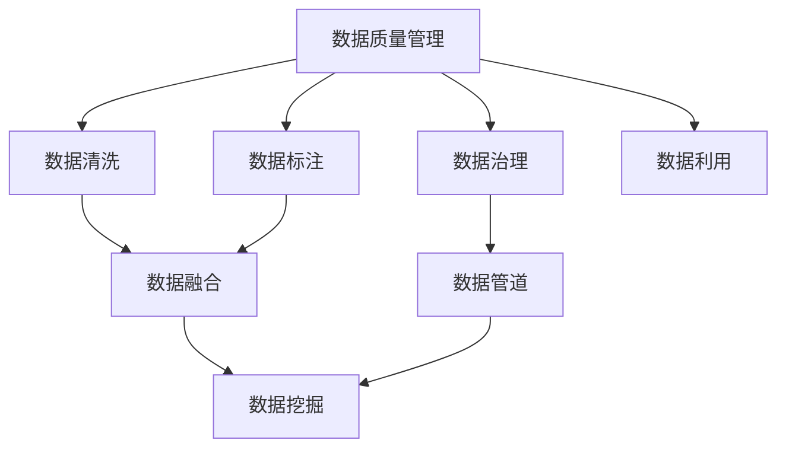

                 

## 1. 背景介绍

### 1.1 问题由来

在人工智能(AI)创业的浪潮中，数据管理是企业成功与否的关键。一个高质量、结构合理、管理得当的数据集能够显著提升AI模型的性能和可靠性，而低质量的数据则可能导致模型欠拟合、过拟合等问题，甚至引发严重的误导性决策。因此，数据管理成为了AI创业项目成败与否的重要因素之一。

### 1.2 问题核心关键点

- **数据质量**：数据的完整性、准确性、一致性、时效性等是数据管理的基础。
- **数据治理**：数据归档、存储、访问控制、安全合规等管理措施，确保数据的安全和可用性。
- **数据利用**：通过数据清洗、标注、融合、挖掘等手段，提升数据价值，辅助AI模型训练。
- **数据策略**：根据业务需求制定数据管理策略，确保数据与业务目标一致。
- **数据技术**：选择合适的技术手段进行数据管理，包括数据仓库、数据湖、数据管道等。

这些关键点共同构成了AI创业中数据管理的基本框架，对企业AI项目的成功至关重要。

## 2. 核心概念与联系

### 2.1 核心概念概述

- **数据质量管理**：确保数据的完整性、准确性、一致性、时效性等，是数据管理的基础。
- **数据治理**：管理数据的生命周期，包括归档、存储、访问控制、安全合规等，确保数据的安全和可用性。
- **数据清洗**：对原始数据进行处理，去除重复、错误、无关等数据，提高数据质量。
- **数据标注**：为数据添加标签信息，帮助模型理解数据含义。
- **数据融合**：将不同数据源的数据整合在一起，提升数据的广度和深度。
- **数据挖掘**：从数据中提取有价值的信息和模式，为决策提供依据。

这些概念之间的关系可以通过以下Mermaid流程图来展示：



这个流程图展示了数据管理的核心环节及其关联：

1. 数据质量管理确保数据质量，数据清洗去除脏数据，数据标注提升数据理解。
2. 数据融合将不同数据源整合，数据挖掘提取有用信息。
3. 数据治理确保数据安全，数据管道支持数据流动，数据利用最终转化为业务价值。

## 3. 核心算法原理 & 具体操作步骤
### 3.1 算法原理概述

AI创业中的数据管理主要依赖于数据清洗、数据标注、数据融合、数据挖掘等算法和技术。这些算法的核心思想是通过对原始数据的预处理、标注、融合等操作，提升数据质量，辅助AI模型的训练和优化。

### 3.2 算法步骤详解

#### 数据清洗算法

数据清洗是数据管理的基础步骤，其目的是去除原始数据中的噪声、冗余、错误等，提升数据质量。常用的数据清洗算法包括：

- **去重**：通过唯一标识符或哈希值，去除数据中的重复记录。
- **处理缺失值**：填补、删除或使用插值方法处理缺失值。
- **异常值检测**：使用统计方法或机器学习算法识别和处理异常值。

**数据标注算法**

数据标注是将原始数据转换为模型可理解的形式，通常包含对数据的分类、标注、标签等操作。常用的数据标注算法包括：

- **分类标注**：将数据分为不同的类别，如情感分类、类别分类等。
- **序列标注**：为数据序列中的每个元素标注标签，如命名实体识别、词性标注等。
- **标注工具**：使用预训练模型或规则引擎，自动或半自动地进行数据标注。

**数据融合算法**

数据融合是将不同数据源的数据整合在一起，形成更大规模、更丰富的数据集。常用的数据融合算法包括：

- **特征融合**：将不同数据源的特征合并，提升数据的多样性。
- **样本融合**：将不同数据源的样本合并，增加数据量。
- **数据对齐**：将不同数据源的时间戳、格式等对齐，确保数据一致性。

**数据挖掘算法**

数据挖掘是从数据中提取有用信息的过程，常用的算法包括：

- **关联规则**：发现数据集中的频繁项集和关联规则。
- **聚类分析**：将数据集中的对象分为不同的群组。
- **预测模型**：使用统计模型或机器学习模型预测未来数据。

### 3.3 算法优缺点

数据管理中的各种算法各有优缺点，具体如下：

**数据清洗算法的优点**：

- **去除噪声**：提高数据质量，避免模型误导性决策。
- **填补缺失值**：减少数据缺失带来的影响。
- **异常值检测**：提升数据的准确性和可靠性。

**数据清洗算法的缺点**：

- **计算成本高**：清洗数据需要耗费大量时间和计算资源。
- **数据丢失风险**：清洗过程中可能丢失有用信息。

**数据标注算法的优点**：

- **提升理解**：标注数据可以帮助模型更好地理解数据含义。
- **减少误差**：标注数据可以减少模型训练的误差。
- **自动化**：使用标注工具可以加快标注速度。

**数据标注算法的缺点**：

- **成本高**：高质量的标注数据成本较高。
- **数据量限制**：标注数据量过少可能导致模型欠拟合。

**数据融合算法的优点**：

- **提升数据量**：不同数据源的融合增加了数据量。
- **提高多样性**：不同数据源的数据增加了数据的多样性。
- **增强鲁棒性**：多源数据可以减少单一数据源的偏差。

**数据融合算法的缺点**：

- **数据不一致**：不同数据源的数据格式、时间戳等可能不一致，需要额外处理。
- **隐私问题**：融合多个数据源可能涉及隐私问题。

**数据挖掘算法的优点**：

- **提取有用信息**：从数据中提取有价值的信息和模式。
- **辅助决策**：数据挖掘结果可以辅助决策制定。
- **自动化**：自动化程度高，效率高。

**数据挖掘算法的缺点**：

- **复杂度高**：数据挖掘算法通常较为复杂，需要高水平的技术支持。
- **结果解释**：数据挖掘结果的解释性较差，难以理解。

### 3.4 算法应用领域

数据管理算法的应用领域非常广泛，涵盖以下几个主要方面：

- **自然语言处理(NLP)**：清洗和标注文本数据，训练语言模型。
- **图像处理**：清洗和标注图像数据，训练图像识别模型。
- **推荐系统**：融合用户行为数据和商品信息，进行推荐。
- **医疗健康**：清洗和标注医疗数据，辅助诊断和治疗。
- **金融风控**：清洗和标注金融数据，进行风险评估和预测。
- **物联网**：清洗和融合设备数据，进行实时监控和分析。

## 4. 数学模型和公式 & 详细讲解 & 举例说明

### 4.1 数学模型构建

数据管理中的数学模型通常基于统计学和机器学习理论构建。以下以数据清洗为例，介绍常用的数学模型及其构建过程。

假设原始数据集为 $D=\{x_1, x_2, \ldots, x_n\}$，其中每个数据点 $x_i=(x_i^1, x_i^2, \ldots, x_i^d)$ 表示为一个 $d$ 维向量。

**数据去重**：

数据去重的数学模型可以表示为：

$$
\hat{x}_i = 
\begin{cases}
x_i, & x_i \notin \{x_1, x_2, \ldots, x_{i-1}\} \\
\text{null}, & x_i \in \{x_1, x_2, \ldots, x_{i-1}\}
\end{cases}
$$

其中 $\hat{x}_i$ 为去重后的数据点。

**数据填补缺失值**：

数据填补的数学模型可以表示为：

$$
\hat{x}_i = 
\begin{cases}
x_i, & x_i \notin \{x_1, x_2, \ldots, x_{i-1}\} \\
\hat{x}_i = \text{mean}(\{x_1, x_2, \ldots, x_{i-1}\}), & x_i = \text{null}
\end{cases}
$$

其中 $\text{mean}(\{x_1, x_2, \ldots, x_{i-1}\})$ 表示缺失值的前 $i-1$ 个数据点的均值。

**异常值检测**：

异常值检测的数学模型可以表示为：

$$
\hat{x}_i = 
\begin{cases}
x_i, & x_i \notin \{x_1, x_2, \ldots, x_{i-1}\} \\
\hat{x}_i = \text{median}(\{x_1, x_2, \ldots, x_{i-1}\}), & x_i \in \{x_1, x_2, \ldots, x_{i-1}\} \text{且} x_i \text{为异常值}
\end{cases}
$$

其中 $\text{median}(\{x_1, x_2, \ldots, x_{i-1}\})$ 表示缺失值的前 $i-1$ 个数据点的中位数。

### 4.2 公式推导过程

**数据去重**：

数据去重的关键在于判断每个数据点是否重复。可以使用哈希表或集合等数据结构，快速实现数据去重操作。

**数据填补缺失值**：

数据填补可以通过均值、中位数等统计量进行填补。均值填补简单但可能受到极端值影响，中位数填补更稳健但可能损失部分信息。

**异常值检测**：

异常值检测常用的统计方法包括均值、标准差、箱线图等。使用箱线图进行异常值检测，可以直观地识别数据分布的异常点。

### 4.3 案例分析与讲解

**案例1：清洗医疗数据**

假设我们有一份医院患者数据表，包含患者的年龄、性别、病史、检查结果等。数据清洗的目的是去除重复记录、填补缺失值、检测异常值等。

- **去重**：可以通过身份证号、病史号等唯一标识符进行去重。
- **填补缺失值**：对于年龄、性别等缺失值，可以使用前 $i-1$ 个数据的均值进行填补。
- **异常值检测**：对于检查结果等数据，可以使用箱线图或统计方法进行异常值检测，移除异常值。

**案例2：清洗金融数据**

金融数据通常包含大量历史交易记录、客户信息等。数据清洗的目的是去除重复记录、填补缺失值、检测异常值等。

- **去重**：可以通过账户号、交易日期等唯一标识符进行去重。
- **填补缺失值**：对于交易金额等缺失值，可以使用前 $i-1$ 个数据的均值进行填补。
- **异常值检测**：对于交易金额等数据，可以使用箱线图或统计方法进行异常值检测，移除异常值。

## 5. 项目实践：代码实例和详细解释说明

### 5.1 开发环境搭建

在进行数据管理实践前，我们需要准备好开发环境。以下是使用Python进行PyTorch开发的环境配置流程：

1. 安装Anaconda：从官网下载并安装Anaconda，用于创建独立的Python环境。

2. 创建并激活虚拟环境：
```bash
conda create -n pytorch-env python=3.8 
conda activate pytorch-env
```

3. 安装PyTorch：根据CUDA版本，从官网获取对应的安装命令。例如：
```bash
conda install pytorch torchvision torchaudio cudatoolkit=11.1 -c pytorch -c conda-forge
```

4. 安装相关库：
```bash
pip install pandas numpy matplotlib seaborn sklearn jupyter notebook
```

5. 安装数据清洗、标注、融合等工具库：
```bash
pip install opencv-python scikit-image scikit-image sklearn
```

完成上述步骤后，即可在`pytorch-env`环境中开始数据管理实践。

### 5.2 源代码详细实现

下面以数据清洗和标注为例，给出使用Python进行数据管理的代码实现。

**数据清洗**：

```python
import pandas as pd

# 读取数据
df = pd.read_csv('data.csv')

# 去重
df = df.drop_duplicates()

# 填补缺失值
df = df.fillna(df.mean())

# 检测异常值
df = df.drop(df[df['value'] < df['value'].quantile(0.01)])
```

**数据标注**：

```python
from sklearn.feature_extraction.text import TfidfVectorizer

# 读取文本数据
texts = df['text'].tolist()

# 使用TF-IDF进行文本向量化
vectorizer = TfidfVectorizer()
X = vectorizer.fit_transform(texts)

# 使用分类模型进行标注
model = LogisticRegression()
model.fit(X, df['label'])

# 预测新的标注
new_texts = ['这是新的文本数据']
X_new = vectorizer.transform(new_texts)
new_labels = model.predict(X_new)
```

### 5.3 代码解读与分析

**数据清洗**：

1. **读取数据**：使用Pandas库读取CSV文件中的数据，并存储在DataFrame中。
2. **去重**：使用`drop_duplicates`方法去除重复记录。
3. **填补缺失值**：使用`fillna`方法填补缺失值。
4. **检测异常值**：使用`quantile`方法计算数据的第1百分位数，将小于该值的数据视为异常值，并使用`drop`方法去除异常值。

**数据标注**：

1. **读取文本数据**：将DataFrame中的文本数据存储在列表中。
2. **文本向量化**：使用`TfidfVectorizer`将文本转换为TF-IDF向量。
3. **训练分类模型**：使用LogisticRegression模型训练文本分类模型。
4. **预测新标注**：将新的文本数据转换为TF-IDF向量，并使用训练好的模型进行预测。

### 5.4 运行结果展示

运行上述代码，可以得到清洗后的数据和标注结果。具体而言，清洗后的数据去除了重复记录，填补了缺失值，去除了异常值，而标注结果则展示了文本数据的分类情况。

## 6. 实际应用场景

### 6.1 智能客服系统

智能客服系统需要处理大量的客户咨询数据。通过数据清洗和标注，可以构建高效的客服知识库，提升智能客服的响应速度和准确性。

1. **数据清洗**：清洗客户咨询数据，去除重复、噪声等无用信息。
2. **数据标注**：标注客户咨询意图，构建意图分类模型。
3. **知识库构建**：将清洗后的数据转换为知识库中的问题和答案对。

**智能客服应用示例**：

```python
from transformers import BertForQuestionAnswering

# 读取意图分类模型和知识库
model = BertForQuestionAnswering.from_pretrained('bert-base-cased')
knowledge_base = load_knowledge_base()

# 查询知识库
query = '如何登录账户？'
answer = model.predict(query, knowledge_base)
print(answer)
```

### 6.2 金融风控系统

金融风控系统需要实时监控和分析客户的交易行为，通过数据清洗和标注，可以构建高效的风险评估模型。

1. **数据清洗**：清洗交易记录，去除异常值、噪声等。
2. **数据标注**：标注交易行为的风险等级，构建风险评估模型。
3. **实时监控**：实时监控客户交易行为，进行风险评估和预警。

**金融风控应用示例**：

```python
from sklearn.linear_model import LogisticRegression

# 读取交易记录数据
df = pd.read_csv('transaction_data.csv')

# 数据清洗
df = df.drop_duplicates()
df = df.fillna(df.mean())

# 数据标注
X = df[['amount', 'time', 'location']]
y = df['risk_level']
model = LogisticRegression()
model.fit(X, y)

# 实时监控
new_transaction = {'amount': 5000, 'time': '2021-08-01 12:00:00', 'location': '北京'}
X_new = pd.DataFrame(new_transaction)
risk_level = model.predict(X_new)
print(risk_level)
```

### 6.3 医疗健康系统

医疗健康系统需要处理大量的患者数据，通过数据清洗和标注，可以构建高效的医疗诊断模型。

1. **数据清洗**：清洗患者数据，去除重复、噪声等。
2. **数据标注**：标注疾病症状和诊断结果，构建诊断模型。
3. **诊断预测**：根据患者症状，进行疾病预测和推荐。

**医疗健康应用示例**：

```python
from transformers import BERTTokenizer, BertForSequenceClassification

# 读取患者数据
df = pd.read_csv('patient_data.csv')

# 数据清洗
df = df.drop_duplicates()
df = df.fillna(df.mean())

# 数据标注
tokenizer = BERTTokenizer.from_pretrained('bert-base-cased')
X = tokenizer.encode(df['symptoms'], add_special_tokens=True)
y = df['disease']
model = BertForSequenceClassification.from_pretrained('bert-base-cased')
model.fit(X, y)

# 诊断预测
new_symptoms = ['sore throat', 'fever', 'cough']
X_new = tokenizer.encode(new_symptoms, add_special_tokens=True)
disease = model.predict(X_new)
print(disease)
```

## 7. 工具和资源推荐

### 7.1 学习资源推荐

为了帮助开发者系统掌握数据管理的理论基础和实践技巧，这里推荐一些优质的学习资源：

1. **《数据科学导论》**：一本经典的数据科学入门书籍，涵盖数据清洗、数据标注、数据融合等基本概念。
2. **Coursera《数据科学专项课程》**：由Johns Hopkins大学开设的系列课程，涵盖数据清洗、数据标注、数据融合等基本技能。
3. **Kaggle竞赛**：Kaggle是一个数据科学竞赛平台，可以通过参加竞赛练习数据清洗、数据标注、数据融合等技能。
4. **DataCamp**：一个在线数据科学学习平台，提供数据清洗、数据标注、数据融合等课程。

通过对这些资源的学习实践，相信你一定能够快速掌握数据管理的精髓，并用于解决实际的NLP问题。

### 7.2 开发工具推荐

高效的开发离不开优秀的工具支持。以下是几款用于数据管理开发的常用工具：

1. **Pandas**：一个强大的数据处理库，支持数据清洗、数据标注等操作。
2. **NumPy**：一个科学计算库，支持高效的数据处理和数学计算。
3. **Scikit-learn**：一个机器学习库，支持数据标注、特征工程等操作。
4. **TensorFlow**：一个深度学习框架，支持大规模数据处理和模型训练。
5. **PyTorch**：一个深度学习框架，支持高效的数据处理和模型训练。

合理利用这些工具，可以显著提升数据管理的开发效率，加快创新迭代的步伐。

### 7.3 相关论文推荐

数据管理技术的发展源于学界的持续研究。以下是几篇奠基性的相关论文，推荐阅读：

1. **《大规模数据清洗与预处理》**：介绍了大规模数据清洗和预处理的方法和技术，涵盖了数据去重、填补缺失值、异常值检测等基本算法。
2. **《基于机器学习的数据标注方法》**：介绍基于机器学习的数据标注方法，包括分类标注、序列标注等算法。
3. **《数据融合技术综述》**：综述了数据融合技术，包括特征融合、样本融合、数据对齐等方法。
4. **《大数据挖掘算法》**：介绍了大数据挖掘算法，包括关联规则、聚类分析、预测模型等算法。

这些论文代表了大数据管理技术的发展脉络。通过学习这些前沿成果，可以帮助研究者把握学科前进方向，激发更多的创新灵感。

## 8. 总结：未来发展趋势与挑战

### 8.1 研究成果总结

本文对数据管理技术进行了全面系统的介绍。首先阐述了数据管理的基础概念和关键点，明确了数据清洗、数据标注、数据融合等技术的重要性。其次，从原理到实践，详细讲解了数据管理算法的数学模型和具体实现。同时，本文还探讨了数据管理技术在智能客服、金融风控、医疗健康等实际应用中的具体应用场景。最后，本文推荐了相关学习资源和开发工具，力求为读者提供全方位的技术指引。

通过本文的系统梳理，可以看到，数据管理技术在AI创业项目中扮演着重要角色。数据清洗、数据标注、数据融合等技术，能够显著提升AI模型的性能和可靠性，是企业AI项目成功与否的关键。未来，随着数据管理和AI技术的不断发展，数据管理技术将在更多领域得到应用，为AI创业项目带来新的突破。

### 8.2 未来发展趋势

展望未来，数据管理技术将呈现以下几个发展趋势：

1. **自动化和智能化**：未来数据管理将更加自动化和智能化，数据清洗、数据标注、数据融合等操作将由AI系统自动完成，提升效率和准确性。
2. **实时化和云化**：数据管理将更加实时化和云化，数据的实时处理和云存储将成为主流。
3. **多模态数据管理**：数据管理将拓展到多模态数据，如文本、图像、音频、视频等，提升数据管理的广度和深度。
4. **联邦学习和隐私保护**：数据管理将结合联邦学习和隐私保护技术，保护数据隐私和安全性。
5. **开源和社区驱动**：数据管理技术将更加开源和社区驱动，社区成员共同贡献数据管理和技术创新。

以上趋势凸显了数据管理技术的广阔前景。这些方向的探索发展，将进一步提升数据管理的自动化和智能化水平，为AI创业项目提供更强大的数据支持。

### 8.3 面临的挑战

尽管数据管理技术已经取得了不小的进展，但在迈向更加智能化、自动化应用的过程中，它仍面临着诸多挑战：

1. **数据质量问题**：数据清洗和标注需要高质量的数据源，但在实际应用中，数据质量难以保证。如何确保数据的完整性、准确性、一致性等，是数据管理的重要挑战。
2. **计算资源限制**：数据清洗、数据标注、数据融合等操作需要大量计算资源，如何高效利用计算资源，提升数据管理效率，是数据管理的另一大挑战。
3. **数据隐私问题**：数据管理过程中，如何保护数据隐私和安全性，避免数据泄露和滥用，是数据管理的重要挑战。
4. **数据融合复杂度**：不同数据源的数据格式、时间戳等可能不一致，数据融合需要处理复杂的数据对齐问题。
5. **数据标注成本高**：高质量的数据标注成本较高，如何降低标注成本，提高标注效率，是数据管理的挑战之一。

正视数据管理面临的这些挑战，积极应对并寻求突破，将是大数据管理技术走向成熟的必由之路。相信随着学界和产业界的共同努力，这些挑战终将一一被克服，大数据管理技术必将在AI创业项目中发挥更大的作用。

### 8.4 研究展望

面对大数据管理所面临的种种挑战，未来的研究需要在以下几个方面寻求新的突破：

1. **自动数据清洗技术**：探索自动化数据清洗技术，减少人工干预，提高数据清洗效率和准确性。
2. **高效数据标注方法**：开发高效的数据标注方法，减少标注成本，提高标注效率。
3. **数据融合技术**：研究高效的数据融合技术，解决数据对齐等问题，提升数据融合效果。
4. **隐私保护技术**：结合隐私保护技术，保护数据隐私和安全性。
5. **智能数据管理平台**：开发智能数据管理平台，集成数据清洗、数据标注、数据融合等技术，实现自动化、智能化管理。

这些研究方向的探索，必将引领大数据管理技术迈向更高的台阶，为AI创业项目提供更强大的数据支持。面向未来，大数据管理技术还需要与其他AI技术进行更深入的融合，如知识表示、因果推理、强化学习等，多路径协同发力，共同推动AI项目的进步。只有勇于创新、敢于突破，才能不断拓展数据管理的边界，让数据管理技术更好地服务于AI创业项目。

## 9. 附录：常见问题与解答

**Q1：数据清洗和数据标注有哪些常用方法？**

A: 数据清洗和数据标注常用的方法包括：

- 数据去重：使用哈希表或集合等数据结构，去除重复记录。
- 数据填补缺失值：使用均值、中位数、插值等方法填补缺失值。
- 数据异常值检测：使用统计方法或机器学习算法检测异常值。
- 数据标注：使用预训练模型或规则引擎，自动或半自动地进行数据标注。

**Q2：数据清洗和数据标注需要哪些工具？**

A: 数据清洗和数据标注常用的工具包括：

- Pandas：数据处理库，支持数据清洗、数据标注等操作。
- NumPy：科学计算库，支持高效的数据处理和数学计算。
- Scikit-learn：机器学习库，支持数据标注、特征工程等操作。
- TensorFlow：深度学习框架，支持大规模数据处理和模型训练。
- PyTorch：深度学习框架，支持高效的数据处理和模型训练。

**Q3：数据清洗和数据标注的计算成本如何控制？**

A: 数据清洗和数据标注的计算成本可以通过以下方法控制：

- 使用高效的算法和数据结构，提升数据处理效率。
- 利用多线程或多进程并行处理数据，提高计算效率。
- 采用分布式计算，将数据处理任务分配到多个计算节点并行处理。

**Q4：数据清洗和数据标注的自动化程度如何提升？**

A: 数据清洗和数据标注的自动化程度可以通过以下方法提升：

- 使用预训练模型进行数据标注，减少人工干预。
- 结合自然语言处理技术，自动提取特征和进行标注。
- 开发自动化数据清洗工具，实现自动去重、填补缺失值等操作。

**Q5：数据清洗和数据标注的效果如何评估？**

A: 数据清洗和数据标注的效果可以通过以下指标评估：

- 数据清洗的指标：数据的重复率、缺失值率、异常值率等。
- 数据标注的指标：标注的准确率、召回率、F1值等。

---

作者：禅与计算机程序设计艺术 / Zen and the Art of Computer Programming

