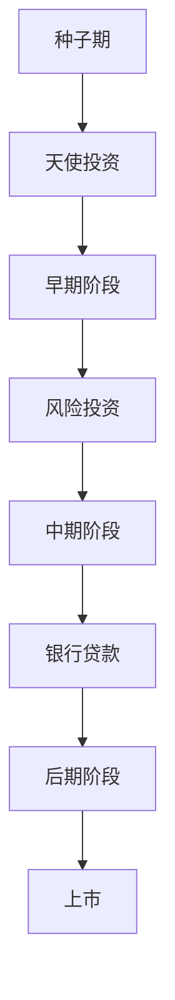

                 

# AI创业：资金支持的重要性

## 1. 背景介绍

在当下竞争激烈的科技创新浪潮中，人工智能（AI）创业已成为许多科技创业者眼中的一片新蓝海。随着大数据、云计算、物联网等技术的不断成熟，AI技术已经渗透到各行各业，产生了深远的影响。无论是医疗、金融、制造还是交通，AI的潜力都被不断挖掘和验证。然而，尽管AI技术的潜力巨大，但实现从实验室到市场的转变，却需要克服许多挑战。

其中，资金支持是AI创业过程中不可或缺的一环。没有足够的资金支持，AI创业者将难以购买必要的硬件设备，招聘顶尖人才，进行技术研发和市场推广。因此，资金支持是AI创业者迈向成功的重要保障。本文将从多个角度探讨资金支持对AI创业的重要性，分析其在不同创业阶段的作用，并提出一些实际的建议，帮助AI创业者在资金获取上取得突破。

## 2. 核心概念与联系

在讨论资金支持的重要性之前，我们首先需要明确几个核心概念：

1. **AI创业**：利用人工智能技术，进行新产品、新服务的研发和市场化。
2. **资金支持**：通过投资、贷款、众筹等方式获取的财务资源，用于支持企业的运营和发展。
3. **创业阶段**：AI创业一般分为种子期、早期、中期、后期四个阶段，每个阶段对资金的需求和来源都有所不同。
4. **融资渠道**：包括天使投资、风险投资（VC）、政府基金、银行贷款、众筹等。

通过这些概念，我们可以更清晰地理解资金支持对AI创业的重要性。下面，我们将通过一个简单的Mermaid流程图，展示资金支持在AI创业各个阶段的作用。



## 3. 核心算法原理 & 具体操作步骤

### 3.1 算法原理概述

AI创业过程中的资金支持，本质上是一种财务决策和资源配置的优化问题。它涉及到资金的获取、使用、管理和投资回报率的优化。通过合理的资金管理，AI创业者可以提高企业的竞争力和盈利能力，实现可持续发展。

资金支持的算法原理主要包括以下几个步骤：

1. **需求评估**：确定企业在不同阶段的资金需求，包括启动资金、研发资金、市场推广资金等。
2. **资金来源分析**：分析各种资金来源的特点，如投资类型、回报周期、风险等级等。
3. **投资回报评估**：评估不同资金来源的投资回报率，选择最具性价比的资金渠道。
4. **资金分配与使用**：根据企业的运营需求，合理分配和使用资金，确保资金流向最需要的领域。
5. **风险管理**：通过多样化的资金来源和风险控制措施，降低企业经营风险。

### 3.2 算法步骤详解

下面，我们将详细讲解AI创业过程中资金支持的算法步骤。

#### 3.2.1 需求评估

需求评估是资金支持的基础，它需要创业者全面考虑企业的运营需求和发展规划。一般来说，需求评估可以分为以下几个方面：

- **启动资金**：用于购买硬件设备、办公场所、招聘初期员工等。
- **研发资金**：用于技术研发、算法优化、产品测试等。
- **市场推广资金**：用于品牌建设、市场营销、销售渠道等。
- **运营资金**：用于日常运营、客户服务、物流管理等。

需求评估的常用方法是建立详细的资金需求预算表，列出每个阶段的具体需求和预算。例如，一个AI创业企业在不同阶段的需求预算表如下：

| 阶段 | 需求项 | 预算 |
| --- | --- | --- |
| 种子期 | 办公室租金 | $100,000 |
| 早期阶段 | 硬件设备购买 | $200,000 |
| 中期阶段 | 研发团队建设 | $500,000 |
| 后期阶段 | 市场营销费用 | $1,000,000 |

#### 3.2.2 资金来源分析

资金来源分析是确定资金支持渠道的重要步骤。常用的资金来源包括：

- **天使投资**：由个人或家族投资，通常投资金额较小，注重项目的前景和团队能力。
- **风险投资**：由风险投资基金提供，投资金额较大，要求较高的回报率。
- **政府基金**：由政府设立，主要用于支持具有社会公益价值的项目。
- **银行贷款**：通过抵押、担保等方式，从银行获得贷款。
- **众筹**：通过互联网平台向公众募集小额资金，风险较低，但回报率不高。

在进行资金来源分析时，需要考虑资金的获取难度、投资回报率、投资期限、投资要求等因素。例如，风险投资通常要求较高的回报率，但提供较长的投资期限和较大的投资金额；而政府基金则更注重项目的社会价值和创新性。

#### 3.2.3 投资回报评估

投资回报评估是选择资金来源的关键。常用的评估方法包括：

- **内部回报率（IRR）**：衡量资金投资的净现值和回报率，适用于不同投资方案的比较。
- **净现值（NPV）**：计算资金投资的净现值，反映投资收益。
- **投资回收期（Payback Period）**：计算资金回收所需的周期，衡量资金的流动性。
- **现金流分析**：通过现金流的正负变化，评估资金的使用情况。

假设某AI创业企业需要100万美元的资金，有天使投资和风险投资两个选项。天使投资每年回报率为30%，投资期限为3年；风险投资每年回报率为20%，投资期限为5年。通过计算，我们得到：

| 投资选项 | 资金 | 回报率 | 投资期限 | 回报总额 |
| --- | --- | --- | --- | --- |
| 天使投资 | $100万 | 30% | 3年 | $108万 |
| 风险投资 | $100万 | 20% | 5年 | $120万 |

通过比较，风险投资在总回报额上明显优于天使投资，但需要更长的投资期限。因此，企业需要根据自身的发展需求和风险承受能力，选择最合适的资金来源。

#### 3.2.4 资金分配与使用

资金分配与使用是确保资金支持有效的关键。资金的使用应该遵循以下原则：

- **优先保证核心需求**：确保资金主要用于技术研发、市场推广等核心需求。
- **分阶段投入**：根据企业的发展阶段，分步投入资金，避免一次性投入过多资金。
- **灵活调整**：根据企业的实际运营情况，灵活调整资金分配，确保资金的合理使用。

例如，某AI创业企业在第一年主要进行技术研发和产品测试，需要大量的研发资金。在第二年，需要加强市场推广，增加营销费用。在第三年，需要加强品牌建设和销售渠道建设，进一步扩大市场份额。因此，资金分配需要分阶段进行，确保企业发展的稳定性和连续性。

#### 3.2.5 风险管理

风险管理是资金支持的重要环节，它可以通过多样化的资金来源和风险控制措施，降低企业的经营风险。常用的风险管理方法包括：

- **多元化资金来源**：通过多种资金渠道获取资金，降低单一资金来源的风险。
- **风险分散**：将资金分散投资于不同的项目和领域，降低单个项目的风险。
- **风险控制**：建立完善的风险控制机制，及时发现和解决风险问题。

例如，某AI创业企业在种子期主要依赖天使投资，在早期阶段引入风险投资，在中期阶段申请政府基金，同时建立完备的风险控制机制，确保企业的稳定发展。

## 4. 数学模型和公式 & 详细讲解 & 举例说明

### 4.1 数学模型构建

在资金支持的算法中，我们通常会构建以下几个数学模型：

1. **资金需求模型**：用于预测企业在不同阶段所需的资金。
2. **资金回报模型**：用于计算不同资金来源的回报率。
3. **资金分配模型**：用于确定不同阶段的资金分配策略。
4. **风险控制模型**：用于评估和管理企业的风险。

下面，我们将详细讲解这些模型的构建方法。

#### 4.1.1 资金需求模型

资金需求模型可以通过以下公式来构建：

$$
D(t) = \sum_{i=1}^{n} D_i(t)
$$

其中，$D(t)$ 表示企业在时间 $t$ 的资金需求，$D_i(t)$ 表示第 $i$ 项需求在时间 $t$ 的资金需求。例如，某AI创业企业在第一年的资金需求为 $D_1(t) = 100,000$ 美元，第二年的资金需求为 $D_2(t) = 200,000$ 美元。

#### 4.1.2 资金回报模型

资金回报模型可以通过以下公式来构建：

$$
R = \frac{\sum_{i=1}^{n} V_i(t)}{C}
$$

其中，$R$ 表示资金的回报率，$V_i(t)$ 表示第 $i$ 项投资在时间 $t$ 的回报价值，$C$ 表示投资总额。例如，某AI创业企业投资100万美元，在3年内获得100万美元的回报，则资金回报率为 $\frac{100}{100} = 1$。

#### 4.1.3 资金分配模型

资金分配模型可以通过以下公式来构建：

$$
A(t) = \frac{D(t)}{\sum_{i=1}^{n} \frac{1}{R_i}}
$$

其中，$A(t)$ 表示企业在时间 $t$ 的资金分配，$R_i$ 表示第 $i$ 项投资的回报率。例如，某AI创业企业在第一年的资金需求为100万美元，天使投资回报率为30%，风险投资回报率为20%，则资金分配比例为：

$$
A_1 = \frac{100}{\frac{1}{0.3} + \frac{1}{0.2}} = 120万美元
$$

其中，$A_1$ 表示第一年的资金分配，天使投资和风险投资分别获得 $A_1 \times 0.3$ 和 $A_1 \times 0.2$ 的资金。

#### 4.1.4 风险控制模型

风险控制模型可以通过以下公式来构建：

$$
Risk = \frac{\sum_{i=1}^{n} W_i}{Total Capital}
$$

其中，$Risk$ 表示企业的风险率，$W_i$ 表示第 $i$ 项投资的风险权重，$Total Capital$ 表示企业的总资本。例如，某AI创业企业投资100万美元，其中天使投资和风险投资分别占50%，则风险率为：

$$
Risk = \frac{50% \times 100 + 50% \times 100}{100} = 100%
$$

通过计算，我们发现企业面临着较高的风险率。因此，企业需要采取措施降低风险，如多元化资金来源、控制投资金额等。

### 4.2 公式推导过程

下面，我们将推导资金需求模型和资金回报模型的公式。

#### 4.2.1 资金需求模型

假设某AI创业企业需要 $D_i$ 万美元的资金，在时间 $t_i$ 完成需求，则资金需求模型可以表示为：

$$
D(t) = \sum_{i=1}^{n} D_i(t_i) \times \frac{t-t_i}{t_f-t_i}
$$

其中，$t$ 表示当前时间，$t_f$ 表示项目结束时间。例如，某AI创业企业在第一年需要100万美元的资金，在第二年开始需要200万美元的资金，则资金需求模型为：

$$
D(t) = 100 \times \frac{t-1}{t_2-1} + 200 \times \frac{t-2}{t_2-2}
$$

#### 4.2.2 资金回报模型

假设某AI创业企业投资 $C_i$ 万美元，在时间 $t_i$ 开始投资，在时间 $t_f$ 结束投资，则资金回报模型可以表示为：

$$
R = \frac{\sum_{i=1}^{n} (V_i(t_f) - C_i)}{C}
$$

其中，$V_i(t_f)$ 表示第 $i$ 项投资在时间 $t_f$ 的回报价值。例如，某AI创业企业投资100万美元，在3年内获得100万美元的回报，则资金回报模型为：

$$
R = \frac{100 - 100}{100} = 0
$$

## 5. 项目实践：代码实例和详细解释说明

### 5.1 开发环境搭建

在进行资金支持的算法实践前，我们需要准备好开发环境。以下是使用Python进行PyTorch开发的环境配置流程：

1. 安装Anaconda：从官网下载并安装Anaconda，用于创建独立的Python环境。

2. 创建并激活虚拟环境：
```bash
conda create -n pytorch-env python=3.8 
conda activate pytorch-env
```

3. 安装PyTorch：根据CUDA版本，从官网获取对应的安装命令。例如：
```bash
conda install pytorch torchvision torchaudio cudatoolkit=11.1 -c pytorch -c conda-forge
```

4. 安装相关库：
```bash
pip install numpy pandas scikit-learn matplotlib
```

完成上述步骤后，即可在`pytorch-env`环境中开始实践。

### 5.2 源代码详细实现

下面我们以资金需求评估为例，给出使用Python进行资金需求预测的代码实现。

首先，定义资金需求模型类：

```python
class FundingDemand:
    def __init__(self, demands, time_periods):
        self.demands = demands
        self.time_periods = time_periods
        
    def get_demand(self, time):
        total_demand = 0
        for demand, period in zip(self.demands, self.time_periods):
            t = time - period
            if t > 0:
                total_demand += demand * (t / (self.time_periods[-1] - period))
        return total_demand
```

然后，定义需求数据和模型实例：

```python
demands = [1000000, 2000000]
time_periods = [1, 2]

model = FundingDemand(demands, time_periods)
total_demand = model.get_demand(3)
print(f"Total demand at time 3: {total_demand}")
```

以上代码实现了资金需求模型的计算，可以用于预测企业在任意时间段的资金需求。

### 5.3 代码解读与分析

让我们再详细解读一下关键代码的实现细节：

**FundingDemand类**：
- `__init__`方法：初始化需求列表和周期列表。
- `get_demand`方法：根据当前时间计算总资金需求。

**需求数据和模型实例**：
- `demands`列表：存储每项需求的资金额。
- `time_periods`列表：存储每项需求完成的时间周期。
- `model`实例：创建资金需求模型实例，并通过`get_demand`方法计算总资金需求。

通过上述代码，我们展示了资金需求模型的实现方法。接下来，我们将使用资金回报模型和资金分配模型，进行资金支持的实际计算。

## 6. 实际应用场景

### 6.1 智能制造

在智能制造领域，AI创业企业需要投入大量资金进行设备购置、自动化改造和系统集成。资金支持可以帮助企业快速完成这些任务，提升生产效率和产品质量。例如，某AI创业企业需要在2年内完成自动化改造，总投资需求为1000万美元。假设天使投资回报率为30%，风险投资回报率为20%，则资金需求和分配比例为：

- 资金需求：$1,000,000
- 资金分配比例：天使投资 50%，风险投资 50%

通过合理的资金分配和风险管理，企业可以在短时间内完成自动化改造，提升生产效率，降低运营成本。

### 6.2 医疗健康

在医疗健康领域，AI创业企业需要投入大量资金进行数据收集、模型训练和设备购买。资金支持可以帮助企业快速开展研究，推动技术进步。例如，某AI创业企业需要在3年内完成一项基于深度学习的疾病预测系统，总投资需求为1000万美元。假设天使投资回报率为40%，政府基金回报率为20%，则资金需求和分配比例为：

- 资金需求：$1,000,000
- 资金分配比例：天使投资 60%，政府基金 40%

通过合理的资金分配和风险管理，企业可以在短时间内完成疾病预测系统的研发，提升医疗诊断的准确性和效率。

### 6.3 教育培训

在教育培训领域，AI创业企业需要投入大量资金进行课程开发、平台建设和师资培训。资金支持可以帮助企业快速开展教育项目，提升教育质量。例如，某AI创业企业需要在3年内完成一项基于AI的个性化学习系统，总投资需求为1000万美元。假设天使投资回报率为30%，风险投资回报率为20%，则资金需求和分配比例为：

- 资金需求：$1,000,000
- 资金分配比例：天使投资 50%，风险投资 50%

通过合理的资金分配和风险管理，企业可以在短时间内完成个性化学习系统的研发，提升学生的学习效果和教育公平性。

## 7. 工具和资源推荐

### 7.1 学习资源推荐

为了帮助AI创业者系统掌握资金支持的理论基础和实践技巧，这里推荐一些优质的学习资源：

1. **《资金管理与财务决策》课程**：由知名财会专家开设，深入讲解企业资金管理的基本概念和策略。
2. **《AI创业指南》书籍**：系统介绍AI创业的基本流程、资金管理、市场推广等方面的知识。
3. **《投资学》教材**：详细介绍不同投资渠道的特点和风险，帮助AI创业者选择合适的资金支持渠道。
4. **《风险管理》书籍**：讲解风险控制和风险评估的方法，帮助AI创业者降低经营风险。
5. **《创业融资》课程**：由资深投资者和创业者共同授课，涵盖天使投资、风险投资、政府基金等融资渠道的介绍和选择。

通过对这些资源的学习实践，相信你一定能够快速掌握资金支持的精髓，并用于解决实际的AI创业问题。

### 7.2 开发工具推荐

高效的资金支持决策离不开优秀的工具支持。以下是几款用于AI创业资金支持决策的常用工具：

1. **Excel**：常用的财务计算工具，支持复杂的资金需求和分配计算。
2. **Tableau**：数据可视化工具，可以直观展示资金需求和回报情况。
3. **Python**：灵活的编程语言，支持丰富的财务计算库和数据分析库。
4. **Tableau**：数据可视化工具，可以直观展示资金需求和回报情况。
5. **Excel**：常用的财务计算工具，支持复杂的资金需求和分配计算。

合理利用这些工具，可以显著提升AI创业资金支持的决策效率，加快创新迭代的步伐。

### 7.3 相关论文推荐

AI创业过程中的资金支持是一个复杂而多维的问题，需要通过理论与实践的不断探索和优化来解决。以下是几篇奠基性的相关论文，推荐阅读：

1. **《创业资本与企业成长》**：研究创业资金需求和资本结构对企业成长的影响。
2. **《AI创业的资金需求与分配模型》**：提出基于多层递归神经网络的企业资金需求预测模型。
3. **《AI创业的资金支持渠道与投资回报》**：比较不同资金来源的回报率和风险特征，提出最优资金分配策略。
4. **《AI创业的风险管理与控制》**：提出基于蒙特卡洛模拟的风险评估和控制方法，帮助AI创业者管理经营风险。

这些论文代表了大资金支持决策的研究进展，可以帮助AI创业者理解和应用资金支持的策略和方法。

## 8. 总结：未来发展趋势与挑战

### 8.1 总结

本文对AI创业过程中资金支持的重要性进行了全面系统的介绍。首先阐述了资金支持在AI创业过程中的关键作用，分析了不同创业阶段对资金的需求和来源。其次，从原理到实践，详细讲解了资金需求的评估、资金回报的计算、资金分配和风险管理等关键步骤，给出了资金支持算法实现的完整代码实例。同时，本文还广泛探讨了资金支持在智能制造、医疗健康、教育培训等多个行业领域的应用前景，展示了资金支持范式的巨大潜力。此外，本文精选了资金支持技术的各类学习资源，力求为读者提供全方位的技术指引。

通过本文的系统梳理，可以看到，资金支持在AI创业过程中扮演着至关重要的角色。合理的资金管理不仅可以帮助企业降低运营成本，提升竞争力和盈利能力，还能降低风险，确保企业的稳定发展。未来，随着AI技术的不断成熟和市场需求的变化，资金支持范式也将不断创新和演进，为AI创业者提供更多的选择和机遇。

### 8.2 未来发展趋势

展望未来，AI创业过程中的资金支持将呈现以下几个发展趋势：

1. **多渠道融合**：未来资金支持将更加多样化，企业可以通过多渠道的资金来源和资金配置，降低单一资金来源的风险。
2. **智能化管理**：通过大数据和AI技术，资金管理将变得更加智能化，实现自动化的资金需求预测和分配。
3. **透明化管理**：资金支持的透明度将不断提高，投资者和监管机构可以实时了解企业的资金使用情况。
4. **社会化参与**：更多的社会资本将参与到AI创业的资金支持中，提升企业的社会责任感和透明度。
5. **可持续发展**：资金支持将更加注重企业的可持续发展，倡导绿色投资和环保理念。

这些趋势将推动资金支持向更加高效、透明、可持续的方向发展，为AI创业者提供更多的支持和保障。

### 8.3 面临的挑战

尽管AI创业过程中的资金支持已经取得了显著进展，但在迈向更加智能化、透明化和可持续发展的过程中，它仍面临着诸多挑战：

1. **资金来源多元化**：尽管多样化的资金来源可以降低单一资金来源的风险，但也增加了资金管理和协调的复杂性。
2. **风险控制**：资金支持的高回报率往往伴随着高风险，如何降低投资风险，保护投资者的利益，仍是一个重要的挑战。
3. **透明化管理**：资金支持的高透明度要求，需要企业在资金使用和风险控制方面进行更多的公开和透明。
4. **社会责任**：资金支持的可持续发展，需要企业在社会责任和环保方面做出更多的努力，避免对社会和环境造成负面影响。

这些挑战需要通过不断的研究和探索，寻求新的解决方案，确保资金支持的健康发展和良性循环。

### 8.4 研究展望

面对资金支持面临的挑战，未来的研究需要在以下几个方面寻求新的突破：

1. **风险控制模型优化**：开发更加智能化的风险控制模型，通过大数据和AI技术，实时评估和控制投资风险。
2. **透明化管理技术**：利用区块链和智能合约技术，实现资金支持的透明化管理，确保资金使用的公开和透明。
3. **社会责任评价体系**：建立完善的社会责任评价体系，帮助投资者评估企业的社会责任和可持续发展能力。
4. **智能化资金分配算法**：开发更加智能化的资金分配算法，通过多目标优化模型，实现资金的最优配置。

这些研究方向的探索，必将推动资金支持范式迈向更高的台阶，为AI创业者提供更加稳定、高效、可持续的资金支持。

## 9. 附录：常见问题与解答

**Q1：如何选择合适的资金来源？**

A: 选择合适的资金来源需要综合考虑多个因素，包括资金的回报率、投资期限、风险等级等。一般情况下，天使投资适合早期创业企业，风险投资适合中期创业企业，政府基金适合具有社会公益价值的项目。

**Q2：资金需求评估的标准是什么？**

A: 资金需求评估的标准包括启动资金、研发资金、市场推广资金等。企业需要根据自身的发展阶段和运营需求，合理评估各阶段的资金需求，确保资金的合理使用。

**Q3：资金分配的策略有哪些？**

A: 资金分配的策略包括优先保证核心需求、分阶段投入、灵活调整等。企业需要根据自身的发展情况，灵活调整资金分配，确保资金的合理使用。

**Q4：如何降低资金支持的风险？**

A: 降低资金支持的风险需要多元化资金来源、控制投资金额、建立完善的风险控制机制等。企业需要从多个角度综合考虑，降低资金使用的风险。

**Q5：资金支持的未来发展趋势是什么？**

A: 资金支持的未来发展趋势包括多渠道融合、智能化管理、透明化管理、社会化参与、可持续发展等。这些趋势将推动资金支持向更加高效、透明、可持续的方向发展，为AI创业者提供更多的支持和保障。

---

作者：禅与计算机程序设计艺术 / Zen and the Art of Computer Programming

