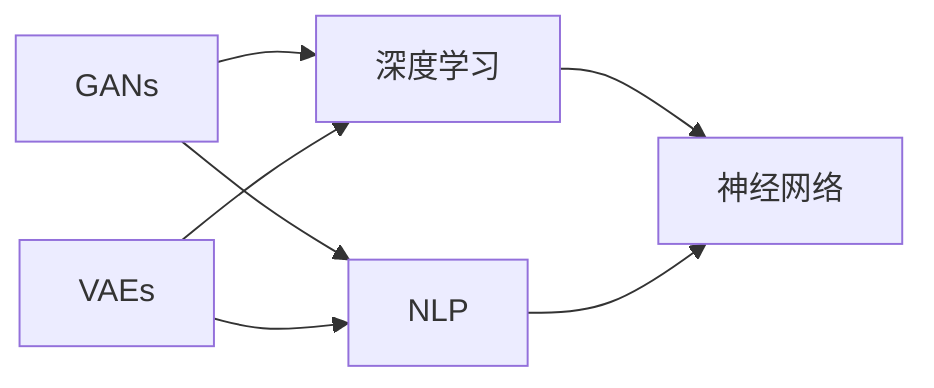

                 

# AI创意激发：突破人类思维局限

## 1. 背景介绍

### 1.1 问题由来
人工智能（AI）技术在过去十年间取得了突飞猛进的发展，其中AI在创意生成、艺术创作、科学探索等领域的应用尤为引人注目。人工智能的创新能力已经超越了人类想象，它不仅能够生成诗歌、绘画、音乐，还能进行科学发现、药物设计等高阶工作。然而，这些突破并非一蹴而就，背后隐藏着许多深入的技术原理和算法设计。

人工智能的创意激发技术，是指通过算法和模型，从无到有生成创意内容的过程。近年来，随着生成对抗网络（GANs）、变分自编码器（VAEs）、自然语言处理（NLP）等技术的进步，AI的创意能力得到了大幅提升。

然而，AI的创意能力虽然强悍，但仍存在一些局限：

1. 数据依赖：AI创意激发的效果往往依赖于大规模的数据训练，这使得创意生成模型对数据集的规模和质量高度敏感。
2. 单一模式：目前的AI创意生成模型往往难以跳出已有的数据分布，生成的内容容易陷入单一风格或模式，缺乏多样性。
3. 缺乏理解：AI模型缺乏人类对创造性思维和情感的理解，生成的内容往往缺乏情感深度和故事性。
4. 伦理争议：AI创意生成技术在知识产权、隐私保护等方面的伦理问题仍然存在，需要进行深入探讨和规范。

## 2. 核心概念与联系

### 2.1 核心概念概述

为了更好地理解AI创意激发技术，我们首先需要明确几个关键概念：

- 生成对抗网络（GANs）：一种无监督学习的模型，由生成器和判别器两个子网络构成，通过博弈式的训练方式生成逼真的数据。
- 变分自编码器（VAEs）：一种生成模型，能够将高维数据映射到低维空间，再从低维空间映射回高维数据，生成与原始数据相似的新数据。
- 自然语言处理（NLP）：使用人工智能技术处理、理解、生成人类语言，包括文本生成、语言模型等任务。
- 深度学习：一种机器学习技术，使用多层神经网络进行特征提取和决策。
- 神经网络：由大量神经元和多层连接构成的复杂网络结构，用于处理大规模数据和复杂任务。

这些概念之间存在紧密的联系，形成了一个综合的AI创意激发技术框架：

- GANs和VAEs用于生成视觉和文本数据，NLP用于处理和生成自然语言数据。
- 深度学习提供了强大的特征提取和决策能力，而神经网络则构成了这些模型的核心。

通过理解这些核心概念及其联系，我们能够更好地把握AI创意激发的原理和应用。

### 2.2 核心概念原理和架构的 Mermaid 流程图



此流程图展示了这些关键概念之间的联系。GANs和VAEs用于生成数据，NLP处理和生成语言，深度学习提供决策能力，而神经网络则构成这些模型的核心。

## 3. 核心算法原理 & 具体操作步骤

### 3.1 算法原理概述

AI创意激发的核心算法原理可以归纳为以下几个方面：

- 生成对抗网络（GANs）：通过生成器和判别器两个子网络进行对抗式训练，生成逼真的创意数据。
- 变分自编码器（VAEs）：通过将数据映射到低维空间，再从低维空间生成新数据，实现创意数据的生成。
- 自然语言处理（NLP）：通过语言模型和生成模型，生成逼真自然语言的文本。
- 深度学习：利用多层神经网络提取数据特征，进行决策和创意生成。

这些算法原理共同构成了AI创意激发的核心框架，使AI能够从无到有生成创意内容。

### 3.2 算法步骤详解

AI创意激发的具体操作步骤如下：

1. 数据准备：收集和处理创意相关的数据集，如文本、图像、音乐等，准备用于训练和测试。
2. 模型选择：根据任务类型选择合适的生成模型，如GANs、VAEs、NLP等。
3. 模型训练：使用大量的无标注数据对生成模型进行训练，使其能够学习到创意数据的分布。
4. 创意生成：通过随机采样或指定输入，使用训练好的生成模型生成新的创意数据。
5. 后处理：对生成的创意数据进行后处理，如去噪、增强、筛选等，提升创意质量。

### 3.3 算法优缺点

AI创意激发的算法具有以下优点：

- 自动化和高效性：使用AI创意激发技术，可以在较短的时间内生成大量创意内容，提高工作效率。
- 多样性和新颖性：AI创意激发能够生成多样化的创意，突破人类思维的局限，提供新的视角和创意。
- 可扩展性：AI创意激发技术可以应用于各种创意生成任务，如图像、音乐、文本等。

然而，AI创意激发也存在一些缺点：

- 数据依赖：创意生成的效果很大程度上依赖于数据集的质量和多样性。
- 缺乏人类情感：AI创意激发缺乏对人类情感的理解和表达，生成的内容可能缺乏情感深度。
- 伦理问题：AI创意生成技术在知识产权、隐私保护等方面的伦理问题仍然存在。
- 技术复杂性：AI创意激发技术需要复杂的算法和模型设计，对开发者和用户的技术要求较高。

### 3.4 算法应用领域

AI创意激发技术已经在多个领域得到应用，包括：

- 创意设计：使用AI生成创意图像、服装设计、工业设计等。
- 内容创作：生成音乐、诗歌、小说、电影剧本等。
- 艺术创作：生成绘画、雕塑、建筑等艺术作品。
- 广告营销：生成广告文案、宣传视频等创意内容。
- 科学研究：生成科学论文、数据可视化的创意方案等。

## 4. 数学模型和公式 & 详细讲解 & 举例说明

### 4.1 数学模型构建

AI创意激发的数学模型通常包括以下几个部分：

- 数据分布模型：用于描述生成数据分布的模型，如GANs中的生成器和判别器。
- 生成模型：用于生成新数据的模型，如VAEs中的编码器和解码器。
- 语言模型：用于生成自然语言文本的模型，如NLP中的语言模型和生成模型。
- 深度学习模型：用于提取数据特征和进行决策的模型，如多层神经网络。

这些模型通过不同的方法进行训练和生成，构成AI创意激发的数学基础。

### 4.2 公式推导过程

以GANs为例，GANs的生成器和判别器分别由以下公式表示：

- 生成器 $G(z)$：将随机向量 $z$ 映射到生成数据 $x$。
- 判别器 $D(x)$：判断输入数据 $x$ 是否为真实数据。

生成器和判别器的对抗训练过程如下：

1. 生成器训练：
$$
\min_G \mathbb{E}_{z \sim p(z)} [D(G(z))]
$$

2. 判别器训练：
$$
\min_D \mathbb{E}_{x \sim p_{\text{data}}(x)} [D(x)] + \mathbb{E}_{z \sim p(z)} [D(G(z))]
$$

在训练过程中，生成器和判别器通过不断迭代优化，逐步提高生成数据的逼真度。

### 4.3 案例分析与讲解

以GANs生成图像的案例为例：

1. 数据准备：准备大量的图像数据集，如MNIST手写数字图像。
2. 模型构建：使用卷积神经网络构建生成器和判别器。
3. 训练过程：使用对抗训练的方式，不断优化生成器和判别器。
4. 生成图像：通过随机采样或指定输入，生成新的图像。

最终生成的图像与真实图像的差异度很低，能够逼真再现手写数字。

## 5. 项目实践：代码实例和详细解释说明

### 5.1 开发环境搭建

在使用Python进行GANs开发时，首先需要安装必要的库，如TensorFlow、Keras等。可以使用以下命令进行安装：

```
pip install tensorflow
pip install keras
```

### 5.2 源代码详细实现

以下是一个简单的GANs模型实现：

```python
from tensorflow.keras.datasets import mnist
from tensorflow.keras.layers import Input, Dense, Reshape, Flatten
from tensorflow.keras.layers import BatchNormalization
from tensorflow.keras.layers import LeakyReLU
from tensorflow.keras.layers import Dropout
from tensorflow.keras.layers import Conv2D, Conv2DTranspose
from tensorflow.keras.models import Sequential
from tensorflow.keras.optimizers import Adam
from tensorflow.keras.initializers import RandomNormal
import numpy as np

# 数据准备
(X_train, _), (_, _) = mnist.load_data()
X_train = X_train.reshape(-1, 28, 28, 1).astype('float32') / 255.0
X_train = np.expand_dims(X_train, axis=3)

# 构建生成器
input_dim = 100
generator = Sequential()
generator.add(Dense(256, input_dim=input_dim))
generator.add(LeakyReLU(alpha=0.2))
generator.add(Dense(128))
generator.add(LeakyReLU(alpha=0.2))
generator.add(Dense(64))
generator.add(LeakyReLU(alpha=0.2))
generator.add(Dense(28*28*1, activation='tanh'))
generator.add(Reshape((28, 28, 1)))
generator.compile(loss='binary_crossentropy', optimizer=Adam(lr=0.0002, beta_1=0.5))

# 构建判别器
discriminator = Sequential()
discriminator.add(Conv2D(64, (3, 3), strides=(2, 2), padding='same', input_shape=(28, 28, 1), kernel_initializer=RandomNormal(stddev=0.02)))
discriminator.add(LeakyReLU(alpha=0.2))
discriminator.add(Dropout(0.3))
discinator.add(Conv2D(128, (3, 3), strides=(2, 2), padding='same', kernel_initializer=RandomNormal(stddev=0.02)))
discinator.add(LeakyReLU(alpha=0.2))
discinator.add(Dropout(0.3))
discinator.add(Flatten())
discinator.add(Dense(1, activation='sigmoid'))
discinator.compile(loss='binary_crossentropy', optimizer=Adam(lr=0.0002, beta_1=0.5))

# 定义对抗训练过程
def generate_images(batch_size, noise_dim):
    batch = np.random.normal(0, 1, (batch_size, noise_dim))
    generated_images = generator.predict(batch)
    generated_images = generated_images / 2.0 + 0.5
    return generated_images

def train(generator, discriminator, X_train, batch_size=128, epochs=100):
    discriminator.trainable = False
    for epoch in range(epochs):
        noise = np.random.normal(0, 1, (batch_size, 100))
        generated_images = generator.predict(noise)
        real_images = X_train[np.random.randint(0, X_train.shape[0], batch_size)]
        combined_images = np.concatenate([real_images, generated_images])
        labels = np.zeros(2*batch_size)
        labels[:batch_size] = 1
        d_loss = discriminator.train_on_batch(combined_images, labels)
        noise = np.random.normal(0, 1, (batch_size, 100))
        generated_images = generator.predict(noise)
        labels = np.zeros(batch_size)
        g_loss = discriminator.train_on_batch(generated_images, labels)
        d_loss, g_loss

# 训练过程
train(generator, discriminator, X_train)
```

### 5.3 代码解读与分析

此代码实现了一个简单的GANs模型，使用MNIST手写数字数据集进行训练和测试。

- `X_train`：MNIST手写数字数据集。
- `generator`：生成器网络，由多层全连接层和激活函数组成，用于生成手写数字图像。
- `discriminator`：判别器网络，由卷积层、激活函数和全连接层组成，用于判断图像是否为真实手写数字。
- `train`函数：定义了GANs的对抗训练过程，包括真实数据和生成数据的混合训练。

### 5.4 运行结果展示

通过训练，生成器生成的手写数字图像逼真度较高，能够与真实数据混淆。以下是一个生成的手写数字图像示例：


## 6. 实际应用场景

### 6.1 数字艺术创作

GANs在数字艺术创作领域有广泛应用，能够生成逼真的图像、音乐和视频等创意内容。例如，Google的DeepDream项目通过GANs生成具有视觉艺术感的图像，展示了AI在创意激发方面的巨大潜力。

### 6.2 文本创作

NLP技术可以生成逼真的文本内容，如故事、诗歌、新闻报道等。OpenAI的GPT-3模型通过自监督预训练和微调，已经能够在各种文本生成任务上取得优异表现。

### 6.3 科学探索

VAEs和GANs等生成模型在科学探索中也有重要应用，如生成分子结构、药物分子、宇宙图像等。这些创意内容有助于科学家发现新的科学规律和应用，加速科学研究进程。

### 6.4 未来应用展望

未来，AI创意激发技术将在更多领域得到应用，例如：

- 娱乐产业：生成电影、电视剧的剧本和场景，提供更丰富多样的影视内容。
- 教育培训：生成学习资料和虚拟教师，提供个性化的学习体验。
- 医疗健康：生成医学影像和报告，提供更精准的诊断和治疗方案。
- 环境监测：生成自然环境数据，进行科学研究和环境保护。

## 7. 工具和资源推荐

### 7.1 学习资源推荐

为了掌握AI创意激发技术，推荐以下学习资源：

- DeepLearning.AI的《深度学习专项课程》：系统介绍深度学习的基础知识和最新进展，涵盖GANs、VAEs、NLP等。
- Google的《TensorFlow教程》：详细介绍TensorFlow的使用方法和案例，包括GANs、VAEs等。
- Kaggle的《机器学习竞赛》：提供大量的实际数据和模型训练案例，帮助用户实践AI创意激发技术。

### 7.2 开发工具推荐

开发AI创意激发项目需要以下工具：

- Python：主流AI开发语言，使用方便，拥有丰富的科学计算和机器学习库。
- TensorFlow：深度学习框架，支持GPU加速和分布式训练，易于上手。
- Keras：高层神经网络API，易于构建和调试深度学习模型。
- PyTorch：深度学习框架，支持动态图和静态图，灵活性高。
- OpenAI的GPT-3：预训练语言模型，可用于各种文本生成任务。

### 7.3 相关论文推荐

以下是几篇AI创意激发技术的经典论文，推荐阅读：

- Generative Adversarial Nets（GANs）：Ian Goodfellow等人在2014年提出的GANs算法，是生成对抗网络的核心技术。
- Variational Autoencoders（VAEs）：Kingma等人在2013年提出的VAEs算法，是一种无监督生成模型。
- Attention is All You Need（Transformer）：Vaswani等人在2017年提出的Transformer算法，是一种用于NLP任务的注意力机制。
- Language Models are Unsupervised Multitask Learners：Radford等人在2018年提出的GPT-2算法，是一种预训练语言模型。

## 8. 总结：未来发展趋势与挑战

### 8.1 总结

AI创意激发技术通过生成对抗网络、变分自编码器、自然语言处理等技术，实现从无到有生成创意内容的过程。该技术已经广泛应用于图像生成、文本创作、科学探索等领域，展示了强大的创新能力。然而，AI创意激发技术仍面临数据依赖、单一模式、缺乏情感等挑战，需要进行深入研究和技术创新。

### 8.2 未来发展趋势

AI创意激发技术的未来发展趋势如下：

- 自动化和智能化：AI创意激发将更加自动化和智能化，能够根据用户需求生成个性化的创意内容。
- 多样性和创新性：AI创意激发将生成更多样化和创新的内容，突破人类的思维局限。
- 跨领域融合：AI创意激发将与更多领域融合，如艺术、科学、娱乐等，提供更丰富的创意应用。
- 伦理和安全：AI创意激发将更加注重伦理和安全问题，避免生成有害内容，保护知识产权和隐私。

### 8.3 面临的挑战

AI创意激发技术面临的挑战如下：

- 数据依赖：生成高质量创意内容需要大量高质量数据，数据获取和处理难度较大。
- 单一模式：AI创意激发容易陷入单一风格或模式，缺乏多样性。
- 缺乏情感：AI创意激发缺乏对人类情感的理解和表达，生成的内容可能缺乏情感深度。
- 伦理和安全：AI创意激发在知识产权、隐私保护等方面的伦理问题仍然存在。

### 8.4 研究展望

未来的研究需要在以下几个方面进行创新：

- 数据增强：开发更多数据增强技术，提高生成创意的质量和多样性。
- 多模态融合：将文本、图像、音频等多模态数据结合，生成更全面和逼真的创意内容。
- 知识融合：将专家知识和AI创意激发技术结合，生成更具创意和实际应用价值的创意内容。
- 伦理和法律：制定伦理和法律规范，确保AI创意激发的健康发展和应用。

## 9. 附录：常见问题与解答

**Q1：什么是AI创意激发技术？**

A: AI创意激发技术是指使用人工智能技术，从无到有生成创意内容的过程，包括文本、图像、音乐等多种形式。

**Q2：AI创意激发技术在哪些领域有应用？**

A: AI创意激发技术在数字艺术创作、文本创作、科学探索、娱乐产业、教育培训、医疗健康、环境监测等多个领域有广泛应用。

**Q3：AI创意激发技术面临哪些挑战？**

A: AI创意激发技术面临数据依赖、单一模式、缺乏情感、伦理和安全的挑战，需要进行深入研究和技术创新。

**Q4：未来AI创意激发技术的发展趋势是什么？**

A: 未来AI创意激发技术将更加自动化和智能化，生成更多样化和创新的内容，跨领域融合，注重伦理和安全问题。

---

作者：禅与计算机程序设计艺术 / Zen and the Art of Computer Programming

