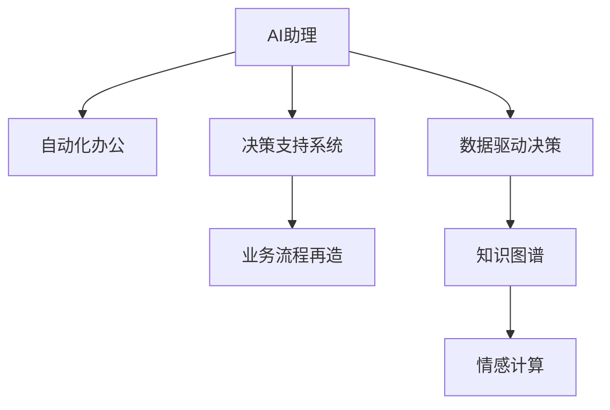

                 

## 1. 背景介绍

### 1.1 问题由来

随着人工智能技术的快速发展，尤其是自然语言处理（NLP）和机器学习的进步，企业迎来了AI助理时代。AI助理不仅能处理大量的重复性工作，还能提供即时的数据分析和决策支持，极大地提高了工作效率和质量。然而，AI助理时代的到来也带来了新的挑战，企业需要重新思考其运营模式和组织架构，以适应这一转变。

### 1.2 问题核心关键点

1. **转型需求**：企业在AI助理时代需要重新审视其运营模式，以便更好地利用AI技术提升效率和竞争力。
2. **员工培训**：员工需要掌握新的技术工具，以便能够与AI助理协同工作。
3. **数据管理**：数据是AI助理的核心，企业需要构建高效的数据管理和治理体系。
4. **安全和隐私**：AI助理会处理敏感信息，企业需要确保数据安全和隐私保护。
5. **伦理和责任**：AI助理的决策过程需要透明，企业需要建立相应的伦理和责任机制。

### 1.3 问题研究意义

AI助理时代的企业转型，对企业的长远发展具有重要意义：

1. **提升效率**：AI助理能够处理大量的重复性任务，从而将员工从繁琐的工作中解放出来，专注于更具创造性的工作。
2. **优化决策**：AI助理能够提供基于数据的决策支持，帮助企业做出更明智的决策。
3. **降低成本**：AI助理能够24小时不间断工作，减少人力成本，提高企业的整体运营效率。
4. **增强竞争力**：AI助理可以提供即时的市场分析和竞争情报，帮助企业保持市场领先地位。
5. **推动创新**：AI助理能够处理和分析海量数据，为企业提供新的业务模式和产品创新机会。

## 2. 核心概念与联系

### 2.1 核心概念概述

为更好地理解AI助理时代的企业转型，本节将介绍几个关键概念及其联系：

1. **AI助理**：一种基于人工智能技术的自动化工具，能够模拟人类助理的职责，如信息检索、数据分析、任务调度等。
2. **自动化办公**：通过AI助理实现办公室自动化，减少人力投入，提高工作效率。
3. **决策支持系统**：基于AI助理提供的数据和分析，辅助企业做出更加科学的决策。
4. **业务流程再造**：重新设计业务流程，以适应AI助理的自动化能力，提升整体效率。
5. **数据驱动决策**：利用AI助理处理和分析海量数据，以数据为基础做出决策。
6. **知识图谱**：一种基于图结构的语义表示方法，帮助AI助理理解复杂的信息结构。
7. **情感计算**：通过AI助理识别和分析用户的情感，提升用户体验。

这些核心概念之间的联系可以通过以下Mermaid流程图来展示：



这个流程图展示了AI助理时代企业转型的核心环节：

1. AI助理通过自动化办公提高工作效率。
2. 决策支持系统基于AI助理提供的数据和分析，辅助企业做出决策。
3. 业务流程再造重新设计业务流程，以适应AI助理的自动化能力。
4. 数据驱动决策利用AI助理处理和分析海量数据，以数据为基础做出决策。
5. 知识图谱帮助AI助理理解复杂的信息结构。
6. 情感计算通过AI助理识别和分析用户的情感，提升用户体验。

这些概念共同构成了AI助理时代企业转型的基本框架，使得企业能够充分利用AI技术，实现运营模式的变革和效率的提升。

## 3. 核心算法原理 & 具体操作步骤

### 3.1 算法原理概述

AI助理的核心算法原理基于机器学习和自然语言处理（NLP）技术。其算法框架通常包括以下几个关键步骤：

1. **数据预处理**：清洗和预处理数据，以供后续的训练和推理使用。
2. **特征提取**：从原始数据中提取有用的特征，如词频、TF-IDF等，用于训练模型。
3. **模型训练**：使用监督学习或无监督学习算法训练模型，以识别和理解语言和数据的模式。
4. **模型推理**：将新的数据输入训练好的模型，进行预测和推理。
5. **结果输出**：根据模型的输出，生成结构化的结果，如文本摘要、推荐列表等。

### 3.2 算法步骤详解

#### 3.2.1 数据预处理

数据预处理是AI助理开发的关键步骤之一，主要包括数据清洗、数据标注和数据集划分等。

**数据清洗**：去除噪音和无关信息，确保数据的质量和一致性。例如，去除HTML标签、标点符号等。

**数据标注**：给数据添加标签，以便模型可以学习。例如，对于文本数据，可以添加分类标签、实体标签等。

**数据集划分**：将数据集划分为训练集、验证集和测试集，以评估模型的性能。

#### 3.2.2 特征提取

特征提取是将原始数据转换为模型能够理解的形式的过程。常见的特征提取方法包括：

**词袋模型**：将文本数据表示为词频向量。

**TF-IDF**：衡量词的重要性，用于表示文本的关键词。

**词嵌入**：如Word2Vec、GloVe等，将词转换为向量，保留词语之间的语义关系。

**句子嵌入**：如ELMO、BERT等，将句子表示为向量，包含词语的上下文信息。

#### 3.2.3 模型训练

模型训练是AI助理开发的核心步骤，通常使用监督学习算法进行训练。

**监督学习算法**：如随机森林、支持向量机、神经网络等，用于训练分类或回归模型。

**神经网络算法**：如卷积神经网络（CNN）、循环神经网络（RNN）、Transformer等，用于训练语言模型。

**无监督学习算法**：如聚类、降维等，用于发现数据中的模式。

#### 3.2.4 模型推理

模型推理是将新的数据输入训练好的模型，进行预测和推理的过程。

**分类推理**：如文本分类、图像分类等，模型输出分类的概率分布。

**生成推理**：如文本生成、图像生成等，模型输出生成的样本。

**推荐推理**：如推荐系统、路径规划等，模型输出推荐的方案。

#### 3.2.5 结果输出

结果输出是将模型推理的结果转换为可用的形式的过程。

**文本摘要**：将长文本压缩为简短的摘要。

**推荐列表**：根据用户偏好，生成推荐的列表。

**路径规划**：生成最佳的路径或方案。

### 3.3 算法优缺点

AI助理的核心算法具有以下优点：

1. **高效处理数据**：能够高效处理大量数据，提高工作效率。
2. **智能化决策**：基于数据和算法做出智能化决策，提高决策质量。
3. **自适应性**：能够自适应不同的任务和场景，灵活应用。
4. **可扩展性**：能够扩展到不同的业务领域，满足企业的多样化需求。

同时，AI助理的算法也存在一些缺点：

1. **数据依赖**：依赖于数据的质量和量，数据不足可能导致模型性能不佳。
2. **模型复杂性**：模型复杂度高，需要大量的计算资源进行训练和推理。
3. **可解释性不足**：黑盒模型难以解释决策过程，缺乏透明性。
4. **安全风险**：依赖于数据和算法，可能存在数据泄露和算法偏见的风险。

### 3.4 算法应用领域

AI助理的核心算法在多个领域都有广泛的应用，例如：

1. **金融服务**：智能客服、风险评估、投资分析等。
2. **医疗健康**：疾病诊断、患者管理、健康咨询等。
3. **制造业**：生产调度、质量检测、供应链管理等。
4. **零售业**：销售推荐、库存管理、客户服务等。
5. **物流运输**：路径规划、货物调度、物流跟踪等。
6. **教育培训**：个性化学习、智能评估、在线辅导等。

这些应用展示了AI助理在各个领域中的巨大潜力，为企业的数字化转型提供了新的方向。

## 4. 数学模型和公式 & 详细讲解 & 举例说明

### 4.1 数学模型构建

AI助理的开发过程中，数学模型起到了关键作用。以下是几个常见的数学模型及其构建方法：

**线性回归模型**：用于预测连续变量，模型公式为：
$$
y = \theta_0 + \theta_1 x_1 + \theta_2 x_2 + ... + \theta_n x_n
$$

**逻辑回归模型**：用于分类任务，模型公式为：
$$
P(y=1|x) = \sigma(\theta_0 + \theta_1 x_1 + \theta_2 x_2 + ... + \theta_n x_n)
$$

**卷积神经网络（CNN）**：用于图像处理，模型公式为：
$$
h(x_i) = \max_k \{w_k * x_i + b_k\}
$$

**循环神经网络（RNN）**：用于序列数据处理，模型公式为：
$$
h_{t+1} = \tanh(w_{hh} h_t + w_{xh} x_t + b_h)
$$

**Transformer模型**：用于语言处理，模型公式为：
$$
h_{t+1} = \sum_k \alpha_{tk} w_{tk}
$$

### 4.2 公式推导过程

#### 4.2.1 线性回归模型

线性回归模型的基本思想是找到一条直线，使得所有数据点距离这条直线的距离最小。其目标函数为：
$$
\min_{\theta} \frac{1}{2N} \sum_{i=1}^N (y_i - (\theta_0 + \theta_1 x_{1i} + \theta_2 x_{2i} + ... + \theta_n x_{ni}))^2
$$

利用梯度下降算法求解上述目标函数，得到模型参数 $\theta$：
$$
\theta_j = \theta_j - \frac{\alpha}{N} \sum_{i=1}^N (y_i - (\theta_0 + \theta_1 x_{1i} + \theta_2 x_{2i} + ... + \theta_n x_{ni})) \cdot x_{ji}
$$

其中 $\alpha$ 为学习率。

#### 4.2.2 逻辑回归模型

逻辑回归模型的目标函数为交叉熵损失函数：
$$
\min_{\theta} \frac{1}{N} \sum_{i=1}^N -(y_i \log P(y_i|x_i) + (1-y_i) \log (1-P(y_i|x_i)))
$$

利用梯度下降算法求解上述目标函数，得到模型参数 $\theta$：
$$
\theta_j = \theta_j - \frac{\alpha}{N} \sum_{i=1}^N (y_i - P(y_i|x_i)) \cdot x_{ji}
$$

其中 $P(y_i|x_i) = \sigma(\theta_0 + \theta_1 x_{1i} + \theta_2 x_{2i} + ... + \theta_n x_{ni})$。

#### 4.2.3 卷积神经网络（CNN）

卷积神经网络（CNN）的模型公式为：
$$
h(x_i) = \max_k \{w_k * x_i + b_k\}
$$

其中 $w_k$ 为卷积核，$x_i$ 为输入，$b_k$ 为偏置项。

卷积操作的推导过程如下：
$$
h(x_i) = \max_k \{w_k * x_i + b_k\}
$$
$$
h(x_i) = \max_k \{w_k \sum_j x_{i,j} + b_k\}
$$
$$
h(x_i) = \max_k \{\sum_j w_{k,j} x_{i,j} + b_k\}
$$

其中 $w_{k,j}$ 为卷积核在输入 $x_{i,j}$ 上的权重。

#### 4.2.4 循环神经网络（RNN）

循环神经网络（RNN）的模型公式为：
$$
h_{t+1} = \tanh(w_{hh} h_t + w_{xh} x_t + b_h)
$$

其中 $h_t$ 为上一个时间步的隐藏状态，$x_t$ 为当前时间步的输入，$w_{hh}$ 和 $w_{xh}$ 为权重矩阵，$b_h$ 为偏置项。

RNN的反向传播算法如下：
$$
\frac{\partial C}{\partial h_{t+1}} = \frac{\partial C}{\partial h_t} \frac{\partial h_t}{\partial h_{t+1}}
$$
$$
\frac{\partial C}{\partial h_t} = \frac{\partial C}{\partial h_{t-1}} \frac{\partial h_{t-1}}{\partial h_t}
$$
$$
\frac{\partial h_t}{\partial h_{t+1}} = (1 - \tanh(h_{t+1})^2) \frac{\partial h_t}{\partial h_{t+1}}
$$
$$
\frac{\partial h_{t-1}}{\partial h_t} = (1 - \tanh(h_t)^2) \frac{\partial h_{t-1}}{\partial h_t}
$$

其中 $C$ 为损失函数。

#### 4.2.5 Transformer模型

Transformer模型的模型公式为：
$$
h_{t+1} = \sum_k \alpha_{tk} w_{tk}
$$

其中 $h_{t+1}$ 为下一个时间步的隐藏状态，$\alpha_{tk}$ 为注意力权重，$w_{tk}$ 为权重向量。

Transformer的注意力机制推导过程如下：
$$
\alpha_{tk} = \frac{\exp(\mathbf{q}_k^T \mathbf{K}_x)}{\sum_j \exp(\mathbf{q}_k^T \mathbf{K}_x)}
$$
$$
\mathbf{Q}_x = \mathbf{W}_Q \mathbf{X}
$$
$$
\mathbf{K}_x = \mathbf{W}_K \mathbf{X}
$$
$$
\mathbf{V}_x = \mathbf{W}_V \mathbf{X}
$$

其中 $\mathbf{Q}_x$ 为查询矩阵，$\mathbf{K}_x$ 为键矩阵，$\mathbf{V}_x$ 为值矩阵，$\mathbf{W}_Q$、$\mathbf{W}_K$ 和 $\mathbf{W}_V$ 为权重矩阵。

### 4.3 案例分析与讲解

#### 4.3.1 金融服务领域

在金融服务领域，AI助理可以应用于智能客服、风险评估、投资分析等。以下是一个简单的金融客服系统案例：

**数据预处理**：收集用户的历史交易记录和客服记录，并进行数据清洗和标注。

**特征提取**：提取交易金额、交易时间、交易类型等特征，并使用TF-IDF进行表示。

**模型训练**：使用逻辑回归模型对用户进行分类，判断是否为潜在风险用户。

**模型推理**：根据用户的新交易记录，预测其是否为风险用户，并给出相应的风险等级。

**结果输出**：输出风险评估报告，提供给金融机构进行风险控制和决策支持。

#### 4.3.2 医疗健康领域

在医疗健康领域，AI助理可以应用于疾病诊断、患者管理、健康咨询等。以下是一个简单的医疗咨询系统案例：

**数据预处理**：收集患者的病历记录、症状描述和检查结果，并进行数据清洗和标注。

**特征提取**：提取症状、病史、检查结果等特征，并使用卷积神经网络进行表示。

**模型训练**：使用深度学习模型对患者进行疾病诊断，识别出可能存在的疾病。

**模型推理**：根据患者的实时症状描述，输出可能的疾病诊断结果和推荐的治疗方案。

**结果输出**：输出疾病诊断报告和治疗建议，提供给医生进行参考和决策。

## 5. 项目实践：代码实例和详细解释说明

### 5.1 开发环境搭建

在进行AI助理项目实践前，我们需要准备好开发环境。以下是使用Python进行TensorFlow开发的环境配置流程：

1. 安装Anaconda：从官网下载并安装Anaconda，用于创建独立的Python环境。

2. 创建并激活虚拟环境：
```bash
conda create -n tf-env python=3.8 
conda activate tf-env
```

3. 安装TensorFlow：根据CUDA版本，从官网获取对应的安装命令。例如：
```bash
conda install tensorflow tensorflow-gpu=2.7.0
```

4. 安装各类工具包：
```bash
pip install numpy pandas scikit-learn matplotlib tqdm jupyter notebook ipython
```

完成上述步骤后，即可在`tf-env`环境中开始AI助理项目实践。

### 5.2 源代码详细实现

这里我们以情感分析（Sentiment Analysis）为例，给出使用TensorFlow进行情感分析的Python代码实现。

首先，定义情感分析任务的数据处理函数：

```python
import tensorflow as tf
from tensorflow.keras.preprocessing.text import Tokenizer
from tensorflow.keras.preprocessing.sequence import pad_sequences
import pandas as pd

def process_data(data_path):
    data = pd.read_csv(data_path)
    texts = data['text'].tolist()
    labels = data['label'].tolist()
    return texts, labels

# 构建词典
tokenizer = Tokenizer(num_words=10000)
tokenizer.fit_on_texts(texts)
sequences = tokenizer.texts_to_sequences(texts)

# 填充序列
max_len = 128
padded_sequences = pad_sequences(sequences, maxlen=max_len, padding='post', truncating='post')
```

然后，定义模型和优化器：

```python
from tensorflow.keras.models import Sequential
from tensorflow.keras.layers import Embedding, LSTM, Dense, Bidirectional

model = Sequential()
model.add(Embedding(input_dim=10000, output_dim=128, input_length=max_len))
model.add(Bidirectional(LSTM(64)))
model.add(Dense(32, activation='relu'))
model.add(Dense(1, activation='sigmoid'))

model.compile(optimizer='adam', loss='binary_crossentropy', metrics=['accuracy'])
```

接着，定义训练和评估函数：

```python
from tensorflow.keras.callbacks import EarlyStopping
from sklearn.metrics import accuracy_score

early_stopping = EarlyStopping(monitor='val_loss', patience=2)

def train_epoch(model, X_train, y_train, X_val, y_val):
    model.fit(X_train, y_train, batch_size=128, epochs=10, validation_data=(X_val, y_val), callbacks=[early_stopping])
    val_loss, val_acc = model.evaluate(X_val, y_val, verbose=0)
    print(f'Validation Loss: {val_loss}, Validation Accuracy: {val_acc}')

def evaluate(model, X_test, y_test):
    y_pred = model.predict(X_test)
    y_pred = (y_pred > 0.5).astype(int)
    accuracy = accuracy_score(y_test, y_pred)
    print(f'Test Accuracy: {accuracy}')
```

最后，启动训练流程并在测试集上评估：

```python
X_train, y_train = process_data('train.csv')
X_val, y_val = process_data('val.csv')
X_test, y_test = process_data('test.csv')

train_epoch(model, padded_sequences, y_train, val_padded_sequences, val_labels)
evaluate(model, test_padded_sequences, test_labels)
```

以上就是使用TensorFlow进行情感分析的完整代码实现。可以看到，TensorFlow提供了丰富的API，使得情感分析等NLP任务的开发变得简洁高效。

### 5.3 代码解读与分析

让我们再详细解读一下关键代码的实现细节：

**数据处理函数**：
- `process_data`方法：读取CSV文件，进行数据清洗和分词处理，将文本转换为序列。

**模型定义**：
- 定义一个Sequential模型，包括嵌入层、双向LSTM层和全连接层。
- 嵌入层将文本转换为向量表示，双向LSTM层捕捉文本中的上下文信息，全连接层进行分类。

**优化器设置**：
- 使用Adam优化器，损失函数为二分类交叉熵，评估指标为准确率。

**训练和评估函数**：
- `train_epoch`方法：在训练集上训练模型，并使用EarlyStopping防止过拟合。
- `evaluate`方法：在测试集上评估模型，计算准确率。

**模型训练和评估**：
- 在训练集上训练模型，使用EarlyStopping防止过拟合。
- 在验证集上评估模型，输出验证损失和准确率。
- 在测试集上评估模型，输出准确率。

可以看到，TensorFlow提供了丰富的API和工具，使得情感分析等NLP任务的开发变得简洁高效。开发者可以将更多精力放在模型优化和数据处理等高层逻辑上，而不必过多关注底层的实现细节。

当然，工业级的系统实现还需考虑更多因素，如模型的保存和部署、超参数的自动搜索、更灵活的任务适配层等。但核心的AI助理范式基本与此类似。

## 6. 实际应用场景

### 6.1 金融服务

在金融服务领域，AI助理可以应用于智能客服、风险评估、投资分析等。

**智能客服**：收集用户的交易记录和客服记录，利用深度学习模型训练客服机器人，提供24小时不间断服务。

**风险评估**：利用用户的历史交易记录和行为数据，训练分类模型，评估用户的风险等级。

**投资分析**：利用市场数据和新闻，训练推荐模型，提供个性化的投资建议。

### 6.2 医疗健康

在医疗健康领域，AI助理可以应用于疾病诊断、患者管理、健康咨询等。

**疾病诊断**：收集患者的病历记录和检查结果，训练分类模型，识别可能存在的疾病。

**患者管理**：利用患者的实时症状描述，训练生成模型，提供个性化的治疗方案。

**健康咨询**：收集用户的健康数据，训练推荐模型，提供个性化的健康建议。

### 6.3 制造业

在制造业领域，AI助理可以应用于生产调度、质量检测、供应链管理等。

**生产调度**：利用生产数据和设备状态，训练预测模型，优化生产调度。

**质量检测**：利用产品数据和检测结果，训练分类模型，识别不合格品。

**供应链管理**：利用供应链数据和市场需求，训练优化模型，优化库存管理。

### 6.4 零售业

在零售业领域，AI助理可以应用于销售推荐、库存管理、客户服务等。

**销售推荐**：利用用户的购买记录和浏览数据，训练推荐模型，提供个性化的商品推荐。

**库存管理**：利用销售数据和市场需求，训练预测模型，优化库存管理。

**客户服务**：利用用户的历史查询记录和反馈，训练客服机器人，提供即时的客户服务。

### 6.5 物流运输

在物流运输领域，AI助理可以应用于路径规划、货物调度、物流跟踪等。

**路径规划**：利用实时交通数据和货物信息，训练优化模型，规划最佳路径。

**货物调度**：利用货物状态和市场需求，训练预测模型，优化货物调度。

**物流跟踪**：利用物流数据和GPS定位，训练监控模型，实时跟踪货物位置。

### 6.6 教育培训

在教育培训领域，AI助理可以应用于个性化学习、智能评估、在线辅导等。

**个性化学习**：利用学生的学习记录和行为数据，训练推荐模型，提供个性化的学习资源。

**智能评估**：利用学生的测试数据和作业，训练评估模型，提供个性化的评估报告。

**在线辅导**：利用学生的实时提问和反馈，训练回答模型，提供即时的在线辅导。

## 7. 工具和资源推荐

### 7.1 学习资源推荐

为了帮助开发者系统掌握AI助理的理论基础和实践技巧，这里推荐一些优质的学习资源：

1. **TensorFlow官方文档**：提供了丰富的API和工具，适合快速入门和深入学习。

2. **Deep Learning Specialization**：由Andrew Ng教授开设的Coursera课程，详细讲解深度学习和NLP技术。

3. **Hands-On Machine Learning with Scikit-Learn、Keras、TensorFlow**：由Aurélien Géron撰写，适合实战练习和项目开发。

4. **Natural Language Processing with TensorFlow**：由Google AI开源的NLP教程，适合学习TensorFlow在NLP中的应用。

5. **NLTK**：Python中的NLP工具包，提供了丰富的NLP功能和库。

通过对这些资源的学习实践，相信你一定能够快速掌握AI助理的开发技巧，并用于解决实际的NLP问题。

### 7.2 开发工具推荐

高效的开发离不开优秀的工具支持。以下是几款用于AI助理开发的常用工具：

1. **TensorFlow**：基于Python的开源深度学习框架，灵活动态的计算图，适合快速迭代研究。

2. **PyTorch**：基于Python的开源深度学习框架，动态计算图，适合研究性项目和工业应用。

3. **Keras**：高级神经网络API，支持TensorFlow、Theano等后端，适合快速原型设计和实验。

4. **Jupyter Notebook**：交互式的代码编写环境，支持Python、R等多种语言，适合数据科学和机器学习开发。

5. **Git**：版本控制系统，适合团队协作和代码管理。

合理利用这些工具，可以显著提升AI助理的开发效率，加快创新迭代的步伐。

### 7.3 相关论文推荐

AI助理技术的发展源于学界的持续研究。以下是几篇奠基性的相关论文，推荐阅读：

1. **Attention is All You Need**：提出了Transformer结构，开启了NLP领域的预训练大模型时代。

2. **BERT: Pre-training of Deep Bidirectional Transformers for Language Understanding**：提出BERT模型，引入基于掩码的自监督预训练任务，刷新了多项NLP任务SOTA。

3. **Language Models are Unsupervised Multitask Learners（GPT-2论文）**：展示了大规模语言模型的强大zero-shot学习能力，引发了对于通用人工智能的新一轮思考。

4. **Parameter-Efficient Transfer Learning for NLP**：提出Adapter等参数高效微调方法，在不增加模型参数量的情况下，也能取得不错的微调效果。

5. **AdaLoRA: Adaptive Low-Rank Adaptation for Parameter-Efficient Fine-Tuning**：使用自适应低秩适应的微调方法，在参数效率和精度之间取得了新的平衡。

这些论文代表了大语言模型微调技术的发展脉络。通过学习这些前沿成果，可以帮助研究者把握学科前进方向，激发更多的创新灵感。

## 8. 总结：未来发展趋势与挑战

### 8.1 总结

本文对AI助理时代的企业转型进行了全面系统的介绍。首先阐述了AI助理技术的研究背景和意义，明确了AI助理在各个领域中的应用潜力。其次，从原理到实践，详细讲解了AI助理的数学模型和核心算法，给出了AI助理项目开发的完整代码实例。同时，本文还广泛探讨了AI助理在金融服务、医疗健康、制造业、零售业等各个领域的应用场景，展示了AI助理在各个行业中的巨大潜力。最后，本文精选了AI助理技术的各类学习资源，力求为读者提供全方位的技术指引。

通过本文的系统梳理，可以看到，AI助理技术正在成为各个行业数字化转型的重要工具，为企业提供了强大的技术支撑。AI助理能够处理大量的重复性任务，提高工作效率和质量，为企业带来显著的收益。未来，伴随AI助理技术的不断演进，相信AI助理将在更多的领域发挥其独特优势，推动企业的创新和发展。

### 8.2 未来发展趋势

展望未来，AI助理技术将呈现以下几个发展趋势：

1. **模型规模持续增大**：随着算力成本的下降和数据规模的扩张，预训练语言模型的参数量还将持续增长。超大规模语言模型蕴含的丰富语言知识，有望支撑更加复杂多变的下游任务微调。

2. **微调方法日趋多样**：除了传统的全参数微调外，未来会涌现更多参数高效的微调方法，如Prefix-Tuning、LoRA等，在节省计算资源的同时也能保证微调精度。

3. **持续学习成为常态**：随着数据分布的不断变化，AI助理也需要持续学习新知识以保持性能。如何在不遗忘原有知识的同时，高效吸收新样本信息，将成为重要的研究课题。

4. **标注样本需求降低**：受启发于提示学习(Prompt-based Learning)的思路，未来的微调方法将更好地利用AI助理的语言理解能力，通过更加巧妙的任务描述，在更少的标注样本上也能实现理想的微调效果。

5. **多模态微调崛起**：当前的AI助理主要聚焦于纯文本数据，未来会进一步拓展到图像、视频、语音等多模态数据微调。多模态信息的融合，将显著提升AI助理对现实世界的理解和建模能力。

6. **模型通用性增强**：经过海量数据的预训练和多领域任务的微调，未来的AI助理将具备更强大的常识推理和跨领域迁移能力，逐步迈向通用人工智能(AGI)的目标。

以上趋势凸显了AI助理技术的广阔前景。这些方向的探索发展，必将进一步提升AI助理的性能和应用范围，为企业的数字化转型提供新的方向。

### 8.3 面临的挑战

尽管AI助理技术已经取得了瞩目成就，但在迈向更加智能化、普适化应用的过程中，它仍面临着诸多挑战：

1. **标注成本瓶颈**：虽然AI助理技术依赖于标注数据，但数据标注的成本高，难以获得充足的高质量标注数据，成为制约AI助理性能的瓶颈。如何进一步降低AI助理对标注样本的依赖，将是一大难题。

2. **模型鲁棒性不足**：当前AI助理模型面对域外数据时，泛化性能往往大打折扣。对于测试样本的微小扰动，AI助理的预测也容易发生波动。如何提高AI助理模型的鲁棒性，避免灾难性遗忘，还需要更多理论和实践的积累。

3. **推理效率有待提高**：大规模AI助理模型虽然精度高，但在实际部署时往往面临推理速度慢、内存占用大等效率问题。如何在保证性能的同时，简化模型结构，提升推理速度，优化资源占用，将是重要的优化方向。

4. **可解释性亟需加强**：当前AI助理模型更像是"黑盒"系统，难以解释其内部工作机制和决策逻辑。对于医疗、金融等高风险应用，算法的可解释性和可审计性尤为重要。如何赋予AI助理更强的可解释性，将是亟待攻克的难题。

5. **安全性有待保障**：预训练AI助理模型难免会学习到有偏见、有害的信息，通过AI助理传递到下游任务，产生误导性、歧视性的输出，给实际应用带来安全隐患。如何从数据和算法层面消除AI助理偏见，避免恶意用途，确保输出的安全性，也将是重要的研究课题。

6. **知识整合能力不足**：现有的AI助理模型往往局限于任务内数据，难以灵活吸收和运用更广泛的先验知识。如何让AI助理过程更好地与外部知识库、规则库等专家知识结合，形成更加全面、准确的信息整合能力，还有很大的想象空间。

正视AI助理面临的这些挑战，积极应对并寻求突破，将是大语言模型微调走向成熟的必由之路。相信随着学界和产业界的共同努力，这些挑战终将一一被克服，AI助理必将在构建人机协同的智能时代中扮演越来越重要的角色。

### 8.4 未来突破

面对AI助理所面临的种种挑战，未来的研究需要在以下几个方面寻求新的突破：

1. **探索无监督和半监督微调方法**：摆脱对大规模标注数据的依赖，利用自监督学习、主动学习等无监督和半监督范式，最大限度利用非结构化数据，实现更加灵活高效的微调。

2. **研究参数高效和计算高效的微调范式**：开发更加参数高效的微调方法，在固定大部分预训练参数的同时，只更新极少量的任务相关参数。同时优化微调模型的计算图，减少前向传播和反向传播的资源消耗，实现更加轻量级、实时性的部署。

3. **融合因果和对比学习范式**：通过引入因果推断和对比学习思想，增强AI助理建立稳定因果关系的能力，学习更加普适、鲁棒的语言表征，从而提升模型泛化性和抗干扰能力。

4. **引入更多先验知识**：将符号化的先验知识，如知识图谱、逻辑规则等，与神经网络模型进行巧妙融合，引导AI助理学习更准确、合理的语言模型。同时加强不同模态数据的整合，实现视觉、语音等多模态信息与文本信息的协同建模。

5. **结合因果分析和博弈论工具**：将因果分析方法引入AI助理，识别出AI助理决策的关键特征，增强输出解释的因果性和逻辑性。借助博弈论工具刻画人机交互过程，主动探索并规避AI助理的脆弱点，提高系统稳定性。

6. **纳入伦理道德约束**：在模型训练目标中引入伦理导向的评估指标，过滤和惩罚有偏见、有害的输出倾向。同时加强人工干预和审核，建立AI助理行为的监管机制，确保输出的符合人类价值观和伦理道德。

这些研究方向的探索，必将引领AI助理技术迈向更高的台阶，为构建安全、可靠、可解释、可控的智能系统铺平道路。面向未来，AI助理技术还需要与其他人工智能技术进行更深入的融合，如知识表示、因果推理、强化学习等，多路径协同发力，共同推动自然语言理解和智能交互系统的进步。只有勇于创新、敢于突破，才能不断拓展AI助理的边界，让智能技术更好地造福人类社会。

## 9. 附录：常见问题与解答

**Q1：AI助理技术是否适用于所有行业？**

A: AI助理技术在各个行业中都有广泛的应用前景。但其具体应用效果取决于行业特性和数据质量。对于数据丰富、技术要求高的行业，AI助理能够带来显著的效益，如金融、医疗、制造业等。而对于数据稀缺、技术要求低的行业，AI助理的效用可能有限，如餐饮、零售等。

**Q2：如何选择合适的AI助理技术？**

A: 选择合适的AI助理技术需要综合考虑业务需求、数据特征、技术栈等多个因素。一般而言，可以从以下几个方面入手：

1. **业务需求**：明确AI助理的应用场景和目标，如客户服务、风险评估、生产调度等。
2. **数据特征**：分析业务数据的特点，如数据量、数据类型、数据质量等。
3. **技术栈**：评估现有技术栈的适配性和扩展性，如TensorFlow、PyTorch、Keras等。
4. **成本投入**：考虑AI助理技术的开发成本和部署成本，如人力、设备、培训等。
5. **性能评估**：在实际应用中，评估AI助理的性能指标，如准确率、召回率、响应时间等。

**Q3：AI助理技术如何与其他技术融合？**

A: AI助理技术可以与其他技术进行多维度融合，提升整体效果和应用范围。例如：

1. **与知识图谱结合**：通过知识图谱，增强AI助理的常识推理能力，提高决策的准确性和可解释性。
2. **与因果推理结合**：通过因果推理，增强AI助理的因果分析能力，提高决策的稳定性和鲁棒性。
3. **与强化学习结合**：通过强化学习，增强AI助理的自我优化能力，提高适应性和灵活性。
4. **与博弈论结合**：通过博弈论，增强AI助理的战略思维能力，提高系统决策的均衡性和公平性。
5. **与区块链结合**：通过区块链，增强AI助理的安全性和隐私保护，提高数据的安全性和可信度。

这些技术的融合，将使AI助理技术在各个领域中发挥更大的作用，推动企业的数字化转型和智能化升级。

**Q4：AI助理技术如何保障数据安全？**

A: AI助理技术在数据处理和应用过程中，需要注意数据安全和隐私保护。具体措施包括：

1. **数据加密**：对敏感数据进行加密处理，防止数据泄露。
2. **访问控制**：设置严格的访问权限，限制数据访问范围。
3. **数据匿名化**：对数据进行匿名化处理，防止数据关联。
4. **安全传输**：使用安全协议进行数据传输，防止数据被拦截。
5. **安全存储**：使用安全存储技术，防止数据被篡改或破坏。
6. **安全审计**：定期进行安全审计，发现和修复潜在的安全漏洞。

这些措施将有助于保障AI助理数据的安全性和隐私保护，确保系统的稳定性和可靠性。

**Q5：AI助理技术如何提高决策的透明度和可解释性？**

A: 提高AI助理技术的决策透明度和可解释性，是确保其可信性和可靠性的关键。具体措施包括：

1. **可解释性模型**：选择可解释性强的模型，如决策树、规则模型等，增加决策的可解释性。
2. **决策可视化**：通过决策树、热力图等可视化手段，展示模型的决策过程。
3. **用户反馈机制**：建立用户反馈机制，收集用户对AI助理决策的意见和建议，进行持续优化。
4. **自动解释工具**：使用自动解释工具，如LIME、SHAP等，解释模型的决策过程。
5. **知识图谱辅助**：通过知识图谱，提供背景知识和决策依据，增加决策的可解释性。

这些措施将有助于提高AI助理技术的决策透明度和可解释性，增加用户对AI助理的信任和接受度。

---

作者：禅与计算机程序设计艺术 / Zen and the Art of Computer Programming

