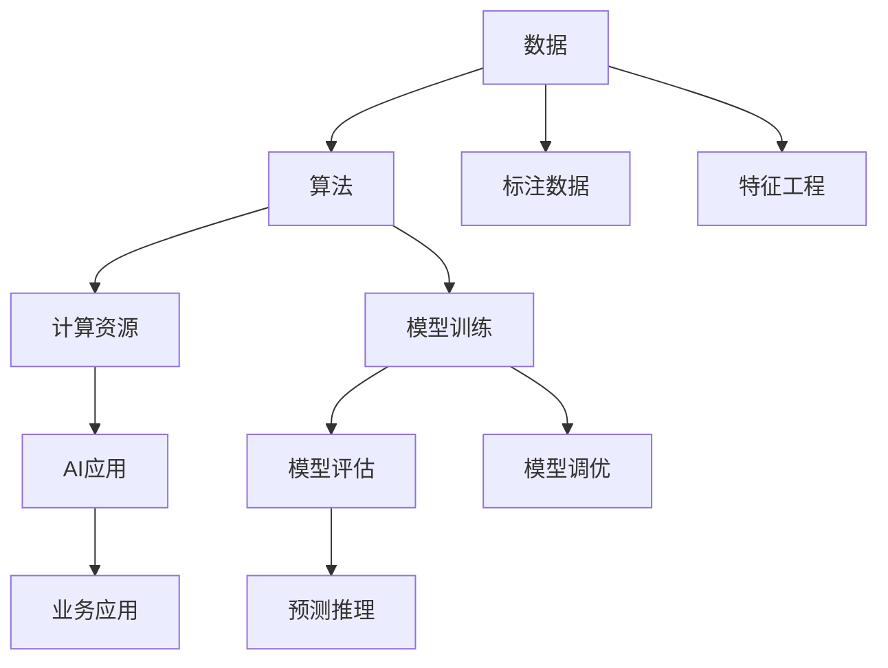

                 

# AI发展的三大核心力量

> 关键词：人工智能,机器学习,深度学习,自然语言处理,NLP,计算机视觉,图像识别,数据科学,机器学习框架

## 1. 背景介绍

### 1.1 问题由来
近年来，随着数据科学的迅猛发展，人工智能(AI)技术已经深刻改变了各行各业的生产力，成为推动科技进步和经济发展的关键力量。从深度学习到自然语言处理，从计算机视觉到数据科学，AI技术的诸多领域都在不断突破，推动着科技和社会进步。

AI技术之所以能够如此快速发展，离不开三大核心力量的驱动：数据、算法和计算资源。本文将重点探讨这三者如何协同作用，推动AI技术的突破和应用。

## 2. 核心概念与联系

### 2.1 核心概念概述

为更好地理解AI发展的三大核心力量，本节将介绍几个密切相关的核心概念：

- 数据：AI技术的基础，无论是机器学习、深度学习还是自然语言处理，其核心都是通过大量的标注数据训练模型。
- 算法：AI技术的核心，包括机器学习、深度学习、强化学习等算法，通过复杂计算模型处理和分析数据。
- 计算资源：AI技术的支撑，包括高性能计算设备、分布式计算框架等，提供高效的计算能力，使算法能够快速迭代和优化。

这三者之间的逻辑关系可以通过以下Mermaid流程图来展示：



这个流程图展示了三者的作用与联系：

1. 数据是AI的基础，提供算法的训练材料。
2. 算法对数据进行处理，提取特征，训练模型。
3. 计算资源提供高效的计算能力，加速算法训练和优化。
4. AI应用通过训练好的模型，对新数据进行预测和推理。

## 3. 核心算法原理 & 具体操作步骤
### 3.1 算法原理概述

AI发展的三大核心力量中，算法占据了核心的位置。无论是机器学习、深度学习还是强化学习，其核心都是通过复杂计算模型，从数据中提取特征，训练模型，并最终实现预测、分类、回归等任务。

以深度学习为例，其核心算法原理是通过多层神经网络，对输入数据进行逐层处理，提取特征，最终输出结果。具体步骤如下：

1. **数据预处理**：将原始数据进行清洗、归一化、特征提取等预处理步骤。
2. **模型定义**：定义神经网络模型，包括网络层数、每层的神经元数量等。
3. **模型训练**：使用反向传播算法，根据损失函数计算梯度，更新模型参数，使模型输出逼近真实结果。
4. **模型评估**：使用测试集评估模型性能，计算各种指标（如准确率、召回率等）。
5. **模型调优**：根据评估结果，调整模型参数，进行超参数搜索，进一步提升模型性能。

### 3.2 算法步骤详解

以深度学习中的卷积神经网络（CNN）为例，详细讲解算法步骤：

1. **数据预处理**：对图像数据进行归一化、增强等预处理步骤，使其适合模型输入。
2. **模型定义**：定义卷积神经网络模型，包括卷积层、池化层、全连接层等。
3. **模型训练**：使用反向传播算法，计算损失函数，根据梯度更新模型参数。
4. **模型评估**：在测试集上评估模型性能，计算准确率、损失等指标。
5. **模型调优**：通过调整网络结构、学习率等超参数，提升模型性能。

### 3.3 算法优缺点

深度学习的优点在于强大的特征提取能力和泛化能力，能够在各类任务中取得较好的效果。然而，其缺点也显而易见：

- **过拟合风险**：在大规模数据集上训练的深度模型，在小型数据集上容易过拟合。
- **计算资源消耗大**：深度学习模型参数量巨大，需要高性能计算资源进行训练。
- **黑箱性质**：深度学习模型复杂，难以解释其内部决策过程，缺乏可解释性。

### 3.4 算法应用领域

深度学习作为AI的核心算法，其应用范围广泛，包括但不限于以下领域：

- **计算机视觉**：图像识别、目标检测、人脸识别等。
- **自然语言处理**：文本分类、情感分析、机器翻译等。
- **语音识别**：语音转文本、语音合成等。
- **推荐系统**：个性化推荐、广告投放等。

## 4. 数学模型和公式 & 详细讲解 & 举例说明

### 4.1 数学模型构建

以深度学习中的全连接神经网络为例，其数学模型可以表示为：

$$
y=f(Wx+b)
$$

其中，$x$ 为输入向量，$W$ 为权重矩阵，$b$ 为偏置向量，$f$ 为激活函数，$y$ 为输出结果。

### 4.2 公式推导过程

以单层全连接神经网络为例，推导其前向传播过程：

1. 输入层：
   $$
   x=[x_1, x_2, ..., x_n]
   $$

2. 权重矩阵：
   $$
   W=[w_{11}, w_{12}, ..., w_{1n}; w_{21}, w_{22}, ..., w_{2n}; ...; w_{m1}, w_{m2}, ..., w_{mn}]
   $$

3. 偏置向量：
   $$
   b=[b_1, b_2, ..., b_n]
   $$

4. 线性变换：
   $$
   z=Wx+b
   $$

5. 激活函数：
   $$
   y=f(z)=\sigma(z)
   $$

其中，$\sigma$ 为激活函数，如ReLU、Sigmoid、Tanh等。

### 4.3 案例分析与讲解

以图像分类为例，假设输入图像经过预处理后得到向量 $x=[x_1, x_2, ..., x_n]$，通过卷积层、池化层等操作，得到特征向量 $z$。然后，通过全连接层进行分类，得到输出 $y$：

$$
y=f(Wz+b)
$$

其中，$W$ 为全连接层权重矩阵，$b$ 为偏置向量，$f$ 为激活函数。通过交叉熵损失函数计算损失：

$$
L=-\frac{1}{N}\sum_{i=1}^N(y_i\log\hat{y_i}+(1-y_i)\log(1-\hat{y_i}))
$$

最后，通过反向传播算法更新模型参数，使模型输出逼近真实标签 $y$。

## 5. 项目实践：代码实例和详细解释说明

### 5.1 开发环境搭建

在进行深度学习项目实践前，我们需要准备好开发环境。以下是使用Python进行TensorFlow开发的环境配置流程：

1. 安装Anaconda：从官网下载并安装Anaconda，用于创建独立的Python环境。

2. 创建并激活虚拟环境：
```bash
conda create -n tensorflow-env python=3.8 
conda activate tensorflow-env
```

3. 安装TensorFlow：根据CUDA版本，从官网获取对应的安装命令。例如：
```bash
conda install tensorflow -c pytorch -c conda-forge
```

4. 安装各类工具包：
```bash
pip install numpy pandas scikit-learn matplotlib tqdm jupyter notebook ipython
```

完成上述步骤后，即可在`tensorflow-env`环境中开始深度学习项目实践。

### 5.2 源代码详细实现

这里我们以图像分类任务为例，给出使用TensorFlow进行卷积神经网络开发的PyTorch代码实现。

首先，定义模型结构：

```python
import tensorflow as tf

class CNN(tf.keras.Model):
    def __init__(self):
        super(CNN, self).__init__()
        self.conv1 = tf.keras.layers.Conv2D(32, 3, activation='relu')
        self.pool1 = tf.keras.layers.MaxPooling2D(2)
        self.conv2 = tf.keras.layers.Conv2D(64, 3, activation='relu')
        self.pool2 = tf.keras.layers.MaxPooling2D(2)
        self.flatten = tf.keras.layers.Flatten()
        self.fc1 = tf.keras.layers.Dense(64, activation='relu')
        self.fc2 = tf.keras.layers.Dense(10)
    
    def call(self, x):
        x = self.conv1(x)
        x = self.pool1(x)
        x = self.conv2(x)
        x = self.pool2(x)
        x = self.flatten(x)
        x = self.fc1(x)
        return self.fc2(x)
```

然后，定义模型训练函数：

```python
def train_model(model, dataset, epochs, batch_size, learning_rate):
    model.compile(optimizer=tf.keras.optimizers.Adam(learning_rate=learning_rate),
                  loss=tf.keras.losses.SparseCategoricalCrossentropy(from_logits=True),
                  metrics=['accuracy'])
    
    model.fit(dataset.train_data, dataset.train_labels, epochs=epochs, batch_size=batch_size, validation_data=(dataset.test_data, dataset.test_labels))
    
    return model
```

最后，定义数据集：

```python
import numpy as np
from tensorflow.keras.datasets import mnist

(x_train, y_train), (x_test, y_test) = mnist.load_data()

x_train = x_train.reshape(-1, 28, 28, 1).astype('float32') / 255.0
x_test = x_test.reshape(-1, 28, 28, 1).astype('float32') / 255.0

y_train = tf.keras.utils.to_categorical(y_train, 10)
y_test = tf.keras.utils.to_categorical(y_test, 10)
```

完整的代码实现如下：

```python
import tensorflow as tf

class CNN(tf.keras.Model):
    def __init__(self):
        super(CNN, self).__init__()
        self.conv1 = tf.keras.layers.Conv2D(32, 3, activation='relu')
        self.pool1 = tf.keras.layers.MaxPooling2D(2)
        self.conv2 = tf.keras.layers.Conv2D(64, 3, activation='relu')
        self.pool2 = tf.keras.layers.MaxPooling2D(2)
        self.flatten = tf.keras.layers.Flatten()
        self.fc1 = tf.keras.layers.Dense(64, activation='relu')
        self.fc2 = tf.keras.layers.Dense(10)
    
    def call(self, x):
        x = self.conv1(x)
        x = self.pool1(x)
        x = self.conv2(x)
        x = self.pool2(x)
        x = self.flatten(x)
        x = self.fc1(x)
        return self.fc2(x)

def train_model(model, dataset, epochs, batch_size, learning_rate):
    model.compile(optimizer=tf.keras.optimizers.Adam(learning_rate=learning_rate),
                  loss=tf.keras.losses.SparseCategoricalCrossentropy(from_logits=True),
                  metrics=['accuracy'])
    
    model.fit(dataset.train_data, dataset.train_labels, epochs=epochs, batch_size=batch_size, validation_data=(dataset.test_data, dataset.test_labels))
    
    return model

def load_mnist():
    (x_train, y_train), (x_test, y_test) = mnist.load_data()
    x_train = x_train.reshape(-1, 28, 28, 1).astype('float32') / 255.0
    x_test = x_test.reshape(-1, 28, 28, 1).astype('float32') / 255.0
    y_train = tf.keras.utils.to_categorical(y_train, 10)
    y_test = tf.keras.utils.to_categorical(y_test, 10)
    return x_train, y_train, x_test, y_test

x_train, y_train, x_test, y_test = load_mnist()
model = CNN()
model = train_model(model, (x_train, y_train), epochs=5, batch_size=64, learning_rate=0.001)
```

### 5.3 代码解读与分析

让我们再详细解读一下关键代码的实现细节：

**CNN类**：
- `__init__`方法：初始化卷积层、池化层、全连接层等关键组件。
- `call`方法：定义模型前向传播的过程，经过卷积、池化、全连接等操作，最终输出分类结果。

**train_model函数**：
- `compile`方法：配置模型优化器、损失函数、评估指标等。
- `fit`方法：对数据集进行批处理，迭代训练模型，并周期性验证模型性能。

**load_mnist函数**：
- 定义MNIST数据集加载过程，对数据进行预处理，转换为模型输入格式。

这些代码展示了TensorFlow进行卷积神经网络开发的完整流程。通过这些代码，你可以快速实现一个简单的图像分类任务，并进一步扩展到更复杂的NLP任务。

## 6. 实际应用场景
### 6.1 智能推荐系统

基于深度学习算法的推荐系统已经广泛应用于电商、视频、音乐等多个领域。其核心在于通过用户行为数据训练模型，提取用户兴趣特征，从而实现个性化推荐。

在技术实现上，可以收集用户的浏览、点击、评分等行为数据，将这些数据作为训练集，对预训练模型进行微调，使其能够理解用户偏好，生成推荐列表。此外，还可以引入时间因素、物品特征等因素，进一步提升推荐效果。

### 6.2 语音识别

语音识别是自然语言处理的重要分支，用于将人类语音转换为文本。深度学习算法在语音识别中的应用广泛，包括声学模型和语言模型两部分。

声学模型通过深度神经网络提取音频特征，并将音频转换为文本。语言模型用于预测下一个可能的词，优化音频转文本的准确性。通过深度学习算法，语音识别系统已经广泛应用于智能助理、电话客服等领域。

### 6.3 医疗诊断

深度学习在医疗诊断中的应用也逐渐增多。通过医疗影像数据、病历数据等，深度学习模型可以辅助医生进行疾病诊断，提升诊断的准确性和效率。

在技术实现上，可以收集大量的医疗影像和病历数据，训练深度学习模型，使其能够自动识别和分类医学影像，提取病情特征，辅助医生做出诊断。深度学习在医学影像中的广泛应用，极大地提高了医疗系统的诊断准确性和效率。

## 7. 工具和资源推荐
### 7.1 学习资源推荐

为了帮助开发者系统掌握深度学习的基本原理和实践技巧，这里推荐一些优质的学习资源：

1. 《深度学习》系列书籍：由深度学习领域的专家撰写，系统介绍深度学习的基本概念和核心算法。
2. Coursera《深度学习专项课程》：由斯坦福大学开设，涵盖深度学习从入门到高级的诸多主题。
3. TensorFlow官方文档：提供丰富的深度学习资源和样例代码，适合快速上手实践。
4. PyTorch官方文档：提供完整的深度学习框架和样例代码，适合快速开发。
5. Kaggle竞赛平台：提供丰富的深度学习竞赛项目，通过实践提升深度学习技能。

通过对这些资源的学习实践，相信你一定能够快速掌握深度学习的基本原理和实践技巧，并用于解决实际的NLP问题。
###  7.2 开发工具推荐

高效的开发离不开优秀的工具支持。以下是几款用于深度学习开发的常用工具：

1. TensorFlow：由Google主导开发的开源深度学习框架，生产部署方便，适合大规模工程应用。
2. PyTorch：基于Python的开源深度学习框架，灵活动态的计算图，适合快速迭代研究。
3. Jupyter Notebook：免费开源的交互式编程环境，适合数据探索、模型调试和协作开发。
4. Anaconda：免费开源的Python环境管理工具，提供虚拟环境管理、包管理等功能。

合理利用这些工具，可以显著提升深度学习开发效率，加快创新迭代的步伐。

### 7.3 相关论文推荐

深度学习的发展离不开学界的持续研究。以下是几篇奠基性的相关论文，推荐阅读：

1. ImageNet大规模视觉识别挑战（ILSVRC）：提出在大规模数据集上进行深度学习训练的方法，并取得优异效果。
2. AlexNet：在大规模图像分类竞赛中取得突破，提出卷积神经网络(CNN)结构。
3. ResNet：解决深度网络训练困难问题，提出残差网络结构。
4. InceptionNet：提出多尺度卷积网络结构，提升深度学习的效率。
5. YOLO：提出单阶段目标检测方法，显著提升目标检测的精度和速度。

这些论文代表了大规模深度学习模型训练和应用的技术进展。通过学习这些前沿成果，可以帮助研究者把握学科前进方向，激发更多的创新灵感。

## 8. 总结：未来发展趋势与挑战
### 8.1 总结

本文对深度学习发展的三大核心力量进行了全面系统的介绍。首先阐述了数据、算法和计算资源在深度学习中的应用，明确了三者的协同作用。其次，从原理到实践，详细讲解了深度学习的数学模型和实现步骤，给出了深度学习项目开发的完整代码实例。同时，本文还探讨了深度学习在推荐系统、语音识别、医疗诊断等多个领域的应用前景，展示了深度学习技术的广阔前景。最后，本文精选了深度学习的各类学习资源，力求为读者提供全方位的技术指引。

通过本文的系统梳理，可以看到，深度学习作为AI的核心技术，其发展得益于数据、算法和计算资源三者的协同作用。未来，伴随数据量的不断增长、算法模型的不断创新以及计算资源的不断突破，深度学习技术必将取得更加显著的进步，为AI的发展注入新的动力。

### 8.2 未来发展趋势

展望未来，深度学习技术将呈现以下几个发展趋势：

1. 模型规模继续增大。随着算力成本的下降和数据规模的扩张，深度学习模型的参数量还将持续增长，模型规模将进一步扩大。
2. 算法模型不断创新。未来将出现更多高效的深度学习算法，如注意力机制、自监督学习等，提升模型的效率和泛化能力。
3. 计算资源持续优化。随着计算资源成本的下降，深度学习算法将更加快速和高效，计算资源将成为瓶颈的问题将得到解决。
4. 多模态融合技术发展。深度学习技术将更多地应用于多模态数据的融合，如视觉、听觉、文本等信息的协同建模，提升综合处理能力。
5. 应用场景不断扩展。深度学习技术将更多地应用于智能制造、智慧城市、自动驾驶等新兴领域，带来新的应用场景。
6. 伦理和安全问题重视。深度学习模型需要更多的伦理和安全保障，避免对隐私、公平等问题的侵犯。

以上趋势凸显了深度学习技术的广泛应用前景，为AI的发展提供了新的方向。这些方向的探索发展，必将进一步提升AI系统的性能和应用范围，推动AI技术的产业化进程。

### 8.3 面临的挑战

尽管深度学习技术已经取得了巨大成功，但在迈向更加智能化、普适化应用的过程中，仍面临诸多挑战：

1. 计算资源消耗大。深度学习模型参数量巨大，需要高性能计算资源进行训练和推理。计算资源的成本仍然是限制其应用的主要瓶颈。
2. 模型过拟合风险高。在大规模数据集上训练的深度模型，在小型数据集上容易过拟合。如何避免过拟合，提升模型的泛化能力，仍然是一个重要的问题。
3. 模型可解释性不足。深度学习模型复杂，难以解释其内部决策过程，缺乏可解释性。对于医疗、金融等高风险应用，算法的可解释性和可审计性尤为重要。
4. 数据隐私和安全问题。深度学习模型需要大量的标注数据，数据隐私和安全问题仍然是一个重要的问题。
5. 算法模型的偏见和公平性问题。深度学习模型可能学习到数据中的偏见，导致算法的不公平性。如何消除模型的偏见，确保公平性，仍然是一个重要的问题。

这些挑战凸显了深度学习技术的复杂性和多样性，未来需要更多的研究来解决这些问题，推动深度学习技术的进一步发展。

### 8.4 研究展望

面对深度学习面临的诸多挑战，未来的研究需要在以下几个方面寻求新的突破：

1. 数据预处理和增强技术。通过数据清洗、增强等技术，提高数据质量和多样性，减少数据偏见和过拟合。
2. 模型压缩和加速技术。通过模型压缩、量化加速等技术，提升模型的推理速度和计算效率，降低计算资源消耗。
3. 多模态融合技术。将视觉、听觉、文本等信息的融合，提升深度学习模型的综合处理能力，实现多模态协同建模。
4. 算法模型创新。引入新的算法模型和架构，提升深度学习模型的效率和泛化能力，推动深度学习技术的发展。
5. 模型公平性和可解释性。通过公平性算法和可解释性技术，提升深度学习模型的公平性和可解释性，确保算法的可信度。

这些研究方向将引领深度学习技术迈向更高的台阶，为AI的发展提供新的动力。未来，深度学习技术将在更多领域得到应用，为人类社会带来新的变革。

## 9. 附录：常见问题与解答

**Q1：深度学习与传统机器学习的区别是什么？**

A: 深度学习与传统机器学习的区别主要体现在模型结构和数据处理方式上。深度学习使用多层神经网络进行模型构建，自动提取特征，而传统机器学习需要手动设计特征。深度学习能够处理非结构化数据，如文本、图像等，而传统机器学习需要数据进行标准化处理。

**Q2：深度学习算法的训练时间长，如何加速训练过程？**

A: 深度学习算法的训练时间长，可以通过以下方法进行加速：
1. 数据增强：通过图像旋转、平移等方式扩充训练数据。
2. 模型剪枝：去除冗余参数和网络层，减少模型复杂度。
3. 分布式训练：使用多台机器进行模型并行训练。
4. 混合精度训练：使用混合精度浮点数计算，提升计算效率。

**Q3：深度学习算法对计算资源的需求大，如何降低计算成本？**

A: 深度学习算法对计算资源的需求大，可以通过以下方法进行优化：
1. 使用GPU/TPU等高性能计算设备，提升计算效率。
2. 优化模型结构，减少参数量和计算复杂度。
3. 使用量化技术，将浮点模型转换为定点模型，减小内存占用。
4. 采用分布式训练，将计算任务分配到多台机器上。

**Q4：深度学习算法的可解释性差，如何解决这一问题？**

A: 深度学习算法的可解释性差，可以通过以下方法进行改进：
1. 使用可视化工具，展示模型内部计算过程。
2. 引入解释模型，如LIME、SHAP等，解释模型输出结果。
3. 使用符号化方法，提取模型关键特征。
4. 引入可解释性算法，如GELU、ReLU等，提升模型的可解释性。

这些方法可以帮助提升深度学习算法的可解释性，使其更加透明和可信。

---

作者：禅与计算机程序设计艺术 / Zen and the Art of Computer Programming

