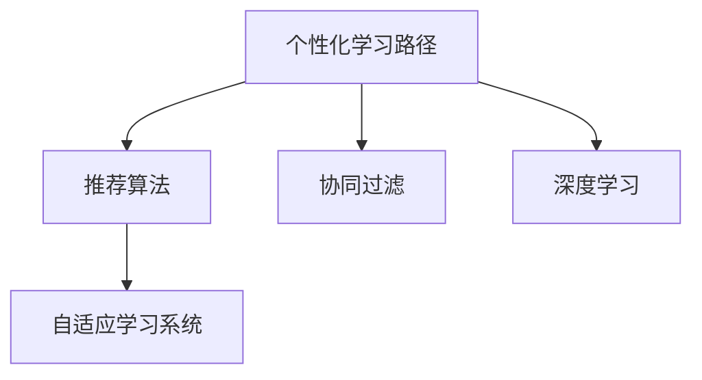

                 

# AI在个性化学习路径设计中的应用：优化学习效果

> 关键词：AI, 个性化学习路径, 优化学习效果, 推荐算法, 协同过滤, 深度学习

## 1. 背景介绍

### 1.1 问题由来

随着互联网技术的发展和人工智能的崛起，教育领域开始尝试利用AI技术提高教育质量和个性化学习体验。传统的学习方式往往是“一刀切”，学生按照固定的课程和进度学习，这忽视了每个学生的独特需求和能力差异。然而，个性化学习能够根据学生的具体情况，为其提供量身定制的学习路径，帮助其更高效地掌握知识。

### 1.2 问题核心关键点

个性化学习路径设计问题，核心在于如何通过分析学生的学习数据和行为，为其推荐合适的学习内容，同时优化学习效果，使之适应学生的认知水平和兴趣偏好。AI技术在这一过程中扮演了关键角色，通过机器学习和数据分析技术，对学生数据进行建模和预测，从而设计出高效、个性化的学习路径。

### 1.3 问题研究意义

个性化学习路径设计是教育领域的重要研究课题，具有以下重要意义：

1. **提升学习效率**：通过个性化的学习内容推荐，帮助学生更高效地掌握知识。
2. **提高学习体验**：让学生在学习过程中感受到更多的乐趣和成就感。
3. **降低教学成本**：减少教师的个别辅导时间和资源消耗。
4. **促进教育公平**：为不同背景、不同需求的学生提供更公平的教育资源。

## 2. 核心概念与联系

### 2.1 核心概念概述

- **个性化学习路径**：根据学生的学习行为、兴趣偏好和认知能力，为其定制的学习内容路径。
- **推荐算法**：通过分析用户数据，为用户推荐合适内容或产品的算法，如协同过滤、深度学习等。
- **协同过滤**：通过分析用户的行为数据，为用户推荐相似用户喜欢的内容或产品。
- **深度学习**：使用深度神经网络模型进行复杂数据处理和模式识别的技术。
- **自适应学习系统**：能够根据学生的学习情况和反馈，动态调整学习内容和进度的系统。

这些概念之间相互联系，共同构成了个性化学习路径设计的技术基础。个性化学习路径的设计，主要依赖于推荐算法和深度学习模型的应用，同时需要协同过滤技术来分析用户行为，自适应学习系统来动态调整学习路径。

### 2.2 核心概念原理和架构的 Mermaid 流程图



这个流程图展示了个性化学习路径设计的主要组成部分和它们之间的联系。个性化学习路径的生成依赖于推荐算法、协同过滤和深度学习，而自适应学习系统则根据学生的学习情况和反馈，动态调整学习内容和进度。

## 3. 核心算法原理 & 具体操作步骤
### 3.1 算法原理概述

个性化学习路径设计的核心在于推荐算法，其基本原理是通过分析学生的历史学习数据，预测其未来可能感兴趣的学习内容，从而设计出个性化的学习路径。推荐算法可以基于协同过滤、深度学习等技术，也可以通过强化学习等方法实现。

### 3.2 算法步骤详解

个性化学习路径设计的推荐算法步骤如下：

**Step 1: 数据收集与预处理**

- 收集学生的历史学习数据，包括已学课程、学习时长、测试成绩等。
- 对数据进行清洗和预处理，如去除异常值、填补缺失值等。

**Step 2: 特征提取**

- 对收集到的学生数据进行特征提取，如计算学生的平均学习时间、最近学习课程等。
- 使用向量空间模型、TF-IDF等方法将特征转化为向量形式。

**Step 3: 模型训练**

- 选择合适的推荐算法模型，如协同过滤、深度学习等。
- 对模型进行训练，使用学生数据进行拟合，得到推荐模型。

**Step 4: 路径生成**

- 根据学生的当前学习状态和历史数据，使用推荐模型生成个性化学习路径。
- 动态调整学习路径，根据学生的学习反馈和进度，不断优化路径。

**Step 5: 路径执行与评估**

- 将生成的个性化学习路径应用于学生，执行学习任务。
- 实时监测学生的学习状态和效果，根据评估结果调整学习路径。

### 3.3 算法优缺点

个性化学习路径设计的推荐算法具有以下优点：

- **灵活性高**：能够根据学生的需求和兴趣，动态调整学习内容和进度。
- **效率高**：通过分析学生数据，快速推荐合适的学习内容，节省教师和学生的学习时间。
- **个性化程度高**：能够为每个学生提供量身定制的学习路径，提高学习效果。

同时，该算法也存在以下缺点：

- **数据依赖**：推荐算法的性能很大程度上依赖于学生数据的质量和数量。
- **模型复杂度**：深度学习等复杂模型需要大量计算资源和时间进行训练。
- **过拟合风险**：当数据量不足时，推荐模型容易出现过拟合现象。
- **隐私问题**：学生数据的收集和使用需要严格遵守隐私保护政策。

### 3.4 算法应用领域

个性化学习路径设计在多个领域都有广泛应用，例如：

- **在线教育**：为在线课程提供个性化推荐，提升学习效果。
- **K12教育**：根据学生的学习情况，设计个性化的学习计划。
- **企业培训**：为员工提供定制化的培训课程，提高培训效果。
- **图书馆学习**：根据学生的阅读习惯，推荐适合的书籍和学习资源。

## 4. 数学模型和公式 & 详细讲解 & 举例说明

### 4.1 数学模型构建

假设学生的历史学习数据集为 $D=\{(x_i,y_i)\}_{i=1}^N$，其中 $x_i$ 为学生的历史学习行为，$y_i$ 为学生对学习内容的兴趣程度。

定义学生的兴趣表示为 $v \in \mathbb{R}^d$，其中 $d$ 为特征维度。假设 $v$ 可以通过以下线性模型得到：

$$
v = \sum_{i=1}^n w_i x_i
$$

其中 $w_i$ 为权重，$x_i$ 为特征向量。

### 4.2 公式推导过程

基于上述模型，可以构建以下推荐算法模型：

**协同过滤算法**

协同过滤算法基于用户和项目之间的相似性，为每个用户推荐其可能喜欢的项目。假设用户 $u$ 和项目 $p$ 的相似性由 $s(u,p)$ 表示，推荐算法可以根据相似性矩阵 $S \in \mathbb{R}^{m \times n}$，其中 $m$ 为用户的数量，$n$ 为项目的数量，计算用户 $u$ 对项目 $p$ 的兴趣程度 $y_u$：

$$
y_u = s(u,p) \cdot w_p
$$

其中 $w_p$ 为项目 $p$ 的权重，可以通过训练得到。

**深度学习模型**

深度学习模型通过多层神经网络对用户数据进行处理和建模。假设深度学习模型为 $f(x)$，其中 $x$ 为输入特征向量，$y$ 为输出兴趣程度。训练模型时，使用均方误差损失函数：

$$
L = \frac{1}{N} \sum_{i=1}^N (y_i - f(x_i))^2
$$

优化目标为最小化损失函数 $L$。

### 4.3 案例分析与讲解

以深度学习模型为例，假设有一个学生 $u$，其历史学习行为数据 $x_1, x_2, ..., x_N$ 和对应的兴趣程度 $y_1, y_2, ..., y_N$。构建深度学习模型 $f(x)$ 对学生 $u$ 进行兴趣预测，模型参数为 $\theta$。训练过程如下：

1. **初始化模型参数**：随机初始化模型参数 $\theta$。
2. **前向传播**：将学生 $u$ 的历史学习行为 $x$ 输入模型，得到预测兴趣程度 $y$。
3. **计算损失**：计算预测兴趣程度 $y$ 与真实兴趣程度 $y_u$ 的均方误差损失 $L$。
4. **反向传播**：使用梯度下降算法计算梯度，更新模型参数 $\theta$。
5. **重复迭代**：重复前向传播和反向传播，直至损失 $L$ 收敛。

## 5. 项目实践：代码实例和详细解释说明

### 5.1 开发环境搭建

在进行个性化学习路径设计时，需要搭建适合的开发环境。以下是使用Python进行TensorFlow开发的简单流程：

1. 安装Anaconda：从官网下载并安装Anaconda，用于创建独立的Python环境。
2. 创建并激活虚拟环境：
```bash
conda create -n tf-env python=3.8 
conda activate tf-env
```
3. 安装TensorFlow：
```bash
pip install tensorflow
```
4. 安装其他必要的库：
```bash
pip install numpy pandas scikit-learn
```

完成上述步骤后，即可在`tf-env`环境中进行模型开发。

### 5.2 源代码详细实现

以下是一个基于深度学习模型的个性化学习路径设计示例代码：

```python
import tensorflow as tf
from tensorflow.keras import layers
import numpy as np

# 加载数据
data = np.loadtxt('students.csv', delimiter=',', skiprows=1)

# 分割数据为训练集和测试集
train_data, test_data = np.split(data, [len(data)//2])

# 定义模型
model = tf.keras.Sequential([
    layers.Dense(128, activation='relu', input_shape=(5,)),
    layers.Dense(1)
])

# 编译模型
model.compile(optimizer='adam', loss='mse')

# 训练模型
history = model.fit(train_data[:, :-1], train_data[:, -1], epochs=100, batch_size=32, validation_data=(test_data[:, :-1], test_data[:, -1]))

# 使用模型进行预测
y_pred = model.predict(test_data[:, :-1])
```

上述代码中，我们首先加载学生的学习数据，并划分为训练集和测试集。然后定义了一个深度学习模型，并使用均方误差损失函数进行编译。接着使用训练数据对模型进行训练，并在测试集上进行评估。最后使用训练好的模型对测试数据进行预测。

### 5.3 代码解读与分析

让我们详细解读一下关键代码的实现细节：

- **数据加载与分割**：使用`np.loadtxt`加载学生学习数据，使用`np.split`方法将数据划分为训练集和测试集。
- **模型定义**：使用`tf.keras.Sequential`定义了一个包含两个密集层的深度学习模型，其中第一个层有128个神经元，使用ReLU激活函数，第二个层为输出层，只有一个神经元，没有激活函数。
- **模型编译**：使用`model.compile`方法编译模型，指定优化器和损失函数。
- **模型训练**：使用`model.fit`方法训练模型，指定训练数据、训练轮数、批量大小等参数。
- **模型预测**：使用`model.predict`方法对测试数据进行预测，得到预测结果。

## 6. 实际应用场景

### 6.1 在线教育平台

在线教育平台可以利用个性化学习路径设计，为学生提供更加个性化的学习体验。通过分析学生的学习数据，平台可以为每个学生设计适合的课程和进度，帮助其更高效地掌握知识。例如，Khan Academy等在线教育平台已经成功应用了类似技术，显著提高了学生的学习效果。

### 6.2 K12教育

K12教育领域也需要个性化学习路径设计，以适应不同学生的学习需求和能力。例如，Smart Sparrow等教育应用，通过分析学生的学习数据，为其设计个性化的学习路径，提高了学生的学习兴趣和成绩。

### 6.3 企业培训

企业培训也需要个性化学习路径设计，以提高培训效果。例如，Coursera等在线课程平台，可以为员工提供定制化的培训课程，提高培训效率和效果。

### 6.4 未来应用展望

未来，个性化学习路径设计将进一步发展，涵盖更多的应用场景和领域。例如：

- **虚拟现实(VR)**：利用VR技术，为学生提供沉浸式的学习体验，增强学习的趣味性和互动性。
- **人工智能(AI)辅助教师**：通过AI技术，帮助教师更好地了解学生的学习情况，为其设计个性化的学习路径。
- **跨领域应用**：个性化学习路径设计将应用于更多领域，如医疗、金融等，为不同背景的学生提供个性化的学习资源。

## 7. 工具和资源推荐

### 7.1 学习资源推荐

为了帮助开发者系统掌握个性化学习路径设计，这里推荐一些优质的学习资源：

1. **《推荐系统实战》**：由陈云翔等著，介绍了推荐系统的基础知识和应用实践，涵盖协同过滤、深度学习等多个方面。
2. **《深度学习》课程**：Coursera上斯坦福大学的吴恩达教授主讲的深度学习课程，系统讲解了深度学习的基础理论和实践技巧。
3. **《TensorFlow官方文档》**：TensorFlow官方提供的详细文档，涵盖了TensorFlow的各个方面，是学习TensorFlow的重要资源。
4. **《Python机器学习》**：由Sebastian Raschka等著，介绍了机器学习在Python中的应用，涵盖协同过滤、深度学习等多个方面。
5. **Kaggle竞赛**：Kaggle平台上的推荐系统竞赛，可以实战练习个性化学习路径设计技术。

通过对这些资源的学习实践，相信你一定能够快速掌握个性化学习路径设计的精髓，并用于解决实际的NLP问题。

### 7.2 开发工具推荐

高效的开发离不开优秀的工具支持。以下是几款用于个性化学习路径设计的常用工具：

1. **TensorFlow**：Google开发的深度学习框架，灵活度高，支持分布式计算，适用于复杂的深度学习模型开发。
2. **PyTorch**：Facebook开发的深度学习框架，易于使用，支持动态计算图，适用于快速迭代研究。
3. **H2O.ai**：开源的机器学习平台，支持多种机器学习算法，适合快速部署和测试模型。
4. **Jupyter Notebook**：Python的交互式开发环境，支持代码和文档的混合展示，方便实时调试和交流。
5. **TensorBoard**：TensorFlow的可视化工具，可以实时监测模型的训练状态，并提供丰富的图表呈现方式，是调试模型的得力助手。

合理利用这些工具，可以显著提升个性化学习路径设计的开发效率，加快创新迭代的步伐。

### 7.3 相关论文推荐

个性化学习路径设计的研究源于学界的持续研究。以下是几篇奠基性的相关论文，推荐阅读：

1. **《基于协同过滤的个性化推荐系统》**：由宗成伟等著，介绍了协同过滤算法的基本原理和应用。
2. **《深度学习在推荐系统中的应用》**：由周志华等著，介绍了深度学习在推荐系统中的应用和效果。
3. **《自适应学习系统》**：由邓俊辉等著，介绍了自适应学习系统的基本原理和实现方法。
4. **《基于深度学习的个性化推荐》**：由李航等著，介绍了深度学习在个性化推荐中的应用。
5. **《多模态深度学习在推荐系统中的应用》**：由罗敏等著，介绍了多模态深度学习在推荐系统中的应用和效果。

这些论文代表了个性化学习路径设计的研究进展，通过学习这些前沿成果，可以帮助研究者把握学科前进方向，激发更多的创新灵感。

## 8. 总结：未来发展趋势与挑战

### 8.1 总结

本文对个性化学习路径设计进行了全面系统的介绍。首先阐述了个性化学习路径设计的研究背景和意义，明确了其在提高学习效率、个性化程度和教育公平方面的重要价值。其次，从原理到实践，详细讲解了推荐算法和深度学习模型的应用，给出了个性化学路设计的完整代码实例。同时，本文还探讨了个性化学习路径设计在多个领域的应用前景，展示了其广阔的应用范围。最后，本文精选了学习资源、开发工具和相关论文，力求为读者提供全方位的技术指引。

通过本文的系统梳理，可以看到，个性化学习路径设计通过AI技术，为学生提供了量身定制的学习路径，显著提高了学习效果。未来，随着技术的发展，个性化学习路径设计将进一步发展，为学生提供更加丰富、高效的学习体验。

### 8.2 未来发展趋势

展望未来，个性化学习路径设计将呈现以下几个发展趋势：

1. **智能化程度提升**：随着深度学习等AI技术的发展，推荐算法的智能化程度将进一步提升，能够更准确地预测学生的兴趣和需求。
2. **多模态学习路径**：个性化学习路径将不仅仅局限于文本数据，还将涵盖图像、视频、音频等多模态数据，提供更加丰富的学习体验。
3. **自适应学习系统**：自适应学习系统将更加灵活，能够实时调整学习路径，适应学生的学习状态和需求。
4. **个性化评估**：个性化学习路径设计将引入更多的评估指标，如学习效果、学生满意度等，动态调整学习内容和进度。
5. **跨领域应用**：个性化学习路径设计将应用于更多领域，如医疗、金融等，为不同背景的学生提供个性化的学习资源。

以上趋势凸显了个性化学习路径设计的广阔前景。这些方向的探索发展，必将进一步提升个性化学习路径设计的效果和应用范围，为教育事业的发展注入新的动力。

### 8.3 面临的挑战

尽管个性化学习路径设计取得了诸多进展，但在迈向更加智能化、普适化应用的过程中，仍面临诸多挑战：

1. **数据质量问题**：个性化学习路径设计依赖于学生数据的准确性和完整性，数据质量问题将影响推荐效果。
2. **隐私保护**：学生的学习数据涉及隐私问题，如何在保障隐私的同时，进行有效的数据收集和分析，是重要挑战。
3. **计算资源需求**：深度学习等复杂模型需要大量计算资源，如何在资源有限的条件下，实现高效的学习路径设计，是关键问题。
4. **模型复杂度**：深度学习等复杂模型的训练和优化需要大量时间和计算资源，如何在保持性能的同时，降低模型复杂度，是重要挑战。
5. **模型泛化能力**：推荐模型需要具备良好的泛化能力，能够适应不同学生和不同学习场景，避免过拟合现象。

这些挑战需要通过技术创新和实践优化，逐步解决。只有不断突破技术瓶颈，个性化学习路径设计才能实现更广泛的应用。

### 8.4 研究展望

未来，个性化学习路径设计的研究需要在以下几个方面寻求新的突破：

1. **多模态学习路径设计**：开发多模态学习路径设计算法，充分利用图像、视频等辅助信息，提升学习路径的个性化程度和效果。
2. **自适应学习系统**：研究自适应学习系统的动态调整机制，使其能够实时响应用户的变化，提高学习路径的适应性和灵活性。
3. **跨领域应用**：将个性化学习路径设计应用于更多领域，如医疗、金融等，解决跨领域学习路径设计问题。
4. **隐私保护技术**：研究隐私保护技术，如差分隐私、联邦学习等，在保障隐私的前提下，进行有效的数据收集和分析。
5. **智能化推荐算法**：开发智能化推荐算法，利用深度学习、强化学习等技术，提升推荐模型的预测能力和泛化能力。

这些研究方向的探索，必将引领个性化学习路径设计技术迈向更高的台阶，为学生提供更加个性化、高效的学习体验，推动教育事业的发展。

## 9. 附录：常见问题与解答

**Q1: 什么是个性化学习路径设计？**

A: 个性化学习路径设计是指根据学生的学习数据和行为，为其量身定制的学习路径，以提高学习效率和个性化程度。

**Q2: 个性化学习路径设计的推荐算法有哪些？**

A: 个性化学习路径设计主要依赖于推荐算法，常见的算法包括协同过滤、深度学习、强化学习等。

**Q3: 深度学习在个性化学习路径设计中的应用有哪些？**

A: 深度学习可以通过多层神经网络对学生数据进行处理和建模，预测其兴趣和需求，从而设计个性化的学习路径。

**Q4: 如何在个性化学习路径设计中保障学生隐私？**

A: 在数据收集和使用过程中，需要严格遵守隐私保护政策，如差分隐私、联邦学习等技术，保护学生数据的安全和隐私。

**Q5: 如何评估个性化学习路径设计的性能？**

A: 个性化学习路径设计的性能可以通过评估学生的学习效果、满意度等指标来衡量，同时需要实时监测学习路径的执行情况，不断优化和调整。

---

作者：禅与计算机程序设计艺术 / Zen and the Art of Computer Programming

