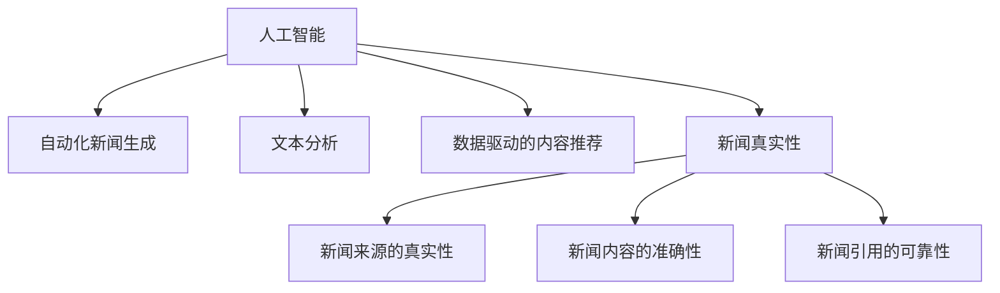

                 

# AI在新闻媒体中的应用：自动化与真实性

> 关键词：人工智能,新闻媒体,自动化,真实性,深度学习,自然语言处理,NLP,文本分析,事实核查,数据驱动

## 1. 背景介绍

### 1.1 问题由来
随着信息时代的发展，新闻媒体在人们获取信息和交流观点方面扮演着越来越重要的角色。然而，海量的信息使得消费者越来越难以分辨信息的真实性和可靠性，虚假新闻、假信息泛滥，严重影响了公众对于信息的判断力。而新闻媒体自身面临着资源有限、发布速度快等压力，难以对每一条新闻都进行详尽的事实核查。

近年来，人工智能技术在新闻媒体中的应用日益增多，特别是通过自动化工具辅助事实核查、自动化生成新闻、提升媒体内容分析等，为新闻媒体带来了新的发展机遇。人工智能不仅可以大幅提升新闻媒体的效率，还可以增强新闻报道的真实性，有效抑制假新闻的传播。

### 1.2 问题核心关键点
当前，AI在新闻媒体中的应用主要集中在以下几个方面：
- 自动化事实核查：利用深度学习模型对新闻来源、内容进行真实性判断，发现潜在的假新闻。
- 自动化新闻生成：通过文本生成模型自动撰写新闻报道，提升新闻生产效率。
- 文本分析与情感识别：分析新闻文本的情感倾向，提供更客观公正的报道视角。
- 数据驱动的内容推荐：通过机器学习算法分析用户行为数据，个性化推荐新闻内容。

这些AI应用极大地提高了新闻媒体的工作效率，但同时也带来了一些新的挑战。如何在提升效率的同时，确保信息的真实性，避免假新闻的传播，是AI在新闻媒体领域应用中需要重点关注的问题。

### 1.3 问题研究意义
AI在新闻媒体中的应用，对于提升新闻媒体的公信力、打造高品质的信息平台具有重要意义。具体来说：

1. 提升新闻生产效率：AI可以快速生成高质量的新闻内容，满足用户对信息快速、新鲜的需求。
2. 增强新闻真实性：AI可以通过自动化工具对新闻信息进行真实性判断，显著降低假新闻的出现率。
3. 提供个性化服务：AI可以分析用户行为数据，提供个性化的新闻推荐，提升用户体验。
4. 助力内容审核：AI可以辅助新闻编辑进行内容审核，减轻人工审核的负担。

总之，AI在新闻媒体中的应用可以大幅提升新闻媒体的工作效率，同时确保信息的真实性和可靠性，为公众提供更优质的新闻服务。

## 2. 核心概念与联系

### 2.1 核心概念概述

为了更好地理解AI在新闻媒体中的应用，本文将介绍几个关键概念：

- 人工智能(AI)：通过模拟人脑的思维过程，让机器具备一定的智能和学习能力，包括感知、认知、决策等。
- 自动化新闻生成：使用深度学习模型自动撰写新闻报道，提高新闻生产效率。
- 文本分析：通过自然语言处理技术，对新闻文本进行情感分析、主题分析、事实核查等处理。
- 数据驱动的内容推荐：利用机器学习算法，分析用户行为数据，推荐个性化新闻内容。
- 新闻真实性：新闻信息的真实性，包括新闻来源的真实性、新闻内容的准确性、新闻引用的可靠性等。

这些概念之间的逻辑关系可以通过以下Mermaid流程图来展示：



这个流程图展示了人工智能技术在新闻媒体中的应用框架，包括自动化新闻生成、文本分析、内容推荐、新闻真实性等方面的核心概念，以及它们之间的内在联系。

## 3. 核心算法原理 & 具体操作步骤
### 3.1 算法原理概述

AI在新闻媒体中的应用主要基于深度学习、自然语言处理等技术，以自动化和数据驱动为特征，具体流程如下：

1. 数据预处理：清洗、标注新闻数据，构建数据集。
2. 模型训练：选择合适的深度学习模型，在标注数据上进行训练。
3. 模型推理：将新数据输入训练好的模型，得到预测结果。
4. 结果评估：对比模型预测结果与真实结果，评估模型性能。

深度学习模型，特别是基于Transformer的模型，在新闻文本生成、情感分析、事实核查等方面表现出色。以BERT、GPT等模型为代表的预训练模型，可以通过在大规模语料上进行预训练，学习到丰富的语言知识，用于新闻生成和情感分析等任务。

### 3.2 算法步骤详解

以下是使用深度学习模型进行新闻生成和情感分析的具体步骤：

**步骤1：数据预处理**
1. 收集新闻数据：从新闻网站、社交媒体等渠道收集大量新闻文章。
2. 数据清洗：去除噪声、格式不一致等问题，提取文本内容。
3. 标注数据：对新闻文章进行情感标注、主题分类、事实核查等操作。

**步骤2：模型训练**
1. 选择模型架构：选择适合的新闻生成或情感分析模型，如BERT、GPT-2等。
2. 数据划分：将数据集划分为训练集、验证集和测试集。
3. 训练模型：使用训练集数据，在GPU等高性能设备上进行模型训练，优化超参数。

**步骤3：模型推理**
1. 数据输入：将新输入的新闻文章，送入训练好的模型中。
2. 生成或分析：模型对新闻文章进行生成或情感分析，输出预测结果。
3. 后处理：对模型输出进行后处理，如自然语言处理、信息抽取等。

**步骤4：结果评估**
1. 对比预测结果与真实结果：使用验证集和测试集数据进行模型评估。
2. 计算指标：计算模型在准确率、召回率、F1-score等指标上的表现。
3. 调优改进：根据评估结果，调整模型参数或选择不同的模型进行改进。

### 3.3 算法优缺点

AI在新闻媒体中的应用具有以下优点：

1. 自动化程度高：AI可以快速处理大量新闻数据，自动生成新闻报道，提高新闻生产效率。
2. 实时性强：AI可以在短时间内对新闻信息进行自动化分析，快速发现假新闻，提高新闻真实性。
3. 数据驱动：AI可以分析用户行为数据，提供个性化的新闻推荐，提升用户体验。

同时，AI在新闻媒体中的应用也存在一些缺点：

1. 质量依赖标注数据：AI模型需要大量标注数据进行训练，标注数据的准确性和多样性直接影响模型效果。
2. 模型复杂度高：深度学习模型通常参数量大，训练和推理资源消耗高。
3. 解释性差：AI模型往往是黑盒系统，难以解释其内部决策过程。

### 3.4 算法应用领域

AI在新闻媒体中的应用主要包括以下几个领域：

1. **自动化新闻生成**：使用深度学习模型自动撰写新闻报道，提高新闻生产效率。
2. **文本分析**：利用自然语言处理技术，对新闻文本进行情感分析、主题分析、事实核查等处理。
3. **数据驱动的内容推荐**：利用机器学习算法，分析用户行为数据，推荐个性化新闻内容。
4. **新闻真实性判断**：利用深度学习模型对新闻来源、内容进行真实性判断，发现潜在的假新闻。
5. **自动化视频剪辑**：使用AI进行新闻视频内容的自动化剪辑，提升新闻制作效率。

这些应用领域涵盖了新闻生产、内容审核、用户推荐等各个环节，使得AI技术在新闻媒体中得到了广泛的应用。

## 4. 数学模型和公式 & 详细讲解  
### 4.1 数学模型构建

本文将以新闻情感分析为例，介绍深度学习模型的数学模型构建。

假设新闻文本为 $x = (x_1, x_2, ..., x_n)$，其中 $x_i$ 为第 $i$ 个单词或短语。使用BERT模型对文本进行编码，得到表示为 $h = (h_1, h_2, ..., h_n)$，其中 $h_i$ 为 $x_i$ 的向量表示。

定义情感标签为 $y \in \{1, 0\}$，其中 $1$ 表示正情感，$0$ 表示负情感。则情感分类模型的目标是最小化交叉熵损失函数：

$$
\mathcal{L}(h, y) = -[y\log \sigma(h)] + [(1-y)\log(1-\sigma(h))]
$$

其中 $\sigma(h) = \frac{1}{1 + \exp(-h)}$ 为sigmoid函数。

### 4.2 公式推导过程

设 $M$ 为BERT模型的编码器，对文本 $x$ 进行编码，得到向量 $h = M(x)$。假设 $W$ 为分类层的权重矩阵，$b$ 为偏置项。则分类层的输出为：

$$
z = Wh + b
$$

定义模型预测为 $y' = \sigma(z)$，则情感分类模型的交叉熵损失函数为：

$$
\mathcal{L}(h, y) = -[y\log \sigma(z)] + [(1-y)\log(1-\sigma(z))]
$$

将 $y' = \sigma(z)$ 代入上式，得：

$$
\mathcal{L}(h, y) = -[y\log \sigma(Wh + b)] + [(1-y)\log(1-\sigma(Wh + b))]
$$

这是基于BERT模型的情感分类模型的数学模型和损失函数。在实际应用中，我们可以使用优化器如AdamW对模型进行优化，计算梯度并更新模型参数。

### 4.3 案例分析与讲解

以下是一个基于BERT模型的情感分析案例：

假设我们要训练一个情感分类器，使用IMDB评论数据集。将每个评论 $(x, y)$ 输入BERT模型编码，得到向量表示 $h$，通过全连接层得到分类结果 $y'$。使用交叉熵损失函数 $\mathcal{L}(h, y)$ 进行模型优化。

具体步骤如下：

1. 准备数据集：从IMDB网站收集评论数据，划分为训练集、验证集和测试集。
2. 模型初始化：使用预训练的BERT模型，初始化情感分类器。
3. 模型训练：在训练集数据上使用AdamW优化器进行模型训练，更新模型参数。
4. 模型评估：在验证集和测试集上评估模型性能，调整模型参数。
5. 应用测试：使用训练好的模型对新评论进行情感分类，输出情感标签。

## 5. 项目实践：代码实例和详细解释说明
### 5.1 开发环境搭建

在进行AI在新闻媒体中的应用开发前，我们需要准备好开发环境。以下是使用Python进行PyTorch开发的环境配置流程：

1. 安装Anaconda：从官网下载并安装Anaconda，用于创建独立的Python环境。

2. 创建并激活虚拟环境：
```bash
conda create -n ai-env python=3.8 
conda activate ai-env
```

3. 安装PyTorch：根据CUDA版本，从官网获取对应的安装命令。例如：
```bash
conda install pytorch torchvision torchaudio cudatoolkit=11.1 -c pytorch -c conda-forge
```

4. 安装相关的NLP工具包：
```bash
pip install transformers sentencepiece
```

5. 安装文本处理库：
```bash
pip install nltk
```

完成上述步骤后，即可在`ai-env`环境中开始AI在新闻媒体中的应用开发。

### 5.2 源代码详细实现

以下是使用PyTorch和HuggingFace的Transformers库，进行新闻情感分析的代码实现。

首先，定义模型和数据处理函数：

```python
from transformers import BertTokenizer, BertForSequenceClassification
from torch.utils.data import Dataset, DataLoader
import torch

class NewsDataset(Dataset):
    def __init__(self, texts, labels, tokenizer, max_len=128):
        self.texts = texts
        self.labels = labels
        self.tokenizer = tokenizer
        self.max_len = max_len
        
    def __len__(self):
        return len(self.texts)
    
    def __getitem__(self, item):
        text = self.texts[item]
        label = self.labels[item]
        
        encoding = self.tokenizer(text, return_tensors='pt', max_length=self.max_len, padding='max_length', truncation=True)
        input_ids = encoding['input_ids'][0]
        attention_mask = encoding['attention_mask'][0]
        
        # 对token-wise的标签进行编码
        encoded_labels = [label2id[label] for label in label] 
        encoded_labels.extend([label2id['O']] * (self.max_len - len(encoded_labels)))
        labels = torch.tensor(encoded_labels, dtype=torch.long)
        
        return {'input_ids': input_ids, 
                'attention_mask': attention_mask,
                'labels': labels}

# 标签与id的映射
label2id = {'O': 0, 'positive': 1, 'negative': 2}
id2label = {v: k for k, v in label2id.items()}

# 创建dataset
tokenizer = BertTokenizer.from_pretrained('bert-base-cased')

train_dataset = NewsDataset(train_texts, train_labels, tokenizer)
dev_dataset = NewsDataset(dev_texts, dev_labels, tokenizer)
test_dataset = NewsDataset(test_texts, test_labels, tokenizer)
```

然后，定义模型和优化器：

```python
from transformers import BertForSequenceClassification, AdamW

model = BertForSequenceClassification.from_pretrained('bert-base-cased', num_labels=len(label2id))

optimizer = AdamW(model.parameters(), lr=2e-5)
```

接着，定义训练和评估函数：

```python
from tqdm import tqdm

device = torch.device('cuda') if torch.cuda.is_available() else torch.device('cpu')
model.to(device)

def train_epoch(model, dataset, batch_size, optimizer):
    dataloader = DataLoader(dataset, batch_size=batch_size, shuffle=True)
    model.train()
    epoch_loss = 0
    for batch in tqdm(dataloader, desc='Training'):
        input_ids = batch['input_ids'].to(device)
        attention_mask = batch['attention_mask'].to(device)
        labels = batch['labels'].to(device)
        model.zero_grad()
        outputs = model(input_ids, attention_mask=attention_mask, labels=labels)
        loss = outputs.loss
        epoch_loss += loss.item()
        loss.backward()
        optimizer.step()
    return epoch_loss / len(dataloader)

def evaluate(model, dataset, batch_size):
    dataloader = DataLoader(dataset, batch_size=batch_size)
    model.eval()
    preds, labels = [], []
    with torch.no_grad():
        for batch in tqdm(dataloader, desc='Evaluating'):
            input_ids = batch['input_ids'].to(device)
            attention_mask = batch['attention_mask'].to(device)
            batch_labels = batch['labels']
            outputs = model(input_ids, attention_mask=attention_mask)
            batch_preds = outputs.logits.argmax(dim=2).to('cpu').tolist()
            batch_labels = batch_labels.to('cpu').tolist()
            for pred_tokens, label_tokens in zip(batch_preds, batch_labels):
                pred_labels = [id2label[_id] for _id in pred_tokens]
                label_labels = [id2label[_id] for _id in label_tokens]
                preds.append(pred_labels[:len(label_labels)])
                labels.append(label_labels)
                
    print(classification_report(labels, preds))
```

最后，启动训练流程并在测试集上评估：

```python
epochs = 5
batch_size = 16

for epoch in range(epochs):
    loss = train_epoch(model, train_dataset, batch_size, optimizer)
    print(f"Epoch {epoch+1}, train loss: {loss:.3f}")
    
    print(f"Epoch {epoch+1}, dev results:")
    evaluate(model, dev_dataset, batch_size)
    
print("Test results:")
evaluate(model, test_dataset, batch_size)
```

以上就是使用PyTorch和Transformers库进行新闻情感分析的完整代码实现。可以看到，利用Transformers库的强大封装，我们可以快速搭建情感分析模型，并使用GPU加速训练过程。

### 5.3 代码解读与分析

让我们再详细解读一下关键代码的实现细节：

**NewsDataset类**：
- `__init__`方法：初始化文本、标签、分词器等关键组件。
- `__len__`方法：返回数据集的样本数量。
- `__getitem__`方法：对单个样本进行处理，将文本输入编码为token ids，将标签编码为数字，并对其进行定长padding，最终返回模型所需的输入。

**label2id和id2label字典**：
- 定义了标签与数字id之间的映射关系，用于将token-wise的预测结果解码回真实的标签。

**训练和评估函数**：
- 使用PyTorch的DataLoader对数据集进行批次化加载，供模型训练和推理使用。
- 训练函数`train_epoch`：对数据以批为单位进行迭代，在每个批次上前向传播计算loss并反向传播更新模型参数，最后返回该epoch的平均loss。
- 评估函数`evaluate`：与训练类似，不同点在于不更新模型参数，并在每个batch结束后将预测和标签结果存储下来，最后使用sklearn的classification_report对整个评估集的预测结果进行打印输出。

**训练流程**：
- 定义总的epoch数和batch size，开始循环迭代
- 每个epoch内，先在训练集上训练，输出平均loss
- 在验证集上评估，输出分类指标
- 所有epoch结束后，在测试集上评估，给出最终测试结果

可以看到，PyTorch配合Transformers库使得新闻情感分析的代码实现变得简洁高效。开发者可以将更多精力放在数据处理、模型改进等高层逻辑上，而不必过多关注底层的实现细节。

当然，工业级的系统实现还需考虑更多因素，如模型的保存和部署、超参数的自动搜索、更灵活的任务适配层等。但核心的训练流程基本与此类似。

## 6. 实际应用场景
### 6.1 智能推荐系统

AI在新闻媒体中的应用可以与智能推荐系统结合，提升用户体验。智能推荐系统可以根据用户的历史阅读行为，分析用户兴趣，推荐相关的深度报道、评论分析等内容。

具体实现时，可以使用BERT模型对新闻文章进行编码，利用LSTM或GRU等序列模型进行用户行为分析，得到用户兴趣向量。将新闻文章的编码向量与用户兴趣向量进行匹配，计算相似度，推荐相关新闻。

### 6.2 实时新闻事件监测

AI在新闻媒体中的应用可以实时监测新闻事件，及时发现重大新闻和突发事件。通过自然语言处理技术，对社交媒体、新闻网站等大量非结构化数据进行实时分析和处理，及时发现和报告重大新闻事件。

具体实现时，可以使用BERT模型对新闻事件文本进行情感分析、主题分类、实体识别等处理，提取关键信息，自动生成新闻摘要。利用KNN、TextRank等算法对新闻事件进行分类，优先推送重大事件。

### 6.3 自动化新闻编辑

AI在新闻媒体中的应用可以辅助新闻编辑进行内容审核、自动化编辑等操作。通过文本生成模型，自动撰写新闻标题、摘要、引言等内容，辅助新闻编辑进行内容生成。

具体实现时，可以使用GPT等模型对新闻事件进行自动化描述，生成标题和摘要。通过文本分析模型，对新闻内容进行事实核查、情感分析、主题分类等处理，辅助新闻编辑进行内容审核和编辑。

### 6.4 未来应用展望

随着AI技术的不断发展，AI在新闻媒体中的应用将变得更加广泛和深入。未来，AI在新闻媒体中的应用可能包括以下几个方面：

1. **自动化视频剪辑**：利用AI进行新闻视频内容的自动化剪辑，提升新闻制作效率。
2. **虚拟主播**：使用AI技术驱动的虚拟主播，提供实时新闻播报，提升用户体验。
3. **个性化内容定制**：通过深度学习算法，分析用户行为数据，提供个性化新闻推荐，提升用户满意度。
4. **新闻事实核查**：利用AI技术进行自动化事实核查，发现潜在的假新闻，提高新闻真实性。
5. **新闻情感分析**：利用自然语言处理技术，对新闻情感进行自动化分析，提供更加客观公正的报道视角。

这些应用将进一步提升新闻媒体的工作效率和用户满意度，推动新闻行业向更加智能化、数据化的方向发展。

## 7. 工具和资源推荐
### 7.1 学习资源推荐

为了帮助开发者系统掌握AI在新闻媒体中的应用理论基础和实践技巧，这里推荐一些优质的学习资源：

1. 《深度学习》一书：Ian Goodfellow等人著作的深度学习经典教材，详细介绍了深度学习的基础理论和实现方法。
2. 《自然语言处理综述》系列博文：深入浅出地介绍了自然语言处理的基础概念和前沿技术。
3. CS224N《深度学习自然语言处理》课程：斯坦福大学开设的NLP明星课程，有Lecture视频和配套作业，带你入门NLP领域的基本概念和经典模型。
4. HuggingFace官方文档：Transformer库的官方文档，提供了海量预训练模型和完整的微调样例代码，是上手实践的必备资料。
5. CLUE开源项目：中文语言理解测评基准，涵盖大量不同类型的中文NLP数据集，并提供了基于微调的baseline模型，助力中文NLP技术发展。

通过对这些资源的学习实践，相信你一定能够快速掌握AI在新闻媒体中的应用精髓，并用于解决实际的NLP问题。
###  7.2 开发工具推荐

高效的开发离不开优秀的工具支持。以下是几款用于AI在新闻媒体中的应用开发的常用工具：

1. PyTorch：基于Python的开源深度学习框架，灵活动态的计算图，适合快速迭代研究。大部分预训练语言模型都有PyTorch版本的实现。
2. TensorFlow：由Google主导开发的开源深度学习框架，生产部署方便，适合大规模工程应用。同样有丰富的预训练语言模型资源。
3. Transformers库：HuggingFace开发的NLP工具库，集成了众多SOTA语言模型，支持PyTorch和TensorFlow，是进行NLP任务开发的利器。
4. Weights & Biases：模型训练的实验跟踪工具，可以记录和可视化模型训练过程中的各项指标，方便对比和调优。与主流深度学习框架无缝集成。
5. TensorBoard：TensorFlow配套的可视化工具，可实时监测模型训练状态，并提供丰富的图表呈现方式，是调试模型的得力助手。
6. Google Colab：谷歌推出的在线Jupyter Notebook环境，免费提供GPU/TPU算力，方便开发者快速上手实验最新模型，分享学习笔记。

合理利用这些工具，可以显著提升AI在新闻媒体中的应用开发效率，加快创新迭代的步伐。

### 7.3 相关论文推荐

AI在新闻媒体中的应用源于学界的持续研究。以下是几篇奠基性的相关论文，推荐阅读：

1. Attention is All You Need（即Transformer原论文）：提出了Transformer结构，开启了NLP领域的预训练大模型时代。
2. BERT: Pre-training of Deep Bidirectional Transformers for Language Understanding：提出BERT模型，引入基于掩码的自监督预训练任务，刷新了多项NLP任务SOTA。
3. Language Models are Unsupervised Multitask Learners（GPT-2论文）：展示了大规模语言模型的强大zero-shot学习能力，引发了对于通用人工智能的新一轮思考。
4. Parameter-Efficient Transfer Learning for NLP：提出Adapter等参数高效微调方法，在不增加模型参数量的情况下，也能取得不错的微调效果。
5. Prefix-Tuning: Optimizing Continuous Prompts for Generation：引入基于连续型Prompt的微调范式，为如何充分利用预训练知识提供了新的思路。
6. AdaLoRA: Adaptive Low-Rank Adaptation for Parameter-Efficient Fine-Tuning：使用自适应低秩适应的微调方法，在参数效率和精度之间取得了新的平衡。

这些论文代表了大语言模型微调技术的发展脉络。通过学习这些前沿成果，可以帮助研究者把握学科前进方向，激发更多的创新灵感。

## 8. 总结：未来发展趋势与挑战
### 8.1 总结

本文对AI在新闻媒体中的应用进行了全面系统的介绍。首先阐述了AI在新闻媒体中的应用背景和意义，明确了AI在自动化新闻生成、新闻情感分析、新闻事实核查等任务中的应用价值。其次，从原理到实践，详细讲解了深度学习模型的数学模型构建和训练过程，给出了AI在新闻媒体中的应用代码实现。同时，本文还广泛探讨了AI在新闻媒体中的应用场景，展示了AI技术在智能推荐、实时监测、自动化编辑等方面的广泛应用。最后，本文精选了相关学习资源和开发工具，力求为开发者提供全方位的技术指引。

通过本文的系统梳理，可以看到，AI在新闻媒体中的应用已经得到了广泛的应用和实践，极大地提升了新闻媒体的工作效率和用户满意度。未来，随着AI技术的不断发展，AI在新闻媒体中的应用将变得更加深入和广泛，推动新闻行业向更加智能化、数据化的方向发展。

### 8.2 未来发展趋势

展望未来，AI在新闻媒体中的应用将呈现以下几个发展趋势：

1. 自动化程度提升：随着深度学习模型的不断优化，AI在新闻生成、情感分析、事实核查等任务上将更加高效和准确。
2. 个性化推荐普及：AI可以分析用户行为数据，提供个性化的新闻推荐，提升用户体验。
3. 实时监测能力增强：AI可以实时分析社交媒体、新闻网站等数据，及时发现和报告重大新闻事件。
4. 数据驱动内容生成：AI可以自动生成新闻标题、摘要等内容，辅助新闻编辑进行内容生成。
5. 跨模态应用拓展：AI可以将文本、图像、视频等多模态数据进行融合，提升新闻报道的多样性和丰富性。

这些趋势表明，AI在新闻媒体中的应用将变得更加深入和广泛，推动新闻行业向更加智能化、数据化的方向发展。

### 8.3 面临的挑战

尽管AI在新闻媒体中的应用取得了诸多进展，但在迈向更加智能化、普适化应用的过程中，仍然面临一些挑战：

1. 数据依赖问题：AI在新闻媒体中的应用依赖大量的标注数据进行训练，高质量标注数据的获取成本较高。
2. 模型鲁棒性不足：AI模型面对域外数据时，泛化性能往往大打折扣，需要进一步提高模型鲁棒性。
3. 模型复杂度高：深度学习模型参数量大，训练和推理资源消耗高，需要优化模型结构，提升推理效率。
4. 可解释性不足：AI模型往往是黑盒系统，难以解释其内部决策过程，影响用户信任度。
5. 安全性问题：AI模型可能学习到有偏见、有害的信息，需要从数据和算法层面消除模型偏见，避免恶意用途。

这些挑战需要学界和产业界共同努力，不断进行技术创新和实践优化，才能进一步提升AI在新闻媒体中的应用效果和安全性。

### 8.4 研究展望

面对AI在新闻媒体中的应用所面临的挑战，未来的研究需要在以下几个方面寻求新的突破：

1. 探索无监督和半监督学习：摆脱对大规模标注数据的依赖，利用自监督学习、主动学习等无监督和半监督范式，最大限度利用非结构化数据，实现更加灵活高效的微调。
2. 研究参数高效和计算高效的微调方法：开发更加参数高效的微调方法，在固定大部分预训练参数的同时，只更新极少量的任务相关参数。同时优化微调模型的计算图，减少前向传播和反向传播的资源消耗，实现更加轻量级、实时性的部署。
3. 融合因果和对比学习：引入因果推断和对比学习思想，增强AI模型建立稳定因果关系的能力，学习更加普适、鲁棒的语言表征，从而提升模型泛化性和抗干扰能力。
4. 引入更多先验知识：将符号化的先验知识，如知识图谱、逻辑规则等，与神经网络模型进行巧妙融合，引导AI模型学习更准确、合理的语言模型。同时加强不同模态数据的整合，实现视觉、语音等多模态信息与文本信息的协同建模。
5. 结合因果分析和博弈论工具：将因果分析方法引入AI模型，识别出模型决策的关键特征，增强输出解释的因果性和逻辑性。借助博弈论工具刻画人机交互过程，主动探索并规避模型的脆弱点，提高系统稳定性。
6. 纳入伦理道德约束：在模型训练目标中引入伦理导向的评估指标，过滤和惩罚有偏见、有害的输出倾向。同时加强人工干预和审核，建立模型行为的监管机制，确保输出符合人类价值观和伦理道德。

这些研究方向的探索，必将引领AI在新闻媒体中的应用技术迈向更高的台阶，为构建安全、可靠、可解释、可控的智能系统铺平道路。面向未来，AI在新闻媒体中的应用还需要与其他人工智能技术进行更深入的融合，如知识表示、因果推理、强化学习等，多路径协同发力，共同推动自然语言理解和智能交互系统的进步。只有勇于创新、敢于突破，才能不断拓展语言模型的边界，让智能技术更好地造福人类社会。

## 9. 附录：常见问题与解答

**Q1：AI在新闻媒体中的应用是否会影响新闻的公正性？**

A: AI在新闻媒体中的应用，如自动化事实核查、情感分析等，可以在一定程度上减少新闻中的人为偏见和错误，提高新闻的真实性和公正性。但同时，AI模型也可能学习到数据中的偏见，需要从数据和算法层面进行优化和监督，确保模型的输出符合人类的价值观和伦理道德。

**Q2：AI在新闻媒体中的应用是否会增加新闻生产成本？**

A: 初始的AI模型训练成本较高，需要大量的标注数据和计算资源。但一旦模型训练完成，AI在新闻生成、情感分析、事实核查等方面的应用，可以显著提升新闻媒体的工作效率，降低人工成本，提高新闻生产质量。

**Q3：AI在新闻媒体中的应用是否会影响新闻的创作自由？**

A: AI在新闻媒体中的应用可以辅助新闻编辑进行内容生成和审核，但并不意味着剥夺新闻创作的自由。新闻从业者依然需要保持新闻报道的独立性和创新性，利用AI技术提升工作效率和创作质量，而非替代人类的新闻创作。

**Q4：AI在新闻媒体中的应用是否会降低新闻报道的准确性？**

A: 尽管AI在新闻媒体中的应用可以辅助事实核查和情感分析，但并不能完全替代人类的新闻审核。新闻编辑仍需进行人工审核，结合AI的辅助结果，确保新闻报道的准确性。同时，新闻媒体应建立严格的审核机制，确保新闻报道的真实性。

**Q5：AI在新闻媒体中的应用是否会影响用户的信息获取习惯？**

A: AI在新闻媒体中的应用可以提升新闻内容的多样性和个性化推荐，增强用户体验。但同时，AI模型也存在一定的算法偏见和局限性，新闻媒体应注重提升AI模型的公平性和可解释性，确保用户能够获取全面、客观、公正的信息。

总之，AI在新闻媒体中的应用可以提升新闻媒体的工作效率和用户满意度，但同时也需要注意技术应用的风险和挑战。通过不断优化和监督，AI在新闻媒体中的应用将进一步提升新闻媒体的公信力和影响力，推动新闻行业向更加智能化、数据化的方向发展。

