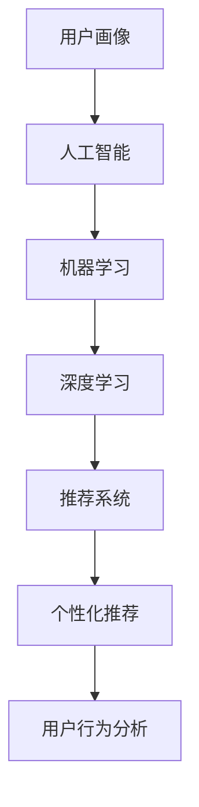

                 

# AI在用户画像中的实际应用

> 关键词：用户画像, 人工智能, 数据挖掘, 机器学习, 推荐系统, 个性化推荐, 用户行为分析

## 1. 背景介绍

### 1.1 问题由来
随着数字化进程的不断加快，用户画像在各行各业的应用变得越来越普遍。它是一种以用户特征和行为为依据，进行数据挖掘和分析的技术手段。利用用户画像，企业能够更加精准地理解用户需求，优化产品和服务，提升用户体验，实现商业价值的最大化。然而，如何高效、准确地构建用户画像，成为当前技术实践中的一大难题。

人工智能（AI）技术的快速发展，为解决这一问题提供了新的思路。通过AI技术，可以从大量用户行为数据中自动挖掘和生成用户画像，极大地提升了画像构建的效率和质量。AI在用户画像中的应用，已成为推动企业数字化转型升级的重要驱动力。

### 1.2 问题核心关键点
AI在用户画像构建中的应用主要包括以下几个关键点：

1. **数据采集与预处理**：收集用户的多渠道行为数据，如网页浏览记录、购买记录、社交媒体互动等，并对数据进行清洗、标准化和标注。
2. **特征工程**：从收集的数据中提取出有意义的特征，如用户偏好、兴趣、行为模式等，构建多维度的用户特征向量。
3. **模型训练与画像生成**：使用机器学习算法对用户数据进行训练，构建用户画像模型，输出多维度的用户画像。
4. **画像应用与优化**：将用户画像应用于推荐系统、个性化营销、用户行为分析等场景中，同时根据反馈数据持续优化模型。

## 2. 核心概念与联系

### 2.1 核心概念概述

为更好地理解AI在用户画像中的实际应用，本节将介绍几个关键概念：

- **用户画像（User Profile）**：基于用户历史行为和特征，构建的一种多维度、多层次的用户描述，用于指导个性化服务与营销。
- **人工智能（Artificial Intelligence, AI）**：通过计算机算法和模型，让机器具备一定的人类智能水平，自动地从数据中学习规律并进行预测、决策的技术。
- **机器学习（Machine Learning, ML）**：一种利用数据训练模型，使其能够自动学习和改进的技术，广泛应用于图像识别、自然语言处理、推荐系统等领域。
- **深度学习（Deep Learning, DL）**：一种基于神经网络的机器学习技术，能够自动地从大量数据中学习并提取特征，用于图像识别、语音识别、自然语言处理等复杂任务。
- **推荐系统（Recommendation System）**：根据用户历史行为和偏好，推荐符合其需求的产品或服务，提升用户体验和业务收益的系统。
- **个性化推荐（Personalized Recommendation）**：针对每位用户量身定制的推荐内容，提高用户满意度和忠诚度。
- **用户行为分析（User Behavior Analysis）**：对用户在不同场景下的行为进行分析和挖掘，发现潜在需求和变化趋势，用于优化产品设计和营销策略。

这些概念之间的逻辑关系可以通过以下Mermaid流程图来展示：



这个流程图展示了AI在用户画像构建和应用中的主要流程：

1. 用户画像的构建，离不开人工智能技术的支持。
2. 机器学习算法在特征提取、模型训练中发挥重要作用。
3. 深度学习能够处理更复杂的数据模式，进一步提升模型的精度。
4. 推荐系统通过用户画像生成个性化推荐内容。
5. 用户行为分析依赖于对用户画像的深入挖掘。

这些概念共同构成了用户画像技术的应用框架，使得AI技术在用户画像构建中发挥了关键作用。通过理解这些核心概念，我们可以更好地把握AI技术在用户画像中的应用方向。

## 3. 核心算法原理 & 具体操作步骤

### 3.1 算法原理概述

AI在用户画像构建中的核心算法，主要是基于机器学习和深度学习技术的特征提取和模型训练。其基本流程如下：

1. **数据采集与预处理**：收集用户的多渠道行为数据，并对数据进行清洗、标准化和标注。
2. **特征工程**：从收集的数据中提取出有意义的特征，构建多维度的用户特征向量。
3. **模型训练与画像生成**：使用机器学习算法对用户数据进行训练，构建用户画像模型，输出多维度的用户画像。
4. **画像应用与优化**：将用户画像应用于推荐系统、个性化营销、用户行为分析等场景中，同时根据反馈数据持续优化模型。

这一过程主要包括以下几个关键步骤：

1. **数据预处理**：包括数据清洗、数据整合、数据标注等。
2. **特征选择**：根据业务需求，从数据中提取和筛选出有意义的特征。
3. **模型选择与训练**：选择合适的机器学习或深度学习模型，进行参数调优和训练。
4. **画像生成**：根据训练好的模型，生成多维度的用户画像。
5. **画像应用与优化**：将用户画像应用于实际业务场景中，并根据反馈数据进行持续优化。

### 3.2 算法步骤详解

下面以推荐系统为例，详细讲解AI在用户画像构建中的操作步骤：

**Step 1: 数据采集与预处理**

数据采集通常包括以下几个方面：

1. **用户行为数据**：包括用户浏览历史、购买记录、点击流数据等。
2. **用户属性数据**：包括用户基本信息、人口统计数据等。
3. **社交网络数据**：包括用户在社交媒体上的互动记录、好友关系等。

数据预处理包括以下几个步骤：

1. **数据清洗**：去除重复、错误、无关数据，填补缺失值。
2. **数据整合**：将不同来源的数据进行整合，形成统一的用户数据集。
3. **数据标注**：对数据进行标签化处理，如将用户浏览记录标注为购买意向等。

**Step 2: 特征工程**

特征工程是构建用户画像的关键步骤，包括以下几个步骤：

1. **特征提取**：从原始数据中提取有意义的特征，如用户兴趣、行为模式等。
2. **特征选择**：选择对模型预测有显著影响的特征，去除无关特征。
3. **特征转换**：对特征进行编码、归一化等预处理，使其适用于模型训练。

**Step 3: 模型选择与训练**

选择合适的机器学习或深度学习模型，并进行参数调优和训练。例如，可以使用决策树、随机森林、XGBoost等传统机器学习算法，或使用神经网络、深度学习模型如卷积神经网络（CNN）、循环神经网络（RNN）、长短期记忆网络（LSTM）等。

**Step 4: 画像生成**

根据训练好的模型，生成多维度的用户画像。例如，可以生成包含用户兴趣、行为模式、人口统计信息等多维度的用户画像。

**Step 5: 画像应用与优化**

将用户画像应用于推荐系统、个性化营销、用户行为分析等场景中，并根据反馈数据进行持续优化。例如，在推荐系统中，根据用户画像推荐符合其需求的产品或服务；在个性化营销中，根据用户画像制定针对性强的广告策略；在用户行为分析中，挖掘用户潜在需求和变化趋势，优化产品设计和营销策略。

### 3.3 算法优缺点

AI在用户画像构建中的应用，具有以下优点：

1. **高效性**：通过自动化处理大量用户数据，快速生成用户画像，提升画像构建效率。
2. **准确性**：基于机器学习和深度学习算法，能够从复杂数据中提取高精度特征，生成高质量用户画像。
3. **灵活性**：支持多种数据源和特征类型，能够灵活适应不同业务场景和需求。
4. **可扩展性**：支持分布式计算和并行处理，能够处理海量用户数据。

同时，AI在用户画像构建中也有以下缺点：

1. **数据依赖性**：依赖高质量、大规模的标注数据，数据采集和标注成本较高。
2. **模型复杂性**：需要选择合适的算法和模型，模型调优和训练过程较为复杂。
3. **隐私问题**：用户数据的隐私保护是一个重要问题，需要采取匿名化、去标识化等技术手段。
4. **解释性不足**：AI模型的决策过程通常缺乏可解释性，难以理解和调试。

尽管存在这些局限性，但AI技术在用户画像构建中的应用，仍然具有广阔的前景和巨大的潜力。未来，随着技术的不断发展和完善，这些问题有望得到逐步解决。

### 3.4 算法应用领域

AI在用户画像构建中的应用，主要包括以下几个领域：

1. **推荐系统**：根据用户画像生成个性化推荐内容，提升用户体验和业务收益。
2. **个性化营销**：基于用户画像制定针对性强的广告策略，提升广告效果和转化率。
3. **用户行为分析**：通过用户画像分析用户行为模式和潜在需求，优化产品设计和营销策略。
4. **风险管理**：利用用户画像进行信用评分、欺诈检测等风险管理应用。
5. **内容推荐**：根据用户画像推荐新闻、视频、音乐等个性化内容，提升用户满意度。
6. **智能客服**：基于用户画像进行智能问答和客服推荐，提升客服效率和用户体验。

这些应用场景展示了AI技术在用户画像构建中的广泛应用，为各行各业带来了新的商业价值和用户体验。未来，随着技术的进一步发展，AI在用户画像中的应用将更加深入和广泛。

## 4. 数学模型和公式 & 详细讲解 & 举例说明

### 4.1 数学模型构建

在用户画像构建中，常用的数学模型包括聚类算法、关联规则算法、协同过滤算法等。这里以协同过滤算法为例，展示用户画像的数学模型构建过程。

设用户集合为 $U=\{u_1,u_2,...,u_M\}$，物品集合为 $I=\{i_1,i_2,...,i_N\}$，用户对物品的评分矩阵为 $R \in \mathbb{R}^{M \times N}$，其中 $R_{ui}$ 表示用户 $u$ 对物品 $i$ 的评分。

用户画像 $P_u$ 可以表示为：

$$
P_u = (f_1(u),f_2(u),...,f_K(u))
$$

其中 $K$ 表示用户画像的维度，$f_k(u)$ 表示用户 $u$ 的第 $k$ 个特征。

协同过滤算法基于用户间的相似度计算，通过计算用户间的相似度，找到与目标用户 $u$ 最相似的 $N$ 个用户 $u_1,u_2,...,u_N$，然后根据这些用户的评分，预测目标用户对未评分物品的评分，从而生成用户画像。

协同过滤算法常用的相似度计算方法包括余弦相似度、皮尔逊相关系数等。这里以余弦相似度为例，余弦相似度的计算公式为：

$$
sim(u_i,u_j) = \cos(\theta) = \frac{\mathbf{R}_i \cdot \mathbf{R}_j}{\|\mathbf{R}_i\| \cdot \|\mathbf{R}_j\|}
$$

其中 $\mathbf{R}_i$ 和 $\mathbf{R}_j$ 分别表示用户 $i$ 和 $j$ 的评分向量，$\cdot$ 表示向量点乘，$\|.\|$ 表示向量范数。

根据相似度计算结果，选择与目标用户最相似的 $N$ 个用户，并计算这些用户的评分平均值，即可预测目标用户对未评分物品的评分。

### 4.2 公式推导过程

以协同过滤算法中的余弦相似度为例，推导其计算公式：

设用户 $i$ 和 $j$ 的评分向量分别为 $\mathbf{R}_i = (r_{i1}, r_{i2}, ..., r_{in})$ 和 $\mathbf{R}_j = (r_{j1}, r_{j2}, ..., r_{jn})$，则余弦相似度的计算公式为：

$$
sim(u_i,u_j) = \frac{\mathbf{R}_i \cdot \mathbf{R}_j}{\|\mathbf{R}_i\| \cdot \|\mathbf{R}_j\|}
$$

将评分向量代入公式中，得：

$$
sim(u_i,u_j) = \frac{\sum_{k=1}^{n} r_{ik} \cdot r_{jk}}{\sqrt{\sum_{k=1}^{n} r_{ik}^2} \cdot \sqrt{\sum_{k=1}^{n} r_{jk}^2}}
$$

公式中，分子表示用户 $i$ 和 $j$ 的评分点乘，分母表示用户 $i$ 和 $j$ 的评分向量范数。余弦相似度在协同过滤算法中广泛应用，能够有效地计算用户间的相似度，从而生成高质量的用户画像。

### 4.3 案例分析与讲解

以电商平台为例，展示协同过滤算法在用户画像构建中的应用：

1. **数据采集与预处理**：收集用户的历史购买记录、浏览记录、评分记录等数据，并进行数据清洗和标准化处理。
2. **特征工程**：从原始数据中提取有意义的特征，如用户兴趣、购买历史、行为模式等。
3. **模型训练与画像生成**：使用协同过滤算法计算用户间的相似度，生成用户画像。
4. **画像应用与优化**：根据用户画像生成个性化推荐内容，提升用户体验和业务收益。

具体实现步骤如下：

1. **数据清洗**：去除重复、错误、无关数据，填补缺失值。
2. **特征提取**：从原始数据中提取有意义的特征，如用户兴趣、购买历史、行为模式等。
3. **相似度计算**：使用余弦相似度计算用户间的相似度。
4. **生成用户画像**：根据相似度计算结果，选择与目标用户最相似的 $N$ 个用户，并计算这些用户的评分平均值，生成目标用户画像。
5. **生成推荐内容**：根据用户画像生成个性化推荐内容，提升用户体验和业务收益。

在实际应用中，可以根据具体业务需求，灵活选择不同的特征工程和相似度计算方法，从而生成更高质量的用户画像，提升推荐系统的效果。

## 5. 项目实践：代码实例和详细解释说明

### 5.1 开发环境搭建

在进行用户画像构建的实践前，我们需要准备好开发环境。以下是使用Python进行PyTorch开发的环境配置流程：

1. 安装Anaconda：从官网下载并安装Anaconda，用于创建独立的Python环境。

2. 创建并激活虚拟环境：
```bash
conda create -n pytorch-env python=3.8 
conda activate pytorch-env
```

3. 安装PyTorch：根据CUDA版本，从官网获取对应的安装命令。例如：
```bash
conda install pytorch torchvision torchaudio cudatoolkit=11.1 -c pytorch -c conda-forge
```

4. 安装TensorFlow：如果需要在TensorFlow上进行用户画像构建，可以使用以下命令：
```bash
conda install tensorflow -c tensorflow
```

5. 安装各类工具包：
```bash
pip install numpy pandas scikit-learn matplotlib tqdm jupyter notebook ipython
```

完成上述步骤后，即可在`pytorch-env`环境中开始用户画像构建的实践。

### 5.2 源代码详细实现

下面以协同过滤算法为例，展示用户画像构建的PyTorch代码实现。

首先，定义协同过滤算法的基本类：

```python
import numpy as np
import torch
import torch.nn as nn
import torch.nn.functional as F

class CollaborativeFiltering(nn.Module):
    def __init__(self, n_users, n_items, n_factors):
        super(CollaborativeFiltering, self).__init__()
        self.n_users = n_users
        self.n_items = n_items
        self.n_factors = n_factors
        self.u_embed = nn.Embedding(n_users, n_factors)
        self.i_embed = nn.Embedding(n_items, n_factors)
        self.w = nn.Parameter(torch.randn(n_factors, n_factors))

    def forward(self, u_idx, i_idx):
        u = self.u_embed(u_idx)
        i = self.i_embed(i_idx)
        return torch.matmul(u, i.t()) * self.w
```

然后，定义数据加载和模型训练函数：

```python
from torch.utils.data import TensorDataset, DataLoader
from torch import Tensor

def load_data(ratings):
    n_users = len(np.unique(ratings[:, 0]))
    n_items = len(np.unique(ratings[:, 1]))
    n_factors = 10

    u_embed = nn.Embedding(n_users, n_factors)
    i_embed = nn.Embedding(n_items, n_factors)
    u, i = u_embed.weight, i_embed.weight
    u = u.detach().requires_grad_()
    i = i.detach().requires_grad_()

    def predict(u_idx, i_idx):
        return torch.matmul(u[u_idx], i[i_idx].t()) * w

    def loss(pred, target):
        return F.mse_loss(pred.view(-1), target.view(-1))

    def train_epoch(model, data_loader, optimizer):
        model.train()
        total_loss = 0
        for batch in data_loader:
            optimizer.zero_grad()
            u_idx, i_idx, target = batch
            pred = model(u_idx, i_idx)
            loss = loss(pred, target)
            loss.backward()
            optimizer.step()
            total_loss += loss.item()
        return total_loss / len(data_loader)

    return predict, loss, train_epoch

def train_model(model, optimizer, train_loader, dev_loader, epochs, batch_size):
    model.train()
    device = torch.device('cuda' if torch.cuda.is_available() else 'cpu')
    model.to(device)
    train_loss = []
    dev_loss = []
    for epoch in range(epochs):
        train_loss.append(train_epoch(model, train_loader, optimizer))
        dev_loss.append(evaluate(model, dev_loader))
        print(f'Epoch {epoch+1}/{epochs}, Train Loss: {train_loss[-1]:.4f}, Dev Loss: {dev_loss[-1]:.4f}')
    return model

def evaluate(model, loader):
    model.eval()
    device = torch.device('cuda' if torch.cuda.is_available() else 'cpu')
    model.to(device)
    total_loss = 0
    with torch.no_grad():
        for batch in loader:
            u_idx, i_idx, target = batch
            pred = model(u_idx, i_idx)
            loss = loss(pred, target)
            total_loss += loss.item()
    return total_loss / len(loader)
```

最后，启动训练流程并在测试集上评估：

```python
n_users = 1000
n_items = 1000
n_factors = 10
epochs = 10
batch_size = 64

# 数据生成
ratings = np.random.randint(0, 10, size=(n_users, n_items))
train_loader = DataLoader(TensorDataset(torch.tensor(ratings[:, 0]), torch.tensor(ratings[:, 1]), torch.tensor(ratings[:, 2])), batch_size=batch_size)
dev_loader = DataLoader(TensorDataset(torch.tensor(ratings[800:900, 0]), torch.tensor(ratings[800:900, 1]), torch.tensor(ratings[800:900, 2])), batch_size=batch_size)

# 模型初始化
model = CollaborativeFiltering(n_users, n_items, n_factors)

# 优化器
optimizer = torch.optim.Adam(model.parameters(), lr=0.01)

# 训练
model = train_model(model, optimizer, train_loader, dev_loader, epochs, batch_size)
```

以上就是使用PyTorch进行协同过滤算法用户画像构建的完整代码实现。可以看到，通过继承 nn.Module，我们可以方便地定义协同过滤算法的模型结构，并进行前向传播、损失计算和反向传播。同时，借助 DataLoader 类，可以轻松地进行数据加载和批处理。

### 5.3 代码解读与分析

让我们再详细解读一下关键代码的实现细节：

**CollaborativeFiltering类**：
- `__init__`方法：初始化模型参数，包括用户嵌入、物品嵌入和权重矩阵。
- `forward`方法：定义模型的前向传播过程，计算用户和物品的嵌入向量的点乘，并乘以权重矩阵，得到预测评分。

**数据加载函数**：
- `load_data`方法：定义数据加载函数，包括评分矩阵的生成、用户嵌入和物品嵌入的创建、预测函数和损失函数的定义，以及训练和评估函数的实现。

**训练函数**：
- `train_epoch`方法：定义每个epoch的训练过程，包括模型前向传播、计算损失、反向传播和梯度更新。
- `train_model`方法：定义整个模型的训练过程，包括模型参数的初始化、训练器的定义、训练和评估函数的调用，以及训练过程中损失的记录和打印。

**评估函数**：
- `evaluate`方法：定义模型的评估过程，包括模型前向传播、计算损失和评估结果的输出。

**训练流程**：
- 定义用户、物品和因子数量，生成随机评分矩阵。
- 定义训练集和验证集的DataLoader，用于数据加载和批处理。
- 定义模型，包括用户嵌入、物品嵌入和权重矩阵的创建，并移动到GPU设备上。
- 定义优化器，用于模型参数的更新。
- 定义训练函数和评估函数，并循环进行训练和评估，输出每个epoch的训练和验证损失。
- 返回训练后的模型。

可以看到，通过以上代码，我们实现了基于协同过滤算法的用户画像构建过程。这一过程体现了AI技术在用户画像构建中的核心思想：通过机器学习和深度学习算法，从数据中自动提取和生成用户画像，并将其应用于推荐系统、个性化营销等场景中。

## 6. 实际应用场景

### 6.1 智能推荐系统

智能推荐系统是AI在用户画像构建中最为典型的应用场景。通过用户画像，推荐系统能够更加精准地为用户推荐符合其需求的产品或服务，提升用户体验和业务收益。

在电商、新闻、音乐、视频等平台上，推荐系统已经广泛应用于个性化推荐内容的推荐，使用户能够快速找到自己感兴趣的商品、文章、音乐等。通过用户画像，推荐系统能够识别用户的历史行为和偏好，从而生成个性化的推荐列表。例如，在电商平台中，推荐系统可以根据用户过去的购买记录、浏览记录和评分记录，生成个性化的商品推荐列表，提升用户的购买率和满意度。

### 6.2 个性化营销

个性化营销是AI在用户画像构建中的另一重要应用场景。通过用户画像，营销系统能够制定更加精准、有效的营销策略，提升广告效果和转化率。

在广告投放、品牌推广等场景中，个性化营销通过用户画像分析用户的行为和需求，制定有针对性的广告策略。例如，在广告投放中，可以根据用户画像中的行为特征，选择最适合的广告渠道和内容，提升广告的点击率和转化率。在品牌推广中，可以通过用户画像分析用户的兴趣和偏好，制定个性化推广方案，增强品牌影响力。

### 6.3 用户行为分析

用户行为分析是AI在用户画像构建中的关键应用场景。通过用户画像，能够深入挖掘用户的潜在需求和行为模式，优化产品设计和营销策略，提升用户体验和业务收益。

在用户行为分析中，通过分析用户的浏览记录、点击记录、购买记录等行为数据，可以发现用户的潜在需求和行为模式，从而优化产品设计和营销策略。例如，在网站设计中，可以通过用户画像分析用户的行为数据，发现用户在不同页面上的停留时间和点击行为，优化页面设计和用户体验。在营销策略中，可以通过用户画像分析用户的兴趣和需求，制定更加精准、有效的营销策略。

### 6.4 未来应用展望

随着AI技术在用户画像构建中的应用不断深化，未来的用户画像将具备更加丰富的特征和更加精准的预测能力。未来AI在用户画像中的应用将更加广泛和深入，以下是一些未来应用展望：

1. **多模态数据融合**：用户画像不仅包含文本数据，还应融合语音、图像、视频等多模态数据，提升画像的全面性和准确性。例如，在智能音箱中，可以通过用户画像分析用户的语音指令，生成个性化的回答和建议。

2. **实时动态更新**：用户画像应具备实时动态更新的能力，能够根据用户的最新行为数据，不断更新和优化画像，提升预测准确性和用户体验。例如，在智能推荐系统中，可以通过用户画像实时更新推荐内容，提升推荐效果。

3. **跨领域应用**：用户画像应具备跨领域应用的能力，能够应用于不同行业和业务场景中。例如，在金融领域，可以通过用户画像分析用户的金融需求和行为，提升金融服务质量。

4. **隐私保护和安全**：用户画像的构建和应用应充分考虑用户的隐私保护和安全问题，采用匿名化、去标识化等技术手段，保障用户数据的安全性。例如，在医疗领域，可以通过用户画像分析用户的健康数据，提供个性化的健康建议，同时保障用户隐私。

5. **伦理和法律合规**：用户画像的构建和应用应遵守伦理和法律规范，避免侵犯用户隐私和权益。例如，在社交网络中，应遵循用户隐私保护的相关法规，合理使用用户数据。

## 7. 工具和资源推荐

### 7.1 学习资源推荐

为了帮助开发者系统掌握AI在用户画像构建的理论基础和实践技巧，这里推荐一些优质的学习资源：

1. **《机器学习实战》**：经典教材，详细介绍了机器学习的基本概念和算法，包括协同过滤算法、聚类算法等。

2. **《深度学习》（Ian Goodfellow著）**：深度学习领域的权威教材，详细介绍了深度学习的原理和应用，包括卷积神经网络、循环神经网络等。

3. **《Python机器学习》（Sebastian Raschka著）**：详细介绍了Python在机器学习中的应用，包括数据预处理、特征工程、模型训练等。

4. **《PyTorch官方文档》**：PyTorch官方文档，提供了丰富的API和样例代码，方便开发者进行学习和实践。

5. **Kaggle竞赛平台**：全球知名的数据科学竞赛平台，提供了丰富的数据集和实战案例，可以锻炼和提升数据处理和模型训练的能力。

通过学习这些资源，相信你一定能够快速掌握AI在用户画像构建中的精髓，并用于解决实际的NLP问题。

### 7.2 开发工具推荐

高效的开发离不开优秀的工具支持。以下是几款用于AI在用户画像构建开发的常用工具：

1. **PyTorch**：基于Python的开源深度学习框架，灵活动态的计算图，适合快速迭代研究。

2. **TensorFlow**：由Google主导开发的开源深度学习框架，生产部署方便，适合大规模工程应用。

3. **Scikit-learn**：Python数据科学库，提供了丰富的机器学习算法和工具，适合进行数据预处理和特征工程。

4. **Jupyter Notebook**：基于Web的交互式编程环境，方便开发者进行实验和展示。

5. **Weights & Biases**：模型训练的实验跟踪工具，可以记录和可视化模型训练过程中的各项指标，方便对比和调优。

6. **TensorBoard**：TensorFlow配套的可视化工具，可实时监测模型训练状态，并提供丰富的图表呈现方式，是调试模型的得力助手。

合理利用这些工具，可以显著提升AI在用户画像构建的开发效率，加快创新迭代的步伐。

### 7.3 相关论文推荐

AI在用户画像构建中的应用研究已有多年的历史，以下是几篇奠基性的相关论文，推荐阅读：

1. **《推荐系统构建》（F. Koren著）**：推荐系统领域的经典著作，详细介绍了推荐系统的构建和优化方法。

2. **《协同过滤算法》（H.C. Shen、C.L. King著）**：详细介绍了协同过滤算法的基本原理和应用。

3. **《深度学习与推荐系统》（P. Sindhwani著）**：深度学习在推荐系统中的应用，包括卷积神经网络、循环神经网络等。

4. **《多模态数据融合》（A. K. Jain、M. Mohan、K. Balakrishnan著）**：多模态数据融合在推荐系统中的应用，提升了推荐效果和用户满意度。

5. **《用户画像的隐私保护》（D. G. Battiston、A. Bruni、C. Cesari著）**：详细介绍了用户画像的隐私保护方法和技术手段。

这些论文代表了大数据和AI在用户画像构建中的应用发展脉络。通过学习这些前沿成果，可以帮助研究者把握学科前进方向，激发更多的创新灵感。

## 8. 总结：未来发展趋势与挑战

### 8.1 研究成果总结

本文对AI在用户画像构建中的应用进行了全面系统的介绍。首先阐述了用户画像的构建背景和意义，明确了AI技术在用户画像构建中的核心作用。其次，从原理到实践，详细讲解了AI在用户画像构建中的数学模型和操作步骤，给出了用户画像构建的完整代码实例。同时，本文还广泛探讨了AI在用户画像构建的实际应用场景，展示了AI技术在用户画像构建中的广泛应用前景。

通过本文的系统梳理，可以看到，AI技术在用户画像构建中发挥了关键作用，极大地提升了画像构建的效率和质量。AI技术的应用不仅限于推荐系统和个性化营销，还包括用户行为分析、风险管理等多个领域，为各行各业带来了新的商业价值和用户体验。

### 8.2 未来发展趋势

展望未来，AI在用户画像构建的应用将呈现以下几个发展趋势：

1. **多模态数据融合**：用户画像不仅包含文本数据，还应融合语音、图像、视频等多模态数据，提升画像的全面性和准确性。

2. **实时动态更新**：用户画像应具备实时动态更新的能力，能够根据用户的最新行为数据，不断更新和优化画像，提升预测准确性和用户体验。

3. **跨领域应用**：用户画像应具备跨领域应用的能力，能够应用于不同行业和业务场景中。

4. **隐私保护和安全**：用户画像的构建和应用应充分考虑用户的隐私保护和安全问题，采用匿名化、去标识化等技术手段，保障用户数据的安全性。

5. **伦理和法律合规**：用户画像的构建和应用应遵守伦理和法律规范，避免侵犯用户隐私和权益。

以上趋势凸显了AI技术在用户画像构建中的广阔前景。这些方向的探索发展，必将进一步提升用户画像构建的效率和质量，为各行各业带来更多的商业价值和用户体验。

### 8.3 面临的挑战

尽管AI在用户画像构建中的应用已经取得了一定的进展，但在迈向更加智能化、普适化应用的过程中，仍然面临以下挑战：

1. **数据依赖性**：依赖高质量、大规模的标注数据，数据采集和标注成本较高。

2. **模型复杂性**：需要选择合适的算法和模型，模型调优和训练过程较为复杂。

3. **隐私问题**：用户数据的隐私保护是一个重要问题，需要采取匿名化、去标识化等技术手段。

4. **解释性不足**：AI模型的决策过程通常缺乏可解释性，难以理解和调试。

5. **伦理和法律合规**：用户画像的构建和应用应遵守伦理和法律规范，避免侵犯用户隐私和权益。

尽管存在这些局限性，但AI技术在用户画像构建中的应用，仍然具有广阔的前景和巨大的潜力。未来，随着技术的不断发展和完善，这些问题有望得到逐步解决。

### 8.4 研究展望

面对AI在用户画像构建中面临的挑战，未来的研究需要在以下几个方面寻求新的突破：

1. **无监督和半监督学习**：摆脱对大规模标注数据的依赖，利用自监督学习、主动学习等无监督和半监督范式，最大限度利用非结构化数据，实现更加灵活高效的画像构建。

2. **参数高效和计算高效的算法**：开发更加参数高效和计算高效的算法，在固定大部分预训练参数的同时，只更新极少量的任务相关参数，提升画像构建的效率和质量。

3. **因果分析和博弈论工具**：引入因果推断和博弈论思想，增强画像构建模型的稳定性和预测能力。

4. **多模态数据整合**：将符号化的先验知识，如知识图谱、逻辑规则等，与神经网络模型进行巧妙融合，引导画像构建过程学习更准确、合理的用户画像。

5. **伦理和法律约束**：在模型训练目标中引入伦理导向的评估指标，过滤和惩罚有偏见、有害的输出倾向，确保用户画像的应用符合伦理和法律规范。

这些研究方向的探索，必将引领AI在用户画像构建技术迈向更高的台阶，为构建安全、可靠、可解释、可控的智能系统铺平道路。面向未来，AI在用户画像中的应用还需要与其他人工智能技术进行更深入的融合，如知识表示、因果推理、强化学习等，多路径协同发力，共同推动自然语言理解和智能交互系统的进步。只有勇于创新、敢于突破，才能不断拓展用户画像的边界，让AI技术更好地造福人类社会。

## 9. 附录：常见问题与解答

**Q1：用户画像对推荐系统的影响有哪些？**

A: 用户画像对推荐系统的影响主要体现在以下几个方面：

1. **个性化推荐**：用户画像能够精准地描述用户的兴趣和需求，推荐系统可以根据用户画像生成个性化的推荐内容，提升用户体验和业务收益。

2. **推荐效果优化**：用户画像可以提供更加全面的用户特征，帮助推荐系统更好地理解用户行为模式，优化推荐算法，提升推荐效果。

3. **业务指标提升**：通过用户画像，推荐系统能够更好地识别和满足用户的潜在需求，提升点击率、转化率、用户满意度等业务指标。

**Q2：如何进行特征工程？**

A: 特征工程是用户画像构建中的关键步骤，主要包括以下几个步骤：

1. **特征选择**：根据业务需求，从原始数据中提取和筛选出有意义的特征，去除无关特征。

2. **特征提取**：将原始数据转化为机器学习算法能够处理的特征向量。

3. **特征转换**：对特征进行编码、归一化等预处理，使其适用于模型训练。

**Q3：用户画像的数据采集与预处理有哪些方法？**

A: 用户画像的数据采集与预处理包括以下几个方法：

1. **数据清洗**：去除重复、错误、无关数据，填补缺失值。

2. **数据整合**：将不同来源的数据进行整合，形成统一的用户数据集。

3. **数据标注**：对数据进行标签化处理，如将用户浏览记录标注为购买意向等。

4. **数据增强**：通过回译、近义替换等方式扩充训练集，提升模型的泛化能力。

**Q4：如何提高用户画像的准确性？**

A: 提高用户画像的准确性主要包括以下几个方法：

1. **高质量数据采集**：采集高质量、多样化的用户数据，确保数据的完整性和代表性。

2. **复杂特征提取**：使用复杂的特征提取算法，提取更全面的用户特征。

3. **多模态融合**：将文本、图像、语音等多模态数据融合到用户画像中，提升画像的全面性和准确性。

4. **实时动态更新**：根据用户的最新行为数据，不断更新和优化用户画像，提升画像的实时性和准确性。

**Q5：用户画像的应用场景有哪些？**

A: 用户画像的应用场景包括以下几个方面：

1. **推荐系统**：根据用户画像生成个性化推荐内容，提升用户体验和业务收益。

2. **个性化营销**：基于用户画像制定针对性强的广告策略，提升广告效果和转化率。

3. **用户行为分析**：通过用户画像分析用户行为模式和潜在需求，优化产品设计和营销策略。

4. **风险管理**：利用用户画像进行信用评分、欺诈检测等风险管理应用。

5. **内容推荐**：根据用户画像推荐新闻、视频、音乐等个性化内容，提升用户满意度。

6. **智能客服**：基于用户画像进行智能问答和客服推荐，提升客服效率和用户体验。

通过本文的系统梳理，可以看到，AI在用户画像构建中的应用将为各行各业带来新的商业价值和用户体验。未来，随着技术的不断发展和完善，AI在用户画像构建中的应用将更加深入和广泛。

---

作者：禅与计算机程序设计艺术 / Zen and the Art of Computer Programming

