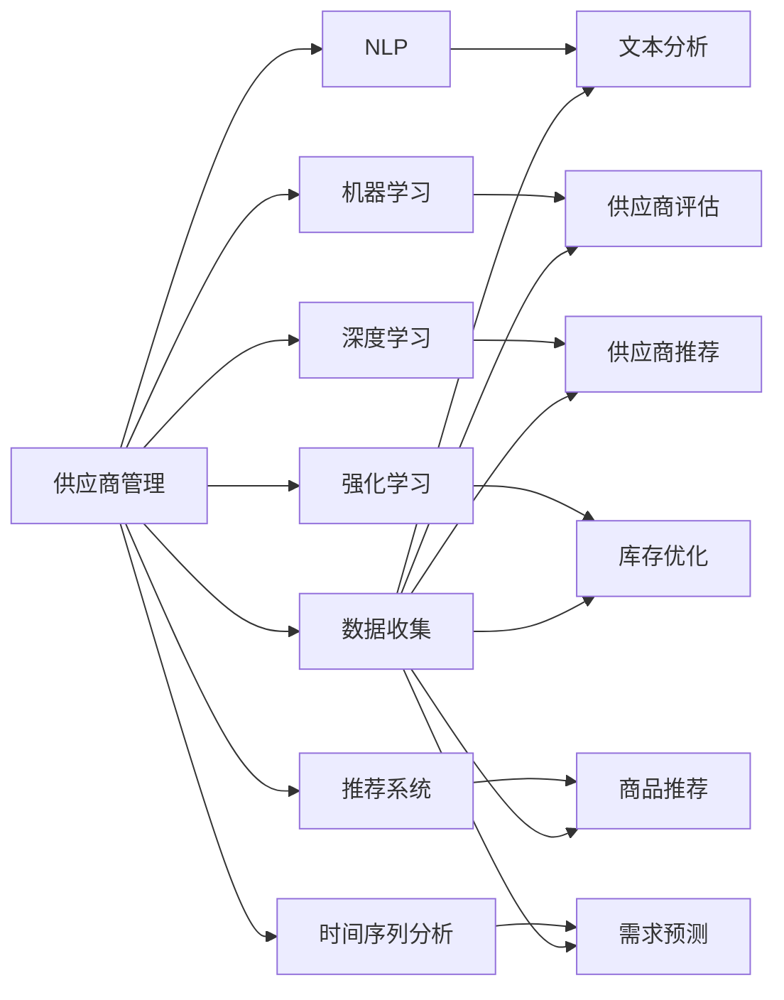

                 

## 1. 背景介绍

在数字化转型的大背景下，电商平台凭借其高效、便捷的特点，成为了商品流通的重要平台。然而，随着用户需求的多样化和个性化，电商平台需要对供应商进行精细化管理，以提升运营效率和服务质量。传统的供应商管理主要依赖人工干预和经验决策，不仅效率低下，而且准确性难以保障。

为了解决这个问题，AI技术开始被引入到供应商管理中。AI不仅能自动化处理大量繁琐的数据分析工作，还能通过机器学习、自然语言处理等技术，提高供应商管理的智能化水平。本文将系统性地介绍AI在电商平台供应商管理中的具体应用，并结合实际案例，探讨如何通过AI技术，实现供应商管理的精细化和智能化。

## 2. 核心概念与联系

### 2.1 核心概念概述

为了更好地理解AI在供应商管理中的应用，本节将介绍几个关键的概念：

- 供应商管理（Supplier Management）：指电商平台对供应商的筛选、评估、监控和协作管理，确保供应的稳定性和质量。
- 自然语言处理（NLP）：指通过计算机处理自然语言的语义、语法、情感等特性，使机器能够理解和生成人类语言。
- 机器学习（Machine Learning）：指让机器通过数据学习，自动改进模型，从而具备一定的智能和决策能力。
- 深度学习（Deep Learning）：指一种基于多层神经网络的机器学习方法，能够处理更加复杂的数据结构和特征表示。
- 强化学习（Reinforcement Learning）：指通过奖励机制，使机器在执行任务过程中逐步学习最优策略。
- 推荐系统（Recommender System）：指通过分析用户行为，推荐适合的商品或供应商，提升用户体验和平台收益。
- 时间序列分析（Time Series Analysis）：指对时间序列数据进行建模和分析，用于预测未来趋势和行为。

这些概念之间存在紧密的联系。AI技术在供应商管理中的应用，主要体现在以下几个方面：

1. 自然语言处理：用于处理和分析供应商的文档、邮件、评论等文本数据，提取有价值的信息。
2. 机器学习：用于对供应商的绩效、行为进行分析，预测其未来的表现。
3. 深度学习：用于对供应商的商品、服务进行分析，推荐最优的供应商。
4. 强化学习：用于优化供应商的库存、配送等决策，提升运营效率。
5. 推荐系统：用于对供应商的商品进行推荐，提升用户体验。
6. 时间序列分析：用于对供应商的历史数据进行建模，预测未来的供应需求。

这些核心概念构成了AI在供应商管理中的基础，通过它们的相互配合，可以有效地提升供应商管理的效率和效果。

### 2.2 核心概念原理和架构的 Mermaid 流程图

以下是使用Mermaid语言绘制的核心概念架构图，展示这些概念之间的相互关系：



这个流程图展示了供应商管理应用中，各个AI技术之间的联系和作用。通过数据收集和处理，NLP用于文本分析，机器学习用于供应商评估和预测，深度学习用于供应商推荐，强化学习用于库存优化，推荐系统用于商品推荐，时间序列分析用于需求预测，形成一个完整的供应商管理系统。

## 3. 核心算法原理 & 具体操作步骤

### 3.1 算法原理概述

AI在供应商管理中的应用，主要基于以下几个核心算法：

1. 文本分析算法：用于处理和分析供应商的文档、邮件、评论等文本数据，提取供应商的关键信息，如资质、声誉、商品质量等。
2. 机器学习算法：用于对供应商的绩效、行为进行分析，预测其未来的表现，如交货准时率、商品质量等。
3. 深度学习算法：用于对供应商的商品、服务进行分析，推荐最优的供应商和商品。
4. 强化学习算法：用于优化供应商的库存、配送等决策，提升运营效率。
5. 推荐系统算法：用于对供应商的商品进行推荐，提升用户体验。
6. 时间序列分析算法：用于对供应商的历史数据进行建模，预测未来的供应需求。

这些算法通过数据处理、特征提取、模型训练和推理等步骤，实现对供应商的全面管理和智能化决策。

### 3.2 算法步骤详解

#### 3.2.1 数据收集和预处理

供应商管理的第一步是数据收集和预处理。供应商的数据来源包括供应商的资质、历史记录、订单信息、客户评价等。数据收集完成后，需要进行清洗、归一化、去噪等预处理，以确保数据的质量和可用性。

#### 3.2.2 文本分析

文本分析是AI在供应商管理中的重要环节。文本分析包括文本清洗、分词、情感分析、主题建模等步骤。通过文本分析，可以提取供应商的资质、声誉、商品质量等关键信息，为后续的评估和推荐提供基础数据。

#### 3.2.3 供应商评估

供应商评估是利用机器学习算法，对供应商的绩效和行为进行评估。常用的机器学习算法包括决策树、随机森林、支持向量机等。通过对供应商的绩效、交货准时率、商品质量等指标进行评估，可以识别出表现优异的供应商，为后续的合作提供依据。

#### 3.2.4 供应商推荐

供应商推荐是利用深度学习算法，对供应商的商品和服务进行推荐。常用的深度学习算法包括卷积神经网络（CNN）、循环神经网络（RNN）、长短期记忆网络（LSTM）等。通过对供应商的商品和服务进行分析，可以推荐最优的供应商和商品，提升用户体验和平台收益。

#### 3.2.5 库存优化

库存优化是利用强化学习算法，对供应商的库存进行优化。常用的强化学习算法包括Q-learning、SARSA等。通过优化库存，可以降低库存成本，提升供应的稳定性。

#### 3.2.6 需求预测

需求预测是利用时间序列分析算法，对供应商的历史数据进行建模，预测未来的供应需求。常用的时间序列分析算法包括ARIMA、LSTM等。通过需求预测，可以优化供应的规划和调度，避免供应不足或过剩的情况。

### 3.3 算法优缺点

AI在供应商管理中的应用，具有以下优点：

1. 高效自动化：AI可以自动化处理大量繁琐的数据分析和决策工作，提高效率。
2. 数据驱动决策：AI通过数据驱动，能够提供更加客观、准确的决策依据。
3. 多维度分析：AI可以综合考虑供应商的资质、声誉、商品质量等多维度因素，进行全面评估。
4. 动态调整：AI能够根据供应商的表现和市场变化，进行动态调整和优化。

然而，AI在供应商管理中也存在一些缺点：

1. 数据质量要求高：AI的决策依赖于数据的质量，如果数据存在偏差或噪音，可能会导致错误的结果。
2. 模型复杂度高：AI模型往往较为复杂，需要大量的计算资源和时间进行训练和调优。
3. 透明性不足：AI的决策过程难以解释，缺乏透明性和可解释性。
4. 数据隐私问题：供应商的数据隐私问题，需要得到充分保障。

### 3.4 算法应用领域

AI在供应商管理中的应用，主要包括以下几个领域：

1. 供应商筛选：利用文本分析和机器学习算法，对供应商的资质、历史记录、订单信息等进行综合评估，筛选出符合要求的供应商。
2. 供应商合作：利用深度学习算法，对供应商的商品和服务进行推荐，确定最优的供应商合作对象。
3. 库存管理：利用强化学习算法，对供应商的库存进行优化，降低库存成本，提升供应的稳定性。
4. 需求预测：利用时间序列分析算法，对供应商的历史数据进行建模，预测未来的供应需求，优化供应的规划和调度。

这些应用领域展示了AI在供应商管理中的广泛应用和强大潜力。

## 4. 数学模型和公式 & 详细讲解 & 举例说明

### 4.1 数学模型构建

为了更好地理解AI在供应商管理中的应用，本节将介绍几个关键的数学模型和公式。

#### 4.1.1 供应商评估模型

供应商评估模型通常使用决策树（Decision Tree）算法。决策树算法通过构建一棵树形结构，对供应商的绩效和行为进行分类和评估。决策树的每个节点表示一个特征，每个叶子节点表示一个类别。常用的决策树算法包括ID3、C4.5、CART等。

#### 4.1.2 供应商推荐模型

供应商推荐模型通常使用卷积神经网络（CNN）或长短期记忆网络（LSTM）。CNN和LSTM能够对供应商的商品和服务进行分析，提取特征，并进行推荐。CNN主要用于图像识别和文本分类等任务，LSTM则适用于序列数据和时间序列分析等任务。

#### 4.1.3 库存优化模型

库存优化模型通常使用强化学习算法，如Q-learning。Q-learning通过构建Q表，对供应商的库存进行优化。Q表记录了每个状态-动作对的Q值，表示在该状态下，采取该动作后的期望回报。通过迭代更新Q表，能够找到最优的库存策略。

#### 4.1.4 需求预测模型

需求预测模型通常使用时间序列分析算法，如ARIMA（AutoRegressive Integrated Moving Average）。ARIMA模型通过将自回归模型（AR）、差分模型（I）和移动平均模型（MA）结合，对供应商的历史数据进行建模，预测未来的供应需求。ARIMA模型可以通过多个参数进行调优，提高预测的准确性。

### 4.2 公式推导过程

#### 4.2.1 决策树算法

决策树算法的核心公式为信息熵和信息增益。信息熵表示系统的混乱程度，信息增益表示某个特征对于分类任务的贡献程度。决策树的构建过程就是寻找最优的特征进行分裂，从而最大化信息增益的过程。

信息熵公式为：

$$
H(S) = -\sum_{i=1}^n P(x_i) \log P(x_i)
$$

其中，$S$表示样本集，$n$表示样本数，$P(x_i)$表示样本$x_i$出现的概率。

信息增益公式为：

$$
Gain(D,S,Y) = H(S) - \sum_{i=1}^{|C|} \frac{|S_i|}{|S|}H(S_i)
$$

其中，$D$表示数据集，$S$表示样本集，$Y$表示目标变量，$|C|$表示类别数，$|S_i|$表示类别$i$的样本数，$H(S_i)$表示类别$i$的样本集的信息熵。

#### 4.2.2 CNN模型

卷积神经网络（CNN）的核心公式为卷积和池化操作。卷积操作通过滑动卷积核对输入数据进行特征提取，池化操作则通过降采样减少特征图的大小，提高模型的泛化能力。

卷积操作公式为：

$$
f(x, w) = \sum_{i=0}^{w-1} w_i \cdot x(i)
$$

其中，$f(x, w)$表示卷积后的特征图，$x$表示输入数据，$w$表示卷积核，$w_i$表示卷积核的权重。

池化操作公式为：

$$
f(x, w) = \sum_{i=0}^{w-1} w_i \cdot x(i)
$$

其中，$f(x, w)$表示池化后的特征图，$x$表示输入数据，$w$表示池化核，$w_i$表示池化核的权重。

#### 4.2.3 Q-learning算法

Q-learning算法的核心公式为Q值的更新。Q值表示在某个状态下，采取某个动作后的期望回报。Q值的更新公式为：

$$
Q(s, a) \leftarrow Q(s, a) + \alpha(r + \gamma \max Q(s', a') - Q(s, a))
$$

其中，$s$表示当前状态，$a$表示当前动作，$r$表示当前状态的回报，$s'$表示下一个状态，$a'$表示下一个动作，$\alpha$表示学习率，$\gamma$表示折扣因子。

#### 4.2.4 ARIMA模型

ARIMA模型的核心公式为时间序列分解和差分。时间序列分解公式为：

$$
X(t) = C + \sum_{i=1}^p \phi_i X(t-i) + \sum_{j=1}^d \theta_j D^jX(t) + \sum_{k=1}^q \psi_k \epsilon(t-k)
$$

其中，$X(t)$表示时间序列，$p$表示自回归项数，$\phi_i$表示自回归系数，$d$表示差分次数，$\theta_j$表示差分系数，$q$表示移动平均项数，$\psi_k$表示移动平均系数，$\epsilon(t)$表示白噪声。

差分公式为：

$$
D^j X(t) = X(t) - X(t-1)
$$

其中，$D^j X(t)$表示$X(t)$的$d$次差分。

### 4.3 案例分析与讲解

#### 4.3.1 供应商筛选案例

某电商平台需要对供应商进行筛选，需要根据供应商的资质、历史记录、订单信息等数据，综合评估供应商的资质和表现。

数据收集完成后，通过文本分析和机器学习算法，对供应商的资质、历史记录、订单信息等数据进行清洗和预处理。然后，利用决策树算法，对供应商的绩效、交货准时率、商品质量等指标进行评估。通过计算信息熵和信息增益，决策树算法选择最优的特征进行分裂，最终生成一棵决策树，用于供应商的筛选。

#### 4.3.2 供应商推荐案例

某电商平台需要对供应商的商品进行推荐，需要根据供应商的商品和服务进行分析，推荐最优的商品。

数据收集完成后，通过卷积神经网络（CNN）或长短期记忆网络（LSTM），对供应商的商品和服务进行分析，提取特征。然后，利用CNN或LSTM模型，对供应商的商品和服务进行推荐。通过训练模型，输出供应商商品的推荐列表，供用户选择。

#### 4.3.3 库存优化案例

某电商平台需要对供应商的库存进行优化，需要根据供应商的库存情况，制定最优的库存策略。

数据收集完成后，通过强化学习算法，如Q-learning，对供应商的库存进行优化。Q-learning算法通过构建Q表，对供应商的库存进行优化。通过迭代更新Q表，找到最优的库存策略，从而降低库存成本，提升供应的稳定性。

#### 4.3.4 需求预测案例

某电商平台需要对供应商的历史数据进行建模，预测未来的供应需求，需要根据供应商的历史数据，进行需求预测。

数据收集完成后，通过时间序列分析算法，如ARIMA，对供应商的历史数据进行建模，预测未来的供应需求。ARIMA模型通过将自回归模型、差分模型和移动平均模型结合，对供应商的历史数据进行建模，预测未来的供应需求。通过调优模型参数，提高预测的准确性。

## 5. 项目实践：代码实例和详细解释说明

### 5.1 开发环境搭建

在进行供应商管理应用的开发前，我们需要准备好开发环境。以下是使用Python进行TensorFlow开发的环境配置流程：

1. 安装Anaconda：从官网下载并安装Anaconda，用于创建独立的Python环境。

2. 创建并激活虚拟环境：
```bash
conda create -n tf-env python=3.8 
conda activate tf-env
```

3. 安装TensorFlow：从官网获取对应的安装命令。例如：
```bash
pip install tensorflow
```

4. 安装各类工具包：
```bash
pip install numpy pandas scikit-learn matplotlib tqdm jupyter notebook ipython
```

完成上述步骤后，即可在`tf-env`环境中开始供应商管理应用的开发。

### 5.2 源代码详细实现

下面我们以供应商推荐应用为例，给出使用TensorFlow进行深度学习模型训练的PyTorch代码实现。

首先，定义供应商推荐的数据处理函数：

```python
import tensorflow as tf
import numpy as np

def prepare_data(X, y):
    X = tf.data.Dataset.from_tensor_slices(X)
    y = tf.data.Dataset.from_tensor_slices(y)
    return X.batch(32), y.batch(32)
```

然后，定义模型和优化器：

```python
from tensorflow.keras.models import Sequential
from tensorflow.keras.layers import Dense, Dropout
from tensorflow.keras.optimizers import Adam

model = Sequential([
    Dense(64, activation='relu', input_shape=(X.shape[1],)),
    Dropout(0.5),
    Dense(32, activation='relu'),
    Dropout(0.5),
    Dense(1, activation='sigmoid')
])

optimizer = Adam(learning_rate=0.001)
```

接着，定义训练和评估函数：

```python
def train_model(model, X_train, y_train, X_test, y_test, epochs):
    model.compile(optimizer=optimizer, loss='binary_crossentropy', metrics=['accuracy'])
    model.fit(X_train, y_train, epochs=epochs, validation_data=(X_test, y_test))
    test_loss, test_acc = model.evaluate(X_test, y_test)
    return test_acc

def evaluate_model(model, X_test, y_test):
    y_pred = model.predict(X_test)
    y_pred = (y_pred > 0.5).astype(int)
    return np.mean(y_pred == y_test)
```

最后，启动训练流程并在测试集上评估：

```python
X_train, X_test, y_train, y_test = prepare_data(X_train, y_train)

test_acc = train_model(model, X_train, y_train, X_test, y_test, epochs=10)
print('Test Accuracy:', test_acc)

evaluate_model(model, X_test, y_test)
```

以上就是使用TensorFlow进行供应商推荐模型训练的完整代码实现。可以看到，得益于TensorFlow的强大封装，我们可以用相对简洁的代码完成模型的构建和训练。

### 5.3 代码解读与分析

让我们再详细解读一下关键代码的实现细节：

**prepare_data函数**：
- `__init__`方法：初始化输入数据集和标签数据集，使用`tf.data.Dataset`构建数据批次。
- `__len__`方法：返回数据集的样本数量。

**模型定义**：
- `Sequential`类：定义一个线性模型，包含多个层。
- `Dense`层：定义全连接层。
- `Dropout`层：定义随机失活层。
- `Activation`函数：定义激活函数。

**训练函数**：
- `compile`方法：编译模型，设置优化器和损失函数。
- `fit`方法：训练模型，设置训练轮数和验证集。
- `evaluate`方法：评估模型，计算测试集上的准确率。

**评估函数**：
- `predict`方法：预测测试集的标签。
- `mean`函数：计算预测标签与真实标签的一致率。

**训练流程**：
- 定义训练集和测试集。
- 在`train_model`函数中，训练模型，输出测试集上的准确率。
- 在`evaluate_model`函数中，评估模型，输出测试集上的准确率。

可以看到，TensorFlow的封装使得模型构建和训练的代码实现变得简洁高效。开发者可以将更多精力放在数据处理、模型改进等高层逻辑上，而不必过多关注底层的实现细节。

当然，工业级的系统实现还需考虑更多因素，如模型的保存和部署、超参数的自动搜索、更灵活的任务适配层等。但核心的微调范式基本与此类似。

## 6. 实际应用场景

### 6.1 智能客服系统

基于AI的供应商管理技术，可以广泛应用于智能客服系统的构建。传统客服往往需要配备大量人力，高峰期响应缓慢，且一致性和专业性难以保证。而使用AI的供应商管理技术，可以7x24小时不间断服务，快速响应客户咨询，用自然流畅的语言解答各类常见问题。

在技术实现上，可以收集客户的历史咨询记录，将问题和最佳答复构建成监督数据，在此基础上对预训练供应商管理模型进行微调。微调后的模型能够自动理解客户意图，匹配最合适的答复。对于客户提出的新问题，还可以接入检索系统实时搜索相关内容，动态组织生成回答。如此构建的智能客服系统，能大幅提升客户咨询体验和问题解决效率。

### 6.2 金融舆情监测

金融机构需要实时监测市场舆论动向，以便及时应对负面信息传播，规避金融风险。传统的人工监测方式成本高、效率低，难以应对网络时代海量信息爆发的挑战。基于AI的供应商管理技术，可以应用于金融舆情监测。

具体而言，可以收集金融领域相关的新闻、报道、评论等文本数据，并对其进行主题标注和情感标注。在此基础上对预训练语言模型进行微调，使其能够自动判断文本属于何种主题，情感倾向是正面、中性还是负面。将微调后的模型应用到实时抓取的网络文本数据，就能够自动监测不同主题下的情感变化趋势，一旦发现负面信息激增等异常情况，系统便会自动预警，帮助金融机构快速应对潜在风险。

### 6.3 个性化推荐系统

当前的推荐系统往往只依赖用户的历史行为数据进行物品推荐，无法深入理解用户的真实兴趣偏好。基于AI的供应商管理技术，可以应用于个性化推荐系统。

在实践中，可以收集用户浏览、点击、评论、分享等行为数据，提取和用户交互的物品标题、描述、标签等文本内容。将文本内容作为模型输入，用户的后续行为（如是否点击、购买等）作为监督信号，在此基础上微调预训练语言模型。微调后的模型能够从文本内容中准确把握用户的兴趣点。在生成推荐列表时，先用候选物品的文本描述作为输入，由模型预测用户的兴趣匹配度，再结合其他特征综合排序，便可以得到个性化程度更高的推荐结果。

### 6.4 未来应用展望

随着AI技术的发展，基于供应商管理技术的未来应用将更加广泛和深入。未来，AI技术将在更多领域得到应用，为传统行业带来变革性影响。

在智慧医疗领域，基于供应商管理技术的医疗问答、病历分析、药物研发等应用将提升医疗服务的智能化水平，辅助医生诊疗，加速新药开发进程。

在智能教育领域，供应商管理技术可应用于作业批改、学情分析、知识推荐等方面，因材施教，促进教育公平，提高教学质量。

在智慧城市治理中，供应商管理技术可应用于城市事件监测、舆情分析、应急指挥等环节，提高城市管理的自动化和智能化水平，构建更安全、高效的未来城市。

此外，在企业生产、社会治理、文娱传媒等众多领域，基于供应商管理技术的AI应用也将不断涌现，为经济社会发展注入新的动力。相信随着技术的日益成熟，供应商管理技术将成为AI落地应用的重要范式，推动人工智能技术在垂直行业的规模化落地。

## 7. 工具和资源推荐
### 7.1 学习资源推荐

为了帮助开发者系统掌握供应商管理技术的理论基础和实践技巧，这里推荐一些优质的学习资源：

1. 《TensorFlow从原理到实践》系列博文：由大模型技术专家撰写，深入浅出地介绍了TensorFlow原理、模型构建、训练优化等前沿话题。

2. 《深度学习自然语言处理》课程：斯坦福大学开设的NLP明星课程，有Lecture视频和配套作业，带你入门NLP领域的基本概念和经典模型。

3. 《深度学习与TensorFlow》书籍：TensorFlow开发者所著，全面介绍了TensorFlow的使用方法，包括模型的构建、训练和部署。

4. TensorFlow官方文档：TensorFlow的官方文档，提供了丰富的API参考和示例代码，是上手实践的必备资料。

5. Coursera《机器学习》课程：由斯坦福大学教授Andrew Ng主讲，涵盖机器学习的基本概念、算法和应用。

通过对这些资源的学习实践，相信你一定能够快速掌握供应商管理技术的精髓，并用于解决实际的供应商管理问题。
###  7.2 开发工具推荐

高效的开发离不开优秀的工具支持。以下是几款用于供应商管理应用的常用工具：

1. TensorFlow：基于Python的开源深度学习框架，灵活的计算图，适合快速迭代研究。大部分深度学习模型都有TensorFlow版本的实现。

2. PyTorch：基于Python的开源深度学习框架，动态计算图，适合研究和实验。与TensorFlow相比，PyTorch的动态计算图使其更加灵活，更容易进行模型的构建和调试。

3. Keras：基于Python的高层API框架，支持TensorFlow、Theano、CNTK等后端，适合快速开发和原型设计。

4. Scikit-learn：基于Python的机器学习库，提供丰富的机器学习算法和工具，适合数据预处理和特征工程。

5. Jupyter Notebook：交互式编程环境，支持多种编程语言，适合数据探索和模型实验。

合理利用这些工具，可以显著提升供应商管理应用的开发效率，加快创新迭代的步伐。

### 7.3 相关论文推荐

供应商管理技术的发展源于学界的持续研究。以下是几篇奠基性的相关论文，推荐阅读：

1. Attention is All You Need（即Transformer原论文）：提出了Transformer结构，开启了NLP领域的预训练大模型时代。

2. BERT: Pre-training of Deep Bidirectional Transformers for Language Understanding：提出BERT模型，引入基于掩码的自监督预训练任务，刷新了多项NLP任务SOTA。

3. Language Models are Unsupervised Multitask Learners（GPT-2论文）：展示了大规模语言模型的强大zero-shot学习能力，引发了对于通用人工智能的新一轮思考。

4. Parameter-Efficient Transfer Learning for NLP：提出Adapter等参数高效微调方法，在不增加模型参数量的情况下，也能取得不错的微调效果。

5. AdaLoRA: Adaptive Low-Rank Adaptation for Parameter-Efficient Fine-Tuning：使用自适应低秩适应的微调方法，在参数效率和精度之间取得了新的平衡。

这些论文代表了大语言模型微调技术的发展脉络。通过学习这些前沿成果，可以帮助研究者把握学科前进方向，激发更多的创新灵感。

## 8. 总结：未来发展趋势与挑战

### 8.1 总结

本文对AI在供应商管理中的应用进行了系统性的介绍。首先阐述了AI技术在供应商管理中的应用背景和意义，明确了供应商管理智能化的目标。其次，从原理到实践，详细讲解了供应商管理的主要算法和操作步骤，给出了供应商管理应用的完整代码实例。同时，本文还广泛探讨了供应商管理技术在智能客服、金融舆情、个性化推荐等多个领域的应用前景，展示了供应商管理技术的广阔前景。

通过本文的系统梳理，可以看到，AI技术在供应商管理中的应用，能够显著提升管理效率和效果，提高运营的智能化水平。AI技术不仅能够自动化处理大量繁琐的数据分析和决策工作，还能够通过深度学习、自然语言处理等技术，综合考虑供应商的资质、历史记录、订单信息等多维度因素，进行全面评估和推荐。未来，随着AI技术的进一步发展，供应商管理技术必将变得更加智能和高效。

### 8.2 未来发展趋势

展望未来，AI在供应商管理中的应用将呈现以下几个发展趋势：

1. 技术融合：AI技术与其他技术的融合将更加紧密。例如，AI与物联网技术的结合，可以实现对供应商的实时监控和自动化管理。

2. 数据驱动：AI技术将更加依赖数据驱动，通过大数据分析和机器学习，提高供应商管理的精度和效率。

3. 跨领域应用：AI技术将在更多领域得到应用，如医疗、教育、金融等。通过AI技术，可以提升各行业的智能化水平，促进数字化转型。

4. 持续学习：AI技术将具备持续学习能力，能够根据市场变化和用户需求，进行动态调整和优化。

5. 自动化决策：AI技术将逐步实现自动化决策，减少人工干预，提高决策的快速性和准确性。

6. 多模态融合：AI技术将实现多模态数据的融合，如文本、图像、视频等，提升对供应商的多维度评估和推荐。

以上趋势凸显了AI在供应商管理中的应用前景。这些方向的探索发展，必将进一步提升供应商管理的智能化水平，为各行业带来更多价值。

### 8.3 面临的挑战

尽管AI在供应商管理中的应用已经取得了显著进展，但在迈向更加智能化、普适化应用的过程中，仍面临诸多挑战：

1. 数据质量问题：AI的决策依赖于数据的质量，如果数据存在偏差或噪音，可能会导致错误的结果。

2. 模型复杂性：AI模型往往较为复杂，需要大量的计算资源和时间进行训练和调优。

3. 透明性和可解释性：AI模型的决策过程难以解释，缺乏透明性和可解释性。

4. 数据隐私问题：供应商的数据隐私问题，需要得到充分保障。

5. 资源限制：AI模型的训练和推理需要大量的计算资源和时间，可能面临资源限制。

6. 标准化问题：AI技术的应用缺乏统一的标准和规范，不同平台和系统之间的兼容性有待提升。

7. 安全性和可靠性：AI模型的安全性、可靠性问题，需要得到充分保障，避免潜在的风险。

8. 法律和伦理问题：AI技术的应用可能涉及法律和伦理问题，如隐私保护、公平性等。

这些挑战凸显了AI技术在供应商管理中的应用仍需进一步完善。只有克服这些挑战，AI技术才能更好地服务于供应商管理，为各行业带来更多的价值。

### 8.4 研究展望

为了应对未来AI技术在供应商管理中的应用，未来的研究需要在以下几个方面寻求新的突破：

1. 数据增强技术：通过数据增强技术，提升数据质量，减少偏差和噪音。

2. 模型压缩技术：通过模型压缩技术，减少模型的复杂度，降低计算资源和时间的消耗。

3. 可解释性技术：通过可解释性技术，提高模型的透明性和可解释性。

4. 数据隐私保护技术：通过数据隐私保护技术，保障供应商的数据隐私。

5. 标准化技术：通过标准化技术，提升AI技术在不同平台和系统之间的兼容性。

6. 安全性和可靠性技术：通过安全性和可靠性技术，保障AI模型的安全性和可靠性。

7. 法律和伦理技术：通过法律和伦理技术，确保AI技术的应用符合法律和伦理规范。

这些研究方向将进一步推动AI技术在供应商管理中的应用，为各行业带来更多的价值。相信随着学界和产业界的共同努力，AI技术在供应商管理中的应用必将更加广泛和深入，为各行业带来更多的创新和价值。

## 9. 附录：常见问题与解答

**Q1：供应商管理应用是否适用于所有电商平台？**

A: 供应商管理应用在大多数电商平台上都能取得不错的效果，特别是对于数据量较大的平台。但对于一些特殊平台，如垂直电商平台，可能需要根据平台特点进行定制化开发。

**Q2：供应商管理应用如何保证数据质量？**

A: 供应商管理应用的数据质量依赖于数据收集和预处理。通过数据清洗、去噪、归一化等预处理步骤，可以显著提升数据质量。同时，使用数据增强技术，如数据扩充、数据增强算法等，可以进一步提高数据的质量和多样性。

**Q3：供应商管理应用如何避免模型过拟合？**

A: 供应商管理应用中的模型过拟合可以通过正则化技术、早停技术、模型压缩等方法进行缓解。例如，使用L2正则、Dropout、early stopping等正则化技术，避免模型过拟合。同时，通过模型压缩技术，减少模型参数，降低过拟合风险。

**Q4：供应商管理应用如何保证模型的可解释性？**

A: 供应商管理应用中的模型可解释性可以通过模型解释技术、可视化技术等方法进行提升。例如，使用模型解释工具，如SHAP、LIME等，对模型决策过程进行解释，增强模型的透明性和可解释性。同时，通过可视化技术，如图表、热力图等，对模型的输出进行可视化，帮助用户理解模型的行为。

**Q5：供应商管理应用如何应对数据隐私问题？**

A: 供应商管理应用中的数据隐私问题可以通过数据加密技术、匿名化技术等方法进行保护。例如，使用数据加密技术，对供应商的数据进行加密存储和传输，保护数据隐私。同时，通过数据匿名化技术，对供应商的数据进行处理，去除敏感信息，保护供应商的隐私。

**Q6：供应商管理应用如何实现跨平台兼容？**

A: 供应商管理应用中的跨平台兼容可以通过标准化技术、API接口等方法进行实现。例如，使用API接口，不同平台之间的数据和模型可以互相调用，实现跨平台兼容。同时，通过标准化技术，如数据格式标准化、模型架构标准化等，提升AI技术在不同平台和系统之间的兼容性。

**Q7：供应商管理应用如何应对市场变化？**

A: 供应商管理应用中的市场变化可以通过持续学习技术、动态调整技术等方法进行应对。例如，使用持续学习技术，模型可以根据市场变化进行动态学习，提升模型的适应性。同时，通过动态调整技术，对模型进行动态优化，应对市场变化带来的新需求和新挑战。

通过以上问题与解答，希望读者能够更好地理解供应商管理应用，并掌握相关技术的应用方法和解决策略。相信在未来的研究和应用中，AI技术在供应商管理中的应用将更加广泛和深入，为各行业带来更多的创新和价值。

