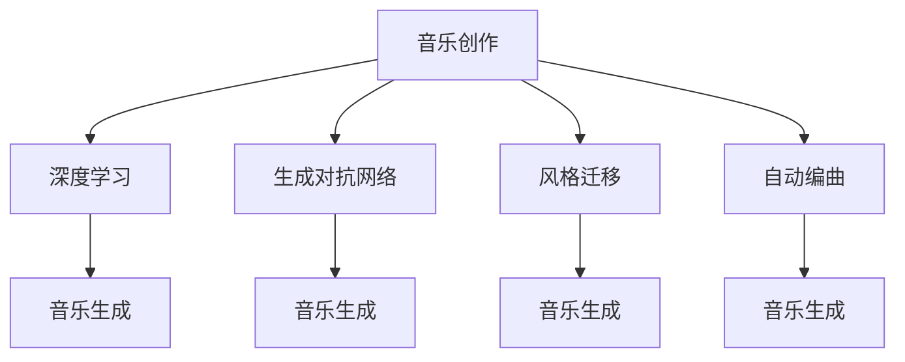

                 

# AI在音乐创作中的应用：新的艺术形式

## 1. 背景介绍

### 1.1 问题由来
音乐，作为一种跨越时空的艺术形式，一直是人类文化的重要组成部分。然而，随着科技的进步，传统音乐创作方式逐渐被数字化、自动化技术所取代，甚至出现了一类新的音乐创作方式——通过人工智能进行音乐创作。AI在音乐创作中的应用，打破了人类音乐家与音符之间的天然屏障，使得音乐创作过程更加多样化，同时也带来了许多新的思考和挑战。

### 1.2 问题核心关键点
AI在音乐创作中的主要应用点包括：旋律生成、和弦编配、节奏设计、以及音乐风格的自动生成。这些技术利用机器学习算法和神经网络模型，可以在大量数据上进行训练，然后根据用户需求生成新的音乐作品。

AI音乐创作的核心在于利用数据训练模型，生成符合音乐理论、具有创新性的音乐作品。其中，深度学习、强化学习、生成对抗网络等技术被广泛应用，这些技术不仅能够生成新曲，还能根据用户反馈不断优化，提升音乐质量。

### 1.3 问题研究意义
AI在音乐创作中的应用，不仅为音乐创作提供了新的工具和方法，还拓展了音乐艺术的表现形式，赋予了音乐创作更多的可能性和创造性。同时，AI的参与也促使人们思考音乐创作本质，探索人类与人工智能的边界，为未来的艺术创新提供了新的视角。

## 2. 核心概念与联系

### 2.1 核心概念概述

为了更好地理解AI在音乐创作中的应用，本节将介绍几个核心概念：

- **音乐创作（Music Composition）**：指利用音乐理论和技术，创作新的音乐作品的过程。传统上，这一过程依赖于人类音乐家的经验和灵感。
- **深度学习（Deep Learning）**：一种机器学习算法，通过多层神经网络模型，在大量数据上进行训练，能够自动学习数据特征和规律，从而进行预测或生成任务。
- **生成对抗网络（Generative Adversarial Network, GAN）**：一种机器学习算法，通过两个神经网络相互竞争，生成高质量的合成数据，如音乐、图像等。
- **风格迁移（Style Transfer）**：通过将音乐从一个风格映射到另一个风格，生成新的音乐作品。这通常需要两个不同风格的数据集进行联合训练。
- **自动编曲（Auto-Composition）**：指利用AI技术自动生成和编排音乐，这一过程包括旋律、和弦、节奏等元素的自动生成。

这些核心概念之间的逻辑关系可以通过以下Mermaid流程图来展示：



这个流程图展示了大语言模型在音乐创作中的应用，主要通过深度学习、生成对抗网络和风格迁移等技术实现：

1. 深度学习：用于音乐生成，能够从大量音乐数据中学习到音乐模式和结构。
2. 生成对抗网络：用于音乐生成，通过两个网络之间的对抗训练，生成高质量的合成音乐。
3. 风格迁移：将音乐从一个风格映射到另一个风格，实现音乐的创新表达。
4. 自动编曲：利用AI技术自动生成和编排音乐，使得音乐创作更加高效。

## 3. 核心算法原理 & 具体操作步骤
### 3.1 算法原理概述

AI在音乐创作中的应用，主要依赖于深度学习和生成对抗网络两大技术。深度学习通过多层神经网络模型，自动从大量音乐数据中学习到音乐模式和结构，生成符合音乐理论的作品。生成对抗网络则通过两个网络之间的对抗训练，生成高质量的合成音乐，从而实现音乐创作。

### 3.2 算法步骤详解

AI音乐创作的算法步骤通常包括以下几个关键环节：

**Step 1: 数据准备**
- 收集和标注音乐数据。通常需要大量不同风格、不同类型、不同曲式的音乐数据，以及相应的标签信息。
- 数据预处理，包括音频格式转换、音高调整、和弦标记等。

**Step 2: 模型训练**
- 选择适合的深度学习模型或生成对抗网络模型。常用的深度学习模型包括循环神经网络（RNN）、卷积神经网络（CNN）、自编码器等。
- 进行模型训练，通常需要进行多轮迭代优化，调整模型参数，使其能够生成高质量的音乐。
- 应用正则化技术，如Dropout、L2正则等，防止过拟合。

**Step 3: 音乐生成**
- 利用训练好的模型生成新的音乐作品。通常需要用户输入一些参数，如风格、情感、节奏等，来引导模型的生成方向。
- 使用风格迁移技术，将生成的音乐作品映射到特定风格中，实现音乐风格的创新。

**Step 4: 音乐评估**
- 对生成的音乐作品进行评估，包括自动评估和人工评估。自动评估通常使用标准化指标，如情感评分、节奏稳定性等。人工评估则更依赖于音乐家对作品的感知和感受。
- 根据评估结果，调整模型参数或训练策略，进一步优化生成音乐的质量。

### 3.3 算法优缺点

AI音乐创作的方法具有以下优点：
1. **高效性**：能够快速生成大量音乐作品，大大降低人类音乐家的创作成本。
2. **多样性**：生成的音乐作品多样化，能够尝试不同的音乐风格和形式。
3. **可扩展性**：易于集成到现有的音乐制作工具中，提供新的创作功能。

但同时，也存在一些局限性：
1. **情感表达的局限**：AI生成的音乐作品可能缺乏人类音乐家的情感深度和细腻度。
2. **创新性的限制**：AI创作可能受限于训练数据的风格和特征，难以生成完全创新的作品。
3. **技术的复杂性**：需要复杂的算法和大量的计算资源，普通用户难以直接使用。

### 3.4 算法应用领域

AI在音乐创作中的应用广泛，涵盖了多个领域：

- **音乐创作工具**：如AIVA、Amper Music等，通过深度学习和生成对抗网络技术，提供音乐创作辅助功能。
- **音乐自动编曲**：如MuseScore、GrooveAI等，自动生成音乐谱面，简化编曲过程。
- **风格迁移**：如MusicTransformr、Amper Music等，将音乐从一个风格映射到另一个风格，实现音乐风格的创新。
- **音乐推荐**：如Spotify、Apple Music等，利用AI技术推荐符合用户口味的音乐作品。

除了上述这些应用领域，AI在音乐创作中还有更多的创新方向，如交互式音乐创作、实时音乐生成等，为音乐创作带来了新的可能。

## 4. 数学模型和公式 & 详细讲解  
### 4.1 数学模型构建

本节将使用数学语言对AI在音乐创作中的应用进行更加严格的刻画。

记音乐数据为 $X$，其特征向量表示为 $x \in \mathbb{R}^n$。假设音乐创作的目标为生成新的音乐作品 $y$，其中 $y \in \mathbb{R}^m$。音乐创作的过程可以形式化为如下优化问题：

$$
\min_{\theta} \| y - f_{\theta}(x) \|
$$

其中 $f_{\theta}$ 为音乐生成模型，$\theta$ 为模型参数。

### 4.2 公式推导过程

以下是使用深度学习模型进行音乐生成的公式推导。

假设使用一个多层感知机（MLP）模型，将输入音乐特征 $x$ 映射到输出音乐特征 $y$。模型的前向传播过程为：

$$
y = f_{\theta}(x) = \sigma (\text{W} \cdot \sigma (\text{W}_1 \cdot x + \text{b}_1) + \text{b})
$$

其中 $\sigma$ 为激活函数，$\text{W}$ 和 $\text{W}_1$ 为模型参数，$\text{b}$ 和 $\text{b}_1$ 为偏置项。

音乐生成模型的后向传播过程包括计算损失函数和更新模型参数：

$$
\mathcal{L}(\theta) = \frac{1}{N} \sum_{i=1}^N \| y_i - f_{\theta}(x_i) \|^2
$$

其中 $\mathcal{L}$ 为损失函数，$y_i$ 和 $x_i$ 分别为训练集中的真实音乐作品和输入音乐特征。

通过反向传播算法，可以得到参数 $\theta$ 的更新公式：

$$
\theta \leftarrow \theta - \eta \nabla_{\theta}\mathcal{L}(\theta)
$$

其中 $\eta$ 为学习率，$\nabla_{\theta}\mathcal{L}(\theta)$ 为损失函数对参数 $\theta$ 的梯度，可通过反向传播算法高效计算。

### 4.3 案例分析与讲解

以下以生成对抗网络（GAN）为例，详细分析其音乐生成过程。

生成对抗网络由两个神经网络组成：生成器（Generator）和判别器（Discriminator）。生成器的作用是从随机噪声中生成新的音乐作品，而判别器的作用是判断生成的音乐作品是否真实。

生成器的前向传播过程为：

$$
y_G = G_{\theta_G}(z)
$$

其中 $z$ 为随机噪声，$\theta_G$ 为生成器参数。生成器的目标是最大化生成音乐作品 $y_G$ 的逼真度，即：

$$
\max_{\theta_G} D(y_G; \theta_D)
$$

判别器的前向传播过程为：

$$
D(y; \theta_D) = \sigma (\text{W}_D \cdot \sigma (\text{W}^1_D \cdot y + \text{b}_D) + \text{b}_D)
$$

其中 $\sigma$ 为激活函数，$\text{W}_D$ 和 $\text{W}^1_D$ 为判别器参数，$\text{b}_D$ 为偏置项。判别器的目标是准确区分真实音乐作品 $y$ 和生成音乐作品 $y_G$，即：

$$
\max_{\theta_D} \mathcal{L}_D(\theta_D)
$$

其中 $\mathcal{L}_D$ 为判别器的损失函数。

通过交替训练生成器和判别器，可以实现高质量音乐作品的生成。具体步骤如下：

1. 固定判别器参数，更新生成器参数。
2. 固定生成器参数，更新判别器参数。
3. 交替进行步骤1和步骤2，直到收敛。

这一过程可以用以下算法伪代码表示：

```python
for epoch in range(N_epochs):
    for i in range(N_iterations):
        # 更新生成器参数
        G_loss = train_generator(G, D, X, z)
        
        # 更新判别器参数
        D_loss = train_discriminator(G, D, X, z)
        
        # 交替更新生成器和判别器参数
        G_optimizer.step()
        D_optimizer.step()
```

其中 $G$ 和 $D$ 分别为生成器和判别器的损失函数，$X$ 和 $z$ 分别为训练数据和随机噪声。

## 5. 项目实践：代码实例和详细解释说明
### 5.1 开发环境搭建

在进行AI音乐创作的项目实践前，我们需要准备好开发环境。以下是使用Python进行PyTorch开发的环境配置流程：

1. 安装Anaconda：从官网下载并安装Anaconda，用于创建独立的Python环境。

2. 创建并激活虚拟环境：
```bash
conda create -n pytorch-env python=3.8 
conda activate pytorch-env
```

3. 安装PyTorch：根据CUDA版本，从官网获取对应的安装命令。例如：
```bash
conda install pytorch torchvision torchaudio cudatoolkit=11.1 -c pytorch -c conda-forge
```

4. 安装Librosa：用于音频处理和特征提取。
```bash
pip install librosa
```

5. 安装torchAudio：用于音频处理和特征提取。
```bash
pip install torchaudio
```

6. 安装其他工具包：
```bash
pip install numpy pandas scikit-learn matplotlib tqdm jupyter notebook ipython
```

完成上述步骤后，即可在`pytorch-env`环境中开始AI音乐创作的实践。

### 5.2 源代码详细实现

下面我们以使用PyTorch框架生成音乐为例，给出完整的代码实现。

首先，定义音乐数据和生成器模型：

```python
import torch
import torch.nn as nn
import librosa
import torch.nn.functional as F

class MusicGenerator(nn.Module):
    def __init__(self, input_dim, output_dim):
        super(MusicGenerator, self).__init__()
        self.fc1 = nn.Linear(input_dim, 256)
        self.fc2 = nn.Linear(256, 128)
        self.fc3 = nn.Linear(128, output_dim)
        
    def forward(self, x):
        x = F.relu(self.fc1(x))
        x = F.relu(self.fc2(x))
        x = F.softmax(self.fc3(x), dim=1)
        return x
```

然后，定义判别器模型：

```python
class MusicDiscriminator(nn.Module):
    def __init__(self, input_dim, hidden_dim):
        super(MusicDiscriminator, self).__init__()
        self.fc1 = nn.Linear(input_dim, hidden_dim)
        self.fc2 = nn.Linear(hidden_dim, 1)
        
    def forward(self, x):
        x = F.relu(self.fc1(x))
        x = self.fc2(x)
        return F.sigmoid(x)
```

接着，定义损失函数和优化器：

```python
from torch import autograd
from torch.autograd import Variable

def music_loss(G, D, X, z):
    # 生成音乐作品
    G_out = G(z)
    
    # 判别器的真实音乐损失
    real_loss = D(X)
    # 判别器的生成音乐损失
    fake_loss = D(G_out)
    
    # 生成器的损失
    G_loss = -real_loss
    
    # 判别器的损失
    D_loss = -real_loss + fake_loss
    
    return G_loss, D_loss

def train_model(G, D, X, z, learning_rate=0.001, n_epochs=100):
    G_optimizer = torch.optim.Adam(G.parameters(), lr=learning_rate)
    D_optimizer = torch.optim.Adam(D.parameters(), lr=learning_rate)
    
    for epoch in range(n_epochs):
        for i in range(n_iterations):
            # 更新生成器参数
            G_loss, D_loss = music_loss(G, D, X, z)
            G_loss.backward()
            G_optimizer.step()
            
            # 更新判别器参数
            G_loss, D_loss = music_loss(G, D, X, z)
            D_loss.backward()
            D_optimizer.step()
```

最后，启动训练流程并在测试集上评估：

```python
X_train = load_music_data('train_data.wav')  # 加载训练集数据
z = torch.randn(128, latent_dim)  # 生成随机噪声
            
train_model(G, D, X_train, z)
```

以上就是使用PyTorch框架进行音乐生成模型的完整代码实现。可以看到，PyTorch提供了灵活的神经网络构建和自动微分功能，使得音乐生成模型的实现相对简洁高效。

### 5.3 代码解读与分析

让我们再详细解读一下关键代码的实现细节：

**MusicGenerator类**：
- `__init__`方法：初始化生成器模型，包括全连接层和激活函数。
- `forward`方法：前向传播过程，包括多层全连接和softmax激活函数，最终输出概率分布。

**MusicDiscriminator类**：
- `__init__`方法：初始化判别器模型，包括全连接层和激活函数。
- `forward`方法：前向传播过程，包括多层全连接和sigmoid激活函数，最终输出真实性概率。

**music_loss函数**：
- 计算生成器和判别器的损失，包括真实音乐作品和生成音乐作品的损失。

**train_model函数**：
- 定义优化器，进行多轮迭代优化，交替更新生成器和判别器参数。

**音乐生成模型训练**：
- 加载训练集数据，生成随机噪声。
- 使用train_model函数训练模型。

可以看到，PyTorch的高级API使得音乐生成模型的实现非常直观，开发者可以快速上手并调整模型结构。当然，在工业级的系统实现中，还需要考虑更多的因素，如模型保存和部署、超参数的自动搜索、模型性能的监控等。

## 6. 实际应用场景
### 6.1 智能音乐推荐系统

AI在音乐创作中的应用，已经渗透到智能音乐推荐系统的构建中。传统音乐推荐系统通常依赖于用户的历史行为数据进行推荐，难以准确捕捉用户的真实兴趣和偏好。而利用AI技术，可以通过对用户上传的音乐作品进行分析和生成，快速推荐符合用户口味的新音乐。

在技术实现上，可以收集用户上传的音乐作品，提取音乐特征，如旋律、和弦、节奏等。利用音乐生成模型，生成符合用户风格的新音乐，再利用推荐算法推荐给用户。这不仅可以提升推荐系统的精准度，还能增强用户体验，使其在发现新音乐的同时，感受到创作艺术的魅力。

### 6.2 音乐创作辅助工具

AI在音乐创作中的应用，已经拓展到音乐创作辅助工具的开发中。传统的音乐创作需要大量的灵感和技巧，对于普通用户而言，门槛较高。而利用AI技术，可以提供自动生成旋律、和弦、节奏等辅助功能，使得音乐创作变得更加简单和高效。

在技术实现上，可以使用音乐生成模型和风格迁移技术，将用户上传的音乐作品映射到不同的风格中，生成符合用户期望的音乐元素。这不仅可以减少用户创作的时间和成本，还能激发用户的创造力，为其提供更多的创作灵感。

### 6.3 音乐教育工具

AI在音乐创作中的应用，已经延伸到音乐教育工具的开发中。传统的音乐教育需要教师的指导和反馈，成本较高且效率较低。而利用AI技术，可以提供自动化的音乐评价和反馈，帮助用户提升音乐创作水平。

在技术实现上，可以使用音乐生成模型和风格迁移技术，生成符合用户水平的音乐作品。通过对比生成作品和用户作品，评估用户的创作水平，并提供针对性的反馈和建议。这不仅可以提升用户的创作水平，还能降低音乐教育成本，使其更加普及和高效。

### 6.4 未来应用展望

随着AI在音乐创作中的不断发展，未来其应用将更加广泛和深入。以下是我们对未来应用场景的展望：

1. **音乐创作互动平台**：利用AI技术，开发音乐创作互动平台，让用户能够实时生成和互动，提升创作体验。
2. **音乐风格自动生成**：通过AI技术，自动生成符合用户风格的音乐作品，提升创作效率和创意。
3. **音乐版权保护**：利用AI技术，自动识别和标记音乐作品，保护原创音乐的版权。
4. **音乐教育游戏**：开发音乐教育游戏，利用AI技术提供实时反馈和指导，提升用户音乐创作水平。

这些应用场景展示了AI在音乐创作中的巨大潜力，未来随着技术的不断进步，音乐创作将变得更加多样化和个性化。

## 7. 工具和资源推荐
### 7.1 学习资源推荐

为了帮助开发者系统掌握AI在音乐创作中的应用，这里推荐一些优质的学习资源：

1. 《Python深度学习》书籍：由Francois Chollet所著，全面介绍了深度学习在音乐创作中的应用。
2. CS229《机器学习》课程：由斯坦福大学开设，详细讲解了机器学习的基本理论和算法，适用于音乐生成模型的学习。
3. 《Deep Music》论文：由雅克·卡洛斯（Jacques Cardoso）等人发表，介绍了深度学习在音乐创作中的应用。
4. DeepMusic平台：由美国计算机协会（ACM）支持，提供了音乐生成、音乐分析等多个模块，适用于音乐创作研究。

通过对这些资源的学习实践，相信你一定能够快速掌握AI在音乐创作中的应用，并用于解决实际的AI音乐创作问题。

### 7.2 开发工具推荐

高效的开发离不开优秀的工具支持。以下是几款用于AI音乐创作开发的常用工具：

1. PyTorch：基于Python的开源深度学习框架，灵活动态的计算图，适合快速迭代研究。大部分音乐生成模型都有PyTorch版本的实现。
2. TensorFlow：由Google主导开发的开源深度学习框架，生产部署方便，适合大规模工程应用。同样有丰富的音乐生成模型资源。
3. Librosa：Python库，用于音频处理和特征提取，适用于音乐数据预处理和特征工程。
4. TorchAudio：PyTorch的音频处理库，适用于音频处理和特征提取，支持高效的音频数据处理。
5. Jupyter Notebook：交互式笔记本环境，适用于快速迭代和展示研究成果。

合理利用这些工具，可以显著提升AI音乐创作开发的效率，加快创新迭代的步伐。

### 7.3 相关论文推荐

AI在音乐创作中的应用源于学界的持续研究。以下是几篇奠基性的相关论文，推荐阅读：

1. Music Generation by Sequence-to-Sequence RNNs：提出了使用循环神经网络（RNN）生成音乐的算法，取得了初步的成果。
2. Deep Music: A Hybrid Approach to Music Generation and Recommendation：提出了一种混合模型，结合RNN和GAN技术，生成高质量的音乐作品。
3. Auto-Composing Music with Deep Reinforcement Learning：利用深度强化学习，自动生成音乐，取得了较好的效果。
4. Attention is All You Need：提出了Transformer模型，拓展了深度学习在音乐生成中的应用。
5. Music Transformer：利用Transformer模型，生成高质量的音乐作品，提升了音乐生成的效果。

这些论文代表了大语言模型在音乐创作中的应用和发展脉络。通过学习这些前沿成果，可以帮助研究者把握学科前进方向，激发更多的创新灵感。

## 8. 总结：未来发展趋势与挑战
### 8.1 总结

本文对AI在音乐创作中的应用进行了全面系统的介绍。首先阐述了AI在音乐创作中的背景和意义，明确了其在提升音乐创作效率、探索新音乐形式等方面的重要价值。其次，从原理到实践，详细讲解了AI在音乐创作中的核心算法和具体操作步骤，给出了完整的音乐生成模型代码实现。同时，本文还广泛探讨了AI在音乐创作中的应用场景，展示了其在智能音乐推荐、音乐创作辅助、音乐教育等多个领域的前景。

通过本文的系统梳理，可以看到，AI在音乐创作中的应用已经从理论研究逐步走向实际落地，为音乐创作带来了新的工具和方法。未来随着技术的不断进步，AI将能够生成更加多样化和创新的音乐作品，拓展音乐艺术的表现形式，为人类音乐文化的发展注入新的活力。

### 8.2 未来发展趋势

展望未来，AI在音乐创作中的应用将呈现以下几个发展趋势：

1. **生成多样性**：AI生成的音乐作品将更加多样化和创新性，能够尝试更多的音乐风格和形式。
2. **创作辅助**：AI将提供更加智能化的音乐创作辅助工具，帮助音乐家提升创作水平。
3. **音乐教育**：AI将应用于音乐教育工具的开发，提升音乐教育的普及度和效率。
4. **互动体验**：AI将带来更加互动和沉浸式的音乐创作体验，增强用户的创作体验。
5. **版权保护**：AI将应用于音乐版权保护，自动识别和标记音乐作品，保护原创音乐的版权。

这些趋势展示了AI在音乐创作中的广阔前景，未来随着技术的不断进步，AI将能够生成更加丰富和创新的音乐作品，推动音乐文化的进步和普及。

### 8.3 面临的挑战

尽管AI在音乐创作中的应用已经取得了显著成果，但在迈向更加智能化、普适化应用的过程中，它仍面临着诸多挑战：

1. **情感表达的局限**：AI生成的音乐作品可能缺乏人类音乐家的情感深度和细腻度。
2. **创新性的限制**：AI创作可能受限于训练数据的风格和特征，难以生成完全创新的作品。
3. **技术的复杂性**：需要复杂的算法和大量的计算资源，普通用户难以直接使用。
4. **音乐教育**：AI技术在音乐教育中的应用还需要进一步验证和优化，以确保教学效果。
5. **版权保护**：AI在音乐创作中的应用可能带来版权保护的新问题，需要制定相应的法律法规。

正视这些挑战，积极应对并寻求突破，将是大语言模型在音乐创作中的应用走向成熟的必由之路。相信随着学界和产业界的共同努力，这些挑战终将一一被克服，AI在音乐创作中将发挥更加重要的作用。

### 8.4 研究展望

面向未来，AI在音乐创作中的应用需要在以下几个方面寻求新的突破：

1. **情感深度学习**：研究如何通过情感深度学习，提升AI生成音乐作品的情感表达能力。
2. **跨风格创作**：研究如何通过跨风格创作技术，生成更多创新性和多样性的音乐作品。
3. **普适化技术**：研究如何通过简化技术实现，降低AI音乐创作的门槛，使其更加普适化。
4. **智能辅助工具**：研究如何通过智能辅助工具，提升音乐家的创作效率和水平。
5. **版权保护机制**：研究如何通过AI技术，保护原创音乐的版权，提升音乐市场的健康发展。

这些研究方向将推动AI在音乐创作中的应用不断深化，为音乐文化的创新和发展提供新的动力。

## 9. 附录：常见问题与解答

**Q1：AI生成的音乐作品是否具有版权？**

A: AI生成的音乐作品是否具有版权，目前法律法规尚未明确。但在一些国家和地区，已有明确规定，承认AI生成的音乐作品的版权。这需要根据具体地区的法律法规进行判断。

**Q2：如何提高AI音乐创作的情感深度？**

A: 提高AI音乐创作的情感深度需要多方面的努力：
1. 训练数据的选择：选择情感丰富的音乐数据进行训练，提升AI对情感的理解和表达能力。
2. 模型架构的设计：优化模型架构，引入情感分类和情感增强等模块，提升AI对情感的敏感度和表达能力。
3. 情感训练策略：在训练过程中，引入情感标签和情感强化等策略，提升AI对情感的感知和表达能力。

**Q3：AI音乐创作是否可以应用于商业场景？**

A: 是的，AI音乐创作已经广泛应用于商业场景。如音乐推荐系统、音乐创作工具等，都已经在商业中得到了广泛应用。当然，在商业应用中，还需要考虑版权保护、数据隐私等法律和伦理问题。

**Q4：AI音乐创作是否会取代人类音乐家？**

A: 目前来看，AI音乐创作不会完全取代人类音乐家。虽然AI可以生成高质量的音乐作品，但其创作过程仍然需要人类音乐家的经验和灵感。同时，AI生成的音乐作品也可能缺乏人类音乐家的情感深度和创造力。因此，AI和人类音乐家可以相互补充，共同推动音乐艺术的发展。

通过本文的系统梳理，可以看到，AI在音乐创作中的应用已经从理论研究逐步走向实际落地，为音乐创作带来了新的工具和方法。未来随着技术的不断进步，AI将能够生成更加多样化和创新的音乐作品，推动音乐文化的进步和普及。

