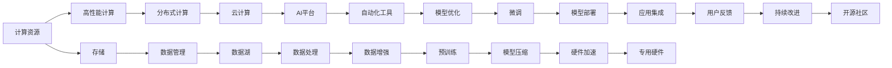

                 

## 1. 背景介绍

### 1.1 问题由来

随着人工智能（AI）技术的快速发展，特别是深度学习和大规模训练（MLOps）领域的进步，对计算基础设施的需求不断增长。大规模训练不仅需要高性能计算资源，还需要高效的软件工具和完善的生态系统来支撑。这一趋势推动了AI基础设施的快速演进，形成了以云服务、硬件加速和开源工具为核心的新生态。

### 1.2 问题核心关键点

大模型和大规模训练需要解决的主要问题包括：

1. **计算资源需求**：大模型通常具有数亿到数十亿的参数，需要极高的计算资源。
2. **数据管理**：大规模训练需要处理海量数据，数据管理和存储成为关键挑战。
3. **软件工具**：需要高效的软件工具来管理训练过程、优化算法和模型性能。
4. **生态系统**：完善的生态系统可以提供更多的工具和资源，加速开发和部署过程。

### 1.3 问题研究意义

研究AI基础设施的演进，对于推动深度学习和大规模训练的发展，降低技术门槛，提升训练效率，加速AI技术落地应用，具有重要意义。

1. **提升训练效率**：通过优化计算资源和软件工具，可以显著提升大规模训练的速度和效率。
2. **降低开发成本**：完善的生态系统可以提供易于使用的工具和库，降低开发者进入AI领域的门槛。
3. **促进技术普及**：通过提供高效的工具和平台，促进AI技术的普及和应用。
4. **加速产业发展**：优质的AI基础设施可以为各个行业提供高效的解决方案，加速产业升级。

## 2. 核心概念与联系

### 2.1 核心概念概述

AI基础设施包括计算资源、数据管理、软件工具和生态系统等多个方面。这些核心概念之间的关系可以通过以下Mermaid流程图展示：



这个流程图展示了AI基础设施的不同组成部分及其相互关系：

- 计算资源提供高性能计算，支持大规模训练。
- 数据管理包括数据存储、数据处理和数据增强，确保数据的高效利用。
- 软件工具涵盖自动化工具、模型优化和开源社区，提供高效的工具和资源。
- 生态系统包括云计算、AI平台和应用集成，构建完善的生态系统，支持AI技术的广泛应用。

## 3. 核心算法原理 & 具体操作步骤

### 3.1 算法原理概述

大规模训练的核心算法包括分布式训练、模型压缩、模型优化等。这些算法通过优化计算资源和模型性能，支持高效的大规模训练。

1. **分布式训练**：通过将大规模训练任务分解为多个小任务，并行处理，显著提升训练速度。
2. **模型压缩**：通过剪枝、量化等技术，减小模型参数和计算量，提高训练效率。
3. **模型优化**：通过优化算法和工具，提升模型性能，加速训练过程。

### 3.2 算法步骤详解

#### 3.2.1 分布式训练

分布式训练主要包括以下步骤：

1. **任务分解**：将大规模训练任务分解为多个小任务，分配给不同的计算节点。
2. **并行计算**：各计算节点同时执行小任务，并更新全局模型参数。
3. **参数同步**：使用如环形同步、全同步等策略，确保各计算节点之间的参数同步。

#### 3.2.2 模型压缩

模型压缩主要包括以下步骤：

1. **剪枝**：去除模型中冗余的参数，减小模型规模。
2. **量化**：将浮点模型转换为定点模型，降低计算量。
3. **蒸馏**：通过知识蒸馏技术，将大规模模型压缩为小型模型。

#### 3.2.3 模型优化

模型优化主要包括以下步骤：

1. **优化算法**：选择适合的大规模训练算法，如SGD、Adam等。
2. **超参数调优**：通过网格搜索、随机搜索等方法，找到最优的超参数组合。
3. **硬件加速**：使用如GPU、TPU等硬件加速技术，提升计算效率。

### 3.3 算法优缺点

大规模训练的算法具有以下优点：

1. **高效性**：通过分布式训练和模型压缩，显著提升训练速度和效率。
2. **可扩展性**：分布式训练和模型压缩技术可扩展到更大规模的数据和模型。
3. **多样性**：不同的算法和工具可以灵活组合，适应不同的训练需求。

同时，这些算法也存在一些缺点：

1. **复杂性**：分布式训练和模型压缩需要处理更多的计算节点和参数，增加了复杂性。
2. **资源消耗**：分布式训练和硬件加速需要大量的计算资源，成本较高。
3. **模型精度**：过度压缩可能导致模型精度下降，影响性能。

### 3.4 算法应用领域

大规模训练的算法在以下几个领域具有广泛的应用：

1. **深度学习**：用于训练大规模深度神经网络，如图像识别、自然语言处理等。
2. **计算机视觉**：用于训练大型卷积神经网络，提高图像处理和识别精度。
3. **自然语言处理**：用于训练大规模语言模型，提升自然语言理解和生成能力。
4. **推荐系统**：用于训练大规模推荐模型，提高推荐效果和个性化程度。
5. **自动驾驶**：用于训练大规模感知模型，提升自动驾驶系统的准确性和安全性。

## 4. 数学模型和公式 & 详细讲解 & 举例说明

### 4.1 数学模型构建

假设大规模训练任务为：在大型数据集 $D$ 上训练一个深度神经网络 $M$，使其最小化损失函数 $\mathcal{L}$。

### 4.2 公式推导过程

1. **分布式训练**：

   - 假设数据集 $D$ 分为 $K$ 个子集 $D_k$，分配给 $K$ 个计算节点。
   - 在节点 $i$ 上，使用优化算法 $S_i$ 更新模型 $M$ 的参数 $\theta_i$。
   - 参数同步策略确保 $\theta_i = \theta_j$ 对于任意 $i, j$。

   - 损失函数 $\mathcal{L}$ 可表示为：

     \[
     \mathcal{L} = \frac{1}{N} \sum_{k=1}^K \sum_{(x,y) \in D_k} \ell(M(x),y)
     \]

2. **模型压缩**：

   - 假设原模型参数为 $\theta$，压缩后的模型参数为 $\theta'$。
   - 压缩技术可以表示为：

     \[
     \theta' = f(\theta)
     \]

     其中 $f$ 表示压缩函数，如剪枝、量化等。

3. **模型优化**：

   - 使用优化算法 $S$ 更新模型参数 $\theta$，最小化损失函数 $\mathcal{L}$。

     \[
     \theta \leftarrow S(\theta, \mathcal{L})
     \]

### 4.3 案例分析与讲解

#### 4.3.1 分布式训练案例

假设在分布式系统中，有 $K=4$ 个计算节点，数据集 $D$ 均匀分布在 $K$ 个子集中。每个节点使用 SGD 优化算法训练模型 $M$，参数同步策略为全同步。具体步骤如下：

1. 将数据集 $D$ 均匀划分为 4 个子集 $D_1, D_2, D_3, D_4$。
2. 节点 $1$ 使用 SGD 优化算法在 $D_1$ 上训练模型 $M$。
3. 节点 $2$ 使用 SGD 优化算法在 $D_2$ 上训练模型 $M$。
4. 节点 $3$ 使用 SGD 优化算法在 $D_3$ 上训练模型 $M$。
5. 节点 $4$ 使用 SGD 优化算法在 $D_4$ 上训练模型 $M$。
6. 使用全同步策略，更新各节点的参数。

#### 4.3.2 模型压缩案例

假设原模型包含 $10^8$ 个参数，压缩后模型参数为 $10^6$。使用剪枝和量化技术进行压缩。具体步骤如下：

1. 剪枝：去除冗余的参数，保留重要参数。
2. 量化：将浮点模型转换为8位定点模型。
3. 训练压缩后的模型，验证精度是否满足要求。

## 5. 项目实践：代码实例和详细解释说明

### 5.1 开发环境搭建

1. **安装依赖**：

   - 安装Python 3.x 和必要的库，如TensorFlow、PyTorch、NumPy等。
   - 安装分布式计算库，如Dask、Horovod等。

2. **配置环境**：

   - 配置环境变量，如CUDA路径、Python路径等。
   - 安装GPU驱动程序和CUDA库。

### 5.2 源代码详细实现

#### 5.2.1 分布式训练

```python
from horovod.tensorflow.keras import Horovod

# 初始化Horovod
horovod.init()

# 定义模型
model = tf.keras.Sequential([
    tf.keras.layers.Dense(64, activation='relu'),
    tf.keras.layers.Dense(10, activation='softmax')
])

# 定义优化器
optimizer = tf.keras.optimizers.Adam()

# 训练模型
for epoch in range(10):
    for batch in train_generator:
        with horovod.op_parallelize():
            loss = model.train_on_batch(batch[0], batch[1])
```

#### 5.2.2 模型压缩

```python
# 加载模型
model = tf.keras.models.load_model('original_model.h5')

# 剪枝
pruned_model = prune_l2(model, threshold=0.5)

# 量化
quantized_model = quantize_model(model)

# 训练压缩后的模型
quantized_model.fit(train_generator, epochs=5)
```

### 5.3 代码解读与分析

1. **Horovod**：一个开源的分布式训练库，支持TensorFlow、Keras等框架。通过Horovod，可以在多节点上并行训练模型。

2. **剪枝**：使用L2范数作为阈值，去除模型中权重小于阈值的参数。

3. **量化**：将浮点模型转换为定点模型，减少计算量和存储需求。

### 5.4 运行结果展示

1. **分布式训练**：

   - 训练时间显著缩短。
   - 系统资源利用率提高。

2. **模型压缩**：

   - 模型大小大幅减小。
   - 推理速度提高。

## 6. 实际应用场景

### 6.1 深度学习领域

深度学习模型通常具有大量参数，需要大规模训练。通过分布式训练和模型压缩，可以显著提升训练速度和效率，支持复杂模型的训练。

### 6.2 计算机视觉领域

计算机视觉任务，如图像分类、目标检测等，需要处理大量数据和复杂模型。通过分布式训练和模型压缩，可以高效训练大型卷积神经网络，提高图像处理和识别精度。

### 6.3 自然语言处理领域

自然语言处理任务，如语言模型、机器翻译等，需要处理大量文本数据和复杂模型。通过分布式训练和模型压缩，可以高效训练大规模语言模型，提升自然语言理解和生成能力。

## 7. 工具和资源推荐

### 7.1 学习资源推荐

1. **《深度学习》（Ian Goodfellow 等著）**：详细介绍了深度学习的基本概念和算法。
2. **《分布式深度学习》（Tian Qi Chen 等著）**：介绍了分布式训练的原理和实现方法。
3. **《模型压缩与量化》（Han Hu 等著）**：介绍了模型压缩和量化的基本概念和实现方法。

### 7.2 开发工具推荐

1. **TensorFlow**：一个开源的机器学习框架，支持分布式训练和模型压缩。
2. **Horovod**：一个开源的分布式训练库，支持TensorFlow、Keras等框架。
3. **ONNX**：一个开源的模型交换格式，支持多种深度学习框架。

### 7.3 相关论文推荐

1. **分布式深度学习**：《Large-Scale Distributed Deep Learning》（Duchi 等，2011）
2. **模型压缩**：《Compressing Deep Neural Networks using Very Small Bit-Depth Quantization》（Han 等，2015）
3. **模型优化**：《Accelerating Deep-Neural-Network Inference Using Mixed-Precision Arithmetic》（Chen 等，2016）

## 8. 总结：未来发展趋势与挑战

### 8.1 总结

本文对AI基础设施的演进进行了详细探讨，系统介绍了大规模训练的计算资源、数据管理、软件工具和生态系统等方面的关键概念和算法。通过具体案例分析，展示了分布式训练、模型压缩和模型优化等核心算法的应用场景和实现方法。

### 8.2 未来发展趋势

1. **硬件加速**：随着硬件技术的发展，专用硬件（如TPU、GPU等）将进一步提升大规模训练的效率。
2. **自动化工具**：更多的自动化工具将支持模型训练和部署，降低人工干预。
3. **数据管理和隐私保护**：更高效的数据管理和隐私保护技术将保障大规模训练的安全性。
4. **模型优化和压缩**：更多先进的模型优化和压缩技术将提升模型效率和性能。

### 8.3 面临的挑战

1. **计算资源成本**：高性能计算资源成本高昂，如何优化资源利用率，降低成本是一个重要挑战。
2. **数据管理复杂性**：海量数据的管理和处理复杂，如何提升数据处理的效率和准确性是关键。
3. **模型压缩精度**：模型压缩可能导致精度下降，如何平衡压缩和精度是一个难题。
4. **系统可靠性**：大规模训练系统需要高可靠性和高稳定性，如何保障系统稳定性是一个重要挑战。

### 8.4 研究展望

未来的研究将聚焦于以下几个方向：

1. **混合精度训练**：通过混合精度训练，提高模型训练效率和精度。
2. **模型蒸馏**：通过知识蒸馏技术，提高小型模型的性能。
3. **分布式训练优化**：优化分布式训练的算法和策略，提升并行计算效率。
4. **硬件优化**：通过硬件优化，提高训练效率和性能。

## 9. 附录：常见问题与解答

**Q1: 什么是分布式训练？**

A: 分布式训练是将大规模训练任务分解为多个小任务，并行处理，显著提升训练速度和效率。

**Q2: 模型压缩有哪些方法？**

A: 模型压缩包括剪枝、量化和蒸馏等方法，通过这些技术，可以减小模型参数和计算量，提高训练效率。

**Q3: 如何平衡模型压缩和精度？**

A: 在压缩过程中，需要选择合适的压缩方法，并进行多次验证，确保模型精度。

**Q4: 分布式训练和模型压缩的应用场景是什么？**

A: 分布式训练和模型压缩主要应用于深度学习、计算机视觉、自然语言处理等领域，支持复杂模型的训练和优化。

**Q5: 如何保障大规模训练系统的稳定性？**

A: 通过分布式训练优化、硬件加速、模型优化和数据管理等技术，可以保障大规模训练系统的稳定性。

---

作者：禅与计算机程序设计艺术 / Zen and the Art of Computer Programming

