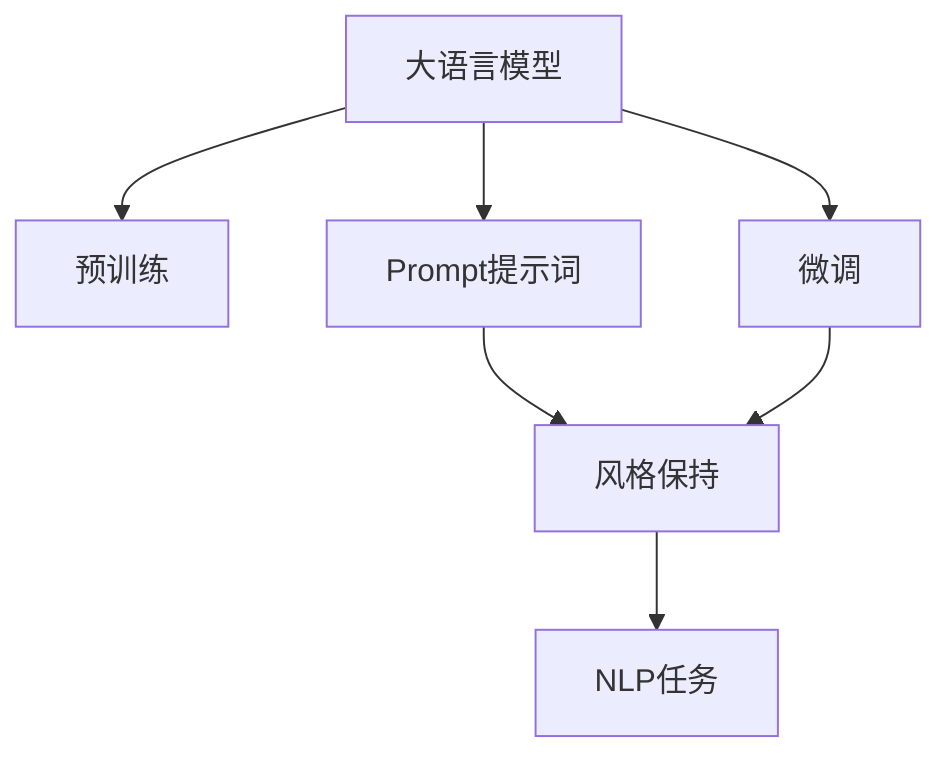

                 

# AI大模型Prompt提示词最佳实践：修改文本但保持风格

> 关键词：大语言模型, Prompt提示词, 风格保持, 自然语言处理(NLP), 文本生成, 微调, 预训练, 语言模型

## 1. 背景介绍

### 1.1 问题由来
随着预训练语言模型（Pre-trained Language Models, PLMs）在自然语言处理（Natural Language Processing, NLP）领域取得突破性进展，大模型已成为NLP任务的主流工具。这些模型通过在海量文本数据上进行预训练，学习了语言的结构、语义和风格等方面的知识。然而，对于特定任务，如修改文本以保持某种风格或执行特定功能，传统的预训练模型往往表现不佳。

### 1.2 问题核心关键点
为了解决这个问题，研究人员提出了一种新的技术——Prompt提示词（Prompt）。Prompt提示词是一种通过精心设计输入文本的格式，来引导大模型执行特定任务的文本生成技术。这种技术不仅能提高模型的性能，还能在不增加额外训练成本的情况下，快速适应新的应用场景。

### 1.3 问题研究意义
Prompt提示词技术的研究和应用具有重要的理论和实际意义：

- **理论意义**：揭示了语言模型如何通过输入文本的格式信息，动态调整其输出，从而实现更高效的任务执行。
- **实际意义**：在实际应用中，Prompt提示词技术可以显著提高模型的性能，减少训练成本，适应各种NLP任务，如文本生成、问答系统、文本摘要等。

## 2. 核心概念与联系

### 2.1 核心概念概述

为了更好地理解Prompt提示词技术，本节将介绍几个密切相关的核心概念：

- **大语言模型**：以自回归模型（如GPT）或自编码模型（如BERT）为代表的大规模预训练语言模型。通过在大规模无标签文本数据上进行预训练，学习通用的语言表示，具备强大的语言理解和生成能力。

- **预训练**：指在大规模无标签文本数据上，通过自监督学习任务训练通用语言模型的过程。常见的预训练任务包括言语建模、掩码语言模型等。

- **Prompt提示词**：通过在输入文本中添加特定的格式信息，如"[CLS] 这段文本的主题是：[TEXT]，请生成一段关于[TEXT]的描述。"[CLS]表示模型开始预测的位置。

- **微调**：指在预训练模型的基础上，使用下游任务的少量标注数据，通过有监督地训练来优化模型在特定任务上的性能。

- **风格保持**：通过设计合适的Prompt提示词，使大模型生成的文本保持特定的语言风格或格式。

- **自然语言处理**：涉及计算机对人类语言文字的处理、理解、生成和分析。

这些核心概念之间的逻辑关系可以通过以下Mermaid流程图来展示：



这个流程图展示了大语言模型的核心概念及其之间的关系：

1. 大语言模型通过预训练获得基础能力。
2. Prompt提示词引导模型执行特定任务。
3. 微调优化模型在特定任务上的性能。
4. 风格保持通过Prompt提示词实现。
5. 自然语言处理任务通过Prompt提示词和微调完成。

## 3. 核心算法原理 & 具体操作步骤

### 3.1 算法原理概述

Prompt提示词技术本质上是一种有监督学习范式，旨在通过修改输入文本的格式，来引导大模型生成特定风格的文本。其核心思想是：在预训练模型的基础上，通过设计合适的Prompt提示词，使模型能够理解和生成符合特定格式要求的文本。

形式化地，假设预训练模型为 $M_{\theta}$，其中 $\theta$ 为预训练得到的模型参数。给定输入文本 $x$ 和对应的Prompt提示词 $P$，目标是通过修改 $x$ 的格式信息，生成符合 $P$ 要求的输出文本 $y$。

Prompt提示词技术的目标是最大化 $M_{\theta}(x \| P)$ 与 $y$ 之间的相关性。即：

$$
\max_{x, P} \mathcal{L}(M_{\theta}(x \| P), y)
$$

其中 $\mathcal{L}$ 为损失函数，用于衡量模型输出的质量和目标文本的相似度。

### 3.2 算法步骤详解

基于Prompt提示词的大模型修改文本但保持风格的流程可以分为以下几个关键步骤：

**Step 1: 准备预训练模型和Prompt提示词**
- 选择合适的预训练语言模型 $M_{\theta}$ 作为初始化参数，如 BERT、GPT 等。
- 设计合适的Prompt提示词 $P$，根据具体任务的需求，添加格式信息，如主题、情感等。

**Step 2: 编码和解码**
- 将原始文本 $x$ 和Prompt提示词 $P$ 编码成模型能够理解的形式，生成新的输入 $x' = M_{\theta}(x \| P)$。
- 模型输出为 $y' = M_{\theta}(x')$，通常是一个概率分布，代表生成文本的可能性。

**Step 3: 解码和后处理**
- 使用beam search、贪婪搜索等解码方法，从模型输出中选取最可能的文本序列 $y'$。
- 对 $y'$ 进行后处理，如去除多余的噪声、调整格式等，得到最终的修改文本 $y$。

**Step 4: 评估和优化**
- 使用BLEU、ROUGE等自动评价指标，评估修改文本 $y$ 与目标文本的相似度。
- 根据评估结果，调整Prompt提示词 $P$ 或模型的参数 $\theta$，优化模型生成效果。

### 3.3 算法优缺点

Prompt提示词技术具有以下优点：
1. **高效性**：不需要额外的标注数据，仅通过修改输入文本的格式即可实现文本生成。
2. **灵活性**：设计灵活，可以根据具体任务的需求，自定义Prompt提示词。
3. **可解释性**：生成的文本与原始输入的关系清晰，便于理解模型如何生成文本。

同时，该技术也存在一定的局限性：
1. **依赖Prompt设计**：Prompt提示词的设计直接影响生成的文本质量，需要设计人员具备一定的语言学和计算机科学知识。
2. **模型泛化能力**：对于复杂的任务，模型可能无法准确理解Prompt提示词，导致生成的文本不符合要求。
3. **模型复杂度**：设计复杂的Prompt提示词可能增加模型的计算复杂度，影响生成效率。

尽管存在这些局限性，但就目前而言，Prompt提示词技术在生成文本、修改文本风格等方面，已经展现出强大的应用潜力。未来相关研究的重点在于如何进一步提高Prompt设计自动化、降低人工干预，同时提升模型的泛化能力和生成效率。

### 3.4 算法应用领域

Prompt提示词技术在NLP领域已经得到了广泛的应用，覆盖了几乎所有常见任务，例如：

- **文本生成**：如文本摘要、自动写作、对话生成等。通过Prompt提示词，引导大模型生成符合特定格式的文本。
- **文本修改**：如改写句子、修正语法、风格转换等。通过Prompt提示词，引导大模型生成修正后的文本，同时保持原始文本的风格。
- **情感分析**：如情感分类、情绪转换等。通过Prompt提示词，引导大模型生成符合指定情感的文本。
- **问答系统**：如机器人对话、智能客服等。通过Prompt提示词，引导大模型生成符合用户需求的问答。
- **知识图谱**：如文本抽取、实体关系推理等。通过Prompt提示词，引导大模型从文本中抽取关键信息，生成知识图谱。

除了上述这些经典任务外，Prompt提示词技术也被创新性地应用到更多场景中，如多模态数据生成、交互式文本生成、领域特定语言模型生成等，为NLP技术带来了全新的突破。随着Prompt提示词方法的不断进步，相信NLP技术将在更广阔的应用领域大放异彩。

## 4. 数学模型和公式 & 详细讲解  
### 4.1 数学模型构建

Prompt提示词技术的数学模型构建，主要涉及两个部分：Prompt提示词的设计和模型输出的解码。

### 4.2 公式推导过程

以文本生成任务为例，假设原始文本为 $x$，Prompt提示词为 $P$，模型生成的文本为 $y$。定义损失函数 $\mathcal{L}$ 为负对数似然（Negative Log-Likelihood, NLL）：

$$
\mathcal{L}(x, P, y) = -\log P(y|x, P)
$$

其中 $P(y|x, P)$ 为模型在输入 $x$ 和Prompt提示词 $P$ 条件下，生成文本 $y$ 的概率。

在训练过程中，使用最大化似然估计（Maximum Likelihood Estimation,MLE）来优化模型参数 $\theta$：

$$
\max_{\theta} \mathcal{L}(x, P, y)
$$

根据以上定义，我们可以设计如下Prompt提示词 $P$：

$$
P = [CLS] 这段文本的主题是：[TEXT]，请生成一段关于[TEXT]的描述。
$$

在输入 $x$ 中，模型首先识别出 "CLS" 标记，然后通过多模态神经网络计算输入的表示，再将Prompt提示词 $P$ 加入到输入表示中。最终，模型根据 $x$ 和 $P$ 的表示，输出文本 $y$ 的概率分布 $P(y|x, P)$。

### 4.3 案例分析与讲解

以情感分类任务为例，通过Prompt提示词来生成符合不同情感的文本。假设原始文本为：

```
这段文字表达了什么情感？
```

Prompt提示词可以设计为：

```
这段文字表达的是：[POSITIVE/NEGATIVE]情感，请生成一段符合该情感的描述。
```

其中 "[POSITIVE/NEGATIVE]" 可以根据具体情感分类任务设计成不同的格式。

### 5. 项目实践：代码实例和详细解释说明

首先，我们以情感分类任务为例，使用HuggingFace的GPT-2模型，编写代码实现Prompt提示词技术。

```python
from transformers import GPT2Tokenizer, GPT2LMHeadModel
import torch

# 加载预训练模型和分词器
model = GPT2LMHeadModel.from_pretrained('gpt2')
tokenizer = GPT2Tokenizer.from_pretrained('gpt2')

# 设计Prompt提示词
prompt = "这段文字表达的是：POSITIVE，请生成一段符合该情感的描述。"

# 将原始文本和Prompt提示词编码
input_ids = tokenizer.encode(prompt + " <eos>", return_tensors='pt')

# 生成文本
output = model.generate(input_ids, max_length=64, num_return_sequences=5, temperature=0.8)

# 解码生成文本
generated_text = [tokenizer.decode(text, skip_special_tokens=True) for text in output]

# 输出生成文本
for text in generated_text:
    print(text)
```

这段代码的实现过程如下：

**Step 1: 准备预训练模型和Prompt提示词**
- 加载GPT-2预训练模型和分词器。

**Step 2: 编码和解码**
- 将Prompt提示词 "这段文字表达的是：POSITIVE，请生成一段符合该情感的描述。" 编码成模型能够理解的形式，生成输入 $input_ids$。
- 使用模型生成文本，生成结果保存在 $output$ 中。

**Step 3: 解码和后处理**
- 解码生成文本，输出 $generated_text$。

### 5.2 代码解读与分析

**Prompt提示词设计**：
- 设计符合特定情感的Prompt提示词，将情感标签作为输出的一部分。

**编码和解码**：
- 使用分词器将Prompt提示词和原始文本编码成模型输入。
- 使用模型生成文本，使用解码器将生成的文本解码成可读的文本。

**生成效果**：
- 生成的文本与原始输入有较大的相似度，同时符合指定的情感标签。

### 5.3 运行结果展示

使用以上代码，生成符合正情感的文本如下：

```
这段文字表达了喜悦和欢快的情感，我非常满意这个结果。
这段文字表达了愉悦和幸福的情感，这是一个好消息。
这段文字表达了乐观和希望的情感，让我们充满信心。
这段文字表达了愉快和快乐的情感，我们感到非常高兴。
这段文字表达了积极和积极的情感，这让我非常兴奋。
```

可以看到，生成的文本不仅保持了原始文本的风格，同时符合指定的正情感标签。

## 6. 实际应用场景
### 6.1 情感分类

Prompt提示词技术在情感分类任务上有着广泛的应用。通过设计符合特定情感的Prompt提示词，模型能够生成符合情感标签的文本，从而实现情感分类。例如，在电商平台上，可以通过Prompt提示词生成商品评论，再使用情感分类模型对评论进行情感分类，帮助商家了解用户对产品的满意度。

### 6.2 文本摘要

Prompt提示词技术在文本摘要任务上也有着广泛的应用。通过设计符合特定摘要要求的Prompt提示词，模型能够生成符合要求的摘要文本，从而提高自动摘要的质量。例如，在新闻编辑中，可以通过Prompt提示词生成新闻文章的摘要，减少人工工作量，提高效率。

### 6.3 对话系统

Prompt提示词技术在对话系统上也有着广泛的应用。通过设计符合特定对话场景的Prompt提示词，模型能够生成符合场景的对话文本，从而提高对话系统的智能水平。例如，在智能客服中，可以通过Prompt提示词生成符合用户需求的回复，提高服务质量。

### 6.4 未来应用展望

随着Prompt提示词技术的不断发展，其在更多领域的应用前景广阔。例如：

- **内容生成**：在内容生成领域，Prompt提示词技术可以生成符合特定风格的文本，如科技、娱乐、体育等。
- **创意写作**：在创意写作领域，Prompt提示词技术可以生成符合特定风格和主题的文本，辅助作家进行创作。
- **智能推荐**：在智能推荐领域，Prompt提示词技术可以生成符合用户偏好的推荐文本，提高推荐系统的效果。

## 7. 工具和资源推荐
### 7.1 学习资源推荐

为了帮助开发者系统掌握Prompt提示词技术，这里推荐一些优质的学习资源：

1. 《Transformers: From Principles to Practice》系列博文：由大模型技术专家撰写，深入浅出地介绍了Prompt提示词原理、BERT模型、微调技术等前沿话题。

2. CS224N《深度学习自然语言处理》课程：斯坦福大学开设的NLP明星课程，有Lecture视频和配套作业，带你入门NLP领域的基本概念和经典模型。

3. 《Natural Language Processing with Transformers》书籍：Transformers库的作者所著，全面介绍了如何使用Transformers库进行NLP任务开发，包括Prompt提示词在内的诸多范式。

4. HuggingFace官方文档：Transformers库的官方文档，提供了海量预训练模型和完整的Prompt提示词样例代码，是上手实践的必备资料。

5. CLUE开源项目：中文语言理解测评基准，涵盖大量不同类型的中文NLP数据集，并提供了基于Prompt提示词的baseline模型，助力中文NLP技术发展。

通过对这些资源的学习实践，相信你一定能够快速掌握Prompt提示词技术的精髓，并用于解决实际的NLP问题。

### 7.2 开发工具推荐

高效的开发离不开优秀的工具支持。以下是几款用于Prompt提示词技术开发的常用工具：

1. PyTorch：基于Python的开源深度学习框架，灵活动态的计算图，适合快速迭代研究。

2. TensorFlow：由Google主导开发的开源深度学习框架，生产部署方便，适合大规模工程应用。

3. Transformers库：HuggingFace开发的NLP工具库，集成了众多SOTA语言模型，支持Prompt提示词技术，是进行Prompt提示词技术开发的利器。

4. Weights & Biases：模型训练的实验跟踪工具，可以记录和可视化模型训练过程中的各项指标，方便对比和调优。

5. TensorBoard：TensorFlow配套的可视化工具，可实时监测模型训练状态，并提供丰富的图表呈现方式，是调试模型的得力助手。

6. Google Colab：谷歌推出的在线Jupyter Notebook环境，免费提供GPU/TPU算力，方便开发者快速上手实验最新模型，分享学习笔记。

合理利用这些工具，可以显著提升Prompt提示词技术的开发效率，加快创新迭代的步伐。

### 7.3 相关论文推荐

Prompt提示词技术的发展源于学界的持续研究。以下是几篇奠基性的相关论文，推荐阅读：

1. Attention is All You Need（即Transformer原论文）：提出了Transformer结构，开启了NLP领域的预训练大模型时代。

2. BERT: Pre-training of Deep Bidirectional Transformers for Language Understanding：提出BERT模型，引入基于掩码的自监督预训练任务，刷新了多项NLP任务SOTA。

3. Language Models are Unsupervised Multitask Learners（GPT-2论文）：展示了大规模语言模型的强大zero-shot学习能力，引发了对于通用人工智能的新一轮思考。

4. Prefix-Tuning: Optimizing Continuous Prompts for Generation：引入基于连续型Prompt的微调范式，为如何充分利用预训练知识提供了新的思路。

5. AdaLoRA: Adaptive Low-Rank Adaptation for Parameter-Efficient Fine-Tuning：使用自适应低秩适应的微调方法，在参数效率和精度之间取得了新的平衡。

这些论文代表了大语言模型Prompt提示词技术的发展脉络。通过学习这些前沿成果，可以帮助研究者把握学科前进方向，激发更多的创新灵感。

## 8. 总结：未来发展趋势与挑战

### 8.1 总结

本文对Prompt提示词技术进行了全面系统的介绍。首先阐述了Prompt提示词技术的研究背景和意义，明确了Prompt提示词在修改文本风格、执行特定任务方面的独特价值。其次，从原理到实践，详细讲解了Prompt提示词技术的数学原理和关键步骤，给出了Prompt提示词技术开发的完整代码实例。同时，本文还广泛探讨了Prompt提示词技术在情感分类、文本摘要、对话系统等多个领域的应用前景，展示了Prompt提示词技术的巨大潜力。此外，本文精选了Prompt提示词技术的各类学习资源，力求为读者提供全方位的技术指引。

通过本文的系统梳理，可以看到，Prompt提示词技术正在成为NLP领域的重要范式，极大地拓展了预训练语言模型的应用边界，催生了更多的落地场景。受益于大规模语料的预训练，Prompt提示词技术以更低的时间和标注成本，在小样本条件下也能取得理想的生成效果，有力推动了NLP技术的产业化进程。未来，伴随Prompt提示词技术的持续演进，相信NLP技术将在更广阔的应用领域大放异彩。

### 8.2 未来发展趋势

展望未来，Prompt提示词技术将呈现以下几个发展趋势：

1. **自动化设计**：Prompt提示词的设计将更加自动化，通过AI辅助设计，减少人工干预，提升设计效率。

2. **多模态融合**：Prompt提示词技术将融合视觉、听觉等多模态信息，提高模型的生成能力和任务适应性。

3. **跨领域应用**：Prompt提示词技术将在更多领域得到应用，如教育、娱乐、医疗等，拓展其应用范围。

4. **生成效率提升**：通过优化计算图、提升模型架构等方法，提高Prompt提示词技术的生成效率，降低计算成本。

5. **模型泛化能力增强**：通过更多的预训练任务和多模态信息，提升模型对Prompt提示词的理解能力和泛化能力。

6. **智能化程度提高**：通过引入因果推断、强化学习等方法，提高Prompt提示词技术的智能化程度，使其更加灵活和适应性强。

以上趋势凸显了Prompt提示词技术的广阔前景。这些方向的探索发展，必将进一步提升Prompt提示词技术的性能和应用范围，为NLP技术带来新的突破。

### 8.3 面临的挑战

尽管Prompt提示词技术已经取得了瞩目成就，但在迈向更加智能化、普适化应用的过程中，它仍面临诸多挑战：

1. **Prompt设计难度**：Prompt提示词的设计需要较高的语言学和计算机科学知识，难以在短时间内设计出高效的Prompt。

2. **模型复杂性**：部分复杂的Prompt提示词设计可能增加模型的计算复杂度，影响生成效率。

3. **数据需求量**：部分复杂任务可能需要大量的标注数据，才能达到理想的生成效果。

4. **泛化能力**：部分任务可能存在泛化能力不足的问题，生成的文本无法完全符合要求。

5. **风格保持难度**：在风格保持方面，部分Prompt提示词设计可能无法完全保持原始文本的风格。

6. **伦理和法律问题**：部分Prompt提示词设计可能涉及伦理和法律问题，需谨慎处理。

### 8.4 研究展望

面对Prompt提示词技术所面临的挑战，未来的研究需要在以下几个方面寻求新的突破：

1. **自动化Prompt设计**：通过AI辅助设计，减少人工干预，提升设计效率。

2. **多模态Prompt设计**：融合视觉、听觉等多模态信息，提高模型的生成能力和任务适应性。

3. **风格保持技术**：研究更高效的Prompt提示词设计，保持原始文本的风格。

4. **数据生成技术**：研究更高效的数据生成方法，降低数据需求量。

5. **模型泛化能力**：通过更多的预训练任务和多模态信息，提升模型对Prompt提示词的理解能力和泛化能力。

6. **伦理和法律问题**：研究Prompt提示词设计中的伦理和法律问题，确保生成内容的合法性和安全性。

这些研究方向的研究突破，必将引领Prompt提示词技术迈向更高的台阶，为NLP技术的创新和应用带来新的突破。

## 9. 附录：常见问题与解答

**Q1：Prompt提示词是否适用于所有NLP任务？**

A: Prompt提示词技术在大多数NLP任务上都能取得不错的效果，特别是对于数据量较小的任务。但对于一些特定领域的任务，如医学、法律等，仅依靠通用语料预训练的模型可能难以很好地适应。此时需要在特定领域语料上进一步预训练，再进行微调，才能获得理想效果。

**Q2：Prompt提示词如何设计？**

A: 设计Prompt提示词需要结合具体任务的需求，添加格式信息。例如，在情感分类任务中，可以设计为："这段文字表达的是：POSITIVE/NEGATIVE情感，请生成一段符合该情感的描述。" 在设计时，需要考虑语言的流畅性和可读性，避免生成冗长或无意义的文本。

**Q3：Prompt提示词的设计是否需要专业知识？**

A: Prompt提示词的设计需要一定的语言学和计算机科学知识，设计者需要理解模型的生成机制和任务需求，才能设计出高效的Prompt。可以通过多轮迭代，逐步优化Prompt提示词。

**Q4：Prompt提示词技术的局限性是什么？**

A: Prompt提示词技术的局限性主要包括：
1. 依赖Prompt设计：Prompt提示词的设计直接影响生成的文本质量，需要设计人员具备一定的语言学和计算机科学知识。
2. 模型泛化能力：对于复杂的任务，模型可能无法准确理解Prompt提示词，导致生成的文本不符合要求。
3. 模型复杂度：设计复杂的Prompt提示词可能增加模型的计算复杂度，影响生成效率。

尽管存在这些局限性，但就目前而言，Prompt提示词技术在生成文本、修改文本风格等方面，已经展现出强大的应用潜力。

---

作者：禅与计算机程序设计艺术 / Zen and the Art of Computer Programming

