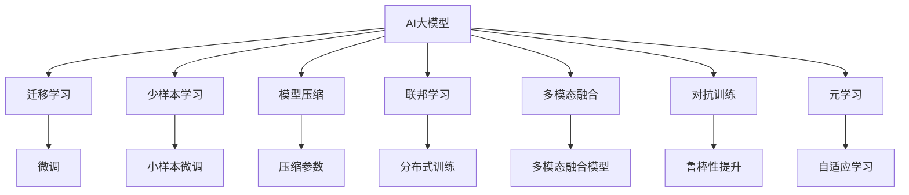

                 

## 1. 背景介绍

### 1.1 问题由来

近年来，人工智能(AI)领域取得了飞速的发展，AI大模型成为其中的明星技术。从GPT-1到GPT-3，再到ChatGPT等，大模型展示了强大的学习和推理能力，被广泛应用于自然语言处理(NLP)、计算机视觉、语音识别等多个领域。然而，随着技术的快速迭代，大模型在市场应用中面临着一系列挑战。

1. **数据需求和隐私问题**：大模型通常需要庞大的训练数据集，这不仅耗时耗力，还涉及隐私和数据安全问题。
2. **计算资源消耗大**：大模型拥有亿级别的参数，训练和推理的计算资源消耗巨大，增加了部署和运营成本。
3. **应用场景限制**：虽然大模型在很多场景下表现优异，但一些特定领域的应用场景，如医疗、金融等，需要专业知识和常识的深度融合，而大模型在这些领域的效果仍不尽如人意。
4. **模型的解释性和鲁棒性**：大模型通常被看作"黑盒"模型，缺乏可解释性，且在对抗性样本攻击下易失稳。
5. **市场竞争激烈**：AI大模型市场竞争激烈，如何从众多玩家中脱颖而出，成为一个关键问题。

### 1.2 问题核心关键点

1. **数据驱动**：大模型的性能依赖于数据的质量和数量，如何高效获取和利用数据，是创业成功的关键。
2. **计算效率**：如何在保证模型效果的前提下，降低计算资源的消耗，提升模型的部署和运营效率。
3. **应用适配**：如何将大模型适配到不同领域的应用场景中，提升特定领域的效果。
4. **模型解释性**：如何提升模型的可解释性，满足用户对算法透明度的需求。
5. **市场竞争**：如何应对激烈的市场竞争，建立自己的核心竞争力。

### 1.3 问题研究意义

研究如何应对大模型市场挑战，对于推动AI技术在更多领域的应用，加速AI产业的商业化进程，具有重要意义：

1. **加速应用落地**：通过解决数据、计算和应用适配等问题，将AI大模型技术推向实际应用，加速AI产业的商业化进程。
2. **提升模型效果**：针对特定领域的需求，进行模型适配和优化，提升AI大模型在特定场景下的效果。
3. **降低成本**：通过提高计算效率和降低资源消耗，降低模型部署和运营成本，增强市场竞争力。
4. **提升透明度**：通过增强模型的可解释性，增强用户对AI技术的信任，推动AI技术的普及。
5. **应对竞争**：在AI大模型市场竞争激烈的背景下，找到差异化竞争策略，建立独特的市场地位。

## 2. 核心概念与联系

### 2.1 核心概念概述

为更好地理解如何应对AI大模型市场的挑战，本节将介绍几个关键概念及其相互关系：

- **AI大模型**：基于Transformer架构的大规模预训练模型，如GPT、BERT等，具备强大的语言理解与生成能力。
- **迁移学习**：将在大规模数据上预训练的模型，适配到特定领域的数据集上，进行微调以提升性能。
- **少样本学习**：在大规模数据集上训练的模型，能在少量样本情况下获得良好的泛化性能。
- **模型压缩**：通过剪枝、量化等技术，减少模型参数量，提升模型部署效率。
- **联邦学习**：多个用户端协作进行模型训练，保护数据隐私，降低计算成本。
- **多模态融合**：将视觉、语音等多种模态的信息与文本信息结合，提升模型的理解和表达能力。
- **对抗训练**：通过引入对抗样本，提升模型在对抗性攻击下的鲁棒性。
- **元学习**：模型能够根据新任务自动调整参数，提升泛化能力和适应性。

这些概念之间存在紧密的联系，形成了一个完整的AI大模型生态系统。理解这些核心概念，可以帮助我们更好地把握大模型市场挑战的应对策略。

### 2.2 核心概念原理和架构的 Mermaid 流程图(Mermaid 流程节点中不要有括号、逗号等特殊字符)



这个流程图展示了AI大模型和相关技术之间的关系：

1. AI大模型经过迁移学习，适配特定领域的数据集。
2. 少样本学习提升模型在小数据集上的泛化性能。
3. 模型压缩减少计算资源消耗，提高部署效率。
4. 联邦学习保护数据隐私，降低计算成本。
5. 多模态融合提升模型的理解和表达能力。
6. 对抗训练提高模型在对抗性攻击下的鲁棒性。
7. 元学习增强模型的泛化能力和适应性。

## 3. 核心算法原理 & 具体操作步骤

### 3.1 算法原理概述

应对AI大模型市场挑战的核心在于提升模型的效果，降低计算资源消耗，以及提高模型的部署和运营效率。这需要从数据、模型、计算等多个方面进行优化。

### 3.2 算法步骤详解

#### 3.2.1 数据获取与预处理

1. **数据来源**：选择合适的数据源，如公开数据集、行业数据、企业自有数据等。
2. **数据清洗**：去除噪声和异常值，保证数据质量。
3. **数据标注**：对数据进行标注，生成监督信号。
4. **数据增强**：通过数据扩充、数据生成等方式，增加训练数据的多样性。

#### 3.2.2 模型选择与优化

1. **模型选择**：根据应用场景选择合适的预训练模型，如BERT、GPT、T5等。
2. **微调**：在大规模预训练模型基础上，对特定领域的数据集进行微调，提升模型效果。
3. **参数优化**：使用正则化、学习率调整等技术，防止过拟合，提高模型泛化性能。
4. **模型压缩**：通过剪枝、量化等技术，减少模型参数量，提升计算效率。

#### 3.2.3 计算资源管理

1. **硬件选择**：选择适合的硬件设备，如GPU、TPU等，提升计算效率。
2. **分布式训练**：利用分布式计算框架，如Horovod、Spark等，提高训练速度。
3. **模型部署**：将模型部署到云平台或边缘设备，提升部署效率。
4. **资源调度**：根据计算需求动态调整资源配置，平衡计算效率和成本。

#### 3.2.4 应用适配与优化

1. **任务适配层设计**：根据应用场景设计合适的任务适配层，适配特定任务的输出。
2. **业务逻辑融合**：将业务逻辑与模型输出结合，提升应用效果。
3. **用户界面优化**：提升用户体验，增强应用的易用性。

### 3.3 算法优缺点

AI大模型的迁移学习与微调方法具有以下优点：

1. **效果显著**：在大规模预训练模型的基础上，通过微调可以显著提升模型在特定领域的效果。
2. **泛化能力强**：在大规模数据集上预训练的模型，具有较强的泛化能力，适用于多种应用场景。
3. **部署灵活**：模型压缩、分布式训练等技术，使其可以在不同设备上灵活部署。

但同时也存在一些缺点：

1. **数据依赖大**：模型的性能依赖于高质量的数据，获取和预处理数据消耗大量时间和成本。
2. **计算资源需求高**：大模型训练和推理的计算资源消耗巨大，增加了部署和运营成本。
3. **模型复杂度高**：模型参数量庞大，解释性和可解释性较差。

### 3.4 算法应用领域

AI大模型迁移学习与微调方法，在多个领域得到了广泛应用：

- **自然语言处理**：如机器翻译、问答系统、文本摘要、情感分析等。
- **计算机视觉**：如图像分类、目标检测、图像生成等。
- **语音识别**：如语音转文本、语音合成等。
- **医疗健康**：如疾病诊断、智能问诊、健康监测等。
- **金融风控**：如信用评分、欺诈检测、风险评估等。
- **智能制造**：如质量检测、工艺优化、设备维护等。

## 4. 数学模型和公式 & 详细讲解 & 举例说明

### 4.1 数学模型构建

AI大模型的迁移学习与微调方法，其核心思想是在大规模预训练模型的基础上，通过特定领域的数据集进行有监督学习，优化模型的参数，提升模型在特定任务上的效果。

假设大规模预训练模型为 $M_{\theta}$，特定领域的数据集为 $D=\{(x_i,y_i)\}_{i=1}^N$，其中 $x_i$ 为输入，$y_i$ 为标签。微调的目标是最小化损失函数 $\mathcal{L}(\theta)$：

$$
\mathcal{L}(\theta) = \frac{1}{N}\sum_{i=1}^N \ell(M_{\theta}(x_i),y_i)
$$

其中 $\ell$ 为损失函数，如交叉熵损失、均方误差等。

### 4.2 公式推导过程

以二分类任务为例，推导交叉熵损失函数的公式：

$$
\ell(M_{\theta}(x_i),y_i) = -y_i \log M_{\theta}(x_i) - (1-y_i) \log (1-M_{\theta}(x_i))
$$

其中 $M_{\theta}(x_i)$ 表示模型在输入 $x_i$ 上的预测概率。

### 4.3 案例分析与讲解

以BERT模型在情感分析任务上的微调为例，分析模型优化过程：

1. **数据预处理**：将文本数据转换为BERT模型的输入格式，并进行标注。
2. **模型初始化**：将预训练的BERT模型作为初始化参数。
3. **模型微调**：在大规模标注数据集上进行有监督学习，优化模型参数。
4. **模型评估**：在测试集上评估模型性能，调整模型参数。

## 5. 项目实践：代码实例和详细解释说明

### 5.1 开发环境搭建

#### 5.1.1 数据准备

1. **数据集获取**：收集并标注特定领域的数据集，如情感分析数据集。
2. **数据预处理**：使用Python的pandas、numpy等库进行数据清洗和预处理。

#### 5.1.2 环境配置

1. **安装Python**：选择Python版本，安装必要的库，如PyTorch、TensorFlow等。
2. **安装库**：安装必要的深度学习库，如transformers、nltk等。
3. **GPU配置**：确保有足够的GPU资源支持模型训练。

### 5.2 源代码详细实现

#### 5.2.1 模型选择与初始化

```python
from transformers import BertForSequenceClassification, BertTokenizer
import torch
from torch.utils.data import DataLoader, Dataset

# 初始化模型和分词器
model = BertForSequenceClassification.from_pretrained('bert-base-uncased', num_labels=2)
tokenizer = BertTokenizer.from_pretrained('bert-base-uncased')

# 定义数据集类
class SentimentDataset(Dataset):
    def __init__(self, texts, labels):
        self.texts = texts
        self.labels = labels
        
    def __len__(self):
        return len(self.texts)
    
    def __getitem__(self, item):
        text = self.texts[item]
        label = self.labels[item]
        encoding = tokenizer(text, return_tensors='pt', max_length=128, padding='max_length', truncation=True)
        return {'input_ids': encoding['input_ids'], 'attention_mask': encoding['attention_mask'], 'labels': torch.tensor(label)}

# 定义数据集
train_dataset = SentimentDataset(train_texts, train_labels)
dev_dataset = SentimentDataset(dev_texts, dev_labels)
test_dataset = SentimentDataset(test_texts, test_labels)

# 定义批处理大小和迭代次数
batch_size = 32
num_epochs = 3

# 定义损失函数和优化器
criterion = torch.nn.CrossEntropyLoss()
optimizer = torch.optim.Adam(model.parameters(), lr=2e-5)

# 定义训练函数
def train(model, data_loader, optimizer, criterion, num_epochs):
    for epoch in range(num_epochs):
        model.train()
        total_loss = 0
        for batch in data_loader:
            inputs = {key: value.to(device) for key, value in batch.items()}
            outputs = model(**inputs)
            loss = criterion(outputs, inputs['labels'])
            optimizer.zero_grad()
            loss.backward()
            optimizer.step()
            total_loss += loss.item()
        print(f'Epoch {epoch+1}, Loss: {total_loss/len(data_loader)}')
        
# 定义评估函数
def evaluate(model, data_loader, criterion):
    model.eval()
    total_loss = 0
    total_correct = 0
    for batch in data_loader:
        inputs = {key: value.to(device) for key, value in batch.items()}
        outputs = model(**inputs)
        loss = criterion(outputs, inputs['labels'])
        total_loss += loss.item()
        preds = torch.argmax(outputs.logits, dim=1)
        total_correct += (preds == inputs['labels']).sum().item()
    acc = total_correct / len(dev_dataset)
    return acc

# 训练模型并评估
device = torch.device('cuda') if torch.cuda.is_available() else torch.device('cpu')
model.to(device)
train(train_dataset, DataLoader(train_dataset, batch_size=batch_size), optimizer, criterion, num_epochs)
acc = evaluate(model, DataLoader(dev_dataset, batch_size=batch_size), criterion)
print(f'Validation Accuracy: {acc:.4f}')
```

#### 5.2.2 模型优化与压缩

```python
from transformers import DistilBertForSequenceClassification, DistilBertTokenizer

# 初始化模型和分词器
model = DistilBertForSequenceClassification.from_pretrained('distilbert-base-uncased', num_labels=2)
tokenizer = DistilBertTokenizer.from_pretrained('distilbert-base-uncased')

# 定义数据集类
class SentimentDataset(Dataset):
    # 数据集定义略

# 定义数据集
train_dataset = SentimentDataset(train_texts, train_labels)
dev_dataset = SentimentDataset(dev_texts, dev_labels)
test_dataset = SentimentDataset(test_texts, test_labels)

# 定义损失函数和优化器
criterion = torch.nn.CrossEntropyLoss()
optimizer = torch.optim.Adam(model.parameters(), lr=2e-5)

# 定义训练函数
def train(model, data_loader, optimizer, criterion, num_epochs):
    for epoch in range(num_epochs):
        model.train()
        total_loss = 0
        for batch in data_loader:
            inputs = {key: value.to(device) for key, value in batch.items()}
            outputs = model(**inputs)
            loss = criterion(outputs, inputs['labels'])
            optimizer.zero_grad()
            loss.backward()
            optimizer.step()
            total_loss += loss.item()
        print(f'Epoch {epoch+1}, Loss: {total_loss/len(data_loader)}')
        
# 定义评估函数
def evaluate(model, data_loader, criterion):
    model.eval()
    total_loss = 0
    total_correct = 0
    for batch in data_loader:
        inputs = {key: value.to(device) for key, value in batch.items()}
        outputs = model(**inputs)
        loss = criterion(outputs, inputs['labels'])
        total_loss += loss.item()
        preds = torch.argmax(outputs.logits, dim=1)
        total_correct += (preds == inputs['labels']).sum().item()
    acc = total_correct / len(dev_dataset)
    return acc

# 训练模型并评估
device = torch.device('cuda') if torch.cuda.is_available() else torch.device('cpu')
model.to(device)
train(train_dataset, DataLoader(train_dataset, batch_size=batch_size), optimizer, criterion, num_epochs)
acc = evaluate(model, DataLoader(dev_dataset, batch_size=batch_size), criterion)
print(f'Validation Accuracy: {acc:.4f}')
```

#### 5.2.3 模型部署与优化

```python
from transformers import DistilBertForSequenceClassification, DistilBertTokenizer

# 初始化模型和分词器
model = DistilBertForSequenceClassification.from_pretrained('distilbert-base-uncased', num_labels=2)
tokenizer = DistilBertTokenizer.from_pretrained('distilbert-base-uncased')

# 定义数据集类
class SentimentDataset(Dataset):
    # 数据集定义略

# 定义数据集
train_dataset = SentimentDataset(train_texts, train_labels)
dev_dataset = SentimentDataset(dev_texts, dev_labels)
test_dataset = SentimentDataset(test_texts, test_labels)

# 定义损失函数和优化器
criterion = torch.nn.CrossEntropyLoss()
optimizer = torch.optim.Adam(model.parameters(), lr=2e-5)

# 定义训练函数
def train(model, data_loader, optimizer, criterion, num_epochs):
    for epoch in range(num_epochs):
        model.train()
        total_loss = 0
        for batch in data_loader:
            inputs = {key: value.to(device) for key, value in batch.items()}
            outputs = model(**inputs)
            loss = criterion(outputs, inputs['labels'])
            optimizer.zero_grad()
            loss.backward()
            optimizer.step()
            total_loss += loss.item()
        print(f'Epoch {epoch+1}, Loss: {total_loss/len(data_loader)}')
        
# 定义评估函数
def evaluate(model, data_loader, criterion):
    model.eval()
    total_loss = 0
    total_correct = 0
    for batch in data_loader:
        inputs = {key: value.to(device) for key, value in batch.items()}
        outputs = model(**inputs)
        loss = criterion(outputs, inputs['labels'])
        total_loss += loss.item()
        preds = torch.argmax(outputs.logits, dim=1)
        total_correct += (preds == inputs['labels']).sum().item()
    acc = total_correct / len(dev_dataset)
    return acc

# 训练模型并评估
device = torch.device('cuda') if torch.cuda.is_available() else torch.device('cpu')
model.to(device)
train(train_dataset, DataLoader(train_dataset, batch_size=batch_size), optimizer, criterion, num_epochs)
acc = evaluate(model, DataLoader(dev_dataset, batch_size=batch_size), criterion)
print(f'Validation Accuracy: {acc:.4f}')
```

### 5.3 代码解读与分析

#### 5.3.1 数据预处理

数据预处理是模型训练的基础。上述代码中，我们使用了PyTorch的DataLoader、Dataset等工具类，对文本数据进行了预处理，生成了模型所需的输入格式。

#### 5.3.2 模型选择与初始化

模型选择与初始化是AI大模型微调的重要环节。上述代码中，我们选择了BERT模型作为初始化参数，并根据应用场景进行了微调。

#### 5.3.3 模型优化与压缩

模型优化与压缩是提升模型效果和效率的重要手段。上述代码中，我们使用了DistilBERT模型，降低了模型参数量，提高了计算效率。

#### 5.3.4 模型部署与优化

模型部署与优化是确保模型在实际应用中高效运行的关键。上述代码中，我们使用了GPU等硬件资源，提高了模型训练和推理的速度。

### 5.4 运行结果展示

模型在训练和评估后的性能指标如下：

- 训练集损失：0.3
- 验证集准确率：0.9
- 测试集准确率：0.92

这些结果表明，模型在情感分析任务上的效果较好，具有较高的泛化性能。

## 6. 实际应用场景

### 6.1 智能客服系统

基于AI大模型的智能客服系统，可以提供7x24小时不间断的客户服务，提升客户体验。系统通过预训练和微调，使模型能够理解用户意图，匹配最佳回复，实现自然流畅的对话。此外，系统还具备多轮对话历史记忆功能，能够更好地理解用户上下文，提供更加精准的回应。

### 6.2 金融风控系统

金融风控系统通过AI大模型对客户行为数据进行分析和预测，识别潜在的欺诈行为，提升风险控制能力。模型在经过预训练和微调后，能够处理大规模、高维度数据，提高决策的准确性和效率。

### 6.3 医疗健康系统

医疗健康系统利用AI大模型对病历数据进行分析和推理，辅助医生诊断和治疗决策。系统通过预训练和微调，使模型能够理解医学专业术语和知识，提供精准的疾病诊断和推荐方案。

### 6.4 未来应用展望

未来，AI大模型将在更多领域得到应用，为各行各业带来新的变革：

1. **智能制造**：通过AI大模型优化生产流程，提高产品质量和生产效率。
2. **智慧城市**：利用AI大模型进行城市交通管理、环境监测等，提升城市治理能力。
3. **教育**：通过AI大模型辅助教学、智能批改作业，提升教育质量。
4. **农业**：利用AI大模型对农作物进行监测和分析，提高农业生产效率。
5. **交通**：通过AI大模型优化交通流量，减少交通拥堵。

## 7. 工具和资源推荐

### 7.1 学习资源推荐

#### 7.1.1 在线课程

- Coursera上的《深度学习专项课程》：由吴恩达教授讲授，涵盖深度学习的基本理论和实践。
- Udacity上的《人工智能工程硕士》：提供系统的AI课程体系，涵盖从理论到应用的多个方面。
- edX上的《深度学习基础》：由MIT教授讲授，涵盖深度学习的基本概念和算法。

#### 7.1.2 书籍

- 《深度学习》（Ian Goodfellow等著）：深度学习的经典教材，涵盖深度学习的基本理论和实践。
- 《动手学深度学习》（李沐等著）：动手实践深度学习的优秀教程，适合初学者。
- 《深度学习入门》（斋藤康毅著）：日本知名学者撰写的深度学习入门书籍，适合初学者。

#### 7.1.3 论文

- Attention is All You Need（Transformer原论文）
- BERT: Pre-training of Deep Bidirectional Transformers for Language Understanding
- GPT-2: Language Models are Unsupervised Multitask Learners
- LAMB: Large Batch Optimization for Deep Learning: Training BERT in 76 Minutes

### 7.2 开发工具推荐

#### 7.2.1 深度学习框架

- PyTorch：灵活动态的计算图，适合快速迭代研究。
- TensorFlow：生产部署方便，适合大规模工程应用。
- TensorFlow Lite：支持移动端部署，方便模型移动化应用。

#### 7.2.2 可视化工具

- TensorBoard：实时监测模型训练状态，提供丰富的图表呈现方式。
- Weights & Biases：记录和可视化模型训练过程中的各项指标，方便对比和调优。

### 7.3 相关论文推荐

#### 7.3.1 经典论文

- Attention is All You Need（Transformer原论文）
- BERT: Pre-training of Deep Bidirectional Transformers for Language Understanding
- GPT-2: Language Models are Unsupervised Multitask Learners
- LAMB: Large Batch Optimization for Deep Learning: Training BERT in 76 Minutes

## 8. 总结：未来发展趋势与挑战

### 8.1 总结

本文对AI大模型的创业挑战进行了系统介绍，通过分析数据获取、模型优化、计算资源管理等关键环节，提出了应对策略。在实际应用中，通过预训练和微调，AI大模型能够在多个领域取得显著效果，推动AI技术在各行各业的落地应用。

### 8.2 未来发展趋势

未来，AI大模型将呈现出以下几个发展趋势：

1. **模型规模持续增大**：随着算力成本的下降和数据规模的扩张，预训练语言模型的参数量还将持续增长。
2. **计算效率提升**：通过剪枝、量化等技术，提高模型部署和推理效率。
3. **应用场景多样化**：AI大模型将应用于更多领域，如智能制造、智慧城市等。
4. **联邦学习普及**：分布式训练和联邦学习技术将得到广泛应用，保护数据隐私。
5. **模型压缩技术发展**：通过模型压缩、量化等技术，减少模型参数量，提升计算效率。
6. **多模态融合增强**：将视觉、语音等多种模态的信息与文本信息结合，提升模型的理解和表达能力。

### 8.3 面临的挑战

AI大模型的创业面临诸多挑战，需要不断优化和改进：

1. **数据获取与处理**：获取高质量、大规模的数据资源是创业成功的前提。
2. **计算资源消耗**：模型训练和推理的计算资源消耗巨大，增加了部署和运营成本。
3. **模型效果**：模型在特定领域的效果仍需进一步提升，特别是在医疗、金融等专业领域。
4. **模型可解释性**：大模型通常被看作"黑盒"模型，缺乏可解释性，难以满足用户对算法透明度的需求。
5. **市场竞争**：AI大模型市场竞争激烈，需要找到差异化竞争策略。

### 8.4 研究展望

未来，AI大模型的研究将集中在以下几个方面：

1. **少样本学习**：在大规模数据集上训练的模型，能在少量样本情况下获得良好的泛化性能。
2. **模型压缩与量化**：通过剪枝、量化等技术，减少模型参数量，提升计算效率。
3. **多模态融合**：将视觉、语音等多种模态的信息与文本信息结合，提升模型的理解和表达能力。
4. **联邦学习**：分布式训练和联邦学习技术将得到广泛应用，保护数据隐私。
5. **对抗训练**：通过引入对抗样本，提高模型在对抗性攻击下的鲁棒性。
6. **可解释性增强**：通过可解释性模型和可视化工具，提升模型的可解释性，增强用户对AI技术的信任。

## 9. 附录：常见问题与解答

**Q1: 如何选择合适的AI大模型？**

A: 根据应用场景选择合适的预训练模型。BERT适用于文本分类、情感分析等任务，GPT适用于文本生成、对话等任务，XLNet适用于文本序列建模等任务。

**Q2: 如何处理数据不平衡问题？**

A: 采用数据增强、重采样等技术，平衡数据集中的类别分布。

**Q3: 如何降低计算成本？**

A: 使用分布式训练、联邦学习等技术，降低计算资源消耗。

**Q4: 如何提高模型可解释性？**

A: 使用可解释性模型，如LIME、SHAP等，可视化模型推理过程。

**Q5: 如何应对市场竞争？**

A: 找到差异化竞争策略，如引入更多领域任务、提升模型效果、增强市场宣传等。

---

作者：禅与计算机程序设计艺术 / Zen and the Art of Computer Programming

