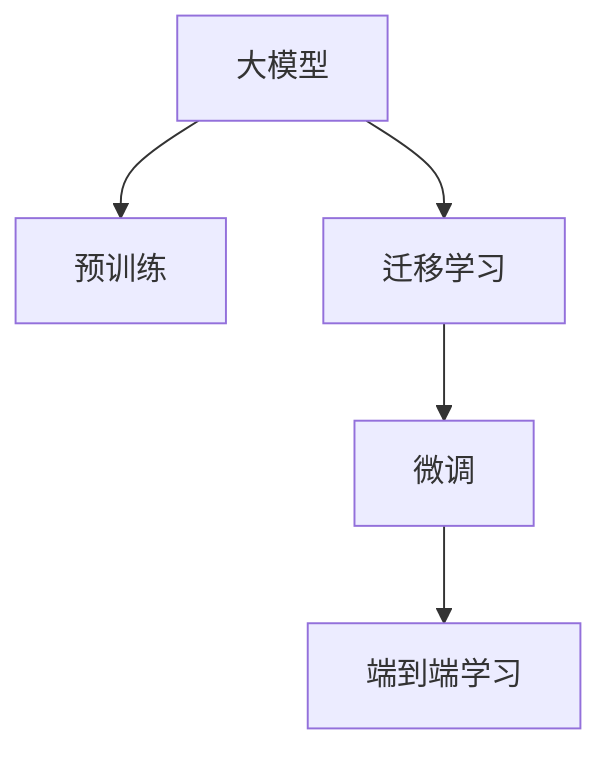

                 

## 1. 背景介绍

在当今科技飞速发展的时代，人工智能（AI）技术已经成为推动社会进步的重要力量。大模型的出现，更是将AI技术的边界不断拓展，为各行业带来了颠覆性的变革。然而，如何将大模型技术转化为商业成功，打造未来爆款应用，是一个值得深入探讨的问题。本文将从大模型的核心概念与联系、核心算法原理、操作步骤，到实际应用场景及未来展望等方面，系统地介绍如何利用大模型技术驱动创业成功。

## 2. 核心概念与联系

### 2.1 核心概念概述

为了更好地理解大模型及其在创业中的应用，首先需要明确几个核心概念：

- **大模型（Large Models）**：指基于深度学习技术，具有亿级别参数的神经网络模型，如GPT-3、BERT等。这些模型通过在大规模数据集上进行预训练，具备强大的语言理解和生成能力，能够在多个领域进行微调，实现特定的应用目标。

- **迁移学习（Transfer Learning）**：指在预训练模型的基础上，利用迁移学习的思想，通过微调（Fine-Tuning）将模型适应特定的应用场景，从而提高模型在该场景下的性能。

- **微调（Fine-Tuning）**：在预训练模型的基础上，利用下游任务的标注数据进行有监督训练，更新模型参数，使其能够适应特定任务的要求。

- **端到端（End-to-End）学习**：指从输入到输出的完整链条，通过一个神经网络模型完成，避免了传统机器学习中的特征工程和手工设计，简化了模型训练和部署流程。

这些核心概念之间的关系可以通过以下Mermaid流程图来展示：



这个流程图展示了大模型及其与预训练、迁移学习、微调、端到端学习之间的关系。预训练是大模型技术的基础，迁移学习是将预训练模型适配特定任务的重要手段，微调是在特定任务上优化模型性能的具体操作，而端到端学习则是实现从输入到输出全流程自动化的关键。

## 3. 核心算法原理 & 具体操作步骤

### 3.1 算法原理概述

大模型创业的核心在于利用预训练模型的强大能力，结合迁移学习和微调技术，打造适合特定应用场景的模型。其算法原理主要包括以下几个方面：

1. **预训练（Pre-training）**：在大规模无标签数据上训练模型，使其学习到通用的语言表示，如BERT使用掩码语言模型和下一句预测等自监督任务。
2. **迁移学习（Transfer Learning）**：在特定领域的数据上进行微调，将预训练模型的知识转移到新任务上。
3. **微调（Fine-Tuning）**：利用下游任务的少量标注数据进行有监督训练，调整模型参数，使其能够适应特定任务的要求。
4. **端到端学习（End-to-End Learning）**：通过一个神经网络模型完成从输入到输出的全流程，避免了传统机器学习中的特征工程和手工设计，简化了模型训练和部署流程。

### 3.2 算法步骤详解

大模型创业的具体操作步骤可以分为以下几个阶段：

1. **数据收集与预处理**：收集下游任务的标注数据，并进行清洗、归一化等预处理。
2. **模型选择与加载**：选择合适的预训练模型，如BERT、GPT-3等，并加载到模型训练框架中。
3. **微调参数设计**：设计微调参数，包括学习率、批大小、迭代次数等，确保模型能够稳定收敛。
4. **模型训练与评估**：在微调框架上进行模型训练，并在验证集上评估模型性能，根据评估结果调整微调参数。
5. **部署与优化**：将微调后的模型部署到实际应用中，并进行优化，确保模型的实时性和可扩展性。

### 3.3 算法优缺点

大模型创业的算法具有以下优点：

- **高性能**：大模型通过预训练和微调，具备强大的语言理解和生成能力，能够快速适应新任务。
- **泛化能力强**：大模型可以在多个领域进行微调，具备较强的泛化能力，能够在不同的应用场景中表现出色。
- **参数高效**：通过参数高效微调（PEFT）技术，可以只更新少量的模型参数，减少计算资源消耗。

但大模型创业的算法也存在一些缺点：

- **数据依赖**：微调效果高度依赖于下游任务的标注数据，获取高质量标注数据成本较高。
- **模型复杂度**：大模型参数量巨大，计算资源消耗较大，模型部署和优化复杂。
- **可解释性差**：大模型往往是"黑盒"模型，难以解释其内部工作机制和决策逻辑。

### 3.4 算法应用领域

大模型创业的应用领域广泛，涵盖了自然语言处理（NLP）、计算机视觉（CV）、语音识别（ASR）等多个领域。具体而言，包括但不限于：

- **NLP领域**：如文本分类、情感分析、机器翻译、问答系统等。
- **CV领域**：如图像分类、目标检测、图像生成等。
- **ASR领域**：如语音识别、语音合成等。

## 4. 数学模型和公式 & 详细讲解

### 4.1 数学模型构建

大模型创业的数学模型构建主要基于深度学习框架，如TensorFlow、PyTorch等。以BERT为例，其数学模型可以表示为：

$$
y=f(x; \theta)=softmax(Wx+b)
$$

其中，$x$为输入数据，$\theta$为模型参数，$f$为模型函数，$softmax$为激活函数，$W$和$b$为可训练的权重和偏置。

### 4.2 公式推导过程

大模型的公式推导过程较为复杂，涉及深度学习中的前向传播和反向传播算法。以反向传播为例，其公式可以表示为：

$$
\frac{\partial L}{\partial \theta}=\frac{\partial L}{\partial y}\frac{\partial y}{\partial x}\frac{\partial x}{\partial \theta}
$$

其中，$L$为损失函数，$y$为模型输出，$x$为输入数据。

### 4.3 案例分析与讲解

以BERT为例，其预训练过程包括掩码语言模型和下一句预测两个任务，具体公式如下：

- 掩码语言模型：$L_{MLM}=-\frac{1}{N}\sum_{i=1}^N\sum_{j=1}^N \log p(x_{i,j}|x_{<i,j>})
$
- 下一句预测：$L_{NSP}=-\frac{1}{2N}\sum_{i=1}^N\sum_{j=1}^N log\sigma(softmax(W_{NSP}x_{i,j}+b_{NSP}))
$

在微调过程中，BERT模型将预训练得到的参数作为初始化参数，利用下游任务的标注数据进行有监督训练。例如，在文本分类任务中，可以使用交叉熵损失函数，具体公式如下：

$$
L=-\frac{1}{N}\sum_{i=1}^N \sum_{j=1}^C y_{i,j}\log\sigma(x_{i,j}W+b)+ (1-y_{i,j})\log(1-\sigma(x_{i,j}W+b))
$$

其中，$y_{i,j}$为样本$x_{i,j}$的真实标签，$C$为类别数。

## 5. 项目实践：代码实例和详细解释说明

### 5.1 开发环境搭建

为了快速实现大模型创业项目，需要搭建一个高效的开发环境。以下是一个简单的Python开发环境搭建步骤：

1. 安装Anaconda：从官网下载并安装Anaconda，用于创建独立的Python环境。
2. 创建并激活虚拟环境：
```bash
conda create -n model-env python=3.8 
conda activate model-env
```

3. 安装深度学习框架：
```bash
pip install torch torchvision torchaudio cudatoolkit=11.1 -c pytorch -c conda-forge
```

4. 安装相关库：
```bash
pip install transformers datasets transformers-cn-hub
```

5. 设置Python路径：
```bash
export PYTHONPATH=$PYTHONPATH:/path/to/your/project
```

### 5.2 源代码详细实现

以下是一个使用Transformers库进行BERT微调的项目示例代码：

```python
from transformers import BertForSequenceClassification, Trainer, TrainingArguments
from transformers import BertTokenizer
from datasets import load_dataset
import torch

# 加载数据集
train_dataset = load_dataset('path/to/train', split='train')
dev_dataset = load_dataset('path/to/dev', split='validation')

# 定义模型和tokenizer
model = BertForSequenceClassification.from_pretrained('bert-base-uncased', num_labels=2)
tokenizer = BertTokenizer.from_pretrained('bert-base-uncased')

# 定义训练参数
training_args = TrainingArguments(
    output_dir='./results',
    per_device_train_batch_size=16,
    per_device_eval_batch_size=64,
    evaluation_strategy='epoch',
    learning_rate=5e-5,
    weight_decay=0.01,
    num_train_epochs=3,
    logging_steps=10,
    logging_dir='./logs'
)

# 定义数据预处理函数
def preprocess_function(examples):
    return tokenizer(examples['text'], truncation=True, padding='max_length')

# 定义微调器
trainer = Trainer(
    model=model,
    args=training_args,
    train_dataset=train_dataset.map(preprocess_function),
    eval_dataset=dev_dataset.map(preprocess_function),
    compute_metrics=lambda p: {'accuracy': p.logits.argmax(-1).eq(p.label).sum()/p.label.num_elements()}
)

# 开始微调
trainer.train()
```

### 5.3 代码解读与分析

以上代码实现了使用BERT进行文本分类任务的微调。具体解读如下：

1. **数据加载**：使用Hugging Face的datasets库加载训练集和验证集，并定义数据预处理函数。
2. **模型和tokenizer加载**：加载预训练的BERT模型和tokenizer。
3. **训练参数设置**：定义训练参数，包括学习率、批大小、训练轮数等。
4. **微调器定义**：定义微调器，包括模型、训练参数、训练集和验证集等。
5. **微调训练**：调用微调器的train方法，开始微调训练。

## 6. 实际应用场景

大模型创业在实际应用场景中具有广泛的应用前景。以下是几个典型的应用场景：

### 6.1 智能客服系统

智能客服系统通过利用大模型进行文本分类和对话生成，能够实现7x24小时不间断服务，快速响应客户咨询，提供自然流畅的语言解答。例如，可以针对客户咨询的问题，进行意图分类，匹配最合适的答案模板进行回复。

### 6.2 金融舆情监测

金融机构需要实时监测市场舆论动向，以便及时应对负面信息传播，规避金融风险。利用大模型进行文本分类和情感分析，可以自动识别负面信息，及时预警。

### 6.3 个性化推荐系统

个性化推荐系统通过大模型的文本表示和意图分析，能够提供更加精准、多样化的推荐内容。例如，对用户浏览、点击、评论等行为进行分析，学习用户的兴趣点，生成个性化推荐列表。

## 7. 工具和资源推荐

### 7.1 学习资源推荐

为了帮助开发者系统掌握大模型创业的理论基础和实践技巧，这里推荐一些优质的学习资源：

1. **Transformer系列教程**：由大模型技术专家撰写，深入浅出地介绍了Transformer原理、BERT模型、微调技术等前沿话题。
2. **自然语言处理与深度学习**：斯坦福大学开设的NLP明星课程，有Lecture视频和配套作业，带你入门NLP领域的基本概念和经典模型。
3. **《自然语言处理与深度学习》书籍**：Transformer库的作者所著，全面介绍了如何使用Transformer库进行NLP任务开发，包括微调在内的诸多范式。
4. **Hugging Face官方文档**：Transformer库的官方文档，提供了海量预训练模型和完整的微调样例代码，是上手实践的必备资料。
5. **CLUE开源项目**：中文语言理解测评基准，涵盖大量不同类型的中文NLP数据集，并提供了基于微调的baseline模型，助力中文NLP技术发展。

### 7.2 开发工具推荐

高效的开发离不开优秀的工具支持。以下是几款用于大模型微调开发的常用工具：

1. **PyTorch**：基于Python的开源深度学习框架，灵活动态的计算图，适合快速迭代研究。大部分预训练语言模型都有PyTorch版本的实现。
2. **TensorFlow**：由Google主导开发的开源深度学习框架，生产部署方便，适合大规模工程应用。同样有丰富的预训练语言模型资源。
3. **Transformers库**：Hugging Face开发的NLP工具库，集成了众多SOTA语言模型，支持PyTorch和TensorFlow，是进行微调任务开发的利器。
4. **Weights & Biases**：模型训练的实验跟踪工具，可以记录和可视化模型训练过程中的各项指标，方便对比和调优。与主流深度学习框架无缝集成。
5. **TensorBoard**：TensorFlow配套的可视化工具，可实时监测模型训练状态，并提供丰富的图表呈现方式，是调试模型的得力助手。
6. **Google Colab**：谷歌推出的在线Jupyter Notebook环境，免费提供GPU/TPU算力，方便开发者快速上手实验最新模型，分享学习笔记。

### 7.3 相关论文推荐

大模型创业的发展源于学界的持续研究。以下是几篇奠基性的相关论文，推荐阅读：

1. **Attention is All You Need**：提出了Transformer结构，开启了NLP领域的预训练大模型时代。
2. **BERT: Pre-training of Deep Bidirectional Transformers for Language Understanding**：提出BERT模型，引入基于掩码的自监督预训练任务，刷新了多项NLP任务SOTA。
3. **Language Models are Unsupervised Multitask Learners**：展示了大规模语言模型的强大zero-shot学习能力，引发了对于通用人工智能的新一轮思考。
4. **Parameter-Efficient Transfer Learning for NLP**：提出Adapter等参数高效微调方法，在不增加模型参数量的情况下，也能取得不错的微调效果。
5. **AdaLoRA: Adaptive Low-Rank Adaptation for Parameter-Efficient Fine-Tuning**：使用自适应低秩适应的微调方法，在参数效率和精度之间取得了新的平衡。

这些论文代表了大模型创业的发展脉络。通过学习这些前沿成果，可以帮助研究者把握学科前进方向，激发更多的创新灵感。

## 8. 总结：未来发展趋势与挑战

### 8.1 总结

本文对大模型创业进行了全面系统的介绍。首先阐述了大模型和微调技术的研究背景和意义，明确了微调在拓展预训练模型应用、提升下游任务性能方面的独特价值。其次，从原理到实践，详细讲解了微调的数学原理和关键步骤，给出了微调任务开发的完整代码实例。同时，本文还广泛探讨了微调方法在智能客服、金融舆情、个性化推荐等多个行业领域的应用前景，展示了微调范式的巨大潜力。此外，本文精选了微调技术的各类学习资源，力求为读者提供全方位的技术指引。

通过本文的系统梳理，可以看到，大模型创业已经展现出巨大的商业价值和应用潜力。未来，伴随预训练语言模型和微调方法的持续演进，相信NLP技术将在更广阔的应用领域大放异彩，为各行各业带来深刻的变革。

### 8.2 未来发展趋势

展望未来，大模型创业将呈现以下几个发展趋势：

1. **模型规模持续增大**：随着算力成本的下降和数据规模的扩张，预训练语言模型的参数量还将持续增长。超大规模语言模型蕴含的丰富语言知识，有望支撑更加复杂多变的下游任务微调。
2. **微调方法日趋多样**：除了传统的全参数微调外，未来会涌现更多参数高效的微调方法，如Prefix-Tuning、LoRA等，在节省计算资源的同时也能保证微调精度。
3. **持续学习成为常态**：随着数据分布的不断变化，微调模型也需要持续学习新知识以保持性能。如何在不遗忘原有知识的同时，高效吸收新样本信息，将成为重要的研究课题。
4. **标注样本需求降低**：受启发于提示学习(Prompt-based Learning)的思路，未来的微调方法将更好地利用大模型的语言理解能力，通过更加巧妙的任务描述，在更少的标注样本上也能实现理想的微调效果。
5. **多模态微调崛起**：当前的微调主要聚焦于纯文本数据，未来会进一步拓展到图像、视频、语音等多模态数据微调。多模态信息的融合，将显著提升语言模型对现实世界的理解和建模能力。
6. **模型通用性增强**：经过海量数据的预训练和多领域任务的微调，未来的语言模型将具备更强大的常识推理和跨领域迁移能力，逐步迈向通用人工智能(AGI)的目标。

以上趋势凸显了大模型创业技术的广阔前景。这些方向的探索发展，必将进一步提升NLP系统的性能和应用范围，为人类认知智能的进化带来深远影响。

### 8.3 面临的挑战

尽管大模型创业已经取得了瞩目成就，但在迈向更加智能化、普适化应用的过程中，它仍面临着诸多挑战：

1. **标注成本瓶颈**：微调效果高度依赖于下游任务的标注数据，获取高质量标注数据成本较高。如何进一步降低微调对标注样本的依赖，将是一大难题。
2. **模型鲁棒性不足**：当前微调模型面对域外数据时，泛化性能往往大打折扣。对于测试样本的微小扰动，微调模型的预测也容易发生波动。如何提高微调模型的鲁棒性，避免灾难性遗忘，还需要更多理论和实践的积累。
3. **推理效率有待提高**：大规模语言模型虽然精度高，但在实际部署时往往面临推理速度慢、内存占用大等效率问题。如何在保证性能的同时，简化模型结构，提升推理速度，优化资源占用，将是重要的优化方向。
4. **可解释性亟需加强**：当前微调模型更像是"黑盒"模型，难以解释其内部工作机制和决策逻辑。对于医疗、金融等高风险应用，算法的可解释性和可审计性尤为重要。如何赋予微调模型更强的可解释性，将是亟待攻克的难题。
5. **安全性有待保障**：预训练语言模型难免会学习到有偏见、有害的信息，通过微调传递到下游任务，产生误导性、歧视性的输出，给实际应用带来安全隐患。如何从数据和算法层面消除模型偏见，避免恶意用途，确保输出的安全性，也将是重要的研究课题。
6. **知识整合能力不足**：现有的微调模型往往局限于任务内数据，难以灵活吸收和运用更广泛的先验知识。如何让微调过程更好地与外部知识库、规则库等专家知识结合，形成更加全面、准确的信息整合能力，还有很大的想象空间。

正视微调创业面临的这些挑战，积极应对并寻求突破，将是大模型创业走向成熟的必由之路。相信随着学界和产业界的共同努力，这些挑战终将一一被克服，大模型创业必将在构建人机协同的智能时代中扮演越来越重要的角色。

### 8.4 研究展望

面对大模型创业所面临的种种挑战，未来的研究需要在以下几个方面寻求新的突破：

1. **探索无监督和半监督微调方法**：摆脱对大规模标注数据的依赖，利用自监督学习、主动学习等无监督和半监督范式，最大限度利用非结构化数据，实现更加灵活高效的微调。
2. **研究参数高效和计算高效的微调范式**：开发更加参数高效的微调方法，在固定大部分预训练参数的同时，只更新极少量的任务相关参数。同时优化微调模型的计算图，减少前向传播和反向传播的资源消耗，实现更加轻量级、实时性的部署。
3. **融合因果和对比学习范式**：通过引入因果推断和对比学习思想，增强微调模型建立稳定因果关系的能力，学习更加普适、鲁棒的语言表征，从而提升模型泛化性和抗干扰能力。
4. **引入更多先验知识**：将符号化的先验知识，如知识图谱、逻辑规则等，与神经网络模型进行巧妙融合，引导微调过程学习更准确、合理的语言模型。同时加强不同模态数据的整合，实现视觉、语音等多模态信息与文本信息的协同建模。
5. **结合因果分析和博弈论工具**：将因果分析方法引入微调模型，识别出模型决策的关键特征，增强输出解释的因果性和逻辑性。借助博弈论工具刻画人机交互过程，主动探索并规避模型的脆弱点，提高系统稳定性。
6. **纳入伦理道德约束**：在模型训练目标中引入伦理导向的评估指标，过滤和惩罚有偏见、有害的输出倾向。同时加强人工干预和审核，建立模型行为的监管机制，确保输出符合人类价值观和伦理道德。

这些研究方向的探索，必将引领大模型创业技术迈向更高的台阶，为构建安全、可靠、可解释、可控的智能系统铺平道路。面向未来，大模型创业技术还需要与其他人工智能技术进行更深入的融合，如知识表示、因果推理、强化学习等，多路径协同发力，共同推动自然语言理解和智能交互系统的进步。只有勇于创新、敢于突破，才能不断拓展语言模型的边界，让智能技术更好地造福人类社会。

---

作者：禅与计算机程序设计艺术 / Zen and the Art of Computer Programming

