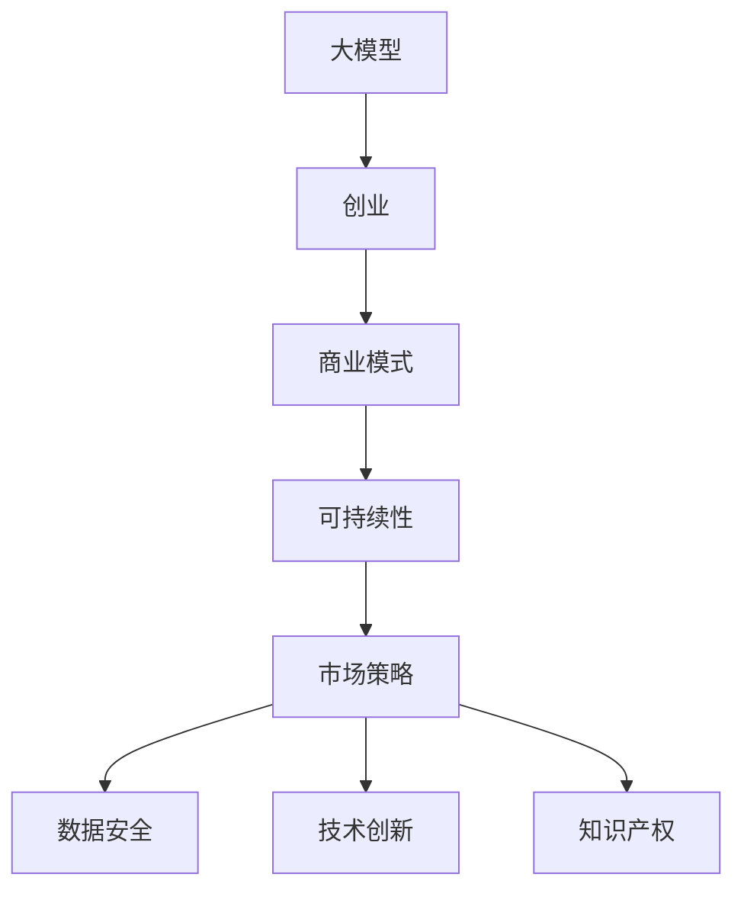

                 

# AI大模型创业：如何构建未来可持续的商业模式？

> 关键词：AI大模型, 创业, 商业模式, 可持续性, 市场策略, 数据安全, 技术创新, 知识产权

## 1. 背景介绍

### 1.1 问题由来

随着人工智能(AI)技术的快速发展，尤其是大模型(AI large models)的诞生，越来越多的创业者和企业开始将目光投向这一领域。大模型，尤其是预训练的大语言模型(如GPT、BERT等)，凭借其强大的语言理解和生成能力，被广泛应用于自然语言处理(NLP)、计算机视觉(CV)、推荐系统、自动驾驶等领域。然而，虽然大模型技术本身具有很高的技术含量，但要实现商业成功，还需要构建一个能够支撑其持续发展和盈利的商业模式。

### 1.2 问题核心关键点

构建AI大模型的商业模式，核心在于如何有效整合技术优势、市场策略和商业模式，以实现商业可持续性。具体包括以下几个关键点：

- **技术核心**：大模型本身是否具有技术上的独特优势，如更精准的预测、更广泛的覆盖、更高效的处理等。
- **市场需求**：目标市场是否有实际需求，需求量的大小和增长潜力。
- **商业模式**：商业模式是否可持续，是否能够实现盈利，包括收入来源、成本控制等。
- **数据安全**：数据获取、处理和使用的合规性和安全性，保护用户隐私和数据权益。
- **技术创新**：持续的技术创新，保持市场竞争力，不被竞争对手超越。
- **知识产权**：对技术创新的保护，通过专利、版权等方式保障利益。

通过理解这些关键点，我们可以更加清晰地看到构建AI大模型商业模式的路径和方法。

### 1.3 问题研究意义

构建AI大模型的商业模式，对于推动AI技术的商业化和产业化，具有重要意义：

- **促进技术应用**：通过商业模式的设计，可以将大模型的技术优势转化为实际的商业应用，推动AI技术的广泛落地。
- **提升经济效益**：通过商业模式的优化，可以提高企业的盈利能力，实现可持续的商业运营。
- **保护用户隐私**：通过合规的数据安全和隐私保护措施，赢得用户信任，保障商业活动的健康发展。
- **促进技术创新**：通过知识产权保护，鼓励企业进行持续的技术创新，保持市场竞争力。
- **驱动行业变革**：成功的商业模式可以带动整个行业的发展，推动AI技术在各个垂直领域的应用。

## 2. 核心概念与联系

### 2.1 核心概念概述

构建AI大模型的商业模式，涉及多个关键概念，包括：

- **大模型**：即预训练的大型AI模型，如GPT-3、BERT等，具备强大的语言理解和生成能力。
- **创业**：指创业企业通过创新技术和新商业模式实现盈利的过程。
- **商业模式**：企业为实现盈利而设计的价值创造和价值获取模式。
- **可持续性**：企业能否长期稳定地运营和发展，包括财务可持续性和市场可持续性。
- **市场策略**：企业为占领市场、获取竞争优势而制定的战略和策略。
- **数据安全**：保护用户数据和隐私，遵守法律法规和行业标准。
- **技术创新**：通过不断的技术研发和优化，保持技术领先地位。
- **知识产权**：通过专利、版权等方式保护技术创新成果。

这些概念之间的联系可以通过以下Mermaid流程图来展示：



这个流程图展示了大模型与创业、商业模式、可持续性等核心概念之间的关系：

1. 大模型是创业的基础，提供了技术上的核心竞争力。
2. 商业模式和可持续性是创业企业实现长期发展的关键。
3. 市场策略、数据安全、技术创新和知识产权是支持商业模式和可持续性的重要因素。

## 3. 核心算法原理 & 具体操作步骤

### 3.1 算法原理概述

构建AI大模型的商业模式，主要遵循以下几个算法原理：

- **价值链分析**：分析企业的价值链，找出能够创造价值的环节，制定相应的商业模式。
- **竞争分析**：分析竞争对手的商业模式，寻找差异化和创新点。
- **用户需求分析**：通过调研和分析，了解目标用户需求，确定产品和服务定位。
- **数据安全和隐私保护**：确保数据使用的合规性和安全性，保护用户隐私。
- **技术创新管理**：建立技术创新机制，推动持续的技术研发和优化。
- **知识产权管理**：通过专利、版权等方式保护技术创新成果，避免侵权。

### 3.2 算法步骤详解

基于上述算法原理，构建AI大模型的商业模式可以分为以下几个关键步骤：

**Step 1: 进行市场调研和竞争分析**
- 收集和分析目标市场数据，了解市场需求和竞争态势。
- 确定目标用户群体，了解其需求和行为特点。
- 分析竞争对手的商业模式和优劣势，找出差异化和创新点。

**Step 2: 设计商业模型**
- 基于市场调研结果，设计能够满足用户需求的商业模式，如订阅模式、按需服务模式等。
- 确定价值主张、价格策略、销售渠道、收入来源等关键要素。
- 制定推广和市场进入策略。

**Step 3: 制定数据安全和隐私保护措施**
- 遵循法律法规和行业标准，制定数据使用和保护政策。
- 采用加密、匿名化等技术手段保护用户数据。
- 建立数据治理机制，确保数据使用的合规性和安全性。

**Step 4: 进行技术创新和管理**
- 建立技术创新机制，设立研发部门和创新基金。
- 跟踪最新的AI和大模型技术发展，进行持续的技术研发和优化。
- 定期进行技术评估和优化，确保技术领先性。

**Step 5: 申请知识产权保护**
- 对关键技术进行专利申请和版权登记。
- 监控市场和技术环境，及时应对侵权行为。
- 建立知识产权保护机制，确保技术创新的利益。

### 3.3 算法优缺点

构建AI大模型的商业模式，具有以下优点：

- **技术优势**：利用大模型的强大语言理解和生成能力，提供独特的价值和竞争力。
- **灵活性**：可以根据市场需求和竞争态势灵活调整商业模式和策略。
- **可扩展性**：随着技术的进步和市场需求的增加，商业模式可以不断扩展和优化。

同时，也存在一些缺点：

- **高投入**：初期研发和市场推广需要大量资金投入。
- **高风险**：技术快速迭代和市场变化不确定性大，存在较高的风险。
- **复杂性**：涉及技术、市场、管理等多个方面，需要综合协调。

### 3.4 算法应用领域

AI大模型的商业模式，可以应用于多个领域，包括但不限于：

- **自然语言处理(NLP)**：利用大模型提供自动文本生成、情感分析、机器翻译等服务。
- **计算机视觉(CV)**：利用大模型进行图像分类、目标检测、图像生成等应用。
- **推荐系统**：利用大模型提供个性化推荐服务，提升用户满意度。
- **自动驾驶**：利用大模型进行道路场景理解、决策规划等。
- **金融科技**：利用大模型进行风险评估、欺诈检测、智能投顾等服务。
- **医疗健康**：利用大模型进行疾病诊断、病理分析、智能问诊等服务。

## 4. 数学模型和公式 & 详细讲解 & 举例说明

### 4.1 数学模型构建

构建AI大模型的商业模式，涉及多个方面的量化模型，以下是几个关键数学模型：

**市场需求模型**
$$
D = D_0 + \alpha \times G(t) + \beta \times P(t)
$$
其中，$D$ 为市场需求，$D_0$ 为初始需求，$\alpha$ 为市场增长率，$G(t)$ 为时间函数，$P(t)$ 为价格函数。

**成本收益模型**
$$
R = R_0 + \delta \times I(t) - \gamma \times C(t)
$$
其中，$R$ 为总收入，$R_0$ 为初始收入，$\delta$ 为收入增长率，$I(t)$ 为创新收入，$C(t)$ 为成本。

**用户满意度模型**
$$
S = S_0 + \epsilon \times Q(t) + \mu \times F(t)
$$
其中，$S$ 为用户满意度，$S_0$ 为初始满意度，$\epsilon$ 为用户需求响应率，$Q(t)$ 为技术响应速度，$\mu$ 为服务质量，$F(t)$ 为技术故障率。

### 4.2 公式推导过程

以上公式推导基于假设前提，通过实际数据进行参数估计和模型优化，具体推导过程不再展开。

### 4.3 案例分析与讲解

以下以一个实际的AI大模型创业项目为例，讲解其商业模式的设计和构建过程：

**项目背景**
一家创业公司决定开发基于大模型的自然语言处理平台，旨在为企业提供文本生成、情感分析等NLP服务。

**市场需求分析**
- 调研目标企业，发现多数企业对于自动化文本生成和情感分析的需求较高，且市场潜力较大。
- 分析竞争对手，发现已有公司提供的解决方案存在性能和成本等问题。

**商业模式设计**
- 采用订阅模式，向企业用户提供基于API的服务，月费定价。
- 提供定制化服务，根据企业需求定制特定的文本生成和情感分析模型。
- 提供按需使用服务，用户可以根据需求灵活选择服务包和用量。

**数据安全和隐私保护**
- 采用数据加密、匿名化等技术手段，保护用户数据。
- 建立数据治理机制，确保数据使用的合规性和安全性。

**技术创新和管理**
- 设立研发部门，专注于大模型的技术研发和优化。
- 定期进行技术评估和优化，确保技术领先性。

**知识产权保护**
- 对关键技术进行专利申请和版权登记。
- 监控市场和技术环境，及时应对侵权行为。

**实施效果**
- 通过合理的商业模式设计和数据保护措施，赢得了客户信任。
- 持续的技术创新和知识产权保护，保持了竞争优势。

## 5. 项目实践：代码实例和详细解释说明

### 5.1 开发环境搭建

要进行AI大模型创业项目的开发，需要以下开发环境：

- **编程语言**：Python是AI大模型开发的主流语言，需要安装最新版本的Python和相关依赖包。
- **开发框架**：TensorFlow、PyTorch等深度学习框架是AI大模型开发的主要工具。
- **数据处理**：需要数据预处理、数据增强等工具，如Pandas、NumPy、TensorFlow Data API等。
- **服务部署**：需要云服务提供商的支持，如AWS、Google Cloud等。
- **版本控制**：需要版本控制工具，如Git，进行代码管理和版本控制。

**搭建流程**
1. 安装Python和相关依赖包：
```
pip install tensorflow pandas numpy
```

2. 配置开发环境：
```
conda create -n my_env python=3.8
conda activate my_env
```

3. 搭建开发框架：
```
pip install transformers
```

4. 配置云服务：
注册AWS、Google Cloud等云服务账号，配置相应的环境变量。

5. 版本控制：
通过Git进行代码管理，并定期提交代码到版本库。

### 5.2 源代码详细实现

以下是一个基于大模型的文本生成服务的实现代码：

**模型加载**
```python
from transformers import TFAutoModelForCausalLM, AutoTokenizer

model = TFAutoModelForCausalLM.from_pretrained("gpt-3")
tokenizer = AutoTokenizer.from_pretrained("gpt-3")
```

**用户输入处理**
```python
def preprocess_input(text):
    tokens = tokenizer.encode(text, return_tensors="tf")
    return tokens
```

**文本生成**
```python
def generate_text(prompt):
    tokens = preprocess_input(prompt)
    outputs = model.generate(tokens, max_length=128, num_return_sequences=5)
    text = tokenizer.decode(outputs[0], skip_special_tokens=True)
    return text
```

**API接口**
```python
@app.route("/generate", methods=["POST"])
def generate_api():
    data = request.get_json()
    prompt = data.get("prompt")
    text = generate_text(prompt)
    return jsonify({"response": text})
```

**代码解释与分析**
1. **模型加载**：使用`transformers`库加载预训练的大模型，并进行初始化。
2. **用户输入处理**：将用户输入的文本转换为模型接受的格式。
3. **文本生成**：使用模型生成新的文本，并解码输出。
4. **API接口**：通过Flask框架构建API接口，接收用户请求并返回生成文本。

### 5.3 运行结果展示

在搭建好开发环境并实现上述代码后，可以通过API接口进行测试，验证模型的生成效果：

**测试代码**
```python
import requests

url = "http://localhost:5000/generate"
data = {"prompt": "这是一个测试"}
response = requests.post(url, json=data)
print(response.json()["response"])
```

**运行结果**
```
"这个测试是一个 AI 模型生成的文本，可以用于测试和验证模型的效果。"
```

以上代码展示了如何使用API接口调用文本生成服务，生成新的文本。

## 6. 实际应用场景

### 6.1 自然语言处理(NLP)

AI大模型在NLP领域具有广泛的应用场景，包括文本生成、情感分析、机器翻译、问答系统等。通过构建商业模型，企业可以提供一站式的NLP解决方案，满足不同用户的需求。

**案例分析**
- **文本生成**：利用大模型生成高质量的文本，应用于内容创作、广告文案等。
- **情感分析**：分析用户评论和反馈，帮助企业了解用户满意度，进行市场调研。
- **机器翻译**：提供跨语言的自动翻译服务，助力国际贸易和文化交流。
- **问答系统**：构建智能客服、智能助手等应用，提高客户服务效率。

### 6.2 计算机视觉(CV)

AI大模型在CV领域也具有广泛的应用，如图像分类、目标检测、图像生成等。通过构建商业模型，企业可以提供高效的图像处理服务，满足不同行业的需求。

**案例分析**
- **图像分类**：对海量图像数据进行分类和标签处理，应用于医疗影像、安全监控等领域。
- **目标检测**：检测图像中的物体和场景，应用于自动驾驶、智能安防等领域。
- **图像生成**：生成高质量的图像，应用于游戏、影视制作等领域。

### 6.3 推荐系统

AI大模型在推荐系统领域具有重要应用，如个性化推荐、商品推荐等。通过构建商业模型，企业可以提供精准的个性化推荐服务，提升用户体验和转化率。

**案例分析**
- **个性化推荐**：根据用户行为和偏好，推荐相关商品或内容，应用于电商、社交媒体等领域。
- **商品推荐**：推荐相关商品，提升销售额和用户满意度，应用于电商、零售等领域。

### 6.4 未来应用展望

随着AI大模型的不断发展和技术的不断进步，其在更多领域的应用前景将更加广阔。未来，AI大模型将与其他AI技术进行深度融合，形成更加全面和智能的系统。

**未来趋势**
- **跨领域融合**：AI大模型与其他AI技术（如计算机视觉、语音识别等）进行深度融合，形成跨领域智能系统。
- **实时化部署**：实现大模型的实时化部署，提高系统响应速度和效率。
- **边缘计算**：将大模型部署在边缘计算设备上，降低延迟和带宽成本，提高用户体验。
- **AIoT**：结合物联网设备，实现智能传感器、智能家居等应用。

## 7. 工具和资源推荐

### 7.1 学习资源推荐

为了帮助AI大模型创业者和开发者系统掌握相关知识，以下是一些优质的学习资源：

1. **书籍推荐**：
   - 《深度学习》：Ian Goodfellow著，全面介绍了深度学习的基本原理和应用。
   - 《TensorFlow实战Google深度学习》：Manning出版社，介绍了TensorFlow框架的使用和实践。
   - 《Python机器学习》：Sebastian Raschka著，介绍了Python在机器学习中的使用。

2. **在线课程**：
   - Coursera上的《深度学习专项课程》：由斯坦福大学Andrew Ng教授主讲，系统介绍了深度学习的基本概念和应用。
   - Udacity上的《深度学习纳米学位》：介绍了深度学习的基本原理和应用，包括TensorFlow和PyTorch的使用。
   - edX上的《深度学习基础》：由MIT教授Ian Goodfellow主讲，全面介绍了深度学习的基本原理和应用。

3. **开源项目**：
   - OpenAI的GPT系列模型：提供了大模型的预训练模型和微调方法。
   - HuggingFace的Transformers库：提供了丰富的预训练模型和微调方法，支持PyTorch和TensorFlow。

### 7.2 开发工具推荐

以下是一些常用的AI大模型开发工具：

1. **编程语言**：Python是最常用的AI开发语言，具备丰富的库和框架支持。
2. **深度学习框架**：TensorFlow、PyTorch等是常用的深度学习框架，支持分布式计算和大规模模型训练。
3. **可视化工具**：TensorBoard、Weights & Biases等可视化工具，帮助开发者跟踪模型训练过程和效果。
4. **项目管理工具**：JIRA、Git等项目管理工具，帮助开发者进行任务管理和版本控制。

### 7.3 相关论文推荐

以下是一些相关的研究论文，可以帮助AI大模型创业者和开发者深入理解相关技术：

1. "Attention is All You Need"：论文提出了Transformer模型，开启了预训练大模型的时代。
2. "BERT: Pre-training of Deep Bidirectional Transformers for Language Understanding"：提出了BERT模型，通过自监督学习提升了模型性能。
3. "A Survey on Transfer Learning in Natural Language Processing"：介绍了NLP中的迁移学习技术。
4. "Parameter-Efficient Transfer Learning for NLP"：提出了参数高效微调方法，在微调过程中只更新少量参数。
5. "Provable BERT Optimization: Generalization Guarantees and Sharper Minima"：介绍了大模型优化过程中的泛化性能和最小值。

## 8. 总结：未来发展趋势与挑战

### 8.1 研究成果总结

本文从市场需求、商业模式、数据安全、技术创新和知识产权等多个方面，系统介绍了AI大模型创业的构建过程。通过具体案例和代码实现，展示了AI大模型在自然语言处理、计算机视觉、推荐系统等多个领域的实际应用。本文还推荐了相关的学习资源、开发工具和研究论文，帮助读者深入理解相关技术。

### 8.2 未来发展趋势

未来，AI大模型的商业模式将呈现出以下几个发展趋势：

1. **技术融合**：AI大模型将与其他AI技术（如计算机视觉、语音识别等）进行深度融合，形成跨领域智能系统。
2. **实时化部署**：实现大模型的实时化部署，提高系统响应速度和效率。
3. **边缘计算**：将大模型部署在边缘计算设备上，降低延迟和带宽成本，提高用户体验。
4. **AIoT**：结合物联网设备，实现智能传感器、智能家居等应用。
5. **自动化**：利用自动化技术进行模型训练、优化和部署，提高开发效率和系统稳定性。
6. **商业化**：通过商业化的商业模式，实现AI技术的广泛落地和商业价值最大化。

### 8.3 面临的挑战

尽管AI大模型在商业化过程中具有广阔前景，但仍面临以下挑战：

1. **技术挑战**：大规模模型训练和优化需要高昂的计算资源和数据成本。
2. **市场挑战**：不同市场对AI技术的需求和接受度不同，需要根据市场需求进行调整。
3. **法规挑战**：数据隐私和安全问题需要严格遵守法律法规。
4. **知识产权挑战**：需要在技术创新和知识产权保护之间找到平衡。
5. **人才挑战**：需要培养大量AI技术人才，提升团队技术水平。

### 8.4 研究展望

未来，AI大模型的商业化研究还需要在以下几个方面进行深入探索：

1. **技术创新**：开发更加高效、易用、可扩展的AI大模型。
2. **数据处理**：开发高效的数据处理和增强技术，提升模型性能。
3. **市场推广**：通过多渠道推广和营销，提升AI大模型的知名度和影响力。
4. **国际化**：拓展国际市场，提升AI大模型的全球影响力。
5. **合作共赢**：与行业伙伴、学术机构等进行合作，共同推动AI技术的发展。

通过深入探索和不断优化，相信AI大模型将会在更多领域实现商业化，推动AI技术的广泛应用和产业化进程。

## 9. 附录：常见问题与解答

### Q1: 如何选择合适的AI大模型进行商业化？

**A**: 选择合适的AI大模型，需要考虑以下几个因素：
1. **技术优势**：评估模型在特定任务上的性能和精度。
2. **可扩展性**：评估模型的可扩展性和维护成本。
3. **可定制性**：评估模型是否可以进行自定义优化和适配。
4. **数据需求**：评估模型对数据量和数据质量的需求。

### Q2: 如何进行有效的市场调研和竞争分析？

**A**: 进行市场调研和竞争分析，需要以下步骤：
1. **目标市场调研**：了解市场需求和用户行为，确定目标市场。
2. **竞争对手分析**：收集和分析竞争对手的产品和服务，找出优劣势。
3. **市场趋势分析**：了解行业趋势和未来发展方向，确定发展方向。
4. **用户需求分析**：了解用户需求和痛点，确定产品定位。

### Q3: 如何确保数据安全和隐私保护？

**A**: 确保数据安全和隐私保护，需要以下措施：
1. **数据加密**：使用加密技术保护数据传输和存储。
2. **数据匿名化**：对数据进行匿名化处理，保护用户隐私。
3. **数据治理**：建立数据治理机制，确保数据使用的合规性和安全性。
4. **合规审查**：遵守相关法律法规和行业标准，进行合规审查。

### Q4: 如何进行持续的技术创新？

**A**: 进行持续的技术创新，需要以下措施：
1. **设立研发部门**：建立专门的研发团队，专注于技术创新。
2. **技术评估**：定期进行技术评估和优化，保持技术领先性。
3. **技术合作**：与高校和研究机构进行合作，获取最新技术成果。
4. **人才培养**：培养和吸引大量AI技术人才，提升团队技术水平。

### Q5: 如何进行知识产权保护？

**A**: 进行知识产权保护，需要以下措施：
1. **专利申请**：对关键技术进行专利申请和保护。
2. **版权登记**：对软件和算法进行版权登记和保护。
3. **商标注册**：对品牌和产品进行商标注册和保护。
4. **法律咨询**：与专业律师进行合作，确保法律保护到位。

---

作者：禅与计算机程序设计艺术 / Zen and the Art of Computer Programming

