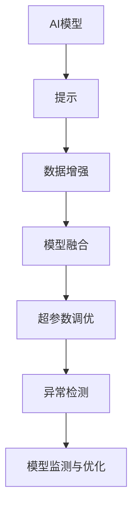

                 

## 1. 背景介绍

### 1.1 问题由来

近年来，人工智能(AI)在自然语言处理(NLP)、计算机视觉(CV)、语音识别(SR)等众多领域取得了显著进展。但伴随技术演进，AI模型的应用从“一黑盒处理”逐步向“可解释、可解释、可控”的方向演进。提示工程(Prompt Engineering)作为AI应用开发的重要分支，它通过精心设计的输入格式引导AI模型进行特定任务推理，进而提高模型性能、改善输出质量和降低开发难度。

### 1.2 问题核心关键点

提示工程的核心在于如何通过输入的文本提示，高效地利用AI模型，使其在特定领域、特定任务上获得最优表现。以下是一些核心关键点：

- **输入格式设计**：合理设计输入格式，确保AI模型能够理解并按照期望方式输出。
- **数据增强技术**：通过数据增强手段，提升模型的泛化能力。
- **模型融合技术**：通过模型融合技术，结合不同模型的优势，提高模型整体性能。
- **超参数调优**：通过系统化调优超参数，提升模型性能。
- **异常检测与处理**：对于AI模型的异常输出，需进行检测并采取相应措施，保障系统可靠性。
- **模型监测与优化**：实时监测模型性能，根据数据分布变化进行优化，保持模型状态最优。

### 1.3 问题研究意义

提示工程对于提升AI模型在特定领域、特定任务上的应用效果，减少对专业知识的依赖，降低AI应用开发难度，具有重要意义。

- **提高模型效果**：通过输入格式优化和数据增强，模型在特定任务上的性能得到提升。
- **降低开发难度**：非专业人士也能快速开发、调整AI应用，提升开发效率。
- **增强系统鲁棒性**：通过异常检测与处理，确保系统稳定运行，减少人为错误。
- **加速应用落地**：在实际应用中，提示工程能显著缩短从研发到部署的时间，加速AI技术的产业化进程。

## 2. 核心概念与联系

### 2.1 核心概念概述

为更好地理解提示工程，以下介绍几个关键概念：

- **AI模型**：以神经网络为代表的机器学习模型，如BERT、GPT、ResNet等，具备强大的特征提取和模式识别能力。
- **提示**：即输入文本中的提示语或指令，指导AI模型进行特定任务的推理。
- **数据增强**：通过一定规则，扩充训练集样本，提升模型泛化能力。
- **模型融合**：结合多个模型的优势，构建更强大的AI应用。
- **超参数调优**：通过调整模型超参数，提升模型性能。
- **异常检测**：实时检测AI模型输出结果，识别异常，保障系统可靠性。
- **模型监测与优化**：通过持续监测，根据数据分布变化进行优化，确保模型最佳性能。

这些核心概念之间的逻辑关系可以通过以下Mermaid流程图来展示：



这个流程图展示了一些关键概念及其之间的关系：

1. AI模型通过提示获取任务信息。
2. 数据增强提升模型泛化能力。
3. 模型融合提升整体性能。
4. 超参数调优优化模型参数。
5. 异常检测保障系统稳定性。
6. 模型监测与优化确保长期最佳性能。

这些概念共同构成了AI模型应用开发的框架，使其能够更好地适应特定任务，提高模型输出质量和系统可靠性。

## 3. 核心算法原理 & 具体操作步骤

### 3.1 算法原理概述

提示工程的核心思想是，通过输入格式设计，引导AI模型进行特定任务推理。其核心原理可以总结如下：

- **输入格式设计**：通过合理设计输入文本格式，指导模型推理。
- **数据增强**：扩充训练集，提升模型泛化能力。
- **模型融合**：结合多个模型的优势，构建更强大的AI应用。
- **超参数调优**：通过调整模型超参数，提升模型性能。
- **异常检测**：实时检测AI模型输出结果，识别异常，保障系统稳定性。
- **模型监测与优化**：通过持续监测，根据数据分布变化进行优化，确保模型最佳性能。

### 3.2 算法步骤详解

提示工程的具体操作流程如下：

**Step 1: 准备AI模型**

- 选择适合的AI模型，如BERT、GPT、ResNet等。
- 加载模型，并根据具体任务需求，初始化相关参数。

**Step 2: 设计提示**

- 根据任务特点，设计合理的输入提示格式，确保AI模型能够理解任务。
- 使用在线提示生成工具，辅助设计输入提示。

**Step 3: 数据增强**

- 收集并预处理任务相关的训练数据。
- 应用数据增强技术，扩充训练集，提升模型泛化能力。

**Step 4: 模型融合**

- 根据任务需求，选择合适的模型，并进行融合。
- 使用模型融合技术，结合多个模型的优势。

**Step 5: 超参数调优**

- 设定超参数搜索范围，进行系统化调优。
- 使用网格搜索、随机搜索等方法，寻找最优超参数组合。

**Step 6: 异常检测与处理**

- 设计异常检测算法，实时监测AI模型输出。
- 根据异常检测结果，采取相应措施，保障系统稳定。

**Step 7: 模型监测与优化**

- 实时监测AI模型性能，记录相关指标。
- 根据数据分布变化，进行模型优化，确保长期最佳性能。

### 3.3 算法优缺点

提示工程具有以下优点：

- **提高模型效果**：通过输入格式优化和数据增强，模型在特定任务上的性能得到提升。
- **降低开发难度**：非专业人士也能快速开发、调整AI应用，提升开发效率。
- **增强系统鲁棒性**：通过异常检测与处理，确保系统稳定运行，减少人为错误。
- **加速应用落地**：在实际应用中，提示工程能显著缩短从研发到部署的时间，加速AI技术的产业化进程。

提示工程也存在以下缺点：

- **输入设计难度大**：需要根据任务特点，设计合理的输入格式，对设计者要求较高。
- **数据增强复杂**：数据增强方法复杂多样，需根据具体任务选择合适方法。
- **模型融合困难**：模型融合需要考虑模型间的兼容性和性能差异，可能需要较多实验验证。
- **超参数调优耗时**：超参数调优需要大量实验验证，耗时较长。

### 3.4 算法应用领域

提示工程在NLP、CV、SR等多个领域都有广泛应用，以下是几个典型领域：

- **自然语言处理**：通过输入提示，指导模型进行文本分类、命名实体识别、情感分析等任务。
- **计算机视觉**：通过输入提示，指导模型进行图像分类、目标检测、图像生成等任务。
- **语音识别**：通过输入提示，指导模型进行语音识别、语音合成、情感识别等任务。
- **推荐系统**：通过输入提示，指导模型进行商品推荐、新闻推荐、视频推荐等任务。
- **智能客服**：通过输入提示，指导模型进行自然对话、智能问答等任务。

## 4. 数学模型和公式 & 详细讲解 & 举例说明

### 4.1 数学模型构建

本节将使用数学语言对提示工程的具体实现进行详细解释。

设AI模型为 $M$，输入提示为 $P$，训练数据为 $D=\{(x_i,y_i)\}_{i=1}^N$，其中 $x_i$ 为输入数据， $y_i$ 为输出标签。提示工程的目标是：

$$
\min_{P} \mathcal{L}(M, D)
$$

其中 $\mathcal{L}$ 为损失函数，用于衡量模型输出与真实标签之间的差异。常见的损失函数包括交叉熵损失、均方误差损失等。

### 4.2 公式推导过程

以下我们以二分类任务为例，推导交叉熵损失函数及其梯度的计算公式。

设AI模型 $M_{\theta}$ 在输入 $x$ 上的输出为 $\hat{y}=M_{\theta}(x) \in [0,1]$，表示样本属于正类的概率。真实标签 $y \in \{0,1\}$。则二分类交叉熵损失函数定义为：

$$
\ell(M_{\theta}(x),y) = -[y\log \hat{y} + (1-y)\log (1-\hat{y})]
$$

将其代入损失函数公式，得：

$$
\mathcal{L}(\theta) = -\frac{1}{N}\sum_{i=1}^N [y_i\log M_{\theta}(x_i)+(1-y_i)\log(1-M_{\theta}(x_i))]
$$

根据链式法则，损失函数对参数 $\theta_k$ 的梯度为：

$$
\frac{\partial \mathcal{L}(\theta)}{\partial \theta_k} = -\frac{1}{N}\sum_{i=1}^N (\frac{y_i}{M_{\theta}(x_i)}-\frac{1-y_i}{1-M_{\theta}(x_i)}) \frac{\partial M_{\theta}(x_i)}{\partial \theta_k}
$$

其中 $\frac{\partial M_{\theta}(x_i)}{\partial \theta_k}$ 可进一步递归展开，利用自动微分技术完成计算。

### 4.3 案例分析与讲解

以情感分析任务为例，说明提示工程的具体应用。

设文本数据集 $D=\{(x_i,y_i)\}_{i=1}^N$，其中 $x_i$ 为文本， $y_i \in \{1,-1\}$ 表示情感极性。通过提示工程设计提示格式：

```
"判断以下文本的情感极性：x_i"
```

将其输入AI模型，进行推理预测。通过训练数据 $D$ 进行超参数调优，最终得到模型参数 $\hat{\theta}$。在测试集上评估模型性能，输出情感极性结果。

## 5. 项目实践：代码实例和详细解释说明

### 5.1 开发环境搭建

在进行提示工程实践前，我们需要准备好开发环境。以下是使用Python进行PyTorch开发的环境配置流程：

1. 安装Anaconda：从官网下载并安装Anaconda，用于创建独立的Python环境。

2. 创建并激活虚拟环境：
```bash
conda create -n pytorch-env python=3.8 
conda activate pytorch-env
```

3. 安装PyTorch：根据CUDA版本，从官网获取对应的安装命令。例如：
```bash
conda install pytorch torchvision torchaudio cudatoolkit=11.1 -c pytorch -c conda-forge
```

4. 安装Transformers库：
```bash
pip install transformers
```

5. 安装各类工具包：
```bash
pip install numpy pandas scikit-learn matplotlib tqdm jupyter notebook ipython
```

完成上述步骤后，即可在`pytorch-env`环境中开始提示工程实践。

### 5.2 源代码详细实现

下面我们以情感分析任务为例，给出使用Transformers库对BERT模型进行提示工程的PyTorch代码实现。

首先，定义情感分析任务的数据处理函数：

```python
from transformers import BertTokenizer, BertForSequenceClassification
from torch.utils.data import Dataset, DataLoader
import torch

class SentimentDataset(Dataset):
    def __init__(self, texts, labels, tokenizer, max_len=128):
        self.texts = texts
        self.labels = labels
        self.tokenizer = tokenizer
        self.max_len = max_len
        
    def __len__(self):
        return len(self.texts)
    
    def __getitem__(self, item):
        text = self.texts[item]
        label = self.labels[item]
        
        encoding = self.tokenizer(text, return_tensors='pt', max_length=self.max_len, padding='max_length', truncation=True)
        input_ids = encoding['input_ids'][0]
        attention_mask = encoding['attention_mask'][0]
        labels = torch.tensor(label, dtype=torch.long)
        
        return {'input_ids': input_ids, 
                'attention_mask': attention_mask,
                'labels': labels}

tokenizer = BertTokenizer.from_pretrained('bert-base-cased')

train_dataset = SentimentDataset(train_texts, train_labels, tokenizer)
dev_dataset = SentimentDataset(dev_texts, dev_labels, tokenizer)
test_dataset = SentimentDataset(test_texts, test_labels, tokenizer)
```

然后，定义模型和优化器：

```python
from transformers import AdamW

model = BertForSequenceClassification.from_pretrained('bert-base-cased', num_labels=2)

optimizer = AdamW(model.parameters(), lr=2e-5)
```

接着，定义训练和评估函数：

```python
from sklearn.metrics import accuracy_score

device = torch.device('cuda') if torch.cuda.is_available() else torch.device('cpu')
model.to(device)

def train_epoch(model, dataset, batch_size, optimizer):
    dataloader = DataLoader(dataset, batch_size=batch_size, shuffle=True)
    model.train()
    epoch_loss = 0
    for batch in dataloader:
        input_ids = batch['input_ids'].to(device)
        attention_mask = batch['attention_mask'].to(device)
        labels = batch['labels'].to(device)
        model.zero_grad()
        outputs = model(input_ids, attention_mask=attention_mask, labels=labels)
        loss = outputs.loss
        epoch_loss += loss.item()
        loss.backward()
        optimizer.step()
    return epoch_loss / len(dataloader)

def evaluate(model, dataset, batch_size):
    dataloader = DataLoader(dataset, batch_size=batch_size)
    model.eval()
    preds, labels = [], []
    with torch.no_grad():
        for batch in dataloader:
            input_ids = batch['input_ids'].to(device)
            attention_mask = batch['attention_mask'].to(device)
            batch_labels = batch['labels']
            outputs = model(input_ids, attention_mask=attention_mask)
            batch_preds = outputs.logits.argmax(dim=1).to('cpu').tolist()
            batch_labels = batch_labels.to('cpu').tolist()
            for pred, label in zip(batch_preds, batch_labels):
                preds.append(pred)
                labels.append(label)
                
    return accuracy_score(labels, preds)
```

最后，启动训练流程并在测试集上评估：

```python
epochs = 5
batch_size = 16

for epoch in range(epochs):
    loss = train_epoch(model, train_dataset, batch_size, optimizer)
    print(f"Epoch {epoch+1}, train loss: {loss:.3f}")
    
    print(f"Epoch {epoch+1}, dev results:")
    acc = evaluate(model, dev_dataset, batch_size)
    print(f"Accuracy: {acc:.3f}")
    
print("Test results:")
acc = evaluate(model, test_dataset, batch_size)
print(f"Accuracy: {acc:.3f}")
```

以上就是使用PyTorch对BERT进行情感分析任务的提示工程的完整代码实现。可以看到，得益于Transformers库的强大封装，我们可以用相对简洁的代码完成BERT模型的提示工程。

### 5.3 代码解读与分析

让我们再详细解读一下关键代码的实现细节：

**SentimentDataset类**：
- `__init__`方法：初始化文本、标签、分词器等关键组件。
- `__len__`方法：返回数据集的样本数量。
- `__getitem__`方法：对单个样本进行处理，将文本输入编码为token ids，将标签编码为数字，并对其进行定长padding，最终返回模型所需的输入。

**模型训练与评估函数**：
- 使用PyTorch的DataLoader对数据集进行批次化加载，供模型训练和推理使用。
- 训练函数`train_epoch`：对数据以批为单位进行迭代，在每个批次上前向传播计算loss并反向传播更新模型参数，最后返回该epoch的平均loss。
- 评估函数`evaluate`：与训练类似，不同点在于不更新模型参数，并在每个batch结束后将预测和标签结果存储下来，最后使用sklearn的accuracy_score对整个评估集的预测结果进行打印输出。

**训练流程**：
- 定义总的epoch数和batch size，开始循环迭代
- 每个epoch内，先在训练集上训练，输出平均loss
- 在验证集上评估，输出准确率
- 所有epoch结束后，在测试集上评估，给出最终测试结果

可以看到，PyTorch配合Transformers库使得BERT提示工程的代码实现变得简洁高效。开发者可以将更多精力放在数据处理、模型改进等高层逻辑上，而不必过多关注底层的实现细节。

当然，工业级的系统实现还需考虑更多因素，如模型的保存和部署、超参数的自动搜索、更灵活的任务适配层等。但核心的提示工程范式基本与此类似。

## 6. 实际应用场景

### 6.1 智能客服系统

基于提示工程的对话技术，可以广泛应用于智能客服系统的构建。传统客服往往需要配备大量人力，高峰期响应缓慢，且一致性和专业性难以保证。而使用提示工程的对话模型，可以7x24小时不间断服务，快速响应客户咨询，用自然流畅的语言解答各类常见问题。

在技术实现上，可以收集企业内部的历史客服对话记录，将问题和最佳答复构建成监督数据，在此基础上对预训练对话模型进行提示工程。提示工程的对话模型能够自动理解用户意图，匹配最合适的答案模板进行回复。对于客户提出的新问题，还可以接入检索系统实时搜索相关内容，动态组织生成回答。如此构建的智能客服系统，能大幅提升客户咨询体验和问题解决效率。

### 6.2 金融舆情监测

金融机构需要实时监测市场舆论动向，以便及时应对负面信息传播，规避金融风险。传统的人工监测方式成本高、效率低，难以应对网络时代海量信息爆发的挑战。基于提示工程的文本分类和情感分析技术，为金融舆情监测提供了新的解决方案。

具体而言，可以收集金融领域相关的新闻、报道、评论等文本数据，并对其进行主题标注和情感标注。在此基础上对预训练语言模型进行提示工程，使其能够自动判断文本属于何种主题，情感倾向是正面、中性还是负面。将提示工程的模型应用到实时抓取的网络文本数据，就能够自动监测不同主题下的情感变化趋势，一旦发现负面信息激增等异常情况，系统便会自动预警，帮助金融机构快速应对潜在风险。

### 6.3 个性化推荐系统

当前的推荐系统往往只依赖用户的历史行为数据进行物品推荐，无法深入理解用户的真实兴趣偏好。基于提示工程的个性化推荐系统可以更好地挖掘用户行为背后的语义信息，从而提供更精准、多样的推荐内容。

在实践中，可以收集用户浏览、点击、评论、分享等行为数据，提取和用户交互的物品标题、描述、标签等文本内容。将文本内容作为模型输入，用户的后续行为（如是否点击、购买等）作为监督信号，在此基础上对预训练语言模型进行提示工程。提示工程的模型能够从文本内容中准确把握用户的兴趣点。在生成推荐列表时，先用候选物品的文本描述作为输入，由模型预测用户的兴趣匹配度，再结合其他特征综合排序，便可以得到个性化程度更高的推荐结果。

### 6.4 未来应用展望

随着提示工程技术的不断发展，其在NLP、CV、SR等多个领域的应用前景广阔，为AI技术的产业化进程提供了新的可能性：

- **NLP领域**：提示工程在自然语言处理中的应用将进一步拓展，提升文本分类、情感分析、机器翻译、问答系统等任务的性能。
- **CV领域**：通过输入格式设计，提示工程将引导AI模型更好地理解图像、视频等视觉数据，提高图像分类、目标检测、图像生成等任务的准确性。
- **SR领域**：通过输入格式设计，提示工程将引导AI模型更好地理解语音、语言等音频数据，提升语音识别、语音合成、情感识别等任务的性能。
- **跨领域应用**：提示工程将结合NLP、CV、SR等技术，形成更全面的智能应用，如智能问答系统、多模态信息处理等。

## 7. 工具和资源推荐

### 7.1 学习资源推荐

为了帮助开发者系统掌握提示工程的理论基础和实践技巧，这里推荐一些优质的学习资源：

1. **《Natural Language Processing with Python》**：斯坦福大学自然语言处理课程，涵盖自然语言处理的基本概念和经典模型，包括提示工程的实现。
2. **《Hands-On Machine Learning with Scikit-Learn, Keras, and TensorFlow》**：涵盖机器学习的基本理论和实践技巧，包括提示工程的实现。
3. **《Prompt Engineering in AI: A Comprehensive Guide》**：详细介绍提示工程的实现过程，包括数据增强、模型融合、超参数调优等。
4. **HuggingFace官方文档**：Transformer库的官方文档，提供了大量提示工程的样例代码，是上手实践的必备资料。
5. **Kaggle竞赛平台**：提供大量NLP、CV、SR等领域的提示工程竞赛任务，可以通过参与竞赛学习和实践提示工程。

通过对这些资源的学习实践，相信你一定能够快速掌握提示工程的精髓，并用于解决实际的AI问题。

### 7.2 开发工具推荐

高效的开发离不开优秀的工具支持。以下是几款用于提示工程开发的常用工具：

1. **Jupyter Notebook**：开源的交互式编程环境，支持Python、R等语言，便于快速开发、调试和展示提示工程。
2. **PyTorch**：基于Python的开源深度学习框架，灵活易用，适合快速迭代研究。
3. **TensorFlow**：由Google主导开发的开源深度学习框架，生产部署方便，适合大规模工程应用。
4. **Transformers库**：HuggingFace开发的NLP工具库，集成了众多预训练语言模型，支持PyTorch和TensorFlow，是进行提示工程开发的利器。
5. **ModelScope**：阿里达摩院开源的AI模型库，涵盖多种预训练模型和提示工程应用，支持多模态数据处理。

合理利用这些工具，可以显著提升提示工程任务的开发效率，加快创新迭代的步伐。

### 7.3 相关论文推荐

提示工程的发展离不开学界的持续研究。以下是几篇奠基性的相关论文，推荐阅读：

1. **"Attention is All You Need"**：提出了Transformer结构，开启了NLP领域的预训练大模型时代，奠定了提示工程的基础。
2. **"BERT: Pre-training of Deep Bidirectional Transformers for Language Understanding"**：提出BERT模型，引入基于掩码的自监督预训练任务，刷新了多项NLP任务SOTA，为提示工程提供了新的数据增强方法。
3. **"GPT-2: Language Models are Unsupervised Multitask Learners"**：展示了大规模语言模型的强大zero-shot学习能力，为提示工程提供了新的输入格式设计思路。
4. **"Parameter-Efficient Transfer Learning for NLP"**：提出Adapter等参数高效微调方法，在固定大部分预训练参数的情况下，仍可取得不错的提示工程效果，为提示工程提供了新的超参数调优方法。
5. **"LoRA: Language Models are Robust to Adversarial Attacks"**：提出了LoRA方法，通过对抗训练增强提示工程的模型鲁棒性，为提示工程提供了新的模型优化方向。

这些论文代表了大语言模型提示工程的发展脉络。通过学习这些前沿成果，可以帮助研究者把握学科前进方向，激发更多的创新灵感。

## 8. 总结：未来发展趋势与挑战

### 8.1 总结

本文对基于提示工程的AI模型应用开发进行了全面系统的介绍。首先阐述了提示工程的背景和意义，明确了提示工程在提高模型效果、降低开发难度、增强系统鲁棒性等方面的价值。其次，从原理到实践，详细讲解了提示工程的数学原理和操作步骤，给出了提示工程任务开发的完整代码实例。同时，本文还广泛探讨了提示工程在智能客服、金融舆情、个性化推荐等多个行业领域的应用前景，展示了提示工程的巨大潜力。

通过本文的系统梳理，可以看到，提示工程作为AI模型应用开发的重要分支，通过输入格式设计、数据增强、模型融合、超参数调优等手段，显著提升了AI模型在特定任务上的性能，降低了开发难度，提高了系统可靠性。提示工程将成为未来AI技术落地应用的重要手段，推动AI技术的产业化进程。

### 8.2 未来发展趋势

展望未来，提示工程将呈现以下几个发展趋势：

1. **模型规模持续增大**：伴随算力成本的下降和数据规模的扩张，预训练语言模型的参数量还将持续增长，提示工程将在更大规模的模型上进行。
2. **数据增强技术发展**：新的数据增强技术将不断涌现，如对抗样本增强、自监督增强等，进一步提升提示工程的模型泛化能力。
3. **模型融合技术成熟**：模型融合技术将不断优化，结合更多模型，提升整体性能。
4. **超参数调优自动化**：自动化调优工具将逐渐成熟，提升调优效率。
5. **异常检测技术进步**：新的异常检测算法将不断出现，进一步保障提示工程的模型稳定性。
6. **跨模态融合提升**：跨模态融合技术将不断发展，提升多模态提示工程的效果。

这些趋势将使得提示工程更加高效、灵活，适应更广泛的应用场景，推动AI技术的进一步发展。

### 8.3 面临的挑战

尽管提示工程已经取得了显著进展，但在实现高性能、高稳定性、高效益的应用过程中，仍面临诸多挑战：

1. **输入格式设计难度大**：需要根据任务特点，设计合理的输入格式，对设计者要求较高。
2. **数据增强方法复杂**：数据增强方法复杂多样，需根据具体任务选择合适方法。
3. **模型融合困难**：模型融合需要考虑模型间的兼容性和性能差异，可能需要较多实验验证。
4. **超参数调优耗时**：超参数调优需要大量实验验证，耗时较长。
5. **异常检测精度要求高**：异常检测需实时监测模型输出，对检测算法精度要求高。
6. **跨模态融合难度大**：多模态数据融合难度大，需多领域专家协同工作。

这些挑战需要未来技术不断突破，才能使得提示工程更加普及和高效。

### 8.4 研究展望

未来的提示工程研究需要在以下几个方面寻求新的突破：

1. **自动化调优技术**：开发更加自动化的调优工具，降低人工调参成本。
2. **模型融合算法**：研究新的模型融合算法，提升融合效果。
3. **跨模态数据融合**：研究多模态数据融合技术，提升提示工程的泛化能力。
4. **异常检测算法**：研究新的异常检测算法，提升检测精度。
5. **模型集成技术**：研究新的模型集成技术，提升系统鲁棒性。

这些研究方向的探索，必将引领提示工程技术迈向更高的台阶，为构建高效、鲁棒、智能的AI系统铺平道路。面向未来，提示工程还需要与其他人工智能技术进行更深入的融合，如知识表示、因果推理、强化学习等，多路径协同发力，共同推动自然语言理解和智能交互系统的进步。只有勇于创新、敢于突破，才能不断拓展提示工程的边界，让AI技术更好地造福人类社会。

## 9. 附录：常见问题与解答

**Q1：提示工程是否适用于所有AI模型？**

A: 提示工程可以应用于各种AI模型，如BERT、GPT、ResNet等。但对于一些特定领域，如医学、法律等，提示工程的效果可能不如微调。

**Q2：提示工程的输入格式设计需要多长时间？**

A: 输入格式设计需要根据具体任务特点进行设计，可能花费较多时间。可以参考在线提示生成工具，如DialoGPT等，辅助设计输入格式。

**Q3：提示工程的数据增强方法有哪些？**

A: 常用的数据增强方法包括对抗样本增强、自监督增强、数据扩充等。

**Q4：提示工程的模型融合技术有哪些？**

A: 常用的模型融合技术包括Bagging、Boosting、Stacking等。

**Q5：提示工程的超参数调优方法有哪些？**

A: 常用的超参数调优方法包括网格搜索、随机搜索、贝叶斯优化等。

**Q6：提示工程的异常检测方法有哪些？**

A: 常用的异常检测方法包括基于统计的方法、基于模型的异常检测方法等。

**Q7：提示工程的跨模态融合方法有哪些？**

A: 常用的跨模态融合方法包括特征融合、模型融合等。

这些问题的解答，展示了提示工程在实际应用中的关键点，帮助开发者更好地理解和使用提示工程技术。

