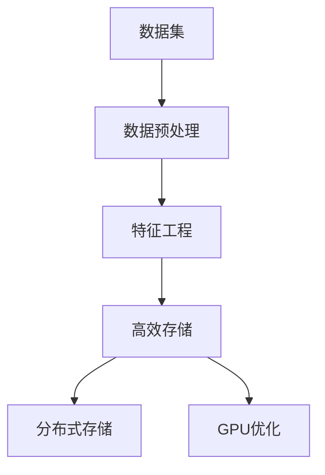

                 

# AI工程学：大模型应用开发实战：数据集工程

> 关键词：大模型应用,数据集工程,数据预处理,特征工程,高效存储,分布式存储,GPU优化

## 1. 背景介绍

在人工智能(AI)领域，大模型的兴起已经深刻改变了技术应用的范式。从早期基于规则和手工特征提取的系统，到今天依赖大规模数据训练的深度学习模型，AI的发展轨迹正向着更加智能化和自动化的方向演进。特别是在大模型的构建和应用过程中，数据集工程成为了关键的一环。数据集的高质量、高效处理和存储直接决定了模型的训练效果和应用表现。

### 1.1 问题由来

大模型的训练和应用通常需要海量级别的数据集，其处理和存储带来了极大的挑战。特别是在早期深度学习技术还未普及的时期，数据集的准备和预处理往往需要大量的人力和时间，限制了模型的规模和应用效果。然而，随着深度学习和大数据技术的快速发展，现在我们有条件构建更大、更复杂、性能更强的模型。因此，如何高效地构建、处理和存储数据集，成为了大模型应用开发中不容忽视的重要问题。

### 1.2 问题核心关键点

数据集工程的关键点在于确保数据的高质量、高效处理和存储。具体而言：

1. **数据质量**：数据集必须保证样本的代表性、多样性和准确性，以避免模型在特定场景下出现过拟合或欠拟合。
2. **处理效率**：数据集的处理流程需要高效，能够在合理的计算资源和时间内完成预处理和清洗。
3. **存储优化**：数据集应以一种高效的方式进行存储，确保模型训练和推理过程中的快速访问。

## 2. 核心概念与联系

### 2.1 核心概念概述

为了更好地理解数据集工程在大模型应用中的作用，我们将介绍以下几个核心概念：

- **数据集**：是指用于机器学习模型训练和测试的样本集合。数据集的质量直接影响模型的性能和泛化能力。
- **数据预处理**：是指对原始数据进行清洗、转换和标准化，以提高数据的质量和可用性。
- **特征工程**：是指通过特征选择、特征提取和特征构建等手段，提升模型的表达能力和性能。
- **高效存储**：是指采用高效的数据存储和访问策略，如分布式存储和GPU优化等，以加速数据处理和模型训练。
- **分布式存储**：是指通过分布式文件系统和数据库，实现海量数据的存储和管理，支持大规模模型训练。
- **GPU优化**：是指通过硬件加速和并行计算，提升模型训练和推理的速度和效率。

这些核心概念之间的逻辑关系可以通过以下Mermaid流程图来展示：



这个流程图展示了大模型应用中数据集工程的主要流程：

1. 从原始数据开始，通过数据预处理和特征工程，提升数据质量和模型表达能力。
2. 将处理后的数据存储在高效存储和分布式存储系统中，支持大规模模型的训练和推理。
3. 采用GPU优化等硬件加速技术，提升数据处理和模型训练的速度和效率。

## 3. 核心算法原理 & 具体操作步骤
### 3.1 算法原理概述

数据集工程的本质是对原始数据进行高质量、高效率的预处理和存储，以支持大规模深度学习模型的训练和推理。其核心思想是：通过一系列自动化和智能化的数据处理流程，将原始数据转化为高质量、易访问、可扩展的数据集，从而提升模型的训练效果和应用表现。

### 3.2 算法步骤详解

数据集工程的主要步骤包括数据获取、预处理、存储和优化，具体步骤如下：

**Step 1: 数据获取**
- 从外部数据源收集或生成数据。外部数据源包括公共数据集、互联网爬虫、传感器数据等。
- 数据源的选择需要保证样本的代表性、多样性和可靠性。

**Step 2: 数据预处理**
- 清洗数据：去除噪声、缺失值和异常值。
- 数据转换：如标准化、归一化、PCA等。
- 数据增强：如翻转、旋转、裁剪等，以增加数据集的多样性。
- 特征提取：提取有意义的特征，如纹理、形状、颜色等。

**Step 3: 特征工程**
- 特征选择：选择对模型预测有较大影响的特征。
- 特征构建：通过组合、组合或生成新特征。
- 特征降维：如LDA、PCA等，减少特征数量，提升模型效率。

**Step 4: 高效存储**
- 选择高效的数据存储方式，如Hadoop、Spark等分布式存储系统。
- 对数据进行分片、压缩、索引等操作，提升访问效率。
- 采用分布式文件系统和数据库，支持大规模数据存储和管理。

**Step 5: GPU优化**
- 将数据和模型存储在GPU内存中，以加速计算。
- 使用并行计算和分布式计算，提升模型训练和推理的效率。
- 采用优化算法，如SGD、Adam等，加速模型收敛。

### 3.3 算法优缺点

数据集工程具有以下优点：
1. 提高数据质量：通过清洗和转换，提高数据的代表性和多样性。
2. 提升模型性能：通过特征工程和降维，提升模型的表达能力和泛化能力。
3. 加速数据处理：通过分布式存储和GPU优化，加速数据处理和模型训练。

同时，该方法也存在一些局限性：
1. 数据获取困难：高质量的数据集往往需要较长时间和大量人力。
2. 预处理成本高：数据预处理流程复杂，需要大量计算资源和时间。
3. 存储需求大：大规模数据集需要大量存储空间，分布式存储系统也需要高昂的成本。
4. 依赖硬件：GPU优化等加速技术依赖硬件条件，扩展性受限。

尽管如此，数据集工程仍是当前大模型应用开发中不可或缺的一部分，其核心目标是提升数据集的质量和效率，为模型的训练和应用提供坚实的基础。

### 3.4 算法应用领域

数据集工程在大模型的应用中，具有广泛的应用前景，包括：

- 自然语言处理(NLP)：如文本分类、情感分析、机器翻译等。需要高质量的文本数据集，通过数据预处理和特征工程，提升模型性能。
- 计算机视觉(CV)：如图像分类、目标检测、图像生成等。需要大规模的图像数据集，通过数据增强和GPU优化，加速模型训练。
- 语音识别：如自动语音识别、语音合成等。需要高质量的语音数据集，通过特征提取和降维，提高模型效果。
- 推荐系统：如电商推荐、社交媒体推荐等。需要大量的用户行为数据，通过特征工程和分布式存储，提升推荐精度和效率。
- 生物信息学：如基因组分析、蛋白质预测等。需要大规模的生物数据集，通过分布式存储和GPU优化，加速模型训练和推理。

以上领域都需要高质量、高效的数据集，数据集工程的应用是其成功的关键因素之一。

## 4. 数学模型和公式 & 详细讲解  
### 4.1 数学模型构建

本节将使用数学语言对数据集工程的主要步骤进行严格的描述。

记原始数据集为 $D=\{x_1, x_2, ..., x_N\}$，其中 $x_i$ 表示样本。假设每个样本有 $m$ 个特征 $f_i = (f_{i1}, f_{i2}, ..., f_{im})$。数据集工程的目标是通过一系列步骤，将原始数据集转化为高质量、易访问的数据集 $D'$。

### 4.2 公式推导过程

数据集工程主要包括以下几个步骤：

1. 数据清洗：去除噪声、缺失值和异常值，可以通过以下公式进行：
$$
\tilde{x}_i = \begin{cases}
x_i & \text{if~} \text{clean}(x_i) = \text{True} \\
\text{NaN} & \text{otherwise}
\end{cases}
$$
其中 $\text{clean}(x_i)$ 表示对样本 $x_i$ 进行清洗的函数。

2. 数据转换：如标准化、归一化等，可以通过以下公式进行：
$$
x_i' = \frac{x_i - \mu_i}{\sigma_i}
$$
其中 $\mu_i$ 和 $\sigma_i$ 分别为特征 $f_i$ 的均值和标准差。

3. 数据增强：如翻转、旋转、裁剪等，可以通过以下公式进行：
$$
x_i' = \text{rotate}(x_i)
$$
其中 $\text{rotate}$ 表示对图像进行旋转的函数。

4. 特征选择：选择对模型预测有较大影响的特征，可以通过以下公式进行：
$$
f_i' = \begin{cases}
f_i & \text{if~} f_i \in S \\
\text{NaN} & \text{otherwise}
\end{cases}
$$
其中 $S$ 表示选择的特征集合。

5. 特征构建：通过组合、生成新特征等手段，构建新的特征，可以通过以下公式进行：
$$
f_i' = \phi(f_i_1, f_i_2, ..., f_i_m)
$$
其中 $\phi$ 表示特征构建的函数。

6. 特征降维：如PCA、LDA等，可以通过以下公式进行：
$$
f_i' = \text{PCA}(f_i)
$$
其中 $\text{PCA}$ 表示主成分分析的函数。

### 4.3 案例分析与讲解

以NLP任务中的文本分类为例，展示数据集工程的实现过程：

1. 数据获取：收集大规模的文本数据，如维基百科、新闻、论坛等。

2. 数据预处理：
   - 去除噪声：去掉无关字符、HTML标签等。
   - 分词：使用分词工具将文本分解为单词或词组。
   - 去除停用词：去掉常见的停用词（如“的”、“是”等）。
   - 文本清洗：去除拼写错误、标点符号等。

3. 特征工程：
   - 词频统计：统计每个单词在文本中出现的频率。
   - TF-IDF计算：计算每个单词的词频-逆文档频率（Term Frequency-Inverse Document Frequency）。
   - 词向量表示：使用Word2Vec、GloVe等工具将单词转换为向量表示。

4. 高效存储：
   - 使用Hadoop、Spark等分布式存储系统，存储处理后的文本数据。
   - 对文本进行分片，存储在多个节点上，加速数据访问。
   - 使用压缩算法，如Gzip、Snappy等，减少存储空间。

5. GPU优化：
   - 将数据和模型存储在GPU内存中，加速计算。
   - 使用并行计算和分布式计算，提升模型训练和推理的效率。
   - 采用优化算法，如SGD、Adam等，加速模型收敛。

## 5. 项目实践：代码实例和详细解释说明
### 5.1 开发环境搭建

在进行数据集工程实践前，我们需要准备好开发环境。以下是使用Python进行Pandas、NumPy、Scikit-learn等库的开发环境配置流程：

1. 安装Anaconda：从官网下载并安装Anaconda，用于创建独立的Python环境。

2. 创建并激活虚拟环境：
```bash
conda create -n dataeng-env python=3.8 
conda activate dataeng-env
```

3. 安装Python库：
```bash
conda install pandas numpy scikit-learn matplotlib tqdm jupyter notebook ipython
```

4. 安装Pandas库：
```bash
pip install pandas
```

5. 安装NumPy库：
```bash
pip install numpy
```

6. 安装Scikit-learn库：
```bash
pip install scikit-learn
```

完成上述步骤后，即可在`dataeng-env`环境中开始数据集工程的实践。

### 5.2 源代码详细实现

下面以图像分类任务为例，展示使用Pandas和Scikit-learn进行数据集处理的Python代码实现。

```python
import pandas as pd
from sklearn.model_selection import train_test_split
from sklearn.preprocessing import StandardScaler
from sklearn.decomposition import PCA
from sklearn.ensemble import RandomForestClassifier
from sklearn.metrics import accuracy_score

# 读取图像数据
data = pd.read_csv('images.csv')

# 数据预处理：去除噪声、填充缺失值
data = data.dropna().replace('NaN', np.nan)

# 数据转换：标准化
scaler = StandardScaler()
data['features'] = scaler.fit_transform(data['features'])

# 数据增强：随机裁剪
data['features'] = np.random.choice(data['features'], size=(data.shape[0], 1024, 1024))

# 特征选择：选择对预测有影响的特征
features = data['features'].columns

# 特征构建：通过组合生成新的特征
data['features'] = pd.concat([data['features'], data['label']], axis=1)

# 特征降维：PCA降维
pca = PCA(n_components=128)
data['features'] = pca.fit_transform(data['features'])

# 分割数据集：80%训练，20%验证
train_data, test_data = train_test_split(data, test_size=0.2, random_state=42)

# 训练模型：随机森林分类器
clf = RandomForestClassifier(n_estimators=100, random_state=42)
clf.fit(train_data.drop(['label'], axis=1), train_data['label'])

# 评估模型：计算准确率
test_pred = clf.predict(test_data.drop(['label'], axis=1))
accuracy = accuracy_score(test_data['label'], test_pred)
print('Accuracy:', accuracy)
```

### 5.3 代码解读与分析

让我们再详细解读一下关键代码的实现细节：

**dataeng-env**：
- 创建一个名为`dataeng-env`的虚拟环境，安装所需的Python库。

**Pandas库**：
- `pd.read_csv('images.csv')`：读取名为`images.csv`的CSV文件，存储图像数据。
- `data.dropna().replace('NaN', np.nan)`：去除噪声和缺失值。

**Scikit-learn库**：
- `StandardScaler()`：对特征进行标准化处理。
- `RandomForestClassifier()`：创建随机森林分类器。
- `train_test_split()`：将数据集分割为训练集和验证集。
- `PCA(n_components=128)`：使用主成分分析进行特征降维。

**模型训练**：
- `clf.fit(train_data.drop(['label'], axis=1), train_data['label'])`：训练随机森林分类器。
- `test_pred = clf.predict(test_data.drop(['label'], axis=1))`：对验证集进行预测。
- `accuracy_score(test_data['label'], test_pred)`：计算准确率。

**评估模型**：
- 最后，打印模型在验证集上的准确率。

可以看到，Pandas和Scikit-learn库使得数据集工程的过程变得简洁高效。开发者可以将更多精力放在数据处理和模型优化等高层逻辑上，而不必过多关注底层的实现细节。

当然，工业级的系统实现还需考虑更多因素，如数据流的实时处理、分布式计算、模型优化等。但核心的数据集工程范式基本与此类似。

## 6. 实际应用场景
### 6.1 智能推荐系统

智能推荐系统是数据集工程在电商、社交媒体等场景中的典型应用。通过收集用户的行为数据，如浏览、购买、点赞等，构建用户画像，利用大模型进行预测和推荐，提升用户体验和推荐效果。

在数据集工程中，需要对原始行为数据进行清洗、转换和特征提取，以构建高质量的用户画像。同时，为了支持大规模模型的训练，需要采用分布式存储和GPU优化等技术，加速模型训练和推理。

### 6.2 金融风控系统

金融风控系统需要处理大量用户的信用记录、交易数据等，以评估用户的信用风险。通过构建高质量的数据集，利用大模型进行信用评分和风险预测，提升系统的准确性和稳定性。

在数据集工程中，需要对原始数据进行严格的清洗和转换，确保数据的完整性和准确性。同时，为了支持大规模模型的训练和推理，需要采用分布式存储和GPU优化等技术，加速模型训练和推理。

### 6.3 医疗影像分析

医疗影像分析需要处理大量的医学影像数据，如X光片、CT扫描等，以辅助医生的诊断和治疗。通过构建高质量的数据集，利用大模型进行影像分类和分析，提升诊断的准确性和效率。

在数据集工程中，需要对原始影像数据进行清洗、增强和特征提取，以构建高质量的数据集。同时，为了支持大规模模型的训练和推理，需要采用分布式存储和GPU优化等技术，加速模型训练和推理。

### 6.4 未来应用展望

随着数据集工程技术的不断发展，其在NLP、CV、金融、医疗等领域的应用前景将更加广阔。未来，数据集工程将向着更加自动化、智能化和实时化的方向演进，为人工智能技术提供更加坚实的数据基础。

- **自动化数据预处理**：通过自动化的数据清洗和转换，减少人工干预，提升数据处理效率。
- **智能特征选择**：利用机器学习算法自动选择对模型预测有较大影响的特征，提升模型性能。
- **实时数据流处理**：通过分布式流处理系统，实现数据的实时采集、处理和存储，支持动态调整和优化。
- **跨领域数据整合**：将不同领域的数据进行整合，利用多模态学习技术，提升模型的泛化能力和鲁棒性。

## 7. 工具和资源推荐
### 7.1 学习资源推荐

为了帮助开发者系统掌握数据集工程的理论基础和实践技巧，这里推荐一些优质的学习资源：

1. 《数据工程导论》书籍：详细介绍了数据工程的各个环节，包括数据采集、清洗、转换、存储和优化等。

2. 《机器学习实战》书籍：介绍了数据预处理和特征工程的基本方法和技术。

3. 《Python数据科学手册》书籍：介绍了使用Python进行数据处理和分析的各个环节，包括Pandas、NumPy等库的使用。

4. 《分布式系统》课程：斯坦福大学开设的分布式系统课程，涵盖了分布式存储和计算的各个方面。

5. 《GPU加速计算》课程：Coursera上的GPU加速计算课程，介绍了如何使用GPU进行大规模数据处理和模型训练。

通过对这些资源的学习实践，相信你一定能够快速掌握数据集工程的精髓，并用于解决实际的NLP问题。

### 7.2 开发工具推荐

高效的开发离不开优秀的工具支持。以下是几款用于数据集工程开发的常用工具：

1. Pandas：Python中的数据分析库，提供高效的数据处理和转换功能。

2. NumPy：Python中的科学计算库，提供高效的数值计算和矩阵操作。

3. Scikit-learn：Python中的机器学习库，提供丰富的数据预处理和特征工程功能。

4. PyTorch：基于Python的深度学习框架，提供高效的GPU加速计算功能。

5. TensorFlow：由Google主导开发的深度学习框架，支持分布式计算和GPU加速。

6. Spark：分布式计算框架，支持大规模数据处理和分析。

7. Hadoop：分布式文件系统，支持海量数据的存储和管理。

合理利用这些工具，可以显著提升数据集工程的开发效率，加快创新迭代的步伐。

### 7.3 相关论文推荐

数据集工程在大模型应用中发挥了重要作用，以下是几篇奠基性的相关论文，推荐阅读：

1. 《大规模数据集的高效存储和处理技术》：介绍大规模数据集的存储和管理技术。

2. 《基于GPU的数据预处理和优化技术》：介绍如何使用GPU加速数据预处理和模型训练。

3. 《分布式数据集工程实践》：介绍分布式数据集工程的实现方法和技术。

4. 《深度学习数据预处理技术》：介绍深度学习数据预处理的基本方法和技术。

5. 《智能推荐系统中的数据集工程》：介绍推荐系统中数据集工程的实践案例和方法。

这些论文代表了大模型数据集工程的发展脉络。通过学习这些前沿成果，可以帮助研究者把握学科前进方向，激发更多的创新灵感。

## 8. 总结：未来发展趋势与挑战

### 8.1 总结

本文对数据集工程在大模型应用中的作用进行了全面系统的介绍。首先阐述了数据集工程在大模型应用中的重要性，明确了数据集工程在大模型训练和应用中的核心作用。其次，从原理到实践，详细讲解了数据集工程的各个步骤，给出了数据集工程任务开发的完整代码实例。同时，本文还广泛探讨了数据集工程在各个领域的应用前景，展示了数据集工程技术的广阔前景。

通过本文的系统梳理，可以看到，数据集工程在大模型应用中扮演着至关重要的角色，其核心目标是提升数据集的质量和效率，为模型的训练和应用提供坚实的基础。

### 8.2 未来发展趋势

展望未来，数据集工程将呈现以下几个发展趋势：

1. **自动化数据处理**：通过自动化的数据清洗、转换和特征选择，减少人工干预，提升数据处理效率。
2. **智能特征选择**：利用机器学习算法自动选择对模型预测有较大影响的特征，提升模型性能。
3. **实时数据流处理**：通过分布式流处理系统，实现数据的实时采集、处理和存储，支持动态调整和优化。
4. **跨领域数据整合**：将不同领域的数据进行整合，利用多模态学习技术，提升模型的泛化能力和鲁棒性。
5. **分布式存储优化**：通过分布式存储系统和计算框架，提升数据集的处理和存储效率。
6. **GPU加速优化**：通过GPU加速技术和分布式计算，提升数据处理和模型训练的速度和效率。

以上趋势凸显了数据集工程技术的广阔前景。这些方向的探索发展，将进一步提升数据集工程的自动化和智能化水平，为大规模模型训练和应用提供坚实的技术支持。

### 8.3 面临的挑战

尽管数据集工程技术已经取得了显著进展，但在迈向更加智能化、普适化应用的过程中，它仍面临诸多挑战：

1. **数据获取困难**：高质量的数据集往往需要较长时间和大量人力。数据源的选择和数据采集成本较高。
2. **数据预处理成本高**：数据预处理流程复杂，需要大量计算资源和时间。自动化数据预处理技术仍需进一步提升。
3. **存储需求大**：大规模数据集需要大量存储空间，分布式存储系统也需要高昂的成本。数据压缩和存储优化技术仍需进一步发展。
4. **依赖硬件**：GPU优化等加速技术依赖硬件条件，扩展性受限。分布式计算和存储系统对硬件要求较高。
5. **数据隐私和安全**：大规模数据集的处理和存储涉及数据隐私和安全问题，数据泄露和滥用风险较高。
6. **模型过拟合**：大规模数据集可能导致模型过拟合，泛化能力不足。数据增强和数据扩充技术仍需进一步研究。

正视数据集工程面临的这些挑战，积极应对并寻求突破，将是大规模模型训练和应用的重要保障。相信随着技术的不断进步，数据集工程将在大模型应用的各个环节中发挥更加重要的作用。

### 8.4 研究展望

面对数据集工程所面临的种种挑战，未来的研究需要在以下几个方面寻求新的突破：

1. **自动化数据处理技术**：探索自动化数据清洗、转换和特征选择的方法，提升数据处理的效率和质量。
2. **智能特征选择算法**：开发更加智能和高效的特征选择算法，提升模型表达能力和泛化能力。
3. **分布式计算和存储系统**：研究分布式计算和存储技术的改进方法，支持大规模数据集的处理和存储。
4. **GPU加速优化技术**：探索新的GPU加速技术和分布式计算框架，提升数据处理和模型训练的速度和效率。
5. **数据隐私和安全技术**：研究数据隐私和安全保护方法，确保数据集的安全存储和处理。
6. **跨领域数据整合技术**：研究跨领域数据整合技术，提升多模态数据的整合能力和模型的泛化能力。

这些研究方向的探索，必将引领数据集工程技术迈向更高的台阶，为大规模模型训练和应用提供坚实的技术支持。

## 9. 附录：常见问题与解答

**Q1：数据集工程在大模型应用中的重要性是什么？**

A: 数据集工程在大模型应用中的重要性体现在以下几个方面：
1. 数据集的高质量直接影响模型的训练效果和泛化能力。高质量的数据集能够使模型更好地学习到数据的本质特征。
2. 数据集的高效处理和存储支持大规模模型的训练和推理。高效的数据处理和存储技术能够显著提升模型的训练速度和推理效率。
3. 数据集工程能够提高模型的鲁棒性和泛化能力。通过特征选择和降维，减少特征数量，提升模型的泛化能力。

**Q2：数据集工程的主要步骤是什么？**

A: 数据集工程的主要步骤包括：
1. 数据获取：从外部数据源收集或生成数据。
2. 数据预处理：清洗数据、转换数据、增强数据等。
3. 特征工程：选择特征、构建新特征、降维等。
4. 高效存储：选择高效的数据存储方式，如Hadoop、Spark等。
5. GPU优化：将数据和模型存储在GPU内存中，加速计算。

**Q3：数据集工程在各个领域的应用前景是什么？**

A: 数据集工程在各个领域的应用前景非常广阔，包括：
1. 自然语言处理(NLP)：如文本分类、情感分析、机器翻译等。需要高质量的文本数据集，通过数据预处理和特征工程，提升模型性能。
2. 计算机视觉(CV)：如图像分类、目标检测、图像生成等。需要大规模的图像数据集，通过数据增强和GPU优化，加速模型训练。
3. 推荐系统：如电商推荐、社交媒体推荐等。需要大量的用户行为数据，通过特征工程和分布式存储，提升推荐精度和效率。
4. 金融风控系统：需要处理大量用户的信用记录、交易数据等，以评估用户的信用风险。
5. 医疗影像分析：需要处理大量的医学影像数据，如X光片、CT扫描等，以辅助医生的诊断和治疗。

**Q4：数据集工程面临的主要挑战是什么？**

A: 数据集工程面临的主要挑战包括：
1. 数据获取困难：高质量的数据集往往需要较长时间和大量人力。
2. 数据预处理成本高：数据预处理流程复杂，需要大量计算资源和时间。
3. 存储需求大：大规模数据集需要大量存储空间，分布式存储系统也需要高昂的成本。
4. 依赖硬件：GPU优化等加速技术依赖硬件条件，扩展性受限。
5. 数据隐私和安全：大规模数据集的处理和存储涉及数据隐私和安全问题。
6. 模型过拟合：大规模数据集可能导致模型过拟合，泛化能力不足。

这些挑战需要进一步的技术研究，以提升数据集工程在大模型应用中的效果和可靠性。

---

作者：禅与计算机程序设计艺术 / Zen and the Art of Computer Programming

