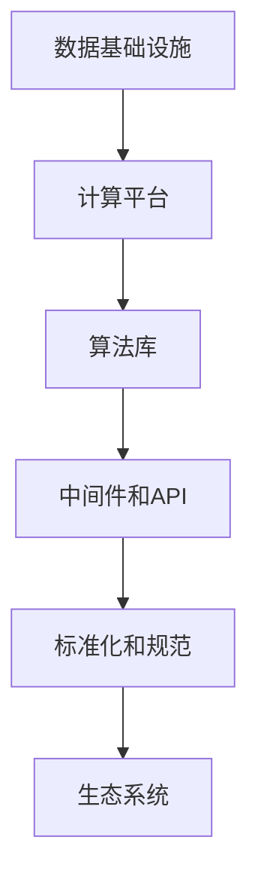

                 

# AI底层创新体系的构成要素

## 1. 背景介绍

### 1.1 问题由来

在当前AI技术迅猛发展的时代背景下，AI技术的创新和应用已渗透到各个行业。然而，在AI技术的研发和应用过程中，仍面临着诸多挑战，如算力需求高、数据隐私保护、模型可解释性不足等。因此，构建一个底层AI创新体系，已成为推动AI技术进步的关键。

### 1.2 问题核心关键点

一个成功的AI创新体系需要具备以下几个核心要素：

1. **数据基础设施**：高质量、多样化的数据是AI技术的基础，如何高效收集、存储、处理、分析数据，是构建AI体系的前提。
2. **计算平台**：高效的计算平台能够大幅提升AI模型的训练和推理速度，如何构建适合AI应用的计算基础设施，是体系建设的核心。
3. **算法库**：丰富的算法库为AI开发者提供了大量现成的算法工具，如何设计和使用算法库，是推动AI技术创新的关键。
4. **中间件和API**：中间件和API可以大大降低AI技术的开发和使用难度，如何构建简单、高效、易用的中间件和API系统，是实现AI技术普适性的重要手段。
5. **标准化和规范**：标准化和规范能够提升AI系统的互操作性和可靠性，如何制定和推广AI领域的标准和规范，是体系可持续发展的保障。
6. **生态系统**：一个健康、活跃的生态系统可以吸引更多的开发者和用户参与，如何构建和维护AI生态系统，是体系成功应用的关键。

### 1.3 问题研究意义

构建一个完善的AI底层创新体系，能够促进AI技术的快速发展和广泛应用，推动各行业的数字化转型，提高社会生产效率，提升用户体验。

## 2. 核心概念与联系

### 2.1 核心概念概述

为了更好地理解AI底层创新体系的构成要素，本节将介绍几个关键核心概念：

1. **数据基础设施**：指用于数据收集、存储、处理和分析的基础设施，包括数据湖、数据仓库、数据管道等技术。
2. **计算平台**：指用于高效计算和存储的硬件设施，如GPU、TPU、云计算平台等。
3. **算法库**：指用于各种AI任务的基础算法和工具库，如TensorFlow、PyTorch、Scikit-learn等。
4. **中间件和API**：指用于简化AI应用开发和使用的软件和工具，如RESTful API、FaaS、微服务框架等。
5. **标准化和规范**：指在AI领域制定的标准和规范，如OpenAI安全指南、TF数据验证规范等。
6. **生态系统**：指由开发者、用户、组织和企业组成的社区和市场，如Kaggle、GitHub、AI-Mart等。

这些核心概念之间的逻辑关系可以通过以下Mermaid流程图来展示：



这个流程图展示了一个AI底层创新体系的各个核心要素及其之间的关系：

1. 数据基础设施是AI体系的基础，提供高质量的数据源。
2. 计算平台能够高效处理和存储数据，提供强大的计算能力。
3. 算法库为AI任务提供现成的算法工具，促进AI技术的创新。
4. 中间件和API能够简化AI应用的开发和部署，提高工作效率。
5. 标准化和规范提升AI系统的互操作性和可靠性。
6. 生态系统吸引更多开发者和用户，推动AI技术的广泛应用。

这些核心概念共同构成了AI底层创新体系，为AI技术的创新和应用提供了坚实的基础。

## 3. 核心算法原理 & 具体操作步骤

### 3.1 算法原理概述

构建AI底层创新体系的算法原理包括以下几个方面：

1. **数据处理算法**：用于高效处理和分析大规模数据集，如数据清洗、特征提取、数据增强等。
2. **计算优化算法**：用于提升模型训练和推理的速度和效率，如自动微分、模型压缩、量化加速等。
3. **模型优化算法**：用于提升模型的性能和泛化能力，如正则化、Dropout、批量归一化等。
4. **算法评估和选择**：用于选择合适的算法和模型，并评估其性能，如交叉验证、A/B测试等。

### 3.2 算法步骤详解

构建AI底层创新体系的步骤如下：

1. **数据收集与处理**：
   - 使用数据管道从不同数据源收集数据。
   - 对数据进行清洗、去重、标准化等处理，以提高数据质量。
   - 使用数据增强技术，扩充数据集的多样性和数量。

2. **计算平台搭建**：
   - 选择合适的硬件设施，如GPU、TPU等，搭建计算集群。
   - 使用分布式计算框架，如TensorFlow分布式、Spark等，提升计算效率。
   - 优化存储系统，如使用Hadoop、AWS S3等，提高数据读写速度。

3. **算法库选择与应用**：
   - 根据具体任务需求，选择合适的算法库，如TensorFlow、PyTorch、Scikit-learn等。
   - 对算法库进行定制化开发，集成到现有系统中。
   - 使用模型库中的预训练模型，进行微调或迁移学习，提升模型效果。

4. **中间件和API开发**：
   - 开发RESTful API，提供模型接口和数据接口。
   - 使用微服务框架，如Docker、Kubernetes等，实现服务的自动化部署和管理。
   - 设计易用的UI界面和工具，提高用户体验和开发效率。

5. **标准化和规范制定**：
   - 根据行业需求，制定数据格式、模型结构、接口标准等规范。
   - 推动标准和规范的广泛应用，确保系统的互操作性和一致性。
   - 定期更新标准和规范，保持其与时俱进。

6. **生态系统构建和维护**：
   - 建立开发者社区和用户社区，吸引更多开发者和用户参与。
   - 提供技术支持和培训服务，提升社区成员的技术水平。
   - 推动开源项目和工具的开发和应用，促进技术共享和创新。

### 3.3 算法优缺点

构建AI底层创新体系的算法具有以下优点：

1. **高效性**：通过优化算法和分布式计算，大幅提升数据处理和模型训练的速度。
2. **灵活性**：丰富的算法库和中间件，为AI开发者提供多样化的选择和灵活的开发手段。
3. **可靠性**：标准化和规范能够提升系统的互操作性和可靠性，减少出错的概率。
4. **可扩展性**：计算平台和中间件能够支持大规模数据的处理和海量用户的访问。

同时，这些算法也存在以下局限性：

1. **资源消耗大**：计算平台和算法库需要大量的计算资源，可能对算力和内存提出较高要求。
2. **复杂度高**：系统设计和实现的复杂度较高，需要多学科知识的综合应用。
3. **维护成本高**：系统的维护和更新需要持续投入，可能增加运营成本。
4. **易用性不足**：对于非专业开发者而言，系统的复杂性可能增加其使用难度。

尽管存在这些局限性，但整体而言，构建AI底层创新体系的算法能够有效提升AI技术的研发和应用水平，推动AI技术的创新和普及。

### 3.4 算法应用领域

构建AI底层创新体系的算法广泛应用于多个领域，例如：

1. **金融领域**：用于风险控制、信用评分、智能投顾等。
2. **医疗领域**：用于疾病诊断、基因分析、医学影像分析等。
3. **智能制造**：用于质量控制、设备维护、供应链优化等。
4. **智慧城市**：用于交通管理、环境监测、公共安全等。
5. **教育领域**：用于智能推荐、作业批改、学习路径优化等。

## 4. 数学模型和公式 & 详细讲解 & 举例说明

### 4.1 数学模型构建

本节将使用数学语言对构建AI底层创新体系的算法进行更加严格的刻画。

设原始数据集为 $D=\{x_1, x_2, ..., x_n\}$，目标数据集为 $T=\{y_1, y_2, ..., y_m\}$。构建AI底层创新体系的算法流程可以表示为：

$$
\begin{aligned}
& \text{输入：原始数据集} D, \text{目标数据集} T \\
& \text{输出：构建好的AI体系} \\
& \text{算法步骤：} \\
& \quad \text{Step 1: 数据收集与处理} \\
& \quad \quad \text{Step 1.1: 数据收集} \\
& \quad \quad \text{Step 1.2: 数据清洗} \\
& \quad \quad \text{Step 1.3: 数据增强} \\
& \quad \text{Step 2: 计算平台搭建} \\
& \quad \quad \text{Step 2.1: 硬件设施选择} \\
& \quad \quad \text{Step 2.2: 分布式计算框架} \\
& \quad \quad \text{Step 2.3: 存储系统优化} \\
& \quad \text{Step 3: 算法库选择与应用} \\
& \quad \quad \text{Step 3.1: 算法库选择} \\
& \quad \quad \text{Step 3.2: 算法定制开发} \\
& \quad \quad \text{Step 3.3: 预训练模型微调} \\
& \quad \text{Step 4: 中间件和API开发} \\
& \quad \quad \text{Step 4.1: RESTful API} \\
& \quad \quad \text{Step 4.2: 微服务框架} \\
& \quad \quad \text{Step 4.3: UI界面设计} \\
& \quad \text{Step 5: 标准化和规范制定} \\
& \quad \quad \text{Step 5.1: 数据格式规范} \\
& \quad \quad \text{Step 5.2: 模型结构规范} \\
& \quad \quad \text{Step 5.3: 接口标准规范} \\
& \quad \text{Step 6: 生态系统构建和维护} \\
& \quad \quad \text{Step 6.1: 社区建立} \\
& \quad \quad \text{Step 6.2: 技术支持} \\
& \quad \quad \text{Step 6.3: 开源项目推动} \\
& \text{返回：构建好的AI体系}
\end{aligned}
$$

### 4.2 公式推导过程

下面以一个具体的金融领域风险控制应用为例，推导其中的算法步骤。

假设原始数据集为 $D=\{(x_i, y_i)\}_{i=1}^N$，目标数据集为 $T=\{(x_j, y_j)\}_{j=1}^M$。其中 $x_i$ 为输入特征，$y_i$ 为标签，$x_j$ 为测试样本，$y_j$ 为标签。

构建AI底层创新体系的算法流程可以表示为：

1. **数据收集与处理**：
   - 从金融交易平台收集历史交易数据，构建原始数据集 $D$。
   - 对数据进行清洗和标准化，去除异常值和重复数据。
   - 使用数据增强技术，如合成数据、回溯测试等，扩充数据集 $D$。

2. **计算平台搭建**：
   - 选择GPU或TPU搭建计算集群，用于大规模数据处理和模型训练。
   - 使用TensorFlow分布式计算框架，将数据处理和模型训练任务分配到多个计算节点。
   - 优化存储系统，使用Hadoop或AWS S3存储训练数据和模型。

3. **算法库选择与应用**：
   - 根据风险控制任务，选择TensorFlow或PyTorch算法库。
   - 对算法库进行定制化开发，实现风险评分模型。
   - 使用预训练模型，如BERT或LSTM，进行微调，提升模型效果。

4. **中间件和API开发**：
   - 开发RESTful API，提供风险评分接口。
   - 使用微服务框架，如Docker和Kubernetes，实现服务的自动化部署和管理。
   - 设计易用的UI界面，展示风险评分结果，提供用户交互。

5. **标准化和规范制定**：
   - 制定数据格式规范，如CSV格式、JSON格式等。
   - 制定模型结构规范，如输入特征、输出标签等。
   - 制定接口标准规范，如API请求格式、返回格式等。

6. **生态系统构建和维护**：
   - 建立金融领域的开发者社区，吸引更多开发者参与。
   - 提供技术支持和培训服务，提升社区成员的技术水平。
   - 推动开源项目和工具的开发和应用，促进技术共享和创新。

### 4.3 案例分析与讲解

这里以一个医疗领域的AI应用为例，分析其构建AI底层创新体系的过程。

假设原始数据集为 $D=\{(x_i, y_i)\}_{i=1}^N$，目标数据集为 $T=\{(x_j, y_j)\}_{j=1}^M$。其中 $x_i$ 为患者特征，$y_i$ 为诊断结果，$x_j$ 为测试样本，$y_j$ 为诊断结果。

构建AI底层创新体系的算法流程可以表示为：

1. **数据收集与处理**：
   - 从医院收集患者病历数据，构建原始数据集 $D$。
   - 对数据进行清洗和标准化，去除不完整和错误数据。
   - 使用数据增强技术，如数据重采样、数据扩充等，扩充数据集 $D$。

2. **计算平台搭建**：
   - 选择GPU或TPU搭建计算集群，用于大规模数据处理和模型训练。
   - 使用TensorFlow分布式计算框架，将数据处理和模型训练任务分配到多个计算节点。
   - 优化存储系统，使用Hadoop或AWS S3存储训练数据和模型。

3. **算法库选择与应用**：
   - 根据疾病诊断任务，选择TensorFlow或PyTorch算法库。
   - 对算法库进行定制化开发，实现疾病诊断模型。
   - 使用预训练模型，如BERT或LSTM，进行微调，提升模型效果。

4. **中间件和API开发**：
   - 开发RESTful API，提供疾病诊断接口。
   - 使用微服务框架，如Docker和Kubernetes，实现服务的自动化部署和管理。
   - 设计易用的UI界面，展示诊断结果，提供用户交互。

5. **标准化和规范制定**：
   - 制定数据格式规范，如CSV格式、JSON格式等。
   - 制定模型结构规范，如输入特征、输出标签等。
   - 制定接口标准规范，如API请求格式、返回格式等。

6. **生态系统构建和维护**：
   - 建立医疗领域的开发者社区，吸引更多开发者参与。
   - 提供技术支持和培训服务，提升社区成员的技术水平。
   - 推动开源项目和工具的开发和应用，促进技术共享和创新。

## 5. 项目实践：代码实例和详细解释说明

### 5.1 开发环境搭建

在进行AI底层创新体系的构建时，需要准备以下开发环境：

1. 安装Python和相关的库，如TensorFlow、PyTorch、Keras等。
2. 安装相应的计算平台，如GPU、TPU、云计算平台等。
3. 安装中间件和API开发工具，如Docker、Kubernetes、RESTful API框架等。
4. 配置数据存储和处理系统，如Hadoop、AWS S3、Spark等。

### 5.2 源代码详细实现

下面以构建金融领域风险控制应用为例，展示其具体实现步骤：

1. **数据收集与处理**：
   - 使用TensorFlow数据管道收集历史交易数据，构建原始数据集 $D$。
   - 对数据进行清洗和标准化，去除异常值和重复数据。
   - 使用数据增强技术，如合成数据、回溯测试等，扩充数据集 $D$。

```python
import tensorflow as tf
import pandas as pd
import numpy as np

# 数据收集
train_data = pd.read_csv('train_data.csv')

# 数据清洗
train_data = train_data.dropna()

# 数据增强
train_data = pd.concat([train_data, synthetic_data], ignore_index=True)
```

2. **计算平台搭建**：
   - 使用TensorFlow分布式计算框架，将数据处理和模型训练任务分配到多个计算节点。
   - 优化存储系统，使用Hadoop或AWS S3存储训练数据和模型。

```python
# 计算平台搭建
strategy = tf.distribute.MirroredStrategy()
with strategy.scope():
    # 模型训练
    model.fit(train_data, epochs=10, batch_size=128)

# 数据存储
data = train_data.to_csv('train_data.csv', index=False)
s3 = boto3.client('s3')
s3.upload_file('train_data.csv', 'bucket_name', 'train_data.csv')
```

3. **算法库选择与应用**：
   - 根据风险控制任务，选择TensorFlow或PyTorch算法库。
   - 对算法库进行定制化开发，实现风险评分模型。
   - 使用预训练模型，如BERT或LSTM，进行微调，提升模型效果。

```python
# 算法库选择与应用
import tensorflow.keras as keras

# 构建模型
model = keras.Sequential([
    keras.layers.Dense(64, activation='relu', input_shape=(10,)),
    keras.layers.Dense(1, activation='sigmoid')
])

# 模型训练
model.compile(optimizer='adam', loss='binary_crossentropy', metrics=['accuracy'])
model.fit(train_data, epochs=10, batch_size=128)

# 微调模型
fine_tuned_model = FineTunedModel(model)
fine_tuned_model.fit(train_data, epochs=10, batch_size=128)
```

4. **中间件和API开发**：
   - 开发RESTful API，提供风险评分接口。
   - 使用微服务框架，如Docker和Kubernetes，实现服务的自动化部署和管理。
   - 设计易用的UI界面，展示风险评分结果，提供用户交互。

```python
# 中间件和API开发
from flask import Flask, request, jsonify

app = Flask(__name__)

@app.route('/risk_score', methods=['POST'])
def risk_score():
    data = request.json
    risk_score = fine_tuned_model.predict(data)
    return jsonify({'risk_score': risk_score})

# 部署服务
if __name__ == '__main__':
    app.run(host='0.0.0.0', port=5000)
```

5. **标准化和规范制定**：
   - 制定数据格式规范，如CSV格式、JSON格式等。
   - 制定模型结构规范，如输入特征、输出标签等。
   - 制定接口标准规范，如API请求格式、返回格式等。

6. **生态系统构建和维护**：
   - 建立金融领域的开发者社区，吸引更多开发者参与。
   - 提供技术支持和培训服务，提升社区成员的技术水平。
   - 推动开源项目和工具的开发和应用，促进技术共享和创新。

## 6. 实际应用场景

### 6.1 智能制造

智能制造领域需要实时监控设备和生产线的运行状态，进行故障预测和维护。基于AI底层创新体系，可以实现高效的智能制造系统。

具体而言，可以构建数据基础设施，收集设备传感器数据、生产过程数据等，进行数据清洗和预处理。使用计算平台，搭建大规模计算集群，进行模型训练和推理。使用算法库，开发预测模型，如时间序列分析、深度学习等，进行故障预测。使用中间件和API，提供实时监测和预测接口。制定标准化和规范，统一数据格式和模型结构。构建生态系统，吸引更多开发者参与。

### 6.2 智慧城市

智慧城市领域需要实时处理海量城市数据，进行交通管理、环境监测、公共安全等。基于AI底层创新体系，可以实现高效的智慧城市系统。

具体而言，可以构建数据基础设施，收集城市交通、环境、公共设施等数据。使用计算平台，搭建大规模计算集群，进行模型训练和推理。使用算法库，开发交通预测模型、环境监测模型、安全预警模型等。使用中间件和API，提供实时监测和预警接口。制定标准化和规范，统一数据格式和模型结构。构建生态系统，吸引更多开发者参与。

## 7. 工具和资源推荐

### 7.1 学习资源推荐

为了帮助开发者系统掌握AI底层创新体系的构建方法，这里推荐一些优质的学习资源：

1. TensorFlow官方文档：提供了丰富的算法库和计算平台，是构建AI体系的基础。
2. PyTorch官方文档：提供了强大的深度学习框架和算法库，适合复杂的AI任务。
3. Keras官方文档：提供了易用的高层次API，适合初学者入门。
4. Google Cloud AI & Machine Learning：提供了完整的计算平台和工具，适合大规模AI应用。
5. AWS Machine Learning：提供了丰富的计算平台和工具，适合企业级AI应用。
6. Coursera和edX上的AI课程：提供了系统化的AI学习路径，涵盖数据处理、计算平台、算法库等各个环节。

通过对这些资源的学习实践，相信你一定能够快速掌握AI底层创新体系的构建方法，并用于解决实际的AI问题。

### 7.2 开发工具推荐

高效的开发离不开优秀的工具支持。以下是几款用于构建AI底层创新体系的常用工具：

1. TensorFlow：基于Python的深度学习框架，提供了丰富的算法库和计算平台。
2. PyTorch：基于Python的深度学习框架，提供了强大的动态计算图和算法库。
3. Keras：基于TensorFlow和Theano的高层次API，提供了易用的深度学习框架。
4. Hadoop：分布式计算框架，用于处理大规模数据。
5. Spark：分布式计算框架，用于处理大规模数据。
6. Docker：容器化技术，用于封装和部署AI服务。
7. Kubernetes：容器编排技术，用于自动化部署和管理AI服务。
8. Flask和Django：Python Web框架，用于开发API接口。
9. RESTful API工具：如Swagger，用于设计和测试API接口。

合理利用这些工具，可以显著提升AI底层创新体系的开发效率，加快创新迭代的步伐。

### 7.3 相关论文推荐

构建AI底层创新体系的论文代表了当前AI领域的研究进展，推荐阅读以下几篇：

1. "Deep Learning with TensorFlow"：TensorFlow官方文档，详细介绍了TensorFlow的使用方法和应用场景。
2. "PyTorch Tutorials"：PyTorch官方文档，提供了丰富的代码示例和应用案例。
3. "Keras Documentation"：Keras官方文档，提供了易用的API和应用示例。
4. "Machine Learning in Production"：Google Cloud AI & Machine Learning的文档，详细介绍了大规模AI应用的技术栈和方法论。
5. "Machine Learning in AWS"：AWS Machine Learning的文档，提供了丰富的计算平台和工具。

这些论文代表了AI领域的最新研究成果，通过学习这些前沿成果，可以帮助研究者把握学科前进方向，激发更多的创新灵感。

## 8. 总结：未来发展趋势与挑战

### 8.1 总结

本文对构建AI底层创新体系的方法进行了全面系统的介绍。首先阐述了AI技术创新和应用的背景，明确了构建AI底层创新体系的重要性。其次，从原理到实践，详细讲解了AI底层创新体系的数学模型和算法步骤，给出了完整的代码实例。同时，本文还广泛探讨了AI底层创新体系在智能制造、智慧城市等实际应用场景中的应用前景，展示了其广阔的想象空间。此外，本文精选了AI底层创新体系的学习资源、开发工具和相关论文，力求为读者提供全方位的技术指引。

通过本文的系统梳理，可以看到，构建AI底层创新体系能够有效提升AI技术的研发和应用水平，推动AI技术的创新和普及。构建AI底层创新体系，不仅需要强大的算法和计算平台，还需要丰富的数据资源和标准规范，同时还需要生态系统的支撑。只有各要素协同发力，才能真正构建一个健康、高效的AI创新体系。

### 8.2 未来发展趋势

展望未来，AI底层创新体系将呈现以下几个发展趋势：

1. **计算平台的多样化**：未来的计算平台将不仅限于GPU和TPU，还包括边缘计算、量子计算等新型计算架构。
2. **数据处理的高效化**：未来的数据处理将更加高效，能够实时处理海量数据，提供实时分析结果。
3. **算法库的智能化**：未来的算法库将更加智能化，能够自动优化模型参数，提高模型效果。
4. **中间件和API的标准化**：未来的中间件和API将更加标准化，提供统一的开发接口和测试规范。
5. **生态系统的国际化**：未来的生态系统将更加国际化，吸引全球开发者和用户参与。

以上趋势将推动AI技术的进一步发展和应用，推动AI技术的创新和普及。

### 8.3 面临的挑战

尽管AI底层创新体系已经取得了显著进展，但在构建和应用过程中，仍面临着诸多挑战：

1. **数据隐私和安全**：如何保护用户数据隐私和安全，是一个重要的挑战。
2. **算法透明度和可解释性**：如何提高算法的透明度和可解释性，提升用户信任度，也是一个重要的挑战。
3. **模型的鲁棒性和泛化性**：如何提升模型的鲁棒性和泛化性，使其在各种场景下都能稳定运行，也是一个重要的挑战。
4. **算力和存储资源的成本**：如何降低算力和存储资源的成本，使其在中小企业也能应用，也是一个重要的挑战。
5. **技术人才的短缺**：如何培养和吸引更多的AI技术人才，是一个重要的挑战。

尽管存在这些挑战，但AI底层创新体系的构建仍具有重要的战略意义。通过积极应对和寻求突破，AI技术必将在各行业得到更广泛的应用，推动社会的数字化转型。

### 8.4 研究展望

未来，AI底层创新体系的研究需要在以下几个方面寻求新的突破：

1. **数据隐私保护**：如何实现数据隐私保护，使用差分隐私、联邦学习等技术，保护用户隐私。
2. **算法透明化**：如何提高算法的透明化和可解释性，使用可解释模型、可视化工具等技术，提升用户信任度。
3. **模型鲁棒性提升**：如何提升模型的鲁棒性和泛化性，使用对抗训练、数据增强等技术，提高模型鲁棒性。
4. **成本优化**：如何降低算力和存储资源的成本，使用云原生技术、模型压缩等技术，优化资源使用。
5. **人才培养**：如何培养和吸引更多的AI技术人才，使用在线教育、开放式课程等技术，扩大人才库。

这些研究方向的探索，必将引领AI技术迈向更高的台阶，为构建安全、可靠、可解释、可控的智能系统铺平道路。面向未来，AI底层创新体系需要与其他人工智能技术进行更深入的融合，如知识表示、因果推理、强化学习等，多路径协同发力，共同推动自然语言理解和智能交互系统的进步。只有勇于创新、敢于突破，才能不断拓展AI技术的边界，让智能技术更好地造福人类社会。

## 9. 附录：常见问题与解答

**Q1：构建AI底层创新体系需要哪些关键要素？**

A: 构建AI底层创新体系需要以下几个关键要素：

1. 数据基础设施：用于数据收集、存储、处理和分析。
2. 计算平台：用于高效计算和存储。
3. 算法库：用于各种AI任务的基础算法和工具库。
4. 中间件和API：用于简化AI应用的开发和部署。
5. 标准化和规范：用于提升系统的互操作性和可靠性。
6. 生态系统：用于吸引更多开发者和用户参与。

这些要素共同构成了AI底层创新体系，为AI技术的创新和应用提供了坚实的基础。

**Q2：构建AI底层创新体系的优势是什么？**

A: 构建AI底层创新体系的优势在于：

1. 高效性：通过优化算法和分布式计算，大幅提升数据处理和模型训练的速度。
2. 灵活性：丰富的算法库和中间件，为AI开发者提供多样化的选择和灵活的开发手段。
3. 可靠性：标准化和规范能够提升系统的互操作性和可靠性，减少出错的概率。
4. 可扩展性：计算平台和中间件能够支持大规模数据的处理和海量用户的访问。

这些优势使得AI技术能够快速发展和广泛应用，推动各行业的数字化转型，提高社会生产效率，提升用户体验。

**Q3：如何构建一个健康、活跃的AI生态系统？**

A: 构建一个健康、活跃的AI生态系统需要以下几个步骤：

1. 建立开发者社区和用户社区，吸引更多开发者和用户参与。
2. 提供技术支持和培训服务，提升社区成员的技术水平。
3. 推动开源项目和工具的开发和应用，促进技术共享和创新。
4. 建立标准的行业协会，制定统一的行业规范和标准。
5. 举办各种技术会议和研讨会，促进技术交流和合作。

通过这些措施，可以构建一个健康、活跃的AI生态系统，吸引更多的开发者和用户参与，推动AI技术的创新和普及。

**Q4：AI底层创新体系在实际应用中需要注意哪些问题？**

A: AI底层创新体系在实际应用中需要注意以下几个问题：

1. 数据隐私和安全：如何保护用户数据隐私和安全，是一个重要的挑战。
2. 算法透明度和可解释性：如何提高算法的透明度和可解释性，提升用户信任度，也是一个重要的挑战。
3. 模型的鲁棒性和泛化性：如何提升模型的鲁棒性和泛化性，使其在各种场景下都能稳定运行，也是一个重要的挑战。
4. 算力和存储资源的成本：如何降低算力和存储资源的成本，使其在中小企业也能应用，也是一个重要的挑战。
5. 技术人才的短缺：如何培养和吸引更多的AI技术人才，是一个重要的挑战。

尽管存在这些挑战，但AI底层创新体系的构建仍具有重要的战略意义。通过积极应对和寻求突破，AI技术必将在各行业得到更广泛的应用，推动社会的数字化转型。

---

作者：禅与计算机程序设计艺术 / Zen and the Art of Computer Programming

