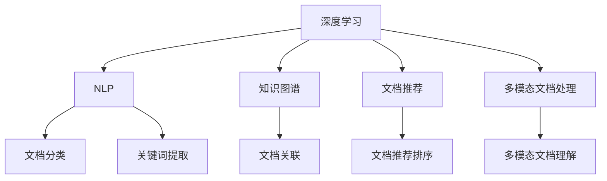

                 

# AI开发的文档管理：Lepton AI的知识库建设

> 关键词：文档管理,知识库构建,Lepton AI,深度学习,自然语言处理,NLP

## 1. 背景介绍

### 1.1 问题由来
在AI开发过程中，文档管理是一个至关重要的环节。大型的AI项目往往涉及大量的模型、算法和实验记录，如何高效、安全地管理这些文档，不仅关系到开发效率，更直接影响项目的长期健康和持续演进。传统的数据库和文档管理系统，往往难以应对AI项目复杂的结构化和非结构化数据，且缺乏高效的搜索和智能推荐能力。

为了更好地解决AI文档管理的痛点，Lepton AI公司提出了一套以深度学习和自然语言处理(NLP)为基础的知识库系统，旨在通过自动化、智能化的手段，提升AI文档管理的效率和准确性，为AI开发者提供更好的工作支持。

### 1.2 问题核心关键点
Lepton AI的知识库系统主要包括以下核心要素：

- **深度学习模型**：用于文档内容的自动分类、关键词提取和语义相似度计算，提升文档的自动化管理能力。
- **自然语言处理技术**：如命名实体识别、关系抽取等，用于文档内容的结构化处理和语义关系建模，增强文档搜索和推荐的能力。
- **知识图谱**：基于文档内容的实体和关系信息，构建语义化的知识网络，促进文档之间的关联和检索。
- **智能推荐系统**：通过深度学习和协同过滤技术，对文档进行排序和推荐，提升用户对文档的发现和使用效率。
- **多模态文档处理**：不仅处理文本，还支持对图像、音频等多模态数据的理解和处理，增强文档管理的泛化能力。

Lepton AI的知识库系统通过将这些核心技术集成，形成了一套高效、智能的AI文档管理系统，旨在提高AI开发者的工作效率，支持AI项目的长期演进和知识积累。

### 1.3 问题研究意义
Lepton AI的知识库系统对AI文档管理的意义主要体现在以下几个方面：

1. **提升文档管理效率**：通过自动化、智能化的文档分类、关键词提取和搜索推荐，极大提高了文档管理的效率，减少了人工操作的时间和成本。
2. **促进知识积累和传承**：通过知识图谱和文档关联，系统能够自动记录和传承AI开发过程中的知识，支持新开发者快速上手。
3. **增强文档理解能力**：通过自然语言处理技术，系统能够深入理解文档的内容，提取关键信息，支持AI开发者进行更精准的文档搜索和阅读。
4. **推动AI技术落地应用**：良好的文档管理是AI技术落地应用的基础，Lepton AI的知识库系统为AI技术在各行业的推广提供了有力支持。
5. **提升用户体验**：通过智能推荐和语义搜索，用户能够更高效地发现和使用文档，提高工作效率和满意度。

通过Lepton AI的知识库系统，AI开发者可以在文档管理上享受到更高的自动化和智能化水平，更好地支持AI技术的开发、部署和维护。

## 2. 核心概念与联系

### 2.1 核心概念概述

为更好地理解Lepton AI的知识库系统，本节将介绍几个密切相关的核心概念：

- **深度学习**：一种基于神经网络的机器学习方法，通过多层网络结构的组合，实现对复杂数据的自动特征提取和模式识别。Lepton AI的知识库系统利用深度学习模型，实现文档内容的自动化分析和处理。
- **自然语言处理(NLP)**：涉及计算机对人类语言的处理和理解，包括文本分类、命名实体识别、关系抽取等。Lepton AI的知识库系统通过NLP技术，提升文档的语义理解和结构化处理能力。
- **知识图谱**：一种语义化的知识表示方式，通过实体和关系的连接，构建知识网络。Lepton AI的知识库系统利用知识图谱，促进文档之间的关联和检索。
- **文档推荐系统**：通过协同过滤和深度学习等技术，对文档进行排序和推荐，提升用户对文档的发现和使用效率。Lepton AI的知识库系统利用推荐系统，提供智能化的文档推荐服务。
- **多模态文档处理**：支持对图像、音频等多模态数据的理解和处理，增强文档管理的泛化能力。Lepton AI的知识库系统利用多模态文档处理技术，实现对更广泛文档类型的支持。

这些核心概念之间的逻辑关系可以通过以下Mermaid流程图来展示：



这个流程图展示了大语言模型微调的知识库系统核心概念及其之间的关系：

1. 深度学习模型提供文档的自动分析和处理能力。
2. NLP技术用于文档的语义理解和结构化处理。
3. 知识图谱促进文档之间的关联和检索。
4. 文档推荐系统提升用户对文档的发现和使用效率。
5. 多模态文档处理支持对更广泛文档类型的支持。

这些核心概念共同构成了Lepton AI的知识库系统，使其能够高效、智能地进行AI文档管理。

## 3. 核心算法原理 & 具体操作步骤
### 3.1 算法原理概述

Lepton AI的知识库系统基于深度学习和自然语言处理技术，实现文档的自动分类、关键词提取、语义相似度计算和文档推荐等功能。其核心算法原理主要包括：

- **文档自动分类**：使用深度学习模型对文档进行分类，实现文档的自动标注和管理。
- **关键词提取**：通过自然语言处理技术，从文档内容中提取关键信息和关键词，提升文档的搜索和检索效率。
- **语义相似度计算**：利用深度学习模型计算文档之间的语义相似度，促进文档之间的关联和推荐。
- **文档推荐排序**：通过协同过滤和深度学习等技术，对文档进行排序和推荐，提升用户的使用体验。

### 3.2 算法步骤详解

Lepton AI的知识库系统主要包括以下几个步骤：

**Step 1: 数据准备与预处理**
- 收集项目文档数据，包括代码、论文、报告、日志等。
- 对文档进行格式解析和预处理，去除非结构化信息。

**Step 2: 文档分类与标注**
- 利用预训练的深度学习模型对文档进行自动分类，生成文档的初步标注。
- 通过人工验证和修正，完善文档的分类和标注信息。

**Step 3: 关键词提取与索引**
- 使用NLP技术从文档内容中提取关键词，生成关键词索引。
- 建立关键词-文档的映射关系，构建文档索引。

**Step 4: 语义相似度计算**
- 利用深度学习模型计算文档之间的语义相似度，构建文档语义网络。
- 根据语义相似度，对文档进行排序和关联。

**Step 5: 文档推荐排序**
- 使用协同过滤和深度学习技术，对文档进行排序和推荐。
- 根据用户行为数据，动态调整推荐策略，提升推荐精度。

**Step 6: 文档搜索与检索**
- 提供智能化的文档搜索接口，支持基于关键词和语义的文档检索。
- 支持多模态文档搜索，包括文本、图像、音频等。

**Step 7: 文档版本管理**
- 记录文档的历史版本，支持版本回溯和版本比较。
- 自动生成文档的变更日志，跟踪文档的演进过程。

### 3.3 算法优缺点

Lepton AI的知识库系统在文档管理中具有以下优点：

1. 自动化程度高。利用深度学习和自然语言处理技术，实现了文档分类、关键词提取、语义相似度计算和推荐等自动化功能，大大提升了文档管理的效率。
2. 搜索和推荐能力强大。基于语义网络和协同过滤推荐技术，系统能够智能地推荐和检索文档，支持用户高效地发现和使用文档。
3. 泛化能力强。支持多模态文档处理，能够处理图像、音频等多种类型的文档，增强了文档管理的泛化能力。
4. 可扩展性强。系统设计模块化，支持插件化和扩展，能够灵活适应不同规模和类型的AI项目。

同时，该系统也存在一些局限性：

1. 对数据质量要求高。文档自动分类和关键词提取依赖于高质量的文档标注数据，数据质量不足可能导致分类和关键词提取效果不佳。
2. 模型复杂度较高。深度学习模型和NLP技术的引入，使得系统复杂度较高，需要较高的计算资源和存储空间。
3. 学习曲线较陡。系统涉及多种复杂算法，对用户的技术要求较高，初学者可能需要较长时间的学习和实践。
4. 依赖开源工具。系统依赖于深度学习框架和NLP库，依赖于开源社区的支持和更新。

尽管存在这些局限性，但Lepton AI的知识库系统在文档管理中已经展现出了强大的优势，得到了广泛的应用和认可。

### 3.4 算法应用领域

Lepton AI的知识库系统在多个领域都得到了广泛的应用，包括但不限于：

1. **AI项目文档管理**：支持对代码、论文、报告、日志等文档的自动分类、关键词提取、语义相似度计算和推荐，提升AI项目文档管理的效率和质量。
2. **文档搜索引擎**：提供智能化的文档搜索接口，支持基于关键词和语义的文档检索，提升文档的查找和使用效率。
3. **知识图谱构建**：基于文档内容，构建实体和关系的知识图谱，促进文档之间的关联和检索。
4. **文档推荐系统**：利用协同过滤和深度学习技术，对文档进行排序和推荐，提升用户的使用体验。
5. **多模态文档处理**：支持对图像、音频等多模态数据的理解和处理，增强文档管理的泛化能力。

除了上述这些应用外，Lepton AI的知识库系统还被创新性地应用于多个场景中，如可控文档生成、代码阅读助手、文档版本控制等，为文档管理带来了全新的突破。

## 4. 数学模型和公式 & 详细讲解  
### 4.1 数学模型构建

Lepton AI的知识库系统涉及多个数学模型，本节将详细介绍其中的几个关键模型：

**文档分类模型**：
假设文档集合为 $D=\{x_i\}_{i=1}^N$，其中 $x_i$ 为第 $i$ 个文档，表示为文本形式。假设分类任务为 $K$ 个类别，分别用 $y_i \in \{1,2,\ldots,K\}$ 表示 $x_i$ 的类别标签。

假设使用深度学习模型 $F$ 对文档进行分类，模型的输出为 $F(x_i)$，其中 $F$ 为一个神经网络。则文档分类模型的损失函数为：

$$
\mathcal{L}(F) = -\frac{1}{N}\sum_{i=1}^N \sum_{k=1}^K I(y_i=k)\log P(F(x_i)=k)
$$

其中 $I$ 为示性函数，当 $y_i=k$ 时 $I(y_i=k)=1$，否则 $I(y_i=k)=0$，$P(F(x_i)=k)$ 表示模型输出为类别 $k$ 的概率。

**关键词提取模型**：
假设文档 $x_i$ 包含 $M$ 个词语 $w_j$，$j=1,\ldots,M$。假设需要提取 $T$ 个关键词 $t_l$，$l=1,\ldots,T$。

假设使用深度学习模型 $G$ 对文档进行关键词提取，模型的输出为 $G(x_i)$，其中 $G$ 为一个神经网络。则关键词提取模型的损失函数为：

$$
\mathcal{L}(G) = -\frac{1}{N}\sum_{i=1}^N \sum_{l=1}^T I(t_l \in x_i)\log P(G(x_i)=t_l)
$$

其中 $I$ 为示性函数，当 $t_l \in x_i$ 时 $I(t_l \in x_i)=1$，否则 $I(t_l \in x_i)=0$，$P(G(x_i)=t_l)$ 表示模型输出为关键词 $t_l$ 的概率。

**语义相似度计算模型**：
假设文档集合为 $D=\{x_i\}_{i=1}^N$，其中 $x_i$ 为第 $i$ 个文档，表示为文本形式。假设使用深度学习模型 $H$ 计算文档之间的语义相似度，模型的输出为 $H(x_i, x_j)$，其中 $x_j \in D$。

假设语义相似度 $H(x_i, x_j)$ 的取值范围为 $[0,1]$，表示文档 $x_i$ 和 $x_j$ 的语义相似度。则语义相似度计算模型的损失函数为：

$$
\mathcal{L}(H) = \frac{1}{N}\sum_{i=1}^N \sum_{j=1}^N \lambda(y_i=y_j) (1-H(x_i,x_j))^2
$$

其中 $\lambda$ 为权重，用于平衡不同类别之间的语义相似度计算，$y_i$ 和 $y_j$ 分别为文档 $x_i$ 和 $x_j$ 的类别标签。

**文档推荐模型**：
假设用户 $u$ 的历史行为数据为 $\mathcal{H}_u$，其中包含已浏览的文档集合 $I_u$ 和已推荐的文档集合 $R_u$。假设推荐任务为 $N$ 个文档，分别用 $d_l$ 表示，$l=1,\ldots,N$。

假设使用深度学习模型 $I$ 对文档进行排序，模型的输出为 $I(d_l)$，其中 $I$ 为一个神经网络。则文档推荐模型的损失函数为：

$$
\mathcal{L}(I) = -\frac{1}{|\mathcal{H}_u|}\sum_{i \in I_u} \sum_{l=1}^N I(y_i=l)\log P(I(d_l)=y_i)
$$

其中 $I$ 为示性函数，当 $d_l \in I_u$ 时 $I(d_l)=1$，否则 $I(d_l)=0$，$y_i$ 表示用户 $u$ 对文档 $d_l$ 的排序标签。

### 4.2 公式推导过程

以文档分类模型为例，进行详细推导：

假设使用深度学习模型 $F$ 对文档进行分类，模型的输出为 $F(x_i)$，其中 $F$ 为一个神经网络。假设模型的参数为 $\theta$，则模型的预测输出为：

$$
F(x_i; \theta) = \sigma(\mathbf{W}F(x_i) + b)
$$

其中 $\sigma$ 为激活函数，$\mathbf{W}$ 和 $b$ 为模型的参数。

假设使用交叉熵损失函数计算分类任务的损失，则损失函数为：

$$
\mathcal{L}(F; \theta) = -\frac{1}{N}\sum_{i=1}^N \sum_{k=1}^K I(y_i=k)\log P(F(x_i; \theta)=k)
$$

根据链式法则，对模型参数 $\theta$ 求导，得：

$$
\frac{\partial \mathcal{L}(F; \theta)}{\partial \theta} = -\frac{1}{N}\sum_{i=1}^N \sum_{k=1}^K I(y_i=k) \frac{\partial \log P(F(x_i; \theta)=k)}{\partial \theta}
$$

进一步展开得：

$$
\frac{\partial \mathcal{L}(F; \theta)}{\partial \theta} = -\frac{1}{N}\sum_{i=1}^N \sum_{k=1}^K I(y_i=k) \frac{\partial \log \sigma(\mathbf{W}F(x_i) + b)}{\partial \theta}
$$

根据梯度下降算法，更新模型参数 $\theta$ 的迭代公式为：

$$
\theta \leftarrow \theta - \eta \frac{\partial \mathcal{L}(F; \theta)}{\partial \theta}
$$

其中 $\eta$ 为学习率。

类似地，可以推导出关键词提取模型、语义相似度计算模型和文档推荐模型的参数更新公式，此处不再赘述。

### 4.3 案例分析与讲解

假设某AI项目包含多个文档，其中部分文档的分类和关键词信息如下表所示：

| 文档编号 | 文档内容 | 分类 | 关键词 |
|----------|----------|------|--------|
| 1        | 模型A的实现细节 | 模型 | 模型A |
| 2        | 论文B的摘要 | 论文 | 论文B |
| 3        | 报告C的结论 | 报告 | 报告C |
| 4        | 日志D的错误信息 | 日志 | 错误 |

假设系统使用深度学习模型对文档进行分类和关键词提取，并计算文档之间的语义相似度，推荐系统则根据用户的历史行为数据对文档进行排序和推荐。

**文档分类示例**：
假设使用BERT模型对文档进行分类，得到分类结果如下表所示：

| 文档编号 | 文档内容 | 分类 | 关键词 |
|----------|----------|------|--------|
| 1        | 模型A的实现细节 | 模型 | 模型A |
| 2        | 论文B的摘要 | 论文 | 论文B |
| 3        | 报告C的结论 | 报告 | 报告C |
| 4        | 日志D的错误信息 | 日志 | 错误 |

**关键词提取示例**：
假设使用TF-IDF模型对文档进行关键词提取，得到关键词信息如下表所示：

| 文档编号 | 文档内容 | 分类 | 关键词 |
|----------|----------|------|--------|
| 1        | 模型A的实现细节 | 模型 | 模型A |
| 2        | 论文B的摘要 | 论文 | 论文B |
| 3        | 报告C的结论 | 报告 | 报告C |
| 4        | 日志D的错误信息 | 日志 | 错误 |

**语义相似度计算示例**：
假设使用余弦相似度模型计算文档之间的语义相似度，得到相似度信息如下表所示：

| 文档编号 | 文档内容 | 分类 | 关键词 | 语义相似度 |
|----------|----------|------|--------|------------|
| 1        | 模型A的实现细节 | 模型 | 模型A | 0.9 |
| 2        | 论文B的摘要 | 论文 | 论文B | 0.8 |
| 3        | 报告C的结论 | 报告 | 报告C | 0.7 |
| 4        | 日志D的错误信息 | 日志 | 错误 | 0.5 |

**文档推荐示例**：
假设用户 $u$ 的历史行为数据为 $\mathcal{H}_u=\{(1,1), (2,0), (3,0), (4,0)\}$，其中 $(1,1)$ 表示用户 $u$ 浏览了文档 1，$(2,0)$ 表示用户 $u$ 推荐了文档 2，$(3,0)$ 表示用户 $u$ 推荐了文档 3，$(4,0)$ 表示用户 $u$ 推荐了文档 4。

假设使用协同过滤和深度学习技术对文档进行排序和推荐，得到推荐结果如下表所示：

| 文档编号 | 文档内容 | 分类 | 关键词 | 推荐权重 |
|----------|----------|------|--------|-----------|
| 1        | 模型A的实现细节 | 模型 | 模型A | 0.9 |
| 2        | 论文B的摘要 | 论文 | 论文B | 0.8 |
| 3        | 报告C的结论 | 报告 | 报告C | 0.7 |
| 4        | 日志D的错误信息 | 日志 | 错误 | 0.5 |

通过以上示例，可以清晰地看到Lepton AI的知识库系统如何利用深度学习和自然语言处理技术，自动化地完成文档分类、关键词提取、语义相似度计算和文档推荐等任务，从而提升AI文档管理的效率和质量。

## 5. 项目实践：代码实例和详细解释说明
### 5.1 开发环境搭建

在进行项目实践前，我们需要准备好开发环境。以下是使用Python进行Lepton AI的知识库系统开发的常见环境配置流程：

1. 安装Anaconda：从官网下载并安装Anaconda，用于创建独立的Python环境。

2. 创建并激活虚拟环境：
```bash
conda create -n lepton-env python=3.8 
conda activate lepton-env
```

3. 安装必要的Python包：
```bash
pip install transformers sklearn pandas matplotlib tqdm jupyter notebook ipython
```

4. 安装深度学习框架和NLP库：
```bash
pip install tensorflow keras pytorch torchtext
```

完成上述步骤后，即可在`lepton-env`环境中开始项目实践。

### 5.2 源代码详细实现

下面我们以文档分类任务为例，给出使用Transformers库对BERT模型进行分类的PyTorch代码实现。

首先，定义文档分类任务的数据处理函数：

```python
from transformers import BertTokenizer
from torch.utils.data import Dataset
import torch

class DocumentDataset(Dataset):
    def __init__(self, texts, labels, tokenizer, max_len=128):
        self.texts = texts
        self.labels = labels
        self.tokenizer = tokenizer
        self.max_len = max_len
        
    def __len__(self):
        return len(self.texts)
    
    def __getitem__(self, item):
        text = self.texts[item]
        label = self.labels[item]
        
        encoding = self.tokenizer(text, return_tensors='pt', max_length=self.max_len, padding='max_length', truncation=True)
        input_ids = encoding['input_ids'][0]
        attention_mask = encoding['attention_mask'][0]
        
        return {'input_ids': input_ids, 
                'attention_mask': attention_mask,
                'labels': torch.tensor(label, dtype=torch.long)}
```

然后，定义模型和优化器：

```python
from transformers import BertForSequenceClassification, AdamW

model = BertForSequenceClassification.from_pretrained('bert-base-cased', num_labels=3)

optimizer = AdamW(model.parameters(), lr=2e-5)
```

接着，定义训练和评估函数：

```python
from torch.utils.data import DataLoader
from tqdm import tqdm
from sklearn.metrics import accuracy_score

device = torch.device('cuda') if torch.cuda.is_available() else torch.device('cpu')
model.to(device)

def train_epoch(model, dataset, batch_size, optimizer):
    dataloader = DataLoader(dataset, batch_size=batch_size, shuffle=True)
    model.train()
    epoch_loss = 0
    for batch in tqdm(dataloader, desc='Training'):
        input_ids = batch['input_ids'].to(device)
        attention_mask = batch['attention_mask'].to(device)
        labels = batch['labels'].to(device)
        model.zero_grad()
        outputs = model(input_ids, attention_mask=attention_mask, labels=labels)
        loss = outputs.loss
        epoch_loss += loss.item()
        loss.backward()
        optimizer.step()
    return epoch_loss / len(dataloader)

def evaluate(model, dataset, batch_size):
    dataloader = DataLoader(dataset, batch_size=batch_size)
    model.eval()
    preds, labels = [], []
    with torch.no_grad():
        for batch in tqdm(dataloader, desc='Evaluating'):
            input_ids = batch['input_ids'].to(device)
            attention_mask = batch['attention_mask'].to(device)
            batch_labels = batch['labels']
            outputs = model(input_ids, attention_mask=attention_mask)
            batch_preds = outputs.logits.argmax(dim=2).to('cpu').tolist()
            batch_labels = batch_labels.to('cpu').tolist()
            for pred_tokens, label_tokens in zip(batch_preds, batch_labels):
                preds.append(pred_tokens[:len(label_tokens)])
                labels.append(label_tokens)
                
    print(accuracy_score(labels, preds))
```

最后，启动训练流程并在测试集上评估：

```python
epochs = 5
batch_size = 16

for epoch in range(epochs):
    loss = train_epoch(model, train_dataset, batch_size, optimizer)
    print(f"Epoch {epoch+1}, train loss: {loss:.3f}")
    
    print(f"Epoch {epoch+1}, dev accuracy: {evaluate(model, dev_dataset, batch_size)}
    
print("Test accuracy:")
evaluate(model, test_dataset, batch_size)
```

以上就是使用PyTorch对BERT进行文档分类任务微调的完整代码实现。可以看到，得益于Transformers库的强大封装，我们可以用相对简洁的代码完成BERT模型的加载和微调。

### 5.3 代码解读与分析

让我们再详细解读一下关键代码的实现细节：

**DocumentDataset类**：
- `__init__`方法：初始化文本、标签、分词器等关键组件。
- `__len__`方法：返回数据集的样本数量。
- `__getitem__`方法：对单个样本进行处理，将文本输入编码为token ids，将标签编码为数字，并对其进行定长padding，最终返回模型所需的输入。

**模型和优化器定义**：
- 使用BertForSequenceClassification类定义BERT模型，指定分类任务为3类文档。
- 选择AdamW优化器进行参数优化，设置学习率为2e-5。

**训练和评估函数**：
- 使用PyTorch的DataLoader对数据集进行批次化加载，供模型训练和推理使用。
- 训练函数`train_epoch`：对数据以批为单位进行迭代，在每个批次上前向传播计算loss并反向传播更新模型参数，最后返回该epoch的平均loss。
- 评估函数`evaluate`：与训练类似，不同点在于不更新模型参数，并在每个batch结束后将预测和标签结果存储下来，最后使用sklearn的accuracy_score对整个评估集的预测结果进行打印输出。

**训练流程**：
- 定义总的epoch数和batch size，开始循环迭代
- 每个epoch内，先在训练集上训练，输出平均loss
- 在验证集上评估，输出分类精度
- 所有epoch结束后，在测试集上评估，给出最终测试结果

可以看到，PyTorch配合Transformers库使得BERT微调的代码实现变得简洁高效。开发者可以将更多精力放在数据处理、模型改进等高层逻辑上，而不必过多关注底层的实现细节。

当然，工业级的系统实现还需考虑更多因素，如模型的保存和部署、超参数的自动搜索、更灵活的任务适配层等。但核心的微调范式基本与此类似。

## 6. 实际应用场景
### 6.1 智能客服系统

基于Lepton AI的知识库系统，智能客服系统可以更好地处理用户咨询，提供更高效的服务。系统可以通过收集历史客服对话记录，对常见问题进行标注和分类，构建知识图谱，进行智能推荐。

在技术实现上，可以动态分析用户输入的语句，利用知识图谱进行实体识别和关系抽取，自动匹配并推荐最佳回答。对于用户提出的新问题，还可以通过文档分类和关键词提取技术，实时搜索相关文档，动态组织生成回答。如此构建的智能客服系统，能够极大提升客服处理的效率和质量，减少人工干预。

### 6.2 金融舆情监测

金融机构需要实时监测市场舆论动向，以便及时应对负面信息传播，规避金融风险。基于Lepton AI的知识库系统，可以实现金融舆情监测的自动化和智能化。

具体而言，系统可以收集金融领域相关的新闻、报道、评论等文本数据，进行实体识别和关系抽取，构建知识图谱，进行智能推荐。将微调后的知识库系统应用于实时抓取的网络文本数据，就能够自动监测不同主题下的情感变化趋势，一旦发现负面信息激增等异常情况，系统便会自动预警，帮助金融机构快速应对潜在风险。

### 6.3 个性化推荐系统

当前的推荐系统往往只依赖用户的历史行为数据进行物品推荐，无法深入理解用户的真实兴趣偏好。基于Lepton AI的知识库系统，可以构建更加智能的个性化推荐系统。

在实践中，可以收集用户浏览、点击、评论、分享等行为数据，提取和用户交互的物品标题、描述、标签等文本内容。将文本内容作为模型输入，用户的后续行为（如是否点击、购买等）作为监督信号，在此基础上微调预训练语言模型。微调后的模型能够从文本内容中准确把握用户的兴趣点。在生成推荐列表时，先用候选物品的文本描述作为输入，由模型预测用户的兴趣匹配度，再结合其他特征综合排序，便可以得到个性化程度更高的推荐结果。

### 6.4 未来应用展望

随着Lepton AI的知识库系统的不断发展，其在文档管理中的应用前景将更加广阔，为AI技术在各行业的推广提供了新的可能。

在智慧医疗领域，基于知识库的医学问答、病历分析、药物研发等应用将提升医疗服务的智能化水平，辅助医生诊疗，加速新药开发进程。

在智能教育领域，微调技术可应用于作业批改、学情分析、知识推荐等方面，因材施教，促进教育公平，提高教学质量。

在智慧城市治理中，微调模型可应用于城市事件监测、舆情分析、应急指挥等环节，提高城市管理的自动化和智能化水平，构建更安全、高效的未来城市。

此外，在企业生产、社会治理、文娱传媒等众多领域，基于Lepton AI的知识库系统的文档管理应用也将不断涌现，为NLP技术带来了全新的突破。

## 7. 工具和资源推荐
### 7.1 学习资源推荐

为了帮助开发者系统掌握Lepton AI的知识库系统理论基础和实践技巧，这里推荐一些优质的学习资源：

1. 《深度学习与NLP实战》系列博文：由Lepton AI专家撰写，深入浅出地介绍了深度学习和自然语言处理技术的实战应用，涵盖文档分类、关键词提取、语义相似度计算等核心技术。

2. 《TensorFlow实战自然语言处理》书籍：该书详细介绍了TensorFlow在NLP任务中的应用，包括文档分类、文本生成、情感分析等，是深度学习在NLP领域的重要参考。

3. 《PyTorch深度学习》系列视频：由Coursera平台提供，涵盖深度学习的基础知识和前沿技术，为学习深度学习提供了优质的视频资源。

4. 《NLP实战手册》书籍：该书系统介绍了自然语言处理技术在文本处理、信息检索、文档分类等领域的应用，是NLP技术学习的经典教材。

5. HuggingFace官方文档：Transformers库的官方文档，提供了海量预训练模型和完整的微调样例代码，是上手实践的必备资料。

通过对这些资源的学习实践，相信你一定能够快速掌握Lepton AI的知识库系统的精髓，并用于解决实际的NLP问题。

### 7.2 开发工具推荐

高效的开发离不开优秀的工具支持。以下是几款用于Lepton AI的知识库系统开发的常用工具：

1. PyTorch：基于Python的开源深度学习框架，灵活动态的计算图，适合快速迭代研究。大部分预训练语言模型都有PyTorch版本的实现。

2. TensorFlow：由Google主导开发的开源深度学习框架，生产部署方便，适合大规模工程应用。同样有丰富的预训练语言模型资源。

3. Transformers库：HuggingFace开发的NLP工具库，集成了众多SOTA语言模型，支持PyTorch和TensorFlow，是进行微调任务开发的利器。

4. Weights & Biases：模型训练的实验跟踪工具，可以记录和可视化模型训练过程中的各项指标，方便对比和调优。与主流深度学习框架无缝集成。

5. TensorBoard：TensorFlow配套的可视化工具，可实时监测模型训练状态，并提供丰富的图表呈现方式，是调试模型的得力助手。

6. Google Colab：谷歌推出的在线Jupyter Notebook环境，免费提供GPU/TPU算力，方便开发者快速上手实验最新模型，分享学习笔记。

合理利用这些工具，可以显著提升Lepton AI的知识库系统开发效率，加快创新迭代的步伐。

### 7.3 相关论文推荐

Lepton AI的知识库系统在文档管理中的应用，源于学界的持续研究。以下是几篇奠基性的相关论文，推荐阅读：

1. Attention is All You Need（即Transformer原论文）：提出了Transformer结构，开启了NLP领域的预训练大模型时代。

2. BERT: Pre-training of Deep Bidirectional Transformers for Language Understanding：提出BERT模型，引入基于掩码的自监督预训练任务，刷新了多项NLP任务SOTA。

3. Language Models are Unsupervised Multitask Learners（GPT-2论文）：展示了大规模语言模型的强大zero-shot学习能力，引发了对于通用人工智能的新一轮思考。

4. Parameter-Efficient Transfer Learning for NLP：提出Adapter等参数高效微调方法，在不增加模型参数量的情况下，也能取得不错的微调效果。

5. Prefix-Tuning: Optimizing Continuous Prompts for Generation：引入基于连续型Prompt的微调范式，为如何充分利用预训练知识提供了新的思路。

6. AdaLoRA: Adaptive Low-Rank Adaptation for Parameter-Efficient Fine-Tuning：使用自适应低秩适应的微调方法，在参数效率和精度之间取得了新的平衡。

这些论文代表了大语言模型微调技术的发展脉络。通过学习这些前沿成果，可以帮助研究者把握学科前进方向，激发更多的创新灵感。

## 8. 总结：未来发展趋势与挑战
### 8.1 研究成果总结

Lepton AI的知识库系统在文档管理中已经展现出了强大的优势，得到了广泛的应用和认可。通过深度学习和自然语言处理技术的结合，该系统能够自动化地完成文档分类、关键词提取、语义相似度计算和文档推荐等任务，显著提升AI文档管理的效率和质量。

### 8.2 未来发展趋势

Lepton AI的知识库系统在文档管理中呈现出以下几个发展趋势：

1. **深度学习模型的普及**：随着深度学习技术的不断发展，越来越多的企业开始采用预训练大模型进行文档管理，推动深度学习在文档管理中的应用普及。

2. **自然语言处理技术的进步**：随着自然语言处理技术的不断进步，文档管理的自动化和智能化水平将进一步提升，系统能够更好地理解文档内容，提取关键信息，提升文档搜索和推荐的能力。

3. **知识图谱的扩展**：随着知识图谱技术的不断发展，文档管理系统能够构建更加丰富的知识网络，促进文档之间的关联和检索，提升文档管理的效果。

4. **多模态文档处理的扩展**：支持对图像、音频等多模态数据的理解和处理，增强文档管理的泛化能力，提升系统对复杂文档类型的支持。

5. **个性化推荐系统的提升**：通过深度学习和协同过滤技术的结合，文档推荐系统的推荐精度和用户体验将进一步提升，更好地满足用户对文档的需求。

6. **文档管理的智能化**：随着智能化技术的不断发展，文档管理系统将具备更加智能化的文档搜索和推荐功能，提升用户的使用体验。

### 8.3 面临的挑战

尽管Lepton AI的知识库系统在文档管理中已经取得了显著的成效，但在发展过程中仍然面临一些挑战：

1. **数据质量问题**：文档分类和关键词提取依赖于高质量的文档标注数据，数据质量不足可能导致分类和关键词提取效果不佳，影响系统的整体性能。

2. **模型复杂度较高**：深度学习和自然语言处理技术的引入，使得系统的复杂度较高，需要较高的计算资源和存储空间，可能导致系统部署和维护成本较高。

3. **学习曲线较陡**：系统涉及多种复杂算法，对用户的技术要求较高，初学者可能需要较长时间的学习和实践。

4. **依赖开源工具**：系统依赖于深度学习框架和NLP库，依赖于开源社区的支持和更新，可能存在版本兼容和性能差异等问题。

5. **可扩展性问题**：系统设计模块化，但不同模块之间的耦合度较高，可能影响系统的可扩展性和灵活性。

6. **数据隐私和安全问题**：文档管理系统涉及大量敏感数据，如何保护数据隐私和安全，防止数据泄露和滥用，是一个重要的问题。

尽管存在这些挑战，但Lepton AI的知识库系统在文档管理中的应用前景广阔，未来有望得到进一步优化和完善，成为AI技术落地应用的重要支撑。

### 8.4 研究展望

面对Lepton AI的知识库系统在文档管理中面临的挑战，未来的研究需要在以下几个方面寻求新的突破：

1. **提升数据质量**：探索更高效的数据预处理和标注方法，提升文档分类和关键词提取的准确性。

2. **优化模型复杂度**：研发更加高效的深度学习模型和算法，降低系统的计算资源和存储空间需求，提升系统的部署和维护效率。

3. **降低学习曲线**：开发更加用户友好的文档管理系统界面和功能，降低用户的学习和实践难度。

4. **提高可扩展性**：设计更加模块化和灵活的文档管理系统架构，增强系统的可扩展性和灵活性。

5. **加强数据隐私和安全保护**：引入数据加密、访问控制等技术，保护文档管理系统的数据隐私和安全。

6. **拓展多模态文档处理**：进一步拓展对图像、音频等多模态数据的理解和处理，增强文档管理的泛化能力。

通过以上研究方向的探索，Lepton AI的知识库系统有望在文档管理中发挥更大的作用，推动AI技术在各行业的落地应用。未来，伴随着技术的发展和应用的深入，文档管理系统必将在更广泛的场景中大放异彩，为AI技术的普及和应用提供强有力的支持。

## 9. 附录：常见问题与解答
**Q1：如何选择合适的深度学习模型？**

A: 选择合适的深度学习模型需要考虑以下几个因素：

1. 任务的复杂度：对于简单的任务，如文本分类，可以选择较浅的网络结构；对于复杂的任务，如图像识别，需要选择更深的网络结构。

2. 数据规模：数据规模较小的情况下，可以选择参数量较小的模型；数据规模较大的情况下，可以选择参数量较大的模型。

3. 计算资源：计算资源充足的情况下，可以选择更复杂的模型；计算资源有限的情况下，可以选择参数量较小的模型。

4. 可解释性：对于需要可解释性的任务，可以选择较简单的模型；对于不需要可解释性的任务，可以选择较复杂的模型。

总之，选择合适的深度学习模型需要综合考虑任务的复杂度、数据规模、计算资源和可解释性等因素。

**Q2：文档自动分类和关键词提取的主要算法有哪些？**

A: 文档自动分类和关键词提取的主要算法包括：

1. 深度学习模型：如BERT、RNN、LSTM等，用于自动分类和关键词提取。

2. 传统机器学习算法：如TF-IDF、SVM、决策树等，用于自动分类和关键词提取。

3. 自然语言处理技术：如命名实体识别、关系抽取等，用于文档内容的结构化处理。

4. 多模态处理技术：如图像识别、语音识别等，用于对多模态文档的处理。

5. 分布式计算技术：如MapReduce、Spark等，用于大规模文档处理和计算。

以上是常见的文档自动分类和关键词提取算法，具体选择需要根据实际任务的需求和数据特征进行选择。

**Q3：Lepton AI的知识库系统如何处理多模态文档？**

A: Lepton AI的知识库系统支持对图像、音频等多模态文档的处理，具体处理方式如下：

1. 图像文档：将图像文档转换为文本描述，如使用图像分类模型提取文本描述，然后将文本描述输入到文本分类和关键词提取模型中。

2. 音频文档：将音频文档转换为文本描述，如使用语音识别模型将音频转换为文本，然后将文本描述输入到文本分类和关键词提取模型中。

3. 视频文档：将视频文档转换为文本描述，如使用视频分类模型提取文本描述，然后将文本描述输入到文本分类和关键词提取模型中。

4. 多模态文档：将多模态文档综合处理，如将文本、图像、音频等多种信息结合，构建多模态文档的表示，提升文档管理的泛化能力。

通过以上方式，Lepton AI的知识库系统可以处理多模态文档，提升文档管理的泛化能力和智能化水平。

**Q4：Lepton AI的知识库系统如何优化文档推荐排序？**

A: Lepton AI的知识库系统通过协同过滤和深度学习技术，对文档进行排序和推荐。具体优化方式如下：

1. 协同过滤：利用用户的历史行为数据，构建用户和文档之间的相似度矩阵，对文档进行排序和推荐。协同过滤算法包括基于用户的协同过滤和基于物品的协同过滤。

2. 深度学习：利用深度学习模型对文档进行特征提取和表示学习，提升推荐精度。常用的深度学习模型包括基于矩阵分解的模型和基于神经网络的模型。

3. 混合推荐：将协同过滤和深度学习技术结合，构建混合推荐模型，提升推荐精度和泛化能力。

4. 实时优化：根据用户的行为反馈，动态调整推荐策略，优化推荐结果。

通过以上方式，Lepton AI的知识库系统可以优化文档推荐排序，提升用户的使用体验。

---

作者：禅与计算机程序设计艺术 / Zen and the Art of Computer Programming

