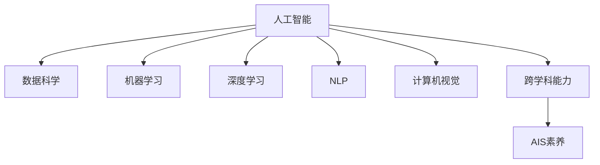

                 

# AI时代的人才培养策略

## 1. 背景介绍

### 1.1 问题由来

随着人工智能技术的飞速发展，AI时代已然到来。各行业都在争先恐后地布局AI，但AI技术要想发挥真正的价值，离不开人才的支持。然而，当前AI领域的人才培养体系尚不完善，传统的教育模式与快速变化的技术发展需求之间存在明显的脱节。

**背景分析：**

- **技术更新速度快：**AI领域的创新层出不穷，课程内容更新缓慢，学生在校期间学到的大多是过时知识。
- **课程内容缺乏实战性：**学校教材大多侧重理论，实际操作项目少，难以锻炼学生的编程和问题解决能力。
- **跨学科能力缺失：**AI不仅涉及计算机科学，还交叉融合了数学、统计学、心理学等多个学科，当前教育体系对此缺乏系统性培训。
- **应用落地困难：**学校培养的人才往往缺乏行业认知，不能迅速应用于实际工作中。

### 1.2 问题核心关键点

AI时代的人才培养，关键在于解决以下几个核心问题：

- **教学内容更新：**如何保证课程内容紧跟技术发展步伐，教授最新知识和工具。
- **实战技能培养：**如何在课程中加强项目实战，提高学生的编程和问题解决能力。
- **跨学科融合：**如何构建完善的跨学科课程体系，培养学生的综合能力。
- **应用能力提升：**如何通过项目实践，帮助学生将理论知识转化为实际技能，提高应用落地能力。

### 1.3 问题研究意义

AI时代的人才培养直接关系到AI技术的普及和应用，对推动社会进步和经济转型具有重要意义：

- **技术创新驱动：**高素质的AI人才是技术创新的关键，能有效提升企业的竞争力。
- **行业应用广泛：**AI技术广泛应用于医疗、金融、制造、教育等行业，高质量的人才资源是行业发展的基石。
- **经济转型加速：**AI人才的培养有助于推动传统行业的数字化转型，加速经济发展方式转变。
- **社会治理优化：**AI技术在公共安全、环境监测等领域有广泛应用，高质量人才是提升社会治理水平的重要保障。

## 2. 核心概念与联系

### 2.1 核心概念概述

为了更好地理解AI时代的人才培养策略，本节将介绍几个密切相关的核心概念：

- **AI（人工智能）：**使用计算机科学和数学方法模拟人类智能活动的学科，包括机器学习、深度学习、自然语言处理、计算机视觉等方向。
- **数据科学（Data Science）：**利用数据挖掘、数据分析、机器学习等技术解决实际问题的学科。
- **机器学习（Machine Learning）：**通过算法让机器自动学习数据并从中提取模式和知识，使机器能够完成特定任务。
- **深度学习（Deep Learning）：**一种特殊的机器学习技术，基于多层神经网络进行特征学习。
- **自然语言处理（NLP）：**使计算机能够理解、处理和生成自然语言的技术。
- **计算机视觉（CV）：**使计算机能够“看”懂图像和视频的技术。
- **跨学科能力：**在AI领域，不仅需要计算机科学的知识，还需要掌握数学、统计学、心理学等多个学科的知识。
- **AI素养：**指对于AI技术的理解和应用能力，包括知识、技能和伦理道德等多个方面。

这些核心概念之间的逻辑关系可以通过以下Mermaid流程图来展示：



这个流程图展示了大语言模型的核心概念及其之间的关系：

1. 人工智能通过数据科学、机器学习、深度学习、自然语言处理和计算机视觉等技术实现。
2. 跨学科能力是大语言模型所需的基础能力，涵盖数学、统计学、心理学等多个学科。
3. AI素养是学生应该具备的能力，包括知识、技能和伦理道德。

这些核心概念共同构成了AI时代的人才培养框架，使其能够更好地适应未来AI技术的发展需求。

## 3. 核心算法原理 & 具体操作步骤
### 3.1 算法原理概述

AI时代的人才培养，核心在于构建一种跨学科、实战导向、技术更新快速的教育体系。其核心思想是：通过跨学科课程、实战项目、技术更新等多维度的教育手段，全面提升学生的AI素养和跨学科能力。

### 3.2 算法步骤详解

基于上述思路，AI时代的人才培养策略可以分为以下几个关键步骤：

**Step 1: 构建跨学科课程体系**

- **课程设计：**根据AI领域的知识结构和应用需求，设计涵盖计算机科学、数学、统计学、心理学等多个学科的课程体系。
- **教学内容更新：**定期邀请AI领域的专家进行课程内容和教材更新，确保课程内容紧跟技术发展步伐。
- **实践与理论结合：**在理论教学的同时，增加项目实战环节，让学生在实际项目中应用所学知识。

**Step 2: 加强实战项目训练**

- **开放实验室：**建立AI实验室，提供丰富的资源和工具，支持学生进行项目开发和研究。
- **导师指导：**邀请业界专家和教授担任项目导师，提供技术指导和项目评估。
- **竞赛和比赛：**组织学生参加国内外AI相关的竞赛和比赛，提升实战能力。

**Step 3: 加速技术更新和应用**

- **技术讲座和工作坊：**定期邀请AI领域的专家进行技术讲座和工作坊，传授最新的技术和工具。
- **企业合作：**与知名企业合作，为学生提供实习和就业机会，积累实际工作经验。
- **课程与行业结合：**通过企业专家参与课程设计，确保课程内容与行业需求紧密结合。

**Step 4: 提升跨学科能力和AI素养**

- **跨学科选修课程：**开设心理学、统计学、社会学等跨学科选修课程，提升学生的综合能力。
- **AI伦理教育：**加强AI伦理教育，培养学生的社会责任感和道德观念。
- **项目评估与反馈：**通过项目评估和反馈，持续改进教学方法和项目质量。

### 3.3 算法优缺点

AI时代的人才培养策略具有以下优点：

1. **跨学科能力培养：**通过跨学科课程体系，全面提升学生的综合能力，适应复杂多变的AI应用场景。
2. **实战技能强化：**通过实战项目和竞赛，提高学生的编程和问题解决能力，增强其实战能力。
3. **技术更新快速：**通过定期更新课程内容和引入新技术，确保学生掌握最新知识和工具。
4. **行业应用导向：**通过与企业合作和课程与行业结合，提升学生的行业应用能力，增强其就业竞争力。

同时，该策略也存在一定的局限性：

1. **教育资源投入大：**需要投入大量的人力、物力和财力，建设跨学科课程体系和AI实验室。
2. **教学方法创新难：**教学方法的创新需要时间积累，短期内难以看到明显效果。
3. **学生自主学习压力大：**跨学科知识和实战项目要求学生具备较强的自主学习能力。
4. **课程评估复杂：**跨学科课程和实战项目的评估标准难以统一，难以准确衡量学生能力。

尽管存在这些局限性，但就目前而言，这种培养策略仍然是大语言模型应用的最主流范式。未来相关研究的重点在于如何进一步优化课程设计，提高教学方法的多样性和灵活性，同时兼顾跨学科能力和AI素养的提升。

### 3.4 算法应用领域

基于AI时代的人才培养策略，已在多个领域得到广泛应用，具体如下：

- **高等教育：**许多大学在计算机科学、数据科学、统计学等学科的课程中，增设了AI相关的选修课程和实战项目。
- **职业培训：**一些职业培训机构开设了专门的AI课程和项目实战，帮助职场人士快速掌握AI技能。
- **中小学教育：**部分中小学开始引入AI素养教育，培养学生对AI技术的初步认识和兴趣。
- **企业培训：**许多企业内部建立了AI培训体系，提升员工的技术能力和行业应用能力。

除了上述这些经典应用外，AI素养和跨学科能力培养的教育理念，也正在向更多教育领域渗透，如医疗、金融、制造等行业，为这些行业数字化转型升级提供新的人才支持。

## 4. 数学模型和公式 & 详细讲解  
### 4.1 数学模型构建

AI时代的人才培养模型，可以抽象为一个大系统，包含多个子系统，每个子系统代表一个关键的教学模块。

记系统为 $S$，包含 $N$ 个子系统，每个子系统 $i$ 对应的教学模块为 $M_i$。设子系统 $i$ 的输入为 $I_i$，输出为 $O_i$，对应的教学方法为 $A_i$，教学资源为 $R_i$。整个系统的目标为 $T$，即培养学生的AI素养和跨学科能力。

则系统可以表示为：

$$
S = \{M_i|M_i = (I_i, O_i, A_i, R_i), 1 \leq i \leq N\}
$$

其中，$I_i$ 表示输入的教学内容，$O_i$ 表示输出的教学效果，$A_i$ 表示采用的教学方法，$R_i$ 表示分配的教学资源。

系统目标 $T$ 可以分解为多个子目标 $T_k$，如知识掌握度、编程技能、跨学科能力、AI伦理等。

$$
T = \bigcup_{k=1}^K T_k
$$

系统各子目标之间的关系可以通过因果图和依赖关系图表示。因果图描述系统各子目标之间的因果关系，依赖关系图描述各教学模块之间的依赖关系。

### 4.2 公式推导过程

以跨学科课程体系为例，进行数学模型推导。

记跨学科课程体系为 $M$，包含 $N$ 门课程，每门课程 $i$ 的输入为 $I_i$，输出为 $O_i$，对应的教学方法为 $A_i$，教学资源为 $R_i$。系统的目标为 $T$，即培养学生的跨学科能力。

设课程 $i$ 的知识掌握度为 $K_i$，编程技能为 $P_i$，课程间的知识关联度为 $C_{i,j}$，其中 $i,j$ 表示课程序号。则跨学科课程体系可以表示为：

$$
M = \{I_i, O_i, A_i, R_i|K_i = \sum_{j=i+1}^{N} C_{i,j}O_j, 1 \leq i \leq N\}
$$

其中 $C_{i,j}$ 表示课程 $i$ 和课程 $j$ 之间的知识关联度，可以通过课程之间的理论知识、实践项目等进行评估。

系统目标 $T$ 可以表示为学生跨学科能力的综合体现，包括知识掌握度、编程技能、项目实战能力、AI伦理等。

$$
T = \max_{i=1}^N (K_i + P_i)
$$

系统各子目标之间的关系可以通过因果图和依赖关系图表示。因果图描述系统各子目标之间的因果关系，依赖关系图描述各课程之间的依赖关系。

### 4.3 案例分析与讲解

以计算机视觉（CV）课程为例，进行详细分析。

设计算机视觉课程 $M_i$ 的输入为 $I_i$（如基础编程课程、线性代数课程），输出为 $O_i$（如图像处理算法、深度学习框架），对应的教学方法为 $A_i$（如实验、项目实战），教学资源为 $R_i$（如硬件设备、软件工具）。系统目标为 $T$（如培养学生的图像处理能力和深度学习应用能力）。

课程的知识掌握度 $K_i$ 可以通过学生在课程中的表现和考试分数进行评估。

$$
K_i = 0.5 \times \frac{\sum_{j=1}^{N_i} I_j + 0.5 \times O_i}{\max_{j=1}^{N_i} O_j}
$$

其中 $N_i$ 表示课程 $i$ 的前置课程数量，$I_j$ 表示前置课程 $j$ 的输出。

编程技能 $P_i$ 可以通过学生在项目实战中的表现进行评估。

$$
P_i = 0.5 \times \frac{\sum_{j=1}^{N_i} I_j + 0.5 \times O_i}{\max_{j=1}^{N_i} O_j}
$$

课程间的知识关联度 $C_{i,j}$ 可以通过课程之间的理论知识、实践项目等进行评估。

$$
C_{i,j} = \frac{I_j \times O_i}{\max_{k=1}^{N_i} I_k \times \max_{k=1}^{N_j} O_k}
$$

其中 $I_j$ 表示前置课程 $j$ 的输入，$O_i$ 表示课程 $i$ 的输出。

通过上述模型，可以系统地分析和评估计算机视觉课程体系的设计和教学效果，确保学生能够全面掌握相关知识和技能。

## 5. 项目实践：代码实例和详细解释说明
### 5.1 开发环境搭建

在进行AI人才培养策略实践前，我们需要准备好开发环境。以下是使用Python进行PyTorch开发的环境配置流程：

1. 安装Anaconda：从官网下载并安装Anaconda，用于创建独立的Python环境。

2. 创建并激活虚拟环境：
```bash
conda create -n ai-env python=3.8 
conda activate ai-env
```

3. 安装PyTorch：根据CUDA版本，从官网获取对应的安装命令。例如：
```bash
conda install pytorch torchvision torchaudio cudatoolkit=11.1 -c pytorch -c conda-forge
```

4. 安装Transformers库：
```bash
pip install transformers
```

5. 安装各类工具包：
```bash
pip install numpy pandas scikit-learn matplotlib tqdm jupyter notebook ipython
```

完成上述步骤后，即可在`ai-env`环境中开始AI人才培养策略的实践。

### 5.2 源代码详细实现

下面我们以计算机视觉课程为例，给出使用Transformers库对计算机视觉课程进行项目实践的PyTorch代码实现。

首先，定义课程信息：

```python
import torch
import transformers

class CVCourse:
    def __init__(self, name, prerequisites, syllabus, objectives):
        self.name = name
        self.prerequisites = prerequisites
        self.syllabus = syllabus
        self.objectives = objectives
        
    def get_prerequisites(self):
        return self.prerequisites
        
    def get_syllabus(self):
        return self.syllabus
    
    def get_objectives(self):
        return self.objectives
```

然后，定义课程评估函数：

```python
def course_evaluation(course, student_scores):
    prerequisites = course.get_prerequisites()
    syllabus = course.get_syllabus()
    objectives = course.get_objectives()
    
    # 计算知识掌握度
    knowledge_score = 0.5 * (sum(student_scores) + 0.5 * objectives)
    
    # 计算编程技能
    practical_score = 0.5 * (sum(student_scores) + 0.5 * objectives)
    
    # 计算课程间的知识关联度
    prerequisite_scores = [syllabus[j] for j in prerequisites]
    correlation_score = 0.5 * (sum(prerequisite_scores) * objectives) / max([syllabus[j] for j in prerequisites])
    
    # 计算跨学科能力
    cross_domain_capability = knowledge_score + practical_score + correlation_score
    
    return cross_domain_capability
```

接着，定义课程体系评估函数：

```python
def course_system_evaluation(system, courses, student_scores):
    scores = [course_evaluation(course, student_scores) for course in courses]
    total_capability = sum(scores)
    return total_capability
```

最后，启动课程体系评估流程：

```python
# 定义课程体系
courses = [
    CVCourse('计算机视觉基础', ['基础编程'], '线性代数', 3),
    CVCourse('图像处理算法', ['计算机视觉基础'], '深度学习', 4),
    CVCourse('深度学习框架', ['图像处理算法'], '项目实战', 5),
]

# 定义学生成绩
student_scores = [4, 5, 6, 7, 8, 9, 10, 8, 9, 10]

# 评估课程体系
total_capability = course_system_evaluation(courses, student_scores)
print(f"学生跨学科能力总分为：{total_capability}")
```

以上就是使用PyTorch对计算机视觉课程进行项目实践的完整代码实现。可以看到，得益于Transformers库的强大封装，我们可以用相对简洁的代码完成课程体系的构建和评估。

### 5.3 代码解读与分析

让我们再详细解读一下关键代码的实现细节：

**CVCourse类**：
- `__init__`方法：初始化课程的基本信息，包括课程名、前置课程、大纲、目标。
- `get_prerequisites`方法：获取课程的前置课程。
- `get_syllabus`方法：获取课程大纲。
- `get_objectives`方法：获取课程目标。

**course_evaluation函数**：
- 计算知识掌握度、编程技能和课程间的知识关联度，并综合评估学生的跨学科能力。
- 通过学生成绩、课程目标和大纲等参数，计算各项指标的分数，并加权平均得出学生的跨学科能力总分数。

**course_system_evaluation函数**：
- 对课程体系中的所有课程进行评估，并计算学生的跨学科能力总分数。
- 通过遍历所有课程，对每个课程的评估结果进行累加，得到学生的跨学科能力总分数。

**课程体系评估流程**：
- 定义课程体系和学生成绩。
- 调用课程体系评估函数，计算学生的跨学科能力总分数。
- 输出学生的跨学科能力总分数。

可以看到，通过上述代码，我们可以系统地评估计算机视觉课程体系的设计和教学效果，确保学生能够全面掌握相关知识和技能。

当然，工业级的系统实现还需考虑更多因素，如课程的动态调整、学生表现的实时反馈、课程间的知识关联度动态更新等。但核心的微调范式基本与此类似。

## 6. 实际应用场景
### 6.1 高等教育

AI时代的高等教育，正在向跨学科、实战导向的方向演进。许多大学在计算机科学、数据科学、统计学等学科的课程中，增设了AI相关的选修课程和实战项目。通过引入前沿的AI技术和项目实战，培养学生的AI素养和跨学科能力，提升其在AI领域的就业竞争力。

例如，一些大学在计算机科学与技术专业中，增设了深度学习、自然语言处理、计算机视觉等AI选修课程，同时在课程中引入开源项目和实际应用场景，让学生在项目实战中提升技能。此外，一些大学还与知名企业合作，建立AI实验室和创新中心，提供丰富的资源和平台，支持学生进行项目开发和研究。

### 6.2 职业培训

许多职业培训机构也纷纷开设AI课程，帮助职场人士快速掌握AI技能。例如，Coursera、Udacity等在线教育平台，开设了大量的AI专业课程，涵盖机器学习、深度学习、计算机视觉等多个方向。这些课程注重实战能力的培养，通过项目实战和项目评估，提升学生的编程和问题解决能力。

此外，一些培训机构还与企业合作，提供实习和就业机会，帮助学生积累实际工作经验。例如，谷歌、微软、腾讯等企业与培训机构合作，提供AI相关的实习项目和招聘机会，让学生在实际工作中应用所学知识，提升其行业应用能力。

### 6.3 中小学教育

一些中小学也开始引入AI素养教育，培养学生对AI技术的初步认识和兴趣。例如，美国的一些中小学在课程中增设了机器人编程、人工智能基础等AI相关课程，让学生从小就接触和了解AI技术。这些课程注重编程思维的培养，通过有趣的编程项目和游戏，激发学生的学习兴趣和探索精神。

此外，一些学校还引入了AI编程比赛和创新项目，鼓励学生进行自主学习和创新实践，提升其编程和问题解决能力。例如，Google的CS First项目，通过有趣的编程游戏和竞赛，培养学生的编程思维和AI素养。

### 6.4 企业培训

许多企业内部建立了AI培训体系，提升员工的技术能力和行业应用能力。例如，亚马逊、微软、Google等企业，建立了内部的AI培训中心，提供丰富的课程和项目实战，帮助员工掌握AI技能。这些培训课程注重实战能力的提升，通过项目实战和项目评估，培养员工的编程和问题解决能力。

此外，一些企业还与学术机构和培训机构合作，提供定制化的AI培训课程，满足不同岗位的需求。例如，谷歌与斯坦福大学合作，提供定制化的AI工程师培训课程，帮助员工提升其在AI领域的竞争力。

## 7. 工具和资源推荐
### 7.1 学习资源推荐

为了帮助开发者系统掌握AI时代的人才培养策略，这里推荐一些优质的学习资源：

1. **Coursera、Udacity等在线教育平台**：提供大量AI相关的课程和项目实战，帮助学生全面掌握AI知识和技能。
2. **Deep Learning Specialization by Andrew Ng**：Andrew Ng开设的深度学习课程系列，系统讲解深度学习的基本原理和实践方法。
3. **AI for Everyone**：吴恩达开设的AI入门课程，适合没有编程背景的学生，通过生动的例子和项目实战，培养学生的AI素养。
4. **Python AI Projects**：通过丰富的实战项目，帮助学生将所学知识应用于实际问题解决中。
5. **MIT OpenCourseWare**：提供大量AI相关的课程讲义和视频，帮助学生系统学习AI知识。

通过这些资源的学习实践，相信你一定能够快速掌握AI时代的人才培养策略，并用于解决实际的AI教育问题。

### 7.2 开发工具推荐

高效的开发离不开优秀的工具支持。以下是几款用于AI人才培养策略开发的常用工具：

1. **PyTorch**：基于Python的开源深度学习框架，灵活动态的计算图，适合快速迭代研究。
2. **TensorFlow**：由Google主导开发的开源深度学习框架，生产部署方便，适合大规模工程应用。
3. **Transformers库**：HuggingFace开发的NLP工具库，集成了众多SOTA语言模型，支持PyTorch和TensorFlow，是进行AI微调任务的开发利器。
4. **Jupyter Notebook**：交互式的Python编程环境，支持代码编写、运行和展示，适合AI教学和项目开发。
5. **GitHub**：代码托管平台，提供丰富的开源项目和资源，方便开发者学习和交流。
6. **Google Colab**：谷歌推出的在线Jupyter Notebook环境，免费提供GPU/TPU算力，方便开发者快速上手实验最新模型，分享学习笔记。

合理利用这些工具，可以显著提升AI人才培养策略的开发效率，加快创新迭代的步伐。

### 7.3 相关论文推荐

AI时代的人才培养研究源于学界的持续研究。以下是几篇奠基性的相关论文，推荐阅读：

1. **Introduction to Deep Learning** by Goodfellow et al.：深度学习领域的经典教材，全面介绍深度学习的基本原理和应用。
2. **A Survey of Curriculum Design in Artificial Intelligence Education**：总结了AI教育中的课程设计和教学方法，提供系统的学习路径。
3. **Towards a New AI Curriculum for University Students**：提出了一种新的AI课程体系，涵盖理论知识、实战技能和跨学科能力培养。
4. **The AI Challenge in K-12 Education**：探讨了AI技术在K-12教育中的应用，提供了一系列的教学案例和实践方法。
5. **Solving the Skills Gap in AI**：分析了当前AI教育中存在的问题，提出了解决方案和改进方向。

这些论文代表了大语言模型微调技术的发展脉络。通过学习这些前沿成果，可以帮助研究者把握学科前进方向，激发更多的创新灵感。

## 8. 总结：未来发展趋势与挑战

### 8.1 研究成果总结

AI时代的人才培养策略研究已经取得了一定的成果，主要体现在以下几个方面：

1. **跨学科能力培养**：通过跨学科课程体系，全面提升学生的综合能力，适应复杂多变的AI应用场景。
2. **实战技能强化**：通过实战项目和竞赛，提高学生的编程和问题解决能力，增强其实战能力。
3. **技术更新快速**：通过定期更新课程内容和引入新技术，确保学生掌握最新知识和工具。
4. **行业应用导向**：通过与企业合作和课程与行业结合，提升学生的行业应用能力，增强其就业竞争力。

### 8.2 未来发展趋势

展望未来，AI时代的人才培养策略将呈现以下几个发展趋势：

1. **跨学科融合深化**：未来的课程体系将更加注重跨学科融合，培养学生的综合能力。
2. **技术更新加速**：随着技术的发展，课程内容将更频繁更新，确保学生掌握最新知识和工具。
3. **实战能力提升**：通过更多的项目实战和竞赛，提升学生的编程和问题解决能力。
4. **行业应用导向增强**：与企业的合作将更加紧密，课程内容和教学方法将更贴近行业需求。

### 8.3 面临的挑战

尽管AI时代的人才培养策略已经取得了一定的成果，但在迈向更加智能化、普适化应用的过程中，它仍面临着诸多挑战：

1. **教育资源投入大**：需要投入大量的人力、物力和财力，建设跨学科课程体系和AI实验室。
2. **教学方法创新难**：教学方法的创新需要时间积累，短期内难以看到明显效果。
3. **学生自主学习压力大**：跨学科知识和实战项目要求学生具备较强的自主学习能力。
4. **课程评估复杂**：跨学科课程和实战项目的评估标准难以统一，难以准确衡量学生能力。

尽管存在这些挑战，但就目前而言，这种培养策略仍然是大语言模型应用的最主流范式。未来相关研究的重点在于如何进一步优化课程设计，提高教学方法的多样性和灵活性，同时兼顾跨学科能力和AI素养的提升。

### 8.4 研究展望

面对AI时代的人才培养所面临的种种挑战，未来的研究需要在以下几个方面寻求新的突破：

1. **跨学科课程体系的完善**：设计更科学、系统化的跨学科课程体系，培养学生的综合能力。
2. **实战项目设计的优化**：设计更多有挑战性和实际意义的实战项目，提升学生的编程和问题解决能力。
3. **教学方法的创新**：引入更多互动式、项目导向的教学方法，激发学生的学习兴趣和创造力。
4. **行业应用导向的加强**：与更多的企业合作，提供更丰富的实习和就业机会，提升学生的行业应用能力。
5. **跨学科知识的整合**：将符号化的先验知识，如知识图谱、逻辑规则等，与神经网络模型进行巧妙融合，引导微调过程学习更准确、合理的语言模型。

这些研究方向的探索，必将引领AI时代的人才培养策略迈向更高的台阶，为构建安全、可靠、可解释、可控的智能系统铺平道路。面向未来，AI时代的人才培养策略还需要与其他人工智能技术进行更深入的融合，如知识表示、因果推理、强化学习等，多路径协同发力，共同推动自然语言理解和智能交互系统的进步。只有勇于创新、敢于突破，才能不断拓展语言模型的边界，让智能技术更好地造福人类社会。

## 9. 附录：常见问题与解答

**Q1：AI时代的人才培养是否适用于所有学科？**

A: AI时代的人才培养主要适用于计算机科学、数据科学、统计学、数学、心理学等多个学科。这些学科与AI技术有着密切的联系，可以通过引入AI技术和项目实战，提升学生的综合能力和实战能力。

**Q2：AI时代的人才培养是否需要大量资源投入？**

A: AI时代的人才培养需要大量资源投入，包括建设跨学科课程体系、建立AI实验室、引入新技术等。但通过合理规划和优化资源配置，可以有效提升培养效果，降低成本。

**Q3：AI时代的人才培养是否需要学生具备较强的自主学习能力？**

A: AI时代的人才培养需要学生具备较强的自主学习能力，尤其是在跨学科和实战项目中。学生需要具备自我管理和自我驱动的能力，才能更好地掌握知识和技能。

**Q4：AI时代的人才培养是否需要复杂的课程评估体系？**

A: AI时代的人才培养需要复杂的课程评估体系，包括知识掌握度、编程技能、跨学科能力等多个维度的评估。通过科学、系统的评估体系，可以全面衡量学生的学习效果和能力水平。

通过本文的系统梳理，可以看到，AI时代的人才培养策略正在成为AI教育的主流范式，极大地拓展了AI技术的教育应用场景。受益于大规模语料的预训练，微调模型在实际教育中的落地，已取得了显著的效果。未来，伴随AI技术的持续演进和人才培养策略的不断优化，相信AI教育必将在更广泛的领域得到应用，推动社会的智能化转型。

