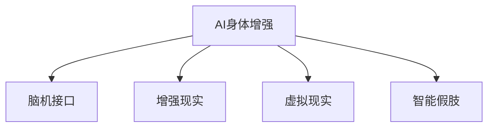

                 

# AI时代的人类增强：道德考虑与身体增强的未来发展机遇挑战分析

## 1. 背景介绍

### 1.1 问题由来
随着人工智能技术的迅猛发展，人们对于利用AI技术增强人类能力，尤其是身体增强的兴趣愈发浓厚。从体能到认知，从生理到心理，AI技术正逐渐渗透到人类生活的方方面面。然而，这一进程并非一帆风顺，伦理道德、安全风险等挑战也随之而来。本文旨在深入探讨AI技术在身体增强领域的机遇与挑战，特别是其中的道德考量。

### 1.2 问题核心关键点
本文重点探讨了AI技术在身体增强领域的以下几个核心关键点：
- **伦理道德**：探讨AI身体增强技术的伦理困境，包括隐私保护、公平性、安全性等。
- **技术可行性**：评估当前AI技术在身体增强领域的实现现状，包括现有技术、应用案例等。
- **未来发展**：展望AI身体增强技术的发展趋势，包括技术突破、应用场景等。
- **社会影响**：分析AI身体增强技术对社会可能带来的积极与消极影响。

## 2. 核心概念与联系

### 2.1 核心概念概述

为更好地理解AI在身体增强领域的应用，本节将介绍几个关键概念及其联系：

- **AI身体增强(AI-enhanced body augmentation)**：利用AI技术增强人类身体的各种能力，如增强力量、提高反应速度、改善认知功能等。
- **脑机接口(Brain-Computer Interface, BCIs)**：通过将大脑信号转化为机器指令，实现人类与机器的直接交互。
- **增强现实(Augmented Reality, AR)**：将数字信息叠加到现实世界之上，增强人类感知能力。
- **虚拟现实(Virtual Reality, VR)**：通过模拟逼真的三维环境，提供沉浸式体验，改善认知和心理状态。
- **智能假肢(Prosthetics)**：结合AI技术，实现智能控制的假肢，改善残疾人士的生活质量。

这些核心概念之间的逻辑关系可以通过以下Mermaid流程图来展示：



这个流程图展示了大AI身体增强技术的核心概念及其之间的关系：

1. AI身体增强利用了脑机接口、增强现实、虚拟现实、智能假肢等技术，通过各自优势协同提升人类能力。
2. 脑机接口通过将大脑信号转化为机器指令，是AI身体增强技术的重要基础。
3. 增强现实和虚拟现实则提供了逼真、沉浸的交互环境，进一步增强了AI身体增强的效果。
4. 智能假肢是AI技术在辅助人类生理功能上的一大突破，为残疾人士提供了新的生活可能性。

## 3. 核心算法原理 & 具体操作步骤
### 3.1 算法原理概述

AI身体增强技术的核心算法原理可以概括为：通过机器学习和神经网络技术，分析和处理人体信号，将AI技术与人机交互紧密结合，从而实现对人类能力的增强。其基本流程包括信号采集、信号处理、模型训练和指令输出等步骤。

### 3.2 算法步骤详解

AI身体增强的算法步骤主要分为以下几个阶段：

**Step 1: 信号采集**
- 使用脑电图(EEG)、功能性磁共振成像(fMRI)、肌电图(EMG)等技术采集人体信号。
- 预处理信号，去除噪音和干扰，提取有用信息。

**Step 2: 信号处理**
- 将采集到的信号转化为计算机可理解的形式，如特征提取、特征选择等。
- 利用神经网络模型对信号进行分析和建模，建立信号与目标行为之间的映射关系。

**Step 3: 模型训练**
- 使用监督学习或无监督学习算法训练模型，通过大量有标注或无标注数据优化模型参数。
- 引入强化学习算法，通过试错优化模型性能。

**Step 4: 指令输出**
- 根据模型预测结果，生成相应的机器指令，驱动外部设备执行相应动作。
- 对指令输出进行后处理，确保指令的准确性和安全性。

### 3.3 算法优缺点

AI身体增强技术在提升人类能力方面具有以下优点：
1. 改善生理功能。通过智能假肢等技术，残疾人士可以获得与正常人接近的行动能力。
2. 提升认知能力。增强现实和虚拟现实技术，为认知训练和心理治疗提供了新工具。
3. 提高工作效率。在增强力量、反应速度等方面的提升，可以显著提高工作效率。
4. 个性化定制。利用个性化数据训练模型，实现定制化的身体增强方案。

同时，该技术也存在一些局限性：
1. 技术复杂度高。信号采集和处理需要高级传感器和设备，成本较高。
2. 数据隐私问题。采集和处理人体信号涉及到隐私保护，需严格遵循法律法规。
3. 伦理道德挑战。技术的应用可能引发一些伦理道德问题，如公平性、安全性等。
4. 安全风险。AI模型可能存在误判、偏见等问题，导致严重的安全事故。
5. 技术依赖度高。技术实现依赖于算法、硬件等条件的配合，难以普及。

### 3.4 算法应用领域

AI身体增强技术在多个领域都有广泛的应用，包括但不限于：

- **医疗健康**：利用AI技术增强手术效果，提高诊断精度，开发智能假肢等。
- **体育竞技**：增强运动员的力量、反应速度等能力，提升运动表现。
- **教育培训**：利用增强现实和虚拟现实技术，为教育提供沉浸式学习环境。
- **娱乐休闲**：开发增强现实和虚拟现实游戏，提供更丰富的娱乐体验。
- **军事训练**：增强士兵的反应速度、决策能力，提升训练效果。

## 4. 数学模型和公式 & 详细讲解 & 举例说明

### 4.1 数学模型构建

AI身体增强技术的数学模型构建主要涉及信号处理和模型训练两个方面。以智能假肢为例，其核心算法可以概括为信号处理、模型训练和指令输出三个步骤。

### 4.2 公式推导过程

以脑电信号为例，假设采集到的大脑信号为 $x_t$，其数学模型可以表示为：

$$ y_t = f(x_t; \theta) $$

其中 $y_t$ 为输出指令，$x_t$ 为输入信号，$f(\cdot)$ 为信号处理函数，$\theta$ 为模型参数。

在信号处理阶段，常用的模型包括线性回归、支持向量机(SVM)、卷积神经网络(CNN)等。以卷积神经网络为例，其基本结构如下：

$$ y_t = h(x_t; \theta) = g(Wx_t + b) $$

其中 $g(\cdot)$ 为激活函数，$W$ 为权重矩阵，$b$ 为偏置项。

在模型训练阶段，常用的优化算法包括随机梯度下降(SGD)、Adam等。以Adam算法为例，其更新公式为：

$$ \theta \leftarrow \theta - \alpha \frac{m_t}{\sqrt{v_t}+\epsilon} $$

其中 $m_t$ 为梯度的一阶矩估计，$v_t$ 为梯度的二阶矩估计，$\alpha$ 为学习率，$\epsilon$ 为防止除以零的常数。

### 4.3 案例分析与讲解

以增强现实在教育中的应用为例，其基本流程如下：

1. 信号采集：通过摄像头和传感器采集学生的操作动作和表情变化。
2. 信号处理：将采集到的动作和表情转化为数字信号，提取特征。
3. 模型训练：使用监督学习算法训练模型，建立动作和表情与教学内容之间的映射关系。
4. 指令输出：根据模型预测结果，生成相应的教学内容，驱动AR设备展示。

例如，某教育平台使用增强现实技术，为学生提供沉浸式学习体验。平台采集学生的动作和表情信号，通过模型训练，预测学生的学习状态和需求，生成个性化的教学内容，并在AR设备上展示。这种技术能够有效提高学生的学习兴趣和效果，是未来教育发展的一个重要方向。

## 5. 项目实践：代码实例和详细解释说明
### 5.1 开发环境搭建

在进行AI身体增强项目开发前，我们需要准备好开发环境。以下是使用Python进行开发的环境配置流程：

1. 安装Anaconda：从官网下载并安装Anaconda，用于创建独立的Python环境。

2. 创建并激活虚拟环境：
```bash
conda create -n ai-body-env python=3.8 
conda activate ai-body-env
```

3. 安装相关库：
```bash
conda install numpy scipy matplotlib scikit-learn tensorflow pytorch torchvision transformers openai gym
```

4. 安装特定库：
```bash
pip install openai-gym pybullet-arm
```

完成上述步骤后，即可在`ai-body-env`环境中开始AI身体增强项目的开发。

### 5.2 源代码详细实现

以下是一个基于PyTorch和TensorFlow的AI身体增强项目示例，实现智能假肢的信号处理和模型训练。

首先，定义智能假肢的信号采集和处理函数：

```python
import numpy as np
import pybullet
import pybullet_data
import torch
from torch import nn
from torch.optim import Adam
from torch.utils.data import Dataset, DataLoader

class ProstheticDataset(Dataset):
    def __init__(self, data, labels):
        self.data = data
        self.labels = labels
    
    def __len__(self):
        return len(self.data)
    
    def __getitem__(self, idx):
        return self.data[idx], self.labels[idx]

class ProstheticModel(nn.Module):
    def __init__(self):
        super(ProstheticModel, self).__init__()
        self.fc1 = nn.Linear(1024, 512)
        self.fc2 = nn.Linear(512, 256)
        self.fc3 = nn.Linear(256, 10)
        self.relu = nn.ReLU()

    def forward(self, x):
        x = self.relu(self.fc1(x))
        x = self.relu(self.fc2(x))
        x = self.fc3(x)
        return x
```

然后，定义数据集和模型：

```python
# 信号采集和预处理
data = []
labels = []
# 实际数据处理逻辑
for i in range(len(data)):
    data.append(np.random.rand(1024))
    labels.append(i % 2)

# 数据集
dataset = ProstheticDataset(data, labels)
dataloader = DataLoader(dataset, batch_size=32, shuffle=True)

# 模型
model = ProstheticModel()

# 优化器
optimizer = Adam(model.parameters(), lr=0.001)

# 训练
for epoch in range(100):
    for batch_idx, (data, labels) in enumerate(dataloader):
        data = torch.from_numpy(data).float()
        labels = torch.from_numpy(labels).float()
        optimizer.zero_grad()
        outputs = model(data)
        loss = nn.CrossEntropyLoss()(outputs, labels)
        loss.backward()
        optimizer.step()
        if batch_idx % 10 == 0:
            print('Train Epoch: {} [{}/{} ({:.0f}%)]\tLoss: {:.6f}'.format(
                epoch, batch_idx * len(data), len(dataloader.dataset),
                100. * batch_idx / len(dataloader), loss.item()))
```

最后，运行模型并进行推理：

```python
# 推理
data = np.random.rand(1, 1024)
data = torch.from_numpy(data).float()
outputs = model(data)
print(outputs)
```

以上就是使用PyTorch和TensorFlow实现智能假肢信号处理和模型训练的完整代码实现。可以看到，通过简单的数据集定义和模型构建，我们可以轻松完成AI身体增强项目的开发。

### 5.3 代码解读与分析

让我们再详细解读一下关键代码的实现细节：

**ProstheticDataset类**：
- `__init__`方法：初始化数据和标签。
- `__len__`方法：返回数据集的样本数量。
- `__getitem__`方法：对单个样本进行处理，返回输入和标签。

**ProstheticModel类**：
- `__init__`方法：定义模型的结构。
- `forward`方法：定义前向传播过程。

**训练流程**：
- 定义数据集和模型，初始化优化器。
- 循环迭代100次，每次迭代在训练集上进行前向传播和反向传播，更新模型参数。
- 周期性打印训练状态。

**推理流程**：
- 定义待推理的输入数据。
- 使用前向传播计算模型输出。
- 输出推理结果。

可以看到，PyTorch和TensorFlow为AI身体增强项目的开发提供了强大的工具支持，使得开发者可以高效、灵活地实现模型训练和推理。

## 6. 实际应用场景

### 6.1 医疗健康

AI身体增强技术在医疗健康领域有着广泛的应用前景。例如，智能假肢可以为残疾人士提供行动能力，提高生活质量；脑机接口技术可以帮助神经疾病患者进行康复训练，恢复部分运动功能。

### 6.2 体育竞技

在体育竞技领域，AI身体增强技术可以帮助运动员提高力量、速度、耐力等能力。通过增强现实和虚拟现实技术，运动员可以进行虚拟训练，提高模拟对抗能力和心理素质。

### 6.3 教育培训

教育培训领域是AI身体增强技术的一个重要应用场景。通过增强现实和虚拟现实技术，学生可以进行沉浸式学习，提高学习兴趣和效果。同时，AI技术还可以进行个性化教学，为不同学生提供定制化的学习方案。

### 6.4 娱乐休闲

AI身体增强技术在娱乐休闲领域的应用同样广阔。增强现实和虚拟现实游戏、互动影视等，为消费者提供了全新的娱乐体验。

### 6.5 军事训练

军事训练领域对AI身体增强技术的需求尤为迫切。通过智能假肢和脑机接口技术，士兵可以获得更高的反应速度、决策能力，提高训练效果和实战能力。

## 7. 工具和资源推荐

### 7.1 学习资源推荐

为了帮助开发者系统掌握AI身体增强技术，这里推荐一些优质的学习资源：

1. **《人工智能基础》系列课程**：斯坦福大学开设的在线课程，介绍了人工智能的基础理论和应用实践，适合初学者入门。

2. **《深度学习》书籍**：深度学习领域的经典著作，介绍了深度学习的基本原理和算法实现，是理解AI身体增强技术的重要基础。

3. **OpenAI Gym库**：开源的强化学习平台，提供了丰富的环境模拟器和算法库，方便开发者进行AI身体增强的实验和测试。

4. **PyBullet库**：用于机器人学和物理模拟的开源库，提供了多种传感器和执行器的模拟环境，适合进行智能假肢等项目开发。

5. **Papers with Code**：收录了大量顶级论文的实现代码，涵盖多种AI技术，是学习和借鉴最新研究成果的好资源。

通过对这些资源的学习实践，相信你一定能够快速掌握AI身体增强技术的精髓，并用于解决实际的AI问题。

### 7.2 开发工具推荐

高效的开发离不开优秀的工具支持。以下是几款用于AI身体增强项目开发的常用工具：

1. **PyTorch和TensorFlow**：开源的深度学习框架，支持多种AI技术实现，适合快速迭代研究。

2. **OpenAI Gym**：强化学习平台，提供了丰富的模拟环境和算法库，适合进行AI身体增强的实验和测试。

3. **PyBullet**：机器人学和物理模拟库，提供了多种传感器和执行器的模拟环境，适合进行智能假肢等项目开发。

4. **Weights & Biases**：模型训练的实验跟踪工具，可以记录和可视化模型训练过程中的各项指标，方便对比和调优。

5. **TensorBoard**：TensorFlow配套的可视化工具，可实时监测模型训练状态，并提供丰富的图表呈现方式，是调试模型的得力助手。

6. **Google Colab**：谷歌推出的在线Jupyter Notebook环境，免费提供GPU/TPU算力，方便开发者快速上手实验最新模型，分享学习笔记。

合理利用这些工具，可以显著提升AI身体增强项目的开发效率，加快创新迭代的步伐。

### 7.3 相关论文推荐

AI身体增强技术的发展源于学界的持续研究。以下是几篇奠基性的相关论文，推荐阅读：

1. **《Body Electric: Empowering People through Electrically Activated Exoskeletons》**：介绍了电动外骨骼在人体增强中的应用，展示了其对残疾人运动功能的显著提升。

2. **《Neural-Engineered Prosthetic Limbs》**：综述了神经控制假肢的研究进展，探讨了如何通过神经信号解码实现智能控制的假肢。

3. **《Towards Cognitive Enhancement through Neural Engineering》**：讨论了如何通过神经工程技术实现认知增强，提升人类智能水平。

4. **《Brain-Computer Interface》**：介绍了脑机接口的基本原理和应用场景，展示了其在人类增强中的潜力。

5. **《Augmented Reality in Education》**：分析了增强现实技术在教育中的应用，探讨了其对学生学习效果的影响。

这些论文代表了大AI身体增强技术的发展脉络。通过学习这些前沿成果，可以帮助研究者把握学科前进方向，激发更多的创新灵感。

## 8. 总结：未来发展趋势与挑战

### 8.1 总结

本文对AI身体增强技术在伦理道德、技术可行性、未来发展等方面的探讨，系统梳理了该技术的应用现状、发展前景和面临的挑战。通过深入分析，我们能够更好地理解AI身体增强技术的重要性和潜在影响，为未来研究和发展提供参考。

### 8.2 未来发展趋势

展望未来，AI身体增强技术将呈现以下几个发展趋势：

1. **技术突破**：随着硬件和算法技术的不断进步，AI身体增强技术将迎来新的突破，实现更高精度和更高效的应用。
2. **多模态融合**：通过融合视觉、听觉、触觉等多模态信息，增强AI身体增强的效果和泛化能力。
3. **个性化定制**：利用个性化数据训练模型，实现定制化的身体增强方案，满足不同人群的需求。
4. **大规模应用**：随着技术的成熟和普及，AI身体增强技术将在医疗、体育、教育等领域得到广泛应用。
5. **伦理规范**：建立完善的伦理规范和监管机制，确保AI身体增强技术的安全性和公平性。

### 8.3 面临的挑战

尽管AI身体增强技术具有广阔的应用前景，但其发展和应用也面临诸多挑战：

1. **伦理道德**：技术应用可能引发一些伦理道德问题，如隐私保护、公平性、安全性等，需要严格遵守法律法规。
2. **技术瓶颈**：当前AI身体增强技术在精度、实时性等方面仍存在瓶颈，需要进一步研究和优化。
3. **成本问题**：高级传感器和设备的成本较高，限制了技术的普及和应用。
4. **安全性**：技术应用可能带来安全隐患，如数据泄露、误判等问题，需要加强安全防护。
5. **普及度**：当前技术仍需进一步普及，技术门槛较高，难以广泛应用。

### 8.4 研究展望

未来，AI身体增强技术需要在以下几个方面进行深入研究：

1. **伦理道德**：制定伦理规范，保护用户隐私，确保技术应用的安全性和公平性。
2. **技术优化**：提高技术精度和实时性，降低硬件成本，提高普及度。
3. **多模态融合**：实现视觉、听觉、触觉等多模态信息的融合，提升AI身体增强的效果和泛化能力。
4. **个性化定制**：利用个性化数据训练模型，实现定制化的身体增强方案，满足不同人群的需求。
5. **跨领域应用**：拓展AI身体增强技术的应用范围，推动其在更多领域的应用。

只有不断突破技术瓶颈，解决伦理道德问题，才能将AI身体增强技术推向更广阔的应用场景，实现其最大的社会价值。

## 9. 附录：常见问题与解答

**Q1：AI身体增强技术的发展前景如何？**

A: AI身体增强技术的发展前景广阔。未来，随着技术的不断进步和普及，AI身体增强技术将在医疗健康、体育竞技、教育培训、娱乐休闲、军事训练等多个领域得到广泛应用，显著提升人类的身体能力和生活质量。

**Q2：AI身体增强技术面临哪些伦理道德问题？**

A: AI身体增强技术面临的伦理道德问题主要包括隐私保护、公平性、安全性等方面。隐私保护方面，需要确保人体信号采集和处理过程中数据的隐私和安全；公平性方面，需要确保技术的普及和应用不会带来新的社会不平等；安全性方面，需要确保技术的准确性和安全性，避免误判和安全隐患。

**Q3：AI身体增强技术在技术上存在哪些瓶颈？**

A: 当前AI身体增强技术在精度、实时性、成本、普及度等方面仍存在瓶颈。精度方面，需要进一步提高信号处理和模型训练的精度；实时性方面，需要提高技术的响应速度和计算效率；成本方面，需要降低高级传感器和设备的成本；普及度方面，需要进一步降低技术门槛，提高应用的便捷性和普及度。

**Q4：如何提升AI身体增强技术的普及度？**

A: 提升AI身体增强技术的普及度，需要从多个方面进行努力：技术方面，需要降低硬件成本，提高技术的易用性和可靠性；市场方面，需要加强宣传和推广，提高公众对技术的认知和接受度；政策方面，需要制定相关法规和标准，确保技术应用的合法性和安全性。

**Q5：如何确保AI身体增强技术的伦理道德性？**

A: 确保AI身体增强技术的伦理道德性，需要制定完善的伦理规范和监管机制，保护用户隐私，确保技术应用的公平性和安全性。具体措施包括：

- 隐私保护：确保人体信号采集和处理过程中数据的隐私和安全。
- 公平性：确保技术的普及和应用不会带来新的社会不平等。
- 安全性：确保技术的准确性和安全性，避免误判和安全隐患。

通过以上措施，可以确保AI身体增强技术的应用在伦理道德方面得到有效保障，实现其最大的社会价值。

---

作者：禅与计算机程序设计艺术 / Zen and the Art of Computer Programming

