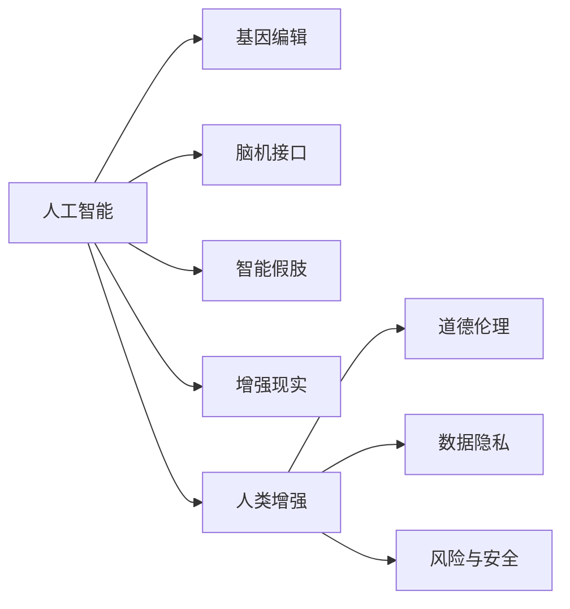

                 

# AI时代的人类增强：道德考虑与身体增强的未来趋势与挑战

> 关键词：人工智能,人类增强,道德,伦理,未来趋势,技术挑战

## 1. 背景介绍

### 1.1 问题由来

随着人工智能(AI)技术的迅猛发展，尤其是深度学习、机器学习等领域的突破，人类增强技术正在迎来前所未有的机遇和挑战。从生物医学、神经科学到人工智能，一系列前沿技术的融合，推动了从基因编辑、脑机接口到智能假肢等身体增强技术的快速发展。这些技术的进步，不仅拓宽了人类能力的边界，也带来了深远的社会伦理问题。

人类增强的核心目标是通过技术手段，提升或增强人类的认知能力、身体功能和整体表现。基因编辑技术（如CRISPR）、脑机接口（如Neuralink）、智能假肢（如iRobot）、增强现实（如Meta Verse）等，都是当前热门的人类增强技术。这些技术的快速进步，使得人类增强的前景充满无限可能，但也带来了伦理道德的挑战。

## 2. 核心概念与联系

### 2.1 核心概念概述

为更好地理解AI时代的人类增强及其相关的道德问题，本节将介绍几个关键概念：

- 人工智能(Artificial Intelligence, AI)：通过算法和计算，使计算机模拟、扩展或替代人类智能的领域。
- 人类增强(Human Enhancement)：利用技术手段增强人类的认知、身体和心理能力，提高生活质量和社会竞争力。
- 基因编辑(Gene Editing)：如CRISPR-Cas9技术，通过修改生物遗传信息，干预基因表达和生物过程。
- 脑机接口(Brain-Computer Interface, BCI)：使大脑和计算机之间直接通信的技术，实现人机交互。
- 智能假肢(Prosthetic Limbs)：利用AI技术辅助或替代受伤或残障人群的肢体功能。
- 增强现实(Augmented Reality, AR)：通过数字信息增强现实环境，提升用户感知体验。
- 道德伦理(Ethics)：涉及人类行为和决策的善恶评价、权利义务等价值问题。
- 数据隐私(Privacy)：保护个人信息免遭未经授权访问和使用，是增强技术应用中必须考虑的重要问题。
- 风险与安全(Security)：评估和规避增强技术可能带来的各种潜在风险，保障用户和公众的安全。

这些核心概念之间的联系紧密，共同构成了AI时代人类增强的伦理和实践框架。

### 2.2 核心概念原理和架构的 Mermaid 流程图



这个流程图展示了AI时代人类增强的各个技术领域以及其伦理、隐私和安全问题的联系。

## 3. 核心算法原理 & 具体操作步骤
### 3.1 算法原理概述

AI时代的人类增强，涉及多个技术和学科的交叉应用，其核心算法原理和操作步骤可以概括为：

- **基因编辑算法**：通过CRISPR-Cas9等技术，对目标基因进行精确切割、修复或替换，从而干预生物体的遗传信息。
- **脑机接口算法**：使用神经信号采集、信号处理和解码技术，将人脑的神经信号转换为计算机可读的控制指令，实现人机交互。
- **智能假肢算法**：结合传感器、微处理器和机器学习技术，使假肢具备感知环境、自主决策和自适应能力，提升使用者的生活质量。
- **增强现实算法**：通过AR技术，将虚拟信息叠加到现实环境中，提升用户的感知体验和交互能力。

### 3.2 算法步骤详解

以**智能假肢算法**为例，详细描述其操作步骤：

1. **数据采集与处理**：使用传感器获取假肢与环境的交互数据，如力觉、温度、压力等，经过预处理和滤波，提取有用的信号特征。

2. **模型训练**：使用机器学习算法训练预测模型，预测用户意图和行为，如抓住、放取、移动等。

3. **决策与控制**：将模型的预测结果转化为假肢的控制指令，如调整电机转速、施加力矩等。

4. **反馈与优化**：利用用户反馈，对模型进行实时调整和优化，提升假肢的性能和舒适度。

### 3.3 算法优缺点

**基因编辑算法的优缺点**：
- **优点**：精确度高，可以针对特定基因进行干预，具有广泛的应用潜力。
- **缺点**：可能导致不可预知的遗传突变，存在伦理争议。

**脑机接口算法的优缺点**：
- **优点**：可以实现高级人机交互，提高工作效率和生活质量。
- **缺点**：技术复杂度高，成本较高，存在隐私和安全风险。

**智能假肢算法的优缺点**：
- **优点**：增强肢体功能，提高生活质量，具有广泛的应用前景。
- **缺点**：技术复杂度高，需要与生物体深度整合，存在技术瓶颈和伦理问题。

**增强现实算法的优缺点**：
- **优点**：提升用户感知体验，应用于医疗、教育、游戏等领域。
- **缺点**：可能引发用户对虚拟信息真实性的认知混淆，存在隐私和安全风险。

### 3.4 算法应用领域

人类增强技术广泛应用于多个领域，如医疗健康、教育培训、体育竞技、娱乐休闲等，带来深远的社会和经济影响：

- **医疗健康**：通过基因编辑、脑机接口和智能假肢，辅助或替代患者进行康复和治疗，提升其生活质量。
- **教育培训**：通过智能假肢和增强现实技术，为学生提供虚拟实验环境，提升学习体验和效率。
- **体育竞技**：通过基因编辑和智能假肢，增强运动员的体能和技能，打破传统运动极限。
- **娱乐休闲**：通过增强现实和虚拟现实技术，提供沉浸式体验，拓展娱乐形式。

## 4. 数学模型和公式 & 详细讲解 & 举例说明

### 4.1 数学模型构建

以**基因编辑算法**为例，构建数学模型：

假设基因组序列为 $G$，目标编辑位点为 $P$。CRISPR-Cas9系统的参数包括：

- **Cas9酶**：酶切位点与目标位点的相对位置 $d$。
- **指导RNA(gRNA)**：与目标位点互补的RNA序列。
- **修复模板**：用于修复DNA双链断裂的供体DNA片段。

基因编辑过程可以表示为：

1. **酶切**：Cas9酶识别并切割目标位点 $P$，产生单链断口。
2. **杂交**：gRNA引导Cas9酶定位到目标位点 $P$。
3. **修复**：修复模板与断口区域杂交，进行同源重组修复。

### 4.2 公式推导过程

基因编辑过程中的关键公式为：

1. **酶切效率**：
   $$
   \eta = \frac{[G_P]}{[G] - [G_{cut}]}
   $$
   其中 $[G_P]$ 为目标位点 $P$ 的酶切频率，$[G_{cut}]$ 为非目标位点的酶切频率。

2. **修复效率**：
   $$
   \varepsilon = \frac{[R_P]}{[R] - [R_{cut}]}
   $$
   其中 $[R_P]$ 为修复模板在目标位点 $P$ 的修复频率，$[R_{cut}]$ 为修复模板在非目标位点的修复频率。

3. **基因编辑成功率**：
   $$
   S = \eta \times \varepsilon
   $$

### 4.3 案例分析与讲解

以**脑机接口算法**为例，分析其数学模型和公式：

脑机接口算法主要包含神经信号采集、信号处理和解码三个步骤：

1. **神经信号采集**：
   $$
   y(t) = \sum_{i=1}^{n} x_i(t) w_i
   $$
   其中 $y(t)$ 为采集的神经信号，$x_i(t)$ 为第 $i$ 个电极的电信号，$w_i$ 为权重。

2. **信号处理**：
   $$
   z(t) = f(y(t))
   $$
   其中 $z(t)$ 为处理后的信号，$f$ 为信号处理函数。

3. **解码**：
   $$
   c(t) = g(z(t),\theta)
   $$
   其中 $c(t)$ 为解码出的控制指令，$\theta$ 为模型参数。

通过上述数学模型，脑机接口算法可以实现高精度的解码和控制。

## 5. 项目实践：代码实例和详细解释说明

### 5.1 开发环境搭建

在进行AI时代人类增强的算法实践时，需要搭建相应的开发环境。以下是使用Python进行PyTorch开发的环境配置流程：

1. 安装Anaconda：从官网下载并安装Anaconda，用于创建独立的Python环境。

2. 创建并激活虚拟环境：
```bash
conda create -n pytorch-env python=3.8 
conda activate pytorch-env
```

3. 安装PyTorch：根据CUDA版本，从官网获取对应的安装命令。例如：
```bash
conda install pytorch torchvision torchaudio cudatoolkit=11.1 -c pytorch -c conda-forge
```

4. 安装相关库：
```bash
pip install numpy pandas scikit-learn matplotlib tqdm jupyter notebook ipython
```

完成上述步骤后，即可在`pytorch-env`环境中开始算法实践。

### 5.2 源代码详细实现

以下以智能假肢算法为例，给出使用PyTorch实现的代码实现：

```python
import torch
import torch.nn as nn
import torch.optim as optim

# 定义假肢模型
class Prosthetic(nn.Module):
    def __init__(self):
        super(Prosthetic, self).__init__()
        self.fc1 = nn.Linear(10, 10)
        self.fc2 = nn.Linear(10, 2)

    def forward(self, x):
        x = torch.relu(self.fc1(x))
        x = self.fc2(x)
        return x

# 加载数据
def load_data():
    # 读取数据文件
    with open('data.txt', 'r') as f:
        data = f.readlines()
    # 预处理数据
    X = []
    y = []
    for line in data:
        x, y = line.strip().split(',')
        x = [float(i) for i in x.split()]
        X.append(x)
        y.append(y)
    X = torch.tensor(X)
    y = torch.tensor(y)
    return X, y

# 定义模型损失函数
def define_loss():
    criterion = nn.MSELoss()
    return criterion

# 训练模型
def train_model(model, optimizer, criterion, X, y, epochs=10):
    for epoch in range(epochs):
        optimizer.zero_grad()
        outputs = model(X)
        loss = criterion(outputs, y)
        loss.backward()
        optimizer.step()
        print('Epoch [{}/{}], Loss: {:.4f}'.format(epoch+1, epochs, loss.item()))

# 测试模型
def test_model(model, X_test, y_test):
    outputs = model(X_test)
    loss = criterion(outputs, y_test)
    print('Test Loss: {:.4f}'.format(loss.item()))

# 主函数
def main():
    # 加载数据
    X_train, y_train = load_data()
    X_test, y_test = load_data()

    # 定义模型
    model = Prosthetic()

    # 定义优化器
    optimizer = optim.Adam(model.parameters(), lr=0.01)

    # 定义损失函数
    criterion = define_loss()

    # 训练模型
    train_model(model, optimizer, criterion, X_train, y_train)

    # 测试模型
    test_model(model, X_test, y_test)

if __name__ == '__main__':
    main()
```

以上就是使用PyTorch对智能假肢算法进行训练的完整代码实现。可以看到，通过PyTorch的模块化设计和高效计算能力，可以方便地实现智能假肢算法的训练和推理。

### 5.3 代码解读与分析

让我们再详细解读一下关键代码的实现细节：

**load_data函数**：
- 读取数据文件，预处理数据，转换为Tensor格式。

**define_loss函数**：
- 定义均方误差损失函数。

**train_model函数**：
- 对数据进行前向传播，计算损失函数，反向传播更新模型参数。

**test_model函数**：
- 对测试数据进行前向传播，计算损失函数。

**main函数**：
- 加载数据，定义模型、优化器和损失函数，训练模型并在测试集上进行评估。

可以看到，通过PyTorch的简洁接口，可以迅速搭建并测试智能假肢算法模型。

## 6. 实际应用场景

### 6.1 医疗健康

在医疗健康领域，人类增强技术的应用前景广阔。基因编辑技术可用于治疗遗传疾病，脑机接口技术可用于脑部损伤康复，智能假肢技术可用于肢体残疾辅助。这些技术的落地应用，可以大幅提升患者的生活质量，带来显著的社会效益。

### 6.2 教育培训

在教育培训领域，智能假肢和增强现实技术为学生提供了虚拟实验室环境，提升了学习体验和效率。基因编辑技术可以用于开发新的教学工具，脑机接口技术可以用于辅助特殊教育。这些技术的应用，为教育公平和个性化学习提供了新的解决方案。

### 6.3 体育竞技

在体育竞技领域，基因编辑技术和智能假肢技术可以帮助运动员突破极限，取得更好的成绩。脑机接口技术可以帮助教练实时监控运动员的生理状态，提升训练效果。这些技术的结合，将推动体育竞技事业的发展。

### 6.4 娱乐休闲

在娱乐休闲领域，增强现实和虚拟现实技术提供了沉浸式体验，广泛应用于游戏、电影、旅游等行业。基因编辑技术可以用于开发新的虚拟角色和场景，脑机接口技术可以用于虚拟现实交互，智能假肢技术可以用于增强游戏角色的动作表现。

## 7. 工具和资源推荐

### 7.1 学习资源推荐

为了帮助开发者系统掌握AI时代人类增强的理论基础和实践技巧，这里推荐一些优质的学习资源：

1. 《AI时代的人类增强》系列博文：由AI专家撰写，深入浅出地介绍了AI时代人类增强的核心技术、应用场景和伦理问题。

2. 《人类增强技术》课程：斯坦福大学开设的交叉学科课程，涵盖基因编辑、脑机接口、智能假肢等多个领域。

3. 《人类增强伦理》书籍：深度探讨AI时代人类增强技术对社会伦理和道德的影响。

4. 《AI时代的人类增强》书籍：全面介绍AI时代人类增强技术的理论、实践和未来趋势。

5. 《基因编辑技术》课程：Coursera开设的基因编辑技术在线课程，涵盖CRISPR-Cas9等核心技术。

通过这些资源的学习实践，相信你一定能够全面掌握AI时代人类增强技术的精髓，并用于解决实际问题。

### 7.2 开发工具推荐

高效的开发离不开优秀的工具支持。以下是几款用于AI时代人类增强开发的常用工具：

1. PyTorch：基于Python的开源深度学习框架，灵活动态的计算图，适合快速迭代研究。

2. TensorFlow：由Google主导开发的开源深度学习框架，生产部署方便，适合大规模工程应用。

3. OpenAI Gym：用于AI和机器学习研究的模拟环境库，支持多种环境和算法。

4. MindSpore：华为推出的开源深度学习框架，支持分布式计算和多种AI场景。

5. Jupyter Notebook：免费的开源笔记本环境，支持代码编写、数据可视化等。

合理利用这些工具，可以显著提升AI时代人类增强技术的开发效率，加快创新迭代的步伐。

### 7.3 相关论文推荐

AI时代人类增强技术的发展源于学界的持续研究。以下是几篇奠基性的相关论文，推荐阅读：

1. Human Augmentation: Opportunities and Ethical Considerations（人工智能与人类增强：机遇与伦理考量）：深度探讨AI时代人类增强技术的伦理和法律问题。

2. Enhancing Human Capabilities: The Case for Genetic Engineering（增强人类能力：基因编辑技术的应用前景）：探讨基因编辑技术在医疗、教育、娱乐等领域的潜在应用。

3. Brain-Computer Interfaces for Human-Computer Interaction: A Survey（脑机接口在人机交互中的应用综述）：全面介绍脑机接口技术的发展现状和未来趋势。

4. Human-Computer Interaction Using Prosthetics（假肢在人类-计算机交互中的应用）：探讨智能假肢技术在辅助人类行动和认知方面的应用。

5. Human Augmentation and Superintelligence: Implications for the Future of Society（人类增强与超级智能：对未来社会的启示）：探讨AI时代人类增强技术的广泛影响和潜在风险。

这些论文代表了大AI时代人类增强技术的发展脉络。通过学习这些前沿成果，可以帮助研究者把握学科前进方向，激发更多的创新灵感。

## 8. 总结：未来发展趋势与挑战

### 8.1 总结

本文对AI时代人类增强技术及其伦理问题进行了全面系统的介绍。首先阐述了AI时代人类增强的背景和重要性，明确了基因编辑、脑机接口、智能假肢等核心技术的核心概念和应用场景。其次，从原理到实践，详细讲解了这些技术的数学模型和操作步骤，给出了关键算法的代码实现。同时，本文还广泛探讨了人类增强技术在医疗健康、教育培训、体育竞技、娱乐休闲等领域的广泛应用前景，展示了AI时代人类增强技术的巨大潜力。

通过对这些资源的系统梳理，可以看到，AI时代人类增强技术正在带来前所未有的变革，极大拓展了人类能力的边界。然而，这些技术的发展也带来了深远的伦理和社会问题，需要在技术进步和伦理规范之间找到平衡。

### 8.2 未来发展趋势

展望未来，AI时代人类增强技术将呈现以下几个发展趋势：

1. **技术融合加速**：基因编辑、脑机接口、智能假肢等技术将加速融合，推动跨领域应用。

2. **应用场景丰富**：AI时代人类增强技术将在医疗、教育、娱乐等更多领域落地，带来深远的社会影响。

3. **伦理规范完善**：伴随技术的不断进步，AI时代人类增强技术的伦理规范将逐步完善，引导技术健康发展。

4. **数据隐私保护**：数据隐私保护将成为AI时代人类增强技术的重要课题，保障用户信息安全。

5. **技术标准统一**：全球范围内的技术标准和规范将逐步统一，促进技术应用和国际合作。

6. **风险评估提升**：技术风险评估将成为AI时代人类增强技术的重要组成部分，保障技术安全。

以上趋势凸显了AI时代人类增强技术的广阔前景，这些方向的探索发展，必将进一步推动人类增强技术的进步，为构建智能社会奠定坚实基础。

### 8.3 面临的挑战

尽管AI时代人类增强技术已经取得了瞩目成就，但在迈向更加智能化、普适化应用的过程中，它仍面临着诸多挑战：

1. **伦理争议**：基因编辑技术可能带来不可预知的遗传风险，脑机接口技术涉及隐私和安全问题，智能假肢技术可能引发技术滥用。

2. **技术复杂**：基因编辑和脑机接口技术复杂度高，智能假肢技术需要与生物体深度整合，存在技术瓶颈和伦理问题。

3. **应用场景局限**：目前AI时代人类增强技术主要应用于医疗、教育等特定领域，应用场景相对局限。

4. **数据隐私风险**：AI时代人类增强技术涉及大量个人数据，数据隐私和安全风险不容忽视。

5. **法律和伦理规范缺失**：当前对AI时代人类增强技术的法律和伦理规范尚未完善，需进一步研究制定。

6. **社会接受度**：公众对AI时代人类增强技术的接受度尚未达到理想水平，需加强科普教育和社会宣传。

这些挑战需要学界、产业界和公众共同努力，通过技术进步、伦理规范和政策引导，推动AI时代人类增强技术的健康发展。

### 8.4 研究展望

面对AI时代人类增强技术的伦理和实践挑战，未来的研究需要在以下几个方面寻求新的突破：

1. **伦理框架构建**：构建完善的伦理框架，引导AI时代人类增强技术的健康发展。

2. **技术标准制定**：制定统一的技术标准和规范，促进技术的全球合作和应用推广。

3. **数据隐私保护**：研究数据隐私保护技术，确保用户数据安全。

4. **技术风险评估**：建立全面的技术风险评估体系，保障技术安全。

5. **公众教育普及**：加强AI时代人类增强技术的科普教育，提升公众认知水平。

6. **伦理研究深化**：深入研究AI时代人类增强技术的伦理问题，探索合理的伦理规范。

这些研究方向的探索，必将引领AI时代人类增强技术的未来发展，为构建安全、可靠、普适的智能社会铺平道路。面向未来，AI时代人类增强技术需要在技术进步和伦理规范之间找到平衡，推动人类能力的不断提升。

## 9. 附录：常见问题与解答

**Q1：AI时代的人类增强是否会取代人类？**

A: AI时代的人类增强技术旨在提升人类的认知、身体和心理能力，而非取代人类。人类增强技术的最终目标是提升生活质量，帮助人类更好地应对复杂环境和社会挑战。

**Q2：基因编辑技术的安全性和伦理问题有哪些？**

A: 基因编辑技术的安全性和伦理问题包括：
1. 遗传风险：基因编辑可能带来不可预知的遗传变异，影响后代的健康。
2. 伦理争议：基因编辑涉及对人类遗传信息的干预，存在伦理争议。
3. 技术滥用：基因编辑技术可能被滥用于增强特定群体能力，引发社会不公。
4. 法律规范：目前基因编辑技术尚未有统一的法律规范，存在法律风险。

**Q3：脑机接口技术面临哪些技术挑战？**

A: 脑机接口技术面临的技术挑战包括：
1. 数据获取：如何高效、准确地采集大脑信号，获取有用的信息。
2. 信号处理：如何处理复杂的神经信号，提取有用的特征。
3. 解码技术：如何将神经信号解码为可读的控制指令。
4. 长期稳定性：如何保证脑机接口系统的长期稳定性和可靠性。

**Q4：智能假肢技术如何提升用户的生活质量？**

A: 智能假肢技术通过模拟人类肢体功能，提升用户的生活质量。具体表现为：
1. 增强运动能力：智能假肢可以增强用户的运动灵活性和稳定性。
2. 提升感知体验：智能假肢通过传感器采集环境信息，提升用户的感知体验。
3. 自适应能力：智能假肢可以根据用户需求自适应调整，提升用户体验。
4. 实现个性化定制：智能假肢可以根据用户的具体需求进行个性化定制，提升用户满意度。

**Q5：增强现实技术在娱乐休闲领域的应用前景如何？**

A: 增强现实技术在娱乐休闲领域具有广阔的应用前景，主要表现为：
1. 沉浸式体验：增强现实技术提供沉浸式的虚拟体验，提升用户的娱乐体验。
2. 个性化定制：增强现实技术可以根据用户偏好定制内容，提升用户体验。
3. 交互式体验：增强现实技术可以实现人机交互，提升用户参与度。
4. 教育培训：增强现实技术可以用于虚拟实验室和教育培训，提升教学效果。

---

作者：禅与计算机程序设计艺术 / Zen and the Art of Computer Programming

