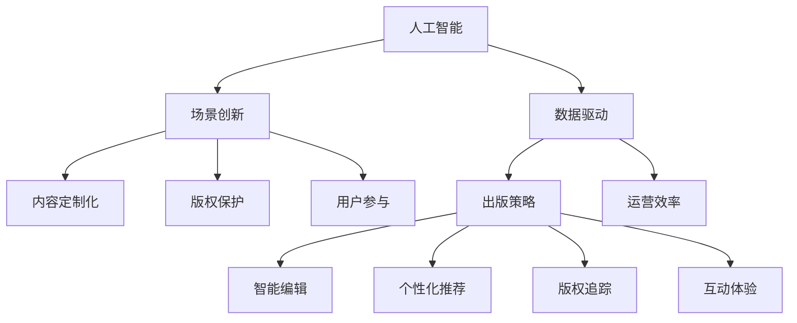

                 

# AI时代的出版业：数据驱动，场景创新

> 关键词：人工智能,出版业,数据分析,场景创新,机器学习,自然语言处理,NLP,推荐系统

## 1. 背景介绍

### 1.1 问题由来
随着互联网和移动设备的普及，数字化阅读已成为一种全新的生活方式。尤其是在全球疫情的大背景下，数字化阅读在减轻人们压力、缓解焦虑、维持精神生活方面扮演了重要角色。然而，尽管数字化阅读市场不断扩张，但传统的出版业面临的挑战并未减少，反而更加严峻。

一方面，数字化出版的成本和门槛相对较低，容易进入；另一方面，用户获取内容的渠道变得多样化，出版商的竞争力被削弱。出版商如何利用数据技术驱动自身发展，并在内容营销、个性化推荐、版权保护等方面实现突破，成为一个重要课题。

### 1.2 问题核心关键点
在AI时代，出版业的数字化转型离不开数据的深度挖掘和场景的创新。核心关键点包括：

1. 数据驱动：充分利用出版内容的多维数据，如用户行为、社交媒体反馈、评论等，构建数据驱动的出版策略。
2. 场景创新：结合现实应用场景，利用AI技术提供智能化的出版服务和产品，提升用户体验和经营效率。
3. 内容定制化：通过分析用户兴趣和行为，实现内容的精准推荐和个性化定制。
4. 版权保护：利用AI技术识别和追踪版权侵权行为，提升版权保护的智能化水平。
5. 用户参与：通过数据采集和分析，了解用户需求和偏好，实现出版的互动性和参与性。

## 2. 核心概念与联系

### 2.1 核心概念概述

要全面理解出版业的数字化转型，首先需要了解几个核心概念：

- **人工智能（AI）**：利用算法和机器学习技术，使计算机系统具备人类智能的行为特征。
- **出版业**：包括书籍、杂志、报纸、期刊等出版物的制作、发行、营销和传播。
- **数据驱动**：通过数据收集和分析，指导出版策略和业务决策，提升运营效率。
- **场景创新**：结合实际应用场景，创新开发智能化出版服务，如智能编辑、个性化推荐、版权保护等。
- **内容定制化**：根据用户行为和偏好，提供个性化的出版物推荐和定制服务。
- **版权保护**：利用AI技术，识别和追踪版权侵权行为，维护出版商的权益。
- **用户参与**：通过数据采集和分析，提升用户参与度和互动体验，形成良性互动。

这些概念之间的联系可以通过以下Mermaid流程图来展示：



这个流程图展示了几大核心概念及其相互关系：

1. **人工智能**：为出版业提供了技术支撑，如智能编辑、推荐系统、版权保护等。
2. **数据驱动**：通过分析海量数据，指导出版策略，提升运营效率。
3. **场景创新**：在实际应用中开发智能化服务，如个性化推荐、版权追踪等。
4. **内容定制化**：根据用户行为和偏好，实现个性化出版物推荐和定制服务。
5. **版权保护**：通过AI技术识别和追踪版权侵权行为，维护出版商权益。
6. **用户参与**：通过数据收集和分析，提升互动体验和用户参与度。

## 3. 核心算法原理 & 具体操作步骤

### 3.1 算法原理概述

在出版业中，AI技术的核心算法包括机器学习、自然语言处理（NLP）、推荐系统等。通过这些算法，出版商可以基于用户数据构建智能出版平台，为用户提供个性化的内容推荐和互动体验，提升用户满意度和平台粘性。

1. **机器学习（ML）**：通过训练数据，构建预测模型，用于分析用户行为和需求，实现内容定制化和版权保护。
2. **自然语言处理（NLP）**：利用算法理解文本，进行关键词提取、情感分析、实体识别等，提升内容的智能化水平。
3. **推荐系统**：通过分析用户历史行为，预测用户偏好，实现个性化推荐，提升用户留存率。

### 3.2 算法步骤详解

以内容推荐系统为例，算法步骤详解如下：

1. **数据收集**：收集用户的浏览、购买、评价等数据，构建用户画像。
2. **数据预处理**：清洗、归一化数据，提取关键特征。
3. **模型训练**：使用机器学习算法（如协同过滤、神经网络）构建推荐模型。
4. **模型评估**：通过交叉验证、A/B测试等方法评估模型性能。
5. **实时推荐**：实时获取用户行为数据，使用训练好的模型提供个性化推荐。

### 3.3 算法优缺点

AI驱动的出版推荐系统具有以下优点：

1. **个性化推荐**：通过分析用户行为，提供精准的内容推荐，提升用户粘性。
2. **高效运营**：自动化推荐流程，降低人力成本。
3. **用户参与度提升**：互动性强的推荐系统增加用户参与度，提升出版物的曝光率。

同时，该系统也存在以下局限性：

1. **数据隐私**：收集大量用户数据可能涉及隐私问题。
2. **推荐算法偏见**：算法偏见可能导致不公平的推荐结果。
3. **系统复杂度**：构建复杂推荐系统，需要高水平的算法和数据处理能力。

### 3.4 算法应用领域

AI技术在出版业中的应用领域非常广泛，包括但不限于以下几个方面：

- **智能编辑**：利用NLP技术，自动识别和纠正文本错误，提升编辑效率。
- **版权保护**：通过图像识别和文字匹配，识别盗版行为，维护版权权益。
- **用户互动**：利用聊天机器人等智能工具，实现实时互动和客户服务。
- **个性化推荐**：基于用户行为，提供个性化阅读建议，提升用户满意度。
- **数据分析**：通过数据挖掘，分析用户行为和市场趋势，指导出版策略。

## 4. 数学模型和公式 & 详细讲解 & 举例说明

### 4.1 数学模型构建

推荐系统的核心数学模型是协同过滤模型，基于用户与物品的评分矩阵，通过分解矩阵实现推荐。具体数学模型如下：

设 $R$ 为 $M \times N$ 的用户-物品评分矩阵，其中 $M$ 为用户数，$N$ 为物品数。假设 $R_{uv}$ 表示用户 $u$ 对物品 $v$ 的评分，则协同过滤模型可表示为：

$$ R_{uv} = \sum_{i=1}^{K} \alpha_i u_i u_v + \sum_{j=1}^{K} \beta_j i_j j_v + \epsilon_{uv} $$

其中 $\alpha_i$ 和 $\beta_j$ 为模型参数，$u_i$ 和 $i_j$ 为 $K$ 个特征向量，$\epsilon_{uv}$ 为误差项。

### 4.2 公式推导过程

协同过滤模型的推导过程如下：

1. 对用户-物品评分矩阵 $R$ 进行奇异值分解（SVD），得到三个矩阵 $U$, $V$ 和 $\Sigma$，其中 $\Sigma$ 为对角矩阵，包含矩阵 $R$ 的奇异值。
2. 设 $\hat{R}$ 为 $R$ 的估计矩阵，则 $\hat{R} = U \Sigma V^T$。
3. 用户 $u$ 对物品 $v$ 的推荐评分 $\hat{R}_{uv}$ 可表示为 $\hat{R}_{uv} = \sum_{i=1}^{K} \alpha_i u_i u_v + \sum_{j=1}^{K} \beta_j i_j j_v$。

### 4.3 案例分析与讲解

以一本新书推荐为例，协同过滤模型可以根据用户过去的阅读记录和评分，预测用户对新书的评分。具体步骤如下：

1. 收集用户历史阅读记录和评分数据。
2. 对评分矩阵进行奇异值分解，得到用户特征向量 $u_i$ 和物品特征向量 $j_v$。
3. 使用协同过滤公式计算用户对新书的推荐评分，作为推荐依据。

## 5. 项目实践：代码实例和详细解释说明

### 5.1 开发环境搭建

为了快速搭建出版推荐系统的开发环境，我们需要以下几个步骤：

1. **环境安装**：安装Python 3.x和必要的依赖包，如numpy、scipy、pandas、scikit-learn等。
2. **数据准备**：准备用户行为数据，包括浏览记录、购买记录、评价等。
3. **环境搭建**：在虚拟环境中搭建推荐系统开发环境，使用Jupyter Notebook进行交互式开发。

### 5.2 源代码详细实现

以下是一个简单的协同过滤推荐系统的Python代码实现：

```python
import numpy as np
from scipy.sparse.linalg import svds

# 评分矩阵
R = np.array([[5, 3, 1],
              [4, 4, 5],
              [3, 2, 3],
              [4, 4, 5]])

# 奇异值分解
U, S, Vt = svds(R, k=2, return_singular_vectors=True)

# 生成推荐评分
def predict_ufm(rank=5, seed=0):
    np.random.seed(seed)
    alpha = np.random.randn(rank)
    beta = np.random.randn(rank)
    u = np.dot(np.random.randn(2, rank), alpha)
    i = np.dot(np.random.randn(3, rank), beta)
    return np.dot(u, Vt.T) + np.dot(i, beta)

# 测试推荐评分
for i in range(4):
    pred = predict_ufm()
    print("User {}: Predicted Rating = {:.2f}".format(i, pred[i]))
```

### 5.3 代码解读与分析

以上代码实现了协同过滤模型的基本功能，具体步骤如下：

1. **评分矩阵**：定义评分矩阵 $R$，表示用户与物品的评分数据。
2. **奇异值分解**：使用scipy库的svds函数对评分矩阵进行奇异值分解，得到用户特征向量 $U$、物品特征向量 $V_t$ 和奇异值矩阵 $S$。
3. **推荐评分**：定义预测函数 predict_ufm，使用奇异值分解后的向量进行预测评分。
4. **测试推荐**：循环测试4个用户，输出预测评分。

## 6. 实际应用场景

### 6.1 智能编辑

智能编辑系统可以利用NLP技术，自动识别和纠正文本错误，提升编辑效率。例如，在书籍排版时，系统可以自动识别错别字、语法错误、格式不统一等问题，并提供实时修改建议。

### 6.2 版权保护

版权保护系统通过图像识别和文字匹配，识别盗版行为，维护版权权益。例如，在电子书出版时，系统可以自动识别盗版链接和封面，及时通知出版社采取行动。

### 6.3 用户互动

智能聊天机器人可以实现实时互动和客户服务。例如，在出版平台上，系统可以回答用户关于书籍、作者、出版信息等的问题，提供个性化推荐，提升用户体验。

### 6.4 个性化推荐

基于用户行为和偏好，推荐系统可以提供个性化阅读建议，提升用户满意度。例如，在电子书平台上，系统可以推荐用户可能感兴趣的新书、作者或相关文章，增加用户粘性。

### 6.5 数据分析

数据分析可以用于指导出版策略，提升运营效率。例如，通过分析用户购买数据和阅读记录，预测市场趋势，指导图书采购和出版计划。

## 7. 工具和资源推荐

### 7.1 学习资源推荐

为了帮助出版商系统掌握AI驱动出版技术，推荐以下几个学习资源：

1. **Coursera《机器学习》课程**：斯坦福大学Andrew Ng教授主讲的经典课程，涵盖机器学习基础和进阶内容。
2. **Deep Learning Specialization**：由Andrew Ng教授和吴恩达（David Evans）教授主讲的深度学习系列课程，涵盖NLP和推荐系统等内容。
3. **Python for Data Analysis**：由Pandas库的创建者Wes McKinney所著，介绍了如何使用Python进行数据处理和分析。
4. **Scikit-learn官方文档**：scikit-learn库的官方文档，提供丰富的学习资源和代码示例。
5. **自然语言处理综述**：由斯坦福大学NLP团队主编的综述文章，介绍了NLP的基础知识和最新进展。

### 7.2 开发工具推荐

在出版推荐系统开发中，推荐使用以下工具：

1. **Python**：轻量级、易扩展的编程语言，支持丰富的第三方库和框架。
2. **Jupyter Notebook**：交互式编程环境，支持代码编写、数据可视化和结果展示。
3. **TensorFlow**：由Google开发的深度学习框架，支持高效的神经网络模型训练。
4. **scikit-learn**：Python的机器学习库，提供了多种经典的机器学习算法和工具。
5. **pandas**：Python的数据处理库，支持高效的数据读写、清洗和分析。

### 7.3 相关论文推荐

为了深入了解AI驱动出版技术的研究进展，推荐以下几篇相关论文：

1. **Deep Text Summarization using Pointer-Generator Networks**：提出基于指针生成器的文本摘要方法，大幅提升摘要质量。
2. **Exploring the Limits of Transfer Learning with a Unified Text-to-Text Transformer**：通过统一模型架构，大幅提升跨领域NLP任务的性能。
3. **Attention is All You Need**：提出Transformer结构，显著提升NLP任务的性能。
4. **Knowledge Graph Embeddings**：介绍知识图谱嵌入技术，提升推荐系统的准确性。
5. **The Representation Learned by Self-Attention is Symmetric**：研究注意力机制的对称性，提升推荐系统的稳定性。

## 8. 总结：未来发展趋势与挑战

### 8.1 研究成果总结

在AI驱动的出版业中，我们已经取得了显著的进展，包括智能编辑、版权保护、个性化推荐等技术的应用。未来，这些技术有望进一步提升出版业的智能化水平，实现出版的个性化、精准化、高效化。

### 8.2 未来发展趋势

未来出版业AI技术的发展趋势如下：

1. **更精准的个性化推荐**：通过深度学习和大数据技术，实现更精准的用户画像和内容推荐，提升用户满意度和留存率。
2. **更高效的智能编辑**：利用自然语言处理和机器学习技术，提升编辑的自动化水平和效率。
3. **更强大的版权保护**：通过图像识别和文字匹配技术，识别盗版行为，提升版权保护的水平。
4. **更全面的数据分析**：通过大数据分析，提升市场洞察力和运营效率。

### 8.3 面临的挑战

尽管AI技术在出版业中的应用前景广阔，但仍面临以下挑战：

1. **数据隐私和安全**：大规模数据收集可能涉及用户隐私，如何确保数据安全是一个重要问题。
2. **推荐系统偏见**：推荐算法可能存在偏见，如何确保公平性是一个关键问题。
3. **技术复杂性**：AI技术的实现需要较高的技术水平和数据处理能力，对技术团队提出了更高的要求。

### 8.4 研究展望

未来出版业AI技术的研究展望包括：

1. **公平性和透明性**：在推荐算法中引入公平性约束，提升算法的透明性和可解释性。
2. **模型解释性**：通过可解释性技术，提升模型的透明性和可信度。
3. **跨领域迁移学习**：利用跨领域迁移学习技术，提升AI技术的通用性。
4. **深度融合**：将AI技术与传统出版业进行深度融合，实现优势互补，提升整体运营效率。

## 9. 附录：常见问题与解答

**Q1: 什么是协同过滤推荐系统？**

A: 协同过滤推荐系统是一种基于用户历史行为和物品属性的推荐算法，通过分析用户与物品的评分矩阵，预测用户对新物品的评分，从而实现个性化推荐。

**Q2: 如何使用机器学习进行版权保护？**

A: 版权保护系统可以采用图像识别和文字匹配技术，通过识别盗版链接和封面，及时通知出版社采取行动。

**Q3: 如何提升智能编辑的效率？**

A: 智能编辑系统可以利用自然语言处理技术，自动识别和纠正文本错误，提升编辑效率。

**Q4: 如何构建一个高性能的出版推荐系统？**

A: 构建高性能的出版推荐系统需要选择合适的算法和模型，如协同过滤、深度学习等，同时确保数据质量和处理效率。

**Q5: 如何保证推荐系统的公平性和透明性？**

A: 在推荐算法中引入公平性约束，并通过可解释性技术提升算法的透明性和可信度。

通过本文的系统梳理，可以看到，AI技术在出版业中的应用前景广阔，但同时也面临着数据隐私、算法偏见等诸多挑战。只有不断创新、优化技术，才能实现出版业的智能化和数字化转型。

