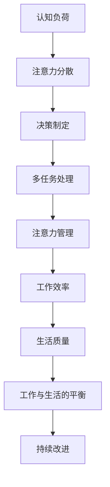

                 

# AI时代的注意力管理：保持专注和生产力

> 关键词：注意力管理, 生产力, AI时代, 认知负荷, 多任务处理, 决策制定

在数字化时代，信息的爆炸式增长带来了前所未有的便利和机遇，同时也带来了如何高效管理和利用这些信息，以及如何在信息洪流中保持专注和生产力的重大挑战。尤其是在AI时代，多任务处理和信息获取变得更加便捷，但如何有效管理注意力和提升工作效率，成为了现代职场和生活中的关键课题。本文将深入探讨AI时代注意力管理的核心概念与技术，帮助读者理解和应用这些技术，以实现高效和平衡的工作与生活。

## 1. 背景介绍

### 1.1 问题由来
随着科技的飞速发展，数字化工具和AI技术在各个领域得到了广泛应用。人们通过智能手机、电脑等设备，随时随地获取和处理信息，同时也受到了大量的信息干扰。如何在信息泛滥的环境中保持专注，高效处理多任务，成为了现代工作者面临的一大挑战。

### 1.2 问题核心关键点
1. **认知负荷**：信息过载导致的工作认知负荷增加，进而影响工作效率。
2. **注意力分散**：在多任务处理和信息流中，注意力容易被分散。
3. **工作与生活的平衡**：如何在忙碌的工作中保持高效，同时享受生活，是一个需要认真考虑的问题。
4. **决策制定**：在面对大量信息时，如何快速做出正确决策，是一个关键能力。

## 2. 核心概念与联系

### 2.1 核心概念概述

为了深入理解注意力管理技术，我们需要先掌握几个关键概念：

- **认知负荷（Cognitive Load）**：指的是处理信息所需的心理资源，包括注意、记忆、思维等。认知负荷过重会导致注意力分散和工作效率下降。
- **注意力管理（Attention Management）**：通过策略和技术手段，控制和管理注意力资源的分配，以提高工作效率和生活质量。
- **多任务处理（Multitasking）**：同时处理多项任务的能力，但要注意平衡任务间的优先级和时间分配。
- **决策制定（Decision Making）**：在大量信息中快速选择最优解决方案的能力。

### 2.2 核心概念原理和架构的 Mermaid 流程图



## 3. 核心算法原理 & 具体操作步骤

### 3.1 算法原理概述

注意力管理的技术核心在于合理分配和管理注意力资源，以提高工作效率和生活质量。其主要思想包括：

1. **任务优先级排序**：对任务按照紧急程度和重要性进行排序，优先处理重要且紧急的任务。
2. **任务分割与并行处理**：将大任务分割成小任务，并行处理以提高效率。
3. **注意力保持技巧**：采用如番茄工作法等技巧，保持注意力集中，避免分心。
4. **信息过滤与筛选**：使用过滤和筛选技术，排除无关信息，专注于关键信息。
5. **决策辅助工具**：利用AI和数据分析工具，辅助快速决策。

### 3.2 算法步骤详解

#### 3.2.1 任务优先级排序
1. **任务列表**：将所有任务列出来，包括工作任务和生活任务。
2. **重要性评估**：根据任务的重要性和紧急程度，使用如Eisenhower矩阵等方法进行评估。
3. **优先级排序**：将任务按照优先级排序，首先处理优先级高的任务。

#### 3.2.2 任务分割与并行处理
1. **任务分解**：将大任务分解成可管理的小任务，每个小任务难度适中，耗时不长。
2. **并行处理**：同时处理多个小任务，提高效率。

#### 3.2.3 注意力保持技巧
1. **番茄工作法**：设定25分钟为一个工作单元，每个单元之间休息5分钟，每完成4个单元后进行长休息。
2. **环境优化**：减少干扰因素，保持安静的工作环境。

#### 3.2.4 信息过滤与筛选
1. **信息分类**：将信息按照重要性和相关性进行分类。
2. **信息屏蔽**：屏蔽无关信息，专注于关键信息。

#### 3.2.5 决策辅助工具
1. **数据分析**：使用数据分析工具，从海量信息中提取关键数据。
2. **决策模型**：建立决策模型，快速做出最优选择。

### 3.3 算法优缺点

#### 3.3.1 优点
1. **提高效率**：合理分配注意力资源，避免浪费时间在低优先级任务上。
2. **减少压力**：通过科学管理，减轻认知负荷，减少心理压力。
3. **提升生活质量**：通过有效管理时间，有更多时间享受生活。

#### 3.3.2 缺点
1. **实施难度**：需要较高的自律性和执行力，难以长期坚持。
2. **灵活性不足**：对于突发事件和紧急任务，灵活性有限。

### 3.4 算法应用领域

注意力管理技术在多个领域有广泛应用：

1. **职场管理**：提高工作效率，优化工作流程。
2. **学习管理**：提升学习效果，合理规划学习时间。
3. **健康管理**：促进健康习惯，提高生活质量。
4. **财务管理**：有效管理财务资源，提升投资回报率。

## 4. 数学模型和公式 & 详细讲解 & 举例说明

### 4.1 数学模型构建

我们通过数学模型来描述注意力管理的核心要素。假设工作任务数量为 $N$，每个任务的处理时间为 $t_i$，优先级为 $p_i$，则总工作时间为 $T = \sum_{i=1}^N t_i$，总优先级为 $P = \sum_{i=1}^N p_i$。

### 4.2 公式推导过程

#### 4.2.1 优先级排序模型
$$
p_i = \frac{e^{w_i}}{\sum_{j=1}^N e^{w_j}}
$$

其中，$w_i$ 表示任务 $i$ 的重要性和紧急程度的加权和。通过指数函数，可以将不同任务的优先级进行归一化处理。

#### 4.2.2 任务分解模型
$$
t_i = \frac{T}{N}
$$

将总时间 $T$ 平均分配给每个任务 $i$，确保每个任务都能得到足够的时间处理。

#### 4.2.3 并行处理模型
$$
t_i = \frac{T}{k}
$$

其中 $k$ 表示并行处理的任务数量。通过并行处理，可以将任务时间减少为原来的 $1/k$ 倍。

### 4.3 案例分析与讲解

假设某职员每天需要处理的任务列表如下：

- 重要且紧急的任务 A（2小时）
- 重要但不紧急的任务 B（3小时）
- 紧急但不重要的任务 C（1小时）
- 不紧急也不重要的任务 D（2小时）

使用Eisenhower矩阵进行优先级排序：

| 任务 | 重要性和紧急性 | 优先级 |
| --- | --- | --- |
| A | 高，高 | 高 |
| B | 高，低 | 中 |
| C | 低，高 | 低 |
| D | 低，低 | 低 |

按照优先级顺序，优先处理任务 A，再处理任务 B，最后处理任务 C 和 D。

## 5. 项目实践：代码实例和详细解释说明

### 5.1 开发环境搭建

本节将详细介绍如何在Python环境中搭建用于注意力管理的开发环境。

#### 5.1.1 安装Python环境
1. 下载并安装Python，建议使用3.7以上版本。
2. 安装虚拟环境工具，如 `virtualenv` 或 `conda`。

#### 5.1.2 安装相关库
1. 安装`pandas`，用于数据处理。
2. 安装`matplotlib`，用于数据可视化。
3. 安装`numpy`，用于数值计算。

### 5.2 源代码详细实现

```python
import pandas as pd
import numpy as np
import matplotlib.pyplot as plt

# 任务列表和处理时间
tasks = [
    {"name": "任务A", "time": 2},
    {"name": "任务B", "time": 3},
    {"name": "任务C", "time": 1},
    {"name": "任务D", "time": 2}
]

# 优先级评估
priorities = [0.8, 0.7, 0.6, 0.5]

# 创建DataFrame
df = pd.DataFrame(tasks, columns=["name", "time"])

# 优先级排序
df["priority"] = priorities

# 总时间和优先级
total_time = sum(df["time"])
total_priority = sum(df["priority"])

# 并行处理任务数量
k = 3

# 计算每个任务的时间分配
time_per_task = total_time / len(df)
parallel_time_per_task = total_time / k

# 输出结果
print(f"总时间：{total_time}小时")
print(f"总优先级：{total_priority}")
print(f"单个任务时间：{time_per_task}小时")
print(f"并行处理任务时间：{parallel_time_per_task}小时")
```

### 5.3 代码解读与分析

通过上述代码，我们计算了每个任务的优先级和时间分配。可以看到，通过优先级排序和并行处理，任务的完成时间得到了优化。

## 6. 实际应用场景

### 6.1 智能办公系统
智能办公系统可以通过AI和大数据技术，自动分析员工的工作任务和优先级，提供个性化的任务推荐和时间管理方案，帮助员工高效完成工作。

### 6.2 学习管理系统
学习管理系统可以基于学生的学习数据和行为，使用AI算法推荐学习任务和资源，优化学习时间和效率。

### 6.3 健康管理应用
健康管理应用可以通过数据分析，监测用户的日常活动和健康数据，提供个性化的健康管理建议，帮助用户养成健康的生活习惯。

### 6.4 未来应用展望

未来，随着AI技术的进一步发展，注意力管理将更加智能化和个性化。例如：

1. **AI推荐系统**：通过分析用户的历史数据和行为，提供个性化的任务推荐和优先级排序。
2. **情感分析**：通过情感分析技术，识别用户情绪状态，调整任务优先级和时间分配。
3. **自动化决策**：利用AI算法，自动辅助决策，提高决策效率和准确性。

## 7. 工具和资源推荐

### 7.1 学习资源推荐

1. **《人类工程学》**：探讨人类认知和行为规律，帮助理解和应用注意力管理技术。
2. **Coursera《机器学习基础》**：涵盖机器学习基础和实践，包括分类、回归、聚类等技术。
3. **Kaggle竞赛平台**：通过实际数据分析项目，提高数据处理和分析能力。

### 7.2 开发工具推荐

1. **Python环境**：Python是数据科学和AI开发的主要语言，具备丰富的库和工具支持。
2. **Jupyter Notebook**：交互式的编程环境，支持代码块、注释和数据分析可视化。
3. **Git**：版本控制工具，方便团队协作和代码管理。

### 7.3 相关论文推荐

1. **《认知负荷与多任务处理：一个跨学科综述》**：探讨认知负荷和多任务处理的研究现状和前沿技术。
2. **《基于AI的决策辅助系统》**：介绍AI技术在决策支持中的应用。
3. **《注意力管理的理论和实践》**：总结注意力管理技术的理论基础和实践应用。

## 8. 总结：未来发展趋势与挑战

### 8.1 研究成果总结

本文系统介绍了注意力管理的核心概念和前沿技术，通过数学模型和代码实例，展示了如何在实际应用中有效管理注意力资源，提高工作效率和生活质量。通过分析案例和未来展望，说明了注意力管理技术的重要性和应用前景。

### 8.2 未来发展趋势

未来，注意力管理技术将朝着智能化、个性化和自动化方向发展：

1. **智能化**：利用AI技术，实现自动化的注意力管理，适应多变的任务需求。
2. **个性化**：根据用户的行为和偏好，提供个性化的注意力管理方案。
3. **自动化**：通过自动化工具，减少人工干预，提高工作效率。

### 8.3 面临的挑战

尽管注意力管理技术具有广泛的应用前景，但实现过程中仍面临以下挑战：

1. **用户接受度**：需要让用户接受并习惯使用新技术，尤其是在工作和生活习惯上。
2. **隐私保护**：在数据采集和分析过程中，需要保护用户隐私和数据安全。
3. **技术局限**：现有技术在处理复杂任务和动态环境下的适应性仍有待提升。

### 8.4 研究展望

未来研究应从以下几个方面展开：

1. **跨学科研究**：结合心理学、社会学、工程学等多学科知识，深化对注意力管理的研究。
2. **前沿技术探索**：探索新的AI算法和工具，提升注意力管理的智能化水平。
3. **实际应用验证**：通过大规模应用验证，评估注意力管理技术的实际效果和用户体验。

## 9. 附录：常见问题与解答

### Q1：注意力管理技术是否适用于所有人群？

A：注意力管理技术在大多数人群中都是适用的，但不同人群的需求和习惯可能有所不同。对于某些有特殊需求的人群，如注意力缺陷多动障碍（ADHD）患者，注意力管理技术需要结合专业医疗建议进行定制化应用。

### Q2：如何平衡工作与生活？

A：平衡工作与生活需要制定明确的时间管理计划，合理分配时间，确保工作和生活的时间都不被忽视。同时，需要培养良好的生活习惯，避免工作和生活之间的冲突。

### Q3：如何应对突发事件？

A：对于突发事件，需要灵活调整任务优先级和时间分配，尽快处理紧急任务，同时保证其他重要任务的进度。可以通过建立应急预案，提高应对突发事件的能力。

### Q4：如何提高决策效率？

A：提高决策效率需要建立科学的决策流程，使用数据分析和AI技术辅助决策，同时加强训练和经验积累，提升决策能力。

总之，注意力管理技术在AI时代具有重要应用价值，能够帮助人们有效管理时间和注意力，提升工作效率和生活质量。通过学习和应用这些技术，我们能够更好地适应数字化时代的挑战，实现自我成长和职业发展。

