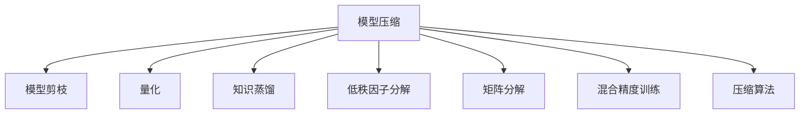

                 

## 1. 背景介绍

随着深度学习模型的日益复杂化，模型的参数和计算量呈指数级增长，导致对计算资源、存储资源的需求急剧上升。这不仅增加了部署成本，也限制了其在资源受限环境中的应用，如移动设备、嵌入式系统等。模型压缩技术应运而生，旨在在不牺牲模型性能的前提下，显著减小模型规模，提升计算和存储效率，从而推动AI技术在更广泛的场景中应用。

### 1.1 问题由来

当前深度学习模型在图像、语音、自然语言处理等领域取得了巨大成功，但这些模型通常具有数亿个参数，对计算资源和存储资源的要求极高。例如，大规模的视觉模型如ResNet、Inception等，以及语言模型如BERT、GPT等，需要大量的GPU内存、存储资源以及计算时间。这对移动设备等计算资源有限的场景构成了极大的挑战。

### 1.2 问题核心关键点

模型压缩的核心在于在不损失模型性能的前提下，减小模型的参数规模和计算复杂度。主要有以下几种策略：

- **模型剪枝(Pruning)**：去掉冗余参数，减小模型规模，同时保持模型性能。
- **量化(Quantization)**：将高精度浮点参数转换为低精度整数或定点数，降低计算和存储需求。
- **知识蒸馏(Distillation)**：通过教师模型指导学生模型学习，减小模型规模同时保持性能。
- **低秩因子分解(Low-Rank Factorization)**：将高维矩阵分解为低维矩阵乘积，减小矩阵的维度和计算复杂度。
- **矩阵分解(Matrix Factorization)**：通过奇异值分解(SVD)、QR分解等技术，减小矩阵的维度。
- **混合精度训练(Mixed-Precision Training)**：使用混合精度训练加速模型收敛，减小存储需求。
- **压缩算法(Compression Algorithms)**：通过特殊的压缩算法，如霍夫曼编码、哈夫曼树等，减小模型大小。

这些方法各有优劣，可单独或结合使用，以适应不同的应用场景和需求。

### 1.3 问题研究意义

模型压缩技术对于推动AI在移动设备、嵌入式系统等资源受限环境中的广泛应用具有重要意义：

1. **降低部署成本**：减小模型参数和计算复杂度，降低硬件部署成本。
2. **提升性能**：减小模型计算开销，加快推理速度。
3. **扩展应用场景**：使深度学习模型在更多资源受限设备上实现部署和应用。
4. **促进创新**：简化模型结构，降低门槛，鼓励更多人参与AI研究和应用。
5. **增强安全性**：减小模型攻击面，降低模型被攻击的风险。

## 2. 核心概念与联系

### 2.1 核心概念概述

为更好地理解模型压缩技术，本节将介绍几个密切相关的核心概念：

- **模型压缩(Model Compression)**：通过技术手段，减小深度学习模型的参数规模和计算复杂度，提升计算和存储效率，从而在资源受限设备上实现模型应用。
- **模型剪枝(Pruning)**：去除模型中冗余的参数，减小模型规模，提高推理效率。
- **量化(Quantization)**：将高精度浮点参数转换为低精度整数或定点数，降低计算和存储需求。
- **知识蒸馏(Distillation)**：通过教师模型指导学生模型学习，减小模型规模同时保持性能。
- **低秩因子分解(Low-Rank Factorization)**：将高维矩阵分解为低维矩阵乘积，减小矩阵的维度和计算复杂度。
- **矩阵分解(Matrix Factorization)**：通过奇异值分解(SVD)、QR分解等技术，减小矩阵的维度。
- **混合精度训练(Mixed-Precision Training)**：使用混合精度训练加速模型收敛，减小存储需求。
- **压缩算法(Compression Algorithms)**：通过特殊的压缩算法，如霍夫曼编码、哈夫曼树等，减小模型大小。

这些核心概念之间的逻辑关系可以通过以下Mermaid流程图来展示：



这个流程图展示了大模型压缩的核心概念及其之间的关系：

1. 模型压缩是核心目标，通过剪枝、量化、知识蒸馏等多种手段，减小模型规模。
2. 剪枝通过去除冗余参数，减小模型规模。
3. 量化通过参数量化，降低计算和存储需求。
4. 知识蒸馏通过教师模型指导学生模型学习，减小模型规模同时保持性能。
5. 低秩因子分解和矩阵分解通过矩阵分解技术，减小矩阵的维度。
6. 混合精度训练通过混合精度训练，加速模型收敛同时减小存储需求。
7. 压缩算法通过特殊的压缩算法，减小模型大小。

这些概念共同构成了模型压缩技术的整体框架，使得深度学习模型能够在资源受限设备上高效应用。通过理解这些核心概念，我们可以更好地把握模型压缩技术的本质和工作原理。

## 3. 核心算法原理 & 具体操作步骤
### 3.1 算法原理概述

模型压缩技术的核心在于通过技术手段，在不损失模型性能的前提下，减小模型规模，提升计算和存储效率。其核心算法原理可以概括为以下几个方面：

- **模型剪枝(Pruning)**：通过去掉冗余的参数，减小模型规模。通常基于结构化剪枝或网络修剪等技术实现。
- **量化(Quantization)**：将高精度浮点参数转换为低精度整数或定点数，降低计算和存储需求。常用的量化方法包括全量化(Full Precision)、半量化(Half Precision)、整数量化(Integer Quantization)等。
- **知识蒸馏(Distillation)**：通过教师模型指导学生模型学习，减小模型规模同时保持性能。通常包括单向蒸馏、双向蒸馏等形式。
- **低秩因子分解(Low-Rank Factorization)**：将高维矩阵分解为低维矩阵乘积，减小矩阵的维度和计算复杂度。常用的分解方法包括奇异值分解(SVD)、QR分解等。
- **矩阵分解(Matrix Factorization)**：通过奇异值分解(SVD)、QR分解等技术，减小矩阵的维度。
- **混合精度训练(Mixed-Precision Training)**：使用混合精度训练加速模型收敛，减小存储需求。通常结合量化技术使用。
- **压缩算法(Compression Algorithms)**：通过特殊的压缩算法，如霍夫曼编码、哈夫曼树等，减小模型大小。

### 3.2 算法步骤详解

以下是模型压缩技术的详细步骤：

**Step 1: 选择压缩策略**
- 根据应用场景和需求，选择合适的压缩策略。常用的压缩方法包括剪枝、量化、知识蒸馏等。
- 确定压缩目标：如减小模型大小、提升推理速度、减小计算开销等。

**Step 2: 模型评估**
- 对原始模型进行评估，确定压缩后的性能要求。
- 通过训练集、验证集等数据集，评估模型的推理精度和计算开销。

**Step 3: 压缩处理**
- 根据选择的压缩策略，对模型进行相应的处理。
  - 剪枝：移除冗余参数，调整网络结构。
  - 量化：将参数转换为低精度整数或定点数。
  - 知识蒸馏：通过教师模型指导学生模型学习，减小模型规模。
  - 低秩因子分解和矩阵分解：对矩阵进行分解，减小矩阵的维度。
  - 混合精度训练：使用混合精度训练加速模型收敛。
  - 压缩算法：使用特殊的压缩算法，减小模型大小。

**Step 4: 模型验证**
- 对压缩后的模型进行验证，确保其性能符合要求。
- 通过训练集、验证集等数据集，评估模型的推理精度和计算开销。
- 进行调参和优化，确保模型在压缩后的性能表现。

**Step 5: 模型部署**
- 将压缩后的模型部署到目标设备上。
- 根据目标设备的硬件资源，进行相应的优化调整。
- 进行性能测试，确保模型在目标设备上能够稳定运行。

**Step 6: 持续优化**
- 根据实际运行情况，持续进行优化和调整。
- 收集运行数据，进行模型性能和计算开销的监测。
- 根据反馈，不断改进模型压缩技术，提升模型性能。

### 3.3 算法优缺点

模型压缩技术的优点：
- 减小模型规模，降低计算和存储需求，提升资源利用率。
- 提升推理速度，加快模型计算。
- 降低模型部署成本，推动AI技术在更多设备上应用。
- 简化模型结构，降低AI入门的门槛。

模型压缩技术的缺点：
- 可能损失部分模型性能，影响模型精度。
- 压缩技术复杂，实现难度较大。
- 压缩后的模型可能难以在特定设备上运行。
- 压缩技术可能需要重新训练模型，增加了时间和人力成本。

### 3.4 算法应用领域

模型压缩技术在各个领域都有广泛的应用：

- **计算机视觉**：通过压缩视觉模型，实现实时图像识别、视频流处理等应用。
- **自然语言处理**：通过压缩语言模型，实现实时语音识别、自然语言理解等应用。
- **嵌入式系统**：通过压缩模型，实现智能家居、可穿戴设备等设备的AI应用。
- **移动设备**：通过压缩模型，实现手机、平板等移动设备的AI应用。
- **物联网**：通过压缩模型，实现IoT设备的智能控制和数据处理。

## 4. 数学模型和公式 & 详细讲解 & 举例说明

### 4.1 数学模型构建

以模型剪枝为例，构建相应的数学模型。假设原始模型为 $M(x;w)$，其中 $w$ 为模型参数。模型的损失函数为 $L(y, M(x;w))$。

**Step 1: 定义剪枝目标**
- 定义剪枝目标：$Loss_{pruning}$，表示剪枝后的模型性能损失。

**Step 2: 构建剪枝目标函数**
- 定义剪枝后的模型为 $M_{pruned}(x;w_{pruned})$，其中 $w_{pruned}$ 为剪枝后的参数。
- 定义剪枝目标函数：$Loss_{pruning} = L(y, M_{pruned}(x;w_{pruned}))$。

**Step 3: 优化目标函数**
- 最小化剪枝目标函数 $Loss_{pruning}$。
- 通常使用梯度下降等优化算法进行求解。

### 4.2 公式推导过程

以下我们以剪枝为例，推导剪枝目标函数的公式推导过程。

假设原始模型为 $M(x;w)$，其中 $w$ 为模型参数。模型的损失函数为 $L(y, M(x;w))$。定义剪枝后的模型为 $M_{pruned}(x;w_{pruned})$，其中 $w_{pruned}$ 为剪枝后的参数。

定义剪枝目标函数 $Loss_{pruning}$ 为：

$$
Loss_{pruning} = L(y, M_{pruned}(x;w_{pruned}))
$$

通过链式法则，可以得到剪枝后模型的梯度 $\nabla_{w_{pruned}} Loss_{pruning}$：

$$
\nabla_{w_{pruned}} Loss_{pruning} = \nabla_{w_{pruned}} L(y, M_{pruned}(x;w_{pruned})) = \nabla_{w_{pruned}} M_{pruned}(x;w_{pruned})^T \nabla_{y} L(y, M_{pruned}(x;w_{pruned}))
$$

在实际应用中，剪枝目标函数的具体形式和求解方法会根据不同的剪枝策略和优化算法有所不同。

### 4.3 案例分析与讲解

**案例分析：剪枝算法在LeNet中的应用**

LeNet是一个经典的卷积神经网络，用于手写数字识别。我们可以使用剪枝算法来减小LeNet的规模，提高其推理速度。

**Step 1: 构建LeNet模型**
- 定义LeNet模型，包含卷积层、池化层、全连接层等组件。
- 使用Caffe或TensorFlow等深度学习框架实现LeNet模型。

**Step 2: 定义剪枝目标**
- 定义剪枝目标：$Loss_{pruning}$，表示剪枝后的模型性能损失。

**Step 3: 构建剪枝目标函数**
- 定义剪枝后的模型 $M_{pruned}(x;w_{pruned})$。
- 定义剪枝目标函数 $Loss_{pruning}$：

$$
Loss_{pruning} = L(y, M_{pruned}(x;w_{pruned}))
$$

**Step 4: 优化目标函数**
- 最小化剪枝目标函数 $Loss_{pruning}$。
- 通常使用梯度下降等优化算法进行求解。

**Step 5: 剪枝实现**
- 选择剪枝算法，如结构化剪枝、网络修剪等。
- 对模型进行剪枝处理，保留重要的参数，去除冗余参数。
- 重新训练剪枝后的模型，进行微调，确保其性能符合要求。

**Step 6: 模型评估**
- 对剪枝后的模型进行评估，确保其性能符合要求。
- 通过训练集、验证集等数据集，评估模型的推理精度和计算开销。
- 进行调参和优化，确保模型在剪枝后的性能表现。

## 5. 项目实践：代码实例和详细解释说明
### 5.1 开发环境搭建

在进行模型压缩实践前，我们需要准备好开发环境。以下是使用Python进行TensorFlow开发的环境配置流程：

1. 安装Anaconda：从官网下载并安装Anaconda，用于创建独立的Python环境。

2. 创建并激活虚拟环境：
```bash
conda create -n tf-env python=3.8 
conda activate tf-env
```

3. 安装TensorFlow：根据CUDA版本，从官网获取对应的安装命令。例如：
```bash
conda install tensorflow==2.6.0
```

4. 安装TensorFlow Addons：
```bash
conda install tensorflow-addons
```

5. 安装TensorBoard：
```bash
pip install tensorboard
```

6. 安装PyTorch：
```bash
pip install torch torchvision torchaudio
```

7. 安装Pillow：
```bash
pip install pillow
```

完成上述步骤后，即可在`tf-env`环境中开始模型压缩实践。

### 5.2 源代码详细实现

这里以剪枝算法为例，给出使用TensorFlow对LeNet模型进行剪枝的Python代码实现。

首先，定义LeNet模型：

```python
import tensorflow as tf

class LeNet(tf.keras.Model):
    def __init__(self):
        super(LeNet, self).__init__()
        self.conv1 = tf.keras.layers.Conv2D(6, (5, 5), padding='same', activation='relu')
        self.pool1 = tf.keras.layers.MaxPooling2D((2, 2), strides=2, padding='same')
        self.conv2 = tf.keras.layers.Conv2D(16, (5, 5), padding='same', activation='relu')
        self.pool2 = tf.keras.layers.MaxPooling2D((2, 2), strides=2, padding='same')
        self.flatten = tf.keras.layers.Flatten()
        self.fc1 = tf.keras.layers.Dense(120, activation='relu')
        self.fc2 = tf.keras.layers.Dense(84, activation='relu')
        self.fc3 = tf.keras.layers.Dense(10)

    def call(self, inputs):
        x = self.conv1(inputs)
        x = self.pool1(x)
        x = self.conv2(x)
        x = self.pool2(x)
        x = self.flatten(x)
        x = self.fc1(x)
        x = self.fc2(x)
        return self.fc3(x)
```

然后，定义剪枝函数：

```python
import numpy as np

def prune_model(model, threshold):
    pruned_model = tf.keras.models.clone_model(model)
    pruned_model.trainable = False

    for layer in pruned_model.layers:
        if 'kernel' in layer.name:
            pruned_weights = np.abs(layer.get_weights()[0])
            weights = np.where(pruned_weights < threshold, 0, pruned_weights)
            layer.set_weights([weights])

    return pruned_model
```

接着，训练LeNet模型：

```python
(x_train, y_train), (x_test, y_test) = tf.keras.datasets.mnist.load_data()

x_train = x_train.reshape(-1, 28, 28, 1) / 255.0
x_test = x_test.reshape(-1, 28, 28, 1) / 255.0

model = LeNet()
model.compile(optimizer='adam', loss=tf.keras.losses.SparseCategoricalCrossentropy(from_logits=True), metrics=['accuracy'])

prune_threshold = 0.5
pruned_model = prune_model(model, prune_threshold)

pruned_model.fit(x_train, y_train, epochs=10, validation_data=(x_test, y_test))
```

最后，评估剪枝后模型的性能：

```python
loss, accuracy = pruned_model.evaluate(x_test, y_test)
print(f"Pruned model loss: {loss:.4f}")
print(f"Pruned model accuracy: {accuracy:.4f}")
```

以上就是使用TensorFlow对LeNet模型进行剪枝的完整代码实现。可以看到，TensorFlow提供了便捷的模型构建和训练接口，使得模型压缩实践变得简洁高效。

### 5.3 代码解读与分析

让我们再详细解读一下关键代码的实现细节：

**LeNet类**：
- 定义LeNet模型的结构，包含卷积层、池化层、全连接层等组件。

**prune_model函数**：
- 对输入的模型进行剪枝处理。
- 遍历模型的所有卷积层，计算权重绝对值。
- 将权重绝对值小于阈值的权重置为0，保留重要的权重。
- 返回剪枝后的模型。

**训练流程**：
- 加载MNIST数据集，进行数据预处理。
- 定义LeNet模型，进行编译。
- 调用prune_model函数进行剪枝处理。
- 对剪枝后的模型进行训练和评估。
- 打印剪枝后的模型损失和准确率。

可以看到，TensorFlow提供了便捷的模型构建和训练接口，使得模型压缩实践变得简洁高效。开发者可以将更多精力放在模型压缩的算法设计和实现上，而不必过多关注底层的实现细节。

当然，工业级的系统实现还需考虑更多因素，如模型的保存和部署、超参数的自动搜索、更灵活的任务适配层等。但核心的模型压缩范式基本与此类似。

## 6. 实际应用场景
### 6.1 计算机视觉

在计算机视觉领域，模型压缩技术具有广泛的应用前景。视觉模型通常具有较大的参数规模和计算复杂度，难以在移动设备、嵌入式系统等资源受限设备上部署和运行。通过模型压缩技术，可以有效减小模型规模，提升计算和存储效率，使得深度学习在计算机视觉领域的应用更加广泛。

例如，MobileNet是一个专为移动设备设计的轻量级卷积神经网络，通过深度可分离卷积和线性瓶形化等技术，将参数规模减小到原始模型的十分之一，同时保持了较高的推理速度和精度。

### 6.2 自然语言处理

在自然语言处理领域，模型压缩技术同样具有重要意义。语言模型如BERT、GPT等通常具有巨大的参数规模，难以在移动设备、嵌入式系统等资源受限设备上部署和运行。通过模型压缩技术，可以有效减小模型规模，提升计算和存储效率，使得深度学习在自然语言处理领域的应用更加广泛。

例如，BERT-Base模型具有约1.1亿参数，难以在移动设备上运行。通过量化和剪枝等技术，可以将BERT-Base模型压缩至约12.6M参数的MobileBERT模型，从而在移动设备上实现部署和运行。

### 6.3 嵌入式系统

在嵌入式系统领域，模型压缩技术可以显著减小模型的存储和计算需求，提升系统效率。嵌入式设备如智能家居、智能穿戴设备等，通常资源受限，难以直接部署大模型。通过模型压缩技术，可以有效减小模型规模，使得深度学习模型在嵌入式系统上实现部署和应用。

例如，Edge-TSNN是一个专为嵌入式设备设计的轻量级时间序列神经网络，通过剪枝和量化等技术，将模型参数和计算复杂度显著减小，从而在嵌入式设备上实现部署和运行。

### 6.4 移动设备

在移动设备领域，模型压缩技术可以显著提升应用性能，改善用户体验。移动设备如手机、平板等，通常资源受限，难以直接部署大模型。通过模型压缩技术，可以有效减小模型规模，提升应用性能，使得深度学习在移动设备上实现部署和应用。

例如，MobileBERT是一个专为移动设备设计的轻量级语言模型，通过量化和剪枝等技术，将BERT-Base模型压缩至约12.6M参数的MobileBERT模型，从而在移动设备上实现部署和运行。

### 6.5 物联网

在物联网领域，模型压缩技术可以提升设备智能化水平，实现高效数据处理。物联网设备如智能家居、智能门锁等，通常资源受限，难以直接部署大模型。通过模型压缩技术，可以有效减小模型规模，提升数据处理效率，使得深度学习在物联网设备上实现部署和应用。

例如，Edge-TSNN是一个专为嵌入式设备设计的轻量级时间序列神经网络，通过剪枝和量化等技术，将模型参数和计算复杂度显著减小，从而在物联网设备上实现部署和运行。

## 7. 工具和资源推荐
### 7.1 学习资源推荐

为了帮助开发者系统掌握模型压缩技术的理论基础和实践技巧，这里推荐一些优质的学习资源：

1. **《深度学习》**：Ian Goodfellow等人所著的经典教材，全面介绍了深度学习的基本原理和实践方法，包括模型压缩等前沿技术。
2. **CS231n《卷积神经网络》**：斯坦福大学开设的计算机视觉课程，介绍了深度学习在计算机视觉领域的应用，包括模型压缩等技术。
3. **《深度学习基础》**：李宏毅教授的深度学习课程，涵盖了深度学习的基本概念和常用技术，包括模型压缩等前沿技术。
4. **DeepCompress**：DeepCompress是一个开源的深度学习模型压缩工具，提供了丰富的模型压缩算法和实现方法，是学习模型压缩的实用工具。
5. **TensorFlow Addons**：TensorFlow Addons是一个TensorFlow的扩展库，提供了一些常用的深度学习模型和算法，包括模型压缩等技术。

通过对这些资源的学习实践，相信你一定能够快速掌握模型压缩技术的精髓，并用于解决实际的模型压缩问题。

### 7.2 开发工具推荐

高效的开发离不开优秀的工具支持。以下是几款用于模型压缩开发的常用工具：

1. **TensorFlow**：基于Python的开源深度学习框架，灵活动态的计算图，适合快速迭代研究。
2. **TensorFlow Addons**：TensorFlow的扩展库，提供了一些常用的深度学习模型和算法，包括模型压缩等技术。
3. **PyTorch**：基于Python的开源深度学习框架，灵活可扩展，适合研究和应用。
4. **Keras**：基于TensorFlow的高级API，提供了便捷的模型构建和训练接口。
5. **ONNX**：一种开放格式模型表示，支持多种深度学习框架和硬件平台，是模型压缩和优化工具的重要选择。

合理利用这些工具，可以显著提升模型压缩任务的开发效率，加快创新迭代的步伐。

### 7.3 相关论文推荐

模型压缩技术在深度学习领域得到了广泛的研究，以下是几篇奠基性的相关论文，推荐阅读：

1. **Pruning Neural Networks without Data-loss**：提出了基于结构化剪枝的方法，在保证模型性能的前提下，减小模型规模。
2. **Learning both Weights and Connections for Efficient Neural Network**：提出了网络修剪的方法，通过删除不必要的连接，减小模型规模。
3. **Low-Rank Representation for Deep Neural Networks**：提出了低秩因子分解的方法，通过矩阵分解技术，减小矩阵的维度和计算复杂度。
4. **Knowledge-Distillation**：提出了知识蒸馏的方法，通过教师模型指导学生模型学习，减小模型规模同时保持性能。
5. **Quantization Aware Training**：提出了量化感知训练的方法，在训练过程中进行量化，减小模型大小同时保持性能。

这些论文代表了大模型压缩技术的发展脉络。通过学习这些前沿成果，可以帮助研究者把握学科前进方向，激发更多的创新灵感。

## 8. 总结：未来发展趋势与挑战

### 8.1 总结

本文对模型压缩技术进行了全面系统的介绍。首先阐述了模型压缩技术的研究背景和意义，明确了压缩技术在资源受限设备上应用的重要性。其次，从原理到实践，详细讲解了模型压缩的数学模型和核心算法，给出了模型压缩任务开发的完整代码实例。同时，本文还广泛探讨了模型压缩技术在计算机视觉、自然语言处理、嵌入式系统、移动设备、物联网等多个领域的应用前景，展示了模型压缩技术的广泛应用。

通过本文的系统梳理，可以看到，模型压缩技术在资源受限设备上具有重要的应用价值，可以有效提升模型性能和资源利用效率，推动深度学习在更广泛的场景中应用。未来，随着深度学习技术的不断进步，模型压缩技术也将不断演进，成为AI技术落地的重要工具。

### 8.2 未来发展趋势

展望未来，模型压缩技术将呈现以下几个发展趋势：

1. **自动化压缩**：自动选择压缩策略和参数，降低人工调参的难度。
2. **硬件加速**：结合专用硬件，如ASIC、FPGA等，提升模型压缩的效率。
3. **联合压缩**：结合知识蒸馏和量化技术，实现更高效的压缩效果。
4. **跨平台压缩**：实现模型在多种平台上的高效部署和运行。
5. **动态压缩**：根据运行环境和需求，动态调整模型参数，提升资源利用效率。

这些趋势将推动模型压缩技术不断进步，提升深度学习模型的应用效率和灵活性。

### 8.3 面临的挑战

尽管模型压缩技术已经取得了一定的进展，但在实际应用中仍面临诸多挑战：

1. **性能损失**：压缩技术可能带来一定的性能损失，如何保持模型性能是关键问题。
2. **算法复杂性**：压缩算法复杂，实现难度较大，需要较强的数学和编程基础。
3. **部署兼容性**：压缩后的模型可能难以在特定设备上运行，需要针对不同的硬件平台进行优化。
4. **用户接受度**：压缩后的模型可能在精度上有所损失，用户可能无法接受。
5. **模型更新**：压缩后的模型需要定期重新训练和更新，增加开发成本。

这些挑战需要通过技术进步和工程实践逐步克服，推动模型压缩技术的广泛应用。

### 8.4 研究展望

面对模型压缩技术所面临的挑战，未来的研究需要在以下几个方面寻求新的突破：

1. **参数高效压缩**：开发更加参数高效的压缩方法，减少模型参数量。
2. **硬件加速压缩**：结合专用硬件，提升模型压缩的效率。
3. **联合压缩**：结合知识蒸馏和量化技术，实现更高效的压缩效果。
4. **跨平台压缩**：实现模型在多种平台上的高效部署和运行。
5. **动态压缩**：根据运行环境和需求，动态调整模型参数，提升资源利用效率。

这些研究方向的探索，必将引领模型压缩技术迈向更高的台阶，为深度学习技术在更多设备上应用提供新的动力。面向未来，模型压缩技术还需要与其他AI技术进行更深入的融合，如知识图谱、强化学习等，协同发力，共同推动深度学习技术的发展。

## 9. 附录：常见问题与解答

**Q1：模型压缩的常用方法有哪些？**

A: 模型压缩的常用方法包括剪枝、量化、知识蒸馏、低秩因子分解、矩阵分解、混合精度训练、压缩算法等。这些方法可以单独使用，也可以组合使用，以达到更好的压缩效果。

**Q2：剪枝和网络修剪的区别是什么？**

A: 剪枝和网络修剪是两种常用的压缩方法，它们的区别在于剪枝是直接删除模型中的某些参数，而网络修剪是删除模型中的某些连接。剪枝通常基于梯度等指标进行，网络修剪则通常基于模型结构进行。

**Q3：量化有哪些类型？**

A: 量化包括全量化、半量化、整数量化等类型。全量化是将浮点参数完全量化为定点数，半量化是将浮点参数量化为更小的整数，整数量化是将浮点参数量化为整数。

**Q4：模型压缩和模型蒸馏的区别是什么？**

A: 模型压缩和模型蒸馏是两种不同的技术手段。模型压缩是通过技术手段减小模型规模和计算复杂度，提升资源利用效率。模型蒸馏是通过教师模型指导学生模型学习，减小模型规模同时保持性能。

**Q5：模型压缩的效果如何衡量？**

A: 模型压缩的效果可以通过计算模型参数规模、计算复杂度、推理速度等指标来衡量。一般需要结合具体应用场景进行评估，以确定是否达到了预期的效果。

**Q6：模型压缩的实用工具有哪些？**

A: 模型压缩的实用工具包括TensorFlow、TensorFlow Addons、PyTorch、Keras、ONNX等。这些工具提供了便捷的模型构建和训练接口，使得模型压缩实践变得简洁高效。

通过本文的系统梳理，可以看到，模型压缩技术在资源受限设备上具有重要的应用价值，可以有效提升模型性能和资源利用效率，推动深度学习在更广泛的场景中应用。未来，随着深度学习技术的不断进步，模型压缩技术也将不断演进，成为AI技术落地的重要工具。相信随着学界和产业界的共同努力，这些挑战终将一一被克服，模型压缩技术必将在构建人机协同的智能时代中扮演越来越重要的角色。

