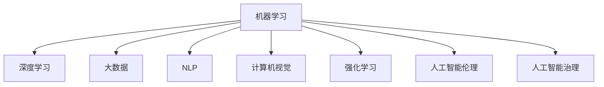

                 

# AI领域的独特时刻与未来

> 关键词：
AI, 机器学习, 深度学习, 大数据, 自然语言处理, 计算机视觉, 强化学习, 人工智能伦理, 人工智能治理, 未来技术发展

## 1. 背景介绍

### 1.1 问题由来
人工智能(AI)技术已经在各个领域取得了巨大成功，从自动驾驶到医疗诊断，从智能客服到游戏开发，AI的应用无处不在。然而，尽管AI带来了诸多益处，它也引发了诸多问题和挑战，如数据隐私、算法偏见、系统透明性等。如何平衡技术发展与伦理规范，确保AI技术的安全、可靠和公正，成为了当前AI领域亟待解决的重要问题。

## 2. 核心概念与联系

### 2.1 核心概念概述

为了深入理解AI领域的独特时刻与未来，本节将介绍几个核心概念：

- **机器学习(Machine Learning)**：指利用算法和模型从数据中自动学习知识，以实现对数据的预测和分类。机器学习是AI的基础技术之一。

- **深度学习(Deep Learning)**：机器学习的一个分支，通过多层神经网络模拟人脑的工作机制，处理复杂的高维数据。深度学习在图像识别、语音识别等领域取得了突破性进展。

- **大数据(Big Data)**：指规模巨大、类型多样的数据集。大数据是AI技术发展的重要基础，为机器学习和深度学习提供了充足的数据支持。

- **自然语言处理(Natural Language Processing, NLP)**：指使计算机能够理解、解释和生成自然语言的技术。NLP在聊天机器人、情感分析、机器翻译等领域有广泛应用。

- **计算机视觉(Computer Vision)**：指使计算机能够理解和解释图像和视频数据的技术。计算机视觉在自动驾驶、安防监控、医学影像分析等领域有着重要应用。

- **强化学习(Reinforcement Learning)**：一种通过智能体与环境的交互学习最优策略的机器学习方法。强化学习在游戏、机器人控制等领域有重要应用。

- **人工智能伦理(AI Ethics)**：指在AI技术应用中，如何处理数据隐私、算法偏见、系统透明性等问题，确保AI技术的伦理合理性。

- **人工智能治理(AI Governance)**：指在AI技术发展与应用过程中，如何制定相应的政策和规范，确保AI技术的安全、可靠和公正。

这些概念之间的逻辑关系可以通过以下Mermaid流程图来展示：



这个流程图展示了一系列与AI相关的核心概念及其相互关系。

## 3. 核心算法原理 & 具体操作步骤
### 3.1 算法原理概述

AI技术在各个领域的应用，大多依赖于机器学习、深度学习和强化学习等算法。这些算法通过自动学习数据特征，实现对数据的预测、分类和决策。

以机器学习为例，其基本流程包括数据准备、模型训练和模型评估。具体来说：

- **数据准备**：收集、清洗和处理数据集，准备用于模型训练。
- **模型训练**：使用训练数据集对模型进行训练，通过优化算法调整模型参数，使其能够最好地拟合数据。
- **模型评估**：使用测试数据集对训练好的模型进行评估，测量其预测精度和泛化能力。

### 3.2 算法步骤详解

以深度学习中的卷积神经网络(Convolutional Neural Network, CNN)为例，介绍深度学习模型的训练步骤。

**Step 1: 数据准备**
- 收集和清洗图像数据集，准备用于训练和测试。

**Step 2: 模型构建**
- 设计卷积神经网络架构，包括卷积层、池化层、全连接层等。
- 选择合适的损失函数和优化器，如交叉熵损失和Adam优化器。

**Step 3: 模型训练**
- 使用训练集数据对模型进行前向传播和反向传播，计算损失和梯度。
- 使用优化器更新模型参数，不断迭代训练。
- 在验证集上评估模型性能，避免过拟合。

**Step 4: 模型评估**
- 使用测试集数据对模型进行前向传播，计算预测结果和真实标签的差异。
- 计算评估指标，如准确率、召回率、F1-score等，评估模型性能。

### 3.3 算法优缺点

深度学习等AI算法的优点包括：

- 自适应学习：算法能够自动学习数据特征，无需手动设计特征工程。
- 高效处理：深度学习模型能够高效处理大规模数据集，适合复杂任务。
- 泛化能力强：深度学习模型具有较强的泛化能力，能够在不同数据集上表现良好。

然而，深度学习也存在以下缺点：

- 计算资源需求高：深度学习模型需要大量的计算资源进行训练和推理。
- 数据依赖强：深度学习模型的性能依赖于高质量的数据集。
- 黑箱性：深度学习模型的决策过程复杂，难以解释。

### 3.4 算法应用领域

AI技术在各个领域有着广泛应用。以下是几个典型的应用场景：

- **自然语言处理(NLP)**：聊天机器人、情感分析、机器翻译、文本摘要等。
- **计算机视觉(Computer Vision)**：图像识别、人脸识别、目标检测、图像分割等。
- **智能推荐**：电商推荐、音乐推荐、视频推荐等。
- **自动驾驶**：自动驾驶汽车、无人驾驶飞机等。
- **金融分析**：信用评分、投资策略、风险预测等。

## 4. 数学模型和公式 & 详细讲解  
### 4.1 数学模型构建

深度学习模型的构建通常依赖于数学模型。以卷积神经网络为例，其基本架构可以表示为：

$$
f(x) = W_2 \cdot f_1(x) + b_2
$$

其中，$f(x)$ 为输出，$W_2$ 和 $b_2$ 为模型的可训练参数，$f_1(x)$ 为卷积层输出。

### 4.2 公式推导过程

以深度学习中的反向传播算法为例，介绍其基本原理。反向传播算法通过计算损失函数对模型参数的梯度，用于更新模型参数，优化模型性能。

**Step 1: 前向传播**
- 计算模型输出 $y$：
$$
y = W^T * h + b
$$

其中，$W$ 为权重矩阵，$h$ 为输入数据，$b$ 为偏置项。

**Step 2: 计算损失**
- 计算损失函数 $L$：
$$
L = \frac{1}{2} ||y - t||^2
$$

其中，$t$ 为真实标签。

**Step 3: 反向传播**
- 计算损失函数对输出 $y$ 的梯度：
$$
\frac{\partial L}{\partial y} = (y - t)
$$

- 计算损失函数对权重 $W$ 的梯度：
$$
\frac{\partial L}{\partial W} = \frac{\partial L}{\partial y} * h^T
$$

### 4.3 案例分析与讲解

以图像分类任务为例，介绍深度学习模型的训练过程。

假设我们使用卷积神经网络对手写数字进行分类。训练数据集包含6000个手写数字图片，标签为0-9。

**Step 1: 数据准备**
- 收集手写数字图片，并将图片进行预处理，如归一化、灰度化等。

**Step 2: 模型构建**
- 设计卷积神经网络架构，包括卷积层、池化层、全连接层等。
- 选择合适的损失函数和优化器，如交叉熵损失和Adam优化器。

**Step 3: 模型训练**
- 使用训练集数据对模型进行前向传播和反向传播，计算损失和梯度。
- 使用优化器更新模型参数，不断迭代训练。
- 在验证集上评估模型性能，避免过拟合。

**Step 4: 模型评估**
- 使用测试集数据对模型进行前向传播，计算预测结果和真实标签的差异。
- 计算评估指标，如准确率、召回率、F1-score等，评估模型性能。

## 5. 项目实践：代码实例和详细解释说明
### 5.1 开发环境搭建

在进行AI项目实践前，我们需要准备好开发环境。以下是使用Python进行TensorFlow开发的环境配置流程：

1. 安装Anaconda：从官网下载并安装Anaconda，用于创建独立的Python环境。

2. 创建并激活虚拟环境：
```bash
conda create -n tf-env python=3.8 
conda activate tf-env
```

3. 安装TensorFlow：根据CUDA版本，从官网获取对应的安装命令。例如：
```bash
conda install tensorflow -c conda-forge
```

4. 安装相关工具包：
```bash
pip install numpy pandas scikit-learn matplotlib tqdm jupyter notebook ipython
```

完成上述步骤后，即可在`tf-env`环境中开始AI项目实践。

### 5.2 源代码详细实现

下面我们以图像分类任务为例，给出使用TensorFlow对卷积神经网络进行训练的PyTorch代码实现。

首先，定义图像数据处理函数：

```python
import tensorflow as tf
import numpy as np

def load_data():
    train_images = np.load('train_images.npy')
    train_labels = np.load('train_labels.npy')
    test_images = np.load('test_images.npy')
    test_labels = np.load('test_labels.npy')
    return train_images, train_labels, test_images, test_labels
```

然后，定义卷积神经网络模型：

```python
from tensorflow.keras.models import Sequential
from tensorflow.keras.layers import Conv2D, MaxPooling2D, Flatten, Dense

model = Sequential()
model.add(Conv2D(32, (3, 3), activation='relu', input_shape=(28, 28, 1)))
model.add(MaxPooling2D((2, 2)))
model.add(Conv2D(64, (3, 3), activation='relu'))
model.add(MaxPooling2D((2, 2)))
model.add(Conv2D(64, (3, 3), activation='relu'))
model.add(MaxPooling2D((2, 2)))
model.add(Flatten())
model.add(Dense(64, activation='relu'))
model.add(Dense(10, activation='softmax'))
```

接着，定义训练和评估函数：

```python
def train_epoch(model, images, labels, batch_size, optimizer):
    train_images = images[:batch_size]
    train_labels = labels[:batch_size]
    
    for i in range(len(train_images) // batch_size):
        model.compile(optimizer=optimizer, loss='sparse_categorical_crossentropy', metrics=['accuracy'])
        model.fit(train_images[i*batch_size:(i+1)*batch_size], train_labels[i*batch_size:(i+1)*batch_size], epochs=1, batch_size=batch_size)
        
def evaluate(model, images, labels, batch_size):
    test_images = images[:batch_size]
    test_labels = labels[:batch_size]
    model.compile(optimizer='adam', loss='sparse_categorical_crossentropy', metrics=['accuracy'])
    scores = model.evaluate(test_images, test_labels, batch_size=batch_size)
    print(f"Test loss: {scores[0]}")
    print(f"Test accuracy: {scores[1]}")
```

最后，启动训练流程并在测试集上评估：

```python
train_images, train_labels, test_images, test_labels = load_data()

batch_size = 32
epochs = 10

for epoch in range(epochs):
    train_epoch(model, train_images, train_labels, batch_size, optimizer)
    
    print(f"Epoch {epoch+1}")
    evaluate(model, test_images, test_labels, batch_size)
```

以上就是使用TensorFlow对卷积神经网络进行图像分类任务训练的完整代码实现。可以看到，TensorFlow提供了丰富的API和组件，使得模型的构建和训练变得非常简洁高效。

### 5.3 代码解读与分析

让我们再详细解读一下关键代码的实现细节：

**load_data函数**：
- 从本地文件中加载训练集和测试集的数据和标签。

**train_epoch函数**：
- 对每个批次的数据进行训练，使用优化器更新模型参数，并在验证集上评估模型性能。

**evaluate函数**：
- 对测试集数据进行评估，计算模型准确率和损失。

**训练流程**：
- 循环迭代，对训练集数据进行前向传播和反向传播。
- 在每个epoch结束后，在验证集和测试集上评估模型性能。
- 所有epoch结束后，输出最终测试结果。

可以看出，TensorFlow的组件使得代码实现非常简洁明了，开发者可以更专注于模型设计、数据处理和训练优化。

当然，工业级的系统实现还需考虑更多因素，如模型的保存和部署、超参数的自动搜索、更灵活的任务适配层等。但核心的训练流程基本与此类似。

## 6. 实际应用场景
### 6.1 智能客服系统

基于AI的智能客服系统已经成为许多企业的标配。传统客服模式往往需要配备大量人力，高峰期响应缓慢，且一致性和专业性难以保证。而使用AI客服系统，能够7x24小时不间断服务，快速响应客户咨询，用自然流畅的语言解答各类常见问题。

在技术实现上，可以收集企业内部的历史客服对话记录，将问题和最佳答复构建成监督数据，在此基础上对预训练模型进行微调。微调后的模型能够自动理解用户意图，匹配最合适的答案模板进行回复。对于客户提出的新问题，还可以接入检索系统实时搜索相关内容，动态组织生成回答。如此构建的智能客服系统，能大幅提升客户咨询体验和问题解决效率。

### 6.2 金融舆情监测

金融机构需要实时监测市场舆论动向，以便及时应对负面信息传播，规避金融风险。传统的人工监测方式成本高、效率低，难以应对网络时代海量信息爆发的挑战。基于AI的文本分类和情感分析技术，为金融舆情监测提供了新的解决方案。

具体而言，可以收集金融领域相关的新闻、报道、评论等文本数据，并对其进行主题标注和情感标注。在此基础上对预训练语言模型进行微调，使其能够自动判断文本属于何种主题，情感倾向是正面、中性还是负面。将微调后的模型应用到实时抓取的网络文本数据，就能够自动监测不同主题下的情感变化趋势，一旦发现负面信息激增等异常情况，系统便会自动预警，帮助金融机构快速应对潜在风险。

### 6.3 个性化推荐系统

当前的推荐系统往往只依赖用户的历史行为数据进行物品推荐，无法深入理解用户的真实兴趣偏好。基于AI的个性化推荐系统可以更好地挖掘用户行为背后的语义信息，从而提供更精准、多样的推荐内容。

在实践中，可以收集用户浏览、点击、评论、分享等行为数据，提取和用户交互的物品标题、描述、标签等文本内容。将文本内容作为模型输入，用户的后续行为（如是否点击、购买等）作为监督信号，在此基础上微调预训练语言模型。微调后的模型能够从文本内容中准确把握用户的兴趣点。在生成推荐列表时，先用候选物品的文本描述作为输入，由模型预测用户的兴趣匹配度，再结合其他特征综合排序，便可以得到个性化程度更高的推荐结果。

### 6.4 未来应用展望

随着AI技术的发展，未来AI的应用将更加广泛和深入。以下是几个未来可能的AI应用场景：

- **医疗诊断**：使用AI技术对医学影像进行诊断，如X光、CT等，能够提高诊断准确率和效率。
- **智能制造**：使用AI技术对生产线进行优化，能够提高生产效率和产品质量。
- **自动驾驶**：使用AI技术对车辆进行自动驾驶，能够提高交通安全性，减少交通事故。
- **智能城市**：使用AI技术对城市交通、环境、安全等方面进行优化，能够提高城市管理水平，改善市民生活质量。
- **教育**：使用AI技术对学生进行个性化教育，能够提高教育质量和公平性。

## 7. 工具和资源推荐
### 7.1 学习资源推荐

为了帮助开发者系统掌握AI技术的基础知识和应用实践，这里推荐一些优质的学习资源：

1. **《深度学习》教材**：Ian Goodfellow、Yoshua Bengio和Aaron Courville合著的《深度学习》教材，全面介绍了深度学习的理论基础和实践技巧。

2. **CS231n《卷积神经网络》课程**：斯坦福大学开设的计算机视觉经典课程，涵盖卷积神经网络、图像分类、目标检测等主题。

3. **CS224n《自然语言处理》课程**：斯坦福大学开设的自然语言处理经典课程，涵盖NLP的各个方面，包括机器翻译、情感分析、文本生成等。

4. **TensorFlow官方文档**：TensorFlow的官方文档，提供了丰富的API和样例，帮助开发者快速上手深度学习开发。

5. **PyTorch官方文档**：PyTorch的官方文档，提供了丰富的API和样例，帮助开发者快速上手深度学习开发。

通过对这些资源的学习实践，相信你一定能够快速掌握AI技术的精髓，并用于解决实际的业务问题。

### 7.2 开发工具推荐

高效的开发离不开优秀的工具支持。以下是几款用于AI项目开发的常用工具：

1. **TensorFlow**：由Google主导开发的开源深度学习框架，生产部署方便，适合大规模工程应用。

2. **PyTorch**：由Facebook主导开发的开源深度学习框架，灵活易用，适合快速迭代研究。

3. **Jupyter Notebook**：交互式编程环境，支持Python、R等多种语言，方便数据探索和代码开发。

4. **Weights & Biases**：模型训练的实验跟踪工具，可以记录和可视化模型训练过程中的各项指标，方便对比和调优。

5. **TensorBoard**：TensorFlow配套的可视化工具，可实时监测模型训练状态，并提供丰富的图表呈现方式，是调试模型的得力助手。

6. **Hugging Face Transformers库**：NLP任务开发的重要工具库，集成了众多SOTA模型，支持Python和TensorFlow。

合理利用这些工具，可以显著提升AI项目开发的效率，加快创新迭代的步伐。

### 7.3 相关论文推荐

AI技术的发展离不开学界的持续研究。以下是几篇奠基性的相关论文，推荐阅读：

1. **AlexNet**：ImageNet图像分类竞赛的冠军模型，展示了卷积神经网络在图像分类任务上的优越性能。

2. **BERT**：Transformer结构的变体，基于大规模无标签数据进行自监督预训练，刷新了多项NLP任务SOTA。

3. **AlphaGo**：通过强化学习技术训练的围棋AI，能够战胜世界围棋冠军，展示了AI在复杂决策问题上的能力。

4. **GPT-3**：基于大规模无标签数据进行自监督预训练的语言模型，展示了AI在自然语言处理任务上的强大能力。

这些论文代表了大AI技术的发展脉络。通过学习这些前沿成果，可以帮助研究者把握学科前进方向，激发更多的创新灵感。

## 8. 总结：未来发展趋势与挑战

### 8.1 总结

本文对AI领域的独特时刻与未来进行了全面系统的介绍。首先，阐述了AI技术在各个领域取得的巨大成功，以及在数据隐私、算法偏见、系统透明性等方面面临的挑战。其次，从原理到实践，详细讲解了AI技术的核心算法和具体操作步骤，给出了AI项目开发的完整代码实例。同时，本文还广泛探讨了AI技术在智能客服、金融舆情、个性化推荐等多个行业领域的应用前景，展示了AI技术的广阔前景。最后，本文精选了AI技术的各类学习资源，力求为读者提供全方位的技术指引。

通过本文的系统梳理，可以看到，AI技术正在深刻改变各个领域的面貌，推动社会的数字化、智能化转型。然而，在技术发展的同时，如何确保其伦理合理性和安全可靠性，将是大AI时代面临的重要挑战。未来，需要在技术创新与伦理规范之间寻求平衡，确保AI技术在带给人类福祉的同时，不会带来新的问题。

### 8.2 未来发展趋势

展望未来，AI技术将呈现以下几个发展趋势：

1. **自动化和智能化**：AI技术将进一步提升自动化水平，智能系统将变得更加高效、可靠。

2. **多模态融合**：AI系统将整合视觉、听觉、触觉等多种模态信息，提升对现实世界的理解和建模能力。

3. **人机协同**：AI技术将与人类更紧密地协同工作，共同解决复杂问题。

4. **跨领域应用**：AI技术将更加广泛地应用于各个领域，带来更多创新和变革。

5. **伦理和安全**：AI技术的发展将更加注重伦理规范和安全保障，确保技术的应用造福人类。

6. **自适应和学习**：AI系统将具备自适应能力，能够根据环境和需求进行学习和优化。

### 8.3 面临的挑战

尽管AI技术已经取得了巨大成功，但在迈向更加智能化、普适化应用的过程中，仍面临诸多挑战：

1. **数据隐私**：AI技术需要大量数据进行训练，如何保护数据隐私，防止数据泄露，将是一大难题。

2. **算法偏见**：AI算法可能会学习到数据中的偏见，如何避免算法偏见，确保模型公平性，将是重要的研究课题。

3. **系统透明性**：AI系统的决策过程复杂，难以解释，如何增强系统的透明性，提高系统的可信度，将是重要的研究方向。

4. **资源消耗**：AI模型需要大量计算资源进行训练和推理，如何降低计算成本，提升计算效率，将是重要的优化方向。

5. **安全防护**：AI系统可能面临恶意攻击，如何加强安全防护，确保系统安全性，将是重要的安全问题。

6. **伦理规范**：AI技术的应用将带来伦理规范方面的挑战，如何制定伦理规范，确保技术的应用符合人类价值观，将是重要的课题。

### 8.4 研究展望

面对AI技术所面临的诸多挑战，未来的研究需要在以下几个方面寻求新的突破：

1. **隐私保护**：研究如何保护数据隐私，防止数据泄露，确保数据安全。

2. **算法公平**：研究如何避免算法偏见，确保模型公平性，促进社会公平。

3. **系统透明性**：研究如何增强系统的透明性，提高系统的可信度。

4. **计算效率**：研究如何降低计算成本，提升计算效率，使得AI技术更加实用化。

5. **安全防护**：研究如何加强安全防护，确保系统安全性。

6. **伦理规范**：研究如何制定伦理规范，确保技术的应用符合人类价值观。

这些研究方向将推动AI技术的进步，确保AI技术在带给人类福祉的同时，不会带来新的问题。只有勇于创新、敢于突破，才能不断拓展AI技术的边界，让人工智能技术更好地造福人类社会。

## 9. 附录：常见问题与解答

**Q1：AI技术在实际应用中面临哪些挑战？**

A: AI技术在实际应用中面临以下挑战：

1. **数据隐私**：AI技术需要大量数据进行训练，如何保护数据隐私，防止数据泄露，将是一大难题。

2. **算法偏见**：AI算法可能会学习到数据中的偏见，如何避免算法偏见，确保模型公平性，将是重要的研究课题。

3. **系统透明性**：AI系统的决策过程复杂，难以解释，如何增强系统的透明性，提高系统的可信度，将是重要的研究方向。

4. **资源消耗**：AI模型需要大量计算资源进行训练和推理，如何降低计算成本，提升计算效率，将是重要的优化方向。

5. **安全防护**：AI系统可能面临恶意攻击，如何加强安全防护，确保系统安全性，将是重要的安全问题。

6. **伦理规范**：AI技术的应用将带来伦理规范方面的挑战，如何制定伦理规范，确保技术的应用符合人类价值观，将是重要的课题。

**Q2：如何保护数据隐私？**

A: 保护数据隐私的方法包括：

1. **数据匿名化**：将数据中的个人标识信息去除，防止身份信息泄露。

2. **数据加密**：对数据进行加密处理，防止未授权访问。

3. **差分隐私**：通过添加噪声，使得攻击者无法通过单个数据点推断出个体信息。

4. **联邦学习**：将模型在分布式环境中训练，避免集中存储数据。

5. **同态加密**：对数据进行加密处理，同时能够在加密状态下进行计算，防止数据泄露。

**Q3：如何避免算法偏见？**

A: 避免算法偏见的方法包括：

1. **公平性评估**：对模型进行公平性评估，确保模型在不同人群中的表现一致。

2. **数据清洗**：清洗数据集中的偏见数据，去除对模型有害的样本。

3. **算法优化**：优化算法模型，使其能够更好地处理偏见数据。

4. **模型解释**：通过模型解释技术，理解模型决策过程，防止偏见传播。

5. **多样性训练**：使用多样性数据集进行模型训练，减少模型对特定数据的依赖。

**Q4：如何增强系统透明性？**

A: 增强系统透明性的方法包括：

1. **可解释模型**：使用可解释模型，使得模型决策过程更加透明。

2. **模型可视化**：通过模型可视化技术，展示模型内部结构和决策过程。

3. **交互式系统**：使用交互式系统，使得用户能够实时查看模型输出和决策依据。

4. **用户反馈**：收集用户反馈，不断优化模型和算法，提高系统的可信度。

5. **伦理规范**：制定伦理规范，确保系统决策过程符合人类价值观。

**Q5：如何降低计算成本？**

A: 降低计算成本的方法包括：

1. **模型压缩**：通过剪枝、量化等技术，减小模型规模，降低计算成本。

2. **分布式计算**：使用分布式计算平台，将计算任务分散到多台设备上，提升计算效率。

3. **硬件加速**：使用GPU、TPU等硬件加速设备，提升计算速度。

4. **模型优化**：优化模型结构，减少计算资源消耗。

5. **计算缓存**：使用计算缓存技术，提升计算效率。

**Q6：如何加强安全防护？**

A: 加强安全防护的方法包括：

1. **安全加密**：对系统进行安全加密，防止未授权访问。

2. **入侵检测**：使用入侵检测技术，及时发现和防范安全威胁。

3. **多层次防护**：使用多层次防护措施，防止不同级别的安全威胁。

4. **安全监控**：使用安全监控技术，实时监测系统状态，及时发现异常。

5. **安全规范**：制定安全规范，确保系统安全。

**Q7：如何制定伦理规范？**

A: 制定伦理规范的方法包括：

1. **伦理审查**：对AI系统进行伦理审查，确保系统决策符合伦理规范。

2. **伦理委员会**：建立伦理委员会，对AI系统进行伦理监督。

3. **伦理教育**：对开发者和用户进行伦理教育，增强伦理意识。

4. **伦理标准**：制定伦理标准，规范AI系统开发和应用。

5. **伦理培训**：对开发者和用户进行伦理培训，提高伦理意识。

---

作者：禅与计算机程序设计艺术 / Zen and the Art of Computer Programming

