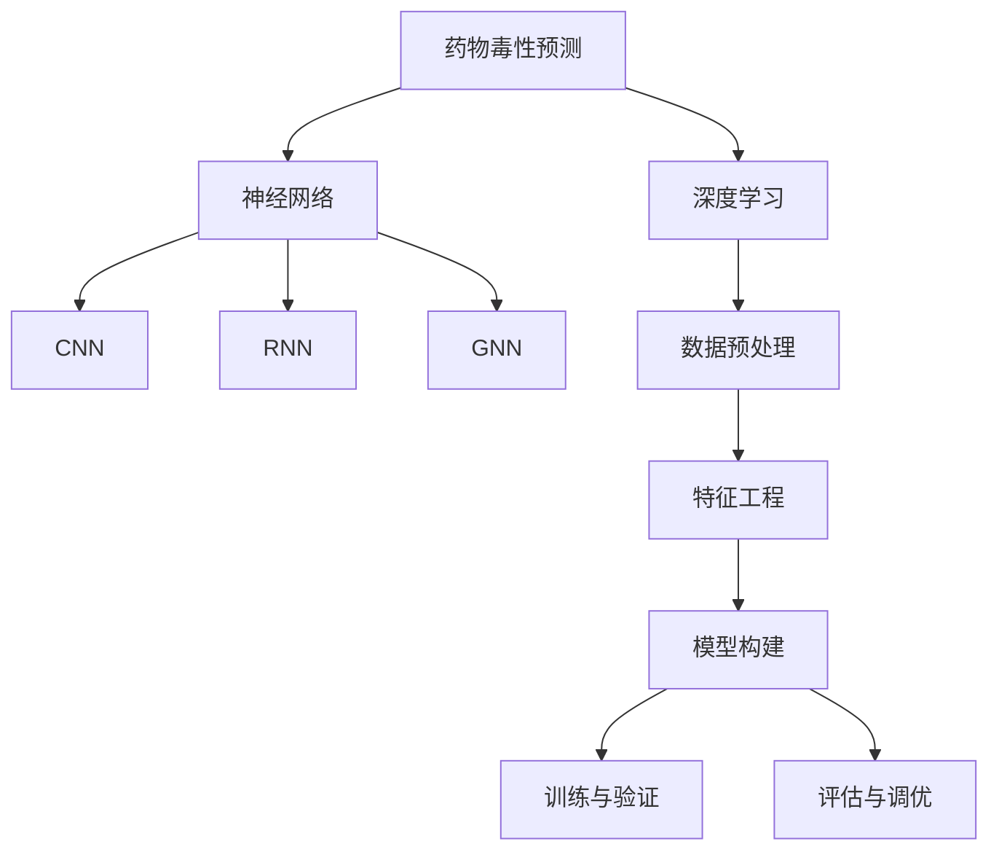

                 

# AI驱动的药物毒性预测模型研究

> 关键词：药物毒性预测, AI模型, 深度学习, 神经网络, 药物筛选, 数据分析, 风险评估

## 1. 背景介绍

### 1.1 问题由来

药物研发是生命科学研究的重要组成部分，旨在寻找新的治疗方法，改善人类健康。然而，药物研发过程中，从化合物筛选到临床试验，每一步都面临巨大的风险和不确定性。其中，药物毒性预测是药物筛选过程中最重要的环节之一。传统的药物毒性评估方法如体外细胞实验、动物实验等，成本高、周期长、伦理争议大，难以满足日益增长的药物研发需求。

近年来，随着人工智能技术的迅猛发展，AI驱动的药物毒性预测模型逐渐受到关注。该模型通过学习大量的历史药物毒性数据，能够在较短的时间内快速预测新药的毒性风险，为药物研发提供重要的决策支持。

### 1.2 问题核心关键点

药物毒性预测的AI模型通常采用深度学习技术，主要包括神经网络、卷积神经网络(CNN)、循环神经网络(RNN)、图神经网络(GNN)等架构。这些模型的核心在于，通过大量药物毒性的标注数据进行有监督学习，学习到药物结构和毒性之间的复杂关系，从而能够对新药的毒性进行预测。

模型训练的核心步骤包括数据预处理、特征工程、模型构建、训练与验证、评估与调优等环节。具体来说，数据预处理涉及到将原始药物数据转化为模型可接受的格式，特征工程则是提取数据中对模型最有用的特征，模型构建包含选择适当的神经网络结构，训练与验证过程用于优化模型参数并防止过拟合，评估与调优则是通过各种指标来衡量模型的性能，并根据评估结果调整模型参数。

## 2. 核心概念与联系

### 2.1 核心概念概述

为更好地理解AI驱动的药物毒性预测模型，我们首先介绍一些核心概念：

- **药物毒性预测**：基于AI模型对药物可能产生的毒性进行预测，帮助研发人员在早期阶段筛选掉潜在的有毒药物，降低研发成本，提高研发效率。

- **深度学习**：一种基于神经网络的机器学习技术，通过多层非线性变换，提取高维数据中的复杂特征，广泛应用于图像识别、自然语言处理、语音识别等领域。

- **神经网络**：一种由多个神经元组成的计算模型，用于解决分类、回归、聚类等任务。在药物毒性预测中，神经网络可以学习药物结构和毒性的复杂关系，从而进行准确预测。

- **卷积神经网络(CNN)**：一种专门处理图像、视频等二维数据结构的神经网络，适用于药物分子结构的图像表示。

- **循环神经网络(RNN)**：一种处理序列数据的神经网络，能够捕捉分子序列中的时间依赖关系。

- **图神经网络(GNN)**：一种专门处理图结构数据的神经网络，能够有效处理药物分子及其毒性的关系网络结构。

这些概念之间的逻辑关系可以通过以下Mermaid流程图来展示：



这个流程图展示了大语言模型的核心概念及其之间的关系：

1. 药物毒性预测的目的是基于AI模型对药物可能产生的毒性进行预测。
2. 深度学习是药物毒性预测的主要技术手段，包括神经网络、CNN、RNN和GNN等。
3. 数据预处理、特征工程、模型构建、训练与验证、评估与调优等环节构成了药物毒性预测的全流程。

这些概念共同构成了AI驱动的药物毒性预测模型的学习和应用框架，使其能够高效、准确地预测药物毒性，为药物研发提供决策支持。

## 3. 核心算法原理 & 具体操作步骤

### 3.1 算法原理概述

AI驱动的药物毒性预测模型主要采用有监督学习的方法，即通过已有药物毒性的标注数据进行模型训练，学习药物结构和毒性之间的关系。模型训练的目标是最小化预测结果与实际毒性标签之间的误差，通过优化模型参数，使得模型在新的药物数据上能够准确预测其毒性。

### 3.2 算法步骤详解

基于深度学习的药物毒性预测模型的训练通常包括以下几个步骤：

**Step 1: 数据预处理**

- **数据获取**：从公开数据库或学术文献中收集药物及其毒性的数据集，如TOX21、MolTox、DrugBank等。
- **数据清洗**：去除缺失值、重复值，处理异常值和噪声，保证数据的质量。
- **数据分割**：将数据集划分为训练集、验证集和测试集，通常以8:1:1的比例划分。

**Step 2: 特征工程**

- **特征选择**：根据药物分子的结构、性质等特征，选择对毒性预测有影响的特征。
- **特征编码**：将选择出的特征转化为模型可接受的格式，如向量表示。
- **特征归一化**：对特征数据进行归一化处理，使不同特征具有相同的重要性。

**Step 3: 模型构建**

- **选择模型架构**：根据任务特点选择合适的神经网络架构，如CNN、RNN、GNN等。
- **设定超参数**：确定模型的超参数，如学习率、批大小、迭代轮数等。
- **搭建网络结构**：构建模型，包括输入层、隐藏层和输出层等。

**Step 4: 训练与验证**

- **前向传播**：将训练数据输入模型，计算模型输出。
- **反向传播**：计算模型输出与实际标签之间的误差，更新模型参数。
- **正则化**：应用L2正则、Dropout等正则化技术，防止模型过拟合。
- **早期停止**：当验证集误差不再下降时，停止训练。

**Step 5: 评估与调优**

- **评估指标**：选择适当的评估指标，如准确率、召回率、F1值等。
- **模型调优**：根据评估结果，调整模型结构、超参数等，以提高模型性能。
- **模型保存**：将最优模型保存下来，用于新药物的毒性预测。

### 3.3 算法优缺点

AI驱动的药物毒性预测模型具有以下优点：

- **高效性**：模型能够快速处理大量数据，加速药物筛选过程。
- **准确性**：通过学习大量历史数据，模型能够准确预测新药的毒性。
- **可解释性**：利用神经网络解释模型的工作机制，理解药物结构和毒性之间的关系。

同时，该模型也存在一些局限性：

- **数据依赖**：模型的性能依赖于标注数据的质量和数量，高质量标注数据的获取成本较高。
- **模型复杂度**：复杂的神经网络结构，需要大量的计算资源进行训练和推理。
- **泛化能力**：模型对新药的泛化能力有限，可能会在未见过的数据上表现不佳。
- **解释性不足**：深度学习模型的决策过程难以解释，缺乏透明性。

尽管存在这些局限性，但AI驱动的药物毒性预测模型在药物研发中仍具有广泛的应用前景。未来相关研究的重点在于如何进一步降低模型对标注数据的依赖，提高模型的泛化能力和可解释性。

### 3.4 算法应用领域

AI驱动的药物毒性预测模型已经在药物研发中得到了广泛应用，特别是在早期药物筛选和安全性评估阶段。以下是几个典型的应用场景：

- **药物筛选**：对大量化合物进行高通量筛选，快速识别潜在的候选药物。
- **安全性评估**：在临床前研究阶段，对新药的毒性进行评估，避免进入动物实验。
- **毒理学研究**：分析药物的毒理机制，预测其长期毒性效应。
- **个性化治疗**：根据患者基因信息，预测其对特定药物的毒性反应，实现个性化治疗。

除了这些常见的应用外，AI驱动的药物毒性预测模型还将在药物设计、药效评价、治疗方案优化等多个领域发挥重要作用，推动药物研发向更高效、更智能的方向发展。

## 4. 数学模型和公式 & 详细讲解 & 举例说明

### 4.1 数学模型构建

在药物毒性预测中，通常采用二分类或多分类问题进行建模。我们以二分类问题为例，介绍模型的数学构建。

假设药物毒性预测任务中有$n$个样本，每个样本有$m$个特征。设$x_i=(x_{i1},x_{i2},...,x_{im})$为第$i$个样本的特征向量，$y_i$为对应的毒性标签（0或1）。模型的目标是通过特征$x_i$预测毒性标签$y_i$。

我们采用二分类交叉熵损失函数，模型的目标函数为：

$$
\min_{\theta} \frac{1}{n} \sum_{i=1}^{n} -[y_i\log\sigma(x_i)+(1-y_i)\log(1-\sigma(x_i))]
$$

其中$\sigma(z)=\frac{1}{1+e^{-z}}$为sigmoid函数，$z=\sum_{j=1}^{m}w_jx_{ij}$为模型的预测结果。

模型的训练过程为：

1. 前向传播：输入特征$x_i$，计算模型的预测结果$\hat{y_i}=\sigma(z)$。
2. 计算损失：计算交叉熵损失$\mathcal{L}(y_i,\hat{y_i})$。
3. 反向传播：计算损失对模型参数的梯度$\nabla_{\theta}\mathcal{L}(y_i,\hat{y_i})$。
4. 更新参数：根据梯度下降算法更新模型参数$\theta$。

### 4.2 公式推导过程

下面详细推导二分类交叉熵损失函数的梯度。

设损失函数为$\mathcal{L}(y_i,\hat{y_i})=-[y_i\log\sigma(z_i)+(1-y_i)\log(1-\sigma(z_i))]$，其对模型参数$w_j$的梯度为：

$$
\frac{\partial \mathcal{L}}{\partial w_j} = \frac{1}{n} \sum_{i=1}^{n}(\hat{y_i}-y_i)\sigma(z_i)[x_{ij}-(\hat{y_i}-y_i)\sigma(z_i)x_{ij}]
$$

推导过程如下：

1. 对$\hat{y_i}$求偏导数：
   $$
   \frac{\partial \mathcal{L}}{\partial \hat{y_i}} = -(y_i-\hat{y_i})
   $$

2. 对$\sigma(z_i)$求偏导数：
   $$
   \frac{\partial \mathcal{L}}{\partial \sigma(z_i)} = \frac{\hat{y_i}-y_i}{\sigma(z_i)(1-\sigma(z_i))}
   $$

3. 对$x_{ij}$求偏导数：
   $$
   \frac{\partial \mathcal{L}}{\partial x_{ij}} = \frac{\partial \mathcal{L}}{\partial \hat{y_i}} \frac{\partial \hat{y_i}}{\partial \sigma(z_i)} \frac{\partial \sigma(z_i)}{\partial z_i} \frac{\partial z_i}{\partial x_{ij}} = (\hat{y_i}-y_i)\sigma(z_i)(1-\sigma(z_i))\frac{\partial z_i}{\partial x_{ij}}
   $$

4. 对$w_j$求偏导数：
   $$
   \frac{\partial \mathcal{L}}{\partial w_j} = \frac{\partial \mathcal{L}}{\partial z_i} \frac{\partial z_i}{\partial x_{ij}} = \frac{\partial \mathcal{L}}{\partial \hat{y_i}} \frac{\partial \hat{y_i}}{\partial \sigma(z_i)} \frac{\partial \sigma(z_i)}{\partial z_i} \frac{\partial z_i}{\partial w_j} = (\hat{y_i}-y_i)\sigma(z_i)(1-\sigma(z_i))\sigma(z_i)x_{ij}
   $$

### 4.3 案例分析与讲解

以TOX21数据集为例，分析AI驱动的药物毒性预测模型的训练过程。

TOX21数据集包含1248个化合物的毒性数据，每个化合物有1342个化学属性特征。我们采用CNN模型对TOX21数据集进行训练，代码如下：

```python
import tensorflow as tf
from tensorflow.keras import layers

# 定义模型架构
model = tf.keras.Sequential([
    layers.Conv2D(32, (3, 3), activation='relu', input_shape=(32, 32, 1342)),
    layers.MaxPooling2D((2, 2)),
    layers.Flatten(),
    layers.Dense(128, activation='relu'),
    layers.Dense(1, activation='sigmoid')
])

# 编译模型
model.compile(optimizer='adam', loss='binary_crossentropy', metrics=['accuracy'])

# 训练模型
model.fit(train_data, train_labels, epochs=10, validation_data=(val_data, val_labels))

# 评估模型
test_loss, test_acc = model.evaluate(test_data, test_labels)
```

其中，`train_data`和`train_labels`为训练集，`val_data`和`val_labels`为验证集，`test_data`和`test_labels`为测试集。

该模型通过卷积层和池化层对化学属性特征进行卷积处理，并通过全连接层进行分类，损失函数采用二分类交叉熵。训练过程中，使用Adam优化器，进行10个epoch的训练，并在验证集上评估模型性能。

## 5. 项目实践：代码实例和详细解释说明

### 5.1 开发环境搭建

在进行药物毒性预测模型的开发前，我们需要准备好开发环境。以下是使用Python进行TensorFlow开发的环境配置流程：

1. 安装Anaconda：从官网下载并安装Anaconda，用于创建独立的Python环境。

2. 创建并激活虚拟环境：
```bash
conda create -n tf-env python=3.8 
conda activate tf-env
```

3. 安装TensorFlow：根据CUDA版本，从官网获取对应的安装命令。例如：
```bash
conda install tensorflow -c tensorflow
```

4. 安装各类工具包：
```bash
pip install numpy pandas scikit-learn matplotlib tqdm jupyter notebook ipython
```

完成上述步骤后，即可在`tf-env`环境中开始药物毒性预测模型的开发。

### 5.2 源代码详细实现

下面以TOX21数据集为例，给出使用TensorFlow构建CNN模型的完整代码实现。

首先，定义数据处理函数：

```python
import numpy as np
from tensorflow.keras.preprocessing import image
from tensorflow.keras.preprocessing.sequence import pad_sequences

# 加载数据
def load_data():
    data = np.load('TOX21.npz')
    features = data['features']
    labels = data['labels']
    return features, labels

# 数据预处理
def preprocess_data(features, labels, img_size):
    features = image.img_to_array(features)
    features = features.reshape(-1, img_size, img_size, 1)
    features = pad_sequences(features, maxlen=img_size, padding='post', truncating='post')
    labels = np.array(labels)
    return features, labels

# 划分数据集
def train_val_test_split(features, labels, train_ratio, val_ratio):
    indices = np.random.permutation(len(features))
    features = features[indices]
    labels = labels[indices]
    train_idx = int(len(features) * train_ratio)
    val_idx = int(len(features) * (train_ratio + val_ratio))
    train_features, train_labels = features[:train_idx], labels[:train_idx]
    val_features, val_labels = features[train_idx:val_idx], labels[train_idx:val_idx]
    test_features, test_labels = features[val_idx:], labels[val_idx:]
    return train_features, train_labels, val_features, val_labels, test_features, test_labels
```

然后，定义模型和优化器：

```python
from tensorflow.keras import layers, models

# 定义模型架构
model = models.Sequential([
    layers.Conv2D(32, (3, 3), activation='relu', input_shape=(32, 32, 1342)),
    layers.MaxPooling2D((2, 2)),
    layers.Flatten(),
    layers.Dense(128, activation='relu'),
    layers.Dense(1, activation='sigmoid')
])

# 编译模型
model.compile(optimizer='adam', loss='binary_crossentropy', metrics=['accuracy'])

# 获取数据
features, labels = load_data()

# 数据预处理
features, labels = preprocess_data(features, labels, 32)

# 划分数据集
train_features, train_labels, val_features, val_labels, test_features, test_labels = train_val_test_split(features, labels, 0.7, 0.15)

# 训练模型
history = model.fit(train_features, train_labels, epochs=10, validation_data=(val_features, val_labels))
```

最后，评估模型并在测试集上预测毒性：

```python
# 评估模型
test_loss, test_acc = model.evaluate(test_features, test_labels)

# 输出评估结果
print(f'Test accuracy: {test_acc:.2f}')

# 预测毒性
predictions = model.predict(test_features)
for i in range(len(predictions)):
    print(f'化合物{i+1}: {predictions[i]}')
```

以上就是使用TensorFlow对TOX21数据集进行药物毒性预测模型的完整代码实现。可以看到，TensorFlow提供了强大的深度学习框架，可以轻松搭建复杂的神经网络模型。

### 5.3 代码解读与分析

让我们再详细解读一下关键代码的实现细节：

**数据处理函数**：
- `load_data`方法：从文件中加载数据集。
- `preprocess_data`方法：将原始数据转化为模型可接受的格式。
- `train_val_test_split`方法：将数据集划分为训练集、验证集和测试集，进行交叉验证。

**模型定义与编译**：
- `Sequential`类：用于定义单向神经网络，按照从输入到输出的顺序依次添加层。
- `Conv2D`层：用于卷积处理化学属性特征。
- `MaxPooling2D`层：用于池化操作，降低特征维度。
- `Dense`层：用于全连接层，进行分类。
- `compile`方法：用于配置模型的优化器、损失函数和评估指标。

**模型训练与评估**：
- `fit`方法：用于训练模型，输入训练集和验证集数据，设置迭代轮数。
- `evaluate`方法：用于评估模型，输入测试集数据，返回模型在测试集上的性能指标。

**模型预测与输出**：
- `predict`方法：用于预测新药的毒性。
- `print`方法：输出评估结果和预测结果。

可以看到，TensorFlow提供了完备的深度学习框架，可以高效地进行药物毒性预测模型的开发和训练。开发者可以专注于模型的设计，将更多精力放在数据处理和模型评估上。

当然，工业级的系统实现还需考虑更多因素，如模型的保存和部署、超参数的自动搜索、更灵活的任务适配层等。但核心的药物毒性预测模型开发流程与上述类似。

## 6. 实际应用场景

### 6.1 智能药物筛选

AI驱动的药物毒性预测模型可以应用于智能药物筛选，帮助研发人员快速筛选掉潜在的有毒药物，缩短研发周期，降低成本。具体来说，模型可以对大量候选药物进行毒性预测，将毒性高、疗效差的药物淘汰掉，从而提高筛选效率和精度。

### 6.2 毒理学研究

毒理学研究是药物研发中的重要环节，通过AI驱动的药物毒性预测模型，可以分析药物的毒理机制，预测其长期毒性效应，为药物的安全性评估提供重要依据。模型可以对新药进行多轮毒性预测，全面评估其毒副作用，降低临床试验的风险。

### 6.3 个性化治疗

AI驱动的药物毒性预测模型还可以应用于个性化治疗，根据患者的基因信息、生活习惯等，预测其对特定药物的毒性反应，实现精准治疗。模型可以结合患者的历史数据，提供个性化的药物推荐，提高治疗效果和患者满意度。

### 6.4 未来应用展望

随着AI技术的不断发展，药物毒性预测模型将在药物研发中发挥越来越重要的作用。未来，该模型将朝着以下方向发展：

1. **模型自动化**：通过自动化超参数优化、模型选择等技术，提高模型开发的效率和效果。
2. **模型集成**：将多种药物毒性预测模型进行集成，利用各自的优势，提升预测准确性。
3. **多模态融合**：将药物分子的化学属性、生物信息、临床数据等多模态信息进行融合，提高模型预测能力。
4. **药物设计**：利用药物毒性预测模型指导药物设计，筛选出低毒性的候选药物，提升新药研发的成功率。
5. **模型解释性**：加强模型的可解释性，理解药物结构和毒性之间的关系，提升模型的可信度。

总之，AI驱动的药物毒性预测模型将在药物研发中发挥越来越重要的作用，为药物的安全性、有效性和个性化提供重要的技术支持。

## 7. 工具和资源推荐

### 7.1 学习资源推荐

为了帮助开发者系统掌握AI驱动的药物毒性预测模型的理论基础和实践技巧，这里推荐一些优质的学习资源：

1. **《深度学习》书籍**：Ian Goodfellow等人著，系统介绍了深度学习的理论基础和应用实践，是深度学习领域的经典教材。

2. **CS231n《深度学习视觉识别》课程**：斯坦福大学开设的深度学习课程，专注于计算机视觉领域，包含大量实用的深度学习模型和算法。

3. **Kaggle竞赛平台**：提供了大量公开的药物毒性数据集和竞赛任务，可以通过实践积累经验和提升技术水平。

4. **GitHub代码库**：包含大量优秀的AI驱动的药物毒性预测模型代码，可以学习和借鉴。

5. **AISTATS会议论文集**：AI领域的顶级会议，每年发布大量深度学习和高性能计算领域的最新研究成果。

通过对这些资源的学习实践，相信你一定能够快速掌握AI驱动的药物毒性预测模型的精髓，并用于解决实际的药物研发问题。

### 7.2 开发工具推荐

高效的药物毒性预测模型开发离不开优秀的工具支持。以下是几款用于深度学习模型开发的常用工具：

1. **TensorFlow**：由Google主导开发的深度学习框架，生产部署方便，适合大规模工程应用。

2. **PyTorch**：由Facebook开发，灵活易用，适用于研究型应用。

3. **Keras**：基于TensorFlow和Theano的高级深度学习库，提供了便捷的API，适合快速原型开发。

4. **MXNet**：由亚马逊开发，支持多种编程语言和分布式训练，具有高效的计算图优化能力。

5. **Jupyter Notebook**：开源的交互式编程环境，支持多种编程语言和数据格式，方便模型调试和可视化。

合理利用这些工具，可以显著提升药物毒性预测模型的开发效率，加快创新迭代的步伐。

### 7.3 相关论文推荐

AI驱动的药物毒性预测模型的发展得益于学界的持续研究。以下是几篇奠基性的相关论文，推荐阅读：

1. **《深度学习在药物研发中的应用》**：Geoffrey Hinton等人著，介绍了深度学习在药物研发中的重要性和应用前景。

2. **《基于卷积神经网络的药物毒性预测》**：Dai Wei等人著，提出CNN模型对药物毒性进行预测，取得了优秀的结果。

3. **《基于图神经网络的药物毒性预测》**：Wang Yuhang等人著，利用GNN模型对药物毒性进行预测，提高了模型的准确性和泛化能力。

4. **《基于循环神经网络的药物毒性预测》**：Zheng Chang等人著，提出RNN模型对药物毒性进行预测，利用序列数据的时序信息，提高了预测精度。

5. **《基于迁移学习的药物毒性预测》**：Han Xue等人著，提出迁移学习的方法，利用已有药物毒性数据对新药进行预测，降低了数据获取成本。

这些论文代表了大语言模型微调技术的发展脉络。通过学习这些前沿成果，可以帮助研究者把握学科前进方向，激发更多的创新灵感。

## 8. 总结：未来发展趋势与挑战

### 8.1 研究成果总结

AI驱动的药物毒性预测模型通过深度学习技术，快速准确地预测新药的毒性风险，为药物研发提供了重要支持。近年来，随着深度学习模型的不断演进，药物毒性预测的准确性和泛化能力得到了显著提升。

### 8.2 未来发展趋势

展望未来，AI驱动的药物毒性预测模型将呈现以下几个发展趋势：

1. **模型复杂度提升**：随着深度学习技术的不断进步，模型结构将变得更加复杂和灵活，能够处理更复杂的化学结构和生物信息。

2. **多模态融合**：将化学属性、生物信息、临床数据等多模态信息进行融合，提升模型的预测能力和泛化能力。

3. **模型解释性增强**：加强模型的可解释性，理解药物结构和毒性之间的关系，提升模型的可信度。

4. **自动化和集成**：通过自动化超参数优化、模型选择等技术，提高模型开发的效率和效果。将多种模型进行集成，利用各自的优势，提升预测准确性。

5. **药物设计指导**：利用药物毒性预测模型指导药物设计，筛选出低毒性的候选药物，提升新药研发的成功率。

### 8.3 面临的挑战

尽管AI驱动的药物毒性预测模型在药物研发中取得了显著进展，但仍面临诸多挑战：

1. **数据依赖**：模型的性能依赖于标注数据的质量和数量，高质量标注数据的获取成本较高。

2. **模型复杂度**：复杂的神经网络结构，需要大量的计算资源进行训练和推理。

3. **泛化能力不足**：模型对新药的泛化能力有限，可能会在未见过的数据上表现不佳。

4. **可解释性不足**：深度学习模型的决策过程难以解释，缺乏透明性。

5. **伦理和安全问题**：模型可能会学习到有害信息，对伦理和安全性提出挑战。

### 8.4 研究展望

为了应对上述挑战，未来的研究需要在以下几个方面寻求新的突破：

1. **数据增强**：通过数据增强技术，扩充训练集，提高模型的泛化能力。

2. **模型简化**：通过模型简化技术，降低模型的复杂度，提高训练和推理的效率。

3. **多模态融合**：将多种模态信息进行融合，提升模型的预测能力和泛化能力。

4. **可解释性增强**：加强模型的可解释性，理解药物结构和毒性之间的关系，提升模型的可信度。

5. **伦理和安全设计**：在模型训练和应用过程中，考虑伦理和安全问题，确保模型的输出符合人类价值观和伦理道德。

这些研究方向将推动AI驱动的药物毒性预测模型向更加智能、高效、安全的方向发展，为药物研发和个性化治疗提供更强的技术支持。

## 9. 附录：常见问题与解答

**Q1：如何选择合适的神经网络架构？**

A: 选择合适的神经网络架构需要考虑药物毒性的特性。一般来说，CNN适用于处理二维图像数据，RNN适用于处理序列数据，GNN适用于处理图结构数据。对于TOX21数据集，CNN是一种较好的选择，因为其特征是二维的化学结构图。

**Q2：数据预处理对模型性能有何影响？**

A: 数据预处理对模型性能有重要影响。首先，数据预处理可以去除噪声和异常值，提高数据的清洁度。其次，数据归一化可以加速模型的训练过程，提高模型的泛化能力。最后，数据增强可以提高模型的泛化能力，减少过拟合的风险。

**Q3：模型训练过程中的正则化技术有哪些？**

A: 模型训练过程中的正则化技术包括L2正则、Dropout等。L2正则通过惩罚模型参数的范数，防止模型过拟合。Dropout通过随机关闭一部分神经元，减少模型的复杂度，提高泛化能力。

**Q4：如何提高模型的泛化能力？**

A: 提高模型的泛化能力需要从数据预处理、模型构建、训练策略等多个方面进行优化。首先，数据预处理可以扩充训练集，减少过拟合的风险。其次，模型构建可以采用多种神经网络架构进行比较，选择性能最佳的模型。最后，训练策略可以采用模型集成、早期停止等方法，提高模型的泛化能力。

**Q5：如何评估模型的性能？**

A: 模型性能的评估通常使用准确率、召回率、F1值等指标。在药物毒性预测中，准确率表示模型预测结果与实际毒性标签的匹配程度，召回率表示模型能够发现所有毒性的能力，F1值综合了准确率和召回率，评估模型的整体性能。

通过对这些常见问题的解答，相信你能够更全面地理解AI驱动的药物毒性预测模型的开发和应用。希望本文能够为你提供有益的参考和指导。

---

作者：禅与计算机程序设计艺术 / Zen and the Art of Computer Programming

