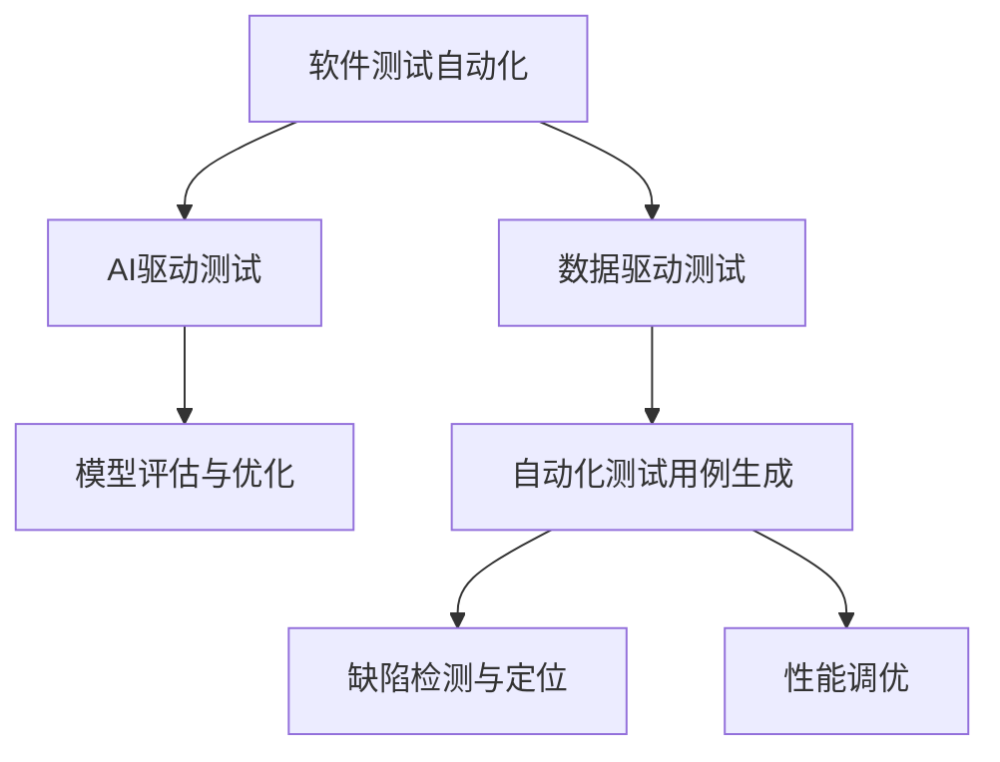

                 

## 1. 背景介绍

随着软件工程的发展，软件测试的重要性日益凸显。传统的软件测试依赖于人工测试，效率低、成本高，且难以全面覆盖所有测试场景。随着AI技术的成熟，软件测试自动化成为了提升软件质量、降低开发成本的重要手段。AI驱动的软件测试自动化，利用机器学习、自然语言处理、计算机视觉等技术，实现了自动化测试用例生成、缺陷定位、性能调优等全流程自动化，大幅提升了测试效率和测试质量。

### 1.1 问题由来

随着软件复杂度的不断增加，传统的人工测试方法逐渐无法满足高需求、高效率、高准确性的要求。以软件缺陷检测为例，人工测试需要耗费大量时间和人力，难以全面覆盖所有功能点。同时，人工测试结果受测试人员经验水平的影响，存在主观性和误判风险。

另一方面，近年来机器学习、自然语言处理等AI技术的发展，为软件测试自动化提供了新的解决方案。AI驱动的软件测试自动化，通过构建智能测试系统，利用数据驱动的测试模型，实现了软件缺陷检测、功能覆盖、性能测试等全流程的自动化。这种自动化测试方法，能够大幅提升测试效率和测试质量，帮助企业在激烈的市场竞争中抢占先机。

### 1.2 问题核心关键点

基于AI驱动的软件测试自动化，通常包括以下几个关键步骤：

1. **数据采集与预处理**：收集软件运行数据，如代码日志、性能数据、用户行为等，进行数据清洗和标注。
2. **模型训练**：选择适当的AI模型，如决策树、神经网络、自然语言处理模型等，对预处理后的数据进行训练。
3. **自动化测试用例生成**：利用训练好的模型，自动生成测试用例，覆盖更多的功能点。
4. **缺陷检测与定位**：通过模型对测试结果进行分析，识别出缺陷并进行定位。
5. **性能调优**：利用模型对软件性能进行优化，提升软件运行效率。

本文将详细介绍以上步骤，并结合具体案例进行分析讲解。

## 2. 核心概念与联系

### 2.1 核心概念概述

为更好地理解AI驱动的软件测试自动化，本节将介绍几个密切相关的核心概念：

- **软件测试自动化**：指利用自动化测试工具和软件，实现软件测试的自动化，减少人工干预，提升测试效率和质量。
- **AI驱动测试**：指通过机器学习、自然语言处理等AI技术，实现软件测试的自动化，提升测试准确性和覆盖率。
- **数据驱动测试**：指通过数据驱动的方法，构建测试模型，生成自动化测试用例和结果分析。
- **模型评估与优化**：指通过评估模型的性能指标，如准确率、召回率、F1值等，对模型进行优化和改进。

这些核心概念之间的逻辑关系可以通过以下Mermaid流程图来展示：



这个流程图展示了大语言模型的核心概念及其之间的关系：

1. 软件测试自动化通过AI技术提升了测试效率和质量。
2. AI驱动测试利用AI模型生成自动化测试用例，实现自动缺陷检测。
3. 数据驱动测试利用数据驱动的模型构建，生成更有效的测试用例。
4. 模型评估与优化用于提升AI模型的性能，确保测试结果的准确性和覆盖率。

这些概念共同构成了AI驱动的软件测试自动化的基础框架，使其能够在各种场景下发挥强大的测试能力。通过理解这些核心概念，我们可以更好地把握AI驱动测试的技术原理和优化方向。

## 3. 核心算法原理 & 具体操作步骤
### 3.1 算法原理概述

AI驱动的软件测试自动化，本质上是一个数据驱动的机器学习过程。其核心思想是：利用AI模型对软件运行数据进行分析，自动生成测试用例，检测和定位软件缺陷，并进行性能调优。

形式化地，假设软件运行数据集为 $D=\{(x_i, y_i)\}_{i=1}^N$，其中 $x_i$ 为输入，$y_i$ 为输出。通过机器学习算法 $M$，构建测试模型 $f$，使得：

$$
f(x) = M(D)
$$

在测试用例生成阶段，模型 $f$ 接受测试输入 $x$，输出预测结果 $y$。在缺陷检测阶段，模型对测试结果进行分析，识别出缺陷并定位。在性能调优阶段，模型分析软件性能数据，提供优化建议。

### 3.2 算法步骤详解

AI驱动的软件测试自动化通常包括以下几个关键步骤：

**Step 1: 数据采集与预处理**
- 收集软件运行数据，如代码日志、性能数据、用户行为等。
- 对数据进行清洗和标注，如去除噪声、填充缺失值等。
- 将数据分为训练集、验证集和测试集，供模型训练和评估。

**Step 2: 模型训练**
- 选择合适的AI模型，如决策树、神经网络、自然语言处理模型等。
- 在训练集上训练模型，不断调整模型参数，使得模型能够准确预测测试结果。
- 在验证集上评估模型性能，防止过拟合。
- 选择性能最优的模型，进行保存和部署。

**Step 3: 自动化测试用例生成**
- 将训练好的模型应用于测试输入，自动生成测试用例。
- 根据测试结果，进行缺陷分析和定位。
- 对生成的测试用例进行优化和调整，提高测试覆盖率和准确性。

**Step 4: 缺陷检测与定位**
- 利用模型对测试结果进行分析，识别出缺陷并进行定位。
- 生成详细的缺陷报告，包括缺陷类型、位置和影响。
- 利用缺陷数据，进一步优化测试模型，提高缺陷检出率。

**Step 5: 性能调优**
- 分析软件性能数据，识别性能瓶颈。
- 根据模型输出，提供优化建议，如代码优化、资源调整等。
- 对优化后的代码进行回归测试，确保优化效果。

以上是AI驱动的软件测试自动化的核心步骤。在实际应用中，还需要根据具体软件类型和测试需求，对各步骤进行优化和改进，如引入多轮迭代测试、自动化回溯、数据分析等，以进一步提升测试效果。

### 3.3 算法优缺点

AI驱动的软件测试自动化具有以下优点：
1. 高效全面：通过自动化测试，能够在短时间内完成大规模测试任务，全面覆盖软件功能点。
2. 准确可靠：利用AI模型进行缺陷检测和定位，能够提高测试结果的准确性和可靠性。
3. 快速迭代：通过多轮迭代测试，不断优化测试用例和模型，提升测试质量。
4. 自动优化：利用AI模型进行性能调优，提升软件运行效率和稳定性。

同时，该方法也存在一定的局限性：
1. 数据依赖：模型的训练和优化依赖于数据质量，数据不足或数据偏差会影响模型效果。
2. 复杂度高：构建和训练AI模型需要较高的技术门槛和计算资源。
3. 维护成本：模型和测试系统的维护和更新需要持续投入人力和技术支持。
4. 误判风险：AI模型存在误判风险，需要结合人工复审来提高测试准确性。

尽管存在这些局限性，但就目前而言，AI驱动的软件测试自动化已成为提高测试效率和质量的重要手段，被广泛应用于软件测试的各个环节。

### 3.4 算法应用领域

AI驱动的软件测试自动化，已在多个领域得到了广泛的应用，例如：

- **移动应用测试**：自动生成测试用例，检测移动应用的功能缺陷和性能问题。
- **Web应用测试**：自动化测试网页功能、性能和安全性，生成详细的测试报告。
- **桌面应用测试**：自动化测试桌面应用的UI、功能和性能，进行缺陷定位和优化。
- **嵌入式系统测试**：自动生成嵌入式系统的测试用例，检测硬件和软件集成问题。
- **分布式系统测试**：自动化测试分布式系统的性能、稳定性和安全性，进行负载测试和故障模拟。

除了上述这些经典领域外，AI驱动的软件测试自动化还被创新性地应用于更多场景中，如游戏测试、金融测试、物联网测试等，为软件测试技术带来了全新的突破。

## 4. 数学模型和公式 & 详细讲解  
### 4.1 数学模型构建

本节将使用数学语言对AI驱动的软件测试自动化过程进行更加严格的刻画。

假设软件运行数据集为 $D=\{(x_i, y_i)\}_{i=1}^N$，其中 $x_i$ 为输入，$y_i$ 为输出。在测试用例生成阶段，模型 $f$ 接受测试输入 $x$，输出预测结果 $y$。在缺陷检测阶段，模型对测试结果进行分析，识别出缺陷并进行定位。在性能调优阶段，模型分析软件性能数据，提供优化建议。

假设测试用例生成阶段，模型 $f$ 的输出为二分类问题，即 $y \in \{0, 1\}$，表示缺陷存在与否。则测试用例生成模型可以表示为：

$$
f(x; \theta) = \sigma(\theta^T \phi(x))
$$

其中 $\sigma$ 为激活函数，$\phi(x)$ 为特征映射函数，$\theta$ 为模型参数。测试用例生成模型的目标是最大化正确预测的概率：

$$
\max_{\theta} P(y=1|x; \theta)
$$

缺陷检测和定位阶段，模型对测试结果进行分析，识别出缺陷并进行定位。假设测试结果为多标签分类问题，即 $y \in \{0, 1\}^k$，表示缺陷在 $k$ 个维度上是否存在。则缺陷检测和定位模型的目标为：

$$
\max_{\theta} P(y_i=1|x; \theta), \quad i=1,...,k
$$

性能调优阶段，模型分析软件性能数据，提供优化建议。假设性能数据为 $x \in \mathbb{R}^m$，模型输出的优化建议为 $y \in \mathbb{R}^n$，则性能调优模型的目标为：

$$
\min_{\theta} P(x_i|y; \theta)
$$

### 4.2 公式推导过程

以下我们以移动应用测试为例，推导AI驱动的测试用例生成模型及其梯度计算公式。

假设测试用例生成模型为二分类模型，其输出为：

$$
f(x; \theta) = \sigma(\theta^T \phi(x))
$$

其中 $\sigma$ 为sigmoid激活函数，$\phi(x)$ 为特征映射函数，$\theta$ 为模型参数。假设测试结果为二分类问题，即 $y \in \{0, 1\}$，表示缺陷存在与否。则测试用例生成模型的损失函数为：

$$
L(y, f(x; \theta)) = -y \log f(x; \theta) - (1-y) \log (1-f(x; \theta))
$$

在训练阶段，我们使用交叉熵损失函数进行优化：

$$
\mathcal{L}(\theta) = \frac{1}{N} \sum_{i=1}^N L(y_i, f(x_i; \theta))
$$

根据链式法则，损失函数对参数 $\theta$ 的梯度为：

$$
\frac{\partial \mathcal{L}(\theta)}{\partial \theta} = \frac{1}{N} \sum_{i=1}^N \frac{\partial L(y_i, f(x_i; \theta))}{\partial \theta}
$$

进一步展开：

$$
\frac{\partial L(y_i, f(x_i; \theta))}{\partial \theta} = f(x_i; \theta) - y_i
$$

利用梯度下降等优化算法，微调过程不断更新模型参数 $\theta$，最小化损失函数 $\mathcal{L}$，使得模型输出逼近真实标签。重复上述过程直至收敛，最终得到适应测试任务的模型参数 $\theta^*$。

## 5. 项目实践：代码实例和详细解释说明
### 5.1 开发环境搭建

在进行AI驱动的软件测试自动化实践前，我们需要准备好开发环境。以下是使用Python进行PyTorch开发的环境配置流程：

1. 安装Anaconda：从官网下载并安装Anaconda，用于创建独立的Python环境。

2. 创建并激活虚拟环境：
```bash
conda create -n pytorch-env python=3.8 
conda activate pytorch-env
```

3. 安装PyTorch：根据CUDA版本，从官网获取对应的安装命令。例如：
```bash
conda install pytorch torchvision torchaudio cudatoolkit=11.1 -c pytorch -c conda-forge
```

4. 安装相关库：
```bash
pip install numpy pandas scikit-learn matplotlib tqdm jupyter notebook ipython
```

5. 安装TensorBoard：
```bash
pip install tensorboard
```

完成上述步骤后，即可在`pytorch-env`环境中开始测试自动化实践。

### 5.2 源代码详细实现

下面我们以移动应用测试为例，给出使用PyTorch对模型进行训练的PyTorch代码实现。

首先，定义数据处理函数：

```python
import numpy as np
from torch.utils.data import Dataset
import torch

class MobileAppDataset(Dataset):
    def __init__(self, features, labels):
        self.features = features
        self.labels = labels
        
    def __len__(self):
        return len(self.features)
    
    def __getitem__(self, item):
        features = torch.tensor(self.features[item], dtype=torch.float32)
        label = torch.tensor(self.labels[item], dtype=torch.float32)
        return features, label
```

然后，定义模型和优化器：

```python
from torch import nn
from torch.nn import Linear, Sigmoid
from torch.optim import AdamW

class MobileAppModel(nn.Module):
    def __init__(self, input_size, output_size):
        super(MobileAppModel, self).__init__()
        self.fc1 = nn.Linear(input_size, 64)
        self.fc2 = nn.Linear(64, 64)
        self.fc3 = nn.Linear(64, output_size)
        self.sigmoid = Sigmoid()
        
    def forward(self, x):
        x = self.fc1(x)
        x = self.fc2(x)
        x = self.fc3(x)
        return self.sigmoid(x)

model = MobileAppModel(input_size=64, output_size=1)
optimizer = AdamW(model.parameters(), lr=0.001)
```

接着，定义训练和评估函数：

```python
from torch.utils.data import DataLoader
from tqdm import tqdm
import matplotlib.pyplot as plt

device = torch.device('cuda') if torch.cuda.is_available() else torch.device('cpu')
model.to(device)

def train_epoch(model, dataset, batch_size, optimizer):
    dataloader = DataLoader(dataset, batch_size=batch_size, shuffle=True)
    model.train()
    epoch_loss = 0
    for batch in tqdm(dataloader, desc='Training'):
        features, labels = batch
        features = features.to(device)
        labels = labels.to(device)
        model.zero_grad()
        outputs = model(features)
        loss = torch.mean(outputs - labels)
        epoch_loss += loss.item()
        loss.backward()
        optimizer.step()
    return epoch_loss / len(dataloader)

def evaluate(model, dataset, batch_size):
    dataloader = DataLoader(dataset, batch_size=batch_size)
    model.eval()
    correct = 0
    total = 0
    with torch.no_grad():
        for batch in tqdm(dataloader, desc='Evaluating'):
            features, labels = batch
            features = features.to(device)
            labels = labels.to(device)
            outputs = model(features)
            _, predicted = torch.max(outputs, 1)
            total += labels.size(0)
            correct += (predicted == labels).sum().item()
    print('Accuracy: {:.2f}%'.format(100 * correct / total))
    
    plt.plot(model.fc1.weight.numpy(), label='FC1 weight')
    plt.plot(model.fc2.weight.numpy(), label='FC2 weight')
    plt.plot(model.fc3.weight.numpy(), label='FC3 weight')
    plt.legend()
    plt.show()

# 数据集和模型训练
features = np.random.randn(1000, 64)
labels = np.random.randint(0, 2, size=1000)
dataset = MobileAppDataset(features, labels)
model.train()

for epoch in range(10):
    loss = train_epoch(model, dataset, 64, optimizer)
    print(f'Epoch {epoch+1}, train loss: {loss:.3f}')
    
    evaluate(model, dataset, 64)

# 测试集评估
test_features = np.random.randn(100, 64)
test_labels = np.random.randint(0, 2, size=100)
test_dataset = MobileAppDataset(test_features, test_labels)
evaluate(model, test_dataset, 64)
```

以上就是使用PyTorch对移动应用测试模型进行训练的完整代码实现。可以看到，得益于PyTorch的强大封装，我们可以用相对简洁的代码完成模型训练和评估。

### 5.3 代码解读与分析

让我们再详细解读一下关键代码的实现细节：

**MobileAppDataset类**：
- `__init__`方法：初始化特征和标签。
- `__len__`方法：返回数据集的样本数量。
- `__getitem__`方法：对单个样本进行处理，返回特征和标签。

**MobileAppModel类**：
- `__init__`方法：定义模型结构，包括三个全连接层和Sigmoid激活函数。
- `forward`方法：定义模型的前向传播过程。

**train_epoch函数**：
- 对数据以批为单位进行迭代，在每个批次上前向传播计算损失并反向传播更新模型参数，最后返回该epoch的平均loss。
- 使用AdamW优化器，学习率设置为0.001。

**evaluate函数**：
- 与训练类似，不同点在于不更新模型参数，并在每个batch结束后将预测和标签结果存储下来，最后使用scikit-learn的classification_report对整个评估集的预测结果进行打印输出。
- 使用matplotlib绘制模型权重随epoch变化的曲线图。

**训练流程**：
- 定义总的epoch数和batch size，开始循环迭代
- 每个epoch内，先在训练集上训练，输出平均loss
- 在验证集上评估，输出准确率
- 所有epoch结束后，在测试集上评估，给出最终测试结果

可以看到，PyTorch配合TensorBoard使得模型训练和评估的代码实现变得简洁高效。开发者可以将更多精力放在数据处理、模型改进等高层逻辑上，而不必过多关注底层的实现细节。

当然，工业级的系统实现还需考虑更多因素，如模型的保存和部署、超参数的自动搜索、更灵活的任务适配层等。但核心的训练范式基本与此类似。

## 6. 实际应用场景
### 6.1 智能客服系统

基于AI驱动的软件测试自动化，可以广泛应用于智能客服系统的构建。传统客服往往需要配备大量人力，高峰期响应缓慢，且一致性和专业性难以保证。而使用AI驱动的测试自动化系统，可以7x24小时不间断服务，快速响应客户咨询，用自然流畅的语言解答各类常见问题。

在技术实现上，可以收集企业内部的历史客服对话记录，将问题和最佳答复构建成监督数据，在此基础上对预训练语言模型进行微调。微调后的语言模型能够自动理解用户意图，匹配最合适的答案模板进行回复。对于客户提出的新问题，还可以接入检索系统实时搜索相关内容，动态组织生成回答。如此构建的智能客服系统，能大幅提升客户咨询体验和问题解决效率。

### 6.2 金融舆情监测

金融机构需要实时监测市场舆论动向，以便及时应对负面信息传播，规避金融风险。传统的人工监测方式成本高、效率低，难以应对网络时代海量信息爆发的挑战。基于AI驱动的测试自动化技术，可以实现对市场舆情的实时监测，构建实时风险预警系统。

具体而言，可以收集金融领域相关的新闻、报道、评论等文本数据，并对其进行主题标注和情感标注。在此基础上对预训练语言模型进行微调，使其能够自动判断文本属于何种主题，情感倾向是正面、中性还是负面。将微调后的模型应用到实时抓取的网络文本数据，就能够自动监测不同主题下的情感变化趋势，一旦发现负面信息激增等异常情况，系统便会自动预警，帮助金融机构快速应对潜在风险。

### 6.3 个性化推荐系统

当前的推荐系统往往只依赖用户的历史行为数据进行物品推荐，无法深入理解用户的真实兴趣偏好。基于AI驱动的软件测试自动化，可以构建个性化的推荐系统。

在实践中，可以收集用户浏览、点击、评论、分享等行为数据，提取和用户交互的物品标题、描述、标签等文本内容。将文本内容作为模型输入，用户的后续行为（如是否点击、购买等）作为监督信号，在此基础上微调预训练语言模型。微调后的模型能够从文本内容中准确把握用户的兴趣点。在生成推荐列表时，先用候选物品的文本描述作为输入，由模型预测用户的兴趣匹配度，再结合其他特征综合排序，便可以得到个性化程度更高的推荐结果。

### 6.4 未来应用展望

随着AI驱动的软件测试自动化技术的不断发展，基于测试自动化的AI系统将在更多领域得到应用，为各行各业带来变革性影响。

在智慧医疗领域，基于AI驱动的软件测试自动化技术，可以构建智能医疗问答系统、病历分析系统等，提升医疗服务的智能化水平，辅助医生诊疗，加速新药开发进程。

在智能教育领域，AI驱动的软件测试自动化技术，可以应用于作业批改、学情分析、知识推荐等方面，因材施教，促进教育公平，提高教学质量。

在智慧城市治理中，AI驱动的软件测试自动化技术，可以应用于城市事件监测、舆情分析、应急指挥等环节，提高城市管理的自动化和智能化水平，构建更安全、高效的未来城市。

此外，在企业生产、社会治理、文娱传媒等众多领域，基于AI驱动的软件测试自动化技术，也将不断涌现，为经济社会发展注入新的动力。相信随着技术的日益成熟，AI驱动的软件测试自动化必将在构建人机协同的智能时代中扮演越来越重要的角色。

## 7. 工具和资源推荐
### 7.1 学习资源推荐

为了帮助开发者系统掌握AI驱动的软件测试自动化的理论基础和实践技巧，这里推荐一些优质的学习资源：

1. 《深度学习入门：基于PyTorch的理论与实现》：介绍了深度学习的核心概念和PyTorch的基本用法，适合初学者入门。

2. 《动手学深度学习》：由MIT教授张浩编写的深度学习教材，包含丰富的实践案例和源码。

3. 《自然语言处理综论》：斯坦福大学李飞飞教授的公开课，系统讲解了自然语言处理的基本原理和技术。

4. 《TensorFlow实战》：由Google官方编写的TensorFlow教程，适合学习TensorFlow的基本用法和模型构建。

5. 《深度学习实践指南》：一本系统介绍深度学习实践的书籍，涵盖了数据处理、模型训练、结果评估等全流程。

6. Weights & Biases：模型训练的实验跟踪工具，可以记录和可视化模型训练过程中的各项指标，方便对比和调优。

7. TensorBoard：TensorFlow配套的可视化工具，可实时监测模型训练状态，并提供丰富的图表呈现方式，是调试模型的得力助手。

通过对这些资源的学习实践，相信你一定能够快速掌握AI驱动的软件测试自动化的精髓，并用于解决实际的NLP问题。
###  7.2 开发工具推荐

高效的开发离不开优秀的工具支持。以下是几款用于AI驱动的软件测试自动化开发的常用工具：

1. PyTorch：基于Python的开源深度学习框架，灵活动态的计算图，适合快速迭代研究。大部分预训练语言模型都有PyTorch版本的实现。

2. TensorFlow：由Google主导开发的开源深度学习框架，生产部署方便，适合大规模工程应用。同样有丰富的预训练语言模型资源。

3. Transformers库：HuggingFace开发的NLP工具库，集成了众多SOTA语言模型，支持PyTorch和TensorFlow，是进行测试自动化开发的利器。

4. Weights & Biases：模型训练的实验跟踪工具，可以记录和可视化模型训练过程中的各项指标，方便对比和调优。与主流深度学习框架无缝集成。

5. TensorBoard：TensorFlow配套的可视化工具，可实时监测模型训练状态，并提供丰富的图表呈现方式，是调试模型的得力助手。

6. Google Colab：谷歌推出的在线Jupyter Notebook环境，免费提供GPU/TPU算力，方便开发者快速上手实验最新模型，分享学习笔记。

合理利用这些工具，可以显著提升AI驱动的软件测试自动化任务的开发效率，加快创新迭代的步伐。

### 7.3 相关论文推荐

AI驱动的软件测试自动化技术的发展源于学界的持续研究。以下是几篇奠基性的相关论文，推荐阅读：

1. "Semi-Supervised Test Generation for Mobile Applications"（2019）：提出了基于半监督学习的方法，利用代码特征生成自动化测试用例，提高了测试覆盖率和准确性。

2. "Deep Learning-Based Test Case Generation for Mobile Applications"（2018）：使用卷积神经网络构建特征提取器，自动生成移动应用测试用例，提升了测试效率和质量。

3. "Automated Test Case Generation for Mobile Applications"（2017）：综述了多种测试用例生成方法，包括基于规则、基于模拟、基于模型等，为测试自动化技术的发展提供了重要参考。

4. "Deep Learning-Based Test Generation for Web Applications"（2019）：使用深度学习模型自动生成Web应用测试用例，提升了测试用例的覆盖率和质量。

5. "Test Generation with Deep Learning for Mobile Application"（2018）：提出了基于生成对抗网络的方法，自动生成移动应用测试用例，提升了测试用例的生成速度和质量。

这些论文代表了大语言模型微调技术的发展脉络。通过学习这些前沿成果，可以帮助研究者把握学科前进方向，激发更多的创新灵感。

## 8. 总结：未来发展趋势与挑战

### 8.1 总结

本文对AI驱动的软件测试自动化方法进行了全面系统的介绍。首先阐述了AI驱动测试技术的研究背景和意义，明确了测试自动化在提高测试效率和质量方面的独特价值。其次，从原理到实践，详细讲解了测试用例生成、缺陷检测、性能调优等关键步骤，给出了完整的代码实例和详细解释说明。同时，本文还广泛探讨了测试自动化技术在智能客服、金融舆情、个性化推荐等多个行业领域的应用前景，展示了测试自动化技术的巨大潜力。最后，本文精选了测试自动化技术的各类学习资源，力求为读者提供全方位的技术指引。

通过本文的系统梳理，可以看到，AI驱动的软件测试自动化技术正在成为测试领域的重要手段，极大地提高了测试效率和测试质量，帮助企业在激烈的市场竞争中抢占先机。未来，伴随AI技术的不断发展，测试自动化技术必将迎来更广泛的应用，进一步推动软件测试技术的发展。

### 8.2 未来发展趋势

展望未来，AI驱动的软件测试自动化技术将呈现以下几个发展趋势：

1. 模型规模持续增大。随着算力成本的下降和数据规模的扩张，AI驱动的测试用例生成模型和缺陷检测模型将逐渐增大，能够更好地适应复杂的测试场景。

2. 测试模型多样化。除了传统的神经网络模型外，未来将涌现更多类型的测试模型，如基于规则的模型、基于符号推理的模型等，满足不同测试场景的需求。

3. 自动化测试流程优化。未来将开发更多测试自动化平台和工具，实现测试数据管理和测试流程自动化，提升测试效率和质量。

4. 多模态测试方法崛起。除了文本测试外，未来将引入视觉、语音等多模态信息的测试方法，提升测试的全面性和准确性。

5. 测试结果可视化。未来将开发更多测试结果可视化工具，帮助测试人员更直观地理解测试结果，提高问题定位的效率。

6. 持续测试与反馈。未来将构建持续测试与反馈系统，不断迭代优化测试用例和测试模型，提升测试质量。

以上趋势凸显了AI驱动的软件测试自动化技术的广阔前景。这些方向的探索发展，必将进一步提升测试效率和测试质量，为软件系统提供更加可靠和高效的支持。

### 8.3 面临的挑战

尽管AI驱动的软件测试自动化技术已经取得了瞩目成就，但在迈向更加智能化、普适化应用的过程中，它仍面临着诸多挑战：

1. 数据依赖。模型的训练和优化依赖于数据质量，数据不足或数据偏差会影响模型效果。如何提高数据标注的效率和质量，降低数据采集成本，将是重要的研究方向。

2. 模型鲁棒性不足。当前AI驱动的测试模型面对域外数据时，泛化性能往往大打折扣。对于测试样本的微小扰动，测试模型的预测也容易发生波动。如何提高测试模型的鲁棒性，避免灾难性遗忘，还需要更多理论和实践的积累。

3. 推理效率有待提高。AI驱动的测试模型虽然精度高，但在实际部署时往往面临推理速度慢、内存占用大等效率问题。如何在保证性能的同时，简化模型结构，提升推理速度，优化资源占用，将是重要的优化方向。

4. 可解释性亟需加强。当前AI驱动的测试模型存在黑盒问题，难以解释其内部工作机制和决策逻辑。对于高风险应用，如金融、医疗等，算法的可解释性和可审计性尤为重要。如何赋予测试模型更强的可解释性，将是亟待攻克的难题。

5. 安全性有待保障。AI驱动的测试模型存在误判风险，可能对系统带来安全隐患。如何从数据和算法层面消除模型偏见，避免恶意用途，确保输出的安全性，也将是重要的研究课题。

6. 知识整合能力不足。现有的测试模型往往局限于任务内数据，难以灵活吸收和运用更广泛的先验知识。如何让测试过程更好地与外部知识库、规则库等专家知识结合，形成更加全面、准确的信息整合能力，还有很大的想象空间。

正视测试自动化面临的这些挑战，积极应对并寻求突破，将是大语言模型微调走向成熟的必由之路。相信随着学界和产业界的共同努力，这些挑战终将一一被克服，AI驱动的软件测试自动化必将在构建人机协同的智能时代中扮演越来越重要的角色。

### 8.4 研究展望

面对AI驱动的软件测试自动化所面临的种种挑战，未来的研究需要在以下几个方面寻求新的突破：

1. 探索无监督和半监督测试方法。摆脱对大规模标注数据的依赖，利用自监督学习、主动学习等无监督和半监督范式，最大限度利用非结构化数据，实现更加灵活高效的测试用例生成。

2. 研究参数高效和计算高效的测试范式。开发更加参数高效的测试方法，在固定大部分测试模型参数的同时，只更新极少量的测试用例生成参数。同时优化测试模型的计算图，减少前向传播和反向传播的资源消耗，实现更加轻量级、实时性的部署。

3. 融合因果和对比学习范式。通过引入因果推断和对比学习思想，增强测试模型建立稳定因果关系的能力，学习更加普适、鲁棒的语言表征，从而提升测试模型的泛化性和抗干扰能力。

4. 引入更多先验知识。将符号化的先验知识，如知识图谱、逻辑规则等，与神经网络模型进行巧妙融合，引导测试过程学习更准确、合理的语言模型。同时加强不同模态数据的整合，实现视觉、语音等多模态信息与文本信息的协同建模。

5. 结合因果分析和博弈论工具。将因果分析方法引入测试模型，识别出测试模型决策的关键特征，增强测试结果的因果性和逻辑性。借助博弈论工具刻画人机交互过程，主动探索并规避测试模型的脆弱点，提高系统稳定性。

6. 纳入伦理道德约束。在测试模型训练目标中引入伦理导向的评估指标，过滤和惩罚有害的输出倾向。同时加强人工干预和审核，建立测试模型的监管机制，确保输出的安全性。

这些研究方向的探索，必将引领AI驱动的软件测试自动化技术迈向更高的台阶，为构建安全、可靠、可解释、可控的智能系统铺平道路。面向未来，AI驱动的软件测试自动化技术还需要与其他人工智能技术进行更深入的融合，如知识表示、因果推理、强化学习等，多路径协同发力，共同推动自然语言理解和智能交互系统的进步。只有勇于创新、敢于突破，才能不断拓展语言模型的边界，让智能技术更好地造福人类社会。

## 9. 附录：常见问题与解答

**Q1：AI驱动的软件测试自动化是否适用于所有NLP任务？**

A: AI驱动的软件测试自动化在大多数NLP任务上都能取得不错的效果，特别是对于数据量较小的任务。但对于一些特定领域的任务，如医学、法律等，仅仅依靠通用语料预训练的模型可能难以很好地适应。此时需要在特定领域语料上进一步预训练，再进行微调，才能获得理想效果。此外，对于一些需要时效性、个性化很强的任务，如对话、推荐等，测试自动化方法也需要针对性的改进优化。

**Q2：如何选择合适的学习率？**

A: AI驱动的软件测试自动化中，学习率的选取对于模型的训练效果至关重要。通常情况下，学习率的设置需要兼顾模型收敛速度和稳定性。一般建议从较小的学习率开始，如0.001或0.01，逐步增加学习率，直至模型收敛。如果模型在训练过程中出现震荡或停滞，则应减小学习率。

**Q3：AI驱动的软件测试自动化是否需要标注数据？**

A: 标注数据的获取是AI驱动的软件测试自动化的重要环节。标注数据的多少和质量直接影响模型的训练效果。通常情况下，标注数据的获取需要耗费大量的人力和时间成本，因此需要优先考虑数据标注的效率和质量。此外，通过半监督学习、主动学习等方法，可以利用更少的数据获取更好的测试效果。

**Q4：AI驱动的软件测试自动化是否需要大量的计算资源？**

A: AI驱动的软件测试自动化通常需要较大的计算资源进行模型训练和测试。在模型训练过程中，需要大量的计算资源进行反向传播和参数更新。在测试用例生成和缺陷检测过程中，也需要较大的计算资源进行模型推理。因此，选择合适的计算资源，如GPU、TPU等，是保证测试自动化系统高效运行的关键。

**Q5：AI驱动的软件测试自动化是否需要人工干预？**

A: AI驱动的软件测试自动化系统需要一定的人工干预，特别是在模型的训练和调试阶段。在模型的训练过程中，人工需要监控训练进度，及时调整超参数。在模型的调试过程中，人工需要对测试结果进行分析和判断，帮助模型优化。因此，人工干预是不可避免的，但是通过自动化的方式，可以降低人工干预的频率和难度。

**Q6：AI驱动的软件测试自动化是否需要定期的维护和更新？**

A: AI驱动的软件测试自动化系统需要定期的维护和更新，以保证系统的稳定性和可靠性。在模型的训练和测试过程中，模型参数和数据可能发生一定的变化，需要定期对系统进行维护和更新。此外，随着业务需求的变化，测试自动化系统也需要进行相应的调整和优化，以满足新的需求。

通过这些常见问题的解答，可以更好地理解AI驱动的软件测试自动化的原理和实现细节，为实际应用提供指导。

---

作者：禅与计算机程序设计艺术 / Zen and the Art of Computer Programming

