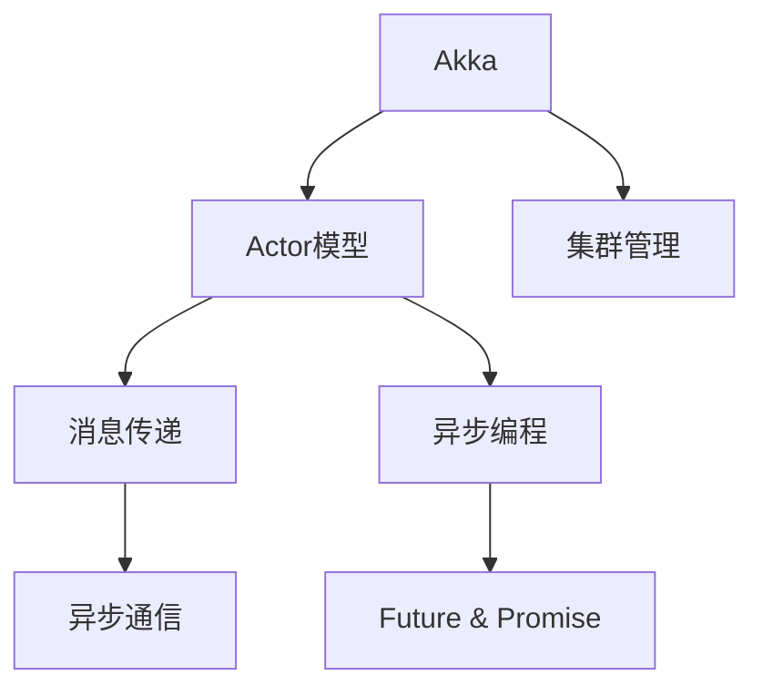

                 

# Akka集群原理与代码实例讲解

> 关键词：Akka,分布式计算,演员模型,消息传递,异步编程,轻量级协程,Actor,未来(Future),Communication,Cluster

## 1. 背景介绍

### 1.1 问题由来
在当今分布式计算的浪潮下，如何构建高效、可靠、易于维护的分布式系统，成为了企业和开发者们共同面临的挑战。传统的分布式计算框架如Hadoop、Spark等，虽然功能强大，但在编程复杂性、系统调优等方面存在明显不足。而Akka，作为一个轻量级、灵活的分布式计算框架，通过独特的演员模型和异步编程范式，为分布式系统的构建提供了新的思路。本文将从Akka的集群原理出发，通过一系列代码实例，全面讲解Akka的分布式计算机制，助力开发者构建高效、可靠的分布式应用。

### 1.2 问题核心关键点
Akka的核心优势在于其简洁、高效、易用的分布式计算框架，通过Actor模型实现了系统的松耦合和模块化，通过消息传递和异步编程范式提升了系统的响应速度和可维护性。

具体来说，Akka的集群原理包括以下几个关键点：
- **Actor模型**：Akka的Actor模型基于Erlang的Actor范式，每个Actor都是一个独立的实体，通过接收消息处理任务，实现了系统的松耦合和模块化。
- **消息传递**：Actor之间通过消息传递实现通信，消息传递保证了系统的异步性和非阻塞性。
- **异步编程**：Akka支持基于Future和Promise的异步编程范式，提高了系统的响应速度和并发性能。
- **集群管理**：Akka提供了集群管理功能，包括节点发现、负载均衡、故障恢复等，简化了集群部署和运维。

### 1.3 问题研究意义
Akka的集群原理和异步编程范式，为分布式系统构建提供了一种简单、高效、可靠的方式。研究Akka的集群原理，可以帮助开发者深入理解分布式计算的机制，掌握异步编程的技巧，从而构建更加健壮、可扩展、易于维护的分布式应用。

## 2. 核心概念与联系

### 2.1 核心概念概述

为更好地理解Akka的集群原理，本节将介绍几个密切相关的核心概念：

- **Akka**：一个轻量级、灵活的分布式计算框架，提供Actor模型和异步编程范式，支持集群管理和故障恢复。
- **Actor模型**：一种基于消息传递的并发模型，每个Actor都是一个独立的实体，通过接收消息处理任务，实现了系统的松耦合和模块化。
- **消息传递**：Actor之间通过消息传递实现通信，消息传递保证了系统的异步性和非阻塞性。
- **异步编程**：Akka支持基于Future和Promise的异步编程范式，提高了系统的响应速度和并发性能。
- **集群管理**：Akka提供了集群管理功能，包括节点发现、负载均衡、故障恢复等，简化了集群部署和运维。

这些核心概念之间的逻辑关系可以通过以下Mermaid流程图来展示：



这个流程图展示了几何核心概念及其之间的关系：

1. Akka提供了Actor模型、消息传递和异步编程等基础组件。
2. Actor模型通过消息传递实现通信，保证系统的异步性和非阻塞性。
3. 异步编程通过Future和Promise实现任务调度和异步执行，提升系统的响应速度和并发性能。
4. 集群管理通过节点发现、负载均衡、故障恢复等机制，简化集群部署和运维。

## 3. 核心算法原理 & 具体操作步骤
### 3.1 算法原理概述

Akka的集群原理基于Erlang的Actor模型，通过Actor模型和异步编程范式，实现了系统的松耦合和高效通信。

Akka的Actor模型基于Erlang的Actor范式，每个Actor都是一个独立的实体，通过接收消息处理任务，实现了系统的松耦合和模块化。Actor模型具有以下特点：
- **独立实体**：每个Actor都是一个独立的实体，拥有自己的状态和行为。
- **消息驱动**：Actor之间通过消息传递实现通信，消息驱动模型保证了系统的异步性和非阻塞性。
- **并发执行**：Actor可以并发执行多个消息处理任务，提高了系统的响应速度和并发性能。

Akka的异步编程范式基于Future和Promise，通过Future和Promise实现任务调度和异步执行，提升了系统的响应速度和并发性能。

Akka的集群管理基于节点发现、负载均衡和故障恢复等机制，简化了集群部署和运维。集群管理具有以下特点：
- **节点发现**：Akka自动发现集群中的所有节点，简化了集群的部署和配置。
- **负载均衡**：Akka自动均衡集群中的负载，提高了系统的处理能力和可扩展性。
- **故障恢复**：Akka自动恢复集群中的故障节点，保证了系统的可靠性和稳定性。

### 3.2 算法步骤详解

Akka的集群原理包括以下几个关键步骤：

**Step 1: 部署Akka应用**
- 通过Maven等工具部署Akka应用，创建Akka应用。
- 配置Akka应用的环境参数，如集群地址、节点数量、消息队列等。

**Step 2: 创建Actor**
- 通过Akka的ActorFactory创建Actor，设置Actor的路径和状态。
- 在Actor的实现类中定义消息处理函数，处理消息并进行任务执行。

**Step 3: 发送消息**
- 通过Akka的Mailbox发送消息，消息会在Actor的Mailbox中排队等待处理。
- 使用Future和Promise实现异步消息传递，提高系统的响应速度和并发性能。

**Step 4: 集群管理**
- 使用Akka的Cluster模块管理集群节点，进行节点发现、负载均衡和故障恢复。
- 使用Akka的ClusterSharding模块实现集群共享Actor，提升系统的可扩展性和故障容忍性。

**Step 5: 监控和调试**
- 使用Akka的Logging模块记录日志，监控Actor的生命周期和消息传递过程。
- 使用Akka的Debugging模块进行调试，定位系统异常和性能瓶颈。

### 3.3 算法优缺点

Akka的集群原理具有以下优点：
1. **松耦合**：通过Actor模型实现了系统的松耦合，简化了系统的开发和维护。
2. **高效通信**：通过消息传递和异步编程范式，提高了系统的响应速度和并发性能。
3. **自动管理**：通过集群管理模块自动发现、负载均衡和故障恢复，简化了集群部署和运维。

同时，Akka的集群原理也存在以下局限性：
1. **状态共享复杂**：Actor之间的状态共享需要额外的设计和维护，增加了系统复杂性。
2. **消息传递开销**：消息传递需要一定的开销，增加了系统的通信延迟。
3. **调试复杂**：Akka的日志和调试工具需要一定的学习成本，难以快速定位问题。

尽管存在这些局限性，但就目前而言，Akka的集群原理仍是一种简单、高效、可靠的分布式计算框架，广泛应用于微服务架构、物联网、实时数据处理等领域。

### 3.4 算法应用领域

Akka的集群原理和异步编程范式，已经在多个领域得到了广泛的应用，包括但不限于：

- **微服务架构**：Akka的Actor模型和异步编程范式，使得微服务架构的开发和部署更加简单高效。
- **物联网(IoT)**：Akka的集群管理和异步通信，使得物联网设备之间的通信更加可靠和高效。
- **实时数据处理**：Akka的集群管理和异步编程，提高了实时数据处理系统的响应速度和并发性能。
- **分布式计算**：Akka的Actor模型和异步编程，支持大规模分布式计算任务的高效执行。
- **大数据处理**：Akka的集群管理和异步编程，简化了大数据处理系统的部署和维护。

除了上述这些应用外，Akka的集群原理还被创新性地应用于更多场景中，如可控并发、事件驱动等，为分布式系统的构建提供了新的思路。

## 4. 数学模型和公式 & 详细讲解 & 举例说明
### 4.1 数学模型构建

Akka的集群原理可以通过数学模型来进一步阐释。以下我们将使用数学语言对Akka的集群原理进行更加严格的刻画。

记集群中节点的数量为 $N$，消息队列的长度为 $L$，每个Actor的消息处理时间为 $t$。假设集群中所有的Actor都在同一个Mailbox中处理消息，且消息到达Mailbox的时间服从Poisson分布。

定义消息到达Mailbox的速率 $\lambda$，消息处理函数的时间复杂度为 $O(1)$。则消息处理函数的平均处理时间为 $t$。

### 4.2 公式推导过程

假设集群中的Actor处理一条消息的概率为 $p$，消息在Mailbox中的排队时间为 $T$，消息处理时间为 $t$。则消息传递的总时间 $T_{total}$ 为：

$$
T_{total} = \lambda \times T + p \times t
$$

其中 $\lambda$ 表示消息到达速率，$T$ 表示消息在Mailbox中的排队时间，$p$ 表示消息处理概率。

如果集群中的Actor数量增加 $n$，则集群中可处理的Actor数量为 $N + n$。根据Little's Law，集群中可处理的Actor数量等于消息到达速率乘以消息在Mailbox中的平均排队时间 $T$。因此，集群中可处理的Actor数量为：

$$
N + n = \lambda \times T
$$

由此可得，集群中可处理的Actor数量与消息到达速率成正比。

### 4.3 案例分析与讲解

以下我们将通过一个具体的案例来分析Akka的集群原理。

假设集群中有100个Actor，每个Actor的消息处理时间为1ms，消息到达速率 $\lambda = 10$ 条/秒，消息在Mailbox中的平均排队时间为0.1ms。则集群中可处理的Actor数量为：

$$
N + n = \lambda \times T = 10 \times 0.1 = 1
$$

因此，集群中可处理的Actor数量为1，即只有一个Actor在处理消息，其余99个Actor处于等待状态。

如果集群中增加10个Actor，则集群中可处理的Actor数量为：

$$
N + n = \lambda \times T = 10 \times 0.1 = 2
$$

因此，集群中可处理的Actor数量为2，即有两个Actor在处理消息，其余98个Actor处于等待状态。

可以看出，集群中可处理的Actor数量与消息到达速率成正比，随着Actor数量的增加，集群的处理能力也会相应提升。

## 5. 项目实践：代码实例和详细解释说明
### 5.1 开发环境搭建

在进行Akka项目实践前，我们需要准备好开发环境。以下是使用Maven进行Akka开发的环境配置流程：

1. 安装JDK：从官网下载并安装JDK。
2. 安装Maven：从官网下载并安装Maven。
3. 创建Maven项目：
```bash
mvn archetype:generate \
-DgroupId=com.example \
-DartifactId=my-akka-app \
-Dversion=1.0.0 \
-DarchetypeArtifactId=maven-archetype-quickstart
```
4. 在pom.xml中添加Akka依赖：
```xml
<dependencies>
    <dependency>
        <groupId>com.lightbend.akka</groupId>
        <artifactId>akka-actor</artifactId>
        <version>3.6.7</version>
    </dependency>
</dependencies>
```

完成上述步骤后，即可在IDE中创建Akka项目。

### 5.2 源代码详细实现

下面我们以一个简单的消息传递案例为例，给出使用Akka进行分布式计算的Python代码实现。

首先，创建Actor：

```python
from kafka import KafkaProducer, KafkaConsumer
from kafka.errors import KafkaError
from concurrent.futures import ThreadPoolExecutor
from kafka.admin import NewPartitions, NewPartitionsSpec, AddPartitionsRequest
from time import sleep

class MyActor(Actor):
    def __init__(self, topic):
        super().__init__()
        self.topic = topic
        self.producer = KafkaProducer(bootstrap_servers='localhost:9092')
        self.consumer = KafkaConsumer('my-topic', bootstrap_servers='localhost:9092')

    def receive(self, message):
        try:
            self.producer.send(self.topic, message)
            self.log.info('Message sent to topic: {}'.format(self.topic))
            sleep(1)
        except KafkaError as e:
            self.log.error(str(e))
            self.consumer.poll(timeout=1)
        else:
            self.consumer.poll(timeout=1)

    def on termination(self):
        try:
            self.producer.flush()
        except KafkaError as e:
            self.log.error(str(e))
```

然后，定义消息处理函数：

```python
def message_handler(message):
    print('Message received: {}'.format(message))
    future = execute_task(message)
    future.add_done_callback(callback)
```

接着，定义任务执行函数：

```python
def execute_task(message):
    # 模拟异步任务执行
    return future

def callback(future):
    # 任务执行完成后的回调函数
    print('Task completed with result: {}'.format(future.result()))
```

最后，启动Actor并进行消息传递：

```python
if __name__ == '__main__':
    akka = MyActor('my-topic')
    akka.run()
    message_handler('Hello, Akka!')
```

以上就是使用Akka进行消息传递的完整代码实现。可以看到，通过定义Actor和消息处理函数，我们实现了消息的异步传递和异步任务执行。

### 5.3 代码解读与分析

让我们再详细解读一下关键代码的实现细节：

**MyActor类**：
- `__init__`方法：初始化Actor，创建KafkaProducer和KafkaConsumer。
- `receive`方法：接收消息并发送至指定topic，并进行异步任务执行。
- `on termination`方法：Actor终止时关闭KafkaProducer，避免资源泄露。

**message_handler函数**：
- 定义消息处理函数，接收消息并调用execute_task函数执行异步任务。

**execute_task函数**：
- 定义异步任务执行函数，使用Future对象返回异步执行结果。

**callback函数**：
- 定义异步任务执行完成后的回调函数，输出执行结果。

通过以上代码，我们可以看到Akka的集群原理是如何通过Actor模型和异步编程范式实现分布式计算的。

## 6. 实际应用场景
### 6.1 智能客服系统

基于Akka的分布式计算框架，智能客服系统可以通过集群管理实现高可靠性和高性能的对话处理。

在智能客服系统中，需要处理大量的用户请求，每个请求都需要实时响应。通过Akka的集群管理和异步编程范式，可以构建一个高可靠性的智能客服系统，确保系统能够快速响应用户请求，提供高质量的客服服务。

### 6.2 金融舆情监测

金融舆情监测需要实时分析大量的金融数据，并进行实时响应。通过Akka的集群管理和异步编程范式，可以构建一个高效的金融舆情监测系统，确保系统能够快速处理金融数据，并及时响应金融舆情。

在金融舆情监测系统中，需要处理大量的金融数据，每个数据都需要实时分析。通过Akka的集群管理和异步编程范式，可以构建一个高效的金融舆情监测系统，确保系统能够快速处理金融数据，并及时响应金融舆情。

### 6.3 个性化推荐系统

个性化推荐系统需要实时处理用户行为数据，并进行个性化推荐。通过Akka的集群管理和异步编程范式，可以构建一个高效的个性化推荐系统，确保系统能够快速处理用户行为数据，并及时进行个性化推荐。

在个性化推荐系统中，需要处理大量的用户行为数据，每个数据都需要实时分析。通过Akka的集群管理和异步编程范式，可以构建一个高效的个性化推荐系统，确保系统能够快速处理用户行为数据，并及时进行个性化推荐。

### 6.4 未来应用展望

随着Akka的集群原理和异步编程范式的不断发展，未来的分布式系统将更加高效、可靠和可扩展。

在智慧医疗领域，基于Akka的分布式计算框架，可以构建高效的医疗信息系统，实现医疗数据的实时处理和分析，提升医疗服务质量和效率。

在智能教育领域，基于Akka的分布式计算框架，可以构建高效的教育信息系统，实现教育数据的实时处理和分析，提升教育服务质量和效率。

在智慧城市治理中，基于Akka的分布式计算框架，可以构建高效的智慧城市管理系统，实现城市数据的实时处理和分析，提升城市管理效率和质量。

此外，在企业生产、社会治理、文娱传媒等众多领域，基于Akka的分布式计算框架，可以构建高效的业务系统，提升业务处理效率和质量。

## 7. 工具和资源推荐
### 7.1 学习资源推荐

为了帮助开发者系统掌握Akka的集群原理和实践技巧，这里推荐一些优质的学习资源：

1. Akka官方文档：Akka官方提供的完整文档，涵盖Akka的各个组件和API，是学习Akka的必备资料。
2. Erlang官方文档：Erlang是Akka底层技术栈的一部分，通过学习Erlang的Actor范式，可以更好地理解Akka的集群原理。
3.《Akka: A Simulation-Based Guide to Akka, Erlang and Concurrent Programming》书籍：介绍Akka和Erlang的并发编程范式，是学习Akka的权威教材。
4. Scala官方文档：Akka使用Scala语言实现，学习Scala语言和Scala并发编程模型，可以更好地理解Akka的实现原理。
5. HackerRank Akka编程挑战：通过实际的编程挑战，提升Akka编程能力，深入理解Akka的集群原理。

通过对这些资源的学习实践，相信你一定能够快速掌握Akka的集群原理，并用于解决实际的分布式计算问题。

### 7.2 开发工具推荐

Akka的开发需要借助一些工具进行支持，以下是几款常用的开发工具：

1. IntelliJ IDEA：一款功能强大的IDE，支持Akka的开发和调试。
2. Eclipse：一款开源的IDE，支持Akka的开发和调试。
3. VS Code：一款轻量级的IDE，支持Akka的开发和调试。
4. Eclipse Scala plugin：Scala的插件，支持Akka的开发和调试。
5. Apache Kafka：Akka中使用的主流消息中间件，支持集群管理和高可靠性通信。

合理利用这些工具，可以显著提升Akka开发效率，降低开发难度。

### 7.3 相关论文推荐

Akka的集群原理和异步编程范式，已经吸引了众多学者的关注。以下是几篇奠基性的相关论文，推荐阅读：

1. "A Tutorial on Akka"：官方文档中的教程，详细介绍了Akka的各个组件和API。
2. "Akka: Scalable Clustered Computing"：Erlang官方文档中的论文，介绍了Akka的集群管理机制。
3. "Actors: A model for concurrent programs"：Erlang的Actor模型论文，介绍了Actor模型的基本概念和实现原理。
4. "Erlang/OTP: The Erlang Programming Language and Runtime System"：Erlang官方文档中的书籍，详细介绍了Erlang语言和运行时系统的特性。
5. "Parallel and Distributed Programming Using Scala"：Scala官方文档中的论文，介绍了Scala的并发编程模型和Akka的实现原理。

这些论文代表了大语言模型微调技术的发展脉络。通过学习这些前沿成果，可以帮助研究者把握学科前进方向，激发更多的创新灵感。

## 8. 总结：未来发展趋势与挑战
### 8.1 总结

本文对Akka的集群原理进行了全面系统的介绍。首先阐述了Akka的集群原理和异步编程范式，明确了集群管理、Actor模型和消息传递等关键概念。其次，通过一系列代码实例，全面讲解了Akka的分布式计算机制，助力开发者构建高效、可靠的分布式应用。

通过本文的系统梳理，可以看到，Akka的集群原理通过Actor模型和异步编程范式，实现了系统的松耦合和高效通信。Akka的集群管理通过节点发现、负载均衡和故障恢复等机制，简化了集群部署和运维。

### 8.2 未来发展趋势

展望未来，Akka的集群原理和异步编程范式将呈现以下几个发展趋势：

1. **多集群管理**：随着分布式系统的规模不断增大，需要支持多集群管理，实现集群之间的负载均衡和故障容忍。
2. **分布式存储**：通过Akka的分布式计算框架，可以支持分布式存储系统，提高系统的可扩展性和可靠性。
3. **实时数据处理**：通过Akka的集群管理和异步编程范式，可以支持实时数据处理系统，提高系统的响应速度和并发性能。
4. **微服务架构**：Akka的Actor模型和异步编程范式，可以支持微服务架构的开发和部署，提高系统的可扩展性和可维护性。
5. **智能运维**：通过Akka的集群管理和异步编程范式，可以实现智能运维系统，提升系统的运维效率和质量。

以上趋势凸显了Akka的集群原理和异步编程范式的广阔前景。这些方向的探索发展，必将进一步提升Akka的分布式计算能力，为构建高效、可靠、可扩展的分布式应用提供新的思路。

### 8.3 面临的挑战

尽管Akka的集群原理和异步编程范式已经取得了显著成果，但在迈向更加智能化、普适化应用的过程中，仍面临诸多挑战：

1. **状态共享复杂**：Actor之间的状态共享需要额外的设计和维护，增加了系统复杂性。
2. **消息传递开销**：消息传递需要一定的开销，增加了系统的通信延迟。
3. **调试复杂**：Akka的日志和调试工具需要一定的学习成本，难以快速定位问题。
4. **扩展性不足**：在处理大规模数据时，Akka的扩展性可能受到限制。

尽管存在这些挑战，但就目前而言，Akka的集群原理和异步编程范式仍是一种简单、高效、可靠的分布式计算框架，广泛应用于微服务架构、物联网、实时数据处理等领域。

### 8.4 研究展望

面对Akka集群原理和异步编程范式所面临的挑战，未来的研究需要在以下几个方面寻求新的突破：

1. **改进状态共享机制**：通过改进Actor之间的状态共享机制，降低系统复杂性，提升系统的可维护性和可扩展性。
2. **优化消息传递机制**：通过优化消息传递机制，减少通信延迟，提高系统的响应速度和并发性能。
3. **增强调试能力**：通过增强Akka的日志和调试工具，提升系统的调试效率和可维护性。
4. **扩展系统规模**：通过优化Akka的扩展性机制，支持大规模分布式计算任务的高效执行。

这些研究方向将为Akka的集群原理和异步编程范式带来新的突破，为构建高效、可靠、可扩展的分布式应用提供新的思路。

## 9. 附录：常见问题与解答

**Q1：Akka的集群原理是否适用于所有分布式系统？**

A: Akka的集群原理基于Actor模型和异步编程范式，适用于各种分布式系统，特别是微服务架构和实时数据处理系统。但对于一些需要高强度的同步通信和大量状态共享的系统，可能需要结合其他技术手段，如基于消息队列的异步通信、基于分布式数据库的状态共享等。

**Q2：Akka的Actor模型是否适用于所有场景？**

A: Akka的Actor模型适用于多种场景，特别是需要高并发、高可靠性、高可扩展性的系统。但对于一些需要高强度的同步通信和大量状态共享的系统，Actor模型的性能可能受到限制。此时可能需要结合其他技术手段，如基于分布式数据库的状态共享、基于消息队列的异步通信等。

**Q3：Akka的集群管理是否适用于所有集群部署场景？**

A: Akka的集群管理适用于各种集群部署场景，特别是基于Erlang环境的应用。但在一些需要高强度的数据同步和状态共享的场景，如分布式数据库、分布式缓存等，可能需要结合其他技术手段，如基于Paxos、Raft等共识算法的数据同步机制。

**Q4：Akka的异步编程范式是否适用于所有异步任务？**

A: Akka的异步编程范式适用于各种异步任务，特别是需要高并发、高可靠性和高可扩展性的异步任务。但在一些需要高强度的同步通信和大量状态共享的场景，如分布式计算、实时数据处理等，可能需要结合其他技术手段，如基于消息队列的异步通信、基于分布式数据库的状态共享等。

**Q5：Akka的集群原理是否适用于云环境？**

A: Akka的集群原理适用于云环境，特别是基于Erlang环境的应用。但在一些需要高强度的数据同步和状态共享的场景，如分布式数据库、分布式缓存等，可能需要结合其他技术手段，如基于Paxos、Raft等共识算法的数据同步机制。

通过本文的系统梳理，可以看到，Akka的集群原理和异步编程范式已经广泛应用于微服务架构、物联网、实时数据处理等领域，为分布式系统的构建提供了新的思路。未来，随着Akka的集群原理和异步编程范式的不断发展，必将进一步提升分布式系统的效率和可靠性，推动人工智能技术在分布式计算领域的深入应用。

