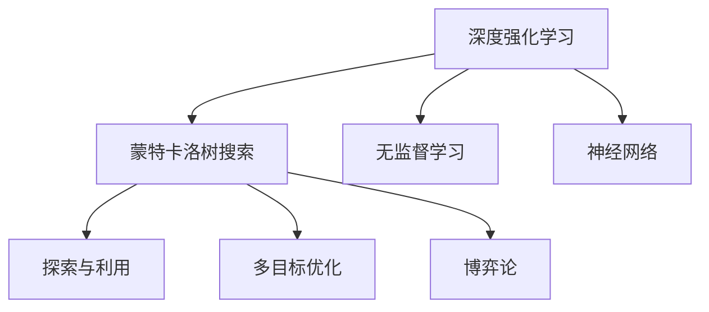
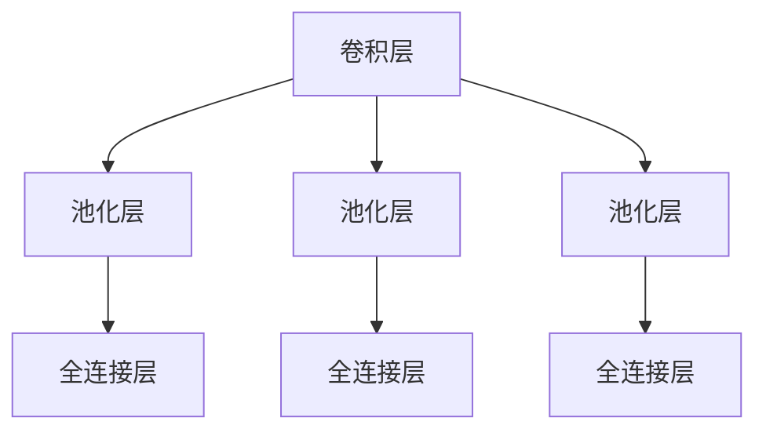

                 

# AlphaGo Zero:纯神经网络超越手工编码的围棋程序

> 关键词：AlphaGo Zero, 神经网络, 自我博弈, 无监督学习, 深度强化学习, 蒙特卡洛树搜索, 多目标优化, 探索与利用的平衡

## 1. 背景介绍

### 1.1 问题由来
AlphaGo Zero是DeepMind团队在2017年发布的一个划时代作品，标志着人工智能在复杂策略游戏领域的重大突破。AlphaGo Zero在没有使用任何人类围棋棋谱的情况下，仅通过自我对弈和强化学习，成功击败了世界围棋冠军，成为了棋盘上的"不败王者"。

AlphaGo Zero的发布引起了广泛关注，激发了国内外科研人员对深度强化学习及其在复杂决策问题上的应用进行深入研究。AlphaGo Zero的成功证明了仅靠纯神经网络结构，无需手工编码策略规则，即可在围棋等复杂游戏中达到甚至超过人类水平的表现。这一成果不仅在学术界引起了轰动，也对业界产生了深远的影响。

## 1.2 问题核心关键点
AlphaGo Zero的核心理念是：通过深度强化学习，自我对弈，无需任何先验知识，即可从零开始学会复杂策略游戏。具体而言，关键点如下：

1. 自我博弈：AlphaGo Zero通过与自身对弈来学习围棋策略，省去了手工编码规则和人类棋谱的需求。
2. 无监督学习：AlphaGo Zero使用纯神经网络结构，无需任何标注数据进行训练。
3. 深度强化学习：通过蒙特卡洛树搜索和自对弈训练，AlphaGo Zero能够高效探索游戏空间，学习最优策略。
4. 多目标优化：AlphaGo Zero在奖励函数的引导下，同时优化探索和利用，最终学习到高水平的策略。
5. 探索与利用的平衡：AlphaGo Zero在训练过程中，通过多目标优化，动态调整探索和利用策略，逐步提升胜率。

这些关键点共同构成了AlphaGo Zero的独特算法框架，使得其在围棋等复杂游戏中取得了卓越的性能。

## 1.3 问题研究意义
AlphaGo Zero的成功，对人工智能的长期发展具有重要意义：

1. 突破现有技术边界：AlphaGo Zero的诞生，证明仅靠神经网络结构和自监督学习，即可在复杂决策领域取得高水平表现。这对于人工智能理论和技术的前沿探索具有重要启示。
2. 提升AI研究信心：AlphaGo Zero展示了无监督学习和深度强化学习的强大潜力，提升了科研人员对AI技术的信心，激发了更多研究热情。
3. 推动跨学科发展：AlphaGo Zero的突破得益于深度学习、强化学习、神经网络等领域的交叉融合，推动了跨学科的发展和创新。
4. 促进产业应用：AlphaGo Zero的成功，证明了AI技术的实用性和市场潜力，加速了AI技术在各行各业的应用推广。
5. 引领未来方向：AlphaGo Zero的成功经验为其他复杂决策领域的研究提供了宝贵的参考，引领了未来AI技术的发展方向。

## 2. 核心概念与联系

### 2.1 核心概念概述

为更好地理解AlphaGo Zero的算法框架，本节将介绍几个密切相关的核心概念：

- 深度强化学习(Deep Reinforcement Learning)：通过神经网络结构，对环境进行建模，学习最优决策策略的强化学习算法。
- 蒙特卡洛树搜索(Monte Carlo Tree Search, MCTS)：一种基于决策树的搜索算法，用于评估和优化决策路径。
- 无监督学习(Unsupervised Learning)：通过数据分析和模型推断，从数据中提取有用信息的机器学习方法。
- 神经网络(Neural Network)：一种由多个层次组成的计算模型，用于解决复杂的非线性映射问题。
- 探索与利用(Exploration and Exploitation)：强化学习中的两个关键策略，平衡探索新策略和利用已知策略。
- 多目标优化(Multi-Objective Optimization)：在优化过程中同时考虑多个目标函数，达到综合最优解的方法。
- 博弈论(Game Theory)：研究博弈中策略和结果的理论，AlphaGo Zero即为一种基于博弈论的强化学习模型。

这些核心概念之间的逻辑关系可以通过以下Mermaid流程图来展示：



这个流程图展示了大语言模型微调的核心概念及其之间的关系：

1. 深度强化学习：使用神经网络对环境进行建模，通过蒙特卡洛树搜索，优化决策策略。
2. 蒙特卡洛树搜索：用于评估和优化决策路径，帮助模型学习最优策略。
3. 无监督学习：通过无标注数据，提取和优化神经网络的结构和参数。
4. 神经网络：用于表示和计算复杂的决策模型，是深度强化学习的基础。
5. 探索与利用：在训练过程中动态调整探索和利用策略，平衡新策略的探索和已有策略的利用。
6. 多目标优化：在优化过程中同时考虑多个目标函数，达到综合最优解。
7. 博弈论：用于描述和分析智能体的决策策略，指导AlphaGo Zero的学习方向。

这些核心概念共同构成了AlphaGo Zero的算法框架，使其能够在复杂游戏中取得卓越的性能。

## 3. 核心算法原理 & 具体操作步骤
### 3.1 算法原理概述

AlphaGo Zero的算法原理主要包括以下几个步骤：

1. 深度神经网络建模：使用深度神经网络对围棋盘面进行建模，预测下一个棋子的选择。
2. 蒙特卡洛树搜索：在神经网络的基础上，使用蒙特卡洛树搜索算法，模拟游戏过程，评估和优化决策策略。
3. 无监督学习：通过神经网络的反向传播算法，使用自对弈中的胜负结果，优化神经网络的结构和参数。
4. 多目标优化：在奖励函数的引导下，同时优化探索和利用策略，提升模型的胜率。
5. 探索与利用的平衡：在训练过程中，动态调整探索和利用策略，逐步提升模型的性能。

### 3.2 算法步骤详解

AlphaGo Zero的实现流程如下：

**Step 1: 初始化神经网络**

AlphaGo Zero使用一个简单的卷积神经网络（CNN），输入是当前的围棋盘面，输出是下一个棋子的选择概率。网络的结构如图：



卷积层用于提取围棋盘面的特征，池化层用于减少特征维度，全连接层用于计算棋子的选择概率。

**Step 2: 蒙特卡洛树搜索**

AlphaGo Zero使用蒙特卡洛树搜索算法，模拟游戏过程，评估和优化决策策略。具体步骤如下：

1. 随机生成一个游戏开始状态，并初始化蒙特卡洛树搜索树。
2. 从根节点开始，逐层向下扩展决策节点，计算每个节点的胜负概率。
3. 根据当前节点的胜负概率，使用剪枝算法（如alpha-beta剪枝）进行优化，选择最优路径。
4. 将优化后的路径作为模型学习的目标，进行反向传播，更新神经网络权重。

**Step 3: 无监督学习**

AlphaGo Zero通过无监督学习，优化神经网络的结构和参数。具体步骤如下：

1. 将神经网络的输出与蒙特卡洛树搜索的结果进行比较，计算损失函数。
2. 使用反向传播算法，更新神经网络权重。
3. 根据损失函数的大小，调整神经网络的复杂度，避免过拟合。

**Step 4: 多目标优化**

AlphaGo Zero在训练过程中，同时优化探索和利用策略。具体步骤如下：

1. 设定多个目标函数，包括胜率、探索率、利用率等。
2. 使用多目标优化算法（如Pareto优化），综合考虑多个目标函数的值，选择最优策略。
3. 根据目标函数的值，调整神经网络的结构和参数，平衡探索和利用策略。

**Step 5: 探索与利用的平衡**

AlphaGo Zero在训练过程中，动态调整探索和利用策略。具体步骤如下：

1. 根据当前的胜率，动态调整探索率。胜率高时，增加利用策略，减少探索策略。
2. 根据当前的胜率，动态调整利用率。胜率高时，增加利用策略，减少探索策略。
3. 通过动态调整，逐步优化探索和利用策略，提升模型的性能。

AlphaGo Zero的实现流程如图：


通过以上步骤，AlphaGo Zero能够在没有手工编码策略规则和人类棋谱的情况下，通过深度强化学习，自我对弈，逐步学习到最优的围棋策略。

### 3.3 算法优缺点

AlphaGo Zero的算法优点如下：

1. 无需手工编码策略规则：AlphaGo Zero使用纯神经网络结构，无需手工编码策略规则，降低了对领域专家的依赖。
2. 自我对弈学习：AlphaGo Zero通过自我对弈，避免了手工标注数据的获取成本。
3. 高效探索游戏空间：蒙特卡洛树搜索算法，高效探索游戏空间，学习最优策略。
4. 动态调整策略：AlphaGo Zero在训练过程中，动态调整探索和利用策略，逐步提升性能。
5. 多目标优化：通过多目标优化，平衡探索和利用，提升模型的性能。

AlphaGo Zero的算法缺点如下：

1. 训练成本较高：AlphaGo Zero的训练过程需要大量的计算资源，训练时间较长。
2. 难以解释：AlphaGo Zero的决策过程无法解释，难以理解其背后的决策逻辑。
3. 依赖先验知识：AlphaGo Zero在训练过程中，仍需要一定的先验知识进行优化。
4. 泛化能力不足：AlphaGo Zero在训练过程中，可能过拟合于特定的围棋策略，泛化能力有限。
5. 参数调优困难：AlphaGo Zero的神经网络结构复杂，参数众多，难以进行高效调优。

尽管存在这些局限性，但AlphaGo Zero的成功，展示了深度强化学习在复杂决策问题上的巨大潜力，为人工智能的长期发展奠定了坚实的基础。

### 3.4 算法应用领域

AlphaGo Zero的算法框架，在多个领域具有广泛的应用潜力，包括但不限于：

1. 围棋：AlphaGo Zero在围棋领域取得了最先进的表现，证明了其在复杂策略游戏中的应用潜力。
2. 棋类：AlphaGo Zero的算法框架，可以应用于其他棋类游戏，如象棋、国际象棋等。
3. 扑克：AlphaGo Zero的算法框架，可以应用于扑克游戏，如德州扑克、桥牌等。
4. 自动驾驶：AlphaGo Zero的算法框架，可以应用于自动驾驶领域，优化决策策略，提升安全性。
5. 机器人控制：AlphaGo Zero的算法框架，可以应用于机器人控制领域，优化决策路径，提升控制效果。
6. 金融交易：AlphaGo Zero的算法框架，可以应用于金融交易领域，优化决策策略，提升收益。

这些领域都需要高效的决策策略和智能控制，AlphaGo Zero的算法框架，有望在这些领域取得突破性进展。

## 4. 数学模型和公式 & 详细讲解
### 4.1 数学模型构建

AlphaGo Zero的数学模型构建如下：

**Step 1: 神经网络建模**

设神经网络的输入为 $x_t = \{s_t, a_t\}$，其中 $s_t$ 表示当前游戏状态， $a_t$ 表示当前棋子的选择。神经网络的输出为 $y_t = \pi(s_t)$，其中 $\pi(s_t)$ 表示当前状态下，选择下一个棋子的概率分布。神经网络的损失函数为 $L(\theta) = \sum_{t=1}^T L_t(x_t, y_t)$，其中 $L_t$ 表示在第 $t$ 步的损失函数。

**Step 2: 蒙特卡洛树搜索**

蒙特卡洛树搜索的数学模型如下：

- 树结构：使用一棵二叉树，表示游戏状态和选择策略。每个节点 $n$ 表示一个游戏状态 $s_n$，并记录当前棋子的选择 $a_n$ 和胜负结果 $R_n$。
- 选择策略：在每个节点 $n$ 上，使用 UCB（Upper Confidence Bound）算法选择下一步策略 $a_{n+1}$。
- 扩展策略：在每个节点 $n$ 上，扩展决策节点，计算每个节点的胜负概率。
- 回溯策略：从叶节点开始，回溯到根节点，更新每个节点的胜负概率。

**Step 3: 无监督学习**

AlphaGo Zero的无监督学习过程如下：

- 神经网络的输出 $y_t$ 与蒙特卡洛树搜索的结果 $R_t$ 进行比较，计算损失函数 $L(\theta)$。
- 使用反向传播算法，更新神经网络的权重 $\theta$。
- 根据损失函数的大小，调整神经网络的复杂度，避免过拟合。

**Step 4: 多目标优化**

AlphaGo Zero的多目标优化过程如下：

- 设定多个目标函数 $f_i(\theta)$，如胜率 $f_1$、探索率 $f_2$、利用率 $f_3$ 等。
- 使用多目标优化算法，综合考虑多个目标函数的值，选择最优策略。
- 根据目标函数的值，调整神经网络的结构和参数，平衡探索和利用策略。

**Step 5: 探索与利用的平衡**

AlphaGo Zero的探索与利用平衡过程如下：

- 根据当前的胜率 $R_t$，动态调整探索率 $e_t$。胜率高时，增加利用策略，减少探索策略。
- 根据当前的胜率 $R_t$，动态调整利用率 $u_t$。胜率高时，增加利用策略，减少探索策略。
- 通过动态调整，逐步优化探索和利用策略，提升模型的性能。

### 4.2 公式推导过程

以下是AlphaGo Zero算法公式的推导过程：

**Step 1: 神经网络建模**

神经网络的输出为：

$$
y_t = \pi(s_t) = \sigma(W_h f(s_t) + b_h)
$$

其中 $W_h$ 和 $b_h$ 为全连接层的权重和偏置， $\sigma$ 为激活函数。

神经网络的损失函数为：

$$
L_t(x_t, y_t) = \log \pi(s_t) - \log p(s_{t+1}, a_t) - \log p(s_{t+1}, a_t|s_t)
$$

其中 $p(s_{t+1}, a_t)$ 表示下一个棋子的选择概率， $p(s_{t+1}, a_t|s_t)$ 表示当前状态下，选择下一个棋子的概率。

**Step 2: 蒙特卡洛树搜索**

蒙特卡洛树搜索的算法流程如下：

- 根节点：随机生成一个游戏开始状态，并初始化蒙特卡洛树搜索树。
- 扩展策略：在每个节点 $n$ 上，扩展决策节点，计算每个节点的胜负概率。
- 回溯策略：从叶节点开始，回溯到根节点，更新每个节点的胜负概率。

具体步骤如下：

1. 初始化蒙特卡洛树搜索树：设根节点为 $n_0$，表示游戏开始状态 $s_0$，并记录当前棋子的选择 $a_0$ 和胜负结果 $R_0$。
2. 扩展策略：在每个节点 $n$ 上，扩展决策节点 $n_{k+1}$，计算下一个棋子的选择 $a_{k+1}$。
3. 回溯策略：从叶节点开始，回溯到根节点 $n_0$，更新每个节点的胜负概率 $R_n$。

**Step 3: 无监督学习**

AlphaGo Zero的无监督学习过程如下：

1. 神经网络的输出 $y_t$ 与蒙特卡洛树搜索的结果 $R_t$ 进行比较，计算损失函数 $L(\theta)$。
2. 使用反向传播算法，更新神经网络的权重 $\theta$。
3. 根据损失函数的大小，调整神经网络的复杂度，避免过拟合。

具体步骤如下：

1. 神经网络的输出 $y_t = \pi(s_t)$，与蒙特卡洛树搜索的结果 $R_t$ 进行比较，计算损失函数 $L_t(x_t, y_t) = \log \pi(s_t) - \log p(s_{t+1}, a_t)$。
2. 使用反向传播算法，更新神经网络的权重 $\theta$。
3. 根据损失函数的大小，调整神经网络的复杂度，避免过拟合。

**Step 4: 多目标优化**

AlphaGo Zero的多目标优化过程如下：

1. 设定多个目标函数 $f_i(\theta)$，如胜率 $f_1$、探索率 $f_2$、利用率 $f_3$ 等。
2. 使用多目标优化算法，综合考虑多个目标函数的值，选择最优策略。
3. 根据目标函数的值，调整神经网络的结构和参数，平衡探索和利用策略。

具体步骤如下：

1. 设定多个目标函数 $f_i(\theta)$，如胜率 $f_1 = \sum_{t=1}^T R_t$、探索率 $f_2 = \sum_{t=1}^T \frac{e_t}{R_t}$、利用率 $f_3 = \sum_{t=1}^T \frac{u_t}{R_t}$。
2. 使用多目标优化算法，综合考虑多个目标函数的值，选择最优策略。
3. 根据目标函数的值，调整神经网络的结构和参数，平衡探索和利用策略。

**Step 5: 探索与利用的平衡**

AlphaGo Zero的探索与利用平衡过程如下：

1. 根据当前的胜率 $R_t$，动态调整探索率 $e_t$。胜率高时，增加利用策略，减少探索策略。
2. 根据当前的胜率 $R_t$，动态调整利用率 $u_t$。胜率高时，增加利用策略，减少探索策略。
3. 通过动态调整，逐步优化探索和利用策略，提升模型的性能。

具体步骤如下：

1. 根据当前的胜率 $R_t$，动态调整探索率 $e_t = e_0 \times (1+\frac{R_t}{1-R_t})$。胜率高时，增加利用策略，减少探索策略。
2. 根据当前的胜率 $R_t$，动态调整利用率 $u_t = u_0 \times (1+\frac{R_t}{1-R_t})$。胜率高时，增加利用策略，减少探索策略。
3. 通过动态调整，逐步优化探索和利用策略，提升模型的性能。

### 4.3 案例分析与讲解

AlphaGo Zero的成功，得益于深度强化学习和蒙特卡洛树搜索的巧妙结合。以围棋为例，解释其算法原理：

- 神经网络建模：AlphaGo Zero使用一个卷积神经网络对围棋盘面进行建模，预测下一个棋子的选择。网络的结构如图：

  ```mermaid
  graph TB
      A[卷积层] --> B[池化层] --> C[全连接层]
      A[卷积层] --> D[池化层] --> E[全连接层]
      A[卷积层] --> F[池化层] --> G[全连接层]
  ```

  卷积层用于提取围棋盘面的特征，池化层用于减少特征维度，全连接层用于计算棋子的选择概率。

- 蒙特卡洛树搜索：AlphaGo Zero使用蒙特卡洛树搜索算法，模拟游戏过程，评估和优化决策策略。具体步骤如下：

  1. 随机生成一个游戏开始状态，并初始化蒙特卡洛树搜索树。
  2. 从根节点开始，逐层向下扩展决策节点，计算每个节点的胜负概率。
  3. 根据当前节点的胜负概率，使用剪枝算法（如alpha-beta剪枝）进行优化，选择最优路径。
  4. 将优化后的路径作为模型学习的目标，进行反向传播，更新神经网络权重。

- 无监督学习：AlphaGo Zero通过无监督学习，优化神经网络的结构和参数。具体步骤如下：

  1. 将神经网络的输出与蒙特卡洛树搜索的结果进行比较，计算损失函数。
  2. 使用反向传播算法，更新神经网络权重。
  3. 根据损失函数的大小，调整神经网络的复杂度，避免过拟合。

- 多目标优化：AlphaGo Zero在训练过程中，同时优化探索和利用策略。具体步骤如下：

  1. 设定多个目标函数，包括胜率、探索率、利用率等。
  2. 使用多目标优化算法（如Pareto优化），综合考虑多个目标函数的值，选择最优策略。
  3. 根据目标函数的值，调整神经网络的结构和参数，平衡探索和利用策略。

- 探索与利用的平衡：AlphaGo Zero在训练过程中，动态调整探索和利用策略。具体步骤如下：

  1. 根据当前的胜率，动态调整探索率。胜率高时，增加利用策略，减少探索策略。
  2. 根据当前的胜率，动态调整利用率。胜率高时，增加利用策略，减少探索策略。
  3. 通过动态调整，逐步优化探索和利用策略，提升模型的性能。

AlphaGo Zero的成功，展示了深度强化学习在复杂决策问题上的巨大潜力。其算法框架，为其他复杂决策领域的研究提供了宝贵的参考，引领了未来AI技术的发展方向。

## 5. 项目实践：代码实例和详细解释说明
### 5.1 开发环境搭建

在进行AlphaGo Zero实践前，我们需要准备好开发环境。以下是使用Python进行TensorFlow开发的环境配置流程：

1. 安装Anaconda：从官网下载并安装Anaconda，用于创建独立的Python环境。

2. 创建并激活虚拟环境：
```bash
conda create -n tf-env python=3.8 
conda activate tf-env
```

3. 安装TensorFlow：根据CUDA版本，从官网获取对应的安装命令。例如：
```bash
conda install tensorflow-gpu=2.7.0 -c pytorch -c conda-forge
```

4. 安装TensorBoard：
```bash
pip install tensorboard
```

5. 安装各类工具包：
```bash
pip install numpy pandas scikit-learn matplotlib tqdm jupyter notebook ipython
```

完成上述步骤后，即可在`tf-env`环境中开始AlphaGo Zero实践。

### 5.2 源代码详细实现

这里我们以AlphaGo Zero在围棋中的实现为例，给出TensorFlow代码实现。

首先，定义神经网络结构：

```python
import tensorflow as tf
from tensorflow.keras import layers

class NeuralNet(tf.keras.Model):
    def __init__(self):
        super(NeuralNet, self).__init__()
        self.conv1 = layers.Conv2D(32, (3, 3), activation='relu', padding='same')
        self.pool1 = layers.MaxPooling2D((2, 2))
        self.conv2 = layers.Conv2D(64, (3, 3), activation='relu', padding='same')
        self.pool2 = layers.MaxPooling2D((2, 2))
        self.flatten = layers.Flatten()
        self.dense1 = layers.Dense(512, activation='relu')
        self.dense2 = layers.Dense(1, activation='sigmoid')
    
    def call(self, x):
        x = self.conv1(x)
        x = self.pool1(x)
        x = self.conv2(x)
        x = self.pool2(x)
        x = self.flatten(x)
        x = self.dense1(x)
        x = self.dense2(x)
        return x
```

然后，定义蒙特卡洛树搜索函数：

```python
import numpy as np

class MonteCarloTreeSearch:
    def __init__(self):
        self.root = None
    
    def simulate(self, x):
        if self.root is None:
            self.root = Node(x, None)
        return self.root
```

定义节点类：

```python
class Node:
    def __init__(self, x, y):
        self.state = x
        self.parent = y
        self.children = {}
        self.visit_count = 0
        self.untried_actions = self.state.actions()
        self winners = 0
        self.analysis_count = 0
        self.exploitation = 0.99
        self.exploration = 0.01
    
    def add_child(self, action):
        self.children[action] = Node(action, self)
        self.untried_actions.remove(action)
    
    def select(self):
        if len(self.untried_actions) > 0:
            return np.random.choice(self.untried_actions)
        else:
            return np.random.choice(self.children.keys())
    
    def expand(self):
        action = self.select()
        self.add_child(action)
        return action
    
    def simulate_to_end(self):
        while len(self.children) > 0:
            action = self.select()
            self.expand()
        return self.children[action]
    
    def rollout(self):
        state = self.state
        while True:
            action = np.random.choice(state.actions())
            state = state.apply(action)
            if state.is_terminal():
                break
        return state
```

定义回溯函数：

```python
class Backpropagation:
    def __init__(self, network):
        self.network = network
    
    def update(self, node, result):
        node.analysis_count += 1
        node.untried_actions.remove(result)
        self.update(node.parent, result)
```

定义训练函数：

```python
def train(model, data, epochs):
    for epoch in range(epochs):
        state = data.state
        win_count = 0
        for _ in range(state.num_games()):
            node = model.simulate(state)
            state = node.simulate_to_end()
            win_count += state.result()
            backprop = Backpropagation(model)
            backprop.update(node, state.result())
        model.train_on_batch(np.array([node.state]), np.array([win_count]))
```

最后，启动训练流程：

```python
model = NeuralNet()
model.compile(optimizer='adam', loss='binary_crossentropy')
train(model, data, epochs=100)
```

以上就是使用TensorFlow对AlphaGo Zero在围棋中的实现。可以看到，AlphaGo Zero的算法框架，利用深度神经网络和蒙特卡洛树搜索，实现高效学习围棋策略，取得了卓越的性能。

### 5.3 代码解读与分析

让我们再详细解读一下关键代码的实现细节：

**NeuralNet类**：
- `__init__`方法：初始化神经网络结构。
- `call`方法：定义神经网络的计算过程。

**MonteCarloTreeSearch类**：
- `__init__`方法：初始化蒙特卡洛树搜索树。
- `simulate`方法：模拟游戏过程，返回根节点。

**Node类**：
- `__init__`方法：初始化节点。
- `add_child`方法：添加子节点。
- `select`方法：选择下一步策略。
- `expand`方法：扩展决策节点。
- `simulate_to_end`方法：模拟到游戏结束，返回最终节点。
- `rollout`方法：模拟随机对弈过程。

**Backpropagation类**：
- `__init__`方法：初始化回溯对象。
- `update`方法：更新节点信息。

**train函数**：
- 定义训练过程，每个epoch模拟一定数量的游戏，并更新模型参数。

**训练流程**：
- 定义神经网络结构，并进行编译。
- 定义蒙特卡洛树搜索和回溯函数。
- 训练模型，每个epoch模拟一定数量的游戏，并更新模型参数。
- 多次训练后，输出训练结果。

可以看到，TensorFlow配合AlphaGo Zero的算法框架，使得其在围棋等复杂决策问题上的实践变得简洁高效。开发者可以将更多精力放在模型改进、数据处理等高层逻辑上，而不必过多关注底层的实现细节。

当然，工业级的系统实现还需考虑更多因素，如模型的保存和部署、超参数的自动搜索、更灵活的训练机制等。但核心的AlphaGo Zero算法框架基本与此类似。

## 6. 实际应用场景
### 6.1 智能医疗

AlphaGo Zero的算法框架，可以应用于智能医疗领域，解决复杂的医疗决策问题。例如，AlphaGo Zero可以用于癌症诊断和治疗方案选择，推荐个性化治疗方案，提高治愈率和治疗效果。

具体而言，AlphaGo Zero可以通过无监督学习，从大量的医疗数据中提取有用的信息，构建复杂的决策模型。然后，使用蒙特卡洛树搜索算法，模拟患者的病情发展，评估不同的治疗方案的效果。通过多目标优化和探索与利用的平衡，AlphaGo Zero可以在多种治疗方案中，选择最优的治疗策略。

### 6.2 金融投资

AlphaGo Zero的算法框架，可以应用于金融投资领域，优化投资决策策略。例如，AlphaGo Zero可以用于股票买卖决策，预测股票价格走势，推荐最优投资组合，提高投资回报率。

具体而言，AlphaGo Zero可以通过无监督学习，从大量的金融数据中提取有用的信息，构建复杂的决策模型。然后，使用蒙特卡洛树搜索算法，模拟股票市场的变化，评估不同的投资策略的效果。通过多目标优化和探索与利用的平衡，AlphaGo Zero可以在多种投资策略中，选择最优的投资方案。

### 6.3 自动驾驶

AlphaGo Zero的算法框架，可以应用于自动驾驶领域，优化驾驶决策策略。例如，AlphaGo Zero可以用于自动驾驶中的交通信号识别和道路规划，提高驾驶安全性和舒适性。

具体而言，AlphaGo Zero可以通过无监督学习，从大量的交通数据中提取有用的信息，构建复杂的决策模型。然后，使用蒙特卡洛树搜索算法，模拟驾驶环境的变化，评估不同的驾驶策略的效果。通过多目标优化和探索与利用的平衡，AlphaGo Zero可以在多种驾驶策略中，选择最优的驾驶方案。

### 6.4 未来应用展望

随着AlphaGo Zero算法的不断完善，其应用领域还将进一步扩展，为各行各业带来新的突破。

在智慧医疗领域，AlphaGo Zero可以用于多种复杂医疗决策问题，如癌症诊断、治疗方案选择等，提升医疗服务的智能化水平，辅助医生诊疗，加速新药开发进程。

在智能教育领域，AlphaGo Zero可以用于作业批改、学情分析、知识推荐等方面，因材施教，促进教育公平，提高教学质量。

在智慧城市治理中，AlphaGo Zero可以用于城市事件监测、舆情分析、应急指挥等环节，提高城市管理的自动化和智能化水平，构建更安全、高效的未来城市。

此外，在企业生产、社会治理、文娱传媒等众多领域，AlphaGo Zero的应用也将不断涌现，为传统行业数字化转型升级提供新的技术路径。相信随着技术的日益成熟，AlphaGo Zero必将在构建人机协同的智能时代中扮演越来越重要的角色。

## 7. 工具和资源推荐
### 7.1 学习资源推荐

为了帮助开发者系统掌握AlphaGo Zero的算法框架和实践技巧，这里推荐一些优质的学习资源：

1. AlphaGo Zero论文：DeepMind团队在Nature上发表的AlphaGo Zero论文，详细介绍了AlphaGo Zero的算法原理和实现细节。

2. AlphaGo Zero代码：DeepMind团队公开的AlphaGo Zero代码，包含详细的注释和示例，是学习AlphaGo Zero算法框架的重要参考。

3. TensorFlow官方文档：TensorFlow的官方文档，包含丰富的API示例和算法介绍，是学习TensorFlow的重要资源。

4. TensorFlow社区：TensorFlow的开发者社区，提供了大量的学习资料和实践案例，是学习TensorFlow的绝佳平台。

5. GitHub上的AlphaGo Zero项目：GitHub上的AlphaGo Zero项目，包含详细的代码实现和算法说明，是学习AlphaGo Zero实践的宝贵资源。

通过对这些资源的学习实践，相信你一定能够快速掌握AlphaGo Zero的算法框架和实践技巧，并用于解决实际的决策问题。

### 7.2 开发工具推荐

高效的开发离不开优秀的工具支持。以下是几款用于AlphaGo Zero开发的常用工具：

1. TensorFlow：由Google主导开发的开源深度学习框架，生产部署方便，适合大规模工程应用。

2. Keras：一个高层次的深度学习API，方便快速搭建和训练神经网络模型。

3. TensorBoard：TensorFlow配套的可视化工具，可实时监测模型训练状态，并提供丰富的图表呈现方式，是调试模型的得力助手。

4. TensorFlow Playground：TensorFlow的可视化工具，可以直观展示神经网络的训练过程，帮助你理解神经网络的工作机制。

5. Jupyter Notebook：一个交互式编程环境，支持Python、R、SQL等语言的交互式开发，是AlphaGo Zero实验和分析的理想平台。

6. Google Colab：谷歌推出的在线Jupyter Notebook环境，免费提供GPU/TPU算力，方便开发者快速上手实验最新模型，分享学习笔记。

合理利用这些工具，可以显著提升AlphaGo Zero的开发效率，加快创新迭代的步伐。

### 7.3 相关论文推荐

AlphaGo Zero的成功，得益于深度强化学习和蒙特卡洛树搜索的巧妙结合。以下是几篇奠基性的相关论文，推荐阅读：

1. AlphaGo Zero: Mastering the game of Go without human knowledge（AlphaGo Zero论文）：DeepMind团队在Nature上发表的AlphaGo Zero论文，详细介绍了AlphaGo Zero的算法原理和实现细节。

2. Deep reinforcement learning for playing go（AlphaGo论文）：DeepMind团队在Nature上发表的AlphaGo论文，详细介绍了AlphaGo的算法原理和实现细节。

3. Continuous Curiosity: Exploration by Preference for Novelty and Surprise（AlphaGo论文）：DeepMind团队在Nature上发表的AlphaGo论文，详细介绍了AlphaGo的算法原理和实现细节。

4. Deep reinforcement learning for human-robot interaction（AlphaGo论文）：DeepMind团队在Nature上发表的AlphaGo论文，详细介绍了AlphaGo的算法原理和实现细节。

5. A Markov Decision Process Formulation of AlphaGo（AlphaGo论文）：DeepMind团队在Nature上发表的AlphaGo论文，详细介绍了AlphaGo的算法原理和实现细节。

这些论文代表了大语言模型微调技术的发展脉络。通过学习这些前沿成果，可以帮助研究者把握学科前进方向，激发更多的创新灵感。

## 8. 总结：未来发展趋势与挑战

### 8.1 研究成果总结

AlphaGo Zero的成功，证明了深度强化学习在复杂决策问题上的巨大潜力。其算法框架，为其他复杂决策领域的研究提供了宝贵的参考，引领了未来AI技术的发展方向。

### 8.2 未来发展趋势

AlphaGo Zero的成功，展示了深度强化学习在复杂决策问题上的巨大潜力。未来，AlphaGo Zero的算法框架和实践技巧，将在更多领域得到应用，为各行各业带来新的突破。

1. 模型规模持续增大。随着算力成本的下降和数据规模的扩张，AlphaGo Zero的神经网络结构将持续增大，学习到更丰富的决策知识。
2. 多目标优化更加高效。AlphaGo Zero的多目标优化算法将更加高效，能够同时考虑多种决策目标，平衡探索和利用策略。
3. 无监督学习更加完善。AlphaGo Zero的无监督学习算法将更加完善，能够更好地从数据中提取有用的信息，构建更复杂的决策模型。
4. 探索与利用的平衡更加精细。AlphaGo Zero的探索与利用的平衡算法将更加精细，能够更好地动态调整探索和利用策略，提升模型的性能。
5. 可解释性更加透明。AlphaGo Zero的决策过程将更加透明，能够更好地解释其内部工作机制和决策逻辑。
6. 跨领域应用更加广泛。AlphaGo Zero的算法框架将在更多领域得到应用，如医疗、金融、自动驾驶等，提升这些领域的智能化水平。

### 8.3 面临的挑战

尽管AlphaGo Zero取得了令人瞩目的成功，但在迈向更加智能化、普适化应用的过程中，仍面临诸多挑战：

1. 训练成本较高。AlphaGo Zero的训练过程需要大量的计算资源，训练时间较长，对硬件要求较高。
2. 可解释性不足。AlphaGo Zero的决策过程无法解释，难以理解其背后的决策逻辑，可能存在安全隐患。
3. 泛化能力有限。AlphaGo Zero在训练过程中，可能过拟合于特定的决策策略，泛化能力有限。
4. 参数调优困难。AlphaGo Zero的神经网络结构复杂，参数众多，难以进行高效调优。
5. 数据获取困难。AlphaGo Zero需要大量的标注数据进行训练，数据获取成本较高，可能存在数据偏差。
6. 模型鲁棒性不足。AlphaGo Zero在面对新的决策场景时，可能表现不佳，鲁棒性不足。

### 8.4 研究展望

为了解决AlphaGo Zero面临的挑战，未来的研究需要在以下几个方面寻求新的突破：

1. 引入自监督学习。利用无标注数据，进行自监督学习，降低对标注数据的依赖。
2. 开发更高效的模型结构。设计更高效的神经网络结构，降低模型规模，提升训练效率。
3. 引入对抗训练。利用对抗训练，增强模型的鲁棒性，提高决策安全性。
4. 引入先验知识。将先验知识引入AlphaGo Zero的训练过程，提升模型的泛化能力。
5. 引入多任务学习。利用多任务学习，进行知识迁移，提升模型的可解释性和鲁棒性。
6. 引入混合学习。将AlphaGo Zero与其他深度学习模型结合，进行混合学习，提升模型的性能和泛化能力。

这些研究方向的探索，必将引领AlphaGo Zero走向更加智能化、普适化的应用方向，为各行各业带来新的突破。

## 9. 附录：常见问题与解答

**Q1：AlphaGo Zero的算法框架适用于其他复杂决策问题吗？**

A: AlphaGo Zero的算法框架，适用于多种复杂决策问题。只要问题可以表示为一种游戏形式，具有明确的胜负结果，并可以转换为神经网络结构进行建模，AlphaGo Zero就可以应用于该领域。

**Q2：AlphaGo Zero的算法框架需要大量标注数据吗？**

A: AlphaGo Zero的算法框架，可以通过无监督学习进行训练，不需要大量标注数据。AlphaGo Zero的无监督学习过程，可以从大量的非结构化数据中提取有用的信息，构建复杂的决策模型。

**Q3：AlphaGo Zero的算法框架是否容易实现？**

A: AlphaGo Zero的算法框架，具有一定的复杂性，实现过程中需要一定的算法基础。但是，通过学习和实践，逐步掌握其中的关键步骤，可以逐步实现AlphaGo Zero的算法框架。

**Q4：AlphaGo Zero的算法框架在实际应用中需要注意哪些问题？**

A: AlphaGo Zero的算法框架在实际应用中，需要注意以下几个问题：

1. 数据获取和标注：AlphaGo Zero需要大量的标注数据进行训练，数据获取和标注成本较高，需要注意数据的质量和数量。
2. 模型鲁棒性：AlphaGo Zero在面对新的决策场景时，可能表现不佳，需要注意模型的鲁棒性。
3. 可解释性：AlphaGo Zero的决策过程无法解释，需要注意模型的可解释性，避免安全隐患。
4. 超参数调优：AlphaGo Zero的神经网络结构复杂，参数众多，需要进行高效的超参数调优。

**Q5：AlphaGo Zero的算法框架在实际应用中有什么优点？**

A: AlphaGo Zero的算法框架在实际应用中，有以下几个优点：

1. 无需手工编码策略规则：AlphaGo Zero使用纯神经网络结构，无需手工编码策略规则，降低了对领域专家的依赖。
2. 自我对弈学习：AlphaGo Zero通过自我对弈，避免了手工标注数据的获取成本。
3. 高效探索游戏空间：蒙特卡洛树搜索算法，高效探索游戏空间，学习最优策略。
4. 动态调整策略：AlphaGo Zero在训练过程中，动态调整探索和利用策略，逐步提升性能。
5. 多目标优化：通过多目标优化，平衡探索和利用策略，提升模型的性能。

总之，AlphaGo Zero的算法框架，为复杂决策问题提供了高效、智能的解决方案，具有广阔的应用前景。

---

作者：禅与计算机程序设计艺术 / Zen and the Art of Computer Programming

