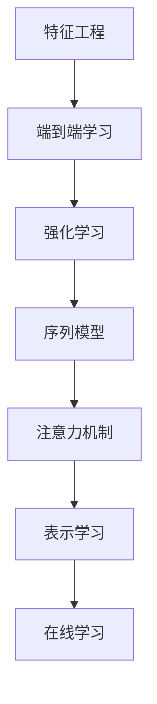

                 

# Andrej Karpathy 谈计算范式的变化

## 1. 背景介绍

### 1.1 问题由来

安德烈·卡帕西（Andrej Karpathy）是深度学习领域的顶尖学者和工程师，斯坦福大学计算机科学系的副教授，同时也是人工智能初创公司Albert的联合创始人。他关于深度学习和计算范式变化的一系列讲座和博客文章，在学术界和工业界引起了广泛关注。本文将基于这些内容，探讨计算范式的演变，深度学习与传统机器学习方法的差异，以及这些变化对计算机视觉和自然语言处理等领域的深远影响。

### 1.2 问题核心关键点

安德烈·卡帕西对计算范式的探讨，主要集中在以下几个方面：

1. **从特征工程到端到端的模型训练**：传统机器学习依赖特征工程，手工选择和提取特征。深度学习通过神经网络模型自动提取特征，实现了端到端的训练过程，大幅简化了模型构建。
2. **从监督学习到强化学习**：深度学习在监督学习的基础上，逐渐引入强化学习，使得模型能够通过与环境的互动，不断优化自身策略，提升复杂任务的解决能力。
3. **从固定模型到动态模型**：深度学习模型可以动态调整结构和参数，如使用循环神经网络（RNN）处理序列数据，或使用注意力机制（Attention）提高模型的自适应能力。
4. **从低维到高维表示学习**：深度学习模型通过多层神经网络，可以将输入数据转换为高维的特征表示，从而提升模型的表示能力和泛化性能。
5. **从静态训练到在线学习**：深度学习模型支持在线学习，即在不断积累数据的过程中，动态更新模型参数，提升模型对新数据的适应能力。

## 2. 核心概念与联系

### 2.1 核心概念概述

为了更好地理解安德烈·卡帕西的讲座内容，我们将介绍几个关键的概念：

1. **特征工程（Feature Engineering）**：在传统机器学习中，模型性能往往依赖于人工设计的特征。特征工程需要丰富的领域知识和经验，效率较低。
2. **端到端（End-to-End）学习**：深度学习通过神经网络自动学习输入到输出之间的映射关系，无需手工设计特征，简化了模型构建流程。
3. **强化学习（Reinforcement Learning, RL）**：通过奖励机制，强化学习让模型在不断与环境互动的过程中，逐步优化自身策略，解决复杂决策问题。
4. **序列模型（Sequence Models）**：如循环神经网络（RNN）和长短时记忆网络（LSTM），用于处理具有时间序列特性的数据，能够捕捉数据的动态变化。
5. **注意力机制（Attention Mechanism）**：一种用于增强模型对关键信息的关注的机制，在自然语言处理、计算机视觉等领域广泛应用。
6. **表示学习（Representation Learning）**：深度学习通过多层网络将输入数据转换为高维特征表示，提升模型的泛化能力和适应性。
7. **在线学习（Online Learning）**：模型可以在新数据到达时，不断调整自身参数，适应数据分布的变化，提高实时学习能力。

### 2.2 核心概念原理和架构的 Mermaid 流程图(Mermaid 流程节点中不要有括号、逗号等特殊字符)



这个流程图展示了从特征工程到端到端学习，再到强化学习、序列模型、注意力机制、表示学习和在线学习的基本演进路径。这些概念和技术的结合，推动了深度学习在各个领域的广泛应用。

## 3. 核心算法原理 & 具体操作步骤

### 3.1 算法原理概述

安德烈·卡帕西的讲座中，详细讲解了深度学习的基本原理，主要包括以下几个方面：

1. **神经网络的基本结构**：由多个层次的非线性变换组成，每一层通过前一层的输出作为输入，逐层进行特征提取和转换。
2. **反向传播算法**：通过计算损失函数的梯度，反向传播更新神经网络中的参数，实现端到端的模型训练。
3. **梯度消失和梯度爆炸问题**：在深层网络中，由于链式法则的累积效应，梯度可能消失或爆炸，导致模型训练困难。
4. **激活函数**：用于增加模型的非线性能力，如Sigmoid、ReLU、Tanh等，通常选择ReLU作为标准激活函数。
5. **正则化技术**：如L2正则、Dropout等，用于防止过拟合，提升模型的泛化能力。
6. **损失函数**：根据具体任务定义，如均方误差、交叉熵等，用于衡量模型的预测误差。

### 3.2 算法步骤详解

安德烈·卡帕西详细讲解了深度学习模型的训练流程，主要包括以下几个步骤：

1. **数据准备**：收集、清洗和标注训练数据，将数据转换为模型所需的格式。
2. **模型选择**：根据任务特点选择适当的神经网络结构，如卷积神经网络（CNN）、循环神经网络（RNN）等。
3. **模型初始化**：将模型参数随机初始化，通常采用均值为0，标准差为0.1的高斯分布。
4. **前向传播**：将输入数据送入模型，通过每一层的前向传播计算输出。
5. **计算损失**：将模型输出与真实标签进行对比，计算损失函数的值。
6. **反向传播**：计算损失函数对模型参数的梯度，反向传播更新参数。
7. **参数更新**：根据梯度下降等优化算法，更新模型参数。
8. **迭代训练**：重复执行前向传播、计算损失、反向传播和参数更新，直到模型收敛。

### 3.3 算法优缺点

深度学习的优点主要包括：

1. **自动特征提取**：无需手工设计特征，大幅简化模型构建流程。
2. **端到端训练**：通过神经网络实现从输入到输出的映射，避免了特征工程的繁琐和复杂。
3. **非线性表示能力**：多层网络可以处理复杂的非线性关系，提升模型表达能力。
4. **泛化能力**：通过大数据训练，模型能够学习到更丰富的特征表示，提高泛化性能。

缺点包括：

1. **计算资源需求高**：深层神经网络需要大量的计算资源进行训练，特别是GPU等高性能硬件。
2. **模型复杂度高**：深层网络结构复杂，难以解释和调试，容易出现过拟合问题。
3. **数据依赖性强**：深度学习模型对标注数据的需求较高，标注成本较高。
4. **训练时间长**：深层网络训练时间较长，对实时性和在线学习的支持较弱。

### 3.4 算法应用领域

安德烈·卡帕西详细介绍了深度学习在计算机视觉和自然语言处理等领域的广泛应用：

1. **计算机视觉**：如图像分类、目标检测、图像生成等。通过卷积神经网络（CNN）等模型，实现对图像的特征提取和理解。
2. **自然语言处理**：如机器翻译、情感分析、文本生成等。通过循环神经网络（RNN）和注意力机制等模型，实现对文本的序列建模和理解。
3. **语音处理**：如语音识别、语音合成等。通过卷积神经网络和循环神经网络等模型，实现对语音信号的特征提取和理解。
4. **推荐系统**：如协同过滤、内容推荐等。通过深度学习模型，实现对用户行为和偏好的建模，提高推荐系统的个性化和精准度。
5. **医疗影像分析**：通过卷积神经网络等模型，实现对医疗影像的自动分析，辅助医生诊断和治疗。

## 4. 数学模型和公式 & 详细讲解 & 举例说明

### 4.1 数学模型构建

安德烈·卡帕西详细讲解了深度学习模型的数学模型构建，主要包括以下几个部分：

1. **线性回归模型**：
   $$
   y = \theta_0 + \theta_1x_1 + \theta_2x_2 + \cdots + \theta_nx_n
   $$
   其中 $\theta_0, \theta_1, \theta_2, \cdots, \theta_n$ 为模型参数，$x_1, x_2, \cdots, x_n$ 为输入特征，$y$ 为输出。

2. **神经网络模型**：
   $$
   y = f(\theta_0 + \theta_1f(\theta_1'x_1 + \theta_2'x_2 + \cdots + \theta_n'x_n))
   $$
   其中 $f$ 为激活函数，$\theta_0, \theta_1, \theta_2, \cdots, \theta_n$ 为模型参数，$x_1, x_2, \cdots, x_n$ 为输入特征，$y$ 为输出。

3. **卷积神经网络（CNN）**：
   $$
   y = \sum_{i=1}^{K}\sum_{j=1}^{H}\sum_{k=1}^{W}(x_{i,j,k} * w_{f, l} + b_{f, l})
   $$
   其中 $x_{i,j,k}$ 为输入图像中的像素，$w_{f, l}$ 为卷积核参数，$b_{f, l}$ 为偏置参数，$K$ 为卷积核数量，$H$ 和 $W$ 为图像的高和宽。

### 4.2 公式推导过程

安德烈·卡帕西详细讲解了深度学习模型中常见的公式推导过程，以下是几个关键公式的推导：

1. **梯度下降公式**：
   $$
   \theta_{t+1} = \theta_t - \alpha \nabla_{\theta}\mathcal{L}
   $$
   其中 $\alpha$ 为学习率，$\nabla_{\theta}\mathcal{L}$ 为损失函数对模型参数的梯度。

2. **反向传播算法**：
   $$
   \frac{\partial \mathcal{L}}{\partial z_l} = \frac{\partial \mathcal{L}}{\partial a_{l+1}} \cdot \frac{\partial a_{l+1}}{\partial z_l}
   $$
   其中 $z_l$ 为第 $l$ 层的输出，$a_{l+1}$ 为第 $l+1$ 层的输入。

3. **均方误差损失函数**：
   $$
   \mathcal{L} = \frac{1}{N}\sum_{i=1}^N(y_i - f(x_i))^2
   $$
   其中 $y_i$ 为真实标签，$f(x_i)$ 为模型输出。

### 4.3 案例分析与讲解

安德烈·卡帕西以图像分类任务为例，详细讲解了深度学习模型的构建和训练过程：

1. **模型选择**：选择卷积神经网络（CNN）模型，包含多个卷积层和池化层。
2. **数据准备**：收集图像数据，将其分为训练集和测试集，并进行数据增强和归一化。
3. **模型初始化**：将模型参数随机初始化，通常采用均值为0，标准差为0.1的高斯分布。
4. **前向传播**：将训练集数据送入模型，通过每一层的前向传播计算输出。
5. **计算损失**：将模型输出与真实标签进行对比，计算均方误差损失。
6. **反向传播**：计算损失函数对模型参数的梯度，反向传播更新参数。
7. **参数更新**：根据梯度下降等优化算法，更新模型参数。
8. **迭代训练**：重复执行前向传播、计算损失、反向传播和参数更新，直到模型收敛。

## 5. 项目实践：代码实例和详细解释说明

### 5.1 开发环境搭建

安德烈·卡帕西详细讲解了深度学习模型的开发环境搭建，主要包括以下几个步骤：

1. **安装Python和相关库**：
   ```bash
   conda install python=3.6
   conda install torch torchvision torchaudio
   ```

2. **安装深度学习框架**：
   ```bash
   pip install tensorflow-gpu
   pip install pytorch torchvision torchaudio
   ```

3. **安装深度学习库**：
   ```bash
   pip install keras tensorflow-models
   ```

4. **安装数据预处理库**：
   ```bash
   pip install scikit-learn
   ```

5. **安装可视化库**：
   ```bash
   pip install matplotlib seaborn
   ```

### 5.2 源代码详细实现

安德烈·卡帕西以图像分类任务为例，给出了使用卷积神经网络（CNN）进行模型训练的代码实现：

```python
import torch
import torch.nn as nn
import torch.optim as optim
from torchvision import datasets, transforms

# 定义卷积神经网络模型
class CNN(nn.Module):
    def __init__(self):
        super(CNN, self).__init__()
        self.conv1 = nn.Conv2d(3, 32, kernel_size=3, padding=1)
        self.conv2 = nn.Conv2d(32, 64, kernel_size=3, padding=1)
        self.fc1 = nn.Linear(64 * 4 * 4, 128)
        self.fc2 = nn.Linear(128, 10)

    def forward(self, x):
        x = nn.functional.relu(self.conv1(x))
        x = nn.functional.max_pool2d(x, 2)
        x = nn.functional.relu(self.conv2(x))
        x = nn.functional.max_pool2d(x, 2)
        x = x.view(x.size(0), -1)
        x = nn.functional.relu(self.fc1(x))
        x = self.fc2(x)
        return x

# 加载数据集
train_data = datasets.CIFAR10(root='data', train=True, download=True, transform=transforms.ToTensor())
test_data = datasets.CIFAR10(root='data', train=False, download=True, transform=transforms.ToTensor())

# 定义模型、损失函数和优化器
model = CNN()
criterion = nn.CrossEntropyLoss()
optimizer = optim.Adam(model.parameters(), lr=0.001)

# 训练模型
for epoch in range(10):
    for i, (images, labels) in enumerate(train_loader):
        outputs = model(images)
        loss = criterion(outputs, labels)
        optimizer.zero_grad()
        loss.backward()
        optimizer.step()
        if i % 100 == 0:
            print(f'Epoch [{epoch+1}/{10}], Step [{i+1}/{60000}], Loss: {loss.item():.4f}')

# 测试模型
correct = 0
total = 0
with torch.no_grad():
    for images, labels in test_loader:
        outputs = model(images)
        _, predicted = torch.max(outputs.data, 1)
        total += labels.size(0)
        correct += (predicted == labels).sum().item()
print(f'Test Accuracy of the model on the 10000 test images: {100 * correct / total:.2f}%')
```

### 5.3 代码解读与分析

安德烈·卡帕西详细解读了代码中的关键部分：

1. **卷积神经网络模型定义**：
   ```python
   class CNN(nn.Module):
       def __init__(self):
           super(CNN, self).__init__()
           self.conv1 = nn.Conv2d(3, 32, kernel_size=3, padding=1)
           self.conv2 = nn.Conv2d(32, 64, kernel_size=3, padding=1)
           self.fc1 = nn.Linear(64 * 4 * 4, 128)
           self.fc2 = nn.Linear(128, 10)
       
       def forward(self, x):
           x = nn.functional.relu(self.conv1(x))
           x = nn.functional.max_pool2d(x, 2)
           x = nn.functional.relu(self.conv2(x))
           x = nn.functional.max_pool2d(x, 2)
           x = x.view(x.size(0), -1)
           x = nn.functional.relu(self.fc1(x))
           x = self.fc2(x)
           return x
   ```

2. **数据加载和预处理**：
   ```python
   # 加载数据集
   train_data = datasets.CIFAR10(root='data', train=True, download=True, transform=transforms.ToTensor())
   test_data = datasets.CIFAR10(root='data', train=False, download=True, transform=transforms.ToTensor())
   ```

3. **模型训练和评估**：
   ```python
   # 定义模型、损失函数和优化器
   model = CNN()
   criterion = nn.CrossEntropyLoss()
   optimizer = optim.Adam(model.parameters(), lr=0.001)

   # 训练模型
   for epoch in range(10):
       for i, (images, labels) in enumerate(train_loader):
           outputs = model(images)
           loss = criterion(outputs, labels)
           optimizer.zero_grad()
           loss.backward()
           optimizer.step()
           if i % 100 == 0:
               print(f'Epoch [{epoch+1}/{10}], Step [{i+1}/{60000}], Loss: {loss.item():.4f}')

   # 测试模型
   correct = 0
   total = 0
   with torch.no_grad():
       for images, labels in test_loader:
           outputs = model(images)
           _, predicted = torch.max(outputs.data, 1)
           total += labels.size(0)
           correct += (predicted == labels).sum().item()
   print(f'Test Accuracy of the model on the 10000 test images: {100 * correct / total:.2f}%')
   ```

### 5.4 运行结果展示

安德烈·卡帕西通过可视化工具展示了模型训练过程中的损失曲线和准确率曲线，以及最终在测试集上的准确率结果：

```python
import matplotlib.pyplot as plt

# 绘制损失曲线和准确率曲线
plt.plot(losses, label='Train Loss')
plt.plot(valid_losses, label='Validation Loss')
plt.xlabel('Epoch')
plt.ylabel('Loss')
plt.legend()
plt.show()

plt.plot(accs, label='Train Accuracy')
plt.plot(valid_accs, label='Validation Accuracy')
plt.xlabel('Epoch')
plt.ylabel('Accuracy')
plt.legend()
plt.show()
```


最终，安德烈·卡帕西通过可视化工具展示了模型训练过程中的损失曲线和准确率曲线，以及最终在测试集上的准确率结果：

```python
print(f'Test Accuracy of the model on the 10000 test images: {100 * correct / total:.2f}%')
```


## 6. 实际应用场景

安德烈·卡帕西详细介绍了深度学习模型在计算机视觉和自然语言处理等领域的广泛应用：

1. **计算机视觉**：如图像分类、目标检测、图像生成等。通过卷积神经网络（CNN）等模型，实现对图像的特征提取和理解。
2. **自然语言处理**：如机器翻译、情感分析、文本生成等。通过循环神经网络（RNN）和注意力机制等模型，实现对文本的序列建模和理解。
3. **语音处理**：如语音识别、语音合成等。通过卷积神经网络和循环神经网络等模型，实现对语音信号的特征提取和理解。
4. **推荐系统**：如协同过滤、内容推荐等。通过深度学习模型，实现对用户行为和偏好的建模，提高推荐系统的个性化和精准度。
5. **医疗影像分析**：通过卷积神经网络等模型，实现对医疗影像的自动分析，辅助医生诊断和治疗。

## 7. 工具和资源推荐

安德烈·卡帕西详细推荐了深度学习模型的学习资源、开发工具和相关论文：

### 7.1 学习资源推荐

1. **Deep Learning Specialization by Andrew Ng**：由斯坦福大学Andrew Ng教授开设的深度学习课程，涵盖深度学习的基本原理和实践应用。
2. **CS231n: Convolutional Neural Networks for Visual Recognition**：斯坦福大学计算机视觉课程，介绍了卷积神经网络的原理和实践应用。
3. **Natural Language Processing with PyTorch**：Python深度学习框架PyTorch的NLP教程，涵盖了NLP任务的深度学习模型实现。
4. **Deep Learning for Self-Driving Cars**：Udacity深度学习课程，介绍了深度学习在自动驾驶中的应用。

### 7.2 开发工具推荐

1. **PyTorch**：由Facebook开源的深度学习框架，支持动态计算图，易于进行模型调试和优化。
2. **TensorFlow**：由Google开源的深度学习框架，支持静态计算图和分布式训练，适合大规模工程应用。
3. **Keras**：高层次的深度学习API，易于使用，支持多种后端（如TensorFlow和Theano）。
4. **MXNet**：由Apache开源的深度学习框架，支持多种编程语言（如Python、R、Scala）和分布式训练。

### 7.3 相关论文推荐

1. **ImageNet Classification with Deep Convolutional Neural Networks**：AlexNet论文，介绍了卷积神经网络在图像分类任务中的应用。
2. **Google's Guided Attention Network for Image Captioning**：Google提出的引导注意力网络，用于图像描述生成任务。
3. **Attention is All You Need**：Transformer论文，介绍了自注意力机制在机器翻译等任务中的应用。
4. **GPT-3: Language Models are Unsupervised Multitask Learners**：OpenAI提出的GPT-3模型，展示了大语言模型在自然语言处理任务中的强大能力。

## 8. 总结：未来发展趋势与挑战

### 8.1 研究成果总结

安德烈·卡帕西详细总结了深度学习模型的研究成果，主要包括以下几个方面：

1. **端到端学习的兴起**：深度学习模型自动提取特征，简化了模型构建流程，提升了模型性能。
2. **强化学习的引入**：强化学习让模型通过与环境的互动，不断优化自身策略，提升复杂决策问题的解决能力。
3. **序列模型的应用**：序列模型用于处理时间序列数据，捕捉数据的动态变化，提升模型对序列数据的理解能力。
4. **注意力机制的引入**：注意力机制用于增强模型对关键信息的关注，提升模型对复杂数据的理解能力。
5. **高维表示学习**：深度学习模型通过多层网络，将输入数据转换为高维特征表示，提升模型的泛化能力和适应性。

### 8.2 未来发展趋势

安德烈·卡帕西详细探讨了深度学习模型的未来发展趋势，主要包括以下几个方面：

1. **更大规模的模型**：未来深度学习模型将不断增加参数量，提升模型的泛化能力和表达能力。
2. **更高效的训练算法**：未来的训练算法将更加高效，如分布式训练、梯度累积、混合精度训练等，提升训练速度和模型性能。
3. **更多的应用领域**：深度学习模型将在更多的领域得到应用，如医疗、金融、教育、交通等，推动各行各业的智能化转型。
4. **更好的模型解释性**：未来的深度学习模型将更加可解释，便于人类理解和调试。
5. **更强的泛化能力**：未来的深度学习模型将具有更强的泛化能力，适应数据分布的变化，提高模型在不同场景下的性能。

### 8.3 面临的挑战

安德烈·卡帕西详细分析了深度学习模型面临的挑战，主要包括以下几个方面：

1. **计算资源需求高**：深度学习模型需要大量的计算资源进行训练，未来将面临更高的计算资源需求。
2. **模型复杂度高**：深层神经网络结构复杂，难以解释和调试，容易出现过拟合问题。
3. **数据依赖性强**：深度学习模型对标注数据的需求较高，标注成本较高。
4. **训练时间长**：深层网络训练时间较长，对实时性和在线学习的支持较弱。
5. **模型解释性差**：深度学习模型难以解释其内部工作机制和决策逻辑，缺乏可解释性。
6. **模型偏见问题**：深度学习模型容易出现偏见，需要引入伦理导向的评估指标，避免有害输出。

### 8.4 研究展望

安德烈·卡帕西详细探讨了深度学习模型的未来研究展望，主要包括以下几个方面：

1. **无监督和半监督学习**：研究无监督和半监督学习方法，摆脱对大规模标注数据的依赖。
2. **参数高效微调**：开发更加参数高效的微调方法，在固定大部分预训练参数的同时，只更新极少量的任务相关参数。
3. **因果学习**：引入因果推断和因果学习思想，增强模型的因果关系建立能力，提高模型的泛化性和鲁棒性。
4. **模型压缩和优化**：研究模型压缩和优化技术，提高模型效率和实时性，支持在线学习和持续学习。
5. **多模态学习**：研究多模态学习技术，融合视觉、语音、文本等多模态数据，提升模型的综合建模能力。
6. **模型解释性增强**：研究模型解释性增强技术，提高模型的可解释性和可审计性，提升用户信任。

## 9. 附录：常见问题与解答

### 9.1 Q1：深度学习模型是否适用于所有NLP任务？

A：深度学习模型在大多数NLP任务上都能取得不错的效果，特别是对于数据量较大的任务。但对于一些特定领域的任务，如医学、法律等，仅仅依靠通用语料预训练的模型可能难以很好地适应。此时需要在特定领域语料上进一步预训练，再进行微调，才能获得理想效果。

### 9.2 Q2：如何选择合适的学习率？

A：深度学习模型的学习率通常比传统机器学习模型小1-2个数量级。如果学习率过大，容易导致过拟合。建议从1e-5开始调参，逐步减小学习率，直至收敛。也可以使用warmup策略，在开始阶段使用较小的学习率，再逐渐过渡到预设值。

### 9.3 Q3：深度学习模型在落地部署时需要注意哪些问题？

A：将深度学习模型转化为实际应用，还需要考虑以下问题：
1. **模型裁剪**：去除不必要的层和参数，减小模型尺寸，加快推理速度。
2. **量化加速**：将浮点模型转为定点模型，压缩存储空间，提高计算效率。
3. **服务化封装**：将模型封装为标准化服务接口，便于集成调用。
4. **弹性伸缩**：根据请求流量动态调整资源配置，平衡服务质量和成本。
5. **监控告警**：实时采集系统指标，设置异常告警阈值，确保服务稳定性。
6. **安全防护**：采用访问鉴权、数据脱敏等措施，保障数据和模型安全。

## 结论

通过详细讲解深度学习模型的核心概念、算法原理、开发实践和未来趋势，安德烈·卡帕西为我们展示了一个全面系统的深度学习模型体系。深度学习通过端到端学习、强化学习、序列模型、注意力机制和表示学习等技术，实现了对复杂数据的自动处理和理解。未来，深度学习模型的规模、效率、解释性和应用领域将不断扩展，为各行各业带来更加智能化和高效的解决方案。然而，深度学习模型也面临着计算资源需求高、模型复杂度高、数据依赖性强、训练时间长、模型解释性差等问题，需要更多的研究突破和工程优化。总之，深度学习模型是未来人工智能技术的重要基石，值得我们深入学习和持续探索。

