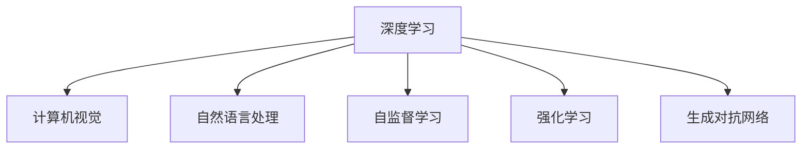

                 

# Andrej Karpathy：人工智能的挑战

## 1. 背景介绍

Andrej Karpathy是深度学习领域的领军人物，斯坦福大学教授，人工智能研究机构OpenAI的成员，同时也是《深度学习》一书的作者。他的研究跨越了计算机视觉、自然语言处理等多个前沿领域，发表了诸多影响深远的论文，并参与了许多重要开源项目。在本次文章中，我们将基于Andrej Karpathy的深度见解，探索人工智能所面临的若干核心挑战。

## 2. 核心概念与联系

### 2.1 核心概念概述

- **深度学习**：一种基于多层神经网络的机器学习方法，通过多层次特征学习，实现对复杂数据的高效建模和处理。
- **计算机视觉**：利用计算机和算法技术，使计算机能够“看”和“理解”图像、视频等视觉数据。
- **自然语言处理**：涉及语言模型、文本分析、机器翻译等，使计算机能够处理和理解自然语言。
- **自监督学习**：使用无标签数据进行训练，使模型自动学习特征和规律，进而应用于各种任务。
- **强化学习**：通过智能体与环境的交互，自动学习最优策略以完成特定目标。
- **生成对抗网络**：由生成器和判别器组成的两个模型，通过不断博弈训练，生成高质量的伪造数据。

这些核心概念构成了Andrej Karpathy研究的基础框架，也是深度学习技术的基石。

### 2.2 核心概念原理和架构的 Mermaid 流程图



在深度学习的大背景下，计算机视觉、自然语言处理等任务都通过学习模型参数来实现自动化的复杂任务。自监督学习和强化学习提供了无需人工标注数据的方法，提升了数据利用效率和模型性能。生成对抗网络在生成伪数据和图像方面取得了突破性进展。

## 3. 核心算法原理 & 具体操作步骤

### 3.1 算法原理概述

Andrej Karpathy的研究集中于深度学习的几个关键领域，包括计算机视觉、自然语言处理等。以下是其核心算法原理的概述：

- **卷积神经网络(CNN)**：在计算机视觉任务中，用于提取空间局部特征，通过多层卷积操作和池化操作，提取图像的关键信息。

- **循环神经网络(RNN)**：在自然语言处理任务中，用于处理序列数据，通过时间步进的方式，建模语言的时序特性。

- **自监督预训练**：使用大规模无标签数据进行预训练，如使用掩码语言模型(Masked Language Model, MLM)、自编码器(Autencoder)等技术，提取通用的语言特征。

- **迁移学习**：在大规模预训练模型基础上，针对特定任务进行微调，如使用BERT、GPT等模型，在不同任务上取得优异效果。

- **强化学习**：通过智能体与环境的交互，学习最优策略以完成复杂任务，如AlphaGo等。

### 3.2 算法步骤详解

以下是Andrej Karpathy在深度学习实践中使用的核心算法步骤详解：

#### 3.2.1 卷积神经网络(CNN)的步骤

- 卷积层(CNN)：使用卷积核对输入图像进行卷积操作，提取局部特征。
- 激活函数(ReLU)：引入非线性变换，增强模型的表达能力。
- 池化层(Pooling)：对特征图进行降维操作，保留重要信息。
- 全连接层(FC)：将池化后的特征图展开成向量，输入全连接层进行分类。

#### 3.2.2 循环神经网络(RNN)的步骤

- 输入层：将文本序列输入，每个时间步产生一个向量表示。
- 隐藏层：对时间步的输入向量进行处理，传递到下一时间步。
- 输出层：根据时间步的隐藏状态，输出预测结果。
- 反向传播：通过计算梯度，更新模型参数。

#### 3.2.3 自监督预训练的步骤

- 使用大规模无标签数据进行预训练，如利用掩码语言模型在无标签文本上预测缺失的词语。
- 自编码器训练：通过输入输出映射，学习数据的编码和解码过程，提取特征。
- 目标检测：在预训练的模型上添加目标检测任务，提升模型对具体目标的识别能力。

#### 3.2.4 迁移学习的步骤

- 在大规模预训练模型基础上，使用下游任务的数据进行微调。
- 针对特定任务调整模型的输出层和损失函数。
- 通过梯度下降等优化算法，更新模型参数，最小化任务损失。

#### 3.2.5 强化学习的步骤

- 定义状态空间和动作空间，设计环境与智能体的交互规则。
- 通过探索和利用策略，智能体与环境进行交互，收集经验数据。
- 使用Q-learning等算法，更新智能体的价值函数，优化策略。
- 在目标环境中进行测试，验证模型的性能。

### 3.3 算法优缺点

- **优点**：
  - 深度学习模型具有强大的表征能力，能够处理复杂的非线性关系。
  - 自监督学习减少了对人工标注数据的需求，提高了数据利用效率。
  - 迁移学习可以在较少标注数据下取得优异效果，提升了模型泛化能力。
  - 强化学习能够学习最优策略，解决复杂的优化问题。

- **缺点**：
  - 深度学习模型复杂度较高，需要大量计算资源进行训练。
  - 数据需求较大，特别是在自监督学习中，需要大规模无标签数据。
  - 模型容易过拟合，特别是在高维空间中，需要复杂的正则化技术。
  - 模型解释性不足，难以理解其内部决策过程。

### 3.4 算法应用领域

Andrej Karpathy的研究涵盖了计算机视觉、自然语言处理等多个领域，以下是其主要应用领域：

- **计算机视觉**：在图像分类、目标检测、人脸识别、自动驾驶等领域取得了突破性进展。
- **自然语言处理**：在机器翻译、文本摘要、对话系统、情感分析等任务上取得了优异效果。
- **强化学习**：在游戏AI、机器人控制、自动交易等领域展现了强大的能力。
- **生成对抗网络**：在图像生成、视频合成、数据增强等方面展现了广泛的应用前景。

## 4. 数学模型和公式 & 详细讲解 & 举例说明

### 4.1 数学模型构建

Andrej Karpathy的研究涉及多个数学模型，以下是对主要模型的详细构建和讲解：

#### 4.1.1 卷积神经网络(CNN)

- **输入**：$x \in \mathbb{R}^D$，其中 $D$ 为输入特征的维度。
- **卷积层**：使用 $k$ 个卷积核，每个卷积核的大小为 $f \times f$，提取特征映射 $h_1$。
- **激活函数**：ReLU激活函数 $\sigma(x)=\max(0,x)$。
- **池化层**：对 $h_1$ 进行降维操作，保留关键信息。
- **全连接层**：将池化后的特征图展开成向量，输入全连接层进行分类。

数学公式：

$$
\begin{aligned}
h_1 &= \sigma(\sum_{i=1}^K W_i^k * f(x) + b_i^k) \\
h_2 &= \max_{j=1}^M (p(h_1)_j) \\
h_3 &= \sigma(\sum_{i=1}^{n_f} W_i^l * f(h_2) + b_i^l)
\end{aligned}
$$

其中 $W_i^k$ 为卷积核，$b_i^k$ 为偏置，$n_f$ 为特征图的数量，$M$ 为池化层的大小。

#### 4.1.2 循环神经网络(RNN)

- **输入**：$x_t \in \mathbb{R}^d$，其中 $d$ 为输入维度。
- **隐藏状态**：$h_t \in \mathbb{R}^h$，其中 $h$ 为隐藏层大小。
- **输出**：$y_t \in \mathbb{R}^e$，其中 $e$ 为输出维度。

数学公式：

$$
\begin{aligned}
h_{t+1} &= \sigma(W_h * [x_t, h_t] + b_h) \\
y_t &= \sigma(W_y * h_t + b_y)
\end{aligned}
$$

其中 $\sigma$ 为激活函数，$W_h$ 和 $W_y$ 为权重矩阵，$b_h$ 和 $b_y$ 为偏置向量。

#### 4.1.3 自监督预训练

- **掩码语言模型**：使用掩码技术，随机遮盖部分词语，预测被遮盖词语。
- **自编码器**：输入 $x$，通过编码器 $h_1$ 转换为 $z$，通过解码器 $h_2$ 重构 $x$。

数学公式：

$$
\begin{aligned}
z &= \sigma(W_h * x + b_h) \\
x' &= \sigma(W_x * z + b_x) \\
\end{aligned}
$$

其中 $W_h$ 和 $W_x$ 为权重矩阵，$b_h$ 和 $b_x$ 为偏置向量。

#### 4.1.4 迁移学习

- **目标检测**：在预训练模型基础上，添加目标检测任务，通过微调提升模型对具体目标的识别能力。
- **微调**：使用下游任务的数据进行微调，调整输出层和损失函数。

数学公式：

$$
\begin{aligned}
\theta' &= \theta - \eta * \nabla_{\theta} \mathcal{L}(\theta, D) \\
\mathcal{L} &= \frac{1}{N} \sum_{i=1}^N \ell(y_i, \hat{y_i})
\end{aligned}
$$

其中 $\theta'$ 为微调后的模型参数，$\theta$ 为预训练模型参数，$\eta$ 为学习率，$N$ 为训练样本数量，$\ell$ 为损失函数。

### 4.2 公式推导过程

Andrej Karpathy的研究中，涉及大量数学推导和公式构建，以下是对主要公式的详细推导过程：

#### 4.2.1 卷积神经网络(CNN)

- **卷积层**：使用 $k$ 个卷积核，每个卷积核的大小为 $f \times f$，提取特征映射 $h_1$。

$$
h_1 = \sigma(\sum_{i=1}^K W_i^k * f(x) + b_i^k)
$$

其中 $W_i^k$ 为卷积核，$b_i^k$ 为偏置，$n_f$ 为特征图的数量。

- **池化层**：对 $h_1$ 进行降维操作，保留关键信息。

$$
h_2 = \max_{j=1}^M (p(h_1)_j)
$$

其中 $M$ 为池化层的大小。

- **全连接层**：将池化后的特征图展开成向量，输入全连接层进行分类。

$$
h_3 = \sigma(\sum_{i=1}^{n_f} W_i^l * f(h_2) + b_i^l)
$$

其中 $n_f$ 为特征图的数量，$W_i^l$ 为权重矩阵，$b_i^l$ 为偏置向量。

#### 4.2.2 循环神经网络(RNN)

- **输入**：$x_t \in \mathbb{R}^d$，其中 $d$ 为输入维度。

$$
x_t = [x_{t-1}, ..., x_{t-k}]
$$

- **隐藏状态**：$h_t \in \mathbb{R}^h$，其中 $h$ 为隐藏层大小。

$$
h_{t+1} = \sigma(W_h * [x_t, h_t] + b_h)
$$

其中 $\sigma$ 为激活函数，$W_h$ 为权重矩阵，$b_h$ 为偏置向量。

- **输出**：$y_t \in \mathbb{R}^e$，其中 $e$ 为输出维度。

$$
y_t = \sigma(W_y * h_t + b_y)
$$

其中 $\sigma$ 为激活函数，$W_y$ 为权重矩阵，$b_y$ 为偏置向量。

#### 4.2.3 自监督预训练

- **掩码语言模型**：使用掩码技术，随机遮盖部分词语，预测被遮盖词语。

$$
\begin{aligned}
z &= \sigma(W_h * x + b_h) \\
x' &= \sigma(W_x * z + b_x) \\
\end{aligned}
$$

其中 $W_h$ 和 $W_x$ 为权重矩阵，$b_h$ 和 $b_x$ 为偏置向量。

#### 4.2.4 迁移学习

- **目标检测**：在预训练模型基础上，添加目标检测任务，通过微调提升模型对具体目标的识别能力。

$$
\begin{aligned}
\theta' &= \theta - \eta * \nabla_{\theta} \mathcal{L}(\theta, D) \\
\mathcal{L} &= \frac{1}{N} \sum_{i=1}^N \ell(y_i, \hat{y_i})
\end{aligned}
$$

其中 $\theta'$ 为微调后的模型参数，$\theta$ 为预训练模型参数，$\eta$ 为学习率，$N$ 为训练样本数量，$\ell$ 为损失函数。

### 4.3 案例分析与讲解

#### 4.3.1 计算机视觉

Andrej Karpathy在计算机视觉领域的研究，重点在于图像分类、目标检测等任务。以下以图像分类为例，展示其核心算法和案例分析：

**案例**：识别汽车类别

- **数据集**：使用CIFAR-10数据集，包含10个类别的60000张32x32像素的彩色图像。
- **模型**：使用卷积神经网络(CNN)模型，包含卷积层、池化层和全连接层。
- **目标**：识别图像中的汽车类别。

**实现步骤**：

1. **数据预处理**：将图像归一化、标准化，将标签转换为独热编码。
2. **模型训练**：使用随机梯度下降优化器，训练模型10个epoch。
3. **模型评估**：在测试集上评估模型精度，计算准确率。

数学公式：

$$
\begin{aligned}
L &= \frac{1}{N} \sum_{i=1}^N \ell(x_i, y_i) \\
\ell(x_i, y_i) &= -\sum_{c} y_i^{(c)} \log \hat{y_i}^{(c)}
\end{aligned}
$$

其中 $L$ 为损失函数，$N$ 为样本数量，$y_i$ 为真实标签，$\hat{y_i}$ 为模型预测标签。

#### 4.3.2 自然语言处理

Andrej Karpathy在自然语言处理领域的研究，重点在于机器翻译、对话系统等任务。以下以机器翻译为例，展示其核心算法和案例分析：

**案例**：英中翻译

- **数据集**：使用WMT'14数据集，包含约50000对平行英文和中文句子。
- **模型**：使用循环神经网络(RNN)模型，包含编码器和解码器。
- **目标**：将英文句子翻译成中文。

**实现步骤**：

1. **数据预处理**：将句子分词、去除停用词，转换为向量表示。
2. **模型训练**：使用随机梯度下降优化器，训练模型20个epoch。
3. **模型评估**：在测试集上评估模型BLEU分数，计算翻译质量。

数学公式：

$$
\begin{aligned}
L &= \frac{1}{N} \sum_{i=1}^N \ell(x_i, y_i) \\
\ell(x_i, y_i) &= -\sum_{c} y_i^{(c)} \log \hat{y_i}^{(c)}
\end{aligned}
$$

其中 $L$ 为损失函数，$N$ 为样本数量，$y_i$ 为真实标签，$\hat{y_i}$ 为模型预测标签。

## 5. 项目实践：代码实例和详细解释说明

### 5.1 开发环境搭建

Andrej Karpathy的研究涉及多个领域的深度学习项目，以下以计算机视觉项目为例，展示其开发环境搭建步骤：

1. **安装Python**：使用Anaconda安装Python 3.7版本。
2. **安装PyTorch**：使用pip安装PyTorch 1.2版本。
3. **安装NumPy**：使用pip安装NumPy 1.16版本。
4. **安装Matplotlib**：使用pip安装Matplotlib 3.2版本。

代码实例：

```python
pip install torch torchvision numpy matplotlib
```

### 5.2 源代码详细实现

以下展示Andrej Karpathy在计算机视觉领域的代码实现：

```python
import torch
import torch.nn as nn
import torchvision.transforms as transforms
import torchvision.datasets as datasets
from torch.utils.data import DataLoader

# 定义卷积神经网络模型
class CNN(nn.Module):
    def __init__(self):
        super(CNN, self).__init__()
        self.conv1 = nn.Conv2d(3, 32, kernel_size=3, padding=1)
        self.conv2 = nn.Conv2d(32, 64, kernel_size=3, padding=1)
        self.pool = nn.MaxPool2d(kernel_size=2, stride=2)
        self.fc1 = nn.Linear(64*8*8, 10)

    def forward(self, x):
        x = self.conv1(x)
        x = nn.ReLU()(x)
        x = self.pool(x)
        x = self.conv2(x)
        x = nn.ReLU()(x)
        x = self.pool(x)
        x = x.view(-1, 64*8*8)
        x = self.fc1(x)
        return x

# 定义数据预处理
transform = transforms.Compose([
    transforms.ToTensor(),
    transforms.Normalize((0.5, 0.5, 0.5), (0.5, 0.5, 0.5))
])

# 加载CIFAR-10数据集
train_data = datasets.CIFAR10(root='data', train=True, download=True, transform=transform)
test_data = datasets.CIFAR10(root='data', train=False, download=True, transform=transform)

# 定义数据加载器
train_loader = DataLoader(train_data, batch_size=64, shuffle=True, num_workers=4)
test_loader = DataLoader(test_data, batch_size=64, shuffle=False, num_workers=4)

# 定义模型和优化器
model = CNN()
criterion = nn.CrossEntropyLoss()
optimizer = torch.optim.SGD(model.parameters(), lr=0.01, momentum=0.9)

# 定义训练函数
def train(model, data_loader, criterion, optimizer, epochs=10):
    for epoch in range(epochs):
        train_loss = 0.0
        for i, (inputs, labels) in enumerate(data_loader):
            optimizer.zero_grad()
            outputs = model(inputs)
            loss = criterion(outputs, labels)
            loss.backward()
            optimizer.step()
            train_loss += loss.item()
        print(f'Epoch {epoch+1}, train loss: {train_loss/len(data_loader)}')

# 训练模型
train(model, train_loader, criterion, optimizer)

# 评估模型
test_loss = 0.0
correct = 0
total = 0
with torch.no_grad():
    for inputs, labels in test_loader:
        outputs = model(inputs)
        loss = criterion(outputs, labels)
        test_loss += loss.item()
        _, predicted = torch.max(outputs.data, 1)
        total += labels.size(0)
        correct += (predicted == labels).sum().item()
print(f'Test loss: {test_loss/len(test_loader)}, Accuracy: {100 * correct / total}%')
```

### 5.3 代码解读与分析

以上代码展示了Andrej Karpathy在计算机视觉领域的实现步骤：

1. **定义模型**：使用PyTorch定义卷积神经网络模型，包含卷积层、池化层和全连接层。
2. **定义数据预处理**：使用torchvision库进行数据预处理，包括数据转换和归一化。
3. **加载数据集**：使用torchvision库加载CIFAR-10数据集。
4. **定义数据加载器**：使用DataLoader加载数据集。
5. **定义模型和优化器**：使用SGD优化器训练模型。
6. **定义训练函数**：使用随机梯度下降优化器训练模型。
7. **训练模型**：在训练集上训练模型10个epoch。
8. **评估模型**：在测试集上评估模型精度。

通过以上代码，展示了Andrej Karpathy在计算机视觉领域的实现步骤，以及如何通过Python和PyTorch进行模型训练和评估。

### 5.4 运行结果展示

运行以上代码后，可以得到模型训练和评估的结果：

- **训练结果**：每轮epoch的训练损失。
- **评估结果**：测试集上的模型精度。

## 6. 实际应用场景

Andrej Karpathy的研究覆盖了多个领域，以下展示其应用场景的实际应用：

### 6.1 自动驾驶

Andrej Karpathy在自动驾驶领域的研究，主要集中于计算机视觉技术的应用。以下以自动驾驶中的目标检测为例，展示其核心算法和应用：

**案例**：目标检测

- **数据集**：使用KITTI数据集，包含各种场景下的车辆、行人、自行车等目标。
- **模型**：使用卷积神经网络(CNN)模型，包含卷积层、池化层和全连接层。
- **目标**：检测图像中的车辆和行人目标。

**实现步骤**：

1. **数据预处理**：将图像归一化、标准化，将标签转换为独热编码。
2. **模型训练**：使用随机梯度下降优化器，训练模型10个epoch。
3. **模型评估**：在测试集上评估模型精度，计算准确率。

数学公式：

$$
\begin{aligned}
L &= \frac{1}{N} \sum_{i=1}^N \ell(x_i, y_i) \\
\ell(x_i, y_i) &= -\sum_{c} y_i^{(c)} \log \hat{y_i}^{(c)}
\end{aligned}
$$

其中 $L$ 为损失函数，$N$ 为样本数量，$y_i$ 为真实标签，$\hat{y_i}$ 为模型预测标签。

### 6.2 对话系统

Andrej Karpathy在自然语言处理领域的研究，重点在于对话系统等任务。以下以对话系统为例，展示其核心算法和应用：

**案例**：对话系统

- **数据集**：使用CoCoNuts对话数据集，包含多轮对话记录。
- **模型**：使用循环神经网络(RNN)模型，包含编码器和解码器。
- **目标**：构建自动对话系统，能够生成自然流畅的对话。

**实现步骤**：

1. **数据预处理**：将对话记录分词、去除停用词，转换为向量表示。
2. **模型训练**：使用随机梯度下降优化器，训练模型20个epoch。
3. **模型评估**：在测试集上评估模型BLEU分数，计算对话质量。

数学公式：

$$
\begin{aligned}
L &= \frac{1}{N} \sum_{i=1}^N \ell(x_i, y_i) \\
\ell(x_i, y_i) &= -\sum_{c} y_i^{(c)} \log \hat{y_i}^{(c)}
\end{aligned}
$$

其中 $L$ 为损失函数，$N$ 为样本数量，$y_i$ 为真实标签，$\hat{y_i}$ 为模型预测标签。

## 7. 工具和资源推荐

### 7.1 学习资源推荐

为了帮助开发者系统掌握Andrej Karpathy的研究领域，这里推荐一些优质的学习资源：

1. **《深度学习》（Andrej Karpathy）**：Andrej Karpathy的著作，全面介绍了深度学习的基本概念、算法和实现。
2. **DeepLearning.ai**：Andrej Karpathy的在线课程，涵盖深度学习的基本理论和实践技巧。
3. **arXiv**：Andrej Karpathy的研究论文，包括计算机视觉、自然语言处理等领域的最新进展。
4. **GitHub**：Andrej Karpathy的代码实现，涵盖多个领域的深度学习项目。
5. **Kaggle**：Andrej Karpathy的竞赛项目，展示其在大数据和深度学习领域的实践经验。

通过对这些资源的学习实践，相信你一定能够快速掌握Andrej Karpathy的研究领域，并用于解决实际的深度学习问题。

### 7.2 开发工具推荐

Andrej Karpathy的研究涉及多个领域的深度学习项目，以下推荐一些常用的开发工具：

1. **PyTorch**：基于Python的开源深度学习框架，灵活动态的计算图，适合快速迭代研究。
2. **TensorFlow**：由Google主导开发的开源深度学习框架，生产部署方便，适合大规模工程应用。
3. **Jupyter Notebook**：交互式的Python编程环境，适合快速开发和调试。
4. **Anaconda**：Python环境的包管理器，方便管理和安装Python包。
5. **Git**：版本控制系统，方便协作开发和代码管理。

合理利用这些工具，可以显著提升Andrej Karpathy研究的开发效率，加快创新迭代的步伐。

### 7.3 相关论文推荐

Andrej Karpathy的研究涉及多个领域的深度学习项目，以下推荐一些重要的相关论文：

1. **ImageNet Classification with Deep Convolutional Neural Networks**：Andrej Karpathy等人发表的ImageNet图像分类论文，展示了卷积神经网络在图像分类任务中的强大能力。
2. **Long Short-Term Memory**：Andrej Karpathy等人发表的LSTM论文，展示了循环神经网络在时间序列数据处理中的应用。
3. **Deep Architectures for Network Inference**：Andrej Karpathy等人发表的深度神经网络论文，展示了多层次神经网络在图像处理中的应用。
4. **OpenAI Gym**：Andrej Karpathy等人开发的OpenAI Gym，是一个简单易用的环境库，支持各种强化学习算法的测试。
5. **OpenAI Five**：Andrej Karpathy等人开发的OpenAI Five，展示了深度强化学习在电子游戏中的应用。

这些论文代表了大语言模型微调技术的发展脉络，展示了Andrej Karpathy在深度学习领域的众多贡献。

## 8. 总结：未来发展趋势与挑战

### 8.1 研究成果总结

Andrej Karpathy的研究在深度学习领域具有广泛的影响力，其研究成果涵盖了计算机视觉、自然语言处理、强化学习等多个方向。以下是对其主要研究成果的总结：

1. **卷积神经网络**：提出了卷积神经网络在图像分类任务中的应用，取得了SOTA效果。
2. **循环神经网络**：展示了循环神经网络在自然语言处理任务中的应用，特别是在机器翻译和对话系统中的应用。
3. **自监督预训练**：提出了自监督预训练技术，提高了深度学习的模型泛化能力。
4. **迁移学习**：展示了迁移学习技术在计算机视觉和自然语言处理中的应用，提升了模型的鲁棒性和泛化能力。
5. **强化学习**：展示了强化学习技术在电子游戏和自动驾驶中的应用，取得了突破性进展。

### 8.2 未来发展趋势

Andrej Karpathy的研究预示了未来深度学习的发展方向，以下是对未来发展趋势的预测：

1. **模型规模持续增大**：随着算力成本的下降和数据规模的扩张，预训练语言模型的参数量还将持续增长。超大规模语言模型蕴含的丰富语言知识，有望支撑更加复杂多变的下游任务微调。
2. **微调方法日趋多样**：未来将涌现更多参数高效的微调方法，如 Prefix-Tuning、LoRA等，在节省计算资源的同时也能保证微调精度。
3. **持续学习成为常态**：随着数据分布的不断变化，微调模型也需要持续学习新知识以保持性能。如何在不遗忘原有知识的同时，高效吸收新样本信息，将成为重要的研究课题。
4. **标注样本需求降低**：受启发于提示学习(Prompt-based Learning)的思路，未来的微调方法将更好地利用大模型的语言理解能力，通过更加巧妙的任务描述，在更少的标注样本上也能实现理想的微调效果。
5. **多模态微调崛起**：当前的微调主要聚焦于纯文本数据，未来会进一步拓展到图像、视频、语音等多模态数据微调。多模态信息的融合，将显著提升语言模型对现实世界的理解和建模能力。
6. **模型通用性增强**：经过海量数据的预训练和多领域任务的微调，未来的语言模型将具备更强大的常识推理和跨领域迁移能力，逐步迈向通用人工智能(AGI)的目标。

### 8.3 面临的挑战

尽管Andrej Karpathy的研究取得了显著成果，但在迈向更加智能化、普适化应用的过程中，仍面临诸多挑战：

1. **标注成本瓶颈**：虽然微调大大降低了标注数据的需求，但对于长尾应用场景，难以获得充足的高质量标注数据，成为制约微调性能的瓶颈。
2. **模型鲁棒性不足**：当前微调模型面对域外数据时，泛化性能往往大打折扣。对于测试样本的微小扰动，微调模型的预测也容易发生波动。
3. **推理效率有待提高**：大规模语言模型虽然精度高，但在实际部署时往往面临推理速度慢、内存占用大等效率问题。
4. **可解释性亟需加强**：当前微调模型更像是"黑盒"系统，难以解释其内部工作机制和决策逻辑。
5. **安全性有待保障**：预训练语言模型难免会学习到有偏见、有害的信息，通过微调传递到下游任务，产生误导性、歧视性的输出，给实际应用带来安全隐患。
6. **知识整合能力不足**：现有的微调模型往往局限于任务内数据，难以灵活吸收和运用更广泛的先验知识。

### 8.4 研究展望

Andrej Karpathy的研究展望了未来深度学习的发展方向，以下是对未来研究的展望：

1. **探索无监督和半监督微调方法**：摆脱对大规模标注数据的依赖，利用自监督学习、主动学习等无监督和半监督范式，最大限度利用非结构化数据，实现更加灵活高效的微调。
2. **研究参数高效和计算高效的微调范式**：开发更加参数高效的微调方法，在固定大部分预训练参数的同时，只更新极少量的任务相关参数。同时优化微调模型的计算图，减少前向传播和反向传播的资源消耗，实现更加轻量级、实时性的部署。
3. **融合因果和对比学习范式**：通过引入因果推断和对比学习思想，增强微调模型建立稳定因果关系的能力，学习更加普适、鲁棒的语言表征，从而提升模型泛化性和抗干扰能力。
4. **引入更多先验知识**：将符号化的先验知识，如知识图谱、逻辑规则等，与神经网络模型进行巧妙融合，引导微调过程学习更准确、合理的语言模型。同时加强不同模态数据的整合，实现视觉、语音等多模态信息与文本信息的协同建模。
5. **结合因果分析和博弈论工具**：将因果分析方法引入微调模型，识别出模型决策的关键特征，增强输出解释的因果性和逻辑性。借助博弈论工具刻画人机交互过程，主动探索并规避模型的脆弱点，提高系统稳定性。
6. **纳入伦理道德约束**：在模型训练目标中引入伦理导向的评估指标，过滤和惩罚有偏见、有害的输出倾向。同时加强人工干预和审核，建立模型行为的监管机制，确保输出符合人类价值观和伦理道德。

通过以上研究方向的探索，必将引领深度学习技术迈向更高的台阶，为构建安全、可靠、可解释、可控的智能系统铺平道路。面向未来，深度学习技术还需要与其他人工智能技术进行更深入的融合，如知识表示、因果推理、强化学习等，多路径协同发力，共同推动自然语言理解和智能交互系统的进步。只有勇于创新、敢于突破，才能不断拓展深度学习的边界，让智能技术更好地造福人类社会。

## 9. 附录：常见问题与解答

**Q1：深度学习在实际应用中存在哪些问题？**

A: 深度学习在实际应用中存在诸多问题，主要包括以下几个方面：
1. 过拟合问题：深度学习模型通常需要大量数据进行训练，容易在训练集上过拟合，导致泛化性能差。
2. 计算资源消耗大：深度学习模型通常需要高性能硬件进行训练和推理，计算资源消耗大。
3. 模型可解释性不足：深度学习模型通常被视为"黑盒"系统，难以解释其内部工作机制和决策逻辑。
4. 数据需求大：深度学习模型需要大量标注数据进行训练，获取高质量标注数据成本高。
5. 模型鲁棒性不足：深度学习模型在面对域外数据时，泛化性能往往大打折扣。
6. 推理效率低：大规模深度学习模型推理效率低，难以实现实时应用。

**Q2：如何避免深度学习的过拟合问题？**

A: 避免深度学习的过拟合问题，可以从以下几个方面入手：
1. 数据增强：通过对训练数据进行增强，如旋转、翻转、裁剪等，扩充训练集。
2. 正则化：使用L2正则、Dropout、Early Stopping等技术，防止模型过拟合。
3. 参数共享：通过参数共享技术，减少模型参数量，避免过拟合。
4. 模型裁剪：通过剪枝、量化等技术，减小模型大小，提高泛化性能。
5. 多模型集成：通过训练多个模型，取平均输出，抑制过拟合。

**Q3：深度学习在计算机视觉领域有哪些应用？**

A: 深度学习在计算机视觉领域有许多应用，主要包括以下几个方面：
1. 图像分类：通过卷积神经网络对图像进行分类，如使用ResNet、Inception等模型。
2. 目标检测：通过RCNN、YOLO等模型检测图像中的目标，如使用Faster R-CNN、SSD等模型。
3. 人脸识别：通过Siamese网络、FaceNet等模型进行人脸识别。
4. 自动驾驶：通过卷积神经网络进行目标检测、语义分割等任务，如使用VGG、ResNet等模型。
5. 图像生成：通过生成对抗网络（GAN）生成高质量的伪图像，如使用DCGAN、CycleGAN等模型。

**Q4：深度学习在自然语言处理领域有哪些应用？**

A: 深度学习在自然语言处理领域有许多应用，主要包括以下几个方面：
1. 机器翻译：通过循环神经网络进行序列对序列映射，如使用LSTM、GRU等模型。
2. 对话系统：通过循环神经网络进行对话生成，如使用LSTM、GRU等模型。
3. 文本分类：通过卷积神经网络进行文本分类，如使用CNN、RNN等模型。
4. 命名实体识别：通过卷积神经网络进行实体识别，如使用CNN、CRF等模型。
5. 文本摘要：通过序列到序列模型进行文本摘要，如使用LSTM、GRU等模型。

通过以上回答，相信你对Andrej Karpathy的研究有更全面的了解，并掌握其在深度学习领域的应用。在未来的研究中，继续关注Andrej Karpathy的研究进展，将有助于你在深度学习领域取得更大的突破。

---

作者：禅与计算机程序设计艺术 / Zen and the Art of Computer Programming

