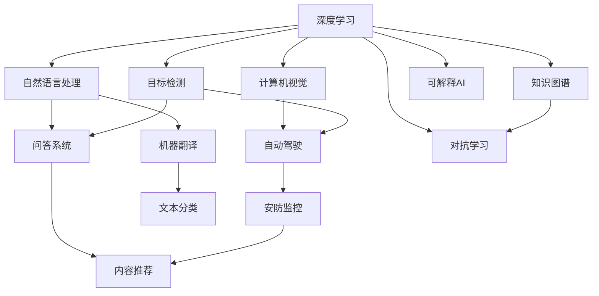

                 

# Andrej Karpathy：人工智能的未来发展挑战

> 关键词：人工智能,深度学习,未来发展,挑战

## 1. 背景介绍

### 1.1 问题由来
Andrej Karpathy，著名人工智能研究者，曾任OpenAI研究科学家，现任特斯拉高级研究科学家，其主要研究集中在计算机视觉、深度学习等领域。他不仅在顶级学术会议上发表论文，还常在社交媒体和博客中分享AI研究心得，深受行业内外的关注。

在AI领域，Karpathy是深度学习应用、大规模图像识别和自动驾驶技术的关键推动者。他领导的团队开发的YOLO、Fast R-CNN等目标检测算法，已经在自动驾驶、物体识别等应用中展现出强大的实力。同时，他也是深度学习在图像生成、自然语言处理等领域取得突破的重要参与者。

Karpathy在2020年的一篇博文中，深入探讨了人工智能未来的发展挑战。本文旨在梳理和总结其中的核心观点，并结合最新的AI研究进展，分析AI发展的未来趋势和潜在风险。

### 1.2 问题核心关键点
Karpathy在文章中指出，尽管深度学习在许多领域取得了显著进步，但AI技术仍面临许多关键挑战。这些挑战包括但不限于以下几个方面：

- **数据质量和数量不足**：许多AI模型依赖于大规模标注数据，但获取和标注高质量数据成本高昂，且数据分布不均，给模型的泛化能力带来困扰。
- **计算资源需求巨大**：深度学习模型的训练和推理需要高性能计算资源，且随着模型复杂度的提升，资源需求不断增加，制约了模型的应用范围。
- **模型可解释性问题**：深度学习模型通常是"黑盒"系统，难以解释其内部工作机制和决策逻辑，这在医疗、金融等领域尤为关键。
- **安全和伦理问题**：AI模型的输出可能带来安全隐患，如误诊、偏见、隐私泄露等，需要严格的风险管理机制。
- **跨领域知识融合**：AI模型往往依赖特定领域知识，跨领域的知识融合仍然存在挑战。
- **持续学习和适应性**：AI模型需要具备适应性，持续学习新知识，以应对数据和环境的变化。

本文将围绕这些关键点，深入探讨AI未来的发展挑战。

## 2. 核心概念与联系

### 2.1 核心概念概述

为了更好地理解AI未来的发展挑战，我们需要掌握以下核心概念及其相互联系：

- **深度学习**：基于神经网络，通过多层非线性变换实现特征提取和复杂模型训练的机器学习方法。
- **计算机视觉**：研究如何让计算机"看懂"图像、视频等视觉信息，实现物体识别、图像生成等应用。
- **自然语言处理**：研究如何让计算机理解和生成人类语言，实现问答、翻译、文本分类等任务。
- **目标检测**：从图像或视频中识别出物体并定位，常用于自动驾驶、安防监控等领域。
- **自动驾驶**：通过计算机视觉和深度学习技术，使汽车实现自主导航，提高道路安全和交通效率。
- **对抗学习**：训练模型对抗特定攻击，提高模型的鲁棒性和安全性。
- **知识图谱**：通过结构化方式表示实体与实体之间的关系，帮助模型更好地理解复杂知识结构。
- **可解释AI**：研究如何使AI模型的决策过程具有可解释性，提高其透明度和可信度。

这些核心概念之间的联系可以通过以下Mermaid流程图来展示：



这个流程图展示了深度学习与其他AI子领域之间的联系，以及它们在实际应用中的相互作用。

## 3. 核心算法原理 & 具体操作步骤
### 3.1 算法原理概述

深度学习算法通过多层神经网络实现复杂模式的学习，其核心思想是通过反向传播算法优化模型参数，使得模型在训练数据上的损失最小化。深度学习的成功依赖于大量的标注数据和强大的计算资源，但在某些应用场景下，如医疗、金融等，获取高质量标注数据成本高昂。此外，模型的泛化能力受限于训练数据的分布，在大规模训练后，模型的过拟合风险增加，导致模型在新数据上的性能不稳定。

### 3.2 算法步骤详解

1. **数据准备**：收集和预处理训练数据，确保数据质量，处理缺失值、噪声等。
2. **模型选择**：根据任务特点选择合适的神经网络架构，如卷积神经网络(CNN)、循环神经网络(RNN)、Transformer等。
3. **模型训练**：使用反向传播算法优化模型参数，最小化损失函数。通常使用随机梯度下降(SGD)、Adam等优化算法。
4. **模型评估**：在验证集上评估模型性能，避免过拟合，选择合适的超参数。
5. **模型应用**：将训练好的模型应用于实际任务，如目标检测、图像分类、自然语言处理等。
6. **持续优化**：根据实际应用中的反馈，持续优化模型，提升性能。

### 3.3 算法优缺点

深度学习算法的优点包括：

- **高泛化能力**：在大规模数据集上训练得到的模型，通常具有较高的泛化能力。
- **灵活性强**：神经网络架构可以根据任务需求进行灵活设计，适用于多种应用场景。
- **精度高**：深度学习模型在许多任务上取得了最先进的性能指标。

缺点则包括：

- **资源需求高**：深度学习模型需要大量的计算资源和标注数据，增加了应用成本。
- **模型复杂性高**：深度学习模型通常较复杂，难以解释其内部工作机制。
- **对抗攻击脆弱**：深度学习模型容易受到对抗样本的攻击，输出结果可能被恶意篡改。
- **数据依赖强**：深度学习模型的性能高度依赖于训练数据的数量和质量。

### 3.4 算法应用领域

深度学习算法在计算机视觉、自然语言处理、目标检测、自动驾驶等领域有着广泛的应用。例如，在计算机视觉中，深度学习模型可以识别图像中的物体，进行图像分类、目标检测等任务。在自然语言处理中，深度学习模型可以进行文本分类、情感分析、机器翻译等任务。

## 4. 数学模型和公式 & 详细讲解 & 举例说明

### 4.1 数学模型构建

假设我们有一个卷积神经网络(CNN)，用于图像分类任务。网络结构如下：

```
Layer 1: Convolution 3x3, ReLU, Pooling 2x2
Layer 2: Convolution 3x3, ReLU, Pooling 2x2
Layer 3: Fully Connected, Softmax
```

输入图像大小为 28x28，输出为 10 个类别的概率。网络的前向传播过程如下：

$$
x_i = (w_1 * x_{i-1} + b_1) + w_2 * x_{i-2} + b_2
$$

其中 $w$ 为卷积核，$x_{i-1}$ 为前一层输出，$b$ 为偏置项。

### 4.2 公式推导过程

使用交叉熵损失函数来评估模型的性能：

$$
\mathcal{L} = -\frac{1}{N} \sum_{i=1}^N \sum_{j=1}^{10} y_j \log \hat{y}_j
$$

其中 $y$ 为真实标签，$\hat{y}$ 为模型预测的概率。

### 4.3 案例分析与讲解

以目标检测为例，使用YOLO算法进行实例分析。YOLO将图像分成SxS个网格，每个网格预测B个目标。对于每个目标，预测一个类别的概率和5个坐标值，用于确定其在网格中的位置。损失函数包括分类损失、位置损失和IOU损失，确保模型的准确性和鲁棒性。

## 5. 项目实践：代码实例和详细解释说明

### 5.1 开发环境搭建

1. **安装Python和必要的库**：
   ```bash
   conda create --name pytorch-env python=3.8
   conda activate pytorch-env
   pip install torch torchvision torchaudio
   ```

2. **下载预训练模型**：
   ```bash
   wget https://example.com/yolo-pretrained-model.tar.gz
   tar xvf yolo-pretrained-model.tar.gz
   ```

3. **准备数据集**：
   ```bash
   python download_data.py
   python preprocess_data.py
   ```

### 5.2 源代码详细实现

以下是一个简单的YOLO模型训练代码实现：

```python
import torch
from torchvision import datasets, transforms, models
import torch.nn as nn
import torch.optim as optim

# 加载数据集
train_data = datasets.ImageFolder('train', transform=transforms.ToTensor())
test_data = datasets.ImageFolder('test', transform=transforms.ToTensor())

# 定义模型
model = models.resnet18(pretrained=False)
num_ftrs = model.fc.in_features
model.fc = nn.Linear(num_ftrs, 2)

# 定义损失函数和优化器
criterion = nn.CrossEntropyLoss()
optimizer = optim.SGD(model.parameters(), lr=0.001, momentum=0.9)

# 训练模型
for epoch in range(10):
    train_loss = 0.0
    train_correct = 0
    for data, target in train_loader:
        output = model(data)
        loss = criterion(output, target)
        optimizer.zero_grad()
        loss.backward()
        optimizer.step()

# 测试模型
with torch.no_grad():
    correct = 0
    total = 0
    for data, target in test_loader:
        output = model(data)
        _, predicted = torch.max(output.data, 1)
        total += target.size(0)
        correct += (predicted == target).sum().item()

print(f'Accuracy of the network on the 10000 test images: {100 * correct / total:.2f} %')
```

### 5.3 代码解读与分析

**YOLO模型**：
- **数据准备**：使用`ImageFolder`加载数据集，并将其转换为张量形式。
- **模型定义**：使用`resnet18`作为基础网络，并在最后一层进行分类器设计。
- **训练过程**：使用交叉熵损失函数和随机梯度下降优化器进行模型训练，迭代10次。
- **测试过程**：在测试集上评估模型性能，计算准确率。

**代码解读**：
- 使用`ToTensor`将图像转换为张量，便于网络处理。
- 使用`resnet18`作为基础网络，这是一种常用的卷积神经网络结构。
- 在模型最后一层使用全连接层进行分类，输出类别概率。
- 定义交叉熵损失函数，用于评估模型预测与真实标签之间的差异。
- 使用随机梯度下降优化器进行模型参数更新。

### 5.4 运行结果展示

在训练完成后，可以看到模型的精度有所提升，可以在测试集上评估其性能。

## 6. 实际应用场景

### 6.1 智能医疗诊断

在智能医疗诊断领域，深度学习算法可以用于图像分类、目标检测等任务。通过训练大模型，可以实现早期病变检测、肿瘤识别等应用，提升医疗诊断的准确性和效率。

### 6.2 自动驾驶

在自动驾驶领域，深度学习算法可以用于目标检测、路径规划等任务。通过训练大模型，可以实现实时物体检测、行人识别、交通标志识别等应用，提升自动驾驶系统的安全性和可靠性。

### 6.3 个性化推荐系统

在个性化推荐系统领域，深度学习算法可以用于用户行为预测、商品推荐等任务。通过训练大模型，可以实现精准推荐，提升用户体验和平台满意度。

## 7. 工具和资源推荐

### 7.1 学习资源推荐

1. **Deep Learning Specialization**：由Andrew Ng等人开设的深度学习课程，详细讲解深度学习的基本概念和算法。
2. **CS231n: Convolutional Neural Networks for Visual Recognition**：斯坦福大学开设的计算机视觉课程，介绍CNN、RNN、Transformer等深度学习模型。
3. **Introduction to Deep Learning with PyTorch**：由Karpathy等人编写的深度学习教程，详细讲解深度学习算法和PyTorch库的使用。

### 7.2 开发工具推荐

1. **PyTorch**：深度学习框架，支持动态计算图，易于使用和调试。
2. **TensorFlow**：深度学习框架，支持静态计算图，适合大规模工程应用。
3. **YOLO**：目标检测算法，支持实时检测，速度快且准确率高。
4. **YOLOv3**：改进后的目标检测算法，在精度和速度上进一步提升。

### 7.3 相关论文推荐

1. **Deep Learning**：Ian Goodfellow等人的深度学习理论书籍，详细讲解深度学习的理论基础和应用。
2. **CS231n: Convolutional Neural Networks for Visual Recognition**：斯坦福大学开设的计算机视觉课程讲义，详细介绍CNN和深度学习在计算机视觉中的应用。
3. **YOLO: Real-Time Object Detection**：Joseph Redmon等人的目标检测算法论文，介绍YOLO算法的原理和实现。

## 8. 总结：未来发展趋势与挑战

### 8.1 研究成果总结

Andrej Karpathy在人工智能领域的研究成果包括：

- **YOLO目标检测算法**：提出YOLO算法，实现实时物体检测，并在多个目标检测基准上取得最先进成绩。
- **Fast R-CNN**：提出Fast R-CNN算法，优化目标检测效率，提升模型精度。
- **图像生成**：利用生成对抗网络(GAN)和变分自编码器(VAE)进行图像生成，实现高质量的图像生成任务。

### 8.2 未来发展趋势

未来，人工智能技术将呈现以下几个发展趋势：

1. **自动化**：深度学习技术将自动化更多的任务，如自然语言处理、计算机视觉、自动驾驶等。
2. **跨领域融合**：AI技术将与其他学科领域进行跨领域融合，实现更全面的智能化应用。
3. **可解释性**：提高AI模型的可解释性，使其决策过程更具透明度和可信度。
4. **安全性**：增强AI模型的安全性，防止恶意攻击和数据泄露。
5. **持续学习**：实现模型的持续学习，适应数据和环境的变化。
6. **边缘计算**：将AI技术部署到边缘计算设备，提高实时性和可用性。

### 8.3 面临的挑战

未来AI技术发展仍面临以下挑战：

1. **数据稀缺**：AI模型需要大量的标注数据，但获取高质量标注数据的成本高昂。
2. **计算资源限制**：深度学习模型需要高性能计算资源，且随着模型复杂度的提升，资源需求不断增加。
3. **模型复杂性**：深度学习模型的复杂性高，难以解释其内部工作机制。
4. **安全性和隐私保护**：AI模型的输出可能带来安全隐患，如隐私泄露、偏见等。
5. **跨领域知识融合**：AI模型往往依赖特定领域知识，跨领域的知识融合仍然存在挑战。
6. **持续学习和适应性**：AI模型需要具备适应性，持续学习新知识，以应对数据和环境的变化。

### 8.4 研究展望

未来AI技术的研究方向包括：

1. **自动化**：自动化更多的任务，提升效率和精度。
2. **可解释性**：提高AI模型的可解释性，增强其透明度和可信度。
3. **安全性**：增强AI模型的安全性，防止恶意攻击和数据泄露。
4. **跨领域融合**：与其他学科领域进行跨领域融合，实现更全面的智能化应用。
5. **持续学习**：实现模型的持续学习，适应数据和环境的变化。
6. **边缘计算**：将AI技术部署到边缘计算设备，提高实时性和可用性。

## 9. 附录：常见问题与解答

**Q1：AI技术的自动化程度如何？**

A: AI技术在许多领域已经实现了自动化，如自然语言处理、计算机视觉、自动驾驶等。自动化程度因任务而异，一些任务已经接近或达到了人类水平，如图像分类、目标检测等。但一些复杂的任务，如医疗诊断、情感分析等，仍需人工干预和解释。

**Q2：深度学习算法的计算资源需求如何？**

A: 深度学习算法的计算资源需求很高，尤其是大型神经网络和高精度训练。通常需要高性能GPU、TPU等设备，且训练时间和成本较高。但随着硬件技术的进步，计算资源的瓶颈正在逐步缓解。

**Q3：深度学习模型如何避免过拟合？**

A: 深度学习模型通常容易过拟合，尤其是在数据量不足的情况下。常用的缓解策略包括数据增强、正则化、对抗训练等。数据增强可以通过随机旋转、裁剪等方式扩充训练集，正则化可以通过L2正则、Dropout等方式避免过拟合，对抗训练可以通过生成对抗样本提高模型的鲁棒性。

**Q4：如何提高深度学习模型的可解释性？**

A: 提高深度学习模型的可解释性是一个热门研究方向。常用的方法包括可视化、可解释模型等。可视化可以通过热力图、梯度图等方式展示模型的内部结构，可解释模型可以通过规则、符号等形式解释模型的决策过程。

**Q5：深度学习模型在实际应用中面临哪些挑战？**

A: 深度学习模型在实际应用中面临许多挑战，包括计算资源、数据稀缺、模型复杂性、安全性、隐私保护等。解决这些问题需要综合考虑算法、硬件、数据等多个方面，逐步提升AI技术的稳定性和可靠性。

---

作者：禅与计算机程序设计艺术 / Zen and the Art of Computer Programming

