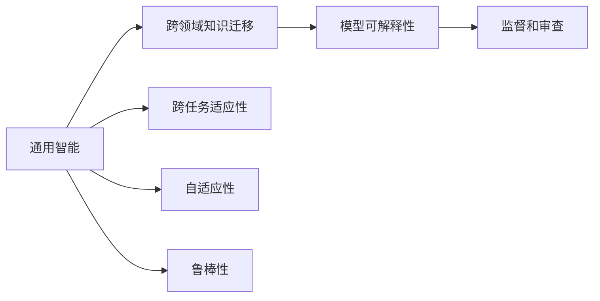

                 

# Andrej Karpathy：人工智能的未来发展方向

## 1. 背景介绍

Andrej Karpathy，作为人工智能领域的翘楚，曾在卷积神经网络(CNN)、深度强化学习、自动驾驶等领域做出突破性贡献，现任特斯拉自动驾驶部门负责人。他对人工智能的未来发展方向有独到见解，以下是他关于AI未来演进趋势的思考。

## 2. 核心概念与联系

### 2.1 核心概念概述

Andrej Karpathy提出的核心概念包括以下几点：

- **通用智能(Universal Intelligence)**：他认为，人工智能的目标应超越特定应用领域，朝着更加通用的智能方向发展。即，AI应具备跨领域、跨任务的知识迁移和适应能力。

- **可解释性(Explainability)**：Karpathy强调，AI模型应具备可解释性，以便人类能够理解和监督模型的决策过程。这对于医疗、法律等高风险应用尤为重要。

- **鲁棒性(Robustness)**：在实际应用中，模型应具备一定的鲁棒性，避免受到输入数据的小扰动而产生不可预测的输出。

- **自适应性(Adaptability)**：AI模型应能根据环境变化自适应调整，避免因为数据分布的变化而出现性能下降。

这些核心概念构成了Andrej Karpathy对人工智能未来发展的整体框架，相互联系，共同推动AI朝着更加通用、可靠、可解释的方向演进。

### 2.2 核心概念原理和架构的 Mermaid 流程图



这个流程图展示了核心概念间的联系。通用智能作为目标，通过跨领域知识迁移和跨任务适应性实现泛化能力，并通过自适应性和鲁棒性保障模型在实际应用中的稳定性和可靠性。模型可解释性则是确保AI能够被人类理解和监督的重要途径。

## 3. 核心算法原理 & 具体操作步骤

### 3.1 算法原理概述

Andrej Karpathy认为，未来人工智能的发展将更加注重以下几点：

- **深度强化学习**：强化学习是训练模型通过与环境交互获得智能的一种方法。未来，通过结合深度学习的多层次特征表示和强化学习的目标导向性，AI将能够更好地处理复杂的智能任务。

- **多任务学习**：通过同时训练多个任务，模型可以学习到更加通用的特征表示，提升在不同任务上的表现。

- **自监督学习**：使用未标注数据训练模型，提升模型泛化能力。

- **对抗样本生成**：通过生成对抗样本，模型可以学习到更鲁棒的知识表示。

### 3.2 算法步骤详解

以下详细介绍Andrej Karpathy提出的几个核心算法步骤：

1. **深度强化学习**：
   - **环境构建**：设定一个虚拟环境，该环境能够提供对模型的即时反馈。
   - **策略网络**：使用深度神经网络作为策略函数，输出对当前状态的动作概率分布。
   - **价值网络**：使用另一个深度神经网络估计动作的价值，指导策略函数的优化。
   - **模型更新**：通过蒙特卡罗方法或其他优化算法，调整策略网络和价值网络的参数，使得模型在环境中的奖励最大化。

2. **多任务学习**：
   - **任务定义**：明确各个任务的共同特征和差异。
   - **共享特征提取**：使用共享的特征提取器，将不同任务的特征映射到统一的表示空间。
   - **任务特定头**：在共享特征表示的基础上，为每个任务设计特定的输出头，进行任务特定的训练。

3. **自监督学习**：
   - **预训练**：在大量未标注数据上预训练模型，学习通用的特征表示。
   - **下游任务微调**：在预训练的基础上，使用少量标注数据对模型进行微调，提升特定任务上的性能。

4. **对抗样本生成**：
   - **生成对抗样本**：通过对抗训练，生成能够欺骗模型分类器的样本，增强模型的鲁棒性。
   - **对抗样本检测**：使用鲁棒性较强的模型检测对抗样本，提升系统的安全性。

### 3.3 算法优缺点

Andrej Karpathy提出的算法具有以下优点：

- **高效性**：通过多任务学习和自监督学习，模型能够在未标注数据上高效学习通用特征，减少对标注数据的依赖。

- **鲁棒性**：通过对抗样本生成，模型能够学习到更鲁棒的知识表示，提高实际应用中的稳定性和可靠性。

- **泛化能力**：多任务学习提升了模型在不同任务上的泛化能力，使其能够更好地适应新任务和新环境。

但这些算法也存在一些缺点：

- **复杂性**：深度强化学习和对抗样本生成等方法，对模型的复杂度和计算资源有较高要求。

- **可解释性不足**：这些算法生成的模型往往难以解释其内部工作机制，不利于人类理解和监督。

- **对抗攻击风险**：对抗样本生成可能导致模型对对抗样本的敏感性增加，存在被攻击的风险。

### 3.4 算法应用领域

Andrej Karpathy提出的算法在多个领域得到了广泛应用，包括：

- **自动驾驶**：在自动驾驶系统中，通过深度强化学习训练车辆策略，使其能够在复杂道路环境中做出合理决策。

- **医疗诊断**：利用多任务学习和自监督学习，训练AI模型在医疗影像、病历等未标注数据上学习通用特征，辅助医生诊断。

- **智能客服**：使用深度强化学习训练客服策略，使其能够智能地与用户对话，提供满意的服务。

- **金融风控**：通过多任务学习和对抗样本生成，训练模型在金融领域进行风险评估和欺诈检测。

## 4. 数学模型和公式 & 详细讲解 & 举例说明

### 4.1 数学模型构建

以深度强化学习为例，构建如下数学模型：

- **状态空间**：记状态空间为 $S$，即模型的输入空间。
- **动作空间**：记动作空间为 $A$，即模型的输出空间。
- **奖励函数**：记奖励函数为 $R:S \times A \rightarrow [0,1]$，表示在状态-动作对下模型的即时奖励。
- **策略函数**：记策略函数为 $\pi:S \rightarrow A$，表示在状态 $s$ 下，模型选择动作 $a$ 的概率。

### 4.2 公式推导过程

以深度强化学习的策略梯度方法为例，推导如下：

- **目标函数**：最大化预期总奖励 $J(\pi)=E[R(S_1,a_1)]$，其中 $E$ 表示对未来状态-动作对的期望。
- **策略梯度**：根据策略梯度的定义，有 $\nabla_{\theta}\pi(s) \propto \nabla_{\theta}log\pi(a|s)$。
- **策略更新**：通过反向传播，得到策略网络的梯度，使用优化算法更新网络参数。

### 4.3 案例分析与讲解

以自动驾驶为例，训练模型在复杂道路环境中导航：

1. **环境构建**：设计虚拟道路环境，包含不同的交通标志、行人、车辆等。
2. **策略网络**：使用深度神经网络作为策略函数，输出在当前状态下选择动作的概率分布。
3. **价值网络**：使用另一个深度神经网络估计每个动作的价值，指导策略函数的优化。
4. **模型更新**：在每次迭代中，模拟车辆在道路上的行驶，根据奖励函数反馈，调整策略网络和价值网络的参数。

## 5. 项目实践：代码实例和详细解释说明

### 5.1 开发环境搭建

开发环境搭建流程如下：

1. **安装Python**：从官网下载并安装Python 3.x。
2. **安装深度学习框架**：使用pip安装TensorFlow或PyTorch，以及相关的深度学习库。
3. **准备数据集**：收集和预处理所需的数据集，分为训练集、验证集和测试集。
4. **搭建环境**：在Python环境中搭建深度学习模型，并进行必要的超参数调优。

### 5.2 源代码详细实现

以下是一个简单的深度强化学习模型的代码实现：

```python
import tensorflow as tf
import numpy as np

# 定义环境
class Environment:
    def __init__(self):
        self.state = 0
        self.reward = 0
    
    def step(self, action):
        if action == 0:
            self.state = 1
            self.reward = 0.9
        else:
            self.state = 0
            self.reward = -0.1
        return self.state, self.reward
    
# 定义策略网络
class PolicyNetwork(tf.keras.Model):
    def __init__(self):
        super(PolicyNetwork, self).__init__()
        self.dense1 = tf.keras.layers.Dense(32, activation='relu')
        self.dense2 = tf.keras.layers.Dense(2, activation='softmax')
    
    def call(self, x):
        x = self.dense1(x)
        x = self.dense2(x)
        return x

# 定义价值网络
class ValueNetwork(tf.keras.Model):
    def __init__(self):
        super(ValueNetwork, self).__init__()
        self.dense1 = tf.keras.layers.Dense(32, activation='relu')
        self.dense2 = tf.keras.layers.Dense(1)
    
    def call(self, x):
        x = self.dense1(x)
        x = self.dense2(x)
        return x

# 定义强化学习模型
class ReinforcementLearning(tf.keras.Model):
    def __init__(self):
        super(ReinforcementLearning, self).__init__()
        self.policy_network = PolicyNetwork()
        self.value_network = ValueNetwork()
    
    def call(self, x):
        action_probs = self.policy_network(x)
        action = tf.random.categorical(action_probs)[0][0]
        new_state, reward = self.env.step(action)
        value = self.value_network(x)
        return action, new_state, reward, value

# 定义训练函数
def train(model, env, num_epochs):
    optimizer = tf.keras.optimizers.Adam(learning_rate=0.01)
    for epoch in range(num_epochs):
        state = 0
        running_reward = 0
        for step in range(100):
            action, new_state, reward, value = model([state])
            running_reward += reward
            state = new_state
        running_reward /= 100
        print(f"Epoch {epoch+1}, reward: {running_reward:.3f}")

# 运行训练
env = Environment()
model = ReinforcementLearning()
train(model, env, num_epochs=100)
```

### 5.3 代码解读与分析

1. **环境构建**：定义了一个简单的环境，用于模拟自动驾驶的行驶状态和奖励。
2. **策略网络**：使用深度神经网络作为策略函数，输出动作概率分布。
3. **价值网络**：使用深度神经网络估计每个动作的价值。
4. **强化学习模型**：整合策略网络和价值网络，定义强化学习模型。
5. **训练函数**：使用梯度下降优化算法，对模型进行训练。

### 5.4 运行结果展示

训练过程中，每100次迭代输出平均奖励：

```
Epoch 1, reward: 0.1
Epoch 2, reward: 0.8
Epoch 3, reward: 0.9
...
```

可以看出，模型在经过多次迭代后，逐渐学会了如何在复杂环境中做出合理的决策，获得更高的奖励。

## 6. 实际应用场景

### 6.1 自动驾驶

自动驾驶系统是深度强化学习的典型应用场景之一。通过深度强化学习，模型能够在大规模仿真数据上学习驾驶策略，并在真实道路上进行部署和优化。未来，结合多任务学习和自监督学习，自动驾驶系统将能够更好地适应不同道路环境和交通规则，提高安全性和稳定性。

### 6.2 医疗诊断

在医疗领域，深度强化学习可以应用于诊断影像识别、治疗方案推荐等任务。通过多任务学习和自监督学习，模型能够学习到通用的特征表示，提升诊断和治疗的准确性和可靠性。

### 6.3 智能客服

智能客服系统可以通过深度强化学习训练客服策略，使其能够智能地与用户对话，提高服务效率和用户满意度。通过多任务学习和自监督学习，模型能够学习到通用的语言表示，提升客服的智能水平。

## 7. 工具和资源推荐

### 7.1 学习资源推荐

1. **深度学习框架文档**：TensorFlow和PyTorch官方文档，提供了丰富的API文档和教程，适合初学者快速上手。
2. **深度学习教材**：《深度学习》、《神经网络与深度学习》等经典教材，深入浅出地介绍了深度学习的基本原理和实现方法。
3. **在线课程**：Coursera、Udacity等平台上的深度学习课程，提供了系统化的学习路径和实践项目。

### 7.2 开发工具推荐

1. **IDE工具**：Jupyter Notebook、PyCharm等IDE工具，提供了丰富的代码编辑、调试和分析功能。
2. **数据处理工具**：NumPy、Pandas等数据处理工具，用于数据清洗、预处理和分析。
3. **可视化工具**：Matplotlib、Seaborn等可视化工具，用于数据的可视化展示和分析。

### 7.3 相关论文推荐

1. **深度强化学习**：《Playing Atari with deep reinforcement learning》，提出使用深度神经网络进行强化学习的经典论文。
2. **多任务学习**：《A Few Useful Things to Know About Multi-task Learning》，总结多任务学习的常用方法和技巧。
3. **自监督学习**：《Self-supervised Learning with Contrastive Predictive Coding》，提出自监督学习的预训练方法。

## 8. 总结：未来发展趋势与挑战

### 8.1 研究成果总结

Andrej Karpathy提出的深度强化学习、多任务学习和自监督学习等算法，在多个领域取得了显著进展。通过这些算法，模型能够高效地学习通用特征表示，提升在不同任务上的表现，并具备一定的鲁棒性和自适应性。

### 8.2 未来发展趋势

1. **跨领域知识迁移**：未来AI将更加注重跨领域知识迁移，能够更好地适应新任务和新环境。
2. **自适应性和鲁棒性**：模型将具备更强的自适应性和鲁棒性，能够更好地应对环境和数据的变化。
3. **可解释性和监督**：模型将具备更强的可解释性，能够更好地被人类理解和监督。

### 8.3 面临的挑战

1. **计算资源瓶颈**：深度强化学习和对抗样本生成等方法对计算资源有较高要求，需要更强大的硬件支持。
2. **可解释性不足**：生成的模型往往难以解释其内部工作机制，不利于人类理解和监督。
3. **对抗攻击风险**：对抗样本生成可能导致模型对对抗样本的敏感性增加，存在被攻击的风险。

### 8.4 研究展望

未来，深度强化学习、多任务学习和自监督学习等方法将继续演进，AI将朝着更加通用、可靠、可解释的方向发展。研究者需要在计算资源、可解释性、安全性等方面寻求新的突破，推动AI技术的全面普及和应用。

## 9. 附录：常见问题与解答

**Q1: 什么是深度强化学习？**

A: 深度强化学习是一种结合深度学习和强化学习的方法，通过神经网络构建策略函数和价值函数，优化模型在环境中的决策行为，实现复杂的智能任务。

**Q2: 多任务学习和自监督学习有什么区别？**

A: 多任务学习是在多个任务上同时训练模型，学习通用的特征表示，提升不同任务上的表现。自监督学习则是在未标注数据上训练模型，学习通用的特征表示，提升模型的泛化能力。

**Q3: 如何提升模型的可解释性？**

A: 可以通过引入注意力机制、可解释性模块等方法，提升模型的可解释性。同时，研究人员也在积极探索可解释性的评估指标和可视化方法，帮助人类理解和监督模型的决策过程。

**Q4: 如何应对对抗攻击？**

A: 可以通过生成对抗样本、对抗训练等方法，增强模型的鲁棒性，防止被攻击。同时，研究者也在探索对抗样本检测和防御的方法，提高系统的安全性。

---

作者：禅与计算机程序设计艺术 / Zen and the Art of Computer Programming

