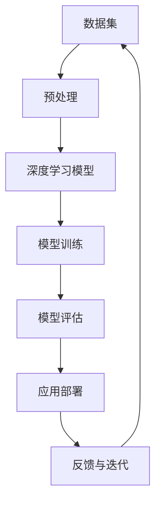

                 

## 1. 背景介绍

### 1.1 问题由来

在计算机视觉领域，Andrej Karpathy 是一位享有盛誉的专家，以其在深度学习和计算机视觉领域的研究和贡献著称。他不仅在顶级会议和期刊上发表了众多论文，还积极参与开源项目，致力于推动计算机视觉技术的普及和发展。最近，他发布了一个新的项目，旨在提升计算机视觉任务的性能，并通过众包平台奖励贡献者，从而激发了社区的广泛关注和参与。

### 1.2 问题核心关键点

该项目的核心在于利用大规模数据集和先进的深度学习模型，提升计算机视觉任务的准确率和效率。通过发布开源数据集和代码，Karpathy 希望能吸引更多研究人员和工程师加入，共同推动计算机视觉技术的发展。该项目的目标是提升计算机视觉领域的实际应用水平，特别是在自动驾驶、医疗影像分析等高价值应用场景中，实现技术的突破和创新。

### 1.3 问题研究意义

该项目的发布具有重要意义，不仅能推动计算机视觉技术的发展，还能促进跨学科的交流和合作，提升计算机视觉在实际应用中的影响力。通过众包平台奖励贡献者，Karpathy 激励了社区的积极参与，形成了一个开放、活跃的技术生态系统。

## 2. 核心概念与联系

### 2.1 核心概念概述

- **计算机视觉**：使用计算机技术对图像和视频进行分析和理解，广泛应用于自动驾驶、安防监控、医疗影像等领域。
- **深度学习**：通过多层神经网络对数据进行建模和预测，已经在计算机视觉领域取得了巨大成功。
- **众包平台**：利用互联网平台汇聚众人的智慧和资源，解决复杂的技术问题，如Amazon Mechanical Turk、CrowdFlower等。

### 2.2 核心概念原理和架构的 Mermaid 流程图

该图展示了计算机视觉项目从数据集预处理、深度学习模型训练、模型评估、应用部署，再到反馈与迭代的全流程。每个环节都至关重要，需要精心设计和优化。

## 3. 核心算法原理 & 具体操作步骤

### 3.1 算法原理概述

计算机视觉任务通常包括图像分类、目标检测、语义分割等，其核心算法原理是通过深度学习模型对图像进行特征提取和理解。常用的深度学习模型包括卷积神经网络(CNN)、循环神经网络(RNN)、注意力机制(Attention)等。

### 3.2 算法步骤详解

1. **数据收集与预处理**：收集和标注大规模数据集，进行数据增强、归一化、尺度变换等预处理操作。
2. **模型构建与训练**：设计适合的深度学习模型，使用随机梯度下降(SGD)、Adam等优化算法，在GPU上训练模型。
3. **模型评估与调整**：在验证集上评估模型性能，通过超参数调优和模型融合等技术提升模型准确率。
4. **应用部署与优化**：将训练好的模型部署到实际应用中，如自动驾驶、医疗影像分析系统，并进行实时性能优化。
5. **反馈与迭代**：收集应用反馈，更新数据集和模型，进行迭代改进。

### 3.3 算法优缺点

**优点**：
- 深度学习模型具有强大的特征提取和泛化能力，能够处理复杂的计算机视觉任务。
- 通过众包平台激励社区参与，可以快速汇聚大量优质数据和算法资源。

**缺点**：
- 数据标注成本高，且需要大量计算资源进行模型训练。
- 深度学习模型黑盒性强，难以解释其内部工作机制。
- 模型的部署和优化需要丰富的工程经验。

### 3.4 算法应用领域

计算机视觉技术广泛应用于：
- 自动驾驶：通过图像和激光雷达数据，实现车辆自主导航和避障。
- 医疗影像分析：使用医学影像数据，辅助医生进行疾病诊断和治疗。
- 安防监控：利用视频数据，实现人脸识别、异常行为检测等。
- 工业检测：对生产过程进行图像检测，提高生产效率和质量。
- 娱乐和游戏：实时生成和渲染高质量的图像和视频。

## 4. 数学模型和公式 & 详细讲解 & 举例说明

### 4.1 数学模型构建

以目标检测为例，其数学模型可以表示为：
$$ P(y|x;\theta) = \prod_i P(y_i|x_i;\theta) $$
其中 $x$ 为输入图像，$y$ 为标签，$y_i$ 为每个目标的标签，$\theta$ 为模型参数。

### 4.2 公式推导过程

目标检测的核心在于通过回归网络预测目标的位置和大小，并通过分类网络预测目标的类别。使用YOLO(You Only Look Once)模型为例，其目标预测部分可以表示为：
$$ x_t = \sigma(\hat{x_t}) $$
$$ y_t = \sigma(\hat{y_t}) $$
其中 $x_t$ 为归一化后的目标位置，$y_t$ 为归一化后的目标大小，$\sigma$ 为Sigmoid函数，$\hat{x_t}$ 和 $\hat{y_t}$ 为回归网络的预测结果。

### 4.3 案例分析与讲解

以YOLOv5为例，该模型在目标检测领域取得了显著的成果。其关键创新包括：
- 引入增强卷积网络(Deformable Convolution)，提升特征提取能力。
- 使用多尺度训练和测试，提高模型鲁棒性。
- 通过动态 anchor 和自适应金字塔池化层，优化目标检测的精度。
- 引入特征金字塔网络(FPN)，增强模型的空间分辨率。

## 5. 项目实践：代码实例和详细解释说明

### 5.1 开发环境搭建

- **环境准备**：安装Python 3.7及以上版本，安装PyTorch 1.8及以上版本，安装CUDA 11.1及以上版本。
- **虚拟环境**：使用conda创建虚拟环境，激活环境。
- **依赖安装**：安装必要的第三方库，如numpy、opencv、torchvision等。

### 5.2 源代码详细实现

以YOLOv5为例，其代码实现可以分为以下几个步骤：
1. 下载YOLOv5模型和数据集。
2. 搭建训练和推理环境。
3. 编写训练脚本和推理脚本。
4. 训练和评估模型。
5. 部署模型到实际应用中。

### 5.3 代码解读与分析

YOLOv5代码主要由以下几个模块组成：
- `utils`：包含模型和数据处理工具函数。
- `models`：定义YOLOv5模型结构。
- `optim`：实现训练优化器。
- `datasets`：定义数据集处理流程。
- `train`：实现模型训练过程。
- `infer`：实现模型推理过程。

## 6. 实际应用场景

### 6.1 自动驾驶

自动驾驶技术依赖于计算机视觉任务，如道路检测、行人检测、交通标志识别等。使用YOLOv5等模型，可以在实时图像中准确检测和分类目标，实现自动驾驶的自主导航和安全避障。

### 6.2 医疗影像分析

医疗影像分析是计算机视觉的重要应用之一。使用YOLOv5模型，可以辅助医生进行疾病诊断，如肺癌、乳腺癌、脑肿瘤等，提高诊断效率和准确率。

### 6.3 安防监控

安防监控系统需要实时检测异常行为和事件。使用YOLOv5模型，可以检测和识别不安全行为，如闯入、暴力事件等，提高监控系统的安全性。

### 6.4 工业检测

工业检测需要实时检测生产过程中的质量缺陷。使用YOLOv5模型，可以检测产品表面的缺陷、裂缝等，提高生产效率和产品质量。

### 6.5 娱乐和游戏

娱乐和游戏场景需要实时生成高质量的图像和视频。使用YOLOv5模型，可以实现实时的人脸检测、物体跟踪等功能，提升游戏体验和互动性。

## 7. 工具和资源推荐

### 7.1 学习资源推荐

- **《计算机视觉：模型、学习和推理》**：由斯坦福大学Andrej Karpathy教授编写，系统介绍了计算机视觉的基本概念、模型和算法。
- **DeepLearning.ai**：由Andrew Ng教授创办的在线课程平台，提供计算机视觉、深度学习等课程，涵盖理论、实践和应用。
- **Kaggle**：全球最大的数据科学竞赛平台，提供丰富的计算机视觉竞赛项目，锻炼实战技能。

### 7.2 开发工具推荐

- **PyTorch**：深度学习框架，支持GPU加速，广泛应用于计算机视觉任务。
- **OpenCV**：开源计算机视觉库，提供丰富的图像处理和分析功能。
- **TensorFlow**：深度学习框架，支持多种硬件平台，广泛应用于计算机视觉任务。
- **GitHub**：代码托管平台，便于版本控制和协作开发。

### 7.3 相关论文推荐

- **YOLOv5: Towards Real-Time Object Detection with a Single Multi-Scale Feature Pyramid Network**：提出YOLOv5模型，提升了目标检测的精度和速度。
- **Real-Time Multi-Object Tracking with a Fully Convolutional Network**：提出Faster R-CNN模型，提升了目标跟踪的精度和速度。
- **SSD: Single Shot Multibox Detector**：提出SSD模型，提升了目标检测的精度和速度。

## 8. 总结：未来发展趋势与挑战

### 8.1 研究成果总结

Andrej Karpathy 在计算机视觉领域的贡献得到了广泛认可，其发布的YOLOv5项目不仅提升了目标检测的精度和速度，还通过众包平台激励了社区的广泛参与，推动了计算机视觉技术的普及和发展。

### 8.2 未来发展趋势

未来计算机视觉技术的发展趋势包括：
- 深度学习模型的性能持续提升，精度和速度不断突破极限。
- 多模态视觉技术的发展，如融合图像、视频、语音等多模态信息，提升对复杂场景的理解能力。
- 边缘计算和嵌入式设备的应用，提升计算机视觉系统的实时性和高效性。
- 增强现实(AR)和虚拟现实(VR)技术的结合，推动计算机视觉在沉浸式体验中的应用。

### 8.3 面临的挑战

计算机视觉技术面临的挑战包括：
- 数据标注成本高，需要大量标注人员和资源。
- 模型复杂度高，需要高性能计算资源。
- 模型黑盒性强，难以解释其内部工作机制。
- 模型的实时性和鲁棒性需要进一步提升。

### 8.4 研究展望

未来计算机视觉研究需要关注以下几个方向：
- 数据增强技术的发展，提升数据利用效率。
- 模型优化算法的研究，提高模型训练和推理效率。
- 多模态视觉技术的应用，提升系统感知能力。
- 模型解释性和鲁棒性的改进，增强系统可解释性和安全性。

## 9. 附录：常见问题与解答

**Q1: 如何使用YOLOv5进行目标检测？**

A: 使用YOLOv5进行目标检测的步骤如下：
1. 下载预训练模型和数据集。
2. 搭建训练和推理环境。
3. 编写训练脚本和推理脚本。
4. 训练和评估模型。
5. 部署模型到实际应用中。

**Q2: YOLOv5在目标检测中如何提升精度和速度？**

A: YOLOv5通过以下方式提升精度和速度：
1. 使用增强卷积网络(Deformable Convolution)，提升特征提取能力。
2. 多尺度训练和测试，提高模型鲁棒性。
3. 动态 anchor 和自适应金字塔池化层，优化目标检测的精度。
4. 特征金字塔网络(FPN)，增强模型的空间分辨率。

**Q3: 计算机视觉技术在实际应用中面临哪些挑战？**

A: 计算机视觉技术在实际应用中面临以下挑战：
1. 数据标注成本高，需要大量标注人员和资源。
2. 模型复杂度高，需要高性能计算资源。
3. 模型黑盒性强，难以解释其内部工作机制。
4. 模型的实时性和鲁棒性需要进一步提升。

**Q4: 未来计算机视觉技术的发展方向是什么？**

A: 未来计算机视觉技术的发展方向包括：
1. 深度学习模型的性能持续提升，精度和速度不断突破极限。
2. 多模态视觉技术的发展，如融合图像、视频、语音等多模态信息，提升对复杂场景的理解能力。
3. 边缘计算和嵌入式设备的应用，提升计算机视觉系统的实时性和高效性。
4. 增强现实(AR)和虚拟现实(VR)技术的结合，推动计算机视觉在沉浸式体验中的应用。

---

作者：禅与计算机程序设计艺术 / Zen and the Art of Computer Programming

