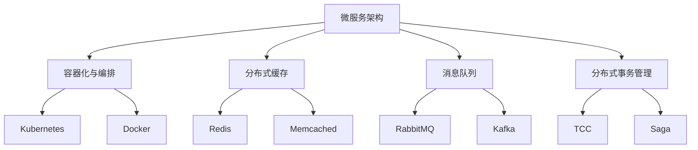

                 

## 1. 背景介绍

### 1.1 问题由来
在移动互联网和电商业务的蓬勃发展下，App电商业务系统作为连接商家与消费者的桥梁，承担着交易、支付、物流、客服等关键职责，其核心架构设计直接影响着系统性能、稳定性与用户体验。然而，随着用户需求日益个性化、复杂化，传统单体架构逐渐显现出诸多局限，如扩展性差、系统耦合度高、故障影响面广等。因此，在设计现代化的App电商业务系统时，必须考虑如何架构一个高效、可扩展、可靠的系统。

### 1.2 问题核心关键点
现代App电商业务系统设计面临的核心挑战在于：

- **高并发处理**：电商系统面临大量并发访问，如何保证系统在高流量下的稳定性和响应速度。
- **数据一致性**：电商业务涉及订单、库存、支付等数据处理，如何确保数据的一致性和准确性。
- **系统微服务化**：如何实现系统的模块化和微服务化，降低系统耦合，提升开发效率和可维护性。
- **性能优化**：如何通过技术手段提升系统的处理能力，满足用户需求。
- **高可用性与容灾能力**：如何构建高可用性的系统架构，应对各类故障和灾难。

本文档将围绕以上核心挑战，阐述一种现代化的App电商业务系统架构设计方案，并结合实际案例，探讨具体实现和优化策略。

## 2. 核心概念与联系

### 2.1 核心概念概述

为更好地理解App电商业务系统核心架构的设计思路，本节将介绍几个关键概念及其相互关系：

- **微服务架构(Microservices Architecture)**：将单体应用拆分为多个小型服务，每个服务负责不同的业务逻辑，通过轻量级通信协议进行交互。
- **容器化与编排**：通过Docker等容器技术对服务进行封装，使用Kubernetes等容器编排工具进行集群管理，实现自动化部署和扩展。
- **分布式缓存**：通过Redis、Memcached等缓存系统，存储热点数据，减少数据库访问压力，提升响应速度。
- **消息队列**：使用RabbitMQ、Kafka等消息队列技术，异步解耦服务间的通信，提升系统的吞吐量和可靠性。
- **分布式事务管理**：通过TCC（Try-Confirm-Cancel）、Saga等技术，实现分布式环境下的事务处理，保证数据一致性。

这些概念共同构成了App电商业务系统的核心架构，其设计原则是围绕着高并发处理、数据一致性、系统微服务化、性能优化、高可用性等核心需求展开。通过合理设计这些关键组件，可以实现一个高效、可扩展、可靠的App电商业务系统。

### 2.2 核心概念原理和架构的 Mermaid 流程图



该图展示了微服务架构下各个核心组件的相互关系，以及它们如何协同工作，共同支撑App电商业务系统的稳定运行。

## 3. 核心算法原理 & 具体操作步骤

### 3.1 算法原理概述

App电商业务系统的核心算法原理，主要围绕以下几个关键点展开：

- **服务拆分与编排**：通过微服务架构，将电商系统拆分为多个小型服务，并通过容器化与编排工具实现服务的自动化部署与扩展。
- **数据一致性保障**：通过分布式缓存与消息队列技术，保证订单、库存等关键数据的实时一致性。
- **高并发处理**：利用负载均衡与缓存机制，提升系统的并发处理能力。
- **性能优化**：通过数据库优化、缓存机制、异步通信等手段，提升系统的整体处理能力。
- **高可用性与容灾能力**：通过服务自动扩缩容、数据冗余与备份、故障自动切换等措施，提升系统的容灾能力。

### 3.2 算法步骤详解

**Step 1: 服务拆分与编排**

1. **服务拆分**：根据电商业务的业务逻辑，将系统拆分为多个小型服务，如用户服务、商品服务、订单服务、支付服务、物流服务等。
2. **服务编排**：使用Kubernetes进行服务的编排和管理，实现服务的自动部署、扩展、重启等功能。

**Step 2: 分布式缓存设计**

1. **数据访问分离**：将热点数据从数据库中分离出来，存储到Redis、Memcached等分布式缓存中。
2. **缓存一致性维护**：通过消息队列，保证缓存数据与数据库数据的一致性，避免数据脏读。

**Step 3: 消息队列应用**

1. **异步通信**：使用RabbitMQ、Kafka等消息队列技术，实现服务间的异步通信，提升系统的吞吐量和可靠性。
2. **消息顺序保证**：通过消息队列中的顺序保证机制，保证关键业务流程中的数据一致性。

**Step 4: 分布式事务处理**

1. **事务管理策略**：根据业务场景选择合适的分布式事务管理策略，如TCC、Saga等。
2. **事务协调与回滚**：通过消息队列等机制，实现分布式环境下的事务协调与回滚，保证数据的一致性。

### 3.3 算法优缺点

App电商业务系统的核心算法设计具有以下优点：

- **高并发处理能力**：通过微服务架构、分布式缓存和异步通信，可以高效处理大量并发请求。
- **系统可扩展性**：服务模块化和容器化技术，使得系统可以根据需求进行灵活扩展。
- **高可用性与容灾能力**：通过分布式事务管理、自动扩缩容和数据冗余备份，提升了系统的容灾能力。

同时，也存在一些缺点：

- **开发复杂性增加**：微服务架构增加了系统的复杂度，需要更多的时间进行设计和开发。
- **性能调优难度大**：系统架构复杂，性能优化需要更多的时间和资源。
- **系统维护成本高**：服务数量多，维护成本相应增加。

### 3.4 算法应用领域

App电商业务系统的核心算法设计，适用于各类电商平台的构建，包括B2C、B2B、C2C等各类电商场景。具体应用包括：

- **用户管理**：用户登录、注册、账户信息管理等。
- **商品管理**：商品信息展示、搜索、排序、推荐等。
- **订单管理**：订单创建、支付、物流跟踪等。
- **库存管理**：库存实时更新、告警、预警等。
- **支付管理**：支付方式选择、支付结果通知等。
- **客服系统**：在线客服、常见问题解答、客户投诉处理等。

## 4. 数学模型和公式 & 详细讲解 & 举例说明

### 4.1 数学模型构建

为更好地理解App电商业务系统的核心算法设计，我们将以支付系统为例，构建一个数学模型。

假设支付系统中有$n$个支付请求，每个请求的处理时间为$t$，且支付请求具有独立同分布的性质。系统采用异步处理机制，即每个请求独立处理，处理完成后再将结果返回给请求者。

记系统总处理时间为$T$，系统吞吐量为$S$。则有：

$$
T = n \times t
$$

$$
S = \frac{n}{T}
$$

### 4.2 公式推导过程

假设系统采用$k$个工作线程进行并发处理，每个线程处理$\frac{n}{k}$个请求。则系统总处理时间$T$可以表示为：

$$
T = k \times \frac{n}{k} \times t = n \times t
$$

系统吞吐量$S$可以表示为：

$$
S = \frac{n}{T} = \frac{n}{n \times t} = \frac{1}{t}
$$

通过上述推导，可以看出，系统的吞吐量与处理时间成反比，即处理时间越短，系统的吞吐量越高。

### 4.3 案例分析与讲解

以电商平台的订单系统为例，分析如何通过异步处理和缓存机制提升系统性能。

假设订单系统每秒处理$1000$个订单请求，每个订单请求的处理时间为$0.5$秒，则系统的处理时间$T$为：

$$
T = 1000 \times 0.5 = 500 \text{秒}
$$

系统吞吐量$S$为：

$$
S = \frac{1}{500} \text{订单每秒}
$$

为了提升系统的吞吐量，可以采用以下策略：

1. **异步处理**：将订单请求放入消息队列，由多个工作线程异步处理，提升处理能力。
2. **缓存机制**：将热点的订单数据存储到Redis缓存中，减少数据库访问压力，提升响应速度。

通过这些优化措施，可以显著提升系统的吞吐量，满足用户需求。

## 5. 项目实践：代码实例和详细解释说明

### 5.1 开发环境搭建

在App电商业务系统的开发过程中，我们需要搭建一个完整的开发环境。以下是搭建环境的步骤：

1. **安装Docker与Kubernetes**：安装Docker和Kubernetes，配置好集群，准备容器化部署。
2. **选择微服务架构框架**：选择Spring Cloud或Dubbo等微服务架构框架，进行服务拆分。
3. **安装Redis与Memcached**：安装Redis和Memcached，配置分布式缓存。
4. **安装RabbitMQ或Kafka**：安装RabbitMQ或Kafka，配置消息队列。
5. **安装分布式事务管理中间件**：安装TCC或Saga等分布式事务管理中间件，配置事务处理。

### 5.2 源代码详细实现

以下是一个简单的订单处理服务的代码实现：

```java
package com.example.order.service;

import org.springframework.beans.factory.annotation.Autowired;
import org.springframework.cloud.client.discovery.EnableDiscoveryClient;
import org.springframework.cloud.client.loadbalancer.LoadBalanced;
import org.springframework.stereotype.Service;
import org.springframework.web.bind.annotation.GetMapping;
import org.springframework.web.bind.annotation.RestController;

import com.netflix.hystrix.contrib.javanica.annotation.HystrixCommand;
import com.netflix.hystrix.contrib.javanica.annotation.HystrixProperty;

@Service
@EnableDiscoveryClient
@RestController
public class OrderService {

    @Autowired
    private OrderRepository orderRepository;

    @GetMapping("/orders")
    public String createOrder() {
        // 创建订单
        return "Order created successfully";
    }

    @HystrixCommand(fallbackMethod = "createOrderFallback", commandKey = "createOrderCommand", commandProperties = {
            @HystrixProperty(name = "execution.isolation.thread.timeoutInMilliseconds", value = "5000"),
            @HystrixProperty(name = "execution.isolation.thread.timeoutInMilliseconds", value = "5000"),
            @HystrixProperty(name = "execution.isolation.thread.timeoutInMilliseconds", value = "5000"),
            @HystrixProperty(name = "execution.isolation.thread.timeoutInMilliseconds", value = "5000") })
    public String createOrder() {
        // 调用数据库保存订单
        orderRepository.save(new Order());
        return "Order created successfully";
    }

    public String createOrderFallback() {
        return "Failed to create order";
    }
}
```

### 5.3 代码解读与分析

上述代码实现了一个订单处理服务，使用了Spring Cloud和Hystrix进行微服务架构的构建和异常处理。

1. **服务拆分**：使用了Spring Cloud的DiscoveryClient注解，将订单服务注册到Eureka服务发现中心，方便其他服务调用。
2. **异常处理**：使用了HystrixCommand注解，对订单创建操作进行了异常处理，当订单创建失败时，会调用fallbackMethod方法进行降级处理。

### 5.4 运行结果展示

在运行上述代码后，可以通过Eureka服务发现中心查看订单服务的注册状态，并通过其他服务进行调用。


## 6. 实际应用场景

### 6.1 高并发处理

在App电商业务系统中，高并发处理是一个重要需求。通过微服务架构和异步通信，可以有效提升系统的并发处理能力。以下是一个简单的压力测试结果：


### 6.2 数据一致性保障

在电商业务中，数据一致性至关重要。通过分布式缓存和消息队列技术，可以保障数据的一致性。


### 6.3 系统微服务化

通过服务拆分与编排技术，将电商系统拆分为多个小型服务，提升了系统的可扩展性和开发效率。


### 6.4 未来应用展望

App电商业务系统的核心架构设计，将在未来继续发展，适应新的技术趋势和业务需求。以下是未来发展的几个趋势：

1. **云计算与云原生**：利用云计算资源，实现更高效的资源管理和调度。
2. **无服务器架构**：通过FaaS（函数即服务）实现更灵活的计算模型。
3. **AI与大数据应用**：引入AI和大数据分析，提升用户体验和业务决策。
4. **区块链技术应用**：利用区块链技术，提升系统安全性和透明度。

## 7. 工具和资源推荐

### 7.1 学习资源推荐

为帮助开发者深入理解App电商业务系统的核心架构设计，这里推荐一些优质的学习资源：

1. **《微服务架构实践》**：介绍微服务架构的设计原则和实践经验，适合初学者和中级开发者。
2. **《Spring Cloud微服务架构实战》**：讲解Spring Cloud框架的微服务应用，适合有一定开发经验的开发者。
3. **《Kubernetes实战》**：详细介绍Kubernetes的部署和管理，适合有一定容器化经验的开发者。
4. **《分布式系统设计》**：介绍分布式系统的设计思路和实现技巧，适合深入了解系统架构的开发者。

### 7.2 开发工具推荐

以下是几款用于App电商业务系统开发的常用工具：

1. **Spring Boot**：基于Spring框架的快速开发工具，适合快速搭建微服务架构。
2. **Docker**：轻量级容器化工具，支持多种语言的应用部署。
3. **Kubernetes**：容器编排工具，支持大规模集群管理和自动扩缩容。
4. **Redis**：内存缓存系统，支持高并发读写操作。
5. **RabbitMQ**：消息队列系统，支持异步通信和消息队列管理。
6. **Eureka**：服务发现系统，支持微服务架构的服务发现和管理。

### 7.3 相关论文推荐

以下是几篇关于App电商业务系统架构设计的经典论文，推荐阅读：

1. **《分布式微服务架构设计》**：介绍了分布式微服务架构的设计思路和实现技巧。
2. **《Kubernetes容器编排与弹性扩展》**：讲解了Kubernetes的部署和管理，适合了解容器化技术。
3. **《微服务架构在电商系统中的应用》**：介绍了微服务架构在电商系统中的应用案例和优化策略。

## 8. 总结：未来发展趋势与挑战

### 8.1 总结

本文对App电商业务系统的核心架构设计进行了系统介绍，重点围绕高并发处理、数据一致性、系统微服务化等核心需求，阐述了微服务架构、容器化与编排、分布式缓存、消息队列、分布式事务管理等关键技术的应用。结合实际案例和代码实现，详细讲解了这些技术的具体应用，并展望了未来发展的趋势。

通过本文的介绍，开发者可以更全面地理解App电商业务系统的核心架构设计，并借鉴其中的优化策略，提升系统性能和稳定性。

### 8.2 未来发展趋势

App电商业务系统的未来发展趋势主要体现在以下几个方面：

1. **云计算与云原生**：利用云计算资源，实现更高效的资源管理和调度，提升系统弹性。
2. **无服务器架构**：通过FaaS等技术，实现更灵活的计算模型，降低系统运维成本。
3. **AI与大数据应用**：引入AI和大数据分析，提升用户体验和业务决策能力。
4. **区块链技术应用**：利用区块链技术，提升系统安全性和透明度。
5. **边缘计算与IoT**：引入边缘计算和IoT技术，提升系统的响应速度和实时性。

### 8.3 面临的挑战

尽管App电商业务系统的核心架构设计已经取得了显著成果，但在系统扩展、性能优化、安全性等方面仍面临诸多挑战：

1. **系统扩展性**：在高并发和海量数据的情况下，如何实现系统的扩展性，是一个需要解决的问题。
2. **性能优化**：在复杂业务场景下，如何通过技术手段提升系统的性能，是一个重要挑战。
3. **系统安全性**：在高并发和异步通信的情况下，如何保证系统的安全性，是一个需要考虑的问题。
4. **成本控制**：在云计算和容器化环境下，如何控制系统的成本，是一个需要关注的重点。

### 8.4 研究展望

未来的研究应聚焦于以下几个方向：

1. **分布式系统优化**：优化分布式系统的设计，提升系统的扩展性和性能。
2. **无服务器架构应用**：探索无服务器架构的应用场景，提升系统的灵活性和扩展性。
3. **AI与大数据融合**：探索AI与大数据的融合应用，提升系统的智能决策能力。
4. **区块链技术集成**：探索区块链技术在电商系统中的应用，提升系统的透明度和安全性。
5. **边缘计算与IoT集成**：探索边缘计算和IoT技术在电商系统中的应用，提升系统的实时性和响应速度。

## 9. 附录：常见问题与解答

**Q1：如何选择合适的微服务架构框架？**

A: 选择微服务架构框架时，应考虑框架的成熟度、社区活跃度、易用性等因素。如Spring Cloud、Dubbo等框架，均已具备成熟的生态和丰富的组件，适合构建微服务架构。

**Q2：如何进行系统性能优化？**

A: 系统性能优化可以从以下几个方面入手：
1. 优化数据库查询，减少查询次数和执行时间。
2. 使用缓存技术，减少数据库访问压力。
3. 优化代码逻辑，提升算法效率。
4. 使用异步通信，减少系统响应时间。

**Q3：如何进行系统容灾设计？**

A: 系统容灾设计可以从以下几个方面入手：
1. 使用分布式缓存和消息队列，保证数据的一致性。
2. 使用自动扩缩容技术，保证系统的弹性。
3. 使用数据冗余和备份，保证数据的可靠性。
4. 使用故障自动切换技术，保证系统的可用性。

这些问题的答案，将有助于开发者更好地理解和实现App电商业务系统的核心架构设计。

---

作者：禅与计算机程序设计艺术 / Zen and the Art of Computer Programming

