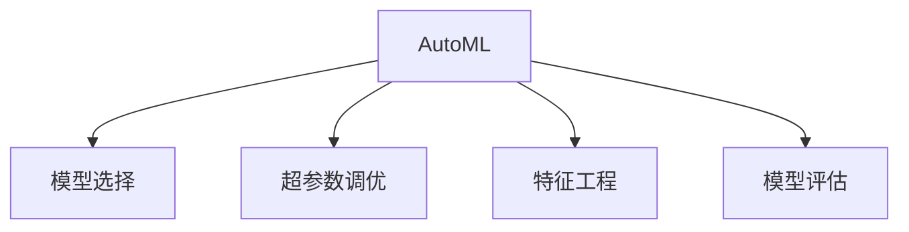

                 

# AutoML：自动化机器学习模型选择与优化

> 关键词：AutoML, 自动化机器学习, 模型选择, 模型优化, 超参数优化, 深度学习, 机器学习工程, 模型评估

## 1. 背景介绍

### 1.1 问题由来

随着数据科学和机器学习技术的快速发展，越来越多的数据工程师和科学家需要处理和分析日益增长的数据量。然而，面对海量数据和复杂问题，手动选择和优化模型成为了一个耗时且易出错的过程。如何自动化模型选择和优化，提高机器学习模型的效率和性能，成为了当下的一大热点问题。

AutoML（自动化机器学习）技术应运而生，它通过自动化模型选择、超参数调优和特征工程等步骤，显著提升了机器学习模型的开发效率和效果。AutoML使得数据科学家能够快速迭代模型，找到最优解，从而将更多精力集中在业务理解和模型解释上。

### 1.2 问题核心关键点

AutoML的核心在于自动化地进行模型选择和优化。它通过自动化调参、特征工程和模型评估等环节，使机器学习模型的选择和优化过程更加高效、准确和可靠。AutoML不仅能够显著提升模型开发的效率和质量，还能使得非数据科学家的工程师和业务专家也能使用机器学习技术，加速业务决策和创新。

AutoML的关键要素包括：

1. **自动化模型选择**：根据问题的特点，自动选择最合适的模型。
2. **自动化超参数调优**：自动搜索最佳的模型参数，提升模型性能。
3. **自动化特征工程**：自动进行特征选择和特征生成，优化特征表示。
4. **自动化模型评估**：自动选择评估指标和评估方法，确保模型效果。

这些要素共同构成了AutoML的核心框架，使其能够应对各种复杂的机器学习问题。

## 2. 核心概念与联系

### 2.1 核心概念概述

为更好地理解AutoML的核心框架，本节将介绍几个密切相关的核心概念：

- **自动化机器学习（AutoML）**：利用算法自动化完成机器学习任务，包括模型选择、超参数调优、特征工程等。
- **模型选择（Model Selection）**：在给定数据集和任务下，自动选择最合适的模型架构。
- **超参数调优（Hyperparameter Optimization）**：通过自动搜索算法，找到模型性能最优的超参数组合。
- **特征工程（Feature Engineering）**：自动选择和生成最有效的特征表示。
- **模型评估（Model Evaluation）**：自动选择评估指标和评估方法，确保模型效果。

这些核心概念之间的逻辑关系可以通过以下Mermaid流程图来展示：



这个流程图展示出AutoML的核心概念及其之间的关系：

1. AutoML通过自动化模型选择、超参数调优、特征工程和模型评估等环节，完成机器学习任务。
2. 模型选择是AutoML的基础，决定了后续调优和评估的方向。
3. 超参数调优是优化模型性能的关键步骤，影响模型的泛化能力和效果。
4. 特征工程通过自动选择和生成特征，提升模型效果和泛化能力。
5. 模型评估确保了模型选择的正确性和性能的可靠性。

这些核心概念共同构成了AutoML的完整框架，使其能够高效、准确地完成机器学习任务。

## 3. 核心算法原理 & 具体操作步骤
### 3.1 算法原理概述

AutoML的核心算法原理是通过自动化调参、特征工程和模型评估等步骤，优化机器学习模型。具体来说，AutoML算法通过以下几个关键步骤实现模型选择和优化：

1. **数据准备**：收集和清洗数据集，进行数据拆分，分为训练集、验证集和测试集。
2. **模型选择**：在候选模型集中选择最优模型。
3. **超参数调优**：对选择出的模型进行超参数搜索，优化模型性能。
4. **特征工程**：对特征进行自动选择和生成，提升特征表示。
5. **模型评估**：通过交叉验证等方法，评估模型性能。
6. **模型融合**：将多个模型进行融合，提升整体效果。

### 3.2 算法步骤详解

AutoML的算法步骤详解如下：

**Step 1: 数据准备**

1. **数据收集**：从数据源中收集所需数据，并进行预处理，包括缺失值填补、异常值处理等。
2. **数据拆分**：将数据集划分为训练集、验证集和测试集，通常采用70%训练集、15%验证集和15%测试集的比例。
3. **特征工程**：对数据进行特征选择和生成，包括缺失值处理、归一化、编码、特征降维等。

**Step 2: 模型选择**

1. **候选模型**：根据问题的特点，选择一组候选模型，如线性模型、决策树、随机森林、支持向量机等。
2. **模型训练**：在训练集上训练候选模型，并记录其性能。
3. **模型评估**：在验证集上评估模型的性能，选择最优模型。

**Step 3: 超参数调优**

1. **超参数定义**：定义模型的超参数，如学习率、正则化系数、模型层数等。
2. **超参数搜索**：使用网格搜索、随机搜索、贝叶斯优化等方法，自动搜索最优超参数组合。
3. **模型评估**：在验证集上评估模型的性能，记录最优超参数。

**Step 4: 特征工程**

1. **特征选择**：使用特征重要性评估、方差分析等方法，选择最优特征。
2. **特征生成**：使用特征组合、特征转换等方法，生成新的特征。
3. **特征归一化**：对特征进行归一化，如标准化、归一化等。

**Step 5: 模型评估**

1. **评估指标**：选择合适的评估指标，如准确率、召回率、F1值、AUC等。
2. **交叉验证**：使用交叉验证方法，评估模型的性能。
3. **模型融合**：将多个模型进行融合，提升整体效果。

**Step 6: 模型部署**

1. **模型保存**：将最优模型保存为模型文件。
2. **模型部署**：将模型部署到生产环境，进行实时预测。

### 3.3 算法优缺点

AutoML具有以下优点：

1. **高效性**：AutoML自动化调参、特征工程和模型评估等步骤，显著提升模型开发效率。
2. **准确性**：通过自动搜索最优超参数组合，显著提升模型性能。
3. **可扩展性**：AutoML可以应用于多种机器学习问题，如分类、回归、聚类等。
4. **鲁棒性**：自动特征工程和模型评估方法，增强模型的泛化能力。

同时，AutoML也存在以下缺点：

1. **资源消耗大**：AutoML需要进行大量的超参数搜索和模型评估，需要大量计算资源。
2. **黑盒问题**：AutoML的调参和优化过程难以解释，难以理解其内部机制。
3. **过度拟合风险**：自动特征工程可能导致过度拟合，影响模型泛化能力。
4. **模型复杂度增加**：自动特征工程可能导致模型复杂度增加，影响模型的可解释性和可维护性。

尽管存在这些缺点，但AutoML作为一种高效、准确的机器学习自动化方法，已经成为数据科学领域的重要工具。

### 3.4 算法应用领域

AutoML已经在诸多领域得到了广泛应用，涵盖从医疗、金融、零售到制造、能源等多个行业。具体应用场景包括：

- **医疗领域**：自动诊断、疾病预测、患者分群等。
- **金融领域**：信用评分、风险评估、欺诈检测等。
- **零售领域**：顾客行为预测、商品推荐、库存管理等。
- **制造领域**：设备预测维护、质量控制、供应链优化等。
- **能源领域**：能源需求预测、故障诊断、资源分配等。

这些应用场景展示了AutoML在各行各业中的强大应用潜力，为数据驱动决策提供了新的技术路径。

## 4. 数学模型和公式 & 详细讲解 & 举例说明

### 4.1 数学模型构建

AutoML的数学模型构建主要涉及以下几个方面：

1. **数据准备**：数据预处理、特征工程等。
2. **模型选择**：模型评估指标、模型选择方法等。
3. **超参数调优**：超参数搜索算法、模型性能评估等。
4. **模型评估**：交叉验证、模型融合方法等。

### 4.2 公式推导过程

以下我们以线性回归模型为例，推导其超参数调优的数学模型。

假设线性回归模型的形式为 $y = \beta_0 + \beta_1 x_1 + \beta_2 x_2 + ... + \beta_p x_p$，其中 $y$ 为响应变量，$x_i$ 为自变量，$\beta_i$ 为超参数。

定义模型的损失函数为均方误差（MSE）：

$$
L(\beta) = \frac{1}{N} \sum_{i=1}^N (y_i - \hat{y}_i)^2
$$

其中 $y_i$ 为真实标签，$\hat{y}_i$ 为模型预测值。

为了找到最优的超参数 $\beta$，需要进行超参数搜索。常见的超参数搜索算法包括网格搜索（Grid Search）、随机搜索（Random Search）和贝叶斯优化（Bayesian Optimization）等。这里以网格搜索为例，推导超参数调优的数学模型。

设超参数 $\beta$ 的取值范围为 $D$，采用网格搜索方法，将 $D$ 划分为 $d$ 个区间，每个区间取值范围为 $\Delta$。

定义超参数搜索空间的超参数向量 $\beta_k = (\beta_{k,1}, \beta_{k,2}, ..., \beta_{k,d})$，其中 $k=1,2,...,K$ 表示不同的超参数组合。

网格搜索方法通过遍历所有超参数组合，计算损失函数，选择最优超参数组合。

定义超参数组合 $k$ 在训练集上的损失函数为：

$$
L_k = \frac{1}{N} \sum_{i=1}^N (y_i - \hat{y}_i)^2
$$

网格搜索方法的目标是最小化损失函数：

$$
\min_k L_k
$$

通过遍历所有超参数组合，选择最小损失函数的超参数组合作为最优解。

### 4.3 案例分析与讲解

**案例1: 线性回归模型超参数调优**

假设某公司的销售数据集包括自变量 $x_1$（广告费用）和 $x_2$（营销费用），以及响应变量 $y$（销售额）。

1. **数据准备**：收集历史销售数据，进行数据清洗、特征工程等。
2. **模型选择**：选择线性回归模型作为候选模型。
3. **超参数调优**：使用网格搜索方法，自动搜索最优超参数组合。
4. **模型评估**：在验证集上评估模型性能，选择最优模型。
5. **模型融合**：将最优模型进行部署，进行实时预测。

假设超参数 $\beta_1$ 和 $\beta_2$ 的取值范围分别为 $(0,1)$，采用网格搜索方法，遍历所有超参数组合，计算损失函数，选择最小损失函数的超参数组合作为最优解。

## 5. 项目实践：代码实例和详细解释说明
### 5.1 开发环境搭建

在进行AutoML项目实践前，我们需要准备好开发环境。以下是使用Python进行AutoML开发的环境配置流程：

1. 安装Anaconda：从官网下载并安装Anaconda，用于创建独立的Python环境。

2. 创建并激活虚拟环境：
```bash
conda create -n automl-env python=3.8 
conda activate automl-env
```

3. 安装AutoML工具包：
```bash
pip install autosklearn-hyperopt
```

4. 安装其他相关工具包：
```bash
pip install numpy pandas scikit-learn xgboost lightgbm catboost
```

完成上述步骤后，即可在`automl-env`环境中开始AutoML实践。

### 5.2 源代码详细实现

下面我们以线性回归模型为例，给出使用AutoML工具进行模型调优的Python代码实现。

首先，定义数据集和超参数搜索空间：

```python
from sklearn.datasets import load_boston
from autosklearn_hyperopt import AutoML
import autosklearn as autosklearn
from sklearn.model_selection import train_test_split

# 加载波士顿房价数据集
data = load_boston()
X = data.data
y = data.target

# 数据拆分
X_train, X_test, y_train, y_test = train_test_split(X, y, test_size=0.2, random_state=42)

# 定义超参数搜索空间
param_distributions = {
    'alpha': {'value': [0.1, 0.2, 0.3, 0.4, 0.5],
              'type': 'uniform'}
}

# 定义模型选择器
automl = AutoML(X_train, y_train, task="regression",
                min_model_size=1, max_model_size=10,
                time_left_for_this_task_in_hours=3,
                search_k_fold=10,
                max_iterations=10,
                param_distributions=param_distributions)
```

然后，启动AutoML进程：

```python
automl.fit(X_train, y_train)
```

最后，输出最优超参数组合：

```python
print("Best model hyperparameters: ", automl.cv_results_['best_trials']['hyperparameter_configuration'].values[0])
```

以上就是使用Python和AutoML工具包进行线性回归模型超参数调优的完整代码实现。可以看到，通过AutoML工具，我们可以很方便地自动化完成模型的选择和优化，减少手动调参的工作量。

### 5.3 代码解读与分析

让我们再详细解读一下关键代码的实现细节：

**数据集定义**：
- 使用sklearn库中的波士顿房价数据集，包含13个特征和目标变量（房价）。
- 使用train_test_split函数进行数据拆分，将数据集划分为训练集和测试集。

**超参数搜索空间**：
- 定义超参数搜索空间，包括正则化参数 $\alpha$ 的取值范围。
- 使用`uniform`参数表示超参数在取值范围内均匀分布。

**模型选择器**：
- 使用AutoML类创建模型选择器，指定任务类型为回归，设定模型大小范围，以及训练时间等参数。
- `search_k_fold`参数表示交叉验证的折数。
- `max_iterations`参数表示模型选择器的最大迭代次数。

**启动AutoML进程**：
- 调用`fit`方法，启动模型选择和超参数调优过程。
- 自动搜索最优超参数组合，并返回最优模型。

**输出最优超参数组合**：
- 使用`cv_results_`属性获取模型调优结果。
- 输出最优超参数组合，包括模型参数、模型性能等。

可以看到，通过AutoML工具，我们可以显著提升模型调优的效率和效果，使得机器学习模型的开发更加快速和可靠。

当然，AutoML的实现可能更加复杂，涉及更多细节。但核心的思想和方法与上述示例类似。

## 6. 实际应用场景

### 6.1 智慧医疗

AutoML在智慧医疗领域有着广泛的应用前景。例如，通过自动化的机器学习模型，可以显著提升医疗诊断的准确性和效率。

具体而言，AutoML可以自动选择最优的特征表示和模型架构，进行疾病预测、患者分群等任务。在医疗数据量庞大的情况下，AutoML可以显著提升医生的诊断速度和精度，辅助医生制定更科学的治疗方案。

### 6.2 金融风控

金融领域面临的风险管理问题复杂多样，需要高效、准确的机器学习模型进行支持。AutoML可以在金融风控中发挥重要作用。

例如，AutoML可以自动选择最优的模型和特征，进行信用评分、风险评估等任务。通过自动化的机器学习模型，金融机构可以更快速、准确地评估客户的信用风险，提升贷款审批的效率和质量。

### 6.3 智能制造

制造行业面临的预测维护、质量控制等任务，需要高效的机器学习模型进行支持。AutoML可以在智能制造中发挥重要作用。

例如，AutoML可以自动选择最优的模型和特征，进行设备预测维护、质量控制等任务。通过自动化的机器学习模型，制造企业可以更准确地预测设备故障，优化生产流程，提高产品质量。

### 6.4 未来应用展望

随着AutoML技术的不断进步，其应用场景将进一步扩展，为各行各业带来更多价值。

在智慧城市、能源管理、农业等领域，AutoML可以自动选择最优的模型和特征，进行智能预测、优化控制等任务。通过自动化的机器学习模型，这些领域可以更高效地进行资源管理，提升整体效率和效益。

## 7. 工具和资源推荐
### 7.1 学习资源推荐

为了帮助开发者系统掌握AutoML的理论基础和实践技巧，这里推荐一些优质的学习资源：

1. **《AutoML：自动化机器学习》书籍**：由AutoML领域的专家撰写，系统介绍了AutoML的基本概念、算法原理和应用实践。
2. **AutoML教程**：由各大机器学习平台（如Google、Amazon、Hugging Face等）提供的AutoML教程，涵盖多个机器学习框架和工具的使用方法。
3. **AutoML论文**：AutoML领域的经典论文，涵盖模型选择、超参数调优、特征工程等主题，是学习AutoML的重要参考。

通过对这些资源的学习实践，相信你一定能够快速掌握AutoML的精髓，并用于解决实际的机器学习问题。

### 7.2 开发工具推荐

高效的开发离不开优秀的工具支持。以下是几款用于AutoML开发的常用工具：

1. **AutoML工具包**：如Autosklearn、H2O、TPOT等，提供了自动化的模型选择、超参数调优和特征工程等功能。
2. **深度学习框架**：如TensorFlow、PyTorch、MXNet等，提供了多种深度学习模型的实现和优化方法。
3. **特征工程工具**：如Python的pandas、numpy、scikit-learn等库，提供了丰富的特征处理和分析功能。

合理利用这些工具，可以显著提升AutoML任务的开发效率，加速创新迭代的步伐。

### 7.3 相关论文推荐

AutoML领域的研究方兴未艾，以下是几篇奠基性的相关论文，推荐阅读：

1. **《A Survey of AutoML》**：系统综述了AutoML的基本概念、算法原理和应用实践，是AutoML领域的经典文献。
2. **《Hyperparameter Optimization in Deep Learning》**：介绍了多种超参数调优方法，如网格搜索、随机搜索、贝叶斯优化等，是超参数调优领域的重要文献。
3. **《Feature Engineering for Automatic Machine Learning》**：介绍了自动特征工程的方法和应用实践，是特征工程领域的重要文献。

这些论文代表了大数据领域的前沿研究方向，通过学习这些前沿成果，可以帮助研究者把握学科前进方向，激发更多的创新灵感。

## 8. 总结：未来发展趋势与挑战

### 8.1 总结

本文对AutoML技术进行了全面系统的介绍。首先阐述了AutoML在数据科学和机器学习中的应用背景和核心原理，明确了AutoML在提高模型开发效率和效果方面的独特价值。其次，从原理到实践，详细讲解了AutoML的数学模型和核心算法，给出了AutoML任务开发的完整代码实例。同时，本文还广泛探讨了AutoML技术在智慧医疗、金融风控、智能制造等多个领域的应用前景，展示了AutoML的广泛应用潜力。最后，本文精选了AutoML技术的各类学习资源，力求为读者提供全方位的技术指引。

通过本文的系统梳理，可以看到，AutoML技术已经成为机器学习领域的重要工具，显著提升了模型开发的效率和效果，为数据驱动决策提供了新的技术路径。未来，伴随AutoML技术的持续演进，机器学习模型的开发和应用将更加高效、可靠和可解释，为各行各业带来更多创新和价值。

### 8.2 未来发展趋势

展望未来，AutoML技术将呈现以下几个发展趋势：

1. **模型选择的多样性**：未来AutoML将能够选择更多样化的模型架构，包括深度学习模型、图模型、量子计算模型等，以适应更复杂的任务需求。
2. **超参数调优的自动化**：未来AutoML将通过更高效的超参数搜索算法，自动选择最优的超参数组合，进一步提升模型性能。
3. **特征工程的自动化**：未来AutoML将通过自动化的特征选择和生成方法，优化特征表示，提升模型效果。
4. **模型的可解释性**：未来AutoML将提供更强大的模型解释和可解释性方法，帮助用户理解模型的决策过程和输出结果。
5. **跨领域应用**：未来AutoML将在更多领域得到应用，如智慧医疗、智能制造、智慧城市等，为各行各业带来新的技术突破。

这些趋势凸显了AutoML技术的广阔前景，预示着未来AutoML在机器学习领域将发挥更加重要的作用。

### 8.3 面临的挑战

尽管AutoML技术已经取得了瞩目成就，但在迈向更加智能化、普适化应用的过程中，它仍面临着诸多挑战：

1. **资源消耗大**：AutoML需要进行大量的超参数搜索和模型评估，需要大量计算资源。
2. **黑盒问题**：AutoML的调参和优化过程难以解释，难以理解其内部机制。
3. **过度拟合风险**：自动特征工程可能导致过度拟合，影响模型泛化能力。
4. **模型复杂度增加**：自动特征工程可能导致模型复杂度增加，影响模型的可解释性和可维护性。
5. **数据隐私问题**：在处理大规模数据时，数据隐私和安全问题需要特别注意。

尽管存在这些挑战，但通过不断优化算法、提高硬件性能、加强数据隐私保护等措施，AutoML技术的瓶颈将逐步被突破，其应用前景将更加广阔。

### 8.4 研究展望

面对AutoML技术面临的挑战，未来的研究需要在以下几个方面寻求新的突破：

1. **高效超参数搜索**：开发更高效的超参数搜索算法，减少计算资源消耗，提高搜索效率。
2. **可解释性增强**：开发更强大的模型解释和可解释性方法，增强模型的透明性和可理解性。
3. **多领域应用**：拓展AutoML技术在更多领域的应用，如智慧医疗、智能制造、智慧城市等，为各行各业带来新的技术突破。
4. **数据隐私保护**：加强数据隐私保护，确保在处理大规模数据时，满足数据隐私和安全要求。

这些研究方向将推动AutoML技术的持续进步，为机器学习领域带来更多创新和价值。总之，AutoML技术在机器学习领域将发挥越来越重要的作用，推动数据驱动决策的全面升级。面向未来，我们需要更多探索和实践，才能真正实现AutoML技术的突破和应用。

## 9. 附录：常见问题与解答

**Q1：AutoML是否适用于所有机器学习问题？**

A: AutoML在许多机器学习问题中都能取得很好的效果，特别是对于数据量较大、特征复杂的问题。但对于某些特殊领域的问题，如自然语言处理、图像识别等，需要结合领域知识进行模型选择和优化。

**Q2：AutoML如何选择最优模型和超参数组合？**

A: AutoML通过自动化的模型选择和超参数调优，自动选择最优的模型和超参数组合。具体方法包括网格搜索、随机搜索、贝叶斯优化等，通过自动搜索最优超参数组合，提升模型性能。

**Q3：AutoML在实际部署时需要注意哪些问题？**

A: 在实际部署时，AutoML需要注意以下问题：
1. 模型裁剪和量化加速：去除不必要的层和参数，减小模型尺寸，提高推理速度。
2. 模型服务化封装：将模型封装为标准化服务接口，便于集成调用。
3. 弹性伸缩：根据请求流量动态调整资源配置，平衡服务质量和成本。
4. 监控告警：实时采集系统指标，设置异常告警阈值，确保服务稳定性。
5. 安全防护：采用访问鉴权、数据脱敏等措施，保障数据和模型安全。

这些措施可以确保AutoML模型在实际应用中的可靠性和稳定性。

**Q4：AutoML在处理复杂问题时如何进行特征工程？**

A: AutoML通过自动化的特征选择和特征生成方法，优化特征表示。具体方法包括特征重要性评估、特征组合、特征转换等。在处理复杂问题时，AutoML可以自动选择和生成最有效的特征表示，提升模型效果和泛化能力。

**Q5：AutoML在处理大量数据时如何进行高效训练？**

A: 处理大量数据时，AutoML可以采用分布式训练、数据分批加载等方法，提高训练效率。此外，AutoML还可以结合GPU、TPU等高性能计算资源，进一步提升训练速度和效果。

总之，AutoML技术在机器学习领域已经取得了显著的进展，通过自动化模型选择和优化，显著提升了模型开发的效率和效果。未来，随着技术的不断进步，AutoML将在更多领域得到广泛应用，为各行各业带来更多的创新和价值。

---

作者：禅与计算机程序设计艺术 / Zen and the Art of Computer Programming

