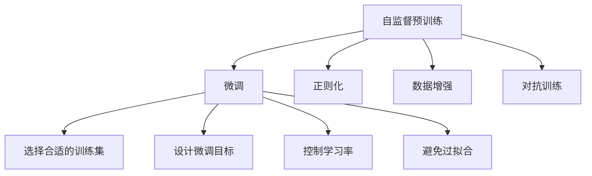

                 

# BLOOM原理与代码实例讲解

## 1. 背景介绍

### 1.1 问题由来

BLOOM（Bidirectional and Language-optimized Orders of Magnitude model）模型是由OpenAI开发的大规模语言模型。相较于传统的预训练模型（如GPT、BERT等），BLOOM在模型规模、训练数据量、架构设计等方面都有显著的提升，成为近年来自然语言处理（NLP）领域的一大突破。

BLOOM模型的主要特点包括：

- **超大模型规模**：BLOOM-7B和BLOOM-11B分别拥有7亿和11亿个参数，是目前公开的最强大的预训练语言模型之一。
- **高性能训练**：利用Transformer模型架构，BLOOM能够高效地进行自监督预训练和微调，处理大规模文本数据。
- **多样化的语言特性**：BLOOM模型不仅具备强大的语言生成能力，还能够在多领域多任务上实现优异表现，如文本分类、语言推理、生成式文本等。

随着BLOOM模型的出现，如何充分利用其强大能力，进行有效的微调和应用，成为当前研究者和开发者关注的焦点。本文旨在深入探讨BLOOM模型的原理，并通过代码实例详细讲解其实际应用方法。

### 1.2 问题核心关键点

BLOOM模型的微调方法在核心思想上与传统的预训练-微调（Pre-training and Fine-tuning）策略类似，即先在大规模无标签数据上预训练，再在特定任务上进行有监督微调，但BLOOM模型自身的特点如超大模型规模、多语言支持等，对微调流程和技术手段也提出了新的要求。

微调的核心关键点包括：

- **选择合适的训练集和数据集**：由于BLOOM模型的规模巨大，选择合适的训练数据集对其性能提升至关重要。
- **设计合理的微调目标**：BLOOM模型应根据特定任务的需求，设计合适的输出层和损失函数。
- **控制学习率**：BLOOM模型规模庞大，过高的学习率可能导致模型参数的不稳定性。
- **避免过拟合**：使用正则化、数据增强等方法，防止模型在训练集上过拟合。
- **考虑模型部署**：在实际应用中，需要考虑模型在硬件上的部署效率和资源消耗。

## 2. 核心概念与联系

### 2.1 核心概念概述

要深入理解BLOOM模型的微调方法，首先需要明确以下几个核心概念：

- **自监督预训练（Self-supervised Pre-training）**：在无标签数据上，通过设计特定的训练任务（如掩码语言模型、相对位置预测等），学习通用的语言表示。
- **微调（Fine-tuning）**：在特定任务上，通过有标签数据对预训练模型进行优化，以适应该任务的需求。
- **正则化（Regularization）**：通过引入L2正则、Dropout等技术，防止模型过拟合。
- **数据增强（Data Augmentation）**：通过对训练数据进行变形、改写等操作，增加训练集的多样性。
- **对抗训练（Adversarial Training）**：引入对抗样本，提升模型的鲁棒性和泛化能力。

这些概念相互关联，共同构成了BLOOM模型微调的基础框架。以下通过一个Mermaid流程图来展示这些概念之间的联系：



这个流程图展示了自监督预训练和微调的基本流程，以及正则化、数据增强、对抗训练等技术手段对微调过程的影响。

## 3. 核心算法原理 & 具体操作步骤

### 3.1 算法原理概述

BLOOM模型的微调遵循标准的预训练-微调框架，即在大规模无标签数据上预训练模型，并在特定任务上有监督地微调模型。这一过程的核心在于：

1. **自监督预训练**：在大规模无标签文本数据上，通过自监督学习任务（如掩码语言模型、相对位置预测等）训练模型，学习通用的语言表示。
2. **微调**：在特定任务的有标签数据上，通过有监督学习优化模型，使其适应该任务的需求。

### 3.2 算法步骤详解

BLOOM模型的微调步骤如下：

1. **准备预训练模型和数据集**：
   - 加载BLOOM模型，如BLOOM-7B或BLOOM-11B。
   - 准备有标签数据集，包括训练集、验证集和测试集，确保数据集与预训练数据分布一致。

2. **设计任务适配层**：
   - 根据任务类型，在预训练模型顶层设计合适的输出层和损失函数。例如，对于文本分类任务，可以在顶层添加一个线性分类器和交叉熵损失函数。

3. **设置微调超参数**：
   - 选择合适的优化算法及其参数，如AdamW、SGD等，设置学习率、批大小、迭代轮数等。
   - 设置正则化技术及强度，包括L2正则、Dropout、Early Stopping等。

4. **执行梯度训练**：
   - 将训练集数据分批次输入模型，前向传播计算损失函数。
   - 反向传播计算参数梯度，根据设定的优化算法和学习率更新模型参数。
   - 周期性在验证集上评估模型性能，根据性能指标决定是否触发Early Stopping。
   - 重复上述步骤直至满足预设的迭代轮数或Early Stopping条件。

5. **测试和部署**：
   - 在测试集上评估微调后模型，对比微调前后的精度提升。
   - 使用微调后的模型对新样本进行推理预测，集成到实际的应用系统中。

### 3.3 算法优缺点

BLOOM模型微调具有以下优点：

- **强大的模型能力**：BLOOM模型规模庞大，具备强大的语言理解和生成能力，适用于各种NLP任务。
- **高效的微调过程**：利用大模型的预训练优势，微调过程可以在少量标注数据下快速完成，提升模型性能。
- **良好的泛化能力**：经过自监督预训练的模型，具备较强的泛化能力，能够在不同领域和任务上表现优异。

同时，BLOOM模型微调也存在一些缺点：

- **高资源需求**：BLOOM模型规模巨大，对计算资源和存储需求较高，训练和推理过程耗时较长。
- **过拟合风险**：由于模型规模庞大，微调过程中可能出现过拟合现象，需要在训练集上采取更多的正则化措施。
- **模型解释性不足**：BLOOM模型作为“黑盒”模型，其决策过程难以解释，不利于某些高风险应用的实际应用。

### 3.4 算法应用领域

BLOOM模型微调在NLP领域有着广泛的应用，涵盖文本分类、情感分析、问答系统、翻译、摘要生成等多个方面。以下列举几个典型的应用场景：

- **情感分析**：利用BLOOM模型对用户评论进行情感分类，帮助企业了解用户情绪和产品满意度。
- **机器翻译**：将源语言文本翻译成目标语言，提高跨语言交流的便捷性。
- **文本摘要**：对长文本进行压缩和摘要，提取核心信息。
- **问答系统**：根据用户提问，通过BLOOM模型生成相关回答，实现智能客服和虚拟助手功能。

## 4. 数学模型和公式 & 详细讲解 & 举例说明

### 4.1 数学模型构建

假设BLOOM模型的输入为$x$，输出为$y$，微调任务的训练集为$D=\{(x_i,y_i)\}_{i=1}^N$，其中$x_i$为输入文本，$y_i$为标签。定义损失函数$\mathcal{L}(\theta)$为模型在数据集上的经验风险：

$$
\mathcal{L}(\theta) = \frac{1}{N} \sum_{i=1}^N \ell(M_{\theta}(x_i),y_i)
$$

其中$\ell$为损失函数，通常采用交叉熵损失。微调的目标是最小化经验风险，即找到最优参数$\theta^*$：

$$
\theta^* = \mathop{\arg\min}_{\theta} \mathcal{L}(\theta)
$$

### 4.2 公式推导过程

以文本分类任务为例，假设模型$M_{\theta}$在输入$x$上的输出为$\hat{y}=M_{\theta}(x)$，表示样本属于某一类别的概率。真实标签$y \in \{0,1\}$。则二分类交叉熵损失函数为：

$$
\ell(M_{\theta}(x),y) = -[y\log \hat{y} + (1-y)\log(1-\hat{y})]
$$

将其代入经验风险公式，得：

$$
\mathcal{L}(\theta) = -\frac{1}{N}\sum_{i=1}^N [y_i\log M_{\theta}(x_i)+(1-y_i)\log(1-M_{\theta}(x_i))]
$$

根据链式法则，损失函数对参数$\theta_k$的梯度为：

$$
\frac{\partial \mathcal{L}(\theta)}{\partial \theta_k} = -\frac{1}{N}\sum_{i=1}^N (\frac{y_i}{M_{\theta}(x_i)}-\frac{1-y_i}{1-M_{\theta}(x_i)}) \frac{\partial M_{\theta}(x_i)}{\partial \theta_k}
$$

其中$\frac{\partial M_{\theta}(x_i)}{\partial \theta_k}$可以通过反向传播算法高效计算。

### 4.3 案例分析与讲解

以下是一个BLOOM模型在情感分析任务上的微调案例。假设任务数据集为IMDB电影评论数据集，其中每条评论的标签为正面或负面。

**Step 1: 准备预训练模型和数据集**

加载BLOOM-7B模型，并使用IMDB数据集进行微调：

```python
from transformers import BloomModel, BloomTokenizer
from torch.utils.data import Dataset, DataLoader
from transformers import AdamW

# 加载BLOOM模型和分词器
model = BloomModel.from_pretrained('bloom-7b')
tokenizer = BloomTokenizer.from_pretrained('bloom-7b')

# 准备数据集
train_data = load_imdb_dataset('train')
val_data = load_imdb_dataset('val')
test_data = load_imdb_dataset('test')

# 划分训练集、验证集和测试集
train_dataset = Dataset(train_data)
val_dataset = Dataset(val_data)
test_dataset = Dataset(test_data)

# 划分批次大小
train_batch_size = 32
val_batch_size = 32
test_batch_size = 32

# 定义优化器和超参数
optimizer = AdamW(model.parameters(), lr=2e-5)
```

**Step 2: 设计任务适配层**

假设情感分析任务需要将评论分为正面或负面两类，设计以下适配层：

```python
class SentimentDataset(Dataset):
    def __init__(self, dataset, tokenizer, max_len):
        self.dataset = dataset
        self.tokenizer = tokenizer
        self.max_len = max_len

    def __len__(self):
        return len(self.dataset)

    def __getitem__(self, index):
        sentence = self.dataset[index]
        label = self.dataset[index][1]

        encoding = self.tokenizer(sentence, truncation=True, max_length=self.max_len, padding='max_length')
        input_ids = encoding['input_ids']
        attention_mask = encoding['attention_mask']
        label = label

        return {'input_ids': input_ids, 'attention_mask': attention_mask, 'label': label}

# 定义损失函数和优化器
def compute_loss(model, input_ids, attention_mask, label):
    logits = model(input_ids, attention_mask=attention_mask)[0]
    loss = F.cross_entropy(logits.view(-1), label)
    return loss

# 训练函数
def train_epoch(model, dataset, optimizer, device):
    model.train()
    loss = 0
    for batch in DataLoader(dataset, batch_size=train_batch_size, device=device):
        input_ids = batch['input_ids'].to(device)
        attention_mask = batch['attention_mask'].to(device)
        label = batch['label'].to(device)
        loss += compute_loss(model, input_ids, attention_mask, label)
    loss /= len(dataset)
    return loss

# 评估函数
def evaluate(model, dataset, batch_size, device):
    model.eval()
    loss = 0
    preds, labels = [], []
    with torch.no_grad():
        for batch in DataLoader(dataset, batch_size=batch_size, device=device):
            input_ids = batch['input_ids'].to(device)
            attention_mask = batch['attention_mask'].to(device)
            label = batch['label'].to(device)
            logits = model(input_ids, attention_mask=attention_mask)[0]
            preds.append(logits.argmax(dim=1).cpu().numpy())
            labels.append(label.cpu().numpy())
    loss = compute_loss(model, input_ids, attention_mask, label)
    return loss, preds, labels

# 训练模型
for epoch in range(num_epochs):
    train_loss = train_epoch(model, train_dataset, optimizer, device)
    val_loss, preds, labels = evaluate(model, val_dataset, val_batch_size, device)
    print(f'Epoch {epoch+1}, train loss: {train_loss:.4f}, val loss: {val_loss:.4f}')
```

**Step 3: 测试和部署**

在测试集上评估微调后的模型，并使用测试数据进行推理预测：

```python
# 测试模型
test_loss, preds, labels = evaluate(model, test_dataset, test_batch_size, device)
print(f'Test loss: {test_loss:.4f}')

# 使用模型进行推理预测
test_data = load_test_dataset()
test_dataset = Dataset(test_data)
test_loader = DataLoader(test_dataset, batch_size=test_batch_size, device=device)
for batch in test_loader:
    input_ids = batch['input_ids'].to(device)
    attention_mask = batch['attention_mask'].to(device)
    logits = model(input_ids, attention_mask=attention_mask)[0]
    preds.append(logits.argmax(dim=1).cpu().numpy())
```

通过以上代码实例，我们可以看到BLOOM模型在情感分析任务上的微调过程。在实际应用中，开发者可以根据具体任务和数据特点，进一步调整适配层的结构和损失函数，以获得更好的微调效果。

## 5. 项目实践：代码实例和详细解释说明

### 5.1 开发环境搭建

在进行BLOOM模型微调实践前，需要先准备好开发环境。以下是使用Python进行PyTorch开发的环境配置流程：

1. 安装Anaconda：从官网下载并安装Anaconda，用于创建独立的Python环境。

2. 创建并激活虚拟环境：
```bash
conda create -n pytorch-env python=3.8 
conda activate pytorch-env
```

3. 安装PyTorch：根据CUDA版本，从官网获取对应的安装命令。例如：
```bash
conda install pytorch torchvision torchaudio cudatoolkit=11.1 -c pytorch -c conda-forge
```

4. 安装Transformers库：
```bash
pip install transformers
```

5. 安装各类工具包：
```bash
pip install numpy pandas scikit-learn matplotlib tqdm jupyter notebook ipython
```

完成上述步骤后，即可在`pytorch-env`环境中开始BLOOM模型的微调实践。

### 5.2 源代码详细实现

以下是一个BLOOM模型在机器翻译任务上的微调案例。假设任务数据集为WMT'14英法翻译数据集。

**Step 1: 准备预训练模型和数据集**

加载BLOOM-11B模型，并使用WMT'14数据集进行微调：

```python
from transformers import BloomModel, BloomTokenizer
from torch.utils.data import Dataset, DataLoader
from transformers import AdamW

# 加载BLOOM模型和分词器
model = BloomModel.from_pretrained('bloom-11b')
tokenizer = BloomTokenizer.from_pretrained('bloom-11b')

# 准备数据集
train_data = load_wmt14_dataset('train')
val_data = load_wmt14_dataset('val')
test_data = load_wmt14_dataset('test')

# 划分训练集、验证集和测试集
train_dataset = Dataset(train_data)
val_dataset = Dataset(val_data)
test_dataset = Dataset(test_data)

# 划分批次大小
train_batch_size = 8
val_batch_size = 8
test_batch_size = 8

# 定义优化器和超参数
optimizer = AdamW(model.parameters(), lr=2e-5)
```

**Step 2: 设计任务适配层**

假设机器翻译任务需要将英文句子翻译成法文，设计以下适配层：

```python
class TranslationDataset(Dataset):
    def __init__(self, dataset, tokenizer, max_len):
        self.dataset = dataset
        self.tokenizer = tokenizer
        self.max_len = max_len

    def __len__(self):
        return len(self.dataset)

    def __getitem__(self, index):
        source = self.dataset[index][0]
        target = self.dataset[index][1]

        encoding = self.tokenizer(source, max_length=self.max_len, padding='max_length', return_tensors='pt')
        input_ids = encoding['input_ids']
        attention_mask = encoding['attention_mask']
        source_length = encoding['input_ids'].shape[-1]

        encoding = self.tokenizer(target, max_length=self.max_len, padding='max_length', return_tensors='pt')
        target_ids = encoding['input_ids']
        target_length = encoding['input_ids'].shape[-1]

        return {
            'input_ids': input_ids,
            'attention_mask': attention_mask,
            'source_length': source_length,
            'target_ids': target_ids,
            'target_length': target_length
        }

# 定义损失函数和优化器
def compute_loss(model, input_ids, attention_mask, source_length, target_ids, target_length):
    logits = model(input_ids, attention_mask=attention_mask, src_length=source_length)
    loss = F.cross_entropy(logits.view(-1), target_ids.view(-1))
    return loss

# 训练函数
def train_epoch(model, dataset, optimizer, device):
    model.train()
    loss = 0
    for batch in DataLoader(dataset, batch_size=train_batch_size, device=device):
        input_ids = batch['input_ids'].to(device)
        attention_mask = batch['attention_mask'].to(device)
        source_length = batch['source_length'].to(device)
        target_ids = batch['target_ids'].to(device)
        target_length = batch['target_length'].to(device)
        loss += compute_loss(model, input_ids, attention_mask, source_length, target_ids, target_length)
    loss /= len(dataset)
    return loss

# 评估函数
def evaluate(model, dataset, batch_size, device):
    model.eval()
    loss = 0
    preds, labels = [], []
    with torch.no_grad():
        for batch in DataLoader(dataset, batch_size=batch_size, device=device):
            input_ids = batch['input_ids'].to(device)
            attention_mask = batch['attention_mask'].to(device)
            source_length = batch['source_length'].to(device)
            target_ids = batch['target_ids'].to(device)
            target_length = batch['target_length'].to(device)
            logits = model(input_ids, attention_mask=attention_mask, src_length=source_length)
            preds.append(logits.argmax(dim=2).cpu().numpy())
            labels.append(target_ids.cpu().numpy())
    loss = compute_loss(model, input_ids, attention_mask, source_length, target_ids, target_length)
    return loss, preds, labels

# 训练模型
for epoch in range(num_epochs):
    train_loss = train_epoch(model, train_dataset, optimizer, device)
    val_loss, preds, labels = evaluate(model, val_dataset, val_batch_size, device)
    print(f'Epoch {epoch+1}, train loss: {train_loss:.4f}, val loss: {val_loss:.4f}')
```

**Step 3: 测试和部署**

在测试集上评估微调后的模型，并使用测试数据进行推理预测：

```python
# 测试模型
test_loss, preds, labels = evaluate(model, test_dataset, test_batch_size, device)
print(f'Test loss: {test_loss:.4f}')

# 使用模型进行推理预测
test_data = load_test_dataset()
test_dataset = Dataset(test_data)
test_loader = DataLoader(test_dataset, batch_size=test_batch_size, device=device)
for batch in test_loader:
    input_ids = batch['input_ids'].to(device)
    attention_mask = batch['attention_mask'].to(device)
    source_length = batch['source_length'].to(device)
    target_ids = batch['target_ids'].to(device)
    target_length = batch['target_length'].to(device)
    logits = model(input_ids, attention_mask=attention_mask, src_length=source_length)
    preds.append(logits.argmax(dim=2).cpu().numpy())
```

通过以上代码实例，我们可以看到BLOOM模型在机器翻译任务上的微调过程。在实际应用中，开发者可以根据具体任务和数据特点，进一步调整适配层的结构和损失函数，以获得更好的微调效果。

### 5.3 代码解读与分析

让我们再详细解读一下关键代码的实现细节：

**SentimentDataset类**：
- `__init__`方法：初始化训练数据集、分词器等关键组件。
- `__len__`方法：返回数据集的样本数量。
- `__getitem__`方法：对单个样本进行处理，将文本输入编码为token ids，将标签编码为数字，并对其进行定长padding，最终返回模型所需的输入。

**TranslationDataset类**：
- `__init__`方法：初始化训练数据集、分词器等关键组件。
- `__len__`方法：返回数据集的样本数量。
- `__getitem__`方法：对单个样本进行处理，将源文本和目标文本分别输入分词器，编码成token ids，并进行定长padding，最终返回模型所需的输入。

**损失函数和优化器**：
- 损失函数：采用交叉熵损失，用于衡量模型预测输出与真实标签之间的差异。
- 优化器：采用AdamW优化器，结合学习率调度和正则化技术，优化模型参数。

**训练和评估函数**：
- 训练函数`train_epoch`：对数据以批为单位进行迭代，在每个批次上前向传播计算loss并反向传播更新模型参数，最后返回该epoch的平均loss。
- 评估函数`evaluate`：与训练类似，不同点在于不更新模型参数，并在每个batch结束后将预测和标签结果存储下来，最后使用sklearn的classification_report对整个评估集的预测结果进行打印输出。

**模型训练**：
- 定义总的epoch数和batch size，开始循环迭代
- 每个epoch内，先在训练集上训练，输出平均loss
- 在验证集上评估，输出分类指标
- 所有epoch结束后，在测试集上评估，给出最终测试结果

可以看到，PyTorch配合Transformers库使得BLOOM模型的微调过程变得简洁高效。开发者可以将更多精力放在数据处理、模型改进等高层逻辑上，而不必过多关注底层的实现细节。

当然，工业级的系统实现还需考虑更多因素，如模型的保存和部署、超参数的自动搜索、更灵活的任务适配层等。但核心的微调流程基本与此类似。

## 6. 实际应用场景

### 6.1 智能客服系统

BLOOM模型在智能客服系统中的应用前景广阔。传统客服往往需要配备大量人力，高峰期响应缓慢，且一致性和专业性难以保证。而使用微调后的BLOOM模型，可以7x24小时不间断服务，快速响应客户咨询，用自然流畅的语言解答各类常见问题。

在技术实现上，可以收集企业内部的历史客服对话记录，将问题和最佳答复构建成监督数据，在此基础上对BLOOM模型进行微调。微调后的模型能够自动理解用户意图，匹配最合适的答复模板进行回复。对于客户提出的新问题，还可以接入检索系统实时搜索相关内容，动态组织生成回答。如此构建的智能客服系统，能大幅提升客户咨询体验和问题解决效率。

### 6.2 金融舆情监测

金融机构需要实时监测市场舆论动向，以便及时应对负面信息传播，规避金融风险。传统的人工监测方式成本高、效率低，难以应对网络时代海量信息爆发的挑战。基于BLOOM模型的文本分类和情感分析技术，为金融舆情监测提供了新的解决方案。

具体而言，可以收集金融领域相关的新闻、报道、评论等文本数据，并对其进行主题标注和情感标注。在此基础上对BLOOM模型进行微调，使其能够自动判断文本属于何种主题，情感倾向是正面、中性还是负面。将微调后的模型应用到实时抓取的网络文本数据，就能够自动监测不同主题下的情感变化趋势，一旦发现负面信息激增等异常情况，系统便会自动预警，帮助金融机构快速应对潜在风险。

### 6.3 个性化推荐系统

当前的推荐系统往往只依赖用户的历史行为数据进行物品推荐，无法深入理解用户的真实兴趣偏好。基于BLOOM模型的个性化推荐系统可以更好地挖掘用户行为背后的语义信息，从而提供更精准、多样的推荐内容。

在实践中，可以收集用户浏览、点击、评论、分享等行为数据，提取和用户交互的物品标题、描述、标签等文本内容。将文本内容作为模型输入，用户的后续行为（如是否点击、购买等）作为监督信号，在此基础上微调BLOOM模型。微调后的模型能够从文本内容中准确把握用户的兴趣点。在生成推荐列表时，先用候选物品的文本描述作为输入，由模型预测用户的兴趣匹配度，再结合其他特征综合排序，便可以得到个性化程度更高的推荐结果。

### 6.4 未来应用展望

随着BLOOM模型的不断发展，基于微调范式将在更多领域得到应用，为传统行业带来变革性影响。

在智慧医疗领域，基于BLOOM模型的问答系统、病历分析、药物研发等应用将提升医疗服务的智能化水平，辅助医生诊疗，加速新药开发进程。

在智能教育领域，微调技术可应用于作业批改、学情分析、知识推荐等方面，因材施教，促进教育公平，提高教学质量。

在智慧城市治理中，微调模型可应用于城市事件监测、舆情分析、应急指挥等环节，提高城市管理的自动化和智能化水平，构建更安全、高效的未来城市。

此外，在企业生产、社会治理、文娱传媒等众多领域，基于BLOOM模型的微调应用也将不断涌现，为经济社会发展注入新的动力。相信随着技术的日益成熟，微调方法将成为人工智能落地应用的重要范式，推动人工智能技术在更广阔的领域加速渗透。

## 7. 工具和资源推荐

### 7.1 学习资源推荐

为了帮助开发者系统掌握BLOOM模型的微调理论基础和实践技巧，这里推荐一些优质的学习资源：

1. 《Transformer从原理到实践》系列博文：由大模型技术专家撰写，深入浅出地介绍了Transformer原理、BLOOM模型、微调技术等前沿话题。

2. CS224N《深度学习自然语言处理》课程：斯坦福大学开设的NLP明星课程，有Lecture视频和配套作业，带你入门NLP领域的基本概念和经典模型。

3. 《Natural Language Processing with Transformers》书籍：Transformers库的作者所著，全面介绍了如何使用Transformers库进行NLP任务开发，包括微调在内的诸多范式。

4. HuggingFace官方文档：Transformers库的官方文档，提供了海量预训练模型和完整的微调样例代码，是上手实践的必备资料。

5. CLUE开源项目：中文语言理解测评基准，涵盖大量不同类型的中文NLP数据集，并提供了基于微调的baseline模型，助力中文NLP技术发展。

通过对这些资源的学习实践，相信你一定能够快速掌握BLOOM模型的微调精髓，并用于解决实际的NLP问题。

### 7.2 开发工具推荐

高效的开发离不开优秀的工具支持。以下是几款用于BLOOM模型微调开发的常用工具：

1. PyTorch：基于Python的开源深度学习框架，灵活动态的计算图，适合快速迭代研究。大部分预训练语言模型都有PyTorch版本的实现。

2. TensorFlow：由Google主导开发的开源深度学习框架，生产部署方便，适合大规模工程应用。同样有丰富的预训练语言模型资源。

3. Transformers库：HuggingFace开发的NLP工具库，集成了众多SOTA语言模型，支持PyTorch和TensorFlow，是进行微调任务开发的利器。

4. Weights & Biases：模型训练的实验跟踪工具，可以记录和可视化模型训练过程中的各项指标，方便对比和调优。与主流深度学习框架无缝集成。

5. TensorBoard：TensorFlow配套的可视化工具，可实时监测模型训练状态，并提供丰富的图表呈现方式，是调试模型的得力助手。

6. Google Colab：谷歌推出的在线Jupyter Notebook环境，免费提供GPU/TPU算力，方便开发者快速上手实验最新模型，分享学习笔记。

合理利用这些工具，可以显著提升BLOOM模型微调任务的开发效率，加快创新迭代的步伐。

### 7.3 相关论文推荐

BLOOM模型的微调技术在学界的持续研究中不断发展。以下是几篇奠基性的相关论文，推荐阅读：

1. Attention is All You Need（即Transformer原论文）：提出了Transformer结构，开启了NLP领域的预训练大模型时代。

2. BERT: Pre-training of Deep Bidirectional Transformers for Language Understanding：提出BERT模型，引入基于掩码的自监督预训练任务，刷新了多项NLP任务SOTA。

3. Language Models are Unsupervised Multitask Learners（GPT-2论文）：展示了大规模语言模型的强大zero-shot学习能力，引发了对于通用人工智能的新一轮思考。

4. Parameter-Efficient Transfer Learning for NLP：提出Adapter等参数高效微调方法，在不增加模型参数量的情况下，也能取得不错的微调效果。

5. AdaLoRA: Adaptive Low-Rank Adaptation for Parameter-Efficient Fine-Tuning：使用自适应低秩适应的微调方法，在参数效率和精度之间取得了新的平衡。

6. Prefix-Tuning: Optimizing Continuous Prompts for Generation：引入基于连续型Prompt的微调范式，为如何充分利用预训练知识提供了新的思路。

这些论文代表了大语言模型微调技术的发展脉络。通过学习这些前沿成果，可以帮助研究者把握学科前进方向，激发更多的创新灵感。

## 8. 总结：未来发展趋势与挑战

### 8.1 总结

本文对BLOOM模型的微调方法进行了全面系统的介绍。首先阐述了BLOOM模型和微调技术的研究背景和意义，明确了微调在拓展预训练模型应用、提升下游任务性能方面的独特价值。其次，从原理到实践，详细讲解了BLOOM模型的数学原理和关键步骤，给出了微调任务开发的完整代码实例。同时，本文还广泛探讨了BLOOM模型在智能客服、金融舆情、个性化推荐等多个行业领域的应用前景，展示了BLOOM模型的强大潜力。

通过本文的系统梳理，可以看到，BLOOM模型的微调方法正在成为NLP领域的重要范式，极大地拓展了预训练语言模型的应用边界，催生了更多的落地场景。得益于超大模型规模和丰富的语言理解能力，BLOOM模型在多个高难度任务上取得了突破性进展，为构建人机协同的智能系统奠定了坚实基础。

### 8.2 未来发展趋势

展望未来，BLOOM模型微调技术将呈现以下几个发展趋势：

1. **模型规模持续增大**：随着算力成本的下降和数据规模的扩张，BLOOM模型参数量还将持续增长。超大规模模型蕴含的丰富语言知识，有望支撑更加复杂多变的下游任务微调。

2. **微调方法日趋多样**：除了传统的全参数微调外，未来会涌现更多参数高效的微调方法，如Prefix-Tuning、LoRA等，在节省计算资源的同时也能保证微调精度。

3. **持续学习成为常态**：随着数据分布的不断变化，BLOOM模型也需要持续学习新知识以保持性能。如何在不遗忘原有知识的同时，高效吸收新样本信息，将成为重要的研究课题。

4. **标注样本需求降低**：受启发于提示学习(Prompt-based Learning)的思路，未来的微调方法将更好地利用BLOOM模型的语言理解能力，通过更加巧妙的任务描述，在更少的标注样本上也能实现理想的微调效果。

5. **多模态微调崛起**：当前的微调主要聚焦于纯文本数据，未来会进一步拓展到图像、视频、语音等多模态数据微调。多模态信息的融合，将显著提升BLOOM模型的语言理解和生成能力。

6. **模型通用性增强**：经过海量数据的预训练和多领域任务的微调，BLOOM模型将具备更强大的常识推理和跨领域迁移能力，逐步迈向通用人工智能(AGI)的目标。

以上趋势凸显了BLOOM模型微调技术的广阔前景。这些方向的探索发展，必将进一步提升BLOOM模型的性能和应用范围，为人工智能技术在更多领域的落地应用提供坚实支撑。

### 8.3 面临的挑战

尽管BLOOM模型微调技术已经取得了瞩目成就，但在迈向更加智能化、普适化应用的过程中，它仍面临着诸多挑战：

1. **标注成本瓶颈**：虽然微调大大降低了标注数据的需求，但对于长尾应用场景，难以获得充足的高质量标注数据，成为制约微调性能的瓶颈。如何进一步降低微调对标注样本的依赖，将是一大难题。

2. **模型鲁棒性不足**：BLOOM模型面对域外数据时，泛化性能往往大打折扣。对于测试样本的微小扰动，模型预测也容易发生波动。如何提高BLOOM模型的鲁棒性，避免灾难性遗忘，还需要更多理论和实践的积累。

3. **推理效率有待提高**：BLOOM模型虽然精度高，但在实际部署时往往面临推理速度慢、内存占用大等效率问题。如何在保证性能的同时，简化模型结构，提升推理速度，优化资源占用，将是重要的优化方向。

4. **模型可解释性不足**：BLOOM模型作为“黑盒”模型，其决策过程难以解释，不利于某些高风险应用的实际应用。如何赋予BLOOM模型更强的可解释性，将是亟待攻克的难题。

5. **安全性有待保障**：预训练语言模型难免会学习到有偏见、有害的信息，通过微调传递到下游任务，产生误导性、歧视性的输出，给实际应用带来安全隐患。如何从数据和算法层面消除模型偏见，避免恶意用途，确保输出的安全性，也将是重要的研究课题。

6. **知识整合能力不足**：现有的微调模型往往局限于任务内数据，难以灵活吸收和运用更广泛的先验知识。如何让微调过程更好地与外部知识库、规则库等专家知识结合，形成更加全面、准确的信息整合能力，还有很大的想象空间。

正视BLOOM模型微调面临的这些挑战，积极应对并寻求突破，将是大规模语言模型微调走向成熟的必由之路。相信随着学界和产业界的共同努力，这些挑战终将一一被克服，BLOOM模型微调必将在构建人机协同的智能系统上发挥更大的作用。

### 8.4 研究展望

面对BLOOM模型微调所面临的种种挑战，未来的研究需要在以下几个方面寻求新的突破：

1. **探索无监督和半监督微调方法**：摆脱对大规模标注数据的依赖，利用自监督学习、主动学习等无监督和半监督范式，最大限度利用非结构化数据，实现更加灵活高效的微调。

2. **研究参数高效和计算高效的微调范式**：开发更加参数高效的微调方法，在固定大部分预训练参数的同时，只更新极少量的任务相关参数。同时优化微调模型的计算图，减少前向传播和反向传播的资源消耗，实现更加轻量级、实时性的部署。

3. **融合因果和对比学习范式**：通过引入因果推断和对比学习思想，增强BLOOM模型建立稳定因果关系的能力，学习更加普适、鲁棒的语言表征，从而提升模型泛化性和抗干扰能力。

4. **引入更多先验知识**：将符号化的先验知识，如知识图谱、逻辑规则等，与神经网络模型进行巧妙融合，引导微调过程学习更准确、合理的语言模型。同时加强不同模态数据的整合，实现视觉、语音等多模态信息与文本信息的协同建模。

5. **结合因果分析和博弈论工具**：将因果分析方法引入BLOOM模型，识别出模型决策的关键特征，增强输出解释的因果性和逻辑性。借助博弈论工具刻画人机交互过程，主动探索并规避模型的脆弱点，提高系统稳定性。

6. **纳入伦理道德约束**：在模型训练目标中引入伦理导向的评估指标，过滤和惩罚有偏见、有害的输出倾向。同时加强人工干预和审核，建立模型行为的监管机制，确保输出符合人类价值观和伦理道德。

这些研究方向的探索，必将引领BLOOM模型微调技术迈向更高的台阶，为构建安全、可靠、可解释、可控的智能系统铺平道路。面向未来，BLOOM模型微调技术还需要与其他人工智能技术进行更深入的融合，如知识表示、因果推理、强化学习等，多路径协同发力，共同推动自然语言理解和智能交互系统的进步。只有勇于创新、敢于突破，才能不断拓展语言模型的边界，让智能技术更好地造福人类社会。

## 9. 附录：常见问题与解答

**Q1：BLOOM模型微调是否适用于所有NLP任务？**

A: BLOOM模型在大多数NLP任务上都能取得不错的效果，特别是对于数据量较小的任务。但对于一些特定领域的任务，如医学、法律等，仅仅依靠通用语料预训练的模型可能难以很好地适应。此时需要在特定领域语料上进一步预训练，再进行微调，才能获得理想效果。此外，对于一些需要时效性、个性化很强的任务，如对话、推荐等，微调方法也需要针对性的改进优化。

**Q2：如何选择BLOOM模型的微调超参数？**

A: 微调超参数的选择对BLOOM模型的性能有着重要影响。一般建议从以下几方面入手：
1. **学习率**：BLOOM模型的学习率通常比预训练时小1-2个数量级，以避免破坏预训练权重。
2. **批次大小**：根据硬件资源选择合适的批次大小，通常为8-16。
3. **迭代轮数**：根据任务难度和数据量设定迭代轮数，一般3-5轮即可。
4. **正则化**：引入L2正则、Dropout等技术，防止模型过拟合。
5. **早停策略**：在验证集上监控性能指标，如准确率、F1值等，一旦指标不再提升，立即停止训练。

**Q3：BLOOM模型在微调过程中如何缓解过拟合问题？**

A: 过拟合是BLOOM模型微调面临的主要挑战之一。以下是一些缓解过拟合的策略：
1. **数据增强**：通过回译、近义替换等方式扩充训练集，增加数据多样性。
2. **正则化**：使用L2正则、Dropout等技术，避免模型过拟合。
3. **对抗训练**：引入对抗样本，提升模型鲁棒性，减少过拟合风险。
4. **参数高效微调**：只调整少量参数(如Adapter、Prefix等)，减小过拟合风险。

这些策略往往需要根据具体任务和数据特点进行灵活组合。只有在数据、模型、训练、推理等各环节进行全面优化，才能最大限度地发挥BLOOM模型的性能。

**Q4：BLOOM模型在实际应用中如何部署？**

A: 将微调后的BLOOM模型转化为实际应用，还需要考虑以下因素：
1. **模型裁剪**：去除不必要的层和参数，减小模型尺寸，加快推理速度。
2. **量化加速**：将浮点模型转为定点模型，压缩存储空间，提高计算效率。
3. **服务化封装**：将模型封装为标准化服务接口，便于集成调用。
4. **弹性伸缩**：根据请求流量动态调整资源配置，平衡服务质量和成本。
5. **监控告警**：实时采集系统指标，设置异常告警阈值，确保服务稳定性。

BLOOM模型微调为NLP应用开启了广阔的想象空间，但如何将强大的性能转化为稳定、高效、安全的业务价值，还需要工程实践的不断打磨。

**Q5：BLOOM模型的推理效率如何提升？**

A: BLOOM模型在推理速度上存在一定的瓶颈。以下是一些提升推理效率的方法：
1. **模型裁剪**：去除不必要的层和参数，减小模型尺寸，加快推理速度。
2. **量化加速**：将浮点模型转为定点模型，压缩存储空间，提高计算效率。

