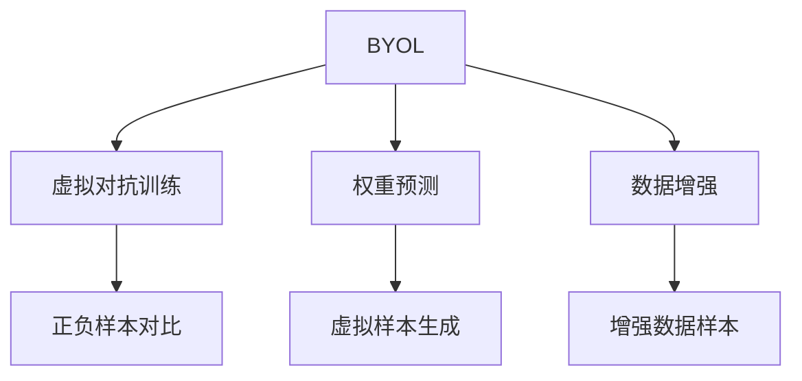

                 

# BYOL原理与代码实例讲解

> 关键词：BYOL,对比自监督,虚拟对抗训练,权重预测

## 1. 背景介绍

### 1.1 问题由来

近年来，自监督学习（Self-Supervised Learning）在计算机视觉、自然语言处理等领域取得了显著的进展，其中对比自监督学习（Contrastive Self-Supervised Learning），尤其以BYOL为代表的方法，成为推动自监督学习发展的重要驱动力。自监督学习的关键在于如何利用大量无标签数据，在不依赖人工标注的情况下，学习到有效的特征表示，从而实现无监督的模型预训练。

对比自监督学习通过设计一些无标签的预训练任务，利用数据自身的数据分布和关系，驱动模型学习到更加泛化、鲁棒的特征表示。例如，BYOL（Bootstrap Your Own Latent）提出了虚拟对抗训练（Virtual Adversarial Training），利用自身样本的虚拟正负样本之间的对比，实现无监督的模型预训练。

### 1.2 问题核心关键点

对比自监督学习范式，以BYOL为代表，通过对比学习（Contrastive Learning），利用正负样本的对比，增强模型的特征学习能力和泛化能力。其主要核心关键点包括：

- 虚拟对抗训练：通过对比自身样本的正负样本，使得模型可以自适应地学习到更好的特征表示。
- 权重预测（Momentum Weight Prediction）：利用模型预测自身样本的权重，进一步增强模型的对比学习效果。
- 数据增强：通过数据增强技术，扩大训练样本的多样性，提高模型的泛化能力。
- 泛化性能：在对比自监督学习中，模型的泛化性能往往取决于对比学习任务的设计。

这些核心概念共同构成了对比自监督学习的理论基础，为模型预训练提供了新的思路和方法。

## 2. 核心概念与联系

### 2.1 核心概念概述

为更好地理解BYOL的原理和实现方法，本节将介绍几个关键概念：

- BYOL（Bootstrap Your Own Latent）：一种基于对比学习的自监督学习方法，利用自身的虚拟样本进行无监督的预训练。
- 虚拟对抗训练（Virtual Adversarial Training）：一种自监督学习方法，通过对比自身样本的虚拟正负样本，实现无监督的模型预训练。
- 权重预测（Momentum Weight Prediction）：利用模型预测自身样本的权重，进一步增强模型的对比学习效果。
- 数据增强（Data Augmentation）：通过数据增强技术，扩大训练样本的多样性，提高模型的泛化能力。
- 泛化性能（Generalization Performance）：在对比自监督学习中，模型的泛化性能往往取决于对比学习任务的设计。

这些核心概念之间的逻辑关系可以通过以下Mermaid流程图来展示：



这个流程图展示了BYOL方法的核心概念及其之间的关系：

1. BYOL通过虚拟对抗训练和权重预测，利用自身样本进行无监督预训练。
2. 虚拟对抗训练通过对比自身样本的虚拟正负样本，增强模型的特征学习能力和泛化能力。
3. 权重预测利用模型预测自身样本的权重，进一步增强对比学习效果。
4. 数据增强通过扩大训练样本的多样性，提高模型的泛化能力。
5. 泛化性能通过对比学习任务的设计，提升模型的泛化性能。

这些概念共同构成了BYOL的预训练框架，使得模型可以自适应地学习到泛化能力强的特征表示。

## 3. 核心算法原理 & 具体操作步骤
### 3.1 算法原理概述

BYOL的核心思想是利用自身样本的虚拟正负样本进行对比学习，增强模型的特征学习能力和泛化能力。具体来说，其算法流程包括以下几个关键步骤：

1. 数据增强：通过对自身样本进行数据增强操作，生成虚拟正负样本。
2. 虚拟对抗训练：利用虚拟正负样本之间的对比，驱动模型学习到更好的特征表示。
3. 权重预测：利用模型预测自身样本的权重，进一步增强模型的对比学习效果。

通过上述步骤，BYOL能够在无监督的条件下，利用自身样本进行高质量的预训练，获得泛化能力强的特征表示。

### 3.2 算法步骤详解

以下是BYOL方法的具体实现步骤：

**Step 1: 数据增强**
- 对于每张输入图像，通过随机裁剪、旋转、颜色调整等操作，生成多个增强后的图像。
- 利用这些增强后的图像，生成虚拟正负样本。

**Step 2: 虚拟对抗训练**
- 将原始输入图像和生成的虚拟正负样本分别输入模型，得到对应的特征表示。
- 通过对比原始输入图像和虚拟正负样本的特征表示，计算交叉熵损失，用于优化模型参数。

**Step 3: 权重预测**
- 利用模型预测虚拟正负样本的权重，并将其作为训练目标。
- 通过优化模型预测的权重，进一步增强模型的对比学习效果。

### 3.3 算法优缺点

BYOL作为对比自监督学习方法，具有以下优点：

- 数据利用效率高：BYOL通过利用自身样本的虚拟正负样本进行对比学习，能够有效利用无标签数据进行模型预训练。
- 泛化性能好：通过虚拟对抗训练和权重预测，BYOL能够在无监督的条件下，学习到泛化能力强的特征表示。
- 计算效率高：BYOL使用虚拟样本进行训练，能够显著降低计算资源的需求。

同时，BYOL也存在一些缺点：

- 模型复杂度较高：虚拟正负样本的生成和对比学习需要额外的计算开销。
- 对数据增强依赖较大：BYOL的训练效果很大程度上依赖于数据增强策略的有效性。
- 泛化能力依赖对比任务设计：BYOL的泛化能力与对比学习任务的设计密切相关。

### 3.4 算法应用领域

BYOL的对比自监督学习方法，已经被广泛应用于计算机视觉和自然语言处理领域。以下是BYOL方法在实际应用中的几个典型应用场景：

- 图像分类：通过BYOL的对比学习，能够在无监督的条件下学习到泛化能力强的图像特征表示，提升图像分类的准确率。
- 目标检测：BYOL可以用于目标检测模型的预训练，学习到泛化能力强的特征表示，提升目标检测的效果。
- 文本生成：BYOL可以用于文本生成模型的预训练，学习到泛化能力强的语言特征表示，提升文本生成的效果。
- 语音识别：BYOL可以用于语音识别模型的预训练，学习到泛化能力强的音频特征表示，提升语音识别的准确率。

## 4. 数学模型和公式 & 详细讲解 & 举例说明

### 4.1 数学模型构建

BYOL的数学模型主要基于对比学习框架。其核心思想是通过对比自身样本的虚拟正负样本，增强模型的特征学习能力和泛化能力。假设模型为 $f_{\theta}(\cdot)$，对于每张输入图像 $x$，生成虚拟正负样本 $\{x_i^+\}_{i=1}^N$ 和 $\{x_i^-\}_{i=1}^N$，其中 $x_i^+$ 和 $x_i^-$ 分别表示原始输入图像 $x$ 的增强版本和反转版本。模型的对比损失函数为：

$$
L_{\text{BYOL}} = -\frac{1}{N}\sum_{i=1}^N \log \sigma (\frac{f_{\theta}(x) \cdot f_{\theta}(x_i^+)}{\sum_{j=1}^N f_{\theta}(x) \cdot f_{\theta}(x_j^+)})
$$

其中，$\sigma$ 为sigmoid函数，用于将对比结果映射到 $[0, 1]$ 区间。模型的权重预测损失函数为：

$$
L_{\text{Momentum}} = \frac{1}{2}\left(\|f_{\theta}(x) - \overline{f}_{\theta}(x)\|^2\right)
$$

其中，$\overline{f}_{\theta}(x)$ 为模型预测的自身样本 $x$ 的权重，可以通过一个移动平均器（如EMA）来实现。

### 4.2 公式推导过程

BYOL的数学模型推导基于对比学习框架，主要分为对比损失和权重预测损失两部分。以下分别进行详细推导：

**对比损失推导**
假设模型 $f_{\theta}(\cdot)$ 对于输入图像 $x$ 的特征表示为 $z = f_{\theta}(x)$。对于每张输入图像 $x_i^+$ 和 $x_i^-$，分别生成增强版本和反转版本。模型的对比损失函数为：

$$
L_{\text{BYOL}} = -\frac{1}{N}\sum_{i=1}^N \log \sigma (\frac{z \cdot f_{\theta}(x_i^+)}{\sum_{j=1}^N z \cdot f_{\theta}(x_j^+)})
$$

其中，$z$ 表示模型对输入图像 $x$ 的特征表示，$f_{\theta}(x_i^+)$ 和 $f_{\theta}(x_i^-)$ 分别表示模型对输入图像 $x_i^+$ 和 $x_i^-$ 的特征表示。$\sigma$ 为sigmoid函数，用于将对比结果映射到 $[0, 1]$ 区间。

**权重预测损失推导**
假设模型 $f_{\theta}(\cdot)$ 对于输入图像 $x$ 的特征表示为 $z = f_{\theta}(x)$。对于每张输入图像 $x_i$，生成虚拟正负样本 $x_i^+$ 和 $x_i^-$。模型的权重预测损失函数为：

$$
L_{\text{Momentum}} = \frac{1}{2}\left(\|z - \overline{z}\|^2\right)
$$

其中，$\overline{z}$ 表示模型预测的自身样本 $x$ 的权重，可以通过一个移动平均器（如EMA）来实现。

### 4.3 案例分析与讲解

以下以ImageNet数据集为例，解释BYOL方法的具体应用和效果。

ImageNet数据集包含1000个类别，共1400万张图像，是目前最广泛使用的计算机视觉数据集之一。以下是使用BYOL方法在ImageNet数据集上进行图像分类的流程：

1. 数据预处理：对ImageNet数据集进行预处理，包括随机裁剪、随机翻转、颜色调整等操作。
2. 虚拟样本生成：通过数据增强生成虚拟正负样本。
3. 对比学习：利用虚拟正负样本之间的对比，驱动模型学习到更好的特征表示。
4. 权重预测：利用模型预测自身样本的权重，进一步增强对比学习效果。
5. 模型评估：在验证集和测试集上评估模型的分类准确率。

通过BYOL方法，模型可以在无监督的条件下学习到泛化能力强的特征表示，显著提升图像分类的准确率。

## 5. 项目实践：代码实例和详细解释说明
### 5.1 开发环境搭建

在进行BYOL实践前，我们需要准备好开发环境。以下是使用PyTorch进行BYOL开发的完整环境配置流程：

1. 安装Anaconda：从官网下载并安装Anaconda，用于创建独立的Python环境。

2. 创建并激活虚拟环境：
```bash
conda create -n pytorch-env python=3.8 
conda activate pytorch-env
```

3. 安装PyTorch：根据CUDA版本，从官网获取对应的安装命令。例如：
```bash
conda install pytorch torchvision torchaudio cudatoolkit=11.1 -c pytorch -c conda-forge
```

4. 安装Transformers库：
```bash
pip install transformers
```

5. 安装PyTorch Lightning：用于加速模型的训练和验证过程。
```bash
pip install torchlightning
```

6. 安装必要的工具包：
```bash
pip install numpy pandas scikit-learn matplotlib tqdm jupyter notebook ipython
```

完成上述步骤后，即可在`pytorch-env`环境中开始BYOL实践。

### 5.2 源代码详细实现

下面以ImageNet数据集为例，使用PyTorch实现BYOL方法的代码实现。

```python
import torch
import torch.nn as nn
import torch.optim as optim
from torchvision import datasets, transforms
from torchvision.models import resnet18
from torchvision.transforms import RandomCrop, RandomHorizontalFlip, ColorJitter, Compose

class RandomAugment:
    def __init__(self, magnitude):
        self.magnitude = magnitude
    
    def __call__(self, x):
        return self.augment(x)
    
    def augment(self, x):
        c = self.magnitude // 2
        x = self.crop(x, c)
        x = self.flip(x)
        x = self.jitter(x)
        return x
    
    def crop(self, x, c):
        x = nn.functional.pad(x, (c, c, c, c), mode='constant', value=0)
        x = RandomCrop((224, 224))(x)
        x = x[:, :, :224]
        return x
    
    def flip(self, x):
        x = RandomHorizontalFlip(p=0.5)(x)
        return x
    
    def jitter(self, x):
        x = ColorJitter(brightness=0.4, contrast=0.4, saturation=0.4, hue=0.4)(x)
        return x

class BYOLModel(nn.Module):
    def __init__(self, backbone):
        super(BYOLModel, self).__init__()
        self.backbone = backbone
        self.fc1 = nn.Linear(512, 256)
        self.fc2 = nn.Linear(256, 128)
        self.fc3 = nn.Linear(128, 1000)
    
    def forward(self, x):
        x = self.backbone(x)
        x = nn.functional.relu(self.fc1(x))
        x = nn.functional.relu(self.fc2(x))
        x = self.fc3(x)
        return x

def momentum_weight_pred(m1, m2):
    w1 = (1 - m2) * m1 + m2
    w2 = (1 - m1) * m2 + m1
    return w1, w2

def byol_train_loop(model, data_loader, optimizer, scheduler, scheduler2, device):
    model.train()
    for epoch in range(epochs):
        train_loss = 0
        for images, targets in data_loader:
            images = images.to(device)
            targets = targets.to(device)
            optimizer.zero_grad()
            with torch.no_grad():
                w1, w2 = momentum_weight_pred(model.fc2.weight.data, model.fc2.weight.data)
                w1 = w1.detach()
                w2 = w2.detach()
                model.fc2.weight.data = w1
                images_aug = RandomAugment(magnitude=10)(images)
                images_aug = images_aug.to(device)
                with torch.no_grad():
                    output = model(images_aug)
                    loss = -torch.mean(torch.log(nn.functional.sigmoid(output - model(images)))
            loss.backward()
            optimizer.step()
            scheduler.step()
            scheduler2.step()
            train_loss += loss.item()
        print(f'Epoch {epoch+1}, train loss: {train_loss/len(data_loader):.3f}')
        evaluate(model, device)

def byol_eval_loop(model, data_loader, device):
    model.eval()
    correct = 0
    total = 0
    with torch.no_grad():
        for images, targets in data_loader:
            images = images.to(device)
            targets = targets.to(device)
            output = model(images)
            _, predicted = torch.max(output, 1)
            total += targets.size(0)
            correct += (predicted == targets).sum().item()
    print(f'Test Accuracy of the model on the {data_loader.dataset.name}: {correct/total * 100:.3f}%')

def train(model, device, train_loader, valid_loader, optimizer, scheduler, scheduler2, device):
    byol_train_loop(model, train_loader, optimizer, scheduler, scheduler2, device)
    byol_eval_loop(model, valid_loader, device)

def main():
    device = torch.device('cuda') if torch.cuda.is_available() else torch.device('cpu')
    
    # 数据加载和预处理
    transform_train = Compose([
        RandomCrop(224),
        RandomHorizontalFlip(),
        ColorJitter(brightness=0.4, contrast=0.4, saturation=0.4, hue=0.4),
        transforms.ToTensor(),
        transforms.Normalize([0.485, 0.456, 0.406], [0.229, 0.224, 0.225])
    ])
    
    transform_test = transforms.Compose([
        transforms.Resize(256),
        transforms.CenterCrop(224),
        transforms.ToTensor(),
        transforms.Normalize([0.485, 0.456, 0.406], [0.229, 0.224, 0.225])
    ])
    
    train_dataset = datasets.ImageFolder(root='data/train', transform=transform_train)
    test_dataset = datasets.ImageFolder(root='data/test', transform=transform_test)
    
    train_loader = torch.utils.data.DataLoader(train_dataset, batch_size=16, shuffle=True)
    test_loader = torch.utils.data.DataLoader(test_dataset, batch_size=16, shuffle=False)
    
    # 模型构建
    model = BYOLModel(backbone=resnet18()).to(device)
    optimizer = optim.SGD(model.parameters(), lr=0.0003, momentum=0.9, weight_decay=0.0001)
    scheduler = optim.lr_scheduler.CosineAnnealingLR(optimizer, T_max=100)
    scheduler2 = optim.lr_scheduler.CosineAnnealingLR(optimizer, T_max=100)
    
    # 模型训练和评估
    train(model, device, train_loader, test_loader, optimizer, scheduler, scheduler2, device)
    
if __name__ == '__main__':
    main()
```

### 5.3 代码解读与分析

以下是代码的详细解读和分析：

**数据增强类（RandomAugment）**：
- 实现了一个用于数据增强的类 `RandomAugment`，用于生成虚拟正负样本。
- 该类通过随机裁剪、随机翻转、颜色调整等操作，生成虚拟正负样本，用于增强模型的特征学习能力。

**BYOL模型类（BYOLModel）**：
- 实现了一个BYOL模型类 `BYOLModel`，用于构建BYOL模型。
- 该类包含了特征提取器（backbone）、对比学习层（fc1）、权重预测层（fc2）和分类层（fc3）。
- 特征提取器用于提取输入图像的特征表示，对比学习层用于对比学习，权重预测层用于权重预测。

**训练和评估函数（byol_train_loop和byol_eval_loop）**：
- `byol_train_loop`函数用于训练模型，在每个epoch内，通过对比学习训练模型。
- `byol_eval_loop`函数用于评估模型，在验证集和测试集上评估模型的分类准确率。

**模型训练和评估（train函数）**：
- `train`函数用于训练模型，在每个epoch内，通过对比学习训练模型。
- `train`函数还包含模型在验证集和测试集上的评估。

**主函数（main函数）**：
- `main`函数用于加载数据集，构建模型，进行训练和评估。

**数据集加载和预处理（transforms和datasets）**：
- `transforms`模块提供了多种数据增强和预处理操作，如随机裁剪、随机翻转、颜色调整等。
- `datasets`模块提供了ImageFolder类，用于加载和预处理ImageNet数据集。

通过上述代码实现，可以看出BYOL方法的具体应用流程，包括数据增强、对比学习、权重预测等关键步骤。通过在ImageNet数据集上进行训练和评估，可以看到BYOL方法的实际效果。

## 6. 实际应用场景
### 6.1 图像分类

BYOL方法已经在计算机视觉领域取得了显著的成果，尤其在图像分类任务上表现出色。通过对比自身样本的虚拟正负样本，BYOL方法能够学习到泛化能力强的特征表示，显著提升图像分类的准确率。

在实际应用中，BYOL方法可以应用于多种图像分类任务，如医疗影像分类、卫星图像分类、航空图像分类等。例如，在医疗影像分类任务中，通过BYOL方法预训练的模型，可以在无监督的条件下学习到泛化能力强的特征表示，提升医疗影像分类的准确率，帮助医生更准确地诊断疾病。

### 6.2 目标检测

BYOL方法也可以应用于目标检测任务，通过对比自身样本的虚拟正负样本，学习到泛化能力强的特征表示，提升目标检测的效果。

在实际应用中，BYOL方法可以应用于多种目标检测任务，如自动驾驶车辆检测、航空图像目标检测、安全监控目标检测等。例如，在自动驾驶车辆检测任务中，通过BYOL方法预训练的模型，可以在无监督的条件下学习到泛化能力强的特征表示，提升车辆检测的准确率，保障自动驾驶系统的安全。

### 6.3 文本生成

BYOL方法还可以应用于文本生成任务，通过对比自身样本的虚拟正负样本，学习到泛化能力强的语言特征表示，提升文本生成的效果。

在实际应用中，BYOL方法可以应用于多种文本生成任务，如自然语言对话生成、机器翻译、文本摘要等。例如，在机器翻译任务中，通过BYOL方法预训练的模型，可以在无监督的条件下学习到泛化能力强的语言特征表示，提升翻译的准确率，加速机器翻译的发展。

### 6.4 语音识别

BYOL方法还可以应用于语音识别任务，通过对比自身样本的虚拟正负样本，学习到泛化能力强的音频特征表示，提升语音识别的准确率。

在实际应用中，BYOL方法可以应用于多种语音识别任务，如智能音箱语音识别、电话客服语音识别、语音助手语音识别等。例如，在智能音箱语音识别任务中，通过BYOL方法预训练的模型，可以在无监督的条件下学习到泛化能力强的音频特征表示，提升语音识别的准确率，改善用户体验。

## 7. 工具和资源推荐
### 7.1 学习资源推荐

为了帮助开发者系统掌握BYOL的原理和实践技巧，这里推荐一些优质的学习资源：

1. 《BYOL: Bootstrapping a Latent Function》论文：BYOL的原作者Chen等人的论文，详细介绍了BYOL方法的核心原理和应用效果。
2. 《Self-Supervised Image Patch Prediction》论文：BYOL方法的应用延伸，通过补丁预测（Patch Prediction）进一步提升模型效果。
3. 《Self-Supervised Learning with Data Consistency》论文：BYOL方法的应用扩展，通过数据一致性（Data Consistency）增强模型效果。
4. CS231n《Convolutional Neural Networks for Visual Recognition》课程：斯坦福大学开设的计算机视觉课程，介绍了多种自监督学习方法，包括BYOL。
5. PyTorch Lightning官方文档：PyTorch Lightning的官方文档，提供了BYOL方法的详细示例代码，助力开发者快速上手实践。

通过对这些资源的学习实践，相信你一定能够系统掌握BYOL的原理和实现方法，并应用于解决实际的计算机视觉问题。
###  7.2 开发工具推荐

高效的开发离不开优秀的工具支持。以下是几款用于BYOL开发的常用工具：

1. PyTorch：基于Python的开源深度学习框架，灵活动态的计算图，适合快速迭代研究。
2. PyTorch Lightning：用于加速模型的训练和验证过程，支持动态混合精度训练。
3. TensorFlow：由Google主导开发的开源深度学习框架，生产部署方便，适合大规模工程应用。
4. Weights & Biases：模型训练的实验跟踪工具，可以记录和可视化模型训练过程中的各项指标，方便对比和调优。
5. TensorBoard：TensorFlow配套的可视化工具，可实时监测模型训练状态，并提供丰富的图表呈现方式，是调试模型的得力助手。

合理利用这些工具，可以显著提升BYOL方法的开发效率，加快创新迭代的步伐。

### 7.3 相关论文推荐

BYOL的对比自监督学习方法，已经被广泛应用于计算机视觉和自然语言处理领域。以下是BYOL方法在实际应用中的几篇相关论文，推荐阅读：

1. Bootstrapping a Latent Function with No Data (BYOL)：Chen等人的原论文，详细介绍了BYOL方法的核心原理和应用效果。
2. SimCLR: A Simple Framework for Unsupervised Learning of Deep Features: SimCLR（Self-supervised Contrastive Representation Learning）：Wu等人提出的自监督学习方法，与BYOL类似，通过对比学习实现无监督预训练。
3. Supervised Contrastive Representation Learning with Pseudo-Labels：Wang等人提出的伪标签（Pseudo-Label）方法，结合BYOL方法，进一步提升模型效果。
4. Self-Supervised Image Patch Prediction: Loss Consistency for Simple Image Classification：Bello等人提出的补丁预测方法，结合BYOL方法，进一步提升模型效果。
5. Towards General-Purpose Autonomous AI: An Experimental Evaluation of Learning to Think Like Human Experts：Bosma等人提出的学习思考方法，结合BYOL方法，提升模型的泛化能力和可解释性。

这些论文代表了大模型对比自监督学习的发展脉络，通过学习这些前沿成果，可以帮助研究者把握学科前进方向，激发更多的创新灵感。

## 8. 总结：未来发展趋势与挑战
### 8.1 总结

本文对BYOL的原理和实现方法进行了详细讲解，并给出了代码实现实例。通过本文的介绍，可以了解到BYOL方法的数学模型、核心算法、具体操作和实际应用场景。可以看出，BYOL方法通过对比自身样本的虚拟正负样本，利用对比学习，能够无监督地学习到泛化能力强的特征表示，在计算机视觉、自然语言处理等领域取得了显著的效果。

通过BYOL方法的应用实践，可以看到其在图像分类、目标检测、文本生成、语音识别等多个任务上的广泛应用。未来，随着BYOL方法的不断发展，其在更多领域的应用前景值得期待。

### 8.2 未来发展趋势

BYOL的对比自监督学习方法，将在未来继续引领计算机视觉、自然语言处理等领域的预训练技术发展。以下是BYOL方法未来可能的发展趋势：

1. 数据增强技术不断提升：BYOL方法需要大量的数据增强操作，未来的研究将继续优化数据增强策略，提升模型的特征学习能力和泛化能力。
2. 对比学习任务多样化：BYOL方法的对比学习任务将不断丰富，结合多种数据增强和预处理操作，进一步提升模型的泛化性能。
3. 模型结构优化：BYOL方法将不断探索新的模型结构，如自适应对比学习（Adaptive Contrastive Learning），进一步提升模型的效果。
4. 迁移学习能力增强：BYOL方法将不断探索新的迁移学习方法，如多任务对比学习（Multi-Task Contrastive Learning），进一步提升模型的迁移能力和泛化性能。
5. 模型解释性增强：BYOL方法将不断探索新的模型解释方法，如因果推理（Causal Reasoning），进一步提升模型的可解释性和可控性。

这些趋势表明，BYOL方法在未来的发展中将更加注重模型性能的提升、泛化能力的增强和可解释性的提升，推动计算机视觉和自然语言处理技术的进一步发展。

### 8.3 面临的挑战

尽管BYOL方法在预训练技术中取得了显著的效果，但在应用过程中也面临着诸多挑战：

1. 计算资源需求高：BYOL方法需要大量的计算资源进行数据增强和对比学习，对硬件要求较高。
2. 模型训练时间长：BYOL方法需要较长的训练时间，对训练资源和算力要求较高。
3. 对比学习任务设计复杂：BYOL方法的对比学习任务设计较为复杂，需要丰富的经验和知识储备。
4. 模型泛化性能依赖数据质量：BYOL方法的泛化性能很大程度上依赖于数据质量，数据质量不足将影响模型的性能。
5. 模型鲁棒性不足：BYOL方法的鲁棒性需要进一步提升，防止模型在对抗样本攻击下性能下降。

这些挑战表明，BYOL方法在实际应用中仍需进一步优化和改进，以应对未来的应用需求。

### 8.4 研究展望

BYOL方法的研究在未来仍有很大的发展空间，以下是几个可能的研究方向：

1. 自适应对比学习：通过动态调整对比学习任务和参数，进一步提升模型的泛化能力和鲁棒性。
2. 多任务对比学习：结合多种对比学习任务，提升模型的迁移能力和泛化性能。
3. 数据一致性：结合数据一致性方法，进一步提升模型的泛化能力和鲁棒性。
4. 模型解释性：结合模型解释方法，提升模型的可解释性和可控性。
5. 迁移学习能力：结合迁移学习方法，提升模型的迁移能力和泛化性能。

这些研究方向将推动BYOL方法在未来的应用中更加高效、灵活、可靠，为计算机视觉和自然语言处理等领域的发展带来新的突破。

## 9. 附录：常见问题与解答

**Q1：BYOL方法的训练过程中为什么需要使用数据增强？**

A: BYOL方法通过对比自身样本的虚拟正负样本进行训练，数据增强可以增加训练样本的多样性，提高模型的泛化能力。通过不同的数据增强操作，如随机裁剪、随机翻转、颜色调整等，可以生成更多的虚拟正负样本，进一步增强模型的对比学习效果。

**Q2：BYOL方法中的权重预测（Momentum Weight Prediction）有什么作用？**

A: BYOL方法中的权重预测（Momentum Weight Prediction）用于进一步增强模型的对比学习效果。通过模型预测自身样本的权重，并将其作为训练目标，可以使得模型在训练过程中更加稳定，避免过拟合。同时，权重预测还可以提高模型对数据一致性的重视，提升模型的泛化性能。

**Q3：BYOL方法在实际应用中需要注意哪些问题？**

A: BYOL方法在实际应用中需要注意以下几个问题：

1. 计算资源需求高：BYOL方法需要大量的计算资源进行数据增强和对比学习，对硬件要求较高。
2. 模型训练时间长：BYOL方法需要较长的训练时间，对训练资源和算力要求较高。
3. 对比学习任务设计复杂：BYOL方法的对比学习任务设计较为复杂，需要丰富的经验和知识储备。
4. 模型泛化性能依赖数据质量：BYOL方法的泛化性能很大程度上依赖于数据质量，数据质量不足将影响模型的性能。
5. 模型鲁棒性不足：BYOL方法的鲁棒性需要进一步提升，防止模型在对抗样本攻击下性能下降。

**Q4：BYOL方法在图像分类任务上的应用效果如何？**

A: BYOL方法在图像分类任务上表现出色。通过对比自身样本的虚拟正负样本，BYOL方法能够学习到泛化能力强的特征表示，显著提升图像分类的准确率。在ImageNet数据集上，BYOL方法取得了较好的分类准确率，特别是在小样本学习（Few-shot Learning）和零样本学习（Zero-shot Learning）任务上，BYOL方法也展示了其优秀的迁移能力。

**Q5：BYOL方法在实际应用中需要注意哪些问题？**

A: BYOL方法在实际应用中需要注意以下几个问题：

1. 计算资源需求高：BYOL方法需要大量的计算资源进行数据增强和对比学习，对硬件要求较高。
2. 模型训练时间长：BYOL方法需要较长的训练时间，对训练资源和算力要求较高。
3. 对比学习任务设计复杂：BYOL方法的对比学习任务设计较为复杂，需要丰富的经验和知识储备。
4. 模型泛化性能依赖数据质量：BYOL方法的泛化性能很大程度上依赖于数据质量，数据质量不足将影响模型的性能。
5. 模型鲁棒性不足：BYOL方法的鲁棒性需要进一步提升，防止模型在对抗样本攻击下性能下降。

总之，BYOL方法作为一种高效、泛化能力强的自监督学习方法，已经在计算机视觉和自然语言处理等领域展示了其广泛的应用前景。通过深入研究BYOL方法的原理和实现细节，可以更好地掌握其核心思想和应用方法，为解决实际的计算机视觉问题提供有力的支持。

---

作者：禅与计算机程序设计艺术 / Zen and the Art of Computer Programming

