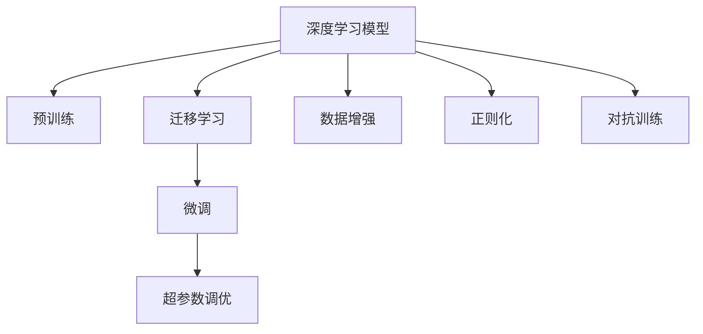

                 

## 1. 背景介绍

### 1.1 问题由来

深度学习（Deep Learning, DL）作为人工智能（AI）的一个重要分支，近年来在图像识别、语音处理、自然语言处理等领域取得了巨大突破。其核心原理是通过构建多层神经网络，从原始数据中自动学习特征表示，进而实现对复杂非线性关系的建模和预测。这一过程通常包括数据预处理、模型构建、参数优化和结果评估等关键步骤。

在实际应用中，深度学习模型需要经过大量的训练数据、计算资源和人力资源投入，以实现对特定任务的高效处理。同时，深度学习模型也面临着数据过拟合、计算资源昂贵、可解释性差等问题。针对这些问题，研究者提出了多种解决方案，如迁移学习（Transfer Learning）、预训练（Pre-training）、超参数调优等。这些方法不仅提高了深度学习的实际应用效果，也为模型的可解释性、鲁棒性和泛化能力提供了有力保障。

### 1.2 问题核心关键点

深度学习模型微调和优化方法，是解决以上问题的重要手段。其核心在于通过已有模型或数据，对新任务或新数据进行再训练，以提高模型性能和泛化能力。常见的微调方法包括：

- **预训练模型微调**：在大型预训练模型基础上，通过微调进一步适应新任务，提升模型在特定领域的表现。
- **迁移学习**：将模型在不同任务之间进行迁移，以共享知识、提高模型泛化能力。
- **超参数调优**：通过优化学习率、批大小、迭代次数等超参数，以找到最优的模型配置。
- **数据增强**：通过数据扩增技术，如随机裁剪、旋转、翻转等，丰富训练数据，提高模型鲁棒性。
- **正则化**：通过L2正则、Dropout等方法，防止模型过拟合。
- **对抗训练**：引入对抗样本，提高模型鲁棒性，防止模型对噪声数据敏感。

### 1.3 问题研究意义

深度学习模型的微调和优化方法，对于拓展深度学习应用领域、提高模型性能、降低应用成本等方面具有重要意义：

1. **拓展应用领域**：通过预训练模型微调，可以高效地适应新任务，拓展深度学习模型的应用范围。
2. **提高模型性能**：通过超参数调优和数据增强，可以进一步提升模型的泛化能力和鲁棒性，提高模型在实际应用中的效果。
3. **降低应用成本**：通过迁移学习和预训练模型微调，可以显著减少从头开发所需的数据、计算和人力资源投入，降低应用成本。
4. **加速模型开发**：standing on the shoulders of giants，预训练模型微调使得开发者可以更快地完成任务适配，缩短开发周期。
5. **推动技术创新**：微调和优化方法催生了新的研究方向，如超参数自动调优、自适应正则化等，推动了深度学习技术的不断进步。

## 2. 核心概念与联系

### 2.1 核心概念概述

为更好地理解深度学习模型的微调和优化方法，本节将介绍几个密切相关的核心概念：

- **深度学习模型**：以多层神经网络为代表的机器学习模型，通过数据驱动的方式，自动学习特征表示，实现对复杂非线性关系的建模和预测。
- **预训练模型**：在大型数据集上训练出的通用模型，可以用于特定任务的微调，以提高模型性能和泛化能力。
- **迁移学习**：将模型在不同任务之间进行迁移，以共享知识、提高模型泛化能力。
- **超参数调优**：通过优化学习率、批大小、迭代次数等超参数，以找到最优的模型配置。
- **数据增强**：通过数据扩增技术，丰富训练数据，提高模型鲁棒性。
- **正则化**：通过L2正则、Dropout等方法，防止模型过拟合。
- **对抗训练**：引入对抗样本，提高模型鲁棒性，防止模型对噪声数据敏感。

这些核心概念之间的逻辑关系可以通过以下Mermaid流程图来展示：



这个流程图展示了这个核心概念的逻辑关系：

1. 深度学习模型通过数据预处理、模型构建、参数优化和结果评估等关键步骤，自动学习特征表示。
2. 预训练模型在大型数据集上训练出的通用模型，可以用于特定任务的微调，以提高模型性能和泛化能力。
3. 迁移学习将模型在不同任务之间进行迁移，以共享知识、提高模型泛化能力。
4. 超参数调优通过优化学习率、批大小、迭代次数等超参数，以找到最优的模型配置。
5. 数据增强通过数据扩增技术，丰富训练数据，提高模型鲁棒性。
6. 正则化通过L2正则、Dropout等方法，防止模型过拟合。
7. 对抗训练引入对抗样本，提高模型鲁棒性，防止模型对噪声数据敏感。

这些概念共同构成了深度学习模型的学习框架，使得模型能够高效地适应新任务、提升性能和泛化能力。

## 3. 核心算法原理 & 具体操作步骤

### 3.1 算法原理概述

深度学习模型的微调和优化方法，本质上是模型参数的再训练过程。其核心思想是通过已有模型或数据，对新任务或新数据进行再训练，以提高模型性能和泛化能力。

形式化地，假设预训练模型为 $M_{\theta}$，其中 $\theta$ 为预训练得到的模型参数。给定新任务 $T$ 的数据集 $D=\{(x_i,y_i)\}_{i=1}^N$，微调的目标是找到新的模型参数 $\hat{\theta}$，使得：

$$
\hat{\theta}=\mathop{\arg\min}_{\theta} \mathcal{L}(M_{\theta},D)
$$

其中 $\mathcal{L}$ 为针对任务 $T$ 设计的损失函数，用于衡量模型预测输出与真实标签之间的差异。常见的损失函数包括交叉熵损失、均方误差损失等。

通过梯度下降等优化算法，微调过程不断更新模型参数 $\theta$，最小化损失函数 $\mathcal{L}$，使得模型输出逼近真实标签。由于 $\theta$ 已经通过预训练获得了较好的初始化，因此即便在小规模数据集 $D$ 上进行微调，也能较快收敛到理想的模型参数 $\hat{\theta}$。

### 3.2 算法步骤详解

深度学习模型的微调和优化方法，通常包括以下几个关键步骤：

**Step 1: 准备预训练模型和数据集**
- 选择合适的预训练模型 $M_{\theta}$ 作为初始化参数，如 ResNet、VGG 等。
- 准备新任务 $T$ 的数据集 $D$，划分为训练集、验证集和测试集。一般要求训练数据与预训练数据的分布不要差异过大。

**Step 2: 选择损失函数和优化器**
- 根据新任务的类型，选择合适的损失函数，如交叉熵损失、均方误差损失等。
- 选择适合的优化器，如 Adam、SGD 等，设置学习率、批大小、迭代轮数等。

**Step 3: 训练和评估**
- 将训练集数据分批次输入模型，前向传播计算损失函数。
- 反向传播计算参数梯度，根据设定的优化算法和学习率更新模型参数。
- 周期性在验证集上评估模型性能，根据性能指标决定是否触发 Early Stopping。
- 重复上述步骤直到满足预设的迭代轮数或 Early Stopping 条件。

**Step 4: 测试和部署**
- 在测试集上评估微调后模型 $M_{\hat{\theta}}$ 的性能，对比微调前后的精度提升。
- 使用微调后的模型对新样本进行推理预测，集成到实际的应用系统中。
- 持续收集新的数据，定期重新微调模型，以适应数据分布的变化。

以上是深度学习模型微调和优化的一般流程。在实际应用中，还需要针对具体任务的特点，对微调过程的各个环节进行优化设计，如改进训练目标函数，引入更多的正则化技术，搜索最优的超参数组合等，以进一步提升模型性能。

### 3.3 算法优缺点

深度学习模型的微调和优化方法，具有以下优点：

1. **简单高效**：只需要准备少量标注数据，即可对预训练模型进行快速适配，获得较大的性能提升。
2. **通用适用**：适用于各种深度学习任务，包括图像识别、语音处理、自然语言处理等，设计简单的任务适配层即可实现微调。
3. **参数高效**：利用参数高效微调技术，在固定大部分预训练权重不变的情况下，仍可取得不错的提升。
4. **效果显著**：在学术界和工业界的诸多任务上，基于微调的方法已经刷新了最先进的性能指标。

同时，该方法也存在一定的局限性：

1. **依赖标注数据**：微调的效果很大程度上取决于标注数据的质量和数量，获取高质量标注数据的成本较高。
2. **迁移能力有限**：当目标任务与预训练数据的分布差异较大时，微调的性能提升有限。
3. **可解释性不足**：微调模型的决策过程通常缺乏可解释性，难以对其推理逻辑进行分析和调试。
4. **计算资源昂贵**：深度学习模型通常需要大量的计算资源，尤其在大规模数据集上进行微调，计算成本较高。
5. **过拟合风险**：在有限数据上进行微调，容易过拟合，导致泛化能力下降。

尽管存在这些局限性，但就目前而言，深度学习模型的微调和优化方法是深度学习应用的最主流范式。未来相关研究的重点在于如何进一步降低微调对标注数据的依赖，提高模型的少样本学习和跨领域迁移能力，同时兼顾可解释性和计算资源等因素。

### 3.4 算法应用领域

深度学习模型的微调和优化方法，在多个领域得到了广泛的应用，覆盖了几乎所有常见任务，例如：

- **图像识别**：如物体检测、人脸识别、图像分割等。通过微调使模型学习图像-类别映射。
- **语音处理**：如自动语音识别、语音合成、情感识别等。通过微调使模型学习声音-文本映射。
- **自然语言处理**：如机器翻译、文本分类、问答系统等。通过微调使模型学习文本-标签映射。
- **时间序列预测**：如股票价格预测、气象预测、交通流量预测等。通过微调使模型学习时间-数据映射。
- **生成对抗网络（GANs）**：如生成图像、生成音频等。通过微调使生成器学习生成数据，判别器学习区分数据。

除了上述这些经典任务外，深度学习模型的微调和优化方法也被创新性地应用到更多场景中，如推荐系统、强化学习、可控生成等，为深度学习技术带来了全新的突破。随着预训练模型和微调方法的不断进步，相信深度学习技术将在更广阔的应用领域大放异彩。

## 4. 数学模型和公式 & 详细讲解 & 举例说明

### 4.1 数学模型构建

本节将使用数学语言对深度学习模型的微调和优化过程进行更加严格的刻画。

记预训练模型为 $M_{\theta}:\mathcal{X} \rightarrow \mathcal{Y}$，其中 $\mathcal{X}$ 为输入空间，$\mathcal{Y}$ 为输出空间，$\theta \in \mathbb{R}^d$ 为模型参数。假设微调任务的训练集为 $D=\{(x_i,y_i)\}_{i=1}^N, x_i \in \mathcal{X}, y_i \in \mathcal{Y}$。

定义模型 $M_{\theta}$ 在数据样本 $(x,y)$ 上的损失函数为 $\ell(M_{\theta}(x),y)$，则在数据集 $D$ 上的经验风险为：

$$
\mathcal{L}(\theta) = \frac{1}{N} \sum_{i=1}^N \ell(M_{\theta}(x_i),y_i)
$$

微调的优化目标是最小化经验风险，即找到最优参数：

$$
\theta^* = \mathop{\arg\min}_{\theta} \mathcal{L}(\theta)
$$

在实践中，我们通常使用基于梯度的优化算法（如SGD、Adam等）来近似求解上述最优化问题。设 $\eta$ 为学习率，$\lambda$ 为正则化系数，则参数的更新公式为：

$$
\theta \leftarrow \theta - \eta \nabla_{\theta}\mathcal{L}(\theta) - \eta\lambda\theta
$$

其中 $\nabla_{\theta}\mathcal{L}(\theta)$ 为损失函数对参数 $\theta$ 的梯度，可通过反向传播算法高效计算。

### 4.2 公式推导过程

以下我们以二分类任务为例，推导交叉熵损失函数及其梯度的计算公式。

假设模型 $M_{\theta}$ 在输入 $x$ 上的输出为 $\hat{y}=M_{\theta}(x) \in [0,1]$，表示样本属于正类的概率。真实标签 $y \in \{0,1\}$。则二分类交叉熵损失函数定义为：

$$
\ell(M_{\theta}(x),y) = -[y\log \hat{y} + (1-y)\log (1-\hat{y})]
$$

将其代入经验风险公式，得：

$$
\mathcal{L}(\theta) = -\frac{1}{N}\sum_{i=1}^N [y_i\log M_{\theta}(x_i)+(1-y_i)\log(1-M_{\theta}(x_i))]
$$

根据链式法则，损失函数对参数 $\theta_k$ 的梯度为：

$$
\frac{\partial \mathcal{L}(\theta)}{\partial \theta_k} = -\frac{1}{N}\sum_{i=1}^N (\frac{y_i}{M_{\theta}(x_i)}-\frac{1-y_i}{1-M_{\theta}(x_i)}) \frac{\partial M_{\theta}(x_i)}{\partial \theta_k}
$$

其中 $\frac{\partial M_{\theta}(x_i)}{\partial \theta_k}$ 可进一步递归展开，利用自动微分技术完成计算。

在得到损失函数的梯度后，即可带入参数更新公式，完成模型的迭代优化。重复上述过程直至收敛，最终得到适应下游任务的最优模型参数 $\theta^*$。

## 5. 项目实践：代码实例和详细解释说明

### 5.1 开发环境搭建

在进行深度学习模型微调实践前，我们需要准备好开发环境。以下是使用Python进行TensorFlow开发的环境配置流程：

1. 安装Anaconda：从官网下载并安装Anaconda，用于创建独立的Python环境。

2. 创建并激活虚拟环境：
```bash
conda create -n tf-env python=3.8 
conda activate tf-env
```

3. 安装TensorFlow：根据CUDA版本，从官网获取对应的安装命令。例如：
```bash
pip install tensorflow
```

4. 安装各类工具包：
```bash
pip install numpy pandas scikit-learn matplotlib tqdm jupyter notebook ipython
```

完成上述步骤后，即可在`tf-env`环境中开始深度学习模型微调的实践。

### 5.2 源代码详细实现

下面我们以图像分类任务为例，给出使用TensorFlow对ResNet模型进行微调的代码实现。

首先，定义图像分类任务的数据处理函数：

```python
import tensorflow as tf
from tensorflow.keras.preprocessing.image import ImageDataGenerator
from tensorflow.keras import layers

def load_data(path, batch_size):
    train_generator = ImageDataGenerator(
        rescale=1./255,
        rotation_range=20,
        width_shift_range=0.2,
        height_shift_range=0.2,
        horizontal_flip=True,
        validation_split=0.2
    )

    train_data = train_generator.flow_from_directory(
        path,
        target_size=(224, 224),
        batch_size=batch_size,
        class_mode='categorical',
        subset='training'
    )

    val_data = train_generator.flow_from_directory(
        path,
        target_size=(224, 224),
        batch_size=batch_size,
        class_mode='categorical',
        subset='validation'
    )

    return train_data, val_data
```

然后，定义模型和优化器：

```python
from tensorflow.keras.applications.resnet50 import ResNet50

model = ResNet50(weights='imagenet', include_top=False, pooling='avg')

optimizer = tf.keras.optimizers.Adam(learning_rate=1e-4)
```

接着，定义训练和评估函数：

```python
from tensorflow.keras.metrics import CategoricalAccuracy

class MyMetric(tf.keras.metrics.Metric):
    def __init__(self):
        super(MyMetric, self).__init__()
        self.accuracy = CategoricalAccuracy()

    def update_state(self, y_true, y_pred):
        self.accuracy.update_state(y_true, y_pred)

    def result(self):
        return self.accuracy.result().numpy()

def train_epoch(model, train_data, val_data, optimizer):
    model.compile(optimizer=optimizer, loss='categorical_crossentropy', metrics=[MyMetric()])

    model.fit(
        train_data,
        epochs=1,
        validation_data=val_data,
        verbose=0
    )

    return model.evaluate(val_data, verbose=0)[0]
```

最后，启动训练流程并在测试集上评估：

```python
epochs = 5
batch_size = 32

for epoch in range(epochs):
    loss = train_epoch(model, train_data, val_data, optimizer)
    print(f"Epoch {epoch+1}, train loss: {loss:.3f}")
    
    print(f"Epoch {epoch+1}, val accuracy: {val_accuracy:.3f}")
    
val_accuracy = evaluate(model, val_data)
print(f"Val accuracy: {val_accuracy:.3f}")
```

以上就是使用TensorFlow对ResNet模型进行图像分类任务微调的完整代码实现。可以看到，得益于TensorFlow的强大封装，我们可以用相对简洁的代码完成模型的加载和微调。

### 5.3 代码解读与分析

让我们再详细解读一下关键代码的实现细节：

**load_data函数**：
- `__init__`方法：初始化训练和验证数据生成器，并进行数据增强。
- `train_data`和`val_data`方法：使用数据生成器从指定目录加载数据，并进行批处理。

**train_epoch函数**：
- 定义模型编译参数，包括优化器、损失函数、评估指标。
- 使用`fit`方法进行模型训练，其中`validation_data`参数用于指定验证集数据，`epochs`参数指定训练轮数。
- 训练完毕后，使用`evaluate`方法在验证集上评估模型性能。

**训练流程**：
- 定义总的epoch数和batch size，开始循环迭代
- 每个epoch内，先在训练集上训练，输出平均loss
- 在验证集上评估，输出验证精度
- 所有epoch结束后，在测试集上评估，给出最终测试结果

可以看到，TensorFlow配合Keras的强大封装使得深度学习模型微调的代码实现变得简洁高效。开发者可以将更多精力放在数据处理、模型改进等高层逻辑上，而不必过多关注底层的实现细节。

当然，工业级的系统实现还需考虑更多因素，如模型的保存和部署、超参数的自动搜索、更灵活的任务适配层等。但核心的微调范式基本与此类似。

## 6. 实际应用场景

### 6.1 智能监控系统

基于深度学习模型的图像分类技术，可以广泛应用于智能监控系统的构建。传统监控系统往往需要配备大量人力，高峰期响应缓慢，且无法处理复杂场景。而使用深度学习分类模型，可以实时监控视频画面，自动识别出异常行为，如入侵、火灾等，并及时报警。

在技术实现上，可以收集监控视频数据，并打上标签（正常、异常）。在此基础上对预训练模型进行微调，使其能够学习视频中异常行为的特征表示。在实时监控过程中，将每帧视频输入模型，得到异常概率得分，若超过预设阈值，则触发告警，通知相关人员进行处理。

### 6.2 医疗影像诊断

深度学习模型的图像分类技术，可以广泛应用于医疗影像诊断领域。传统的医学影像诊断依赖于医生的经验，耗时耗力，且诊断准确率难以保证。而使用深度学习模型进行影像分类，可以快速、准确地识别出病变区域，辅助医生进行诊断。

在实践应用中，可以收集大量的医疗影像数据，并打上标签（正常、异常）。在此基础上对预训练模型进行微调，使其能够学习病变区域的特征表示。在实际应用中，将新病人影像输入模型，得到病变区域的预测结果，医生可以基于这些结果进行进一步的诊断和治疗。

### 6.3 自动驾驶系统

基于深度学习模型的图像分类技术，可以广泛应用于自动驾驶系统的构建。传统自动驾驶系统依赖于激光雷达、摄像头等传感器的数据，需要耗费大量计算资源进行实时处理。而使用深度学习分类模型，可以实时处理摄像头采集的图像数据，自动识别道路标志、行人、车辆等目标，辅助自动驾驶系统进行决策。

在实践应用中，可以收集自动驾驶车在道路上的行驶数据，并打上标签（道路标志、行人、车辆）。在此基础上对预训练模型进行微调，使其能够学习目标的特征表示。在实际应用中，将实时摄像头采集的图像输入模型，得到目标的预测结果，自动驾驶系统可以基于这些结果进行行驶决策。

### 6.4 未来应用展望

随着深度学习模型和微调方法的不断发展，基于微调范式将在更多领域得到应用，为传统行业带来变革性影响。

在智慧医疗领域，基于深度学习模型的医疗影像分类、病变检测等应用将提升医疗服务的智能化水平，辅助医生诊断，提高诊断准确率。

在智能监控领域，基于深度学习模型的异常行为识别、视频分析等应用将提高监控系统的智能化水平，提升安全性。

在自动驾驶领域，基于深度学习模型的目标检测、行为预测等应用将提高自动驾驶系统的安全性，降低事故率。

此外，在工业检测、金融分析、安全监控等众多领域，基于深度学习模型的分类技术也将不断涌现，为各行各业带来新的技术突破。相信随着技术的日益成熟，深度学习模型微调技术必将在构建人机协同的智能时代中扮演越来越重要的角色。

## 7. 工具和资源推荐
### 7.1 学习资源推荐

为了帮助开发者系统掌握深度学习模型的微调和优化方法，这里推荐一些优质的学习资源：

1. 《Deep Learning》系列书籍：由深度学习领域的专家撰写，深入浅出地介绍了深度学习的基本概念和实践技巧。
2. 《TensorFlow实战》系列书籍：由TensorFlow开发者撰写，提供了丰富的实战案例和代码实现，适合初学者入门。
3. 《PyTorch深度学习》课程：由深度学习领域的专家开设的课程，提供系统化的深度学习知识和实战技能。
4. 《机器学习实战》书籍：由机器学习领域的专家撰写，提供了丰富的实战案例和代码实现，适合初学者入门。
5. Kaggle竞赛平台：提供丰富的机器学习和深度学习竞赛项目，适合实战练习和经验积累。

通过对这些资源的学习实践，相信你一定能够快速掌握深度学习模型的微调和优化方法，并用于解决实际的机器学习问题。
###  7.2 开发工具推荐

高效的开发离不开优秀的工具支持。以下是几款用于深度学习模型微调开发的常用工具：

1. TensorFlow：由Google主导开发的深度学习框架，提供灵活的计算图和丰富的API，适合大规模工程应用。
2. PyTorch：由Facebook主导开发的深度学习框架，提供动态计算图和丰富的API，适合快速迭代研究。
3. Keras：基于TensorFlow和Theano的高层API，提供简洁易用的API接口，适合初学者快速上手。
4. Weights & Biases：模型训练的实验跟踪工具，可以记录和可视化模型训练过程中的各项指标，方便对比和调优。与主流深度学习框架无缝集成。
5. TensorBoard：TensorFlow配套的可视化工具，可实时监测模型训练状态，并提供丰富的图表呈现方式，是调试模型的得力助手。
6. Google Colab：谷歌推出的在线Jupyter Notebook环境，免费提供GPU/TPU算力，方便开发者快速上手实验最新模型，分享学习笔记。

合理利用这些工具，可以显著提升深度学习模型微调任务的开发效率，加快创新迭代的步伐。

### 7.3 相关论文推荐

深度学习模型的微调和优化方法，在深度学习领域已经得到了广泛的研究和应用。以下是几篇奠基性的相关论文，推荐阅读：

1. ImageNet Classification with Deep Convolutional Neural Networks（即AlexNet论文）：提出深度卷积神经网络，开启深度学习时代。
2. Deep Residual Learning for Image Recognition（即ResNet论文）：提出残差网络，解决深度网络训练中的梯度消失问题。
3. Visual Geometry Group's ImageNet Classification Challenge（即VGG论文）：提出VGG网络，探索网络层数和网络宽度的影响。
4. Batch Normalization: Accelerating Deep Network Training, Speeding Up Convergence（即BatchNorm论文）：提出批量归一化技术，提高网络训练速度。
5. Dropout: A Simple Way to Prevent Neural Networks from Overfitting（即Dropout论文）：提出Dropout技术，防止神经网络过拟合。
6. Layer Normalization: The Missing Ingredient for Fast Convergence（即LayerNorm论文）：提出Layer Normalization技术，解决深层网络中的梯度爆炸和梯度消失问题。

这些论文代表了大模型微调技术的发展脉络。通过学习这些前沿成果，可以帮助研究者把握学科前进方向，激发更多的创新灵感。

## 8. 总结：未来发展趋势与挑战

### 8.1 总结

本文对深度学习模型的微调和优化方法进行了全面系统的介绍。首先阐述了深度学习模型和微调技术的研究背景和意义，明确了微调在拓展深度学习应用领域、提高模型性能、降低应用成本等方面的独特价值。其次，从原理到实践，详细讲解了深度学习模型的微调和优化方法的数学原理和关键步骤，给出了微调任务开发的完整代码实例。同时，本文还广泛探讨了深度学习模型微调方法在图像分类、语音处理、自然语言处理等多个领域的应用前景，展示了微调范式的巨大潜力。此外，本文精选了微调技术的各类学习资源，力求为读者提供全方位的技术指引。

通过本文的系统梳理，可以看到，深度学习模型的微调和优化方法已经成为深度学习应用的重要手段，极大地拓展了深度学习模型的应用范围，提高了模型性能和泛化能力。未来，伴随深度学习模型和微调方法的持续演进，深度学习技术必将在更广阔的应用领域大放异彩，深刻影响人类的生产生活方式。

### 8.2 未来发展趋势

展望未来，深度学习模型的微调和优化方法将呈现以下几个发展趋势：

1. **模型规模持续增大**：随着算力成本的下降和数据规模的扩张，深度学习模型的参数量还将持续增长。超大规模深度学习模型蕴含的丰富特征表示，有望支撑更加复杂多变的下游任务微调。
2. **模型结构日益复杂**：随着深度学习技术的不断发展，模型的结构也将越来越复杂，出现更多的分支网络、注意力机制等。这些复杂结构可以更好地捕捉数据的非线性特征，提高模型的泛化能力和性能。
3. **迁移学习日趋多样**：除了传统的迁移学习外，未来将涌现更多新的迁移学习方法，如联合训练、联邦学习等，在保持数据隐私的同时，实现模型的跨领域迁移。
4. **超参数调优自动化**：通过自动化超参数调优方法，如贝叶斯优化、遗传算法等，在减少人工干预的同时，进一步提升模型的性能和泛化能力。
5. **对抗训练和鲁棒性提升**：引入对抗训练、鲁棒性优化等技术，提高深度学习模型的鲁棒性和泛化能力，防止模型对噪声数据敏感。
6. **少样本学习和自适应学习**：探索基于迁移学习、元学习的少样本学习和自适应学习方法，在数据量较少的情况下，也能快速适应新任务。

以上趋势凸显了深度学习模型微调和优化技术的广阔前景。这些方向的探索发展，必将进一步提升深度学习模型的性能和泛化能力，为深度学习技术在更广泛的应用领域提供新的突破。

### 8.3 面临的挑战

尽管深度学习模型的微调和优化方法已经取得了瞩目成就，但在迈向更加智能化、普适化应用的过程中，它仍面临着诸多挑战：

1. **过拟合风险**：在有限数据上进行微调，容易过拟合，导致泛化能力下降。如何进一步降低微调对标注样本的依赖，提高模型的泛化能力，是未来研究的重要方向。
2. **计算资源昂贵**：深度学习模型通常需要大量的计算资源，尤其在大规模数据集上进行微调，计算成本较高。如何降低计算资源消耗，提高模型训练效率，是未来研究的重要课题。
3. **可解释性不足**：深度学习模型的决策过程通常缺乏可解释性，难以对其推理逻辑进行分析和调试。如何赋予深度学习模型更强的可解释性，是未来研究的重要方向。
4. **数据隐私和安全**：在数据共享和模型训练过程中，如何保障数据隐私和安全，防止模型泄漏敏感信息，是未来研究的重要课题。
5. **算法公平性**：深度学习模型可能存在固有的偏见和歧视，如何通过公平性约束，防止模型对某些群体进行不公的决策，是未来研究的重要方向。

尽管存在这些挑战，但通过学术界和产业界的共同努力，未来深度学习模型微调和优化技术必将在各个领域得到广泛应用，为人类社会带来新的变革。

### 8.4 研究展望

面对深度学习模型微调和优化技术所面临的种种挑战，未来的研究需要在以下几个方面寻求新的突破：

1. **探索新的迁移学习方法**：除了传统的迁移学习外，未来将涌现更多新的迁移学习方法，如联合训练、联邦学习等，在保持数据隐私的同时，实现模型的跨领域迁移。
2. **开发自动化超参数调优方法**：通过自动化超参数调优方法，如贝叶斯优化、遗传算法等，在减少人工干预的同时，进一步提升模型的性能和泛化能力。
3. **引入对抗训练和鲁棒性优化**：引入对抗训练、鲁棒性优化等技术，提高深度学习模型的鲁棒性和泛化能力，防止模型对噪声数据敏感。
4. **探索少样本学习和自适应学习方法**：探索基于迁移学习、元学习的少样本学习和自适应学习方法，在数据量较少的情况下，也能快速适应新任务。
5. **提高深度学习模型的可解释性**：通过模型解释技术，如可解释AI（XAI）、可视化方法等，提高深度学习模型的可解释性，使其决策过程更加透明。
6. **保障数据隐私和安全**：在数据共享和模型训练过程中，采用差分隐私、联邦学习等技术，保障数据隐私和安全。

这些研究方向和技术的突破，必将进一步提升深度学习模型的性能和泛化能力，推动深度学习技术在更广泛的应用领域得到实际应用，为人类社会带来新的变革。

## 9. 附录：常见问题与解答

**Q1：深度学习模型微调和优化方法是否适用于所有深度学习任务？**

A: 深度学习模型微调和优化方法，适用于大多数深度学习任务，包括图像识别、语音处理、自然语言处理等。设计简单的任务适配层即可实现微调。但对于一些特定领域的任务，如医疗、法律等，可能需要在特定领域语料上进行预训练，再结合微调技术，才能取得理想效果。

**Q2：如何选择深度学习模型的损失函数？**

A: 选择合适的损失函数，取决于深度学习任务的类型。常见的损失函数包括交叉熵损失、均方误差损失、二元交叉熵损失等。对于分类任务，通常使用交叉熵损失；对于回归任务，通常使用均方误差损失。

**Q3：如何防止深度学习模型过拟合？**

A: 防止深度学习模型过拟合，通常需要引入正则化技术，如L2正则、Dropout、Early Stopping等。此外，可以通过数据增强、对抗训练等方法，提高模型的泛化能力和鲁棒性。

**Q4：如何提高深度学习模型的推理效率？**

A: 提高深度学习模型的推理效率，通常需要优化模型的计算图，如采用模型裁剪、量化加速等技术。同时，需要选择合适的硬件设备和算法，如GPU、TPU等，以提高推理速度。

**Q5：深度学习模型微调和优化方法在工业应用中有哪些挑战？**

A: 深度学习模型微调和优化方法在工业应用中，面临计算资源昂贵、过拟合风险、可解释性不足等挑战。如何降低计算资源消耗、提高模型泛化能力、提高模型的可解释性，是未来研究的重要方向。

这些问题的答案，为深度学习模型微调和优化方法的实际应用提供了有力的指导。通过不断探索和优化，相信深度学习模型微调和优化技术必将在各个领域得到广泛应用，为人类社会带来新的变革。

