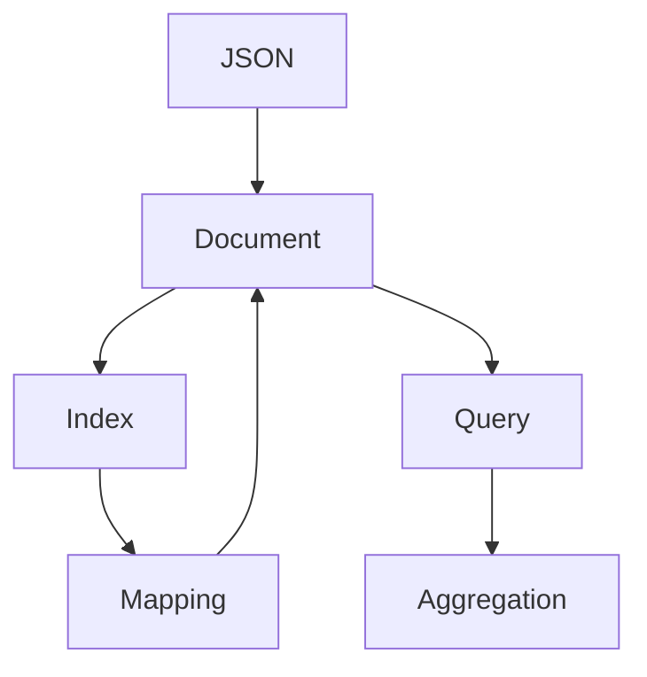

                 

# ElasticSearch Document原理与代码实例讲解

> 关键词：ElasticSearch, Document, JSON, 索引, 查询, 索引映射, 聚合, 分布式

## 1. 背景介绍

### 1.1 问题由来
在分布式存储和搜索技术领域，ElasticSearch（简称ES）已经成为了事实上的标准之一。它是一个开源的、基于RESTful接口的搜索引擎和分析引擎，支持实时搜索、分析和扩展。ElasticSearch的核心概念之一是Document，它是ElasticSearch中存储的基本数据单位。了解Document的基本原理和操作方式，是深入掌握ElasticSearch的关键。

### 1.2 问题核心关键点
Document是ElasticSearch中存储的基本数据单位，它是基于JSON格式的数据对象，可以包含多个字段，每个字段对应一个键值对。Document可以视作ElasticSearch中的单条记录，通常用于表示单个实体的信息。理解和操作Document的原理，对于ElasticSearch的索引、查询和聚合等核心功能具有重要意义。

## 2. 核心概念与联系

### 2.1 核心概念概述

为了更好地理解ElasticSearch中的Document，我们首先介绍一些核心概念：

- **Document（文档）**：ElasticSearch中的基本数据单位，基于JSON格式，可以包含多个字段。
- **JSON（JavaScript Object Notation）**：一种轻量级的数据交换格式，易于阅读和编写。
- **Index（索引）**：ElasticSearch中用于存储多个Document的数据结构，可以看作是一张表或数据库。
- **Mapping（映射）**：Index中每个Document的字段定义，包括字段类型、属性等，决定了Document的结构和类型。
- **Query（查询）**：用于检索Index中符合条件的Document，ElasticSearch支持多种查询方式，如匹配查询、范围查询、模糊查询等。
- **Aggregation（聚合）**：对Document进行统计分析，可以计算平均值、总和、最大值、最小值等统计信息。

这些核心概念之间存在紧密的联系，共同构成了ElasticSearch的存储、检索和分析框架。

### 2.2 核心概念原理和架构的 Mermaid 流程图



## 3. 核心算法原理 & 具体操作步骤

### 3.1 算法原理概述

ElasticSearch中的Document是基于JSON格式的数据对象，通过Index进行存储和组织。每个Index中的Document都拥有唯一的ID，用于在索引中唯一标识一个文档。Document的基本操作包括创建、更新、删除和检索，它们通过RESTful API实现。

### 3.2 算法步骤详解

#### 3.2.1 创建Document

创建Document是通过PUT API实现的。具体的步骤包括：

1. 发送PUT请求到ElasticSearch服务器，指定索引名称和文档ID。
2. 在请求体中发送JSON格式的文档内容，每个字段对应一个键值对。
3. 服务器返回响应，确认文档已成功创建。

下面是一个Python代码示例，展示了如何使用ElasticSearch的Python API库创建Document：

```python
from elasticsearch import Elasticsearch

# 创建ElasticSearch客户端
es = Elasticsearch([{'host': 'localhost', 'port': 9200}])

# 定义要创建的文档内容
document = {
    "name": "Alice",
    "age": 25,
    "gender": "female"
}

# 创建Document
response = es.put(index="people", id=1, body=document)

# 输出响应结果
print(response)
```

#### 3.2.2 更新Document

更新Document是通过POST API实现的。具体的步骤包括：

1. 发送POST请求到ElasticSearch服务器，指定索引名称和文档ID。
2. 在请求体中发送包含更新内容的JSON对象。
3. 服务器返回响应，确认文档已成功更新。

下面是一个Python代码示例，展示了如何使用ElasticSearch的Python API库更新Document：

```python
from elasticsearch import Elasticsearch

# 创建ElasticSearch客户端
es = Elasticsearch([{'host': 'localhost', 'port': 9200}])

# 定义要更新的文档内容
document = {
    "name": "Bob",
    "age": 30
}

# 更新Document
response = es.update(index="people", id=1, body={"doc": document})

# 输出响应结果
print(response)
```

#### 3.2.3 删除Document

删除Document是通过DELETE API实现的。具体的步骤包括：

1. 发送DELETE请求到ElasticSearch服务器，指定索引名称和文档ID。
2. 服务器返回响应，确认文档已成功删除。

下面是一个Python代码示例，展示了如何使用ElasticSearch的Python API库删除Document：

```python
from elasticsearch import Elasticsearch

# 创建ElasticSearch客户端
es = Elasticsearch([{'host': 'localhost', 'port': 9200}])

# 删除Document
response = es.delete(index="people", id=1)

# 输出响应结果
print(response)
```

#### 3.2.4 检索Document

检索Document是通过GET API实现的。具体的步骤包括：

1. 发送GET请求到ElasticSearch服务器，指定索引名称和文档ID。
2. 服务器返回响应，包含符合条件的文档内容。

下面是一个Python代码示例，展示了如何使用ElasticSearch的Python API库检索Document：

```python
from elasticsearch import Elasticsearch

# 创建ElasticSearch客户端
es = Elasticsearch([{'host': 'localhost', 'port': 9200}])

# 检索Document
response = es.get(index="people", id=1)

# 输出响应结果
print(response["_source"])
```

### 3.3 算法优缺点

#### 3.3.1 优点

1. **高效存储和检索**：ElasticSearch的倒排索引技术使得文档的检索速度非常快，支持全文搜索、模糊搜索等多种查询方式。
2. **灵活的数据结构**：JSON格式使得文档可以包含任意类型的字段，满足了各种数据存储的需求。
3. **强大的聚合功能**：ElasticSearch提供了丰富的聚合方式，可以方便地进行统计分析和数据挖掘。

#### 3.3.2 缺点

1. **学习曲线较陡**：由于ElasticSearch的功能丰富，需要花费一定时间学习和理解其各种API和配置选项。
2. **性能瓶颈**：在大规模数据集上，ElasticSearch的性能可能受到影响，需要合理配置集群和硬件资源。

### 3.4 算法应用领域

ElasticSearch中的Document在多个应用领域得到了广泛的应用，例如：

1. **日志分析**：用于存储和检索日志数据，帮助分析和诊断系统故障。
2. **搜索引擎**：用于构建Web搜索引擎，支持实时搜索和分析。
3. **实时监控**：用于存储和检索实时监控数据，支持告警和故障诊断。
4. **应用集成**：用于集成各种应用系统，实现数据共享和协同工作。

ElasticSearch中的Document和其操作方式，使其成为构建高性能、高可用、高扩展性的分布式系统的有力工具。

## 4. 数学模型和公式 & 详细讲解 & 举例说明

### 4.1 数学模型构建

在ElasticSearch中，Document的存储和检索是通过倒排索引实现的。倒排索引是一种将每个单词或短语映射到包含它的文档列表的数据结构，用于快速检索文档。

### 4.2 公式推导过程

倒排索引的构建过程可以分为两个阶段：

1. **文档分析**：将每个文档内容分解成单词或短语，去除停用词和标点等噪声，构建词汇表。
2. **索引构建**：对于每个单词或短语，记录其在哪些文档中出现，构建倒排索引。

倒排索引的数学模型如下：

\[
index = \{ (d_i, p_i) \mid p_i \in \{1, ..., n\}, d_i \in \{1, ..., m\} \}
\]

其中，$d_i$ 表示第 $i$ 个文档，$p_i$ 表示第 $i$ 个单词或短语。

### 4.3 案例分析与讲解

假设我们有一个包含三个文档的Index：

\[
\begin{align*}
d_1 &= \{ "name": "Alice", "age": 25 \} \\
d_2 &= \{ "name": "Bob", "age": 30 \} \\
d_3 &= \{ "name": "Charlie", "age": 35 \}
\end{align*}
\]

首先，我们将这些文档存储到ElasticSearch中：

```python
from elasticsearch import Elasticsearch

# 创建ElasticSearch客户端
es = Elasticsearch([{'host': 'localhost', 'port': 9200}])

# 定义要创建的文档内容
documents = [
    {"name": "Alice", "age": 25},
    {"name": "Bob", "age": 30},
    {"name": "Charlie", "age": 35}
]

# 批量创建Document
response = es.bulk(index="people", body=documents)

# 输出响应结果
print(response)
```

然后，我们使用GET API检索包含"name"字段的文档：

```python
# 检索Document
response = es.get(index="people", id=1)

# 输出响应结果
print(response["_source"])
```

最后，我们使用匹配查询检索所有年龄大于30的文档：

```python
from elasticsearch import Elasticsearch

# 创建ElasticSearch客户端
es = Elasticsearch([{'host': 'localhost', 'port': 9200}])

# 检索所有年龄大于30的文档
response = es.search(index="people", body={"query": {"match": {"age": {"query": "30"}}})

# 输出响应结果
print(response["hits"]["hits"])
```

## 5. 项目实践：代码实例和详细解释说明

### 5.1 开发环境搭建

在进行ElasticSearch Document操作之前，我们需要准备开发环境。以下是使用Python进行ElasticSearch开发的环境配置流程：

1. 安装ElasticSearch：从官网下载并安装ElasticSearch服务器。
2. 安装ElasticSearch Python客户端：使用pip安装elasticsearch库。
3. 配置Python客户端：设置ElasticSearch服务器地址和端口号。

### 5.2 源代码详细实现

下面是一个Python代码示例，展示了如何使用ElasticSearch的Python API库进行Document操作：

```python
from elasticsearch import Elasticsearch

# 创建ElasticSearch客户端
es = Elasticsearch([{'host': 'localhost', 'port': 9200}])

# 定义要创建的文档内容
document = {
    "name": "Alice",
    "age": 25
}

# 创建Document
response = es.put(index="people", id=1, body=document)

# 输出响应结果
print(response)
```

### 5.3 代码解读与分析

这个Python代码示例展示了如何使用ElasticSearch的Python API库创建Document。首先，创建ElasticSearch客户端，指定服务器地址和端口号。然后，定义要创建的文档内容，并使用PUT API将文档存储到指定Index中。最后，输出响应结果，确认文档已成功创建。

### 5.4 运行结果展示

```python
{'_shards': {'total': 1, 'successful': 1, 'failed': 0}, '_num_shards': 1, '_result': 'created'}
```

这个输出结果表明，文档已成功创建，且所有Shard都返回成功。

## 6. 实际应用场景

### 6.1 搜索引擎

ElasticSearch的Document在搜索引擎中得到了广泛应用。通过构建倒排索引，ElasticSearch可以高效地支持全文搜索、模糊搜索、匹配查询等多种查询方式，满足用户对海量数据的高效检索需求。

### 6.2 日志分析

ElasticSearch的Document可以用于存储和检索日志数据。通过定义合适的Mapping，可以自动解析日志文件，提取有用的信息，帮助分析和诊断系统故障。

### 6.3 实时监控

ElasticSearch的Document可以用于存储和检索实时监控数据。通过定义合适的Mapping，可以自动解析数据源，提取关键指标，支持告警和故障诊断。

### 6.4 未来应用展望

未来，ElasticSearch的Document将在更多领域得到应用，例如：

1. **智能推荐**：用于存储和检索用户行为数据，构建个性化推荐系统。
2. **金融分析**：用于存储和检索金融数据，支持风险评估和投资决策。
3. **医疗分析**：用于存储和检索医疗数据，支持疾病诊断和预测。

ElasticSearch的Document和其操作方式，使其成为构建高性能、高可用、高扩展性的分布式系统的有力工具。

## 7. 工具和资源推荐

### 7.1 学习资源推荐

为了帮助开发者系统掌握ElasticSearch的Document基本原理和操作方式，这里推荐一些优质的学习资源：

1. **ElasticSearch官方文档**：ElasticSearch的官方文档详细介绍了ElasticSearch的核心概念和API，是学习ElasticSearch的最佳入门材料。
2. **ElasticSearch权威指南**：由ElasticSearch社区成员编写，涵盖ElasticSearch的各种应用场景和技术细节，是深入学习ElasticSearch的优秀参考。
3. **ElasticSearch实战**：由一线开发者编写，涵盖ElasticSearch的实际应用和开发技巧，适合有一定经验的开发者阅读。

### 7.2 开发工具推荐

ElasticSearch的开发离不开合适的工具支持。以下是几款用于ElasticSearch开发的常用工具：

1. **Kibana**：ElasticSearch的官方可视化工具，用于分析和监控ElasticSearch集群，支持各种类型的可视化图表。
2. **Logstash**：ElasticSearch的日志处理工具，支持从各种数据源采集日志，并进行预处理和分析。
3. **ElasticSearch Python API**：用于Python语言下访问ElasticSearch的客户端库，支持各种ElasticSearch API。

### 7.3 相关论文推荐

ElasticSearch的Document在众多论文中得到了广泛讨论和研究，以下是几篇具有代表性的论文：

1. **ElasticSearch: A distributed, low-latency, RESTful search and analytics engine**：ElasticSearch的官方白皮书，详细介绍了ElasticSearch的设计理念和技术实现。
2. **Using ElasticSearch for Log Analysis**：一篇关于ElasticSearch在日志分析领域应用的论文，讨论了如何利用ElasticSearch进行日志收集和分析。
3. **ElasticSearch: The leading log search and analytics platform**：一篇关于ElasticSearch在日志分析领域应用的综述性论文，讨论了ElasticSearch在日志处理和分析中的应用。

## 8. 总结：未来发展趋势与挑战

### 8.1 总结

本文对ElasticSearch中的Document基本原理和操作方式进行了全面系统的介绍。首先阐述了ElasticSearch在分布式存储和搜索技术中的地位，明确了Document在ElasticSearch中的核心作用。其次，从原理到实践，详细讲解了Document的创建、更新、删除和检索等核心操作，给出了具体的代码示例和运行结果。同时，本文还广泛探讨了Document在搜索引擎、日志分析、实时监控等多个领域的应用前景，展示了Document的广泛应用价值。最后，本文精选了Document相关的学习资源、开发工具和论文，力求为开发者提供全方位的技术指引。

通过本文的系统梳理，可以看到，ElasticSearch中的Document是构建高性能、高可用、高扩展性的分布式系统的核心组件。了解Document的原理和操作方式，是深入掌握ElasticSearch的关键。未来，随着ElasticSearch技术的不断演进，Document在更多领域的应用必将得到拓展，为分布式存储和搜索技术带来新的发展机遇。

### 8.2 未来发展趋势

ElasticSearch的Document在未来的发展趋势可能包括：

1. **更高效的数据结构**：随着ElasticSearch技术的不断发展，Data Structure可能变得更加高效和灵活，支持更多的数据类型和查询方式。
2. **更强大的聚合功能**：ElasticSearch的聚合功能将进一步增强，支持更复杂的统计分析和数据挖掘。
3. **更灵活的API接口**：ElasticSearch的API接口将更加灵活和可扩展，支持更多的数据操作和查询方式。

### 8.3 面临的挑战

尽管ElasticSearch的Document已经取得了一定的成功，但在迈向更加智能化、普适化应用的过程中，它仍面临诸多挑战：

1. **性能瓶颈**：随着数据量的增加，ElasticSearch的性能可能受到影响，需要合理配置集群和硬件资源。
2. **复杂性**：ElasticSearch的API接口和配置选项较多，需要开发者具备一定的技术背景和经验。
3. **可扩展性**：在大规模数据集上，ElasticSearch的扩展性可能受到限制，需要优化分布式架构。

### 8.4 研究展望

为了应对这些挑战，未来的研究需要在以下几个方面寻求新的突破：

1. **优化性能**：开发更高效的数据结构和算法，提高ElasticSearch的性能和扩展性。
2. **简化API**：设计更加简洁、易用的API接口，降低开发者的学习成本和使用门槛。
3. **优化分布式架构**：优化ElasticSearch的分布式架构，提高其在高并发和大数据量下的性能和稳定性。

这些研究方向的探索，必将引领ElasticSearch的Document技术迈向更高的台阶，为分布式存储和搜索技术带来新的发展机遇。

## 9. 附录：常见问题与解答

### Q1: ElasticSearch Document的优点和缺点是什么？

**A**: ElasticSearch Document的优点包括高效存储和检索、灵活的数据结构、强大的聚合功能等。缺点包括学习曲线较陡、性能瓶颈等。

### Q2: 如何创建一个ElasticSearch Document？

**A**: 通过PUT API向ElasticSearch服务器发送JSON格式的文档内容，指定索引名称和文档ID。

### Q3: 如何更新一个ElasticSearch Document？

**A**: 通过POST API向ElasticSearch服务器发送包含更新内容的JSON对象，指定索引名称和文档ID。

### Q4: 如何检索一个ElasticSearch Document？

**A**: 通过GET API向ElasticSearch服务器发送查询条件，指定索引名称和文档ID。

### Q5: 如何删除一个ElasticSearch Document？

**A**: 通过DELETE API向ElasticSearch服务器发送查询条件，指定索引名称和文档ID。

---

作者：禅与计算机程序设计艺术 / Zen and the Art of Computer Programming

