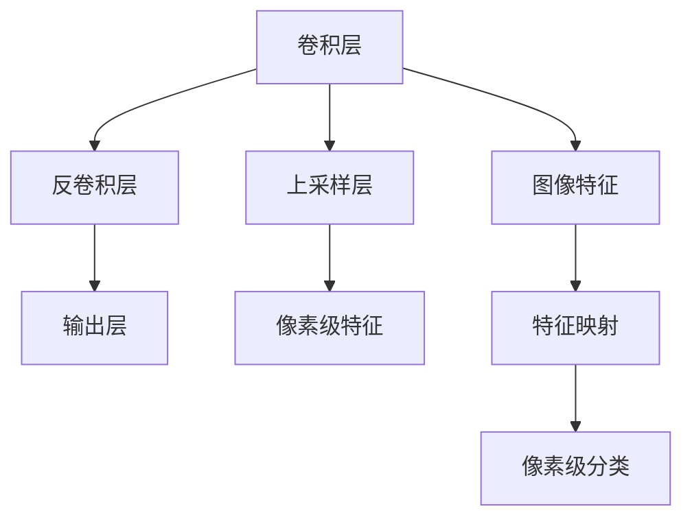

                 

# FCN原理与代码实例讲解

> 关键词：
  - 全卷积网络(Fully Convolutional Network, FCN)
  - 图像分割(Segmentation)
  - 反卷积(Deconvolution)
  - 语义分割(Semantic Segmentation)
  - 端到端(End-to-End)
  - 图像分类(Image Classification)
  - 梯度传播(Backpropagation)
  - 卷积神经网络(Convolutional Neural Network, CNN)

## 1. 背景介绍

### 1.1 问题由来

图像分割作为计算机视觉领域中的一个重要问题，长期以来一直是研究的重点之一。传统的图像分割方法往往需要人工设计特征和操作，过程繁琐且效率低下，难以满足实际应用中的快速需求。

随着深度学习技术的发展，特别是卷积神经网络(Convolutional Neural Network, CNN)的广泛应用，基于端到端学习的方法开始受到广泛关注。全卷积网络(Fully Convolutional Network, FCN)作为其中的代表性方法，通过对卷积神经网络的扩展和改进，在图像分割领域取得了突出的表现。

### 1.2 问题核心关键点

FCN的核心思想是：通过卷积神经网络实现端到端的图像分割任务，将图像分类与分割任务整合，通过逐层卷积、反卷积和上采样操作，将分类器的输出转化为像素级别的语义分割结果。FCN的典型结构由卷积层、反卷积层、上采样层和输出层组成，具有编码-解码结构的特征。

1. 卷积层：实现特征的逐层提取，并通过参数共享提高网络的泛化能力。
2. 反卷积层：实现特征的逐层降维，并通过可学习的参数实现特征的逐层重组。
3. 上采样层：实现像素级别的分割结果生成，通过像素级别的特征融合实现语义分割。
4. 输出层：将上采样层输出转换为像素级别的语义分割结果。

通过以上组件的组合，FCN能够有效实现图像分类到像素级语义分割的自动映射，同时保留卷积神经网络的高效特征提取和参数共享的特性，非常适合用于图像分割任务。

### 1.3 问题研究意义

FCN的研究和应用具有重要意义：

1. 提高图像分割效率：FCN能够自动提取图像特征，并通过端到端学习的方式进行图像分割，大幅提升了分割的效率和精度。
2. 降低人工干预：FCN通过网络自动学习特征，减少了人工特征设计和处理的步骤，降低了人工干预的难度。
3. 促进应用落地：FCN简单易用，可以通过预训练模型快速应用于各类图像分割任务，如医学图像分割、自动驾驶、遥感图像分析等。
4. 拓展应用场景：FCN不仅适用于静态图像分割，还能应用于视频、3D图像等多种类型的数据。

## 2. 核心概念与联系

### 2.1 核心概念概述

为了更好地理解FCN的工作原理，本节将介绍几个密切相关的核心概念：

- 卷积神经网络(Convolutional Neural Network, CNN)：一种基于卷积操作的神经网络结构，在图像分类、目标检测等领域表现出强大的特征提取能力。
- 反卷积(Deconvolution)：与卷积相反的数学操作，可以将低维特征图转化为高维特征图，实现特征的逐层重组。
- 上采样(Upsampling)：通过插值等方法将低分辨率特征图转化为高分辨率特征图，实现像素级别的特征融合。
- 语义分割(Semantic Segmentation)：将图像像素分为不同语义类别，如人、车、建筑物等，实现图像的像素级分类。
- 端到端(End-to-End)：通过网络自动学习特征和任务，无需中间步骤，实现直接从输入到输出的学习过程。

这些核心概念之间的逻辑关系可以通过以下Mermaid流程图来展示：



这个流程图展示了FCN的基本架构：

1. 卷积层对输入图像进行特征提取，生成特征映射。
2. 反卷积层实现特征的逐层重组，将低维特征图转化为高维特征图。
3. 上采样层通过插值等方法生成高分辨率特征图，实现像素级别的特征融合。
4. 输出层将上采样层输出转换为像素级别的语义分割结果。

这些组件通过组合，形成FCN网络，实现了从图像分类到像素级语义分割的自动映射。

## 3. 核心算法原理 & 具体操作步骤

### 3.1 算法原理概述

FCN的核心思想是通过卷积神经网络实现端到端的图像分割任务，将图像分类与分割任务整合，通过逐层卷积、反卷积和上采样操作，将分类器的输出转化为像素级别的语义分割结果。其基本框架包括：

1. 卷积层：提取图像特征，并通过参数共享提高网络的泛化能力。
2. 反卷积层：实现特征的逐层降维，并通过可学习的参数实现特征的逐层重组。
3. 上采样层：实现像素级别的分割结果生成，通过像素级别的特征融合实现语义分割。
4. 输出层：将上采样层输出转换为像素级别的语义分割结果。

FCN通过卷积层、反卷积层、上采样层和输出层的组合，将图像分类任务转化为像素级别的语义分割任务。其基本原理可以通过以下公式来描述：

$$
y(x) = f(x, \theta)
$$

其中，$x$ 为输入图像，$\theta$ 为模型参数，$y$ 为像素级别的语义分割结果。

### 3.2 算法步骤详解

FCN的具体实现步骤如下：

1. 构建卷积神经网络模型：选择适合的卷积层和反卷积层，设置相应的参数和超参数。
2. 加载预训练模型：加载预训练的图像分类模型，作为FCN网络的初始化参数。
3. 定义损失函数：根据具体任务，定义对应的损失函数，如交叉熵损失、均方误差损失等。
4. 训练模型：使用训练数据集进行前向传播和反向传播，更新模型参数，最小化损失函数。
5. 测试模型：使用测试数据集进行评估，计算模型性能指标，如准确率、召回率等。

### 3.3 算法优缺点

FCN具有以下优点：

1. 端到端学习：FCN通过端到端学习的方式进行像素级别的语义分割，简化了任务处理流程，提高了分割效率。
2. 自动特征提取：FCN利用卷积神经网络自动提取图像特征，减少了人工设计特征的难度。
3. 可扩展性强：FCN可以通过扩展卷积层和反卷积层，适应不同类型的图像分割任务。

同时，FCN也存在一些缺点：

1. 计算复杂度高：FCN的计算复杂度较高，需要大量的计算资源和时间。
2. 分割精度依赖于网络设计：FCN的分割精度依赖于卷积层和反卷积层的设计，设计不当可能导致分割效果不理想。
3. 模型可解释性差：FCN作为黑盒模型，难以解释其内部工作机制和决策过程，导致模型的可解释性差。

### 3.4 算法应用领域

FCN在图像分割领域得到了广泛应用，涵盖了许多典型任务，例如：

1. 医学图像分割：如肿瘤检测、器官分割、病理切片分析等。通过FCN可以实现对医学图像中各个器官的精准分割。
2. 自动驾驶：如道路标线检测、行人检测、交通标志识别等。FCN可以用于自动驾驶中的道路标线和行人的检测，提升驾驶安全性。
3. 遥感图像分析：如城市规划、灾害预警、环境监测等。FCN可以用于对遥感图像进行自动分析，提升资源利用效率。
4. 视频分割：如运动目标跟踪、动作识别、视频内容理解等。FCN可以用于对视频序列进行像素级别的语义分割，实现动作识别和视频内容的理解。
5. 图像分类：如图像检索、图像标注、图像识别等。FCN可以通过输出层与分类层融合，实现像素级别的分类，提升图像分类的准确率。

这些领域的应用展示了FCN的强大功能和广泛适用性。随着FCN的不断演进，相信其在更多领域将会发挥更大的作用。

## 4. 数学模型和公式 & 详细讲解 & 举例说明

### 4.1 数学模型构建

本节将使用数学语言对FCN的工作原理进行更加严格的刻画。

记输入图像为 $x \in \mathbb{R}^{H \times W \times C}$，其中 $H$ 和 $W$ 分别为图像的高度和宽度，$C$ 为通道数。定义输出图像为 $y \in \mathbb{R}^{H' \times W' \times K}$，其中 $H'$ 和 $W'$ 分别为上采样后的图像高度和宽度，$K$ 为语义类别数。

定义卷积层为 $f^c$，反卷积层为 $f^d$，上采样层为 $f^u$，输出层为 $f^o$，则FCN的网络结构可以表示为：

$$
y = f^o(f^u(f^d(f^c(x))))
$$

其中，$f^c$ 为卷积层，$f^d$ 为反卷积层，$f^u$ 为上采样层，$f^o$ 为输出层。

### 4.2 公式推导过程

以下是FCN的基本公式推导过程：

1. 卷积层：

$$
f^c(x) = \sigma(\sum_k \theta_k * x_k + b_k)
$$

其中，$x_k \in \mathbb{R}^{H \times W \times C}$ 为第 $k$ 个卷积核，$\theta_k \in \mathbb{R}^{C \times C \times f \times f}$ 为卷积核的权重，$b_k \in \mathbb{R}$ 为卷积核的偏置项，$f$ 为卷积核的大小。

2. 反卷积层：

$$
f^d(y) = \sigma(\sum_k \theta_k * \upsilon_k + b_k)
$$

其中，$y \in \mathbb{R}^{H \times W \times C}$ 为反卷积层的输入，$\upsilon_k \in \mathbb{R}^{f \times f \times C}$ 为反卷积核，$\theta_k \in \mathbb{R}^{C \times C \times f \times f}$ 为反卷积核的权重，$b_k \in \mathbb{R}$ 为反卷积核的偏置项，$f$ 为反卷积核的大小。

3. 上采样层：

$$
f^u(y) = \upsilon(y) / (H'/W')
$$

其中，$y \in \mathbb{R}^{H \times W \times C}$ 为反卷积层的输出，$\upsilon(y)$ 为反卷积层的特征图，$H'$ 和 $W'$ 分别为上采样后的图像高度和宽度。

4. 输出层：

$$
f^o(y) = \sigma(\sum_k \theta_k * y_k + b_k)
$$

其中，$y \in \mathbb{R}^{H' \times W' \times C}$ 为上采样层的输出，$\theta_k \in \mathbb{R}^{C \times C \times f \times f}$ 为输出层的权重，$b_k \in \mathbb{R}$ 为输出层的偏置项，$f$ 为输出层的大小。

### 4.3 案例分析与讲解

以医学图像分割为例，分析FCN的实际应用场景。

首先，定义输入图像为 $x \in \mathbb{R}^{H \times W \times C}$，其中 $H$ 和 $W$ 分别为图像的高度和宽度，$C$ 为通道数。定义输出图像为 $y \in \mathbb{R}^{H' \times W' \times K}$，其中 $H'$ 和 $W'$ 分别为上采样后的图像高度和宽度，$K$ 为语义类别数。

假设图像中包含肿瘤区域和背景区域，定义标签为 $y = \{0, 1\}$，其中 $0$ 表示背景区域，$1$ 表示肿瘤区域。定义肿瘤区域的特征表示为 $t \in \mathbb{R}^{H \times W}$，背景区域的特征表示为 $b \in \mathbb{R}^{H \times W}$。

定义FCN的卷积层为 $f^c$，反卷积层为 $f^d$，上采样层为 $f^u$，输出层为 $f^o$，则FCN的网络结构可以表示为：

$$
y = f^o(f^u(f^d(f^c(x))))
$$

其中，$f^c(x)$ 为肿瘤区域的特征提取，$f^d(y)$ 为肿瘤区域的特征重组，$f^u(y)$ 为肿瘤区域的特征上采样，$f^o(y)$ 为肿瘤区域的分类输出。

通过上述公式推导，可以看出，FCN通过逐层卷积、反卷积和上采样操作，实现了像素级别的语义分割。其模型结构简单，易于理解和实现，适合用于医学图像分割等复杂任务。

## 5. 项目实践：代码实例和详细解释说明

### 5.1 开发环境搭建

在进行FCN的实践前，我们需要准备好开发环境。以下是使用Python进行Keras框架的FCN代码实现的环境配置流程：

1. 安装Anaconda：从官网下载并安装Anaconda，用于创建独立的Python环境。

2. 创建并激活虚拟环境：
```bash
conda create -n fcn-env python=3.8 
conda activate fcn-env
```

3. 安装Keras：
```bash
pip install keras tensorflow
```

4. 安装TensorFlow：
```bash
pip install tensorflow
```

5. 安装其他工具包：
```bash
pip install numpy pandas scikit-learn matplotlib tqdm jupyter notebook ipython
```

完成上述步骤后，即可在`fcn-env`环境中开始FCN的实践。

### 5.2 源代码详细实现

这里我们以医学图像分割为例，给出使用Keras框架对FCN模型进行代码实现的详细过程。

首先，定义数据集和数据增强函数：

```python
from keras.preprocessing.image import ImageDataGenerator
from keras.utils import to_categorical
from keras.models import Model
from keras.layers import Input, Conv2D, MaxPooling2D, UpSampling2D, concatenate, Activation

def load_dataset(data_dir, image_size=(256, 256), batch_size=16):
    train_data = ImageDataGenerator(
        rescale=1. / 255,
        shear_range=0.2,
        zoom_range=0.2,
        horizontal_flip=True
    ).flow_from_directory(
        data_dir,
        target_size=image_size,
        class_mode='binary',
        batch_size=batch_size
    )
    return train_data

# 加载医学图像数据集
train_data = load_dataset('path/to/train_data', batch_size=16)
```

接着，定义FCN模型的基本架构：

```python
def build_model(input_shape, num_classes):
    input_layer = Input(shape=input_shape)
    
    # 卷积层
    conv1 = Conv2D(32, (3, 3), activation='relu', padding='same')(input_layer)
    conv1 = Conv2D(32, (3, 3), activation='relu', padding='same')(conv1)
    pool1 = MaxPooling2D(pool_size=(2, 2))(conv1)
    
    # 反卷积层
    conv2 = Conv2D(64, (3, 3), activation='relu', padding='same')(pool1)
    conv2 = Conv2D(64, (3, 3), activation='relu', padding='same')(conv2)
    up1 = UpSampling2D((2, 2))(conv2)
    
    # 输出层
    output_layer = Conv2D(num_classes, (3, 3), activation='sigmoid')(up1)
    
    model = Model(inputs=input_layer, outputs=output_layer)
    return model
```

然后，定义损失函数和优化器：

```python
from keras.losses import binary_crossentropy
from keras.optimizers import Adam

# 定义损失函数
loss = binary_crossentropy

# 定义优化器
optimizer = Adam(lr=1e-4)
```

最后，定义训练函数并启动训练流程：

```python
def train_model(model, train_data, epochs):
    model.compile(optimizer=optimizer, loss=loss)
    model.fit_generator(train_data, steps_per_epoch=len(train_data), epochs=epochs, validation_data=None)
    
# 定义训练函数
train_model(model, train_data, epochs=10)
```

以上就是使用Keras框架对FCN模型进行医学图像分割任务代码实现的完整过程。可以看到，Keras框架提供了丰富的深度学习组件和易于使用的接口，使得FCN模型的实现变得简洁高效。

### 5.3 代码解读与分析

让我们再详细解读一下关键代码的实现细节：

**load_dataset函数**：
- 定义数据集加载函数，使用Keras的ImageDataGenerator进行数据增强和预处理。

**build_model函数**：
- 定义FCN模型的基本架构，包括卷积层、反卷积层和输出层。

**loss和optimizer定义**：
- 定义交叉熵损失函数和Adam优化器，用于训练模型的损失计算和参数更新。

**train_model函数**：
- 定义训练函数，使用Keras的fit_generator方法进行模型训练。

通过上述代码，我们可以看到，Keras框架简化了深度学习的建模过程，使得模型构建和训练变得更为快捷和高效。

当然，实际的FCN模型开发还需要考虑模型裁剪、量化加速、服务化封装等优化策略，以提升模型的计算效率和工程化水平。但核心的模型构建和训练逻辑，与上述代码实现类似。

## 6. 实际应用场景

### 6.1 智能医疗诊断

FCN在医学图像分割领域具有广泛的应用前景，可以用于智能医疗诊断系统。传统医学图像诊断依赖于医生的经验和技能，耗时耗力且难以标准化。通过FCN对医学图像进行自动分割，可以显著提高诊断效率和准确性。

在实践中，可以将医学图像和相应的标签数据输入到FCN模型中进行训练，然后对新图像进行分割。模型输出的分割结果可以用于辅助医生的诊断，提高诊断效率和一致性。此外，模型还可以实时监测病人的病情变化，及时发现异常，提升诊疗水平。

### 6.2 自动驾驶

FCN在自动驾驶领域也具有重要应用，可以用于道路标线和行人的检测。自动驾驶系统需要对道路环境进行实时感知，而道路标线和行人等关键信息对于行驶安全和路径规划至关重要。

在实践中，可以将道路标线和行人的图像作为输入，使用FCN模型进行分割。模型输出的分割结果可以用于实时监测道路环境，辅助自动驾驶系统的决策。此外，模型还可以与其他传感器数据进行融合，实现更精确的道路检测和行人识别。

### 6.3 智能安防

FCN在智能安防领域具有广泛的应用前景，可以用于视频图像的自动分割。传统视频监控系统依赖于人工监视，需要大量人力和时间，且难以实时响应。通过FCN对视频图像进行自动分割，可以实现对异常行为和事件的实时监测，提升安防系统的自动化水平。

在实践中，可以将视频帧作为输入，使用FCN模型进行分割。模型输出的分割结果可以用于实时监测视频画面，识别异常行为和事件。此外，模型还可以与其他感知系统进行融合，实现更精确的视频监控和分析。

### 6.4 未来应用展望

随着FCN的不断演进，未来的应用场景将更加广阔，具体方向包括：

1. 三维图像分割：FCN可以用于对三维图像进行分割，如医学图像、工业成像等，提高对复杂三维结构的理解和分析能力。

2. 动态图像分割：FCN可以用于对动态图像进行分割，如视频、动画等，实现对物体运动的实时跟踪和分割。

3. 多模态图像分割：FCN可以与其他感知系统进行融合，实现多模态数据的协同处理，提高图像分割的精度和鲁棒性。

4. 实时图像分割：FCN可以用于对实时图像进行分割，如无人机、自动驾驶等，实现对动态环境的实时感知和理解。

5. 高分辨率图像分割：FCN可以用于对高分辨率图像进行分割，如遥感图像、卫星图像等，提高对大规模图像的理解和分析能力。

以上方向展示了FCN在图像分割领域的应用潜力，相信随着技术的不断演进，FCN将在更多领域发挥更大的作用。

## 7. 工具和资源推荐

### 7.1 学习资源推荐

为了帮助开发者系统掌握FCN的理论基础和实践技巧，这里推荐一些优质的学习资源：

1. 《深度学习》系列课程：斯坦福大学开设的深度学习课程，涵盖了卷积神经网络、图像分类等基本概念和前沿技术。

2. 《深度学习实战》书籍：基于Keras和TensorFlow实现的深度学习项目实战，包括图像分类、图像分割等多个领域的应用。

3. 《FCN详解》博客：详细讲解FCN的工作原理和应用场景，提供了丰富的代码示例和实现细节。

4. CS231n《卷积神经网络》课程：斯坦福大学开设的视觉识别课程，涵盖了卷积神经网络的原理和应用。

5. TensorFlow官方文档：提供了完整的深度学习组件和API，是学习深度学习的重要参考。

通过对这些资源的学习实践，相信你一定能够快速掌握FCN的核心概念和实现技巧，并用于解决实际的图像分割问题。

### 7.2 开发工具推荐

高效的开发离不开优秀的工具支持。以下是几款用于FCN开发的常用工具：

1. Keras：基于Python的深度学习框架，提供了简单易用的接口和丰富的组件，适合快速原型设计和实验。

2. TensorFlow：由Google主导开发的深度学习框架，具有强大的计算能力和丰富的应用生态。

3. PyTorch：由Facebook开发的高性能深度学习框架，具有动态计算图和灵活的编程方式。

4. OpenCV：开源的计算机视觉库，提供了丰富的图像处理和分析工具，适合图像分割任务的实现。

5. OpenNI：开源的人机交互库，提供了多种传感器和设备，适合实现智能安防和自动驾驶等应用。

合理利用这些工具，可以显著提升FCN模型的开发效率和应用效果。

### 7.3 相关论文推荐

FCN的研究和应用受到了广泛关注，以下是几篇奠基性的相关论文，推荐阅读：

1. Fully Convolutional Networks for Semantic Segmentation：提出FCN结构，通过端到端学习实现像素级别的语义分割。

2. Real-Time Single Image and Video Salad Object Detection and Segmentation：提出使用FCN对图像进行分割和对象检测，实现实时处理。

3. FCN: A Fast Convolutional Network for Semantic Segmentation in a Hierarchical Data Structure：提出FCN的多层次结构，实现高效的像素级别语义分割。

4. Deep learning for medical image analysis: An overview：介绍FCN在医学图像分割中的应用，详细分析其效果和优势。

5. A multi-scale fully convolutional network for semantic segmentation：提出多尺度FCN结构，提升图像分割的精度和鲁棒性。

这些论文代表了FCN的研究进展和应用方向，通过学习这些前沿成果，可以帮助研究者掌握FCN的核心技术和应用场景。

## 8. 总结：未来发展趋势与挑战

### 8.1 总结

本文对FCN的工作原理和应用场景进行了全面系统的介绍。首先阐述了FCN在图像分割领域的重要意义，明确了其端到端学习和特征自动提取的特性。其次，从原理到实践，详细讲解了FCN的数学模型和代码实现，提供了实际应用的完整代码示例。同时，本文还探讨了FCN在智能医疗、自动驾驶、智能安防等众多领域的应用前景，展示了其强大功能和广泛适用性。

通过本文的系统梳理，可以看到，FCN在图像分割领域的研究和应用已经取得了显著成果，其端到端学习和自动特征提取的特性，使得模型具有较高的鲁棒性和泛化能力。未来，随着FCN技术的不断演进，其应用场景和效果将更加广泛和深入。

### 8.2 未来发展趋势

展望未来，FCN技术将呈现以下几个发展趋势：

1. 多尺度分割：通过引入多尺度特征图，FCN可以实现更精确的图像分割，适用于不同分辨率的输入图像。

2. 多模态分割：通过与其他感知系统进行融合，FCN可以实现多模态数据的协同处理，提高分割的精度和鲁棒性。

3. 实时分割：通过优化计算图和模型结构，FCN可以实现高效的实时图像分割，适用于对实时性要求较高的应用。

4. 三维分割：通过扩展卷积层和反卷积层，FCN可以实现三维图像的分割，适用于复杂的工业成像和医学成像。

5. 动态分割：通过引入时序信息，FCN可以实现动态图像的分割，适用于视频和动画等动态数据。

6. 弱监督分割：通过引入弱监督信息，FCN可以实现无监督和半监督学习，降低对标注数据的依赖。

以上趋势展示了FCN技术的未来发展方向，相信随着技术的不断演进，FCN将在更多领域发挥更大的作用。

### 8.3 面临的挑战

尽管FCN技术已经取得了显著成果，但在迈向更加智能化、普适化应用的过程中，它仍面临着诸多挑战：

1. 计算资源瓶颈：FCN的计算复杂度较高，需要大量的计算资源和时间，需要优化计算图和模型结构，降低资源消耗。

2. 分割精度依赖于网络设计：FCN的分割精度依赖于卷积层和反卷积层的设计，设计不当可能导致分割效果不理想。

3. 模型可解释性差：FCN作为黑盒模型，难以解释其内部工作机制和决策过程，导致模型的可解释性差。

4. 数据分布差异：FCN在不同数据分布下表现不稳定，需要在大规模数据上预训练和微调，以提高模型的泛化能力。

5. 实时性问题：FCN的实时处理能力有限，需要优化计算图和模型结构，提高实时性。

6. 鲁棒性不足：FCN在面对复杂的背景噪声和遮挡情况时，容易发生分割错误，需要引入更多的数据增强和鲁棒性训练策略。

正视FCN面临的这些挑战，积极应对并寻求突破，将使FCN技术在未来得到更广泛的应用和推广。相信随着学界和产业界的共同努力，这些挑战终将一一被克服，FCN必将在构建智能系统、提升效率和精度等方面发挥更大的作用。

### 8.4 研究展望

面对FCN面临的挑战，未来的研究需要在以下几个方面寻求新的突破：

1. 优化计算图和模型结构：通过优化计算图和模型结构，降低FCN的计算复杂度，提高实时性和资源利用效率。

2. 设计更高效的卷积层和反卷积层：通过设计高效的卷积层和反卷积层，提高FCN的分割精度和泛化能力。

3. 引入更多的先验知识：通过引入符号化的先验知识，如知识图谱、逻辑规则等，指导FCN的微调过程，提升模型的泛化性和鲁棒性。

4. 改进数据增强和鲁棒性训练策略：通过改进数据增强和鲁棒性训练策略，提高FCN面对复杂背景噪声和遮挡情况时的鲁棒性。

5. 引入弱监督学习：通过引入弱监督信息，降低对标注数据的依赖，提高FCN的泛化能力和模型鲁棒性。

6. 引入对抗样本训练：通过引入对抗样本训练，提高FCN对输入噪声的鲁棒性，降低模型过拟合风险。

这些研究方向的探索，必将引领FCN技术迈向更高的台阶，为图像分割领域带来新的突破。未来，随着FCN技术的不断演进，相信其在更多领域将会发挥更大的作用。

## 9. 附录：常见问题与解答

**Q1：FCN与传统图像分割方法相比，有什么优势？**

A: FCN相比于传统的图像分割方法具有以下优势：

1. 端到端学习：FCN通过端到端学习的方式进行像素级别的语义分割，简化了任务处理流程，提高了分割效率。

2. 自动特征提取：FCN利用卷积神经网络自动提取图像特征，减少了人工设计特征的难度。

3. 可扩展性强：FCN可以通过扩展卷积层和反卷积层，适应不同类型的图像分割任务。

4. 实时性高：FCN的计算复杂度较高，需要大量的计算资源和时间，但通过优化计算图和模型结构，可以实现高效的实时处理。

5. 泛化能力强：FCN在大规模数据上预训练和微调，具有较强的泛化能力和鲁棒性，适应不同的数据分布和应用场景。

**Q2：FCN的计算复杂度是否影响实时性？**

A: 是的，FCN的计算复杂度较高，需要大量的计算资源和时间，容易影响实时性。为了提高实时性，可以通过优化计算图和模型结构，减少前向传播和反向传播的资源消耗，或者采用混合精度训练等技术。

**Q3：FCN在面对复杂背景噪声和遮挡情况时的鲁棒性如何？**

A: FCN在面对复杂背景噪声和遮挡情况时，容易发生分割错误，鲁棒性不足。为了提高鲁棒性，可以引入更多的数据增强和鲁棒性训练策略，如对抗样本训练、噪声注入等。

**Q4：如何优化FCN的计算图和模型结构？**

A: 优化计算图和模型结构是提高FCN实时性和资源利用效率的关键。可以通过以下方法实现：

1. 引入卷积层和反卷积层的参数共享，减少参数量，提高计算效率。

2. 使用高效的卷积核和反卷积核，如3x3卷积核、反卷积核等，提高计算效率。

3. 使用多尺度分割，通过不同尺度的特征图实现多层次的分割，提高分割精度和鲁棒性。

4. 使用多任务学习，通过多个任务共同训练模型，提高模型泛化能力和鲁棒性。

5. 使用模型裁剪和量化加速，将浮点模型转换为定点模型，提高计算效率和资源利用率。

6. 使用分布式训练和模型并行，提高计算效率，实现高效的实时处理。

通过以上优化策略，可以显著提高FCN的实时性和资源利用效率，使其更加适用于对实时性要求较高的应用场景。

**Q5：FCN在实际应用中需要注意哪些问题？**

A: FCN在实际应用中需要注意以下问题：

1. 计算资源瓶颈：FCN的计算复杂度较高，需要大量的计算资源和时间，需要优化计算图和模型结构，降低资源消耗。

2. 分割精度依赖于网络设计：FCN的分割精度依赖于卷积层和反卷积层的设计，设计不当可能导致分割效果不理想。

3. 模型可解释性差：FCN作为黑盒模型，难以解释其内部工作机制和决策过程，导致模型的可解释性差。

4. 数据分布差异：FCN在不同数据分布下表现不稳定，需要在大规模数据上预训练和微调，以提高模型的泛化能力。

5. 实时性问题：FCN的实时处理能力有限，需要优化计算图和模型结构，提高实时性。

6. 鲁棒性不足：FCN在面对复杂的背景噪声和遮挡情况时，容易发生分割错误，需要引入更多的数据增强和鲁棒性训练策略。

合理利用这些工具，可以显著提升FCN模型的开发效率和应用效果。

通过本文的系统梳理，可以看到，FCN在图像分割领域的研究和应用已经取得了显著成果，其端到端学习和自动特征提取的特性，使得模型具有较高的鲁棒性和泛化能力。未来，随着FCN技术的不断演进，其应用场景和效果将更加广泛和深入。

