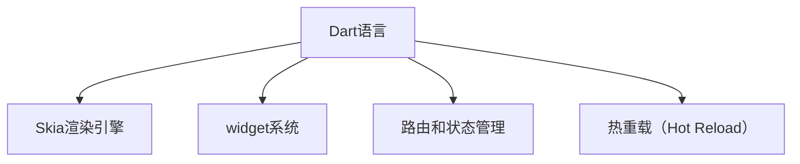

                 

## 1. 背景介绍

### 1.1 问题由来
现代移动互联网应用对性能和用户体验的要求日益提升，传统的Web开发方式已难以满足移动平台的高性能需求。然而，跨平台开发框架Flutter的横空出世，极大地简化了移动应用的开发过程，使得开发者可以一次编写、多处部署，显著提高了开发效率。

### 1.2 问题核心关键点
Flutter是一款由谷歌开发的跨平台移动应用开发框架，主要通过Dart语言和自定义的渲染引擎，实现了原生级性能的跨平台应用开发。核心优势包括：
- 高性能：使用Skia渲染引擎，图形渲染速度快。
- 丰富的UI组件：提供上千种UI组件，易于构建复杂界面。
- 热重载（Hot Reload）：实时预览，快速迭代。
- 快速开发：提供内置UI构建工具Flutter Designer。
- 平台原生支持：支持iOS和Android，并进一步扩展到Web和桌面平台。

Flutter的出现不仅提升了跨平台开发的效率，还显著降低了维护成本，成为移动应用开发的热门选择。本文将系统性地介绍Flutter框架的核心概念、技术原理和应用实践，帮助开发者全面掌握其优势和使用方法。

## 2. 核心概念与联系

### 2.1 核心概念概述

Flutter框架由以下几个核心组件构成：

- **Dart语言**：Flutter的开发语言，简洁且面向对象，语法类似Java。
- **Skia渲染引擎**：谷歌开源的2D图形库，支持硬件加速，提供流畅的动画和高质量的图形渲染。
- **widget系统**：由一组UI组件（widget）构成，用于构建用户界面。
- **路由和状态管理**：提供内置的路由系统和状态管理工具，管理应用的生命周期和组件状态。
- **热重载（Hot Reload）**：在开发和测试过程中，实时展示代码修改后的UI效果。

这些核心组件通过良好的设计和紧密的协作，共同构建了Flutter框架，使其能够快速、高效地开发出高质量的移动应用。

### 2.2 核心概念原理和架构的 Mermaid 流程图(Mermaid 流程节点中不要有括号、逗号等特殊字符)


## 3. 核心算法原理 & 具体操作步骤
### 3.1 算法原理概述

Flutter的核心算法主要围绕以下两个方面展开：

- **跨平台渲染**：Flutter通过Skia渲染引擎实现跨平台的图形渲染，确保不同平台上的应用具有相同的高性能表现。
- **组件驱动的UI构建**：Flutter采用widget系统进行UI构建，每个widget负责渲染自身以及子widget，从而实现高效的UI更新。

### 3.2 算法步骤详解

#### 3.2.1 渲染引擎

Skia渲染引擎是Flutter的核心组件，支持多种后端图形加速技术，包括CPU、GPU和Vulkan。其基本工作流程如下：

1. **屏幕分片（Screen Tiling）**：将屏幕分成若干块，每个块称为一个分片（Tile）。
2. **绘制分片（Draw Tile）**：对每个分片进行绘制，最终生成渲染结果。
3. **合并分片（Merge Tiles）**：将绘制完成的各分片合并，输出完整的屏幕渲染结果。

#### 3.2.2 组件系统

Flutter的组件系统基于widget层次结构，每个widget负责渲染自身以及子widget。组件系统的工作流程如下：

1. **创建widget树**：根据组件树创建widget树，每个widget由其状态和属性驱动。
2. **更新widget树**：当组件状态或属性发生变化时，Flutter会更新widget树，并重新计算widget树结构。
3. **渲染widget树**：对更新后的widget树进行渲染，生成最终的屏幕渲染结果。

### 3.3 算法优缺点

Flutter的优点在于其高性能和跨平台特性，能够有效提升开发效率和应用性能。其缺点在于：

- **学习曲线陡峭**：Dart语言和组件系统的抽象层可能使初学者难以快速上手。
- **内存管理复杂**：组件树的动态更新可能导致内存泄漏和性能问题。
- **依赖性问题**：Flutter依赖于Skia和Dart语言，更新这些依赖可能会影响应用稳定性和兼容性。

### 3.4 算法应用领域

Flutter主要应用于以下领域：

- **跨平台应用开发**：适用于iOS、Android和Web平台，能够快速开发高质量的跨平台应用。
- **游戏开发**：支持高性能图形渲染和动画效果，适用于移动游戏开发。
- **智能穿戴设备**：支持Google Fit API和传感器接口，适用于智能穿戴设备开发。
- **桌面应用**：通过Flutter for Desktop扩展，支持桌面平台开发。

## 4. 数学模型和公式 & 详细讲解 & 举例说明（备注：数学公式请使用latex格式，latex嵌入文中独立段落使用 $$，段落内使用 $)
### 4.1 数学模型构建

Flutter的数学模型主要围绕渲染引擎和组件系统展开，以下是一个简化的数学模型：

设屏幕分片大小为$n\times n$，每个分片由$x$个像素组成，渲染引擎的计算复杂度为$O(n^2)$。假设渲染引擎的计算时间为$t$，则整个屏幕的渲染时间为$T = n^2 \times t$。

### 4.2 公式推导过程

1. **屏幕分片（Screen Tiling）**：将屏幕划分为$m \times n$个分片，每个分片的计算复杂度为$O(n^2)$，则总计算复杂度为$O(n^2 \times m \times n) = O(n^3 \times m)$。
2. **绘制分片（Draw Tile）**：对每个分片进行绘制，时间复杂度为$O(n^2)$。
3. **合并分片（Merge Tiles）**：将绘制完成的分片合并，时间复杂度为$O(n^2)$。

### 4.3 案例分析与讲解

以一个简单的矩形widget为例，计算其渲染时间。设widget的宽度为$w$，高度为$h$，渲染时间为$t$，则总渲染时间为$T = w \times h \times t$。当$w$和$h$增大时，渲染时间呈平方关系增长，因此需要合理管理widget的大小和层级，避免渲染性能下降。

## 5. 项目实践：代码实例和详细解释说明
### 5.1 开发环境搭建

Flutter开发环境包括Dart语言、Skia渲染引擎、组件系统等组件，需要在Android或iOS平台上搭建。以下是一个基本的开发环境搭建流程：

1. 安装Android Studio或Xcode。
2. 安装Flutter SDK，并配置环境变量。
3. 创建新项目，选择Android或iOS平台。
4. 配置依赖和插件，如Google Services、Firebase等。

### 5.2 源代码详细实现

以下是一个简单的Flutter应用实现示例：

```dart
import 'package:flutter/material.dart';

void main() {
  runApp(MyApp());
}

class MyApp extends StatelessWidget {
  @override
  Widget build(BuildContext context) {
    return MaterialApp(
      home: Scaffold(
        appBar: AppBar(
          title: Text('Flutter App'),
        ),
        body: Center(
          child: Column(
            mainAxisAlignment: MainAxisAlignment.center,
            children: <Widget>[
              Text('Hello, Flutter!'),
            ],
          ),
        ),
      ),
    );
  }
}
```

### 5.3 代码解读与分析

以上代码展示了Flutter应用的构建过程。主要步骤如下：

- **MaterialApp**：创建应用入口，指定Home组件。
- **Scaffold**：创建页面布局，包含AppBar和Body。
- **AppBar**：设置页面标题。
- **Text**：显示文本信息。

Flutter通过简洁的API和组件系统，使得开发者能够快速构建UI界面。

### 5.4 运行结果展示

运行上述代码，将生成一个简单的Flutter应用，页面中央显示“Hello, Flutter!”。通过热重载功能，可以实时预览代码修改后的效果。

## 6. 实际应用场景
### 6.1 智能穿戴设备

Flutter框架支持Google Fit API和传感器接口，能够轻松开发智能穿戴设备应用。例如，可以利用Flutter开发一款健身应用，实时监测用户的运动数据，并通过手机应用提供健康建议。

### 6.2 游戏开发

Flutter的高性能渲染引擎和丰富的UI组件，使其成为移动游戏开发的理想选择。例如，可以开发一款基于Flutter的游戏应用，提供流畅的动画和图形渲染效果。

### 6.3 桌面应用

通过Flutter for Desktop扩展，可以开发跨平台的桌面应用。例如，可以开发一款基于Flutter的文本编辑器，支持跨平台部署。

### 6.4 未来应用展望

未来，Flutter框架将持续演进，带来更多的功能和优化。以下是对其未来发展的几点展望：

- **更丰富的UI组件**：Flutter社区将不断推出新的UI组件，提升开发效率和用户体验。
- **更好的性能优化**：通过改进渲染引擎和组件系统，进一步提升应用性能和稳定性。
- **更多平台支持**：支持更多的平台，如Web、macOS、Windows等，扩展其应用场景。
- **更好的开发工具**：提供更强大的开发工具和插件，如Flutter Designer、Flutter Wave等。

## 7. 工具和资源推荐
### 7.1 学习资源推荐

1. **Flutter官方文档**：详细介绍了Flutter框架的核心概念和API，是学习Flutter的必备资源。
2. **Flutter官网教程**：提供大量示例代码和开发指南，帮助开发者快速上手。
3. **Dart语言官方文档**：Dart语言是Flutter的开发语言，需掌握其语法和特性。
4. **Flutter插件市场**：丰富的插件库，方便开发者快速集成第三方功能。
5. **Flutter社区**：活跃的社区交流平台，提供技术支持和资源共享。

### 7.2 开发工具推荐

1. **Android Studio**：Android平台的首选开发工具，提供强大的Android插件支持。
2. **Xcode**：iOS平台的首选开发工具，支持Flutter for iOS扩展。
3. **Visual Studio Code**：轻量级的开发工具，支持Dart语言和Flutter插件。
4. **Flutter Designer**：基于Sketch和Photoshop的工具，支持UI设计和热重载预览。
5. **GitHub**：代码托管平台，提供社区支持和技术交流。

### 7.3 相关论文推荐

1. **Flutter: Fast, Beautiful, Declarative Mobile Apps with Dart**：谷歌发布的文章，介绍了Flutter框架的核心概念和优势。
2. **Rendering and Layout in Flutter**：详细介绍了Skia渲染引擎和组件系统的实现原理。
3. **Hot Reload and Dynamic Analysis for Mobile App Development**：介绍了热重载技术在移动应用开发中的重要性。

## 8. 总结：未来发展趋势与挑战
### 8.1 研究成果总结

Flutter框架通过其高性能和跨平台特性，极大提升了移动应用开发效率和用户体验。其主要研究成果包括：

- **Skia渲染引擎**：提供了高质量的图形渲染和硬件加速支持。
- **组件系统**：支持灵活的UI构建和动态渲染。
- **热重载技术**：实时预览代码修改效果，提升开发效率。

### 8.2 未来发展趋势

Flutter框架的未来发展趋势包括：

- **更丰富的UI组件**：提升UI构建效率和用户体验。
- **更好的性能优化**：提升应用性能和稳定性。
- **更多平台支持**：扩展应用场景，支持更多平台。
- **更好的开发工具**：提供更强大的开发工具和插件。

### 8.3 面临的挑战

Flutter框架面临的挑战包括：

- **学习曲线陡峭**：Dart语言和组件系统的抽象层可能使初学者难以快速上手。
- **内存管理复杂**：组件树的动态更新可能导致内存泄漏和性能问题。
- **依赖性问题**：依赖于Skia和Dart语言，更新这些依赖可能会影响应用稳定性和兼容性。

### 8.4 研究展望

未来，Flutter框架需要持续改进，以应对不断变化的技术需求和市场挑战。以下是对其研究展望：

- **更灵活的内存管理**：改进内存管理机制，优化组件树的渲染性能。
- **更丰富的插件生态**：拓展插件生态，提升应用功能的丰富性。
- **更强大的社区支持**：加强社区交流和技术支持，促进Flutter生态系统的健康发展。

## 9. 附录：常见问题与解答

**Q1: Flutter的内存管理是如何实现的？**

A: Flutter的内存管理主要依赖于组件树和组件的生命周期管理。当组件树更新时，Flutter会重新计算和渲染组件树，确保内存的合理分配和回收。同时，Flutter还提供了Stateful和Stateless组件，分别对应有状态和无状态的组件，合理使用可以有效避免内存泄漏。

**Q2: 如何使用热重载（Hot Reload）功能？**

A: 在Flutter项目中，可以通过编辑器设置热重载功能，实时预览代码修改后的UI效果。具体步骤如下：

1. 安装Flutter SDK，并配置环境变量。
2. 创建一个新的Flutter项目。
3. 在编辑器中打开项目，并启用热重载功能。
4. 修改代码后，Flutter将自动重新加载应用，展示新的UI效果。

**Q3: Flutter在跨平台应用开发中有什么优势？**

A: Flutter在跨平台应用开发中的主要优势包括：

1. 一次编写、多处部署：Flutter可以同时支持Android和iOS平台，代码复用率高。
2. 高性能渲染：Flutter使用Skia渲染引擎，提供流畅的动画和高质量的图形渲染。
3. 丰富的UI组件：Flutter提供了上千种UI组件，易于构建复杂界面。
4. 热重载功能：Flutter支持热重载功能，实时预览代码修改后的效果，提升开发效率。
5. 灵活的路由和状态管理：Flutter内置了路由和状态管理工具，便于管理应用的生命周期和组件状态。

通过Flutter框架，开发者可以轻松开发高质量的跨平台应用，提升开发效率和用户体验。

---

作者：禅与计算机程序设计艺术 / Zen and the Art of Computer Programming

