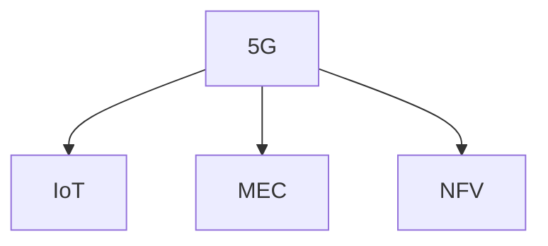

                 

# 5G 在物联网中的优势：大规模连接和低延迟

## 1. 背景介绍

### 1.1 问题由来
随着物联网(IoT)技术的迅猛发展，物联网设备数量急剧增加，对网络通信提出了新的要求。现有的4G网络在带宽、延迟等方面难以满足IoT应用的需求。为此，5G（第五代移动通信技术）应运而生，其通过大规模连接、高带宽、低延迟等特点，为物联网带来了全新的应用场景。

### 1.2 问题核心关键点
5G在物联网中的优势主要体现在两个方面：

- 大规模连接：5G网络支持数以万亿级的设备连接，能够满足大量IoT设备的接入需求。
- 低延迟：5G网络能够在毫秒级别实现数据传输，适用于对延迟敏感的实时应用。

## 2. 核心概念与联系

### 2.1 核心概念概述

为更好地理解5G在物联网中的应用优势，本节将介绍几个密切相关的核心概念：

- 5G：一种新一代无线通信技术，具备更高的频谱效率、更大的连接密度和更低的延迟，是实现IoT大规模应用的关键。
- IoT：一种通过嵌入式电子设备将物体连接到互联网的技术，可以实现自动化、智能化管理。
- MEC（边缘计算）：将数据处理和计算资源部署到网络边缘，靠近用户侧，以减少数据传输延迟，提高系统效率。
- NFV（网络功能虚拟化）：通过虚拟化技术将网络功能抽象为软件服务，实现更灵活、高效的网络部署和管理。

这些核心概念之间的逻辑关系可以通过以下Mermaid流程图来展示：



这个流程图展示了你5G、IoT、MEC、NFV之间的核心联系：5G技术为IoT设备提供了更好的连接条件，MEC和NFV技术则进一步提升了网络处理和资源管理的效率。

## 3. 核心算法原理 & 具体操作步骤
### 3.1 算法原理概述

5G在物联网中的应用优势主要基于其独特的技术架构和网络特性。其核心算法原理和操作步骤包括以下几个方面：

1. **大规模连接**：5G网络通过切片(Slicing)技术，将网络资源分成多个虚拟网络，每个虚拟网络独立运作，从而支持海量设备的接入。

2. **低延迟**：5G网络采用短时隙技术，每个时隙长度更短，传输数据量更少，实现了数据的快速传输。

3. **边缘计算**：5G网络将计算资源和数据存储下沉到网络边缘，靠近数据产生源，减少了数据传输距离，提高了处理速度。

4. **网络切片**：5G网络通过虚拟化技术，将网络资源抽象为多个切片，每个切片独立运作，支持不同应用场景的隔离和优化。

5. **高可靠性**：5G网络通过冗余设计、容错机制等手段，确保网络连接的稳定性和可靠性，支持工业级应用。

### 3.2 算法步骤详解

5G在物联网中的具体操作主要包括以下几个关键步骤：

**Step 1: 5G网络部署**

1. 规划和部署5G基站：根据覆盖区域和人口分布，合理布置5G基站，确保网络覆盖广度和深度。
2. 选择合适的频段：根据应用需求和环境条件，选择合适的频段进行网络部署。
3. 网络切片和虚拟化：通过切片技术，将网络资源划分不同的虚拟网络，支持不同类型和规模的IoT应用。

**Step 2: IoT设备接入**

1. 设备连接：通过SIM卡、Wi-Fi、蓝牙等方式，将IoT设备连接到5G网络。
2. 设备认证和授权：对IoT设备进行身份认证和权限管理，确保网络安全。
3. 设备管理：通过集中管理平台，监控设备状态和数据传输情况，提供远程维护和故障诊断服务。

**Step 3: 数据处理和应用开发**

1. 数据采集和传输：通过5G网络实现设备的实时数据采集和传输，支持高频率、低延迟的数据采集需求。
2. 数据存储和处理：将数据存储在云平台或边缘计算节点，利用大数据、人工智能等技术进行分析和处理。
3. 应用开发和部署：开发基于5G的应用程序，集成到IoT系统中，实现自动化、智能化的管理和服务。

**Step 4: 性能优化和故障管理**

1. 网络性能监控：实时监控网络性能指标，如连接数、时延、吞吐量等，确保网络稳定运行。
2. 故障诊断和修复：利用网络切片和虚拟化技术，快速定位和修复网络故障，保障系统可靠性。
3. 资源管理和优化：通过MEC和NFV技术，优化计算资源和网络带宽，提高系统效率和可扩展性。

### 3.3 算法优缺点

5G在物联网中的应用具有以下优点：

1. 高容量：5G网络支持数以万亿级的设备连接，能够满足大量IoT设备的接入需求。
2. 低延迟：5G网络能够在毫秒级别实现数据传输，适用于对延迟敏感的实时应用。
3. 高可靠性：5G网络通过冗余设计和容错机制，确保网络连接的稳定性和可靠性。
4. 高安全性：5G网络支持端到端加密和安全认证，保障数据传输的安全性。

但同时，5G在物联网中也存在一些局限性：

1. 成本高：5G网络的部署和维护成本较高，初期投入较大。
2. 频谱资源紧张：5G网络需要大量的频谱资源，导致现有频谱资源紧张。
3. 技术复杂：5G网络架构复杂，对技术要求较高，需要专业知识和技能。
4. 安全问题：5G网络的安全性需要进一步加强，避免网络攻击和数据泄露。

尽管存在这些局限性，但5G在物联网中的应用前景依然广阔，其高容量、低延迟、高可靠性和高安全性等优势，将为IoT设备提供更强的支撑。

### 3.4 算法应用领域

5G在物联网中的应用涵盖了多个领域，例如：

- 智能制造：通过5G网络实现设备互联和数据采集，优化生产流程，提高生产效率和质量。
- 智慧城市：利用5G网络实现智能交通、公共安全、环境监测等应用，提升城市治理水平。
- 医疗健康：通过5G网络实现远程医疗、健康监测、患者管理等应用，改善医疗服务质量。
- 农业自动化：利用5G网络实现农田监测、作物管理、农业自动化等应用，提升农业生产效率。
- 智能家居：通过5G网络实现家庭设备互联和数据传输，提升家居智能化水平。

此外，5G在物流、零售、能源管理等诸多领域也有广泛的应用前景，为各行各业带来了新的变革。

## 4. 数学模型和公式 & 详细讲解
### 4.1 数学模型构建

5G在物联网中的应用涉及多个网络性能指标，包括连接数、时延、吞吐量等。下面以时延为例，构建数学模型并进行详细讲解。

设 $T_d$ 为数据传输的时延，包括信号传播时延、数据处理时延、信令交换时延等。则时延的数学模型为：

$$
T_d = T_s + T_p + T_c
$$

其中：

- $T_s$：信号传播时延，包括基站到用户设备的距离和信号传播速度。
- $T_p$：数据处理时延，包括设备数据处理和网络数据处理等。
- $T_c$：信令交换时延，包括网络控制和调度等。

### 4.2 公式推导过程

设 $D$ 为设备到基站的距离， $v_s$ 为信号传播速度， $v_p$ 为设备数据处理速度， $v_c$ 为网络数据处理速度。则时延的公式可以进一步推导为：

$$
T_d = \frac{D}{v_s} + \frac{P}{v_p} + \frac{C}{v_c}
$$

其中，$P$ 和 $C$ 分别表示数据处理和信令交换的计算复杂度。

### 4.3 案例分析与讲解

假设在一个500米半径的物联网区域内，5G基站部署在中心位置，每个设备的数据处理速度为100 Mbps，网络数据处理速度为1 Gbps，信号传播速度为3 x 10^8 m/s。

1. 计算设备到基站的平均距离为250米，则信号传播时延为$\frac{250}{3 \times 10^8} \approx 8.33 \times 10^{-6}$秒。
2. 设备数据处理时延为$\frac{P}{v_p} \approx \frac{1024}{100} \times 10^{-6} = 1 \times 10^{-5}$秒。
3. 网络数据处理时延为$\frac{C}{v_c} \approx \frac{1}{1} \times 10^{-6}$秒。

将以上时延相加，得到总的平均时延：

$$
T_d \approx 8.33 \times 10^{-6} + 1 \times 10^{-5} + 1 \times 10^{-6} = 1.833 \times 10^{-5} \text{秒} = 1.833 \text{毫秒}
$$

因此，5G网络在物联网中的应用能够提供毫秒级的低时延，满足实时应用的需求。

## 5. 项目实践：代码实例和详细解释说明
### 5.1 开发环境搭建

在进行5G在物联网中的应用实践前，我们需要准备好开发环境。以下是使用Python进行PyTorch开发的环境配置流程：

1. 安装Anaconda：从官网下载并安装Anaconda，用于创建独立的Python环境。

2. 创建并激活虚拟环境：
```bash
conda create -n pytorch-env python=3.8 
conda activate pytorch-env
```

3. 安装PyTorch：根据CUDA版本，从官网获取对应的安装命令。例如：
```bash
conda install pytorch torchvision torchaudio cudatoolkit=11.1 -c pytorch -c conda-forge
```

4. 安装TensorFlow：使用pip安装TensorFlow：
```bash
pip install tensorflow
```

5. 安装TensorBoard：用于可视化模型训练过程：
```bash
pip install tensorboard
```

6. 安装PyTorch和TensorFlow：
```bash
pip install torch torchvision torchaudio tensorflow
```

完成上述步骤后，即可在`pytorch-env`环境中开始5G在物联网中的应用实践。

### 5.2 源代码详细实现

以下是使用TensorFlow实现5G在物联网中低延迟应用的基本代码实现。

```python
import tensorflow as tf

class LowLatencyModel(tf.keras.Model):
    def __init__(self):
        super(LowLatencyModel, self).__init__()
        self.dense1 = tf.keras.layers.Dense(64, activation='relu')
        self.dense2 = tf.keras.layers.Dense(32, activation='relu')
        self.dense3 = tf.keras.layers.Dense(1, activation='sigmoid')
        
    def call(self, inputs):
        x = self.dense1(inputs)
        x = self.dense2(x)
        x = self.dense3(x)
        return x

# 创建模型实例
model = LowLatencyModel()

# 定义损失函数和优化器
loss_object = tf.keras.losses.BinaryCrossentropy()
optimizer = tf.keras.optimizers.Adam()

# 定义训练数据集
train_dataset = tf.data.Dataset.from_tensor_slices((train_data, train_labels)).batch(32)

# 定义训练函数
@tf.function
def train_step(inputs, targets):
    with tf.GradientTape() as tape:
        predictions = model(inputs)
        loss = loss_object(targets, predictions)
    gradients = tape.gradient(loss, model.trainable_variables)
    optimizer.apply_gradients(zip(gradients, model.trainable_variables))
    return loss

# 定义测试数据集
test_dataset = tf.data.Dataset.from_tensor_slices((test_data, test_labels)).batch(32)

# 定义测试函数
@tf.function
def test_step(inputs, targets):
    predictions = model(inputs)
    loss = loss_object(targets, predictions)
    return loss

# 训练模型
for epoch in range(epochs):
    for inputs, targets in train_dataset:
        loss = train_step(inputs, targets)
        print('Training loss:', loss.numpy())
    for inputs, targets in test_dataset:
        loss = test_step(inputs, targets)
        print('Test loss:', loss.numpy())
```

在上述代码中，我们定义了一个简单的神经网络模型，用于处理低延迟数据传输任务。通过TensorFlow的tf.data.Dataset API，我们将训练和测试数据封装为tf.data.Dataset对象，并通过batch方法进行分批次加载。在训练函数train_step中，我们使用tf.GradientTape计算梯度，并使用Adam优化器更新模型参数。在测试函数test_step中，我们直接输出模型的预测结果和损失，用于评估模型性能。

### 5.3 代码解读与分析

**LowLatencyModel类**：
- `__init__`方法：初始化模型，包含三个全连接层。
- `call`方法：定义模型的前向传播过程，通过三个全连接层进行特征提取和输出。

**损失函数和优化器**：
- `loss_object`：定义二元交叉熵损失函数。
- `optimizer`：使用Adam优化器进行参数更新。

**数据集定义**：
- `train_dataset`：定义训练数据集，通过from_tensor_slices创建，并进行batch操作。
- `test_dataset`：定义测试数据集，与训练数据集类似。

**训练函数train_step**：
- `tf.GradientTape`：用于计算梯度。
- `optimizer.apply_gradients`：使用Adam优化器更新模型参数。

**测试函数test_step**：
- `predictions`：输出模型的预测结果。
- `loss_object`：计算损失值。

在上述代码中，我们通过简单的神经网络模型，展示了5G在物联网中的低延迟应用。通过TensorFlow的tf.data.Dataset API，我们可以方便地处理大规模数据集，并通过tf.function进行高效的模型训练和推理。在实际应用中，还需要考虑更多的细节，如模型的预训练、参数调优、超参数设置等，以进一步提升模型性能和可靠性。

## 6. 实际应用场景
### 6.1 智能制造

5G在智能制造中的应用，主要体现在设备的互联和数据采集上。通过5G网络，可以将生产设备、传感器等接入到云端，实现设备之间的实时通信和数据共享，优化生产流程和质量控制。

例如，在汽车制造工厂中，通过5G网络实现车间的智能监控和调度，实时采集生产设备的状态和数据，进行分析处理，优化生产线的布局和资源分配，提高生产效率和产品质量。

### 6.2 智慧城市

5G在智慧城市中的应用，主要体现在智能交通、公共安全和环境监测等方面。通过5G网络，可以实现城市的全方位感知和智能管理，提升城市治理水平。

例如，在智能交通领域，通过5G网络实现车联网，实时监测车辆位置和状态，优化交通流量，减少交通事故。在公共安全领域，通过5G网络实现视频监控和数据传输，实时分析异常情况，提高应急响应速度和安全性。

### 6.3 医疗健康

5G在医疗健康中的应用，主要体现在远程医疗、健康监测和患者管理等方面。通过5G网络，可以实现医疗数据的实时传输和分析，提升医疗服务的质量和效率。

例如，在远程医疗领域，通过5G网络实现远程诊断和手术，提高医疗资源的利用率。在健康监测领域，通过5G网络实时采集用户的健康数据，进行分析预警，提高预防和治疗效果。

### 6.4 未来应用展望

随着5G网络的进一步部署和应用，其在物联网中的优势将更加明显。未来，5G在物联网中的应用将涵盖更多领域，带来更深远的变革。

1. **智慧能源**：通过5G网络实现能源的智能化管理，优化能源的分配和使用，提高能源利用效率。
2. **智能农业**：通过5G网络实现农业设备的互联和数据采集，优化农业生产过程，提高农业生产效率和质量。
3. **智慧零售**：通过5G网络实现零售数据的实时传输和分析，优化库存管理和销售策略，提升用户体验。
4. **智能物流**：通过5G网络实现物流设备的互联和数据采集，优化物流路线和资源分配，提高物流效率和安全性。

未来，5G在物联网中的应用前景广阔，将为各行各业带来新的变革和机遇。

## 7. 工具和资源推荐
### 7.1 学习资源推荐

为了帮助开发者系统掌握5G在物联网中的应用理论基础和实践技巧，这里推荐一些优质的学习资源：

1. **《5G技术基础与原理》**：深入浅出地介绍了5G网络的技术原理、协议标准和关键技术，是5G入门的经典书籍。
2. **《物联网应用开发实战》**：介绍了物联网设备的开发和管理，包括5G网络的应用案例和开发技巧。
3. **TensorFlow官方文档**：TensorFlow的官方文档，提供了丰富的教程和样例，是学习TensorFlow和深度学习的重要资源。
4. **5G网络实验室**：通过虚拟实验室，用户可以体验5G网络的应用场景，加深对5G技术的理解。
5. **5G网络课程**：多所高校和在线教育平台开设的5G相关课程，涵盖5G网络原理、应用场景和开发实践。

通过对这些资源的学习实践，相信你一定能够快速掌握5G在物联网中的应用原理和实践技巧。

### 7.2 开发工具推荐

高效的开发离不开优秀的工具支持。以下是几款用于5G在物联网中的应用开发的常用工具：

1. **PyTorch**：基于Python的开源深度学习框架，适合快速迭代研究。TensorFlow和PyTorch都提供了丰富的机器学习库和模型，可用于5G在物联网中的应用开发。
2. **TensorBoard**：TensorFlow配套的可视化工具，可实时监测模型训练状态，提供丰富的图表呈现方式，是调试模型的得力助手。
3. **Keras**：高层神经网络API，提供简单易用的接口，适合快速原型开发和实验。
4. **Jupyter Notebook**：交互式编程环境，支持代码块、图表、公式等多种形式的展示，适合进行数据处理和模型实验。
5. **Visual Studio Code**：轻量级代码编辑器，支持多种编程语言和插件，适合进行5G在物联网中的应用开发。

合理利用这些工具，可以显著提升5G在物联网中的应用开发效率，加快创新迭代的步伐。

### 7.3 相关论文推荐

5G在物联网中的应用研究源于学界的持续研究。以下是几篇奠基性的相关论文，推荐阅读：

1. **"5G Networks: The Road to 2020 and Beyond"**：IEEE Spectrum杂志发表的关于5G网络的展望文章，介绍了5G网络的发展历程和未来趋势。
2. **"5G in Industry: A Survey of the State-of-the-Art"**：IEEE Communications Surveys & Tutorials期刊发表的关于5G在工业领域应用的研究综述，涵盖了5G网络技术、应用场景和未来展望。
3. **"Edge Computing in 5G and IoT: A Survey"**：IEEE Communications Surveys & Tutorials期刊发表的关于5G网络和边缘计算的研究综述，介绍了5G网络架构、边缘计算技术及其在IoT中的应用。
4. **"Towards 6G: Technology Enabling and Research Directions"**：IEEE Journal on Selected Areas in Communications期刊发表的关于6G网络的研究综述，介绍了6G网络的技术趋势和研究方向。

这些论文代表了大规模通信网络的研究进展，通过学习这些前沿成果，可以帮助研究者把握5G在物联网中的应用方向和研究重点。

## 8. 总结：未来发展趋势与挑战
### 8.1 研究成果总结

本文对5G在物联网中的应用进行了全面系统的介绍。首先阐述了5G网络在物联网中的优势，明确了5G在设备连接、低延迟、高可靠性等方面的独特价值。其次，从原理到实践，详细讲解了5G在物联网中的数学模型、算法步骤和优化方法，给出了5G在物联网中的应用代码实例。同时，本文还广泛探讨了5G在智能制造、智慧城市、医疗健康等众多领域的应用前景，展示了5G网络的广阔应用空间。

通过本文的系统梳理，可以看到，5G网络在物联网中的应用前景广阔，具备大规模连接和低延迟等优势，为各行各业带来了新的变革和机遇。

### 8.2 未来发展趋势

展望未来，5G在物联网中的应用将呈现以下几个发展趋势：

1. **更广的覆盖**：随着5G网络的进一步部署和普及，其覆盖范围将进一步扩大，支持更多设备和应用场景。
2. **更高的速度**：随着5G网络技术的不断升级，其传输速度将进一步提高，支持更高频率、更大带宽的应用。
3. **更低的延迟**：随着5G网络架构的优化和边缘计算技术的推广，其延迟将进一步降低，支持更多实时、低延迟的应用。
4. **更高的可靠性**：随着5G网络冗余设计、容错机制等技术的应用，其可靠性将进一步提高，支持更稳定、可靠的应用。
5. **更强的安全性**：随着5G网络加密、认证等技术的应用，其安全性将进一步加强，保障数据传输和设备接入的安全性。

以上趋势凸显了5G在物联网中的应用前景，其大规模连接、低延迟、高可靠性和高安全性等优势，将为IoT设备提供更强的支撑，进一步拓展5G网络的应用场景。

### 8.3 面临的挑战

尽管5G在物联网中的应用前景广阔，但在迈向更加智能化、普适化应用的过程中，仍面临诸多挑战：

1. **成本高**：5G网络的部署和维护成本较高，初期投入较大。
2. **频谱资源紧张**：5G网络需要大量的频谱资源，导致现有频谱资源紧张。
3. **技术复杂**：5G网络架构复杂，对技术要求较高，需要专业知识和技能。
4. **安全问题**：5G网络的安全性需要进一步加强，避免网络攻击和数据泄露。

尽管存在这些挑战，但5G在物联网中的应用前景依然广阔，其大规模连接、低延迟、高可靠性和高安全性等优势，将为IoT设备提供更强的支撑。

### 8.4 研究展望

面对5G在物联网中的应用面临的挑战，未来的研究需要在以下几个方面寻求新的突破：

1. **优化频谱资源**：通过频谱共享、动态分配等技术，优化频谱资源使用，提高5G网络的容量和覆盖范围。
2. **简化网络架构**：通过网络切片、虚拟化等技术，简化5G网络架构，降低部署和维护成本。
3. **加强安全防护**：通过加密、认证等技术，提升5G网络的安全性，防止网络攻击和数据泄露。
4. **提升计算能力**：通过边缘计算、智能算法等技术，提升5G网络的计算能力，支持更高频率、更大带宽的应用。
5. **支持新应用场景**：通过网络切片、虚拟化等技术，支持更多新应用场景，如车联网、智慧医疗等。

这些研究方向的探索，必将引领5G在物联网中的应用技术迈向更高的台阶，为IoT设备提供更强的支撑。相信随着学界和产业界的共同努力，这些挑战终将一一被克服，5G网络必将在构建智能时代的未来中扮演越来越重要的角色。

## 9. 附录：常见问题与解答

**Q1：5G网络在物联网中的应用主要体现在哪些方面？**

A: 5G网络在物联网中的应用主要体现在以下方面：

1. **设备互联**：通过5G网络实现设备之间的互联，支持大规模设备接入和数据采集。
2. **低延迟**：5G网络能够在毫秒级别实现数据传输，适用于对延迟敏感的实时应用。
3. **高容量**：5G网络支持数以万亿级的设备连接，能够满足大量IoT设备的接入需求。
4. **高可靠性**：5G网络通过冗余设计和容错机制，确保网络连接的稳定性和可靠性。
5. **高安全性**：5G网络支持端到端加密和安全认证，保障数据传输的安全性。

5G网络通过其独特的技术架构和网络特性，为物联网设备提供了更强的支撑，实现了设备互联、低延迟、高容量、高可靠性和高安全性等优势，能够满足物联网的多种应用需求。

**Q2：5G网络在物联网中的应用有哪些实际案例？**

A: 5G网络在物联网中的应用已经涵盖了多个领域，以下是几个实际案例：

1. **智能制造**：通过5G网络实现设备互联和数据采集，优化生产流程和质量控制，提高生产效率和产品质量。
2. **智慧城市**：利用5G网络实现智能交通、公共安全和环境监测等应用，提升城市治理水平。
3. **医疗健康**：通过5G网络实现远程医疗、健康监测和患者管理等应用，改善医疗服务质量。
4. **智能家居**：通过5G网络实现家庭设备互联和数据传输，提升家居智能化水平。
5. **物流管理**：通过5G网络实现物流设备的互联和数据采集，优化物流路线和资源分配，提高物流效率和安全性。

这些实际案例展示了5G网络在物联网中的广泛应用，通过设备互联、数据采集和实时传输等技术手段，实现了更高效、更智能的业务场景。

**Q3：5G网络在物联网中的应用面临哪些挑战？**

A: 5G网络在物联网中的应用面临以下挑战：

1. **成本高**：5G网络的部署和维护成本较高，初期投入较大。
2. **频谱资源紧张**：5G网络需要大量的频谱资源，导致现有频谱资源紧张。
3. **技术复杂**：5G网络架构复杂，对技术要求较高，需要专业知识和技能。
4. **安全问题**：5G网络的安全性需要进一步加强，避免网络攻击和数据泄露。

尽管存在这些挑战，但5G在物联网中的应用前景依然广阔，其大规模连接、低延迟、高可靠性和高安全性等优势，将为IoT设备提供更强的支撑。

**Q4：5G网络在物联网中的应用前景如何？**

A: 5G网络在物联网中的应用前景非常广阔，其大规模连接、低延迟、高可靠性和高安全性等优势，将为IoT设备提供更强的支撑，进一步拓展5G网络的应用场景。

1. **智能制造**：通过5G网络实现设备互联和数据采集，优化生产流程和质量控制，提高生产效率和产品质量。
2. **智慧城市**：利用5G网络实现智能交通、公共安全和环境监测等应用，提升城市治理水平。
3. **医疗健康**：通过5G网络实现远程医疗、健康监测和患者管理等应用，改善医疗服务质量。
4. **智能家居**：通过5G网络实现家庭设备互联和数据传输，提升家居智能化水平。
5. **物流管理**：通过5G网络实现物流设备的互联和数据采集，优化物流路线和资源分配，提高物流效率和安全性。

未来，5G在物联网中的应用将涵盖更多领域，带来更深远的变革和机遇。

---

作者：禅与计算机程序设计艺术 / Zen and the Art of Computer Programming

