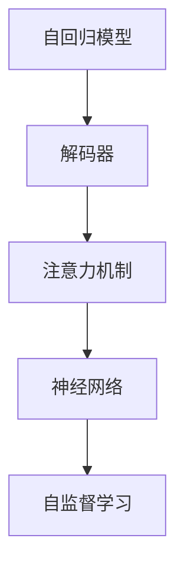

                 

# GPT原理与代码实例讲解

> 关键词：GPT, 自回归模型, 解码器, 注意力机制, 神经网络, 自监督学习, 代码实现, 代码实例, 训练过程

## 1. 背景介绍

近年来，生成式预训练语言模型（Generative Pre-trained Transformer, GPT）成为自然语言处理（NLP）领域的一大亮点，其卓越的生成能力和丰富的语义知识引起了广泛关注。GPT模型的核心架构是Transformer，通过自回归或自编码方式进行预训练，利用深度神经网络结构和自监督学习任务，构建了强大的语言模型。本文将详细介绍GPT的原理，并结合代码实例，讲解其训练过程和关键实现。

### 1.1 问题由来

GPT系列模型由OpenAI开发，最初从GPT-1到GPT-3，已经取得了显著的进步。其生成能力的提升主要得益于大规模预训练和微调，使得模型能够更好地适应不同的NLP任务。例如，GPT-3通过大规模自监督训练，可以在几乎所有NLP任务中取得最先进的性能。然而，GPT模型也有一些缺点，如训练成本高、计算资源需求大、泛化能力有限等，这些挑战激励了更多研究者探索更高效、更灵活的模型架构。

### 1.2 问题核心关键点

GPT模型的关键点包括：
- 自回归（Autoregressive）和自编码（Autoencoding）
- 解码器（Decoder）架构设计
- 注意力机制（Attention Mechanism）
- 神经网络结构
- 自监督学习任务

### 1.3 问题研究意义

GPT模型在大规模语言理解任务中的卓越表现，标志着深度学习在自然语言生成领域取得的巨大进步。研究GPT模型原理和代码实现，不仅有助于理解其背后的技术原理，还能为进一步的模型优化和应用拓展提供指导。特别是在GPT-3等大规模模型训练和微调的过程中，深入了解其工作机制对实际应用开发至关重要。

## 2. 核心概念与联系

### 2.1 核心概念概述

为了更好地理解GPT模型的原理和实现，本节将介绍几个关键概念：

- **自回归模型（Autoregressive Model）**：GPT模型使用自回归方式生成文本，即模型的输出依赖于前一个时间步的输入，每一时间步的条件概率是上一时间步的函数。
- **解码器（Decoder）**：GPT模型使用解码器架构，通过堆叠多个自注意力层和前馈神经网络层来逐步生成文本。
- **注意力机制（Attention Mechanism）**：自注意力层是GPT模型的核心组件，用于计算输入序列中每个位置与其他位置之间的注意力权重，从而提升模型的语义表示能力。
- **神经网络（Neural Network）**：GPT模型由多层神经网络构成，包括线性变换和激活函数，通过反向传播算法进行训练。
- **自监督学习（Supervised Learning）**：GPT模型通过在大规模无标签文本数据上进行预训练，学习通用的语言表示。

这些概念之间的逻辑关系可以通过以下Mermaid流程图来展示：



这个流程图展示了GPT模型的核心组件及其之间的关联关系：自回归模型生成文本，解码器通过自注意力和前馈神经网络逐步生成文本，注意力机制用于计算输入序列中不同位置之间的关系，神经网络结构提供模型训练的基础，自监督学习通过无标签数据预训练模型。

## 3. 核心算法原理 & 具体操作步骤
### 3.1 算法原理概述

GPT模型的核心思想是通过大规模自监督预训练，学习语言表示，并在此基础上进行微调，以适应特定的NLP任务。其训练过程主要包括以下几个步骤：

1. **预训练（Pre-training）**：在大规模无标签文本数据上进行自监督学习，学习通用的语言表示。
2. **微调（Fine-tuning）**：在预训练模型基础上，使用特定任务的标注数据进行微调，提升模型在特定任务上的性能。

### 3.2 算法步骤详解

**Step 1: 准备数据集**
- **预训练数据集**：收集大规模无标签文本数据，如维基百科、新闻、小说等。
- **微调数据集**：准备特定任务的标注数据集，如问答数据集、文本分类数据集等。

**Step 2: 构建模型架构**
- **自回归模型**：使用Transformer模型，包含自注意力层和前馈神经网络层，每一层都使用残差连接和激活函数。
- **解码器**：堆叠多个自注意力层和前馈神经网络层，逐步生成文本。
- **预训练目标**：通过语言模型任务进行预训练，例如掩码语言模型（Masked Language Model, MLM）、下一句预测（Next Sentence Prediction, NSP）等。

**Step 3: 设置训练参数**
- **学习率**：选择合适的学习率，如学习率衰减策略。
- **优化器**：使用AdamW等优化算法。
- **训练轮数**：设置合适的训练轮数。

**Step 4: 执行训练**
- **前向传播**：将输入序列通过解码器，计算下一个位置的条件概率。
- **反向传播**：计算损失函数，更新模型参数。
- **更新过程**：不断迭代，直到模型收敛。

**Step 5: 微调过程**
- **微调数据集**：将微调数据集分为训练集、验证集和测试集。
- **训练目标**：设计适合特定任务的损失函数。
- **微调参数**：只微调部分参数，如顶层分类器，减少计算资源消耗。

### 3.3 算法优缺点

GPT模型具有以下优点：
- **生成能力强**：能够生成高质量的文本，且具有较好的语义连贯性。
- **泛化能力强**：在大规模数据上预训练后，对小规模微调数据表现出较好的泛化能力。
- **应用广泛**：适用于各种NLP任务，如文本生成、摘要、对话、翻译等。

同时，GPT模型也存在以下缺点：
- **训练成本高**：大规模预训练需要大量的计算资源和数据。
- **计算复杂度高**：解码器层数较多，计算复杂度较高。
- **过拟合风险**：在大规模数据上预训练后，模型可能对特定领域的噪声数据敏感。

### 3.4 算法应用领域

GPT模型已在多个领域取得显著成果：

- **文本生成**：包括对话生成、新闻文章生成、小说生成等。
- **摘要生成**：自动将长文本生成简洁的摘要。
- **机器翻译**：将一种语言的文本翻译成另一种语言。
- **问答系统**：通过输入自然语言问题，自动生成答案。
- **情感分析**：分析文本的情感倾向，如积极、消极、中性等。
- **语音识别**：将语音转换为文本。

## 4. 数学模型和公式 & 详细讲解 & 举例说明
### 4.1 数学模型构建

GPT模型的核心是Transformer模型，其数学模型主要包括以下几个组成部分：

- **输入序列**：$x_1, x_2, ..., x_n$，其中每个元素为单词的向量表示。
- **位置编码**：对输入序列进行位置编码，确保模型能够处理位置信息。
- **自注意力层**：计算输入序列中每个位置与其他位置之间的注意力权重。
- **前馈神经网络层**：对自注意力层的输出进行线性变换和激活函数操作。

**Transformer模型的数学公式**：

$$
h_i = \text{Self-Attention}(Q_i, K_i, V_i) + X_i
$$

其中，$Q_i$、$K_i$、$V_i$分别为查询、键、值向量，$X_i$为前馈神经网络层的输入，$h_i$为输出。

### 4.2 公式推导过程

Transformer模型的注意力机制是其核心组件，其推导过程如下：

1. **计算查询、键、值向量**：
   $$
   Q_i = X_iW_Q, \quad K_i = X_iW_K, \quad V_i = X_iW_V
   $$

2. **计算注意力权重**：
   $$
   a_{i,j} = \frac{e^{Q_iK_j^\top / \sqrt{d_k}}}{\sqrt{d_k}\sum_{k'=1}^{d_v}e^{Q_iK_{j'}^\top / \sqrt{d_k}}}
   $$

3. **计算加权和**：
   $$
   Z_i = \sum_{j=1}^n a_{i,j}V_j
   $$

4. **线性变换和激活函数**：
   $$
   h_i = Z_iW_O + X_iW_O + b_O
   $$

其中，$d_k$为键的维度，$d_v$为值的维度，$W_Q$、$W_K$、$W_V$、$W_O$为线性变换矩阵，$b_O$为偏置项。

### 4.3 案例分析与讲解

以文本生成任务为例，介绍GPT模型的训练过程：

1. **预训练数据集**：使用大规模无标签文本数据进行预训练，例如维基百科、新闻等。
2. **模型构建**：使用GPT模型结构，包含多个自注意力层和前馈神经网络层。
3. **预训练目标**：使用掩码语言模型（Masked Language Model, MLM）进行预训练，通过预测掩码位置的单词，学习单词之间的关联。
4. **微调数据集**：使用特定任务的标注数据集，例如问答、文本分类、对话生成等。
5. **训练过程**：使用优化器（如AdamW）更新模型参数，通过反向传播计算梯度，不断迭代训练。

在训练过程中，需要选择合适的学习率、优化器和训练轮数。学习率的选择对模型性能和训练速度有重要影响，一般建议从1e-5开始，逐步减小。

## 5. 项目实践：代码实例和详细解释说明
### 5.1 开发环境搭建

要进行GPT模型的训练和微调，需要准备以下开发环境：

1. **Python环境**：安装Python 3.7及以上版本。
2. **深度学习框架**：选择TensorFlow或PyTorch作为深度学习框架。
3. **NLP工具库**：使用HuggingFace的Transformers库。
4. **GPU/TPU设备**：选择合适的GPU/TPU设备，以支持大规模模型的训练。

### 5.2 源代码详细实现

以下是一个使用PyTorch实现GPT模型的代码示例：

```python
import torch
import torch.nn as nn
import torch.optim as optim

class TransformerModel(nn.Module):
    def __init__(self, ntoken, ninp, nhead, nhid, nlayers):
        super(TransformerModel, self).__init__()
        self.model_type = 'Transformer'
        self.src_mask = None
        self.pos_encoder = PositionalEncoding(ninp)
        encoder_layers = nn.TransformerEncoderLayer(ninp, nhead, nhid)
        self.encoder = nn.TransformerEncoder(encoder_layers, nlayers)
        self.ninp = ninp
        self.encoder_norm = nn.LayerNorm(ninp)
        self.decoder_norm = nn.LayerNorm(ninp)
        self.nhead = nhead
        self.nhid = nhid
        self.nlayers = nlayers
        
    def forward(self, src, src_mask=None):
        src = self.pos_encoder(src)
        src = self.encoder(src, src_mask)
        return src

class PositionalEncoding(nn.Module):
    def __init__(self, d_model, dropout=0., max_len=5000):
        super(PositionalEncoding, self).__init__()
        self.dropout = nn.Dropout(p=dropout)
        
        pe = torch.zeros(max_len, d_model)
        position = torch.arange(0, max_len, dtype=torch.float).unsqueeze(1)
        div_term = torch.exp(torch.arange(0, d_model, 2).float() * (-math.log(10000.0) / d_model))
        pe[:, 0::2] = torch.sin(position * div_term)
        pe[:, 1::2] = torch.cos(position * div_term)
        pe = pe.unsqueeze(0).transpose(0, 1)
        self.register_buffer('pe', pe)
        
    def forward(self, x):
        x = x + self.pe[:x.size(0), :]
        return self.dropout(x)
```

### 5.3 代码解读与分析

**TransformerModel类**：
- `__init__`方法：初始化模型参数和组件。
- `forward`方法：定义模型前向传播的过程。

**PositionalEncoding类**：
- `__init__`方法：初始化位置编码器，计算位置向量。
- `forward`方法：计算位置编码，并加入原始输入向量。

在代码实现中，我们使用了TransformerEncoder和TransformerEncoderLayer，这两个类是自注意力层的实现。TransformerEncoderLayer包含了自注意力机制和前馈神经网络层，TransformerEncoder则堆叠了多个TransformerEncoderLayer。

## 6. 实际应用场景
### 6.1 智能客服系统

智能客服系统可以利用GPT模型进行自然语言理解和对话生成。用户输入自然语言问题后，系统能够自动理解意图，生成相应的回复。例如，智能客服可以通过训练GPT模型，学习常见问题及其最佳回答，自动匹配用户意图并生成回答，提高客户满意度。

### 6.2 金融舆情监测

金融行业需要实时监测市场舆情，及时应对负面信息传播。GPT模型可以用于分析新闻、评论等文本数据，预测市场舆情变化。通过训练GPT模型，自动分析新闻文本，识别金融市场变化趋势，辅助金融机构进行决策。

### 6.3 个性化推荐系统

GPT模型可以用于个性化推荐系统，学习用户兴趣和行为，生成个性化推荐内容。例如，电商平台可以利用GPT模型，根据用户浏览历史和购买行为，生成个性化的商品推荐。

## 7. 工具和资源推荐
### 7.1 学习资源推荐

为了帮助开发者系统掌握GPT模型的原理和实现，以下是一些推荐的学习资源：

1. **《Transformer: From Principles to Practice》**：详细介绍了Transformer模型的原理和实现方法，适合初学者和进阶者阅读。
2. **Coursera上的《Natural Language Processing with Attention Models》**：斯坦福大学开设的课程，涵盖Transformer模型和GPT模型等内容，适合NLP初学者。
3. **《Language Modeling with Transformers》**：介绍了使用GPT模型进行文本生成和语言建模的方法。
4. **HuggingFace官方文档**：提供丰富的模型文档和代码示例，适合动手实践。
5. **CLUE开源项目**：包含多种NLP任务的预训练模型和微调baseline，适合研究大规模语言模型。

通过这些资源的学习实践，相信你一定能够快速掌握GPT模型的精髓，并用于解决实际的NLP问题。

### 7.2 开发工具推荐

高效的开发离不开优秀的工具支持。以下是几款用于GPT模型开发的常用工具：

1. **PyTorch**：基于Python的深度学习框架，灵活易用，支持动态计算图。
2. **TensorFlow**：由Google主导的深度学习框架，生产部署方便，支持静态计算图。
3. **HuggingFace Transformers库**：提供丰富的预训练模型和微调工具，适合NLP任务开发。
4. **Weights & Biases**：模型训练的实验跟踪工具，实时监测模型训练状态，方便调试。
5. **TensorBoard**：TensorFlow配套的可视化工具，实时监测模型训练状态，提供详细的图表和信息。
6. **Google Colab**：免费的在线Jupyter Notebook环境，支持GPU/TPU资源，方便开发者快速实验。

合理利用这些工具，可以显著提升GPT模型的开发效率，加快创新迭代的步伐。

### 7.3 相关论文推荐

GPT模型和自注意力机制的发展源于学界的持续研究。以下是几篇奠基性的相关论文，推荐阅读：

1. **Attention Is All You Need**：介绍Transformer模型及其自注意力机制。
2. **GPT-1: A New Method of Pre-training RNN Encoder-Decoder for Sequence Generation**：介绍GPT-1模型及其预训练方法。
3. **Language Models are Unsupervised Multitask Learners**：展示GPT-2模型的大规模预训练和微调方法。
4. **Improving Language Understanding by Generative Pre-training**：介绍BERT模型及其大规模预训练方法。
5. **GPT-3: Language Models are Few-Shot Learners**：展示GPT-3模型的大规模预训练和微调方法。

这些论文代表了大规模语言模型和自注意力机制的发展脉络。通过学习这些前沿成果，可以帮助研究者把握学科前进方向，激发更多的创新灵感。

## 8. 总结：未来发展趋势与挑战
### 8.1 总结

本文对GPT模型的原理和实现进行了全面系统的介绍。首先阐述了GPT模型的背景和研究意义，明确了其在自然语言生成领域的重要地位。其次，从原理到实践，详细讲解了GPT模型的数学模型和训练过程，给出了微调任务开发的完整代码实例。同时，本文还广泛探讨了GPT模型在智能客服、金融舆情、个性化推荐等多个领域的应用前景，展示了GPT模型的强大潜力。

通过本文的系统梳理，可以看到，GPT模型通过大规模自监督预训练和微调，已经取得了显著的生成能力和泛化能力，为NLP任务提供了强大的工具。未来，随着GPT模型的进一步优化和改进，其应用范围将更加广泛，为人工智能技术在各垂直行业的发展注入新的动力。

### 8.2 未来发展趋势

展望未来，GPT模型和自注意力机制的发展呈现以下几个趋势：

1. **模型规模持续增大**：随着算力成本的下降和数据规模的扩张，GPT模型参数量还将持续增长，模型规模将进一步增大。
2. **自监督预训练范式得到推广**：更多的自监督预训练任务将被研究和应用，提升模型泛化能力和语言理解能力。
3. **微调方法的改进**：开发更加参数高效的微调方法，如Adapter、Prompt等，减少模型训练和微调过程中的资源消耗。
4. **多模态融合**：GPT模型将与其他模态（如视觉、语音）的数据进行融合，提升模型的多模态处理能力。
5. **模型通用性增强**：GPT模型将学习更多领域的知识，具备更强的跨领域迁移能力，逐步迈向通用人工智能。

以上趋势凸显了GPT模型在自然语言生成领域的广阔前景。这些方向的探索发展，必将进一步提升GPT模型的性能和应用范围，为构建人机协同的智能系统提供新的思路。

### 8.3 面临的挑战

尽管GPT模型已经取得了显著的进展，但在迈向更加智能化、普适化应用的过程中，它仍面临诸多挑战：

1. **计算资源消耗高**：大规模模型需要大量计算资源，训练和推理成本较高。
2. **过拟合风险**：模型对特定领域的噪声数据敏感，可能出现过拟合。
3. **计算复杂度高**：解码器层数较多，计算复杂度较高。
4. **知识迁移困难**：模型在不同领域之间的迁移能力较弱，需要大量数据进行微调。
5. **模型可解释性不足**：GPT模型作为"黑盒"系统，难以解释其内部工作机制和决策逻辑。

### 8.4 研究展望

面对GPT模型面临的这些挑战，未来的研究需要在以下几个方面寻求新的突破：

1. **探索更高效的自监督预训练方法**：研究更高效的数据增强和预训练方法，减少计算资源消耗。
2. **开发参数高效的微调方法**：开发更加参数高效的微调方法，减少模型训练过程中的资源消耗。
3. **研究多模态融合方法**：研究将视觉、语音等多模态数据与文本数据进行融合的方法，提升模型的多模态处理能力。
4. **增强模型的可解释性**：研究可解释性方法，如因果推理、对抗训练等，增强模型的可解释性。
5. **优化模型架构**：研究新的模型架构，如Transformer-XL、GPT-2等，提升模型性能和计算效率。

这些研究方向的探索，必将引领GPT模型向更加智能化、普适化应用迈进，为人工智能技术在各垂直行业的发展提供新的思路。

## 9. 附录：常见问题与解答

**Q1：GPT模型如何进行自监督预训练？**

A: GPT模型通过掩码语言模型（Masked Language Model, MLM）和下一句预测（Next Sentence Prediction, NSP）等自监督学习任务进行预训练。MLM任务中，模型需要预测被掩码的单词，NSP任务中，模型需要判断两句话是否是连续的。这些任务帮助模型学习单词之间的关联和句子的语义连贯性。

**Q2：GPT模型在微调过程中需要注意哪些问题？**

A: 在微调GPT模型时，需要注意以下问题：
1. **学习率**：选择合适的学习率，避免过拟合。
2. **优化器**：使用AdamW等优化算法，加快模型收敛。
3. **训练轮数**：设置合适的训练轮数，避免欠拟合和过拟合。
4. **正则化**：使用Dropout等正则化技术，防止模型过拟合。
5. **数据增强**：使用回译等数据增强方法，丰富训练集多样性。

**Q3：GPT模型在生成文本时需要注意哪些问题？**

A: 在生成文本时，需要注意以下问题：
1. **控制长度**：设置文本生成的最大长度，防止模型输出过长。
2. **控制温度**：设置温度参数，控制生成的文本多样性和连贯性。
3. **数据预处理**：对输入数据进行预处理，去除噪声和无意义信息。
4. **后处理**：对生成的文本进行后处理，如去重、格式化等，提升文本质量。

**Q4：如何优化GPT模型的训练过程？**

A: 优化GPT模型的训练过程，可以从以下几个方面进行：
1. **使用GPU/TPU设备**：选择合适的GPU/TPU设备，提升计算速度。
2. **使用混合精度训练**：使用混合精度训练，减少内存消耗和计算时间。
3. **使用批量梯度下降**：使用批量梯度下降，加速模型收敛。
4. **使用学习率衰减**：使用学习率衰减，避免模型过拟合。
5. **使用模型裁剪**：对模型进行裁剪，去除不必要的层和参数，提高推理速度。

通过以上措施，可以显著提升GPT模型的训练效率和性能，加快模型迭代的速度。

---

作者：禅与计算机程序设计艺术 / Zen and the Art of Computer Programming

