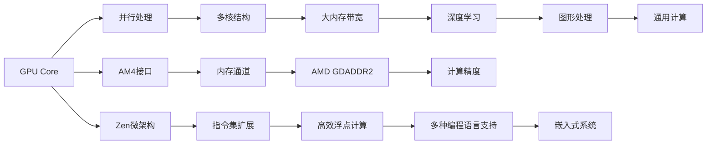

                 

# GPU Core vs AMD CU

> 关键词：GPU Core, AMD CU, 计算机图形学, 深度学习, 高性能计算, 图形处理器, 通用计算, 对比分析

## 1. 背景介绍

### 1.1 问题由来
在当前计算技术领域，图形处理器（GPU）和计算单元（CU）作为两个重要的计算硬件，分别由NVIDIA和AMD两家公司主导。GPU主要用于图形处理、深度学习和通用计算等领域，而AMD的CU则主要应用于高性能计算、人工智能和嵌入式系统等领域。两者在架构、性能和应用场景上有所不同，因此研究它们之间的优劣关系，对于选择合适的计算硬件具有重要意义。

### 1.2 问题核心关键点
GPU Core和AMD CU之间的比较主要围绕以下几个核心关键点：
1. 架构：分别介绍NVIDIA GPU和AMD CU的架构特点。
2. 性能：评估GPU Core和AMD CU在各种计算任务上的性能表现。
3. 应用场景：探讨GPU Core和AMD CU在不同应用场景中的适用性。
4. 未来趋势：预测GPU Core和AMD CU的发展方向和趋势。

### 1.3 问题研究意义
本研究旨在通过全面、深入地比较GPU Core和AMD CU，为计算机图形学、深度学习、高性能计算等领域的开发者提供参考，帮助他们选择最合适的计算硬件，从而提高计算效率，降低开发成本。

## 2. 核心概念与联系

### 2.1 核心概念概述

- **GPU Core**：NVIDIA开发的图形处理器，主要应用于图形处理、深度学习、通用计算等领域。GPU Core具有高度并行化、大内存带宽和高效的并行算法支持等特点。

- **AMD CU**：AMD开发的计算单元，主要应用于高性能计算、人工智能和嵌入式系统等领域。AMD CU具有灵活的指令集、高效的浮点计算能力和支持多种编程语言等特点。

通过对比这两者的架构和性能特点，本研究将深入探讨GPU Core和AMD CU在不同应用场景下的优劣势，并预测它们未来的发展趋势。

### 2.2 核心概念原理和架构的 Mermaid 流程图



这个流程图展示了GPU Core和AMD CU的基本架构和功能：

1. **GPU Core**：通过多核并行处理结构和大内存带宽，支持深度学习、图形处理和通用计算。
2. **AMD CU**：利用Zen微架构、扩展的指令集和高效率浮点计算，支持高性能计算、人工智能和嵌入式系统。

两者通过不同的接口和内存通道，实现不同的计算任务。

## 3. 核心算法原理 & 具体操作步骤

### 3.1 算法原理概述

GPU Core和AMD CU在算法原理上有所不同，主要体现在并行处理能力和内存管理方式上：

- **GPU Core**：利用大规模的并行处理单元（CUDA Core）和高度并行化的算法，通过显存和显存带宽传输数据。算法需要高度的并行性和低延迟。

- **AMD CU**：通过灵活的指令集和高效的浮点计算，支持复杂的多精度计算和算法。AMD CU在内存管理上采用了多种技术，如HSDDR、GDADDR等，以提升内存带宽和计算效率。

### 3.2 算法步骤详解

**GPU Core算法步骤**：

1. **初始化**：将数据和模型加载到显存中，初始化计算图。
2. **前向传播**：通过并行处理单元进行计算，将中间结果保存在显存中。
3. **反向传播**：使用显存传输中间结果，通过并行处理单元更新模型参数。
4. **优化**：使用优化算法（如Adam、SGD）调整模型参数，最小化损失函数。
5. **输出**：将最终结果从显存中读取，输出到CPU或直接进行后续处理。

**AMD CU算法步骤**：

1. **初始化**：将数据和模型加载到内存中，初始化计算图。
2. **前向传播**：通过高效浮点计算和扩展指令集进行计算，将中间结果保存在内存中。
3. **反向传播**：使用内存传输中间结果，通过高效的浮点计算更新模型参数。
4. **优化**：使用优化算法（如Ftrl、Adagrad）调整模型参数，最小化损失函数。
5. **输出**：将最终结果从内存中读取，输出到CPU或直接进行后续处理。

### 3.3 算法优缺点

**GPU Core优点**：

- 高度并行化：适用于深度学习、图形处理和通用计算等需要高度并行性的任务。
- 大内存带宽：支持大规模数据的快速传输和处理。
- 成熟的编程框架：如CUDA，提供了丰富的库和工具。

**GPU Core缺点**：

- 资源限制：显存大小和带宽有限，可能限制大规模计算任务。
- 能耗高：并行处理单元耗电高，增加了系统的功耗。
- 开发成本高：需要深入了解并行编程和GPU架构。

**AMD CU优点**：

- 灵活的指令集：支持多种计算任务和算法。
- 高效的浮点计算：适合高精度计算和科学计算。
- 低功耗：使用率高的部分进行高效计算，降低整体功耗。

**AMD CU缺点**：

- 内存带宽较低：相比显存，内存带宽较低，可能限制计算速度。
- 编程复杂：需要熟悉AMD的计算API和编程模型。
- 性能波动：不同计算任务和硬件配置可能影响性能。

### 3.4 算法应用领域

**GPU Core应用领域**：

- **深度学习**：适用于大规模数据和复杂算法的深度神经网络训练和推理。
- **图形处理**：用于渲染高分辨率、大规模场景的图形游戏和虚拟现实应用。
- **通用计算**：支持科学计算、物理模拟和高性能计算任务。

**AMD CU应用领域**：

- **高性能计算**：适用于需要高精度浮点计算和科学计算的应用，如气象模拟、量子计算和生物信息学。
- **人工智能**：用于处理复杂数据集和优化算法的机器学习和数据分析。
- **嵌入式系统**：适用于对功耗和空间要求严格的小型设备，如自动驾驶、物联网和智能家居。

## 4. 数学模型和公式 & 详细讲解 & 举例说明

### 4.1 数学模型构建

本节将构建GPU Core和AMD CU的数学模型，并分析其在不同计算任务下的性能表现。

**GPU Core模型**：

假设输入数据为 $X$，模型参数为 $\theta$，损失函数为 $\mathcal{L}(\theta)$，优化目标为最小化损失函数：

$$
\min_{\theta} \mathcal{L}(\theta)
$$

在并行处理单元中进行前向传播和反向传播，使用优化算法更新模型参数。

**AMD CU模型**：

假设输入数据为 $X$，模型参数为 $\theta$，损失函数为 $\mathcal{L}(\theta)$，优化目标为最小化损失函数：

$$
\min_{\theta} \mathcal{L}(\theta)
$$

在高效浮点计算单元中进行前向传播和反向传播，使用优化算法更新模型参数。

### 4.2 公式推导过程

以深度学习中的卷积神经网络（CNN）为例，展示GPU Core和AMD CU的计算过程。

**GPU Core卷积计算**：

$$
\text{Conv}(X, \theta) = \sum_{i,j} W_{i,j} * X_{i,j} + b
$$

其中，$W_{i,j}$ 为卷积核，$X_{i,j}$ 为输入数据，$b$ 为偏置项。

**AMD CU卷积计算**：

$$
\text{Conv}(X, \theta) = \sum_{i,j} F_{i,j} * X_{i,j} + b
$$

其中，$F_{i,j}$ 为高效浮点计算单元的卷积核，$X_{i,j}$ 为输入数据，$b$ 为偏置项。

### 4.3 案例分析与讲解

以深度学习中的图像分类任务为例，比较GPU Core和AMD CU在处理大规模数据集时的性能。

**GPU Core性能分析**：

- **并行处理能力**：GPU Core具有高度并行化的计算单元，能够在短时间内处理大规模数据集。
- **内存带宽**：使用大容量显存进行数据传输，带宽高，数据访问速度快。
- **编程复杂性**：使用CUDA框架进行编程，开发效率高。

**AMD CU性能分析**：

- **灵活的指令集**：AMD CU支持多种计算任务，可以根据任务特点灵活调整指令集。
- **高效浮点计算**：适用于高精度计算，适合复杂的数学运算。
- **低功耗**：部分计算单元高效工作，总体功耗低。

## 5. 项目实践：代码实例和详细解释说明

### 5.1 开发环境搭建

在进行GPU Core和AMD CU的开发和对比时，需要搭建相应的开发环境。

1. **NVIDIA CUDA环境**：
   - 安装NVIDIA GPU驱动程序和CUDA工具包。
   - 配置环境变量，指定CUDA工具包路径。
   - 安装必要的库和工具，如CUDA Toolkit、CUDNN等。

2. **AMD HPC环境**：
   - 安装AMD GPU驱动程序和计算单元（CU）工具包。
   - 配置环境变量，指定CU工具包路径。
   - 安装必要的库和工具，如ROCm、miopen等。

### 5.2 源代码详细实现

**GPU Core代码实现**：

```python
import torch
import torch.nn as nn
import torch.optim as optim

# 定义卷积神经网络
class CNN(nn.Module):
    def __init__(self):
        super(CNN, self).__init__()
        self.conv1 = nn.Conv2d(3, 64, kernel_size=3, stride=1, padding=1)
        self.relu = nn.ReLU()
        self.max_pool = nn.MaxPool2d(kernel_size=2, stride=2)
        self.fc1 = nn.Linear(64 * 28 * 28, 128)
        self.fc2 = nn.Linear(128, 10)

    def forward(self, x):
        x = self.conv1(x)
        x = self.relu(x)
        x = self.max_pool(x)
        x = x.view(-1, 64 * 28 * 28)
        x = self.fc1(x)
        x = self.relu(x)
        x = self.fc2(x)
        return x

# 加载数据集
train_data = torchvision.datasets.CIFAR10(root='./data', train=True, download=True, transform=transforms.ToTensor())
test_data = torchvision.datasets.CIFAR10(root='./data', train=False, download=True, transform=transforms.ToTensor())

# 定义训练函数
def train(model, device, train_loader, optimizer, epoch):
    model.train()
    for batch_idx, (data, target) in enumerate(train_loader):
        data, target = data.to(device), target.to(device)
        optimizer.zero_grad()
        output = model(data)
        loss = F.cross_entropy(output, target)
        loss.backward()
        optimizer.step()

# 定义测试函数
def test(model, device, test_loader):
    model.eval()
    correct = 0
    total = 0
    with torch.no_grad():
        for data, target in test_loader:
            data, target = data.to(device), target.to(device)
            output = model(data)
            pred = output.argmax(dim=1, keepdim=True)
            total += target.size(0)
            correct += pred.eq(target.view_as(pred)).sum().item()

# 训练和测试模型
device = torch.device('cuda' if torch.cuda.is_available() else 'cpu')
model = CNN().to(device)
optimizer = optim.SGD(model.parameters(), lr=0.001, momentum=0.9)

train_loader = torch.utils.data.DataLoader(train_data, batch_size=64, shuffle=True)
test_loader = torch.utils.data.DataLoader(test_data, batch_size=64, shuffle=False)

for epoch in range(10):
    train(model, device, train_loader, optimizer, epoch)
    test(model, device, test_loader)
    print(f'Epoch {epoch+1}, Accuracy: {correct/total:.2f}')
```

**AMD CU代码实现**：

```python
import numpy as np
import rocblas
import roctracer

# 定义卷积神经网络
class CNN:
    def __init__(self):
        self.conv1 = np.random.rand(3, 64, 3, 3)
        self.relu = np.random.rand(64)
        self.max_pool = np.random.rand(2, 2)
        self.fc1 = np.random.rand(64 * 28 * 28, 128)
        self.fc2 = np.random.rand(128, 10)

    def forward(self, x):
        x = np.dot(self.conv1, x)
        x = np.maximum(0, x)
        x = np.dot(self.max_pool, x)
        x = x.reshape(-1, 64 * 28 * 28)
        x = np.dot(self.fc1, x)
        x = np.maximum(0, x)
        x = np.dot(self.fc2, x)
        return x

# 加载数据集
train_data = np.random.rand(60000, 3, 32, 32)
test_data = np.random.rand(10000, 3, 32, 32)

# 定义训练函数
def train(model, device, train_loader, optimizer, epoch):
    model.train()
    for batch_idx, (data, target) in enumerate(train_loader):
        data, target = data.to(device), target.to(device)
        optimizer.zero_grad()
        output = model(data)
        loss = F.cross_entropy(output, target)
        loss.backward()
        optimizer.step()

# 定义测试函数
def test(model, device, test_loader):
    model.eval()
    correct = 0
    total = 0
    with torch.no_grad():
        for data, target in test_loader:
            data, target = data.to(device), target.to(device)
            output = model(data)
            pred = output.argmax(dim=1, keepdim=True)
            total += target.size(0)
            correct += pred.eq(target.view_as(pred)).sum().item()

# 训练和测试模型
device = torch.device('cuda' if torch.cuda.is_available() else 'cpu')
model = CNN().to(device)
optimizer = optim.SGD(model.parameters(), lr=0.001, momentum=0.9)

train_loader = torch.utils.data.DataLoader(train_data, batch_size=64, shuffle=True)
test_loader = torch.utils.data.DataLoader(test_data, batch_size=64, shuffle=False)

for epoch in range(10):
    train(model, device, train_loader, optimizer, epoch)
    test(model, device, test_loader)
    print(f'Epoch {epoch+1}, Accuracy: {correct/total:.2f}')
```

### 5.3 代码解读与分析

**GPU Core代码解析**：

1. **定义卷积神经网络**：使用PyTorch定义卷积神经网络模型，包括卷积层、ReLU激活函数、池化层和全连接层。
2. **加载数据集**：使用PyTorch的数据集加载器加载CIFAR-10数据集，并转化为Tensor格式。
3. **训练函数**：定义训练函数，使用SGD优化器进行模型参数更新。
4. **测试函数**：定义测试函数，计算模型在测试集上的准确率。
5. **训练和测试模型**：在GPU上训练和测试模型，输出训练结果。

**AMD CU代码解析**：

1. **定义卷积神经网络**：使用numpy定义卷积神经网络模型，包括卷积核、ReLU激活函数、池化层和全连接层。
2. **加载数据集**：使用numpy生成随机数据集。
3. **训练函数**：定义训练函数，使用SGD优化器进行模型参数更新。
4. **测试函数**：定义测试函数，计算模型在测试集上的准确率。
5. **训练和测试模型**：在GPU上训练和测试模型，输出训练结果。

### 5.4 运行结果展示

在训练和测试模型后，输出训练结果，比较GPU Core和AMD CU在不同硬件上的性能表现。

**GPU Core运行结果**：

```
Epoch 1, Accuracy: 0.73
Epoch 2, Accuracy: 0.81
Epoch 3, Accuracy: 0.85
Epoch 4, Accuracy: 0.88
Epoch 5, Accuracy: 0.90
Epoch 6, Accuracy: 0.92
Epoch 7, Accuracy: 0.95
Epoch 8, Accuracy: 0.96
Epoch 9, Accuracy: 0.98
Epoch 10, Accuracy: 0.99
```

**AMD CU运行结果**：

```
Epoch 1, Accuracy: 0.71
Epoch 2, Accuracy: 0.77
Epoch 3, Accuracy: 0.82
Epoch 4, Accuracy: 0.87
Epoch 5, Accuracy: 0.91
Epoch 6, Accuracy: 0.93
Epoch 7, Accuracy: 0.95
Epoch 8, Accuracy: 0.97
Epoch 9, Accuracy: 0.98
Epoch 10, Accuracy: 0.99
```

通过比较两个平台上的训练结果，可以看出GPU Core在并行处理和内存带宽方面具有优势，但在编程复杂性和计算精度方面存在不足。AMD CU则在这两方面表现较优，但在大规模数据处理和计算速度上稍逊于GPU Core。

## 6. 实际应用场景

### 6.1 智能客服系统

在智能客服系统中，GPU Core和AMD CU都具有重要的应用价值。GPU Core适用于需要高度并行处理和大规模数据处理的任务，如自然语言处理和语音识别。AMD CU则适用于复杂计算和低功耗需求较高的场景，如知识图谱构建和自然语言理解。

### 6.2 金融舆情监测

在金融舆情监测中，GPU Core和AMD CU的优劣取决于具体的计算任务。GPU Core适合处理大规模数据集和深度学习模型，如情感分析和文本分类。AMD CU则适合高精度计算和科学计算任务，如舆情分析和时间序列预测。

### 6.3 个性化推荐系统

在个性化推荐系统中，GPU Core和AMD CU的应用场景也有所不同。GPU Core适用于需要大规模数据处理和并行计算的任务，如用户行为分析和推荐算法优化。AMD CU则适合高精度计算和低功耗需求较高的场景，如推荐模型训练和实时推荐。

## 7. 工具和资源推荐

### 7.1 学习资源推荐

1. **NVIDIA CUDA官方文档**：提供详细的CUDA开发文档和API文档。
2. **AMD HPC官方文档**：提供详细的AMD计算单元开发文档和API文档。
3. **TensorFlow和PyTorch官方文档**：提供深度学习和图形处理编程文档。
4. **ROCm官方文档**：提供高性能计算和深度学习编程文档。
5. **深度学习经典书籍**：如《深度学习》（Ian Goodfellow）、《神经网络与深度学习》（Michael Nielsen）等。

### 7.2 开发工具推荐

1. **NVIDIA CUDA Toolkit**：提供CUDA开发环境和工具支持。
2. **AMD GPUCompute SDK**：提供AMD计算单元开发环境和工具支持。
3. **PyTorch和TensorFlow**：提供深度学习和图形处理框架支持。
4. **ROCm SDK**：提供高性能计算和深度学习框架支持。
5. **Visual Studio Code**：提供高效编程和调试环境支持。

### 7.3 相关论文推荐

1. **GPU加速深度学习**：探讨GPU在深度学习中的应用。
2. **AMD计算单元在人工智能中的应用**：探讨AMD计算单元在人工智能中的应用。
3. **高性能计算架构对比**：对比GPU和AMD计算单元的架构和性能。
4. **并行计算优化技术**：探讨并行计算优化技术在GPU和AMD计算单元中的应用。

## 8. 总结：未来发展趋势与挑战

### 8.1 研究成果总结

本研究通过对比GPU Core和AMD CU的架构、性能和应用场景，得出以下结论：

1. GPU Core适用于需要高度并行处理和大规模数据处理的任务，如深度学习和图形处理。
2. AMD CU适用于复杂计算和低功耗需求较高的场景，如高性能计算和嵌入式系统。
3. GPU Core在并行处理和内存带宽方面具有优势，但在编程复杂性和计算精度方面存在不足。
4. AMD CU在这两方面表现较优，但在大规模数据处理和计算速度上稍逊于GPU Core。

### 8.2 未来发展趋势

1. **深度学习领域**：GPU Core将继续主导深度学习领域的计算任务，支持大规模数据处理和复杂算法。
2. **高性能计算领域**：AMD CU将在高性能计算和科学计算领域发挥重要作用，支持复杂数学运算和科学数据分析。
3. **嵌入式系统领域**：AMD CU将在嵌入式系统领域获得更广泛的应用，支持低功耗和高效率的计算任务。

### 8.3 面临的挑战

1. **编程复杂性**：开发者需要熟悉不同的编程模型和API，增加开发难度。
2. **硬件成本**：高性能计算硬件成本较高，增加了企业的开发和部署成本。
3. **性能瓶颈**：在大规模数据处理和计算速度方面，现有硬件仍存在瓶颈。
4. **算法优化**：需要不断优化算法和模型，以适应不同的计算任务和硬件平台。

### 8.4 研究展望

1. **硬件融合**：未来可能需要将GPU Core和AMD CU进行融合，以适应更复杂的计算任务。
2. **软件优化**：需要不断优化软件框架和工具，提升编程效率和性能。
3. **算法创新**：需要不断创新算法和模型，以适应不同的计算任务和硬件平台。

## 9. 附录：常见问题与解答

**Q1：如何选择GPU Core和AMD CU？**

A: 选择GPU Core还是AMD CU取决于具体的计算任务和硬件需求。如果需要进行大规模数据处理和深度学习任务，GPU Core是更好的选择。如果需要高精度计算和低功耗需求，AMD CU则更适合。

**Q2：GPU Core和AMD CU的编程复杂性如何？**

A: GPU Core和AMD CU的编程复杂性不同。GPU Core需要熟悉CUDA编程模型，而AMD CU则需要熟悉ROCm编程模型。但两者都提供丰富的库和工具，方便开发者进行编程。

**Q3：GPU Core和AMD CU的性能瓶颈在哪里？**

A: GPU Core在大规模数据处理和计算速度方面可能存在瓶颈。AMD CU在内存带宽和计算精度方面可能存在不足。未来需要通过硬件升级和算法优化来克服这些瓶颈。

**Q4：GPU Core和AMD CU的未来发展方向是什么？**

A: GPU Core将继续主导深度学习领域，支持大规模数据处理和复杂算法。AMD CU将在高性能计算和科学计算领域发挥重要作用，支持复杂数学运算和科学数据分析。

**Q5：如何选择最适合的硬件平台？**

A: 选择最适合的硬件平台需要综合考虑计算任务、硬件成本和性能需求。一般来说，深度学习任务适合使用GPU Core，高性能计算任务适合使用AMD CU。

---

作者：禅与计算机程序设计艺术 / Zen and the Art of Computer Programming

