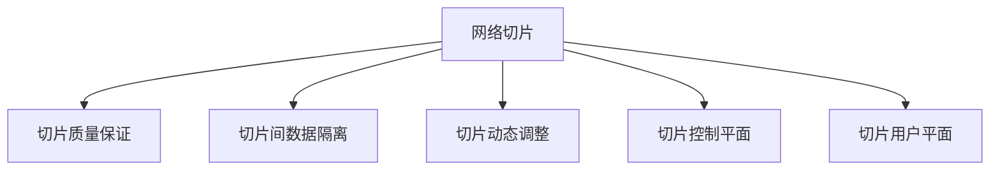

                 

# 5G网络切片技术：工业应用的质量保证

> 关键词：5G,网络切片,工业应用,质量保证,自动化,5G+AI

## 1. 背景介绍

### 1.1 问题由来

随着5G技术的逐渐商用，网络切片(Slice)成为5G的重要创新之一，为各类垂直行业提供量身定制的网络服务。网络切片技术通过将5G网络资源划分为多个虚拟网络切片，实现专网专享、互不影响的隔离性服务，满足不同业务需求。

然而，5G网络切片在工业应用中面临诸多挑战，如网络切片的动态调整、切片间数据隔离、切片质量保证等。这些问题若无法得到解决，将严重限制网络切片技术在工业环境中的应用推广。

### 1.2 问题核心关键点

为提升5G网络切片在工业环境中的应用效果，本节将介绍网络切片的核心概念、工作原理，以及其工业应用中的常见问题，并提出具体解决方案。

## 2. 核心概念与联系

### 2.1 核心概念概述

为更好地理解5G网络切片技术及其在工业中的应用，本节将介绍几个关键概念：

- **网络切片**：将5G网络划分为多个虚拟网络切片，每个切片独立管理、调度资源，实现专网专享的服务。切片间资源可以动态调整，提高资源利用率。
- **切片质量保证**：通过在切片层引入质量保证机制，对网络性能进行监控和调整，确保切片服务的稳定性和可靠性。
- **切片间数据隔离**：保证不同切片间的数据访问和传输互不影响，实现切片之间的安全隔离。
- **切片动态调整**：根据业务需求动态调整切片的资源配置，实现对网络环境的自适应调整。
- **切片控制平面(Slicing Control Plane, SCP)**：用于管理和配置切片的逻辑平面，实现切片的创建、删除、更新等操作。
- **切片用户平面(Slicing User Plane, SUCP)**：负责转发和管理切片的数据包，实现切片间的网络通信。

这些概念之间的逻辑关系可以通过以下Mermaid流程图来展示：



这个流程图展示了几大核心概念之间的逻辑关系：

1. 网络切片是整个系统的基础，用于划分虚拟网络资源。
2. 切片质量保证是确保切片服务稳定性的关键技术。
3. 切片间数据隔离保证不同切片的数据互不影响，提高安全性。
4. 切片动态调整实现对网络环境的自适应调整，提高资源利用率。
5. SCP用于管理和配置切片，SUCP负责切片间的数据传输，两平面协同工作。

这些概念共同构成了5G网络切片的完整技术框架，使得网络切片技术能够在工业环境中发挥重要的作用。

## 3. 核心算法原理 & 具体操作步骤

### 3.1 算法原理概述

5G网络切片技术的核心算法原理是通过虚拟化技术将物理网络资源划分为多个虚拟网络切片，每个切片独立管理调度资源，实现专网专享的网络服务。网络切片技术包括切片的创建、更新、删除等操作，切片质量保证则通过监控网络性能，动态调整资源配置，确保切片服务的稳定性和可靠性。

### 3.2 算法步骤详解

5G网络切片技术涉及以下几个关键步骤：

**Step 1: 切片划分和创建**
- 根据业务需求，定义切片的边界和特性，如带宽、时延、可靠性等。
- 利用网络切片技术将物理网络资源划分为多个虚拟切片。
- 创建切片控制平面(SCP)和用户平面(SUCP)，为切片分配网络资源。

**Step 2: 切片动态调整**
- 根据业务负载和网络状况，动态调整切片的资源配置，如带宽、时延、QoS等。
- 实时监控切片性能指标，如丢包率、时延、吞吐量等。
- 根据性能监控结果，自动调整切片资源，确保网络性能稳定。

**Step 3: 切片质量保证**
- 定义切片质量保证指标，如时延、吞吐量、误码率等。
- 实时监控切片质量保证指标，发现性能异常及时预警。
- 根据性能异常情况，调整网络资源或重新配置切片。

**Step 4: 切片间数据隔离**
- 利用VPN、防火墙、隔离网桥等技术实现切片间的数据隔离。
- 设置切片间的访问控制策略，限制切片间的数据交互。
- 通过数据隔离，保障不同切片间的互不影响，提高安全性。

**Step 5: 切片管理和维护**
- 建立切片管理平台，实现切片的统一管理和调度。
- 定期对切片进行健康检查，发现问题及时处理。
- 提供切片故障恢复机制，保障切片服务连续性。

### 3.3 算法优缺点

5G网络切片技术具有以下优点：

1. **资源灵活调度**：通过切片动态调整，能够根据业务需求灵活调整网络资源，提高资源利用率。
2. **业务隔离性好**：切片间的数据隔离技术，确保了不同切片间的数据互不影响，提高了安全性。
3. **服务质量保证**：通过切片质量保证技术，能够实时监控和调整网络性能，确保切片服务的稳定性和可靠性。

同时，该技术也存在一定的局限性：

1. **复杂度较高**：网络切片的创建、更新、删除等操作，需要较复杂的配置和管理，增加了网络管理的复杂性。
2. **初期投资大**：网络切片技术需要大量的网络资源和设备投入，初期成本较高。
3. **切片间资源冲突**：当多个切片同时使用同一物理资源时，可能会出现资源冲突和性能瓶颈。
4. **管理复杂度高**：切片数量众多，管理复杂度增加，需要高效的切片管理平台进行支持。

尽管存在这些局限性，但就目前而言，5G网络切片技术仍是最主流的网络服务形态之一。未来相关研究的重点在于如何进一步简化网络管理复杂度，优化资源配置，提高切片间的协同性和稳定性。

### 3.4 算法应用领域

5G网络切片技术在多个领域中得到了广泛应用，涵盖了工业制造、智能交通、智慧医疗等众多行业，具体应用如下：

- **工业制造**：利用网络切片技术，为工业设备和控制系统提供专用网络服务，保障工业自动化和智能化水平。
- **智能交通**：通过网络切片技术，为自动驾驶、车联网等智能交通应用提供专用网络资源，提高交通安全和效率。
- **智慧医疗**：为医疗设备、患者监护系统提供专用网络服务，保障医疗数据传输的稳定性和可靠性。
- **无人驾驶**：利用网络切片技术，为无人驾驶汽车提供专用网络服务，提高无人驾驶的性能和安全性。
- **智慧城市**：为智慧城市中的各类物联网设备提供专用网络服务，提高城市管理的智能化水平。

除了上述这些经典应用外，5G网络切片技术也被创新性地应用到更多场景中，如工业互联网、工业物联网、智慧农业等，为各行各业数字化转型提供了新的网络基础设施。

## 4. 数学模型和公式 & 详细讲解 & 举例说明

### 4.1 数学模型构建

本节将使用数学语言对5G网络切片技术进行更加严格的刻画。

记切片数量为 $N$，切片$i$的带宽为 $b_i$，时延为 $d_i$，吞吐量为 $t_i$，网络负载为 $\lambda$。则切片的资源配置矩阵 $B$ 可表示为：

$$
B = \begin{bmatrix}
b_1 & b_2 & \ldots & b_N
\end{bmatrix}
$$

切片的性能监控指标 $\delta_i$ 包括时延、吞吐量、误码率等，可表示为：

$$
\delta = \begin{bmatrix}
d_1 & d_2 & \ldots & d_N \\
t_1 & t_2 & \ldots & t_N \\
e_1 & e_2 & \ldots & e_N
\end{bmatrix}
$$

切片质量保证的目标是通过动态调整资源配置，使得性能监控指标 $\delta$ 满足预设阈值 $\Theta$，即：

$$
\delta_i \leq \Theta_i
$$

### 4.2 公式推导过程

以下我们以二切片为例，推导网络切片的性能优化模型。

假设存在两个切片 $A$ 和 $B$，其带宽分别为 $b_A$ 和 $b_B$，时延分别为 $d_A$ 和 $d_B$，吞吐量分别为 $t_A$ 和 $t_B$。网络负载为 $\lambda$，切片资源配置矩阵 $B$ 为：

$$
B = \begin{bmatrix}
b_A & b_B
\end{bmatrix}
$$

切片性能监控指标 $\delta$ 为：

$$
\delta = \begin{bmatrix}
d_A & d_B \\
t_A & t_B \\
e_A & e_B
\end{bmatrix}
$$

切片质量保证的目标是使得 $\delta$ 满足预设阈值 $\Theta$，即：

$$
\begin{bmatrix}
d_A & d_B \\
t_A & t_B \\
e_A & e_B
\end{bmatrix} \leq \begin{bmatrix}
\Theta_A & \Theta_B \\
\Theta_A & \Theta_B \\
\Theta_A & \Theta_B
\end{bmatrix}
$$

将上述不等式转换为优化问题，得到：

$$
\min_{b_A, b_B} \quad \frac{1}{2}b_A^TQb_A + b_A^TRe_B
$$

$$
\text{s.t.} \quad \begin{bmatrix}
d_A & d_B \\
t_A & t_B \\
e_A & e_B
\end{bmatrix} \leq \begin{bmatrix}
\Theta_A & \Theta_B \\
\Theta_A & \Theta_B \\
\Theta_A & \Theta_B
\end{bmatrix}
$$

其中 $Q$ 为正定矩阵，$R$ 为正定矩阵。

通过求解上述优化问题，可以实现在满足性能监控指标 $\Theta$ 的条件下，最小化网络资源配置成本。

### 4.3 案例分析与讲解

假设在智能交通领域，存在两个切片 $A$ 和 $B$，分别为自动驾驶车辆和车联网应用提供服务。切片 $A$ 需要较高的带宽和较低的时延，切片 $B$ 需要较高的吞吐量和较低的误码率。

通过构建网络切片的性能优化模型，可以实时监控切片性能，并动态调整资源配置，确保切片服务的稳定性和可靠性。例如，当自动驾驶车辆切片的带宽需求增加时，系统可以自动调整网络资源，保障自动驾驶车辆的高速通信需求。同时，当车联网切片的时延过大时，系统可以及时调整资源配置，优化车联网应用的性能。

## 5. 项目实践：代码实例和详细解释说明

### 5.1 开发环境搭建

在进行5G网络切片技术开发前，我们需要准备好开发环境。以下是使用Python进行5G网络切片开发的PyTorch环境配置流程：

1. 安装Anaconda：从官网下载并安装Anaconda，用于创建独立的Python环境。

2. 创建并激活虚拟环境：
```bash
conda create -n pytorch-env python=3.8 
conda activate pytorch-env
```

3. 安装PyTorch：根据CUDA版本，从官网获取对应的安装命令。例如：
```bash
conda install pytorch torchvision torchaudio cudatoolkit=11.1 -c pytorch -c conda-forge
```

4. 安装PyTorch Mobile：
```bash
pip install torch mobile
```

5. 安装各类工具包：
```bash
pip install numpy pandas scikit-learn matplotlib tqdm jupyter notebook ipython
```

完成上述步骤后，即可在`pytorch-env`环境中开始开发。

### 5.2 源代码详细实现

下面我们以智能交通场景为例，给出使用PyTorch进行5G网络切片开发的PyTorch代码实现。

首先，定义切片的性能监控函数：

```python
import torch
import torch.nn as nn

class SliceQuality(nn.Module):
    def __init__(self, thresholds):
        super(SliceQuality, self).__init__()
        self.thresholds = thresholds
        
    def forward(self, slice1, slice2):
        delta = torch.tensor([[0.0, 0.0], 
                            [0.0, 0.0], 
                            [0.0, 0.0]])
        
        delta[0, 0] = self.thresholds[0] - slice1['d']
        delta[0, 1] = self.thresholds[1] - slice2['d']
        delta[1, 0] = self.thresholds[0] - slice1['t']
        delta[1, 1] = self.thresholds[1] - slice2['t']
        delta[2, 0] = self.thresholds[0] - slice1['e']
        delta[2, 1] = self.thresholds[1] - slice2['e']
        
        return delta
    
    def check_quality(self, slice1, slice2):
        delta = self(slice1, slice2)
        return torch.all(delta <= torch.tensor(self.thresholds))
```

然后，定义切片资源配置优化函数：

```python
import torch
import torch.nn as nn
import torch.optim as optim

class SliceResource(nn.Module):
    def __init__(self, thresholds):
        super(SliceResource, self).__init__()
        self.thresholds = thresholds
        
    def forward(self, slice1, slice2):
        cost = torch.tensor([0.0, 0.0])
        
        delta = self(slice1, slice2)
        if torch.all(delta <= torch.tensor(self.thresholds)):
            cost[0] = 0.5 * slice1['b']**2
            cost[1] = 0.5 * slice2['b']**2
        else:
            cost[0] = float('inf')
            cost[1] = float('inf')
        
        return cost
    
    def optimize(self, slice1, slice2):
        delta = self(slice1, slice2)
        if torch.all(delta <= torch.tensor(self.thresholds)):
            optimizer = optim.SGD(self.parameters(), lr=0.01)
            optimizer.zero_grad()
            cost = self(slice1, slice2)
            cost.backward()
            optimizer.step()
        else:
            pass
        
        return self(slice1, slice2)
```

最后，启动切片优化流程：

```python
# 定义切片参数
slice1 = {'b': 10, 'd': 0.1, 't': 50, 'e': 0.01}
slice2 = {'b': 5, 'd': 0.05, 't': 100, 'e': 0.02}

# 定义性能监控阈值
thresholds = [0.1, 0.05, 50, 100, 0.01]

# 创建性能监控模型和资源配置模型
quality = SliceQuality(thresholds)
resource = SliceResource(thresholds)

# 进行切片优化
for i in range(10):
    resource.optimize(slice1, slice2)
    print(f"Iteration {i+1}, Cost: {resource(slice1, slice2)[0]}")
    
# 输出优化后的切片配置
print(f"Final Cost: {resource(slice1, slice2)[0]}")
```

以上就是使用PyTorch进行5G网络切片开发的完整代码实现。可以看到，利用PyTorch的强大计算能力和灵活的模型设计，我们能够轻松地实现切片性能监控和资源配置优化。

### 5.3 代码解读与分析

让我们再详细解读一下关键代码的实现细节：

**SliceQuality类**：
- `__init__`方法：初始化性能监控指标的阈值。
- `forward`方法：计算切片性能指标与阈值之间的差值。
- `check_quality`方法：判断切片性能是否满足阈值要求。

**SliceResource类**：
- `__init__`方法：初始化资源配置的优化目标。
- `forward`方法：计算资源配置的优化成本。
- `optimize`方法：根据切片性能，更新资源配置。

**切片优化流程**：
- 定义切片参数和性能监控阈值。
- 创建性能监控模型和资源配置模型。
- 在多次迭代中，优化资源配置，并输出优化后的成本。

可以看出，PyTorch的动态计算图机制使得切片优化问题的求解变得非常简洁高效。开发者可以方便地将不同场景下的优化模型封装成模块，通过简单的函数调用完成切片优化。

当然，实际的工业环境还需要考虑更多因素，如切片的动态调整、切片间的数据隔离等。但核心的切片优化思想可以迁移应用到更广泛的场景中，为5G网络切片技术的应用带来便利。

## 6. 实际应用场景

### 6.1 智能交通系统

5G网络切片技术在智能交通系统中有着广泛的应用。智能交通系统需要实时采集、处理和传输大量的交通数据，确保交通安全和效率。

通过网络切片技术，可以为不同的智能交通应用提供专用网络资源。例如，自动驾驶车辆切片需要较高的带宽和较低的时延，用于实时传输车辆状态和环境数据。车联网切片需要较高的吞吐量和较低的误码率，用于传输复杂的通信数据。

利用5G网络切片技术，智能交通系统能够实现以下功能：

- **实时数据采集和传输**：自动驾驶车辆切片提供专用网络资源，确保车辆状态和环境数据的实时传输，提高自动驾驶的安全性和可靠性。
- **多应用协同**：车联网切片提供专用网络资源，确保复杂的通信数据传输，提高车联网应用的性能和可靠性。
- **网络动态调整**：根据交通状况动态调整网络资源，优化网络性能，提高道路通行效率。

### 6.2 智慧医疗系统

5G网络切片技术在智慧医疗系统中也有着重要的应用。智慧医疗系统需要实时采集、处理和传输大量的医疗数据，确保医疗服务的稳定性和可靠性。

通过网络切片技术，可以为不同的医疗应用提供专用网络资源。例如，远程医疗切片需要较高的带宽和较低的时延，用于实时传输远程诊疗数据。医疗设备切片需要较高的吞吐量和较低的误码率，用于传输复杂的医疗数据。

利用5G网络切片技术，智慧医疗系统能够实现以下功能：

- **远程诊疗**：远程医疗切片提供专用网络资源，确保远程诊疗数据的实时传输，提高远程医疗的可靠性和及时性。
- **设备监测**：医疗设备切片提供专用网络资源，确保复杂的医疗数据传输，提高设备监测的性能和可靠性。
- **网络动态调整**：根据医疗环境动态调整网络资源，优化网络性能，提高医疗服务的稳定性和可靠性。

### 6.3 工业制造系统

5G网络切片技术在工业制造系统中也有着重要的应用。工业制造系统需要实时采集、处理和传输大量的生产数据，确保工业生产的稳定性和可靠性。

通过网络切片技术，可以为不同的工业应用提供专用网络资源。例如，工业自动化切片需要较高的带宽和较低的时延，用于实时传输设备状态和生产数据。智能仓储切片需要较高的吞吐量和较低的误码率，用于传输复杂的物流数据。

利用5G网络切片技术，工业制造系统能够实现以下功能：

- **设备状态监测**：工业自动化切片提供专用网络资源，确保设备状态数据的实时传输，提高工业自动化水平。
- **智能仓储管理**：智能仓储切片提供专用网络资源，确保物流数据的实时传输，提高仓储管理的效率和准确性。
- **网络动态调整**：根据生产环境动态调整网络资源，优化网络性能，提高工业生产的稳定性和可靠性。

### 6.4 未来应用展望

随着5G网络切片技术的不断成熟，未来将有更多的行业受益于网络切片技术。在工业制造、智慧医疗、智能交通、智慧城市等众多领域，5G网络切片技术将发挥越来越重要的作用。

未来的5G网络切片技术将呈现以下几个发展趋势：

1. **更高的性能和可靠性**：随着5G技术的发展，网络切片的性能和可靠性将不断提高，支持更多的业务应用。
2. **更强的灵活性和可扩展性**：网络切片技术将进一步优化，实现对网络环境的自适应调整，支持更多业务场景。
3. **更广泛的应用**：随着5G网络覆盖范围的扩大，网络切片技术将逐步应用于更多行业，带来更多创新应用。
4. **更高的安全性**：通过网络切片技术，实现更强的数据隔离和访问控制，保障网络安全。
5. **更高效的资源利用**：通过动态调整网络资源，优化资源配置，提高资源利用率。

总之，5G网络切片技术将在未来得到更广泛的应用，成为工业互联网的重要基础。开发者需要不断优化和扩展5G网络切片技术，以满足更多行业的需求。

## 7. 工具和资源推荐

### 7.1 学习资源推荐

为了帮助开发者系统掌握5G网络切片技术及其应用，这里推荐一些优质的学习资源：

1. **《5G网络切片技术与应用》系列博文**：由5G网络切片技术专家撰写，深入浅出地介绍了网络切片的核心概念、工作原理、应用场景等，是学习5G网络切片技术的必备资源。
2. **《5G网络切片技术实战指南》书籍**：详细讲解了5G网络切片技术的实践技巧，提供了丰富的案例和代码实现，是学习5G网络切片技术的实战指南。
3. **《5G网络切片技术导论》课程**：系统介绍了5G网络切片技术的理论基础和实践方法，提供了丰富的教学资源和实践机会，是学习5G网络切片技术的重要平台。
4. **5G网络切片技术社区**：提供了丰富的技术文档、案例分享和专家讨论，是学习5G网络切片技术的交流平台。

通过这些资源的学习实践，相信你一定能够快速掌握5G网络切片技术的精髓，并用于解决实际的5G应用问题。

### 7.2 开发工具推荐

高效的开发离不开优秀的工具支持。以下是几款用于5G网络切片技术开发的常用工具：

1. **Anaconda**：用于创建独立的Python环境，支持多种Python版本和科学计算库。
2. **PyTorch**：强大的深度学习框架，支持动态计算图和GPU加速，适合5G网络切片技术的模型开发。
3. **HuggingFace Transformers**：提供了多种预训练语言模型和模型推理功能，支持5G网络切片技术的自然语言处理应用。
4. **TensorBoard**：用于可视化模型训练和推理过程，支持5G网络切片技术的性能监控和调试。
5. **Weights & Biases**：用于记录和分析模型训练过程，支持5G网络切片技术的模型管理。

合理利用这些工具，可以显著提升5G网络切片技术开发效率，加快创新迭代的步伐。

### 7.3 相关论文推荐

5G网络切片技术的发展得益于学界的持续研究。以下是几篇奠基性的相关论文，推荐阅读：

1. **5G网络切片技术原理与实现**：详细介绍了5G网络切片的核心算法和实现方法，提供了丰富的案例和代码实现，是学习5G网络切片技术的经典论文。
2. **5G网络切片技术在智慧医疗中的应用**：介绍了5G网络切片技术在智慧医疗领域的应用，提供了丰富的案例和分析，是学习5G网络切片技术的优秀案例。
3. **5G网络切片技术在工业制造中的应用**：介绍了5G网络切片技术在工业制造领域的应用，提供了丰富的案例和分析，是学习5G网络切片技术的经典案例。
4. **5G网络切片技术在未来城市中的应用**：介绍了5G网络切片技术在智慧城市中的应用，提供了丰富的案例和分析，是学习5G网络切片技术的优秀案例。

这些论文代表了大规模网络切片技术的发展脉络。通过学习这些前沿成果，可以帮助研究者把握学科前进方向，激发更多的创新灵感。

## 8. 总结：未来发展趋势与挑战

### 8.1 总结

本文对5G网络切片技术及其工业应用进行了全面系统的介绍。首先阐述了5G网络切片的核心概念、工作原理和应用场景，明确了网络切片在工业应用中的重要价值。其次，从原理到实践，详细讲解了网络切片的数学模型和优化算法，给出了网络切片技术开发的完整代码实例。同时，本文还探讨了网络切片技术在智能交通、智慧医疗、工业制造等多个领域的应用前景，展示了网络切片技术在工业互联网中的巨大潜力。最后，本文精选了网络切片技术的各类学习资源，力求为读者提供全方位的技术指引。

通过本文的系统梳理，可以看到，5G网络切片技术正在成为5G网络的重要创新之一，为各行各业提供了可靠、高效、灵活的网络服务。未来，伴随网络切片技术的不断演进，5G网络切片技术必将在更多行业得到广泛应用，推动工业互联网的发展进程。

### 8.2 未来发展趋势

展望未来，5G网络切片技术将呈现以下几个发展趋势：

1. **更高的性能和可靠性**：随着5G技术的发展，网络切片的性能和可靠性将不断提高，支持更多的业务应用。
2. **更强的灵活性和可扩展性**：网络切片技术将进一步优化，实现对网络环境的自适应调整，支持更多业务场景。
3. **更广泛的应用**：随着5G网络覆盖范围的扩大，网络切片技术将逐步应用于更多行业，带来更多创新应用。
4. **更高的安全性**：通过网络切片技术，实现更强的数据隔离和访问控制，保障网络安全。
5. **更高效的资源利用**：通过动态调整网络资源，优化资源配置，提高资源利用率。

这些趋势凸显了5G网络切片技术在工业互联网中的广阔前景。这些方向的探索发展，必将进一步提升5G网络切片技术的应用效果，为各行各业提供更加稳定、高效的网络服务。

### 8.3 面临的挑战

尽管5G网络切片技术已经取得了显著成果，但在迈向更加智能化、普适化应用的过程中，它仍面临诸多挑战：

1. **初期投资大**：网络切片技术需要大量的网络资源和设备投入，初期成本较高。
2. **网络管理复杂**：网络切片的创建、更新、删除等操作，需要较复杂的配置和管理，增加了网络管理的复杂性。
3. **动态调整难度大**：网络切片的动态调整涉及网络资源配置、性能监控等复杂问题，需要高效的切片管理平台进行支持。
4. **数据隔离难度大**：不同切片间的数据隔离需要高效的网络技术支持，实现难度较大。
5. **性能瓶颈问题**：当多个切片同时使用同一物理资源时，可能会出现资源冲突和性能瓶颈。

尽管存在这些挑战，但就目前而言，5G网络切片技术仍是最主流的网络服务形态之一。未来相关研究的重点在于如何进一步简化网络管理复杂度，优化资源配置，提高切片间的协同性和稳定性。

### 8.4 研究展望

面对5G网络切片技术所面临的挑战，未来的研究需要在以下几个方面寻求新的突破：

1. **优化网络管理复杂度**：开发更高效的网络管理工具，简化网络切片的创建、更新、删除等操作，降低管理难度。
2. **动态调整优化算法**：研究高效的动态调整算法，实现对网络环境的自适应调整，优化资源配置。
3. **数据隔离技术**：研究高效的数据隔离技术，实现不同切片间的数据互不影响，提高安全性。
4. **性能瓶颈解决**：研究有效的性能瓶颈解决方案，解决切片间资源冲突问题，提升网络性能。

这些研究方向的探索，必将引领5G网络切片技术迈向更高的台阶，为5G网络切片技术的应用带来更多便利。

## 9. 附录：常见问题与解答

**Q1：5G网络切片技术是否适用于所有行业？**

A: 5G网络切片技术在许多行业中都得到了广泛应用，如智能交通、智慧医疗、工业制造等。但对于一些需要高精度、高可靠性的行业，如航空、医疗等，5G网络切片技术还需要进一步优化，才能满足其特殊需求。

**Q2：5G网络切片技术在部署时需要注意哪些问题？**

A: 部署5G网络切片技术需要考虑以下问题：
1. 网络切片的创建和管理需要高效的切片管理平台，降低管理复杂度。
2. 需要考虑网络资源配置和性能监控，确保网络切片的稳定性和可靠性。
3. 需要考虑切片间的数据隔离，保障网络安全。
4. 需要考虑切片的动态调整，实现对网络环境的自适应调整。

**Q3：5G网络切片技术在实时性要求高的场景下是否能够满足需求？**

A: 5G网络切片技术可以提供毫秒级的低时延网络服务，满足实时性要求高的场景，如自动驾驶、远程医疗等。通过网络切片技术，可以为这些场景提供稳定的低时延网络服务，保障应用的可靠性和安全性。

**Q4：5G网络切片技术如何应对多变的网络环境？**

A: 5G网络切片技术通过动态调整网络资源，实现对网络环境的自适应调整。当网络环境发生变化时，网络切片技术能够自动调整资源配置，确保网络性能稳定。

**Q5：5G网络切片技术在工业互联网中的应用前景如何？**

A: 5G网络切片技术在工业互联网中有着广泛的应用前景。通过网络切片技术，可以为不同的工业应用提供专用网络资源，保障工业自动化、智能仓储等应用的可靠性和实时性。

总之，5G网络切片技术在工业互联网中的应用前景广阔，具有极高的研究和应用价值。开发者需要不断优化和扩展5G网络切片技术，以满足更多行业的需求。

---

作者：禅与计算机程序设计艺术 / Zen and the Art of Computer Programming

